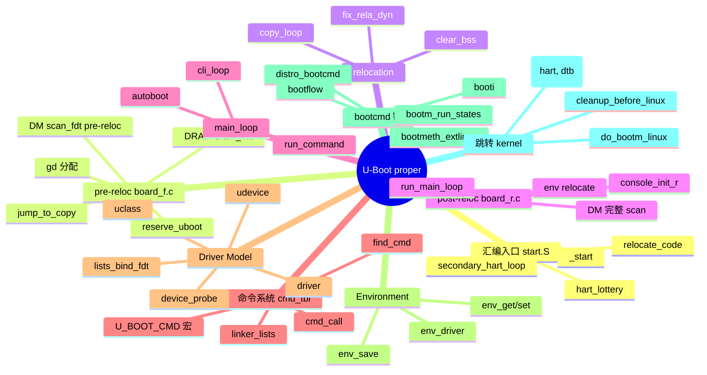
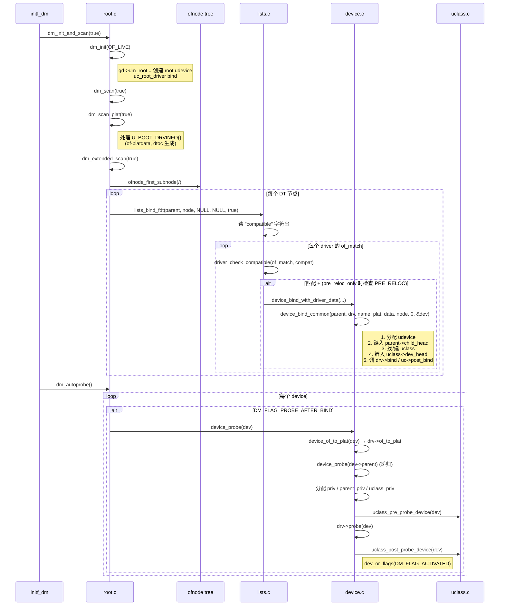
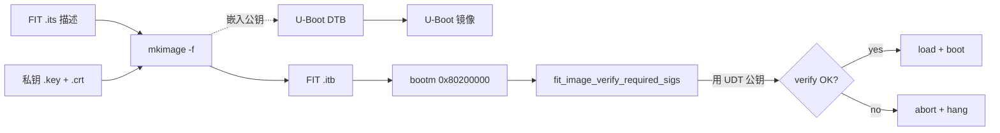
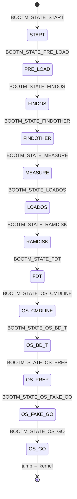
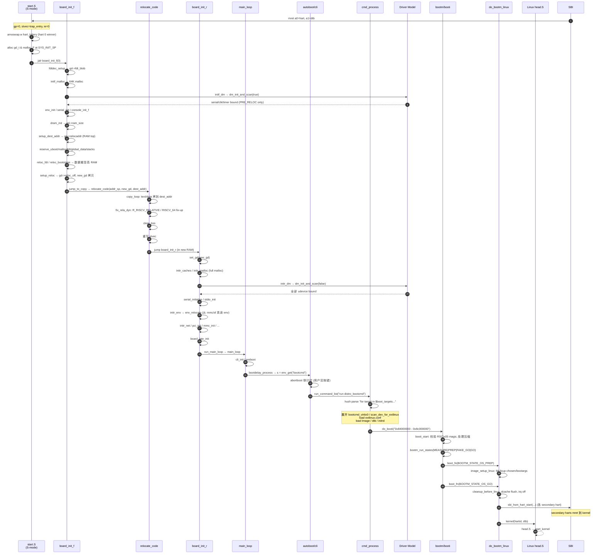

# 03-11 — U-Boot proper 源码精读：从 SBI 接力到 booti kernel

> **核心问题：**
> 1. SBI 跳进 U-Boot proper 时，`_start` 拿到的寄存器状态是什么？谁第一个写 `gp`、`sp`？为什么 hart 0 抢锁、其它 hart 进 WFI？
> 2. `board_init_f` 50+ 个 init 阶段顺序谁定？少跑一个会发生什么？为什么是 "f" / "r" 两半？
> 3. relocation 不是简单 memcpy — `__rel_dyn` 表必须重新 fix-up `R_RISCV_RELATIVE` / `R_RISCV_64`；如果跳过会发生什么？
> 4. `cmd_tbl` 通过链接器段 (`__u_boot_list_2_cmd_1` / `..._2_cmd_3`) 静态生成 — 不是运行时注册；这跟 Linux `module_init()` / Linux 的 `__initcall` 区别在哪？为什么这种实现适合裸机但不适合普通 OS？
> 5. Driver Model 的 udevice / driver / uclass 三件套到底解决了什么问题？跟 Linux device-driver-bus 三元组、Zephyr struct device、tg-rcore 自己手写 driver 有何异同？
> 6. `bootcmd` → `distro_bootcmd` → `bootcmd_virtio0` → `sysboot extlinux.conf` → `booti $kernel_addr_r - $fdt_addr_r` —— 一条命令是怎么从字符串膨胀成"读 ext4 / 解 FIT / fixup FDT / `mret` 给 Linux"的？
> 7. RISC-V 跟 ARM64 在 proper 这一层差异有多大？为什么 RISC-V `do_bootm_linux` 只有 99 行而 ARM64 要折腾 cleanup_before_linux + cache flush + EL2 切换？
>
> **本笔记定位：** [03-06 U-Boot 全局总揽](./03-06-u-boot-overview.md) §4 的源码深化版。03-06 给的是"地图"，本篇给"地图上每条路的施工日志"。读完应能自己造一个最简 KuBoot proper（DRAM 已就绪假设下），不再依赖任何 U-Boot 源码 copy-paste。
>
> **注：** 本笔记不重复 03-06 §4 的章节结构内容（启动流程、Driver Model、Environment 等的概念性描述），而是直接进源码、追行号、解释每一行存在的理由。



---

## 0. 阅读前置

### 0.1 假设

读者已掌握：
- [02-01 RISC-V 全栈启动链与 SBI](./02-01-boot-chain-and-sbi.md)：M-mode→S-mode 切换、`mret`、`mhartid` / `mscratch`
- [03-03 FDT 与 DTS 在 boot 到内核的传递过程](./03-03-fdt-dts-boot-flow.md)：DTB 物理布局
- [03-06 §4 U-Boot proper 深入](./03-06-u-boot-overview.md#4-u-boot-proper-深入)：proper 阶段的概念分层

### 0.2 源码目录速查（仅 proper 必读路径）

```text
boot/u-boot/                                      # 主线 6 月头
├── arch/riscv/
│   ├── cpu/start.S                               # 465 行 ← proper 入口（CONFIG_XPL_BUILD 不同分支）
│   ├── cpu/cpu.c                                 # 754 行 ← cleanup_before_linux / arch_cpu_init
│   ├── lib/board.c                               # 19 行 ← arch_setup_gd（gp 设置）
│   ├── lib/image.c                               # 63 行 ← booti_setup（Linux RISC-V Image 头解析）
│   ├── lib/bootm.c                               # 99 行 ← do_bootm_linux（最终跳转）
│   ├── lib/sbi.c                                 # ECALL 给 OpenSBI 用
│   └── lib/smp.c                                 # IPI 给次级 hart
├── common/
│   ├── board_f.c                                 # 1091 行 ← board_init_f + initcall_run_f
│   ├── board_r.c                                 # 810  行 ← board_init_r + initcall_run_r
│   ├── main.c                                    # 89   行 ← main_loop
│   ├── cli.c                                     # 342  行 ← run_command / cli_loop
│   ├── command.c                                 # 675  行 ← find_cmd / cmd_call / cmd_process
│   ├── autoboot.c                                # 528  行 ← bootdelay_process / autoboot_command
│   ├── cli_simple.c                              # 348  行 ← 不带 hush 时的最小 parser
│   ├── cli_hush_modern.c                         # 323  行 ← 2021 hush parser
│   └── cli_readline.c                            # 681  行 ← 行编辑 + history
├── drivers/core/
│   ├── root.c                                    # 479  行 ← dm_init_and_scan / dm_scan_fdt
│   ├── lists.c                                   # 290  行 ← lists_bind_fdt（compatible match）
│   ├── device.c                                  # 1281 行 ← device_bind_common / device_probe
│   ├── uclass.c                                  # 860  行 ← uclass_get / uclass_*_device
│   └── ofnode.c / read.c                         # ofnode 抽象（live tree 与 fdtdec 双形态）
├── boot/
│   ├── bootm.c                                   # 1294 行 ← bootm_run_states 状态机
│   ├── image-fit.c                               # 2644 行 ← FIT 镜像加载/校验
│   ├── image-fdt.c                               # FDT relocation + chosen 节点 fixup
│   ├── bootflow.c / bootstd-uclass.c             # bootstd 框架
│   ├── bootmeth_extlinux.c                       # 386 行 ← /boot/extlinux/extlinux.conf
│   ├── bootmeth_efi.c                            # ← UEFI 启动（grub.efi 等）
│   └── pxe_utils.c                               # syslinux/extlinux 解析器
├── cmd/
│   ├── bootm.c                                   # 582 行 ← do_bootm（命令）
│   ├── booti.c                                   # 178 行 ← do_booti（Linux Image 直跳）
│   └── bootflow.c                                # 638 行 ← bootflow scan/list/select/boot
├── env/
│   ├── env.c / env_common.c / common.c           # env_get / env_set / env_save 入口
│   ├── nowhere.c / nvram.c                       # 不持久化
│   ├── mmc.c / mtd.c / nand.c / sf.c / ext4.c    # 持久化后端
│   └── flags.c / callback.c / attr.c             # type/access/callback 系统
├── include/
│   ├── command.h                                 # struct cmd_tbl + U_BOOT_CMD 宏
│   ├── asm-generic/global_data.h                 # 709 行 ← struct global_data + GD_FLG_*
│   ├── asm-generic/u-boot.h                      # struct bd_info
│   ├── dm/device.h                               # 1081 行 ← struct udevice + struct driver
│   ├── dm/uclass.h                               # 552 行 ← struct uclass + struct uclass_driver
│   ├── dm/uclass-id.h                            # enum uclass_id（130+ uclass）
│   ├── linker_lists.h                            # ll_entry_declare / ll_entry_start
│   ├── config_distro_bootcmd.h                   # BOOTENV / distro_bootcmd 字符串膨胀器
│   ├── bootm.h / bootflow.h / bootmeth.h         # boot 流程头
│   └── configs/qemu-riscv.h                      # 45 行 ← 板级默认 env
└── configs/
    ├── sifive_unmatched_defconfig
    └── starfive_visionfive2_defconfig
```

### 0.3 配置与构建术语

| 名词 | 含义 |
|------|------|
| `CONFIG_XPL_BUILD` | 旧名 `CONFIG_SPL_BUILD`。**proper 编译时此宏未定义**。同一份 `start.S` 通过它区分 SPL/proper 分支。 |
| `CONFIG_RISCV_SMODE` / `CONFIG_RISCV_MMODE` | proper 跑 S-mode 还是 M-mode。**绝大多数实战是 S-mode**（OpenSBI 在 M-mode）。 |
| `CONFIG_OF_CONTROL` | 启用 fdtdec 配置子系统（U-Boot 自己读 DTB）。 |
| `CONFIG_OF_LIVE` | live tree（运行时把 FDT 反序列化为 `ofnode` 树）vs `fdtdec` 直接走 libfdt。 |
| `CONFIG_DM` | 启用 Driver Model。所有现代 board 都开。 |
| `CONFIG_HUSH_MODERN_PARSER` | 2021 重构后的 hush。老板子还在 `HUSH_OLD_PARSER`。 |
| `CONFIG_BOOTSTD` | "Standard Boot"（bootflow / bootmeth uclass）。新 board 推荐，逐步替代 distro_bootcmd 字符串。 |

---

## 1. proper 启动汇编 deep-dive — `arch/riscv/cpu/start.S`

> 03-06 §4.1 给了"先关中断、设栈、跳 C"的概念图。本节 **逐行翻译 465 行**，给出每条指令的"为什么"。

### 1.1 入口寄存器约定


```asm
_start:
#if CONFIG_IS_ENABLED(RISCV_MMODE)
    csrr    a0, CSR_MHARTID            ; line 43
#endif
    /* a0 = hart id (S-mode 下由 SBI 经 mret 时已写好), a1 = dtb 物理地址 */
    mv      tp, a0                     ; line 50  保存 hart id 到 tp（thread pointer）
    mv      s1, a1                     ; line 51  保存 dtb ptr 到 callee-saved s1
```

**关键约定：**
2. 在 **M-mode**（极少见，u-boot 直接是 firmware），自己 `csrr CSR_MHARTID`。
3. **`tp` 不被 C 代码污染** —— `_start.S:48` 注释明说 "thread pointer register is not modified by C code"。这就让 secondary hart 在 `secondary_hart_loop`（line 449）唤醒时仍能用 `tp` 知道自己是几号。

### 1.2 早期初始化（line 53-87）

```asm
mv      gp, zero                       ; line 58  防御性：gp 还没初始化前若早 trap，gd 至少是 NULL
la      t0, trap_entry                 ; line 64
csrw    MODE_PREFIX(tvec), t0          ; line 65  写 stvec/mtvec
csrw    MODE_PREFIX(ie), zero          ; line 72  关全部异步中断（同步异常不受这影响）
```

`MODE_PREFIX(tvec)` 宏在 `arch/riscv/include/asm/encoding.h`：S-mode 展开为 `stvec`，M-mode 展开为 `mtvec`。一份 `start.S` 服务两种模式。

**为什么 `gp = 0`？**
U-Boot 的 `gd_t *gd` 不是普通全局变量 — 它**寄存在 `gp` 寄存器里**（`arch/riscv/include/asm/global_data.h` 中 `register volatile gd_t *gd asm ("gp")`）。所有 C 代码 `gd->ram_top` 实际是 `ld rd, offset(gp)`。在 `gd` 还没分配之前若发生异常，`trap_entry` 里随便摸 `gd->...` 会读到任意地址 → 二次 fault → 死循环。提前置 0 让二次错误立即触发空指针异常，跑到 `panic` 路径。

`hart_out_of_bounds_loop`（line 426）：如果 `tp >= CONFIG_NR_CPUS`，进 wfi 死循环。**这意味着 KuBoot 的 NR_CPUS 必须 ≥ 板子实际 hart 数**，否则多余 hart 直接进 limbo。

### 1.3 栈与 hart 0 抢锁（line 92-167）

每个 hart 都跑这段代码，但只有一个 "winner" 进 C，其它进 `wait_for_gd_init`：

```asm
call_board_init_f:
#if CONFIG_IS_ENABLED(HAVE_INIT_STACK)
    li      t0, CONFIG_VAL(STACK)      ; line 94  显式给的栈顶
#else
    li      t0, SYS_INIT_SP_ADDR       ; line 96  通常 = TEXT_BASE 之上某 offset
#endif
    and     t0, t0, -16                ; line 98  16-byte 对齐（RISC-V psABI 强制）
#if CONFIG_IS_ENABLED(SMP)
    slli    t1, tp, CONFIG_STACK_SIZE_SHIFT
    sub     sp, t0, t1                 ; line 104 每 hart 一段栈
#else
    mv      sp, t0
#endif
```

**栈布局：**

```
高地址  ┌──────────────────────┐  SYS_INIT_SP_ADDR (= t0)
        │   hart 0 stack (16K) │
        ├──────────────────────┤  t0 - 16K
        │   hart 1 stack       │
        ├──────────────────────┤
        │   ...                │
        ├──────────────────────┤
        │   hart N-1 stack     │
低地址  └──────────────────────┘  reserve area（gd / malloc / fdt 等）
```

`CONFIG_STACK_SIZE_SHIFT` 通常 14（16 KiB / hart）。

#### 1.3.1 `board_init_f_alloc_reserve`（`common/init/board_init.c`）

`start.S:134` 调用 `board_init_f_alloc_reserve(top)`，从 `top` 往下倒着分配：
1. `gd_t` 本身（约 200 字节）
2. early-malloc heap（`CONFIG_SYS_MALLOC_F_LEN`，通常 64 KiB）
3. early-bloblist（如果 `CONFIG_BLOBLIST`）

返回新的 `top` 给汇编保存到 `s0`（**未来的 `gp`**）。

#### 1.3.2 hart_lottery（line 152-155）— 这就是 "boot hart 选举"

```asm
la      t0, hart_lottery
li      t1, 1
amoswap.w s2, t1, 0(t0)         ; atomic { s2 = mem[t0]; mem[t0] = t1; }
bnez    s2, wait_for_gd_init    ; 如果 s2 != 0，说明已经有人抢到了 → 我去等
```

**RISC-V `amoswap.w` 是单条 RV32A/RV64A 原子指令。** 第一个进来的 hart 读到 `s2 = 0`（lottery 初值），写入 1，继续往下；之后每个 hart 都读到 `s2 = 1`，跳到 `wait_for_gd_init`。


**XIP 例外（line 156-167）：** 如果 `CONFIG_XIP`（U-Boot 直接在 NOR Flash 里执行），跳过 lottery，secondary hart 全去 `secondary_hart_loop`（M-mode 下的特殊路径）。

### 1.4 `gd` 初始化 + FDT 地址保存（line 170-219）

```asm
mv      a0, s0                          ; line 170 boardf 区域起点
jal     board_init_f_init_reserve       ; line 171 → gd = (gd_t *)(top - sizeof(gd_t)); gd->malloc_base = ...;

SREG    s1, GD_FIRMWARE_FDT_ADDR(gp)    ; line 173 把 dtb_pa 存进 gd（GD_* 偏移由 asm-offsets.c 生成）
SREG    tp, GD_BOOT_HART(gp)            ; line 175 boot_hart 写入 gd->arch.boot_hart

#ifdef CONFIG_DEBUG_UART
jal     debug_uart_init                 ; line 214 没 console 也能 puts (低级 ns16550 直接写)
#endif

mv      a0, zero                        ; boot_flags = 0
la      t5, board_init_f
jalr    t5                              ; line 219 终于跳进 C
```

`board_init_f_init_reserve` 在 `common/init/board_init.c`，做的事：
1. 把分配的 reserve 区域清零
2. 设 `gd = (gd_t *)(reserve_base - sizeof(gd_t))`
3. **`set_gd(gd)`** — RISC-V 的实现在 `arch/riscv/lib/board.c`（19 行整文件）：

```c
// arch/riscv/lib/board.c
DECLARE_GLOBAL_DATA_PTR;

void arch_setup_gd(struct global_data *gd_ptr)
{
    gd = gd_ptr;     // 等价于 asm volatile("mv gp, %0" :: "r"(gd_ptr));
}
```

> **替代方案：** ARM 用 `r9` 寄存 gd，x86 用 `fs:` 段，sandbox 用真线程局部存储。RISC-V 选 `gp` 是因为 RV ABI 把 gp 留给 "global pointer" 优化，U-Boot 直接抢占了它（Linux 也抢，叫 `__riscv_lp64_abi`）。**KuBoot 可以保留这个约定**，因为它对编译器零侵入。

### 1.5 `relocate_code`（line 274-423）— proper 的"自我搬家术"

`board_init_f` 末尾会调 `jump_to_copy()`（在 `common/board_f.c` 后段或 arch-specific），后者最终 `jal relocate_code(addr_sp, gd, dest_addr)`。这是 U-Boot 最特别的一步：

#### 1.5.1 三参数

```asm
relocate_code:
    mv      s2, a0    ; addr_sp     新栈顶（在 RAM 高端）
    mv      s3, a1    ; new_gd      新 gd 在 RAM 里的地址（gd 自己也搬了）
    mv      s4, a2    ; addr_moni   U-Boot text 段在 RAM 的目标地址
```

#### 1.5.2 拷贝（line 300-312）

```asm
la      t0, _start
sub     t6, s4, t0       ; t6 = relocation_offset = new - old
beq     t0, s4, clear_bss  ; 如果 offset == 0 直接跳过拷贝
mv      t1, s4
la      t2, __bss_start  ; 只拷 .text + .data + .rodata，bss 不拷（反正要清零）

copy_loop:
    LREG    t5, 0(t0)
    addi    t0, t0, REGBYTES
    SREG    t5, 0(t1)
    addi    t1, t1, REGBYTES
    blt     t0, t2, copy_loop
```

**为什么不用 `memcpy`？** `memcpy` 是 C 函数，需要栈，但栈已经在 s2 指向的新地方了 — 调用 memcpy 自己就跑到新地址去了，未来 `mret` 路径会乱。这里是手写汇编 unrolled copy，确保不依赖任何 C state。

#### 1.5.3 `fix_rela_dyn`（line 317-358）— 关键中的关键

U-Boot proper 用 `-pie -fpie` 编译，链接产生 `.rela.dyn` 段记录"哪些地址需要按 load address 修补"。搬家后这些地址全变了，必须遍历重补一遍。

**RISC-V 64-bit `Elf64_Rela` 布局：**
```
+0  uint64_t  r_offset    要修补的位置
+8  uint64_t  r_info      = (sym_idx << 32) | rtype
+16 int64_t   r_addend    加数
```

```asm
6:  LREG    t5, REGBYTES(t1)         ; t5 = r_info
    li      t3, R_RISCV_RELATIVE     ; = 3
    bne     t5, t3, 8f               ; 不是 RELATIVE 跳到 8（处理 RISCV_64）
    LREG    t3, 0(t1)                ; t3 = r_offset
    LREG    t5, (REGBYTES * 2)(t1)   ; t5 = r_addend
    add     t5, t5, t6               ; 把 addend 加上 reloc_off
    add     t3, t3, t6               ; 把 offset 加上 reloc_off
    SREG    t5, 0(t3)                ; *(new_offset) = new_addend
    j       10f
```

`R_RISCV_RELATIVE` 处理形如 `static const char *str = "hello";` 的 GOT 表项 — `*offset` 直接 = `addend + load_addr`。对 `R_RISCV_64`（line 335-354）则需要查符号表 `__dyn_sym_start`，更复杂。

> **替代方案：** 不搬家，用 `CONFIG_XIP` 直接在 Flash 里跑（但那要求 Flash 提供随机访问，且 .data 仍要拷到 RAM）。或者反过来 SPL 帮 proper 链接到固定地址 — 但失去"任意 RAM 大小"灵活性。**proper 的 PIC + reloc 是 Wolfgang Denk 在 2010 年代初推动的全架构统一**（line 50-65 的注释保留了 history）。

#### 1.5.4 trap update + clear_bss + relocate_secondary_harts（line 362-401）

```asm
la      t0, trap_entry
add     t0, t0, t6               ; 重定位 trap 向量
csrw    MODE_PREFIX(tvec), t0    ; line 364 重写 stvec

clear_bss:                       ; line 366
    la      t0, __bss_start
    add     t0, t0, t6
    la      t1, __bss_end
    add     t1, t1, t6
clbss_l:
    SREG    zero, 0(t0)
    addi    t0, t0, REGBYTES
    blt     t0, t1, clbss_l
```

**bss 清零必须在 reloc 之后** — 因为现在 `__bss_start/end` 才指向 RAM 里的最终位置。

`relocate_secondary_harts`（line 378-401）通过 `smp_call_function` 给其它 hart 发 IPI，让它们也跑到 `secondary_hart_relocate`（line 432）更新自己的 sp/gp。

#### 1.5.5 `call_board_init_r`（line 407-422）

```asm
jal     invalidate_icache_all
jal     flush_dcache_all
la      t0, board_init_r        ; 注意：编译器生成的还是旧地址
add     t4, t0, t6              ; 加 reloc_off → 新地址
mv      a0, s3                  ; new_gd
mv      a1, s4                  ; dest_addr
jr      t4                      ; jump 不返回
```

至此 U-Boot 物理上"消失"于原 SBI 加载位置，全部跑在自己分配的高端 RAM 里。**SBI 占用的低端内存**（OpenSBI 通常 80000000-80200000）此时已经被 U-Boot 通过 `reserve_arch / lmb` 标为"reserved"，将来传给 Linux 的 FDT `/reserved-memory` 节点会包含这段。

---

## 2. `board_init_f` / pre-relocation — `common/board_f.c`

> 03-06 §4.1 给了概念。这里 deep-dive `initcall_run_f()` 的 50+ 个 INITCALL 顺序与每个的目的。

### 2.1 `board_init_f` 主体（line 1022-1038）

```c
void board_init_f(ulong boot_flags)
{
    struct board_f boardf;

    gd->flags = boot_flags;
    gd->flags &= ~GD_FLG_HAVE_CONSOLE;     // 还没 init console
    gd->boardf = &boardf;                  // pre-reloc 临时数据 holder

    initcall_run_f();                      // ★ 50+ 步全跑完
    /* RISC-V/ARM/SANDBOX 不会到这里 — initcall_run_f 末尾 jump_to_copy 不返回 */
    hang();
}
```

`struct board_f`（`include/board_f.h`）只在 pre-reloc 用，存 `lmb` early reservations。reloc 后 `gd->boardf = NULL`（在 `setup_reloc` 里清掉，这就是 line 1015-1019 的 `cyclic_unregister_all` 之前的清理）。

### 2.2 `initcall_run_f()` 完整顺序（line 870-1020）

按功能分组（行号对应 `common/board_f.c`）：

| 阶段 | INITCALL | 作用 | 失败后果 |
|------|----------|------|----------|
| **0. 元数据** | `setup_mon_len` | 计算 U-Boot text+data+bss 大小（用于 reserve） | reloc 大小算错 → 覆盖其它内存 |
| | `fdtdec_setup` | **解析 dtb_pa（s1 寄存器存的）→ `gd->fdt_blob`** | 没 FDT 后续 DM 无法 scan |
| | `trace_early_init` | 给 ftrace 用的 ringbuffer | 失能 trace |
| **1. 内存** | `initf_malloc` | 启 SYS_MALLOC_F（小堆，64K 默认） | malloc 不可用，DM 起不来 |
| | `initf_upl` | Universal Payload handoff（FDT 形式从前一阶段接 bloblist） | 没 UPL 时无害 |
| | `log_init` | log 子系统 | 调 `log_*` 时静默 |
| | `initf_bootstage` | bootstage 计时（用自己的 timer，不依赖 DM） | 时序统计丢失 |
| | `event_init` | 事件子系统（`EVT_*`） | listener 不工作 |
| | `bloblist_maybe_init` | 接 SPL 传过来的 bloblist | 接不到 SPL 数据 |
| | `setup_spl_handoff` | 校验 SPL→proper handoff | SPL info 丢失 |
| **2. console 早期** | `console_record_init` | console 录制 | 失能 record |
| **3. CPU** | `arch_cpu_init` | **arch hook**（RISC-V 通常空，ARM 关 MMU/cache） | CPU 状态未知 |
| | `mach_cpu_init` | machine-level hook | SoC-specific |
| **4. DM 第一次起** | `initf_dm` | **`dm_init_and_scan(true)` → `dm_autoprobe()`** | console 没 driver, 后续全炸 |
| | `board_early_init_f` | board hook | board 自定义 |
| | `timer_init` | 系统计数器 | `get_timer()` 返 0 |
| | `board_postclk_init` | clock 后初始化 | 时钟错误 |
| **5. env 与 console** | `env_init` | env_driver 选好 location（不真读），设默认 | env_get 返默认值 |
| | `init_baud_rate` | 从 env 读 `baudrate` | 用 CONFIG_BAUDRATE |
| | `serial_init` | 全功能 serial（DM 之上） | console 静默 |
| | `console_init_f` | stage 1 console（开始接管 puts） | 输出乱 |
| | `display_options` | 打印 "U-Boot 2025.01-..." banner | 无 banner |
| | `display_text_info` | "U-Boot code: 80200000 -> ... BSS: -> ..." | debug only |
| **6. CPU info** | `print_cpuinfo` | "CPU: rv64imafdc..." | banner 缺信息 |
| | `embedded_dtb_select` | 多 dtb 选一个（CONFIG_DTB_RESELECT） | 单 dtb 板无关 |
| | `show_board_info` | "Model: SiFive HiFive Unmatched..." | banner 缺信息 |
| **7. DRAM** | `init_func_i2c` | I2C（PMIC 在 i2c 上的板子需要） | DDR 上电失败 |
| | `announce_dram_init` | "DRAM: " | 美化 |
| | `dram_init` | **核心**：探测 DRAM 大小（`gd->ram_size`） | 后续 reloc 算错 |
| | `init_post` | POST 自检 | board 自定 |
| **8. reserve 区域计算** | `setup_dest_addr` | 算 `gd->relocaddr` = ram_top - mon_len | reloc 目标错 |
| | `fix_fdt` | board 修 FDT（add memory 节点等） | DT 错 |
| | `reserve_pram` | 受保护 RAM | board 自定 |
| | `reserve_round_4k` | 4K align | misalign |
| | `setup_relocaddr_from_bloblist` | bloblist 指定的 reloc | 用默认 |
| | `arch_reserve_mmu` | MMU 表（ARM64 / RISC-V SV39） | mmu 起不来 |
| | `reserve_video` | framebuffer | 视频卡 |
| | `reserve_trace` | trace buffer | trace 失能 |
| | `reserve_uboot` | **U-Boot 自己** | 等价于"圈出搬家目标" |
| | `reserve_malloc` | post-reloc malloc | malloc 死 |
| | `reserve_board` | bd_info | bd_info NULL |
| | `reserve_global_data` | `gd_t` 在 RAM 里的位置 | gd 错 |
| | `reserve_fdt` | DTB 拷贝目标 | FDT 不能改 |
| | `reserve_bootstage` | bootstage 数据 | 计时丢 |
| | `reserve_bloblist` | bloblist | 数据丢 |
| | `reserve_arch` | arch hook（RISC-V 把 SBI mem 标 reserved） | 给 Linux 的 memrsv 不全 |
| | `reserve_stacks` | 各 hart 的栈 | 栈覆盖 |
| | `dram_init_banksize` | 多 bank DRAM 划分（`gd->bd->bi_dram[]`） | 部分 RAM 丢 |
| | `show_dram_config` | "DRAM:  2 GiB" | 美化 |
| **9. bd_info 写入** | `setup_bdinfo` | 把 ram_size/clk 等填进 `gd->bd` | bd_info 错 |
| | `display_new_sp` | debug | 调试 |
| **10. 实际重定位** | `reloc_fdt` | 把 FDT 拷到 reloc 目标 | DT 内容错 |
| | `reloc_bootstage` / `reloc_bloblist` | 数据搬家 | 数据错 |
| | `setup_reloc` | 算 `gd->reloc_off` 写入 gd | reloc 信息错 |
| | `clear_bss` | （此处的）arch hook | bss 不清 |
| | `cyclic_unregister_all` | 取消 cyclic 注册 | reloc 后 list 指针失效 |
| | `jump_to_copy` | **arch hook → 实际 jal `relocate_code`** | 不返回 |

> **关键观察：**
> - **顺序定死。** 80% 的 INITCALL 不能交换。例如 `dram_init` 必须在 `setup_dest_addr` 之前（不知 ram_size 没法算 reloc 目标）；`env_init` 必须在 `init_baud_rate` 之前（baudrate 来自 env）。
> - **`__weak` 默认实现。** `reserve_arch / clear_bss / checkcpu` 等都是 `__weak` 空函数（line 835-848），arch 可以覆盖。RISC-V 没覆盖 `reserve_arch`，因为它要保留的内存通过 `lmb` 在别处加。
> - **失败处理简单粗暴。** `INITCALL(x)` 宏（`include/initcall.h`）展开为 `if (initcall_run_one(x)) hang();` — 任何 init 返非 0 就 hang。**裸机没有"恢复"，只有"重启"**。

### 2.3 `initf_dm` — DM 第一次扫描（line 808-832）

```c
static int initf_dm(void)
{
    int ret;
    if (!CONFIG_IS_ENABLED(SYS_MALLOC_F))
        return 0;
    bootstage_start(BOOTSTAGE_ID_ACCUM_DM_F, "dm_f");
    ret = dm_init_and_scan(true);   // ★ pre_reloc_only = true
    if (ret) return ret;
    ret = dm_autoprobe();           // ★ 把所有 DM_FLAG_PRE_RELOC 的 device 立刻 probe
    if (ret) return ret;
    bootstage_accum(BOOTSTAGE_ID_ACCUM_DM_F);
    if (IS_ENABLED(CONFIG_TIMER_EARLY)) {
        ret = dm_timer_init();
        if (ret) return ret;
    }
    return 0;
}
```

`pre_reloc_only=true` 让 `lists_bind_fdt`（`drivers/core/lists.c:199`）只 bind 满足以下任一条件的节点：
- 节点有 `u-boot,dm-pre-reloc` / `u-boot,dm-spl` 属性（DTS 里手写）
- driver 自己声明 `.flags = DM_FLAG_PRE_RELOC`

**为什么 pre-reloc 要分两次扫描？** —— 此时 malloc 才 64K，没法 bind 几百个 device。等到 reloc 完进 board_r，full malloc 起来再 `dm_init_and_scan(false)` 扫一遍全部。

---

## 3. `relocate_code` — 拷贝 + 重定位

> 已在 §1.5 详细分析（汇编层）。这里补一个**为什么这步必须由汇编做**的总结。

| 阶段 | 能否用 C？ | 原因 |
|------|-----------|------|
| 拷贝 .text/.data | 不能 | 自己拷自己，C 函数调用栈会跑去新地方 |
| `__rel_dyn` fix-up | 不能 | 修补的就是 C 函数的 GOT，未修补完跳 C 必崩 |
| `clear_bss` | 边界条件 | 要在 fix-up 之后、调 C 之前；可以 C 但代价不值 |
| trap 向量更新 | 不能 | 要原子化（写 `stvec` 时不能 trap） |
| `flush_dcache_all` / `invalidate_icache_all` | **可以** | 见 line 408-409，是 C 函数，因为这些函数用 `static __weak` 在 cache.c 实现，编译为 PIC 也 OK |
| 跳新 `board_init_r` | 不能 | jal/jr 编译期符号要 + reloc_off |

> **替代方案：** 用 `objcopy --change-section-address` 在 link 时强制 absolute address，省略运行时 reloc。但代价是**每个 board 都要烧一份不同 base 的镜像**，无法支持"同一 binary 多 SoC 部署"。

---

## 4. `board_init_r` / post-relocation — `common/board_r.c`

### 4.1 `board_init_r` 主体（line 779-810）

```c
void board_init_r(gd_t *new_gd, ulong dest_addr)
{
    /* 关键：清掉 SERIAL_READY/LOG_READY，因为 pre-reloc 的 driver 实例已经"死"在原内存 */
    gd->flags &= ~(GD_FLG_SERIAL_READY | GD_FLG_LOG_READY);

#if defined(CONFIG_RISCV)
    set_gd(new_gd);                   // 重新写 gp 指向新的 gd
#endif
    gd->flags &= ~GD_FLG_LOG_READY;

    initcall_run_r();                 // 80+ INITCALL
    /* run_main_loop 不返回 */
    hang();
}
```

### 4.2 `initcall_run_r` 关键步骤（line 595-777）

按功能分组，行号见 `common/board_r.c`：

| 类别 | INITCALL | 作用 |
|------|----------|------|
| **gd 重建** | `initr_trace` / `initr_reloc` | 标记 GD_FLG_RELOC，bootstage_mark |
| | `initr_caches` | RISC-V/ARM 重新启用 cache（reloc 时关了）|
| | `initr_reloc_global_data` | 重指向 reloc 后的 gd 字段 |
| | `initr_barrier` | 内存屏障 |
| **malloc 全功能** | `initr_malloc` | 在 reserve 出来的位置初始化 dlmalloc |
| | `log_init` | log 完整版 |
| | `initr_bootstage` | bootstage 完整版 |
| | `console_record_init` | console 录制 |
| **DM 第二次** | `initr_of_live` | 把 fdt_blob 转 live tree |
| | `initr_dm` | **`dm_init_and_scan(false)` ← 全部 device 都 bind** |
| | `init_addr_map` | 地址映射 |
| | `board_init` | board hook（CONFIG_BOARD_INIT） |
| | `set_cpu_clk_info` | 时钟信息 |
| | `initr_lmb` | logical memory blocks（给 OS 传 reserved 区域）|
| | `efi_memory_init` | EFI memory map（如果开了 EFI loader）|
| | `initr_binman` | binman 解析（多镜像 in single FIT） |
| **设备初始化** | `initr_dm_devices` | 触发 critical device probe |
| | `stdio_init_tables` | stdio device 表 |
| | `serial_initialize` | 多 serial 全部注册 |
| | `initr_announce` | "U-Boot is now in RAM" |
| | `dm_announce` | "DM: working with N devices, M uclasses" |
| | `initr_watchdog` | watchdog 启动（pre-reloc 是 noop）|
| | `arch_initr_trap` | arch trap 完整版 |
| | `power_init_board` | PMIC |
| | `initr_flash` | NOR flash |
| | `initr_nand` / `initr_onenand` / `initr_mmc` | 块设备 |
| | `xen_init` / `initr_pvblock` | Xen 半虚拟化 |
| **env 真读** | `initr_env` | **`env_relocate()` → 选 location → 真正 load env** |
| | `cpu_secondary_init_r` | 次级 CPU 启动 |
| | `mac_read_from_eeprom` | 读 MAC 地址 |
| | `EVT_SETTINGS_R` | event |
| | `pci_init` | PCI 枚举（这之后才能用 NVMe） |
| | `stdio_add_devices` | stdio 末端注册（serial / video） |
| | `jumptable_init` | 给 standalone app 的跳转表 |
| | `api_init` | U-Boot API（FreeBSD / NetBSD 用）|
| | `console_init_r` | **完整 console**（GD_FLG_HAVE_CONSOLE 在这里置位） |
| | `console_announce_r` / `show_board_info` | 重打 banner |
| | `arch_misc_init` / `misc_init_r` | 自定义钩子 |
| | `kgdb_init` | 内核调试 |
| | `interrupt_init` | 中断使能 |
| | `initr_boot_led_blink` | 板上 LED |
| | `board_late_init` | **board 最重要的钩子** — 这里通常 set 自定义 env、调用 `bootcount`、读 hwid |
| | `pci_ep_init` | PCI endpoint |
| | `initr_net` | 网络 |
| | `initr_post` | POST |
| | `EVT_LAST_STAGE_INIT` | event |
| | `initr_boot_led_on` | LED |
| | **`run_main_loop`** | line 776 — 永不返回 |

### 4.3 `run_main_loop`（line 570-586）

```c
static int run_main_loop(void)
{
    int ret;
#ifdef CONFIG_SANDBOX
    sandbox_main_loop_init();
#endif
    ret = event_notify_null(EVT_MAIN_LOOP);
    if (ret) return ret;
    /* main_loop() can return to retry autoboot, if so just run it again */
    for (;;)
        main_loop();           // 用户 reboot 后会回来重跑（嵌入式行为）
    return 0;
}
```

**`for (;;) main_loop()`** 这个写法说明：哪怕 `main_loop` 错误返回，也无限重试。`main_loop` 只在 `panic / hang / reset_cpu` 时彻底不返回。

---

## 5. `main_loop` — autoboot 与 cli loop

### 5.1 `common/main.c` 全文（已贴 §0 表）

```c
void main_loop(void)
{
    const char *s;
    bootstage_mark_name(BOOTSTAGE_ID_MAIN_LOOP, "main_loop");

    if (IS_ENABLED(CONFIG_VERSION_VARIABLE))
        env_set("ver", version_string);

    cli_init();                                      // line 52: hush 准备

    if (IS_ENABLED(CONFIG_USE_PREBOOT))
        run_preboot_environment_command();           // line 55: 跑 env preboot

    if (event_notify_null(EVT_POST_PREBOOT)) return;

    if (IS_ENABLED(CONFIG_UPDATE_TFTP))
        update_tftp(0UL, NULL, NULL);                // 自动 OTA 检查

    if (IS_ENABLED(CONFIG_EFI_CAPSULE_ON_DISK_EARLY)) {
        if (efi_init_obj_list() == EFI_SUCCESS)
            efi_launch_capsules();                   // EFI capsule update
    }

    process_button_cmds();                           // 板上按钮触发命令

    s = bootdelay_process();                         // line 71: 算 bootdelay + 决定 bootcmd
    if (cli_process_fdt(&s))
        cli_secure_boot_cmd(s);                      // bootsecure 模式（不进 hush）

    autoboot_command(s);                             // line 75: 主路径

    if (IS_ENABLED(CONFIG_BOOTSTD_PROG)) {
        int ret = bootstd_prog_boot();
        printf("Standard boot failed (err=%dE)\n", ret);
        panic("Failed to boot");
    }

    cli_loop();                                      // 进交互
    panic("No CLI available");
}
```

### 5.2 `bootdelay_process`（`common/autoboot.c:461-500`）

```c
const char *bootdelay_process(void)
{
    char *s;
    int bootdelay;
    bootcount_inc();
    s = env_get("bootdelay");
    bootdelay = s ? simple_strtol(s, NULL, 10) : CONFIG_BOOTDELAY;

    if (IS_ENABLED(CONFIG_OF_CONTROL))
        bootdelay = ofnode_conf_read_int("bootdelay", bootdelay);  // ← FDT 可覆盖

    if (IS_ENABLED(CONFIG_AUTOBOOT_MENU_SHOW))
        bootdelay = menu_show(bootdelay);
    bootretry_init_cmd_timeout();

#ifdef CONFIG_POST
    if (gd->flags & GD_FLG_POSTFAIL)  s = env_get("failbootcmd");
    else
#endif
    if (bootcount_error())
        s = env_get("altbootcmd");                                  // ★ A/B 切换的关键
    else
        s = env_get("bootcmd");

    if (IS_ENABLED(CONFIG_OF_CONTROL))
        process_fdt_options();
    stored_bootdelay = bootdelay;
    return s;
}
```

**`bootcount_error()`** 触发 altbootcmd —— 这是 RAUC / Mender 等 OTA 系统实现 A/B 双分区回退的钩子：boot 成功后用户态把 bootcount 清零，连续失败 N 次自动切到 altbootcmd 加载备分区。

### 5.3 `autoboot_command`（line 502-528）

```c
void autoboot_command(const char *s)
{
    if (s && (stored_bootdelay == -2 ||
              (stored_bootdelay != -1 && !abortboot(stored_bootdelay)))) {
        bool lock = autoboot_keyed() && !IS_ENABLED(CONFIG_AUTOBOOT_KEYED_CTRLC);
        int prev;
        if (lock) prev = disable_ctrlc(1);
        run_command_list(s, -1, 0);          // ★ 跑 bootcmd
        if (lock) disable_ctrlc(prev);
    }
    /* 如果用户按键打断，或 bootcmd 跑完返回（不该发生），就 fall through 到 cli_loop */
}
```

`abortboot`（同文件早段）的职责是 N 秒倒计时显示 "Hit any key to stop autoboot:"，期间检测 stdin。`AUTOBOOT_KEYED` 模式则要求精确按下密码字符串。

### 5.4 `cli_loop`（`common/cli.c:295-312`）

```c
void cli_loop(void)
{
    bootstage_mark(BOOTSTAGE_ID_ENTER_CLI_LOOP);
#if CONFIG_IS_ENABLED(HUSH_PARSER)
    if (gd->flags & GD_FLG_HUSH_MODERN_PARSER)
        parse_and_run_file();              // 2021 hush，从 stdin 读
    else if (gd->flags & GD_FLG_HUSH_OLD_PARSER)
        parse_file_outer();
    printf("Problem\n");
    for (;;);
#elif defined(CONFIG_CMDLINE)
    cli_simple_loop();                     // 不带 hush 的极简 loop
#else
    printf("## U-Boot command line is disabled. Please enable CONFIG_CMDLINE\n");
#endif
}
```

`cli_simple_loop`（`common/cli_simple.c`）核心循环：

```text
1. cli_readline("=> ")  // 拿 line buffer + 行编辑 + history
2. cli_simple_run_command(line, 0)
3. → cli_simple_parse_line(line, argv)   把 line 切成 argv[]
4. → cmd_process(0, argc, argv, &repeat, NULL)
5. 回到 1
```

---

## 6. 命令系统 — `U_BOOT_CMD` 宏 + `cmd_tbl` + Hush parser

### 6.1 `struct cmd_tbl`（`include/command.h:35-60`）

```c
struct cmd_tbl {
    char    *name;        /* "bootm" */
    int      maxargs;     /* 16 */
    int    (*cmd_rep)(struct cmd_tbl *, int flags, int argc,
                      char *const argv[], int *repeatable);
    int    (*cmd)(struct cmd_tbl *, int flags, int argc, char *const argv[]);
    char    *usage;       /* "boot application image from memory" */
#ifdef CONFIG_SYS_LONGHELP
    const char *help;     /* 多行 help text */
#endif
#ifdef CONFIG_AUTO_COMPLETE
    int    (*complete)(int argc, char *const argv[],
                       char last_char, int maxv, char *cmdv[]);
#endif
};
```

### 6.2 `U_BOOT_CMD` 宏链（`include/command.h:473-474`）

```c
#define U_BOOT_CMD(_name, _maxargs, _rep, _cmd, _usage, _help)        \
    U_BOOT_CMD_COMPLETE(_name, _maxargs, _rep, _cmd, _usage, _help, NULL)

#define U_BOOT_CMD_COMPLETE(_name, _maxargs, _rep, _cmd, _usage, _help, _comp) \
    ll_entry_declare(struct cmd_tbl, _name, cmd) =                    \
        U_BOOT_CMD_MKENT_COMPLETE(_name, _maxargs, _rep, _cmd,        \
                                   _usage, _help, _comp)
```

`ll_entry_declare(type, name, list)`（`include/linker_lists.h:70`）展开为：

```c
struct cmd_tbl _u_boot_list_2_cmd_2_<name> __aligned(4)             \
    __attribute__((unused, section(".u_boot_list_2_cmd_2_" #name)))
```

### 6.3 链接脚本魔法（`arch/riscv/cpu/u-boot.lds`）

链接器会把所有 `.u_boot_list_2_cmd_2_*` section 按字母序排成连续区域：

```text
.u_boot_list_2_cmd_1                  ← 起点 marker (空 section)
.u_boot_list_2_cmd_2_bootflow         ← cmd_tbl 实例
.u_boot_list_2_cmd_2_bootm
.u_boot_list_2_cmd_2_booti
.u_boot_list_2_cmd_2_dm
.u_boot_list_2_cmd_2_env
...
.u_boot_list_2_cmd_3                  ← 终点 marker (空 section)
```

`ll_entry_start(struct cmd_tbl, cmd)` = `&__u_boot_list_2_cmd_1_end`，
`ll_entry_count(...)` = `(__u_boot_list_2_cmd_3_start - __u_boot_list_2_cmd_2_start) / sizeof(struct cmd_tbl)`。

**`find_cmd`（`common/command.c:129-134`）：**
```c
struct cmd_tbl *find_cmd(const char *cmd)
{
    struct cmd_tbl *start = ll_entry_start(struct cmd_tbl, cmd);
    const int len         = ll_entry_count(struct cmd_tbl, cmd);
    return find_cmd_tbl(cmd, start, len);
}
```

**`find_cmd_tbl`（`common/command.c:94-127`）支持缩写匹配** — 例如输入 `boo` 如果只有 `bootm` 一个匹配项，认它；多个匹配返 NULL（"ambiguous"）。`cp.b / cp.w / cp.l` 这种带 dot 的也通过 line 110 的 `strchr(cmd, '.')` 处理。

### 6.4 `cmd_call` 与 `cmd_process`（`common/command.c:577-645`）

```c
enum command_ret_t cmd_process(int flag, int argc, char *const argv[],
                               int *repeatable, ulong *ticks)
{
    struct cmd_tbl *cmdtp = find_cmd(argv[0]);
    if (!cmdtp) { printf("Unknown command '%s'\n", argv[0]); return 1; }
    if (argc > cmdtp->maxargs) return CMD_RET_USAGE;
    /* avoid bootd recursion */
    if (cmdtp->cmd == do_bootd && (flag & CMD_FLAG_BOOTD)) return CMD_RET_FAILURE;

    int newrep;
    if (ticks) *ticks = get_timer(0);
    int rc = cmd_call(cmdtp, flag, argc, argv, &newrep);   // → cmdtp->cmd_rep(...)
    if (ticks) *ticks = get_timer(*ticks);
    *repeatable &= newrep;
    if (rc == CMD_RET_USAGE) rc = cmd_usage(cmdtp);
    return rc;
}
```

### 6.5 hush parser 简介

老 hush（busybox 1.x 移植）：`common/cli_hush.c`，2000 行 C，支持 `if/then/else/fi`、`for`、`while`、`;` 串联、`&&` `||`、变量替换、引号、反引号。

modern hush（2021，Francis Laniel 重构）：`common/cli_hush_modern.c` + `common/cli_hush_2021.c` + `common/cli_hush_lineedit.c`。修了大量内存安全问题，加了 `local` 关键字，但兼容性折损 —— 部分老脚本不能 1:1 跑，所以仍是过渡期（`HUSH_SELECTABLE` 让用户选）。

> **替代方案：**
> - **不跑 hush**（`!CONFIG_HUSH_PARSER`），只用 `cli_simple` —— 只有 `;` 串联，没有控制流。SPL 阶段就是这种。
> - **完全去 CLI**（`!CONFIG_CMDLINE`）—— 嵌入式裁剪到极致，固定走 `do_bootm`。`board_run_command` 是唯一钩子。
> - **bootstd_prog**（`CONFIG_BOOTSTD_PROG`）—— 不进 main_loop，直接 `bootstd_prog_boot()`，走 bootmeth 自动选最佳，启动失败直接 panic。

---

## 7. Driver Model 深度解读

> 03-06 §4.3 给了 udevice/driver/uclass 概念。本节追实际代码。

### 7.1 三件套结构体字段表

#### `struct udevice`（`include/dm/device.h:174-207`）

| 字段 | 含义 | 何时被设 |
|------|------|----------|
| `driver` | 指向匹配的 driver | bind |
| `name` | "serial@10000000" 等 | bind |
| `plat_` | "platform data"，driver-specific 编译期常量 | bind |
| `parent_plat_` | 父 bus 给的 platdata | parent bind |
| `uclass_plat_` | uclass 给的 platdata | bind |
| `driver_data` | of_match 表里的 `.data` | bind |
| `parent` | 父设备（`/`、bus 等） | bind |
| `priv_` | driver 运行时私有状态 | probe |
| `uclass` | 所在 uclass | bind |
| `uclass_priv_` / `parent_priv_` | uclass / 父 bus 给的 per-device 私有 | probe |
| `uclass_node` / `child_head` / `sibling_node` | 三组链表节点 | bind |
| `flags_` | DM_FLAG_*（ACTIVATED/PRE_RELOC/...） | bind/probe |
| `seq_` | 在 uclass 内的序号 | bind |
| `node_` | `ofnode`（live tree 节点 / fdtdec offset） | bind |
| `devres_head` | devm_kmalloc 分配跟踪 | runtime |
| `dma_cpu` / `dma_bus` / `dma_size` | DMA 地址映射 | dma_constraints |

#### `struct driver`（`include/dm/device.h:372-393`）

| 字段 | 含义 |
|------|------|
| `name` | "serial_ns16550" |
| `id` | enum uclass_id（`UCLASS_SERIAL`） |
| `of_match` | 匹配的 compatible 字符串数组（带 `.data`）|
| `bind` | 创建实例时调（仅一次） |
| `probe` | 激活时调 |
| `remove` | 移除时调 |
| `unbind` | 销毁时调 |
| `of_to_plat` | 把 ofnode 解析为 plat（probe 之前） |
| `child_post_bind` / `child_pre_probe` / `child_post_remove` | 父 bus 钩子 |
| `priv_auto` | DM 自动 alloc 的 priv 大小（0 = driver 自管） |
| `plat_auto` / `per_child_auto` / `per_child_plat_auto` | 同理 |
| `ops` | uclass 定义的 ops 结构体（per-uclass，不在 DM core） |
| `flags` | DM_FLAG_PRE_RELOC / DM_FLAG_VITAL / ... |
| `acpi_ops` | ACPI 描述生成 |

#### `struct uclass`（`include/dm/uclass.h:34-39`）

只有 4 字段：

```c
struct uclass {
    void *priv_;                       // uclass 自身私有
    struct uclass_driver *uc_drv;      // 控制 uclass 行为
    struct list_head dev_head;         // ★ 这个 uclass 下所有 device 的链表
    struct list_head sibling_node;     // 在 gd->uclass_root 中的位置
};
```

#### `struct uclass_driver`（`include/dm/uclass.h:89-108`）

控制 "uclass 加新成员时怎么办"、"uclass 自身怎么初始化"：

```c
struct uclass_driver {
    const char *name;
    enum uclass_id id;
    int (*post_bind)(struct udevice *dev);          // 新设备 bind 后
    int (*pre_unbind)(struct udevice *dev);
    int (*pre_probe)(struct udevice *dev);
    int (*post_probe)(struct udevice *dev);
    int (*pre_remove)(struct udevice *dev);
    int (*child_post_bind / child_pre_probe / child_post_probe);
    int (*init)(struct uclass *class);              // uclass 创建时
    int (*destroy)(struct uclass *class);
    int priv_auto / per_device_auto / per_device_plat_auto / per_child_auto / per_child_plat_auto;
    uint32_t flags;
};
```

### 7.2 启动时 DM 全流程



### 7.3 `lists_bind_fdt` 详解（`drivers/core/lists.c:199-289`）

```c
int lists_bind_fdt(struct udevice *parent, ofnode node, struct udevice **devp,
                   struct driver *drv, bool pre_reloc_only)
{
    struct driver *driver = ll_entry_start(struct driver, driver);    // 链接器段头
    const int n_ents = ll_entry_count(struct driver, driver);
    const struct udevice_id *id;
    struct driver *entry;
    struct udevice *dev;
    const char *name = ofnode_get_name(node);
    const char *compat_list = ofnode_get_property(node, "compatible", &compat_length);

    if (!compat_list) return 0;          /* 没 compatible 直接放过（如 cpus 容器节点）*/

    for (i = 0; i < compat_length; i += strlen(compat) + 1) {
        compat = compat_list + i;
        for (entry = driver; entry != driver + n_ents; entry++) {
            if (drv) { if (drv != entry) continue; }
            else if (!entry->of_match) continue;
            ret = driver_check_compatible(entry->of_match, &id, compat);
            if (ret) continue;
            /* 找到匹配 */
            if (pre_reloc_only) {
                if (!ofnode_pre_reloc(node) && !(entry->flags & DM_FLAG_PRE_RELOC))
                    return 0;            /* 不是 pre-reloc 候选，跳过本节点 */
            }
            ret = device_bind_with_driver_data(parent, entry, name,
                                               id ? id->data : 0, node, &dev);
            if (!drv && ret == -ENODEV) continue;   /* 这个 driver 拒绝，试下一个 */
            if (ret) return log_msg_ret("bind", ret);
            if (devp) *devp = dev;
            return 0;                    /* 成功，停止 */
        }
    }
    return 0;
}
```

**关键设计：**
1. **优先级 = compatible 字符串顺序。** 如果 DTS 写 `compatible = "starfive,jh7110-uart", "ns16550a";`，先尝试 "starfive,jh7110-uart"，匹配不到才退回 "ns16550a"。
2. **driver-side 优先级 = 链接器排序**（按 `U_BOOT_DRIVER(name)` 中 `name` 字母序）。同一个 compatible 多个 driver 匹配时，第一个 bind 成功的赢。
3. **driver 可拒绝**（line 268）：`bind` 函数返 `-ENODEV` 让 DM 试下一个 driver，这给"运行时挑选"留口子（例：检测某 PCI VID/DID 不对就拒绝）。

### 7.4 `device_probe`（`drivers/core/device.c:485-755`）

简化版的关键步骤：

```c
int device_probe(struct udevice *dev)
{
    if (dev_get_flags(dev) & DM_FLAG_ACTIVATED) return 0;       // idempotent

    device_notify(dev, EVT_DM_PRE_PROBE);
    device_of_to_plat(dev);                                      // 调 drv->of_to_plat 把 ofnode 转 plat
    if (dev->parent) device_probe(dev->parent);                  // 递归确保父先 probe

    dev_or_flags(dev, DM_FLAG_ACTIVATED);                        // 提前置位防递归

    if (POWER_DOMAIN && ...)        dev_power_domain_on(dev);
    if (parent && uclass != PINCTRL) pinctrl_select_state(dev, "default");
    if (IOMMU && ...)                dev_iommu_enable(dev);
    device_get_dma_constraints(dev);

    uclass_pre_probe_device(dev);                                // uc_drv->pre_probe
    if (parent->driver->child_pre_probe) parent->driver->child_pre_probe(dev);

    /* 分配 priv / uclass_priv / parent_priv（如果 driver/uclass 声明了 _auto） */
    if (drv->priv_auto)        dev->priv_  = calloc(...);
    if (uc->per_device_auto)   dev->uclass_priv_ = calloc(...);
    if (parent && parent->driver->per_child_auto) dev->parent_priv_ = calloc(...);

    /* clk / reset / regulator 控制（DM_FLAG_*） */
    clk_set_defaults(dev, ...);   /* "assigned-clocks" 处理 */

    if (drv->probe) drv->probe(dev);                             // ★ driver 自己的 probe
    uclass_post_probe_device(dev);                               // uc_drv->post_probe

    /* 失败回滚 */
fail:
    dev_bic_flags(dev, DM_FLAG_ACTIVATED);
    /* free priv / uclass_priv / parent_priv */
    return ret;
}
```

**没在源码里直接喊出来的设计：**
- **`device_of_to_plat` 跟 probe 分离** —— 因为 probe 可能 lazy（`uclass_first_device` 才触发），但 plat 数据有时要预先有（例如父 bus 看到 child 的 reg 范围）。
- **递归 probe parent** —— 父没起 child 一定不能起（例：mmc 控制器没起，mmc 上的 partition 不能起）。
- **`DM_FLAG_ACTIVATED` 提前置位** —— 防 child_probe 又触发 parent_probe 造成无限递归。

### 7.5 跟其它"驱动模型"对比

| 体系 | device 表示 | driver 表示 | 匹配机制 | 装载时机 |
|------|------------|------------|----------|----------|
| **U-Boot DM** | `struct udevice`（动态） | `struct driver`（链接器段） | of_match / U_BOOT_DRVINFO | bind 在 init，probe lazy |
| **Linux** | `struct device` (kobject 挂在 sysfs) | `struct *_driver`（per-bus，例如 `pci_driver`、`platform_driver`） | of_match / DT / ACPI / PCI ID | hot-plug，udev 触发 |
| **Zephyr** | `struct device`（链接器段，纯静态） | `static const struct device_driver_api *api` 字段 | DTS + devicetree.h 编译期生成 | 编译期决定 + boot 时一次性 init |
| **OpenSBI** | 没有 | `static struct sbi_platform_operations` 整块 ops | 编译期 platform 选择 | 一次 platform_init |
| **rcore-os / tg-rcore** | `Arc<dyn Device>` | trait impl | DTB 解析 → match 字符串 → 工厂函数 | boot 时遍历 DT 一次性 |
| **arceos** | crate-component | `#[crate_interface]` impl | feature flag + 编译期 | comptime |

> **U-Boot DM 的独特价值：**
> - **链接器段** = 不需要运行时注册（`module_init`），但保留运行时 lazy probe（不是全静态如 Zephyr）。
> - **uclass 抽象** = 上层看 `serial_putc(dev, c)` 而不需要知道是 ns16550 还是 dw_uart。等价 Linux subsystem 但更轻。
> - **`ofnode` 抽象** = live tree（`OF_LIVE`）和 fdtdec 直查 DTB 共用一套接口。Linux 内核也走同条路（`of_find_node_by_*`）。

---

## 8. Environment 实现

### 8.1 数据格式

env 在内存中是一段连续的 **`name=value\0name=value\0...\0\0`** 字符串，**两个 NUL 表示结束**。第一个 32-bit 是 CRC32。

```text
+0       +4                            
| CRC32  | "bootcmd=run distro_bootcmd\0baudrate=115200\0...\0\0..." |
                                                               padding to ENV_SIZE
```

`CONFIG_ENV_SIZE` 通常 8 KiB / 16 KiB / 64 KiB。

### 8.2 `struct env_driver`（`include/env_internal.h`）

```c
struct env_driver {
    const char        *name;
    enum env_location  location;
    int (*load)(void);              /* 从存储读到 env hash */
    int (*save)(void);              /* 从 hash 写回存储 */
    int (*erase)(void);             /* 擦除 */
    int (*init)(void);              /* 早期 init（只 detect 是否 valid） */
};
```

通过 `U_BOOT_ENV_LOCATION(name)` 宏（链接器段 `env_driver` list）声明。env_drivers 同时存在多个，运行时按 `gd->env_load_prio` 选优先级最高的。

### 8.3 backends（`env/` 目录）

| 文件 | location | 用途 |
|------|----------|------|
| `nowhere.c` | `ENVL_NOWHERE` | 不持久（开发板调试） |
| `nvram.c` | `ENVL_NVRAM` | RTC 旁的 NVRAM |
| `eeprom.c` | `ENVL_EEPROM` | I2C EEPROM |
| `flash.c` | `ENVL_FLASH` | NOR Flash |
| `mmc.c` | `ENVL_MMC` | eMMC/SD 偏移 |
| `mtd.c` / `nand.c` / `onenand.c` / `ubi.c` | NAND 系 | UBI 上推荐 |
| `sf.c` | `ENVL_SPI_FLASH` | SPI NOR |
| `ext4.c` / `fat.c` | `ENVL_EXT4` / `ENVL_FAT` | 文件 `uboot.env` |
| `scsi.c` / `remote.c` | 其它 | |

### 8.4 `env_init` / `env_relocate` 流程

**pre-reloc** (`env_init`，line 910 in board_f.c)：
```c
int env_init(void)
{
    /* 选 default env_driver；从 backend ROM 读"是否 valid"标志位 */
    /* 不真读内容，因为 malloc_F 只 64K */
    /* gd->env_buf[32] 给 env_get 在 reloc 前用，只能查 32 字节短值 */
}
```

**post-reloc** (`initr_env`, line 712 in board_r.c)：
```c
int initr_env(void)
{
    if (should_load_env()) env_relocate();
    /* env_relocate() → env_load() → env_drv->load() */
    /* 把 KV 串塞进 hashtable (lib/hashtable.c)*/
    gd->flags |= GD_FLG_ENV_READY;
    return 0;
}
```

之后 `env_get(name)` 是 hashtable 查；`env_set(name, val)` 改 hash + 标 `GD_FLG_ENV_DEFAULT`；`env_save` 序列化回 backend。

### 8.5 callback / flags 系统

`env/callback.c` + `env/flags.c` + `env/attr.c`：

- **callback**：注册函数当某变量变化时调用。例如改 `baudrate` 触发 `serial_setbaud`，改 `loadaddr` 触发 lmb 重新 reserve。
- **flags**：每个变量可标 `s.`（string 只读）、`x.`（hex 解析）、`.r`（read-only）、`.so` (set once)。
- **attr** 解析 `__env_attr_lookup(name)` 返回属性。

### 8.6 host tool `fw_env`

`tools/env/fw_env.c` + `fw_env.config`：在 Linux user-space 直接读写 U-Boot env。靠 `fw_env.config` 里写存储设备路径、offset、size、CRC 兼容 layout。**OTA 升级中，user-space 先写 fw_env 改 `bootcmd`，再 reboot 测试**。

---

## 9. FIT image 加载 — `boot/image-fit.c`

> 03-06 §4.6 给了 ITS/ITB 概念。这里追源码。

### 9.1 `fit_check_format`（line 1667）

```c
int fit_check_format(const void *fit, ulong size)
{
    /* 检查 FDT magic 0xd00dfeed
     * 检查 totalsize <= size
     * 检查 /images 子节点存在
     * 检查 /configurations 默认 config 存在
     */
}
```

FIT image 本质是一棵 FDT，根节点带 timestamp / description，`/images/` 下每个 image 子节点带 `data` `type` `arch` `os` `compression` `load` `entry` `hash-1` `signature-1`。

### 9.2 `fit_image_load`（line 2073）

```c
int fit_image_load(struct bootm_headers *images, ulong addr,
                   const char **fit_unamep, const char **fit_uname_configp,
                   int arch, int image_type, int bootstage_id,
                   enum fit_load_op load_op, ulong *datap, ulong *lenp)
{
    /* 1. 用 fit_unamep（"kernel-1"）或 default config 找 image 节点 */
    /* 2. fit_image_verify_with_data(): 校验 hash + signature */
    /* 3. 读 data / data-position / data-size 拿 payload */
    /* 4. 如有 compression：image_decomp 解到 load-addr */
    /* 5. 不压缩：memmove 到 load-addr */
    /* 6. 返回 datap = 解出后的位置, lenp = 解出后的长度 */
}
```

### 9.3 多 sub-image 协同（line 2363, 2479, 2547）

bootm 一个 FIT 通常加载：
1. **kernel**（`type = "kernel"`, `arch = "riscv"`, `load = 0x84000000`）
2. **fdt**（`type = "flat_dt"`, `load = 0x8c000000`）
3. **ramdisk**（`type = "ramdisk"`，可选 `load`）
4. **fdt-overlay**（`type = "flat_dt"`, 通过 `compatible` 列表叠加）

`bootm_find_images`（在 `boot/bootm.c` 调用 `fit_image_load` 三次）。`/configurations/conf-1` 节点写 `kernel = "kernel-1"; fdt = "fdt-1"; ramdisk = "ramdisk-1";` 这种引用关系。

### 9.4 签名验证

`boot/image-fit-sig.c` 实现 RSA-2048 / RSA-4096 / ECDSA-P256 签名验证。**验证用的公钥不来自 FIT 自身，而来自 U-Boot DTB 内嵌的 `/signature/key-...` 节点**（mkimage 时 `-K dts/u-boot.dtb -k keys/`）。



---

## 10. bootcmd → kernel 路径

### 10.1 字符串膨胀链

以 qemu_riscv64_smode 为例：

**`include/configs/qemu-riscv.h:33-43`**：
```c
#define CFG_EXTRA_ENV_SETTINGS \
    CFG_STD_DEVICES_SETTINGS \
    "initrd_high=0xffffffffffffffff\0" \
    "kernel_addr_r=0x84000000\0" \
    "kernel_comp_addr_r=0x88000000\0" \
    "kernel_comp_size=0x4000000\0" \
    "fdt_addr_r=0x8c000000\0" \
    "scriptaddr=0x8c100000\0" \
    "pxefile_addr_r=0x8c200000\0" \
    "ramdisk_addr_r=0x8c300000\0" \
    BOOTENV
```

**`include/config_distro_bootcmd.h:486-573`** 展开 `BOOTENV` 为一串变量定义：
```text
boot_targets=nvme0 virtio0 virtio1 scsi0 dhcp
boot_prefixes=/ /boot/
boot_scripts=boot.scr.uimg boot.scr
boot_syslinux_conf=extlinux/extlinux.conf

bootcmd_virtio0=devnum=0; run virtio_boot
virtio_boot=if virtio dev ${devnum}; then
            devtype=virtio
            run scan_dev_for_boot_part
        fi

scan_dev_for_boot_part=if env exists distro_bootpart; then
            setenv devplist ${distro_bootpart}
        else
            part list ${devtype} ${devnum} -bootable devplist
            ...

scan_dev_for_boot=echo Scanning ${devtype} ${devnum}:${distro_bootpart}...
        for prefix in ${boot_prefixes}; do
            run scan_dev_for_extlinux
            run scan_dev_for_scripts
        done
        run scan_dev_for_efi

boot_extlinux=sysboot ${devtype} ${devnum}:${distro_bootpart} any
              ${scriptaddr} ${prefix}${boot_syslinux_conf}

distro_bootcmd=for target in ${boot_targets}; do
                  run bootcmd_${target}
              done
```

**默认 `bootcmd`**（来自 `Kconfig CONFIG_BOOTCOMMAND`）：
```text
bootcmd=run distro_bootcmd
```

### 10.2 实际执行轨迹（buildroot rootfs.ext4 in virtio0）

```text
main_loop
  → bootdelay_process()  返回 "run distro_bootcmd"
  → autoboot_command(s)
    → run_command_list("run distro_bootcmd", -1, 0)
      → cmd_process: do_run argv=["run", "distro_bootcmd"]
        → env_get("distro_bootcmd") → "for target in ...; do run bootcmd_${target}; done"
        → run_command(...)         hush 解析 for 循环
          → target=nvme0  没设备，跳
          → target=virtio0
            → run_command("run bootcmd_virtio0")
              → run_command("devnum=0; run virtio_boot")
                → cmd_process: do_setenv argv=["setenv", "devnum", "0"]
                → run_command("if virtio dev 0; then ... run scan_dev_for_boot_part ... fi")
                  → cmd_process: do_virtio argv=["virtio", "dev", "0"]   # virtio bus 起来
                  → run_command(scan_dev_for_boot_part)
                    → part list virtio 0 -bootable devplist
                    → for distro_bootpart in $devplist; ...
                      → fstype virtio 0:1 bootfstype  → "ext4"
                      → run_command(scan_dev_for_boot)
                        → for prefix in / /boot/; ...
                          → run_command(scan_dev_for_extlinux)
                            → if test -e virtio 0:1 /boot/extlinux/extlinux.conf; ...
                              → cmd_process: do_test(...)  exists
                              → run_command("run boot_extlinux")
                                → run_command("sysboot virtio 0:1 any 0x8c100000 /boot/extlinux/extlinux.conf")
                                  → cmd_process: do_sysboot
```

`do_sysboot`（`cmd/pxe.c`）解析 extlinux.conf：

```text
default linux
label linux
    kernel /boot/Image
    fdt /boot/jh7110-starfive-visionfive-2-v1.3b.dtb
    initrd /boot/initramfs.cpio.gz
    append earlycon console=ttyS0,115200 root=/dev/vda1
```

→ 调用 `bootm` / `booti` 加载这些文件，对应 `pxe_utils.c` 里 `do_pxe_boot`：

```text
load virtio 0:1 0x84000000 /boot/Image
load virtio 0:1 0x8c000000 /boot/...dtb
load virtio 0:1 0x8c300000 /boot/initramfs.cpio.gz
setenv bootargs "earlycon console=ttyS0,115200 root=/dev/vda1"
booti 0x84000000 0x8c300000:${initrd_size} 0x8c000000
```

### 10.3 `do_booti`（`cmd/booti.c:112-155`）

```c
int do_booti(struct cmd_tbl *cmdtp, int flag, int argc, char *const argv[])
{
    struct bootm_info bmi;
    int states, ret;

    argc--; argv++;                     /* consume "booti" */
    bootm_init(&bmi);
    if (argc)     bmi.addr_img      = argv[0];   /* "0x84000000" */
    if (argc > 1) bmi.conf_ramdisk  = argv[1];   /* "0x8c300000:0x100000" */
    if (argc > 2) bmi.conf_fdt      = argv[2];   /* "0x8c000000" */
    bmi.boot_progress = true;
    bmi.cmd_name = "booti";

    if (booti_start(&bmi)) return 1;    /* 校验 RISCV magic, 处理压缩 */

    bootm_disable_interrupts();

    images.os.os = IH_OS_LINUX;
    if (IS_ENABLED(CONFIG_RISCV_SMODE))   images.os.arch = IH_ARCH_RISCV;
    else if (IS_ENABLED(CONFIG_ARM64))    images.os.arch = IH_ARCH_ARM64;

    states = BOOTM_STATE_MEASURE | BOOTM_STATE_OS_PREP |
             BOOTM_STATE_OS_FAKE_GO | BOOTM_STATE_OS_GO;
    if (IS_ENABLED(CONFIG_SYS_BOOT_RAMDISK_HIGH))
        states |= BOOTM_STATE_RAMDISK;

    ret = bootm_run_states(&bmi, states);
    return ret;
}
```

### 10.4 `booti_start`（`cmd/booti.c:23-110`）

1. 读 image_load_addr （或命令行给的 addr）
2. `image_decomp_type(temp, 2)` 判断是不是 gz/bz2/lzma/lz4 压缩
3. 压缩则 `image_decomp(... → kernel_comp_addr_r)`，再 memmove 回原 ld
4. 调 `booti_setup`（`arch/riscv/lib/image.c:35`）
5. `relocated_addr` 由 `booti_setup` 决定 — 如果 image 已经在 RAM 里且 `text_offset` 不需要移动则不动；否则 memmove 到 `gd->ram_base + text_offset`
6. `lmb_alloc_mem` 把 image 区域标 reserved（防 fdt relocate 覆盖）
7. `bootm_find_images` 处理 ramdisk + fdt（同方法解 FIT 或裸文件）

### 10.5 `bootm_run_states`（`boot/bootm.c:982-1117`）— 状态机



`booti` 自己处理 `LOADOS / RAMDISK / FDT`（line 81-110），然后只把 `MEASURE | OS_PREP | OS_FAKE_GO | OS_GO` 交给 `bootm_run_states`。这是因为 booti 知道是 raw `Image`，不需要 bootm 的 multi-image 逻辑。

每个 state 调对应函数（line 995-1102）：
- `BOOTM_STATE_START` → `bootm_start()` 清 `images` 结构
- `BOOTM_STATE_FINDOS` → `bootm_find_os()` 决定 OS 类型
- `BOOTM_STATE_LOADOS` → `bootm_load_os()` 解压到 load addr
- `BOOTM_STATE_FDT` → `boot_relocate_fdt()` 把 fdt 拷到高内存（避免 kernel 覆盖）
- `BOOTM_STATE_OS_PREP` → `boot_fn(BOOTM_STATE_OS_PREP, bmi)` → 调 arch 钩子（RISC-V 是 `do_bootm_linux`）
- `BOOTM_STATE_OS_GO` → `boot_selected_os()` → 实际跳

### 10.6 `do_bootm_linux`（`arch/riscv/lib/bootm.c`）— 99 行最终跳转

```c
static void boot_prep_linux(struct bootm_headers *images)
{
    if (CONFIG_IS_ENABLED(OF_LIBFDT) && IS_ENABLED(CONFIG_LMB) && images->ft_len) {
        debug("using: FDT\n");
        if (image_setup_linux(images)) {     /* fdt fixup: chosen/bootargs/initrd */
            printf("FDT creation failed! hanging...");
            hang();
        }
    } else {
        printf("Device tree not found or missing FDT support\n");
        hang();
    }
}

static void boot_jump_linux(struct bootm_headers *images, int flag)
{
    void (*kernel)(ulong hart, void *dtb);

    kernel = (void (*)(ulong, void *))images->ep;       /* image entry */
    bootstage_mark(BOOTSTAGE_ID_RUN_OS);
    bootm_final(flag);                                  /* event hook */
    cleanup_before_linux();                             /* cache flush, irq disable */

    if (!(flag & BOOTM_STATE_OS_FAKE_GO)) {
        if (CONFIG_IS_ENABLED(OF_LIBFDT) && images->ft_len) {
#ifdef CONFIG_SMP
            ret = smp_call_function(images->ep,
                                    (ulong)images->ft_addr, 0, 0);
            if (ret) hang();                             /* 通知次级 hart 跳新内核 */
#endif
            kernel(gd->arch.boot_hart, images->ft_addr); /* ★ 跳转 */
        }
    }
}
```

**关键点：**
- `cleanup_before_linux()`（`arch/riscv/cpu/cpu.c`）：dcache flush + 关 IRQ
- `kernel(hartid, dtb)`：纯函数指针调用，按 RISC-V Linux ABI `(a0=hartid, a1=dtb_pa)`
- 不返回（kernel 接管）；如果返回（`OS_FAKE_GO`），只用于 trace 调试

`image_setup_linux`（`boot/image-fdt.c`）做的 FDT fixup：
1. `fdt_chosen()` — 写 `/chosen` 节点的 `bootargs`（来自 env `bootargs`）、`stdout-path`、`linux,initrd-start/end`、`linux,uefi-system-table` 等
2. `fdt_initrd()` — 写 initrd 起止地址
3. `fdt_fixup_memory_banks()` — 修 `/memory` 节点（如果 boardf 检测到的 RAM 比 DTS 写的大）
4. `fdt_fixup_ethernet()` — 写 MAC 地址
5. board hook `ft_board_setup`（在 `board/<vendor>/<board>/<board>.c`）

至此，U-Boot proper 的工作彻底结束，控制权交给 Linux kernel head（`arch/riscv/kernel/head.S`）。

---

## 11. RISC-V proper 与其他架构差异

### 11.1 简洁性对比

| 项 | RISC-V | ARM64 | x86_64 | 原因 |
|----|--------|-------|--------|------|
| `do_bootm_linux` 行数 | 99 | ~600 (`arch/arm/lib/bootm.c`) | ~700 | RISC-V 没有 EL 切换、没有 ATAGS 兼容、SBI 抽象掉 PSCI |
| start.S 行数 | 465 | ~1500 | ~1200 | RISC-V 不需要预 vector table、不需要 EL2→EL1 trampoline |
| MMU 启用时机 | 不启（一直 sv39 off） | 进 RAM 前先建简单 MMU 表 | 早期 paging | RISC-V 大多数 boot 阶段直接物理地址跑 |
| bd_info 字段 | 通用 | `bi_arch_number / bi_boot_params` 关键字段 | 复杂（ACPI 标记） | ARM ATAGS 历史包袱 |

### 11.2 boot ABI 对比

| Arch | next-stage 入参 |
|------|----------------|
| RISC-V | `a0 = hartid`, `a1 = dtb_pa` |
| ARM64 | `x0 = dtb_pa`, x1-x3 = 0（reserved）|
| ARM32 | `r0 = 0`, `r1 = machine_id`, `r2 = atags or dtb_pa` |
| x86_64 | rsi = boot_params (zeropage)，BIOS 还有 16-bit 入口 |

### 11.3 SBI 切换机制


### 11.4 secondary hart 启动序列

**RISC-V 真实硬件常见模式**（OpenSBI HSM）：
1. 上电时只 boot hart 0 进 OpenSBI，其它 hart 在 `MNRET` 之前 WFI
2. boot hart 0 经 OpenSBI mret 进 U-Boot S-mode
3. U-Boot proper boot 到准备 `do_bootm_linux` 时，调 `smp_call_function` → `sbi_hsm_hart_start(target_hart, kernel_entry, fdt)` 
4. SBI 唤醒 target hart，让它 mret 到 kernel entry（直接跳过 U-Boot）
5. boot hart 自己也 `kernel(hartid, dtb)`

**老版本**（CLINT IPI 直接唤醒）需要 boot hart 把次级 hart 跑过 U-Boot proper 再跳，多绕一圈。SBI HSM 之后省了。

---

## 12. 完整启动 Mermaid sequence



---

## 13. 自造 KuBoot proper checklist

> 至少 18 条，必做 ★，选做 ☆。

### 阶段 A — 启动汇编 + gd 

- [ ] **★1 入口 `_start`**：保存 `tp=hartid`、`s1=dtb_pa`、`gp=0`，写 `stvec`，关 `sie/sip`。参考 [§1.1-1.2]
- [ ] **★2 hart_lottery**：`amoswap.w` 单 hart 抢占，其它进 `wait_for_gd_init`。参考 [§1.3]
- [ ] **★3 设栈**：每 hart 分独立栈区，16-byte 对齐。`SYS_INIT_SP_ADDR` 必须 < `gd_alloc_top`。
- [ ] **★4 `gd_t` 分配**：从栈底向下分配 gd + early-malloc（≥ 64 KiB）+ early-bloblist。最后写 `gp = &gd`。参考 `arch/riscv/lib/board.c:set_gd`
- [ ] **★5 把 `s1`(dtb) 存进 `gd->fdt_blob`**：之后 fdtdec 全用这个

### 阶段 B — pre-reloc init 序列

- [ ] **★6 `fdtdec_setup`**：用 `libfdt` 校验 magic 0xd00dfeed 然后 `gd->fdt_blob` 直接指向 dtb_pa（live_tree 留待 reloc 后）
- [ ] **★7 `initf_malloc`**：在 reserve 区开 64K dlmalloc heap
- [ ] **★8 `arch_cpu_init`**：可空（RISC-V S-mode 不需要）
- [ ] **★9 早期 console**：硬编码板子 UART 地址（NS16550 直接 mmio）+ `puts`。**不需要 DM**，参考 `CONFIG_DEBUG_UART`
- [ ] **★10 `dram_init`**：从 dtb `/memory` 节点解析 `gd->ram_size`、`gd->ram_top`
- [ ] **☆11 简化 DM**：可以先**不引入 DM**，直接硬编码 ns16550 + virtio。等 v0.2 再加 DM 抽象

### 阶段 C — relocation

- [ ] **★12 计算 `relocaddr`**：`ram_top - mon_len`，向下对齐 4K
- [ ] **★13 reserve 区域分配**：从 `relocaddr` 往下 reserve U-Boot/malloc/fdt/gd/stacks。用单调分配器即可（不需要 lmb 的复杂区域合并）
- [ ] **★14 `relocate_code` 汇编**：copy_loop + fix_rela_dyn（`R_RISCV_RELATIVE` 必须支持，`R_RISCV_64` 选做）+ clear_bss + 重写 stvec
- [ ] **★15 跳 `board_init_r`** in new RAM：`jr` 不 `jal`（不打算返回）

### 阶段 D — post-reloc + 命令执行

- [ ] **★16 全功能 malloc 在 reserve 区初始化**
- [ ] **★17 console_init_r**：完整 driver（DM 上的 serial 或硬编码 ns16550 都行）
- [ ] **★18 命令系统**：用链接器段（同 U-Boot 的 `__u_boot_list_2_cmd_*`）+ `find_cmd` + `cmd_call`。
  - 极简版：手写 dispatch table，没 hush，只支持 `;` 串联（参考 `cli_simple.c`）
- [ ] **☆19 env**：先用 `ENV_NOWHERE`（默认值常量），上线后再加 mmc/sf 后端
- [ ] **★20 `do_booti`**：
  - 校验 Linux RISC-V Image magic 0x05435352 (`RSC\x05`) — 见 `arch/riscv/lib/image.c:42`
  - 解压（如果有 gz/zstd）
  - 调 `cleanup_before_linux`：fence.i + invalidate dcache
  - 调 `image_setup_linux`：fdt 加 `/chosen/bootargs`、`linux,initrd-start/end`
  - **直接 `kernel(hartid, dtb)`** 不返回

### 阶段 E — 验证与扩展

- [ ] **★21 QEMU virt 跑通**：`qemu-system-riscv64 -bios kusbi.bin -kernel kuboot.bin -append "..."`，能进 Linux login prompt
- [ ] **☆22 真机移植**：先 SiFive Unmatched / VisionFive 2，注意 sifive uart 需要不同 driver
- [ ] **☆23 加 FIT 支持**：扩展 `do_bootm`，复用 libfdt 解析 `/images/kernel-1` `/configurations/conf-1`
- [ ] **☆24 加 distro_bootcmd**：嵌入 BOOTENV 字符串（或硬编码 `bootcmd=load virtio 0:1 ${kernel_addr_r} /Image; ...`）
- [ ] **☆26 secondary hart 启动**：`sbi_hsm_hart_start` 让其它 hart 跳 kernel entry（boot hart 自己最后跳）

### 关键陷阱

1. **`gd_t` 大小** —— 必须 ≤ `GENERATED_GBL_DATA_SIZE`，通常 256 字节起跳。Zig 写时用 `extern struct` + `comptime assert`。
2. **`__rel_dyn` fix-up 的 `R_RISCV_64`** —— 涉及符号表查询，不做的话 string literal 全错。简单办法：用 `-Wl,--no-relax-gp` + `-fno-pic`，自己控制基址，避免 reloc。
3. **cache 一致性** —— RISC-V S-mode 下 `fence.i` 必须在写完 kernel image 后调；某些 SoC（StarFive JH7110）需要 `theadc.cmo.dcache` 自定义指令。
4. **DTB relocation** —— Linux kernel 期望 dtb 在 RAM 内（不在 boot 时的 ROM 位置）；KuBoot 必须把 dtb 拷到 reserve 区域才能改 `/chosen`。
5. **stack overflow** —— pre-reloc 阶段栈很小（16K），任何递归（`device_probe` 父链）可能爆栈。控制 DT 节点深度。
6. **secondary hart 可能"卡"** —— 如果不发 IPI 唤醒，它们永远在 `wait_for_gd_init` 自旋。做 SMP boot 时务必发 IPI 让 secondary 跳 kernel。

---

## 14. 跨引用 + FAQ + 进一步阅读

### 14.1 跨引用

- 概念图与历史：[03-06 U-Boot 全局总揽](./03-06-u-boot-overview.md) §4
- SPL 阶段（DDR 训练前）：[03-10](./03-10-u-boot-spl-source-walkthrough.md)（已写）
- FDT 二进制结构：[02-05 FDT runtime detection](./02-05-fdt-runtime-detection.md)
- DT→kernel 传递：[03-03 FDT 与 DTS 在 boot 到内核的传递过程](./03-03-fdt-dts-boot-flow.md)
- SBI 接口：[02-04 SBI complete reference](./02-04-sbi-complete-reference.md)
- 横向对比 barebox / EDK2 / rboot / GRUB / OP-TEE：[03-05 boot-domain-comparison](./03-05-boot-domain-comparison.md), [03-14](./03-14-barebox-walkthrough.md), [03-12](./03-12-edk2-walkthrough.md), [03-16](./03-16-rboot-walkthrough.md), [03-15](./03-15-grub2-walkthrough.md), [03-17](./03-17-optee-walkthrough.md)
- 镜像制作 + 启动矩阵：[00-19 image and bootflow quickstart](./00-19-image-and-bootflow-quickstart.md)
- 设备驱动模型对比：[00-12 device-driver-evolution](./00-12-device-driver-evolution.md)
- 链接器、PIC、reloc 概念：[00-09 build-pkg-evolution](./00-09-build-pkg-evolution.md)

### 14.2 FAQ

**Q1：为什么 `gd` 要用专门的寄存器（`gp` / `r9`）而不是普通全局变量？**
A：pre-reloc 时数据段（`.data`）还在 ROM 里只读，普通全局变量没法改；用 `gp` 寄存器指向 RAM 中分配的 `gd_t`，编译器照常生成 `ld rd, offset(gp)` 指令访问字段，效率跟全局变量一样但满足 PIC 要求。

**Q2：`run_command` vs `run_command_list` vs `run_command_repeatable`？**
A：`run_command` 单 cmd，`run_command_list` 多 cmd 用 `;`/`\n` 分（hush 解析），`run_command_repeatable` 单 cmd 但返回是否可重复（用于 ↑ 历史中的 "press enter to repeat"）。

**Q3：U-Boot 的 `bootm` 跟 `booti` 区别？**
A：`bootm` 接收 U-Boot legacy image（`mkimage` 包的 64-byte header + payload）或 FIT；`booti` 接收 raw Linux RISC-V/ARM64 Image（带 64-byte Linux 自己的 header，magic `RSC\x05`/`ARM\x64`）。`booti` 实现更简单（cmd/booti.c 178 行 vs cmd/bootm.c 582 行）。

**Q4：`OF_LIVE` 跟 `fdtdec` 选哪个？**
A：现代板子推荐 `OF_LIVE`（运行时反序列化为 `ofnode` 链表 + tag 系统），DM scan 快、property 访问 O(1) hash；`fdtdec` 直查 fdt blob，省内存（嵌入式 SPL 用），但每次 `ofnode_read_*` 都 walk 二进制。新代码统一用 `ofnode_*` API，底层自动切换。

**Q5：为什么 `bootm` 状态机这么多状态？**
A：来自历史 — 早期 `do_bootm_linux` 是单一函数，后来发现某些板子需要"假跑一下让 kernel 检测内存大小但又不真跑"（`OS_FAKE_GO`，给 ramdump 工具用）；又有的需要分阶段调试（`OS_PREP` 之后停下来给 user kgdb attach）。状态机让每步可单独跑，并允许 board 钩子插队。

**Q6：U-Boot proper 没了，next-stage 什么时候开始用 SBI？**

**Q7：`U_BOOT_DRVINFO` 跟 `U_BOOT_DRIVER` 的关系？**
A：`U_BOOT_DRIVER` 声明 driver（行为）；`U_BOOT_DRVINFO` 声明 device 实例（数据 + plat），通常 dtoc 工具从 DTS 自动生成（`OF_PLATDATA`）。运行时 DM 把两者按 `name` 字符串匹配 bind。手写场景用 `U_BOOT_DRVINFO` 取代 DTS（极小 SPL 用）。

**Q8：U-Boot 跟 barebox 究竟差在哪儿？**
A：见 [03-14 barebox walkthrough](./03-14-barebox-walkthrough.md)。barebox = "Linux 风格的 U-Boot 重写"，借了 Linux 的 driver framework / VFS / module init 编排；U-Boot = 更接近"裸机 BIOS"的逐板手写传统。barebox 启动慢、内存大但易扩展；U-Boot 量大、社区大、移植覆盖广。

### 14.3 进一步阅读

- 官方文档：`doc/develop/driver-model/design.rst` — Driver Model 设计文档（Simon Glass 写）
- 官方文档：`doc/develop/bootstd.rst` — Standard Boot 设计
- 官方文档：`doc/usage/fit/` — FIT image 完整说明
- Wolfgang Denk 在 ELC 2002/2003 的 U-Boot 设计 talk（YouTube + slides，搜 "Das U-Boot ELC"）
- Simon Glass 在 ELC 2014 / 2018 的 DM/Bootstd talk
- RISC-V SBI Spec v1.0：`https://github.com/riscv-non-isa/riscv-sbi-doc`
- Linux RISC-V Image header 格式：`Documentation/riscv/boot-image-header.rst` (Linux 源码)
- 真实工业实践分析：`doc/board/sifive/` 目录下 README，逐板说明 boot flow

### 14.4 后续笔记预告

- **[03-10](03-10-u-boot-spl-source-walkthrough.md)** U-Boot SPL 源码精读 — 已写
- **03-09** Bootstd / bootflow / bootmeth 体系（替代 distro_bootcmd 的新机制）
- **03-13** EDK2 vs U-Boot UEFI mode 横向 — U-Boot 也能跑 UEFI app（`bootefi` cmd），怎么实现的？
- **04-XX** KuBoot proper 实现日志（开始动手时再写）

---

> **写于 2026-05-06，对应 U-Boot 主线 v2025.04 附近的源码状态。**
> **文件路径与行号若与未来主线有偏差，以本笔记列出的函数名 + 关键字符串搜索为准。**
