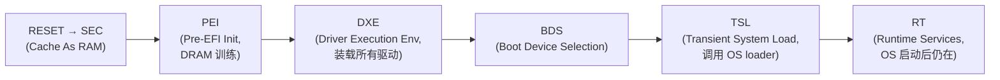
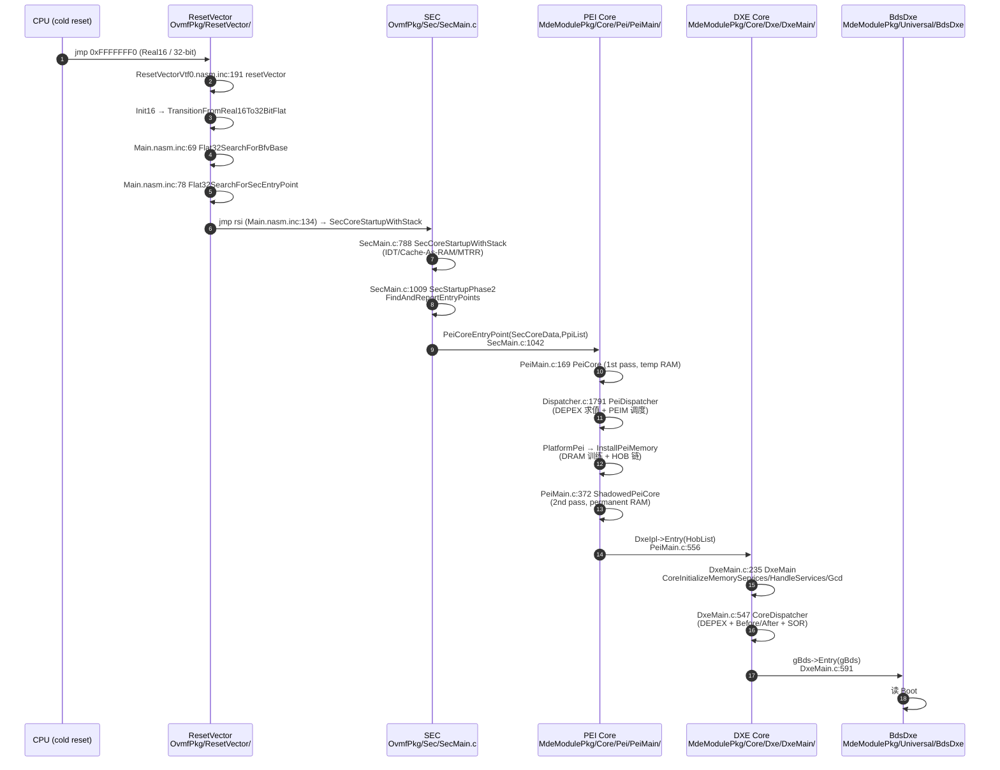
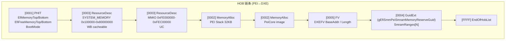
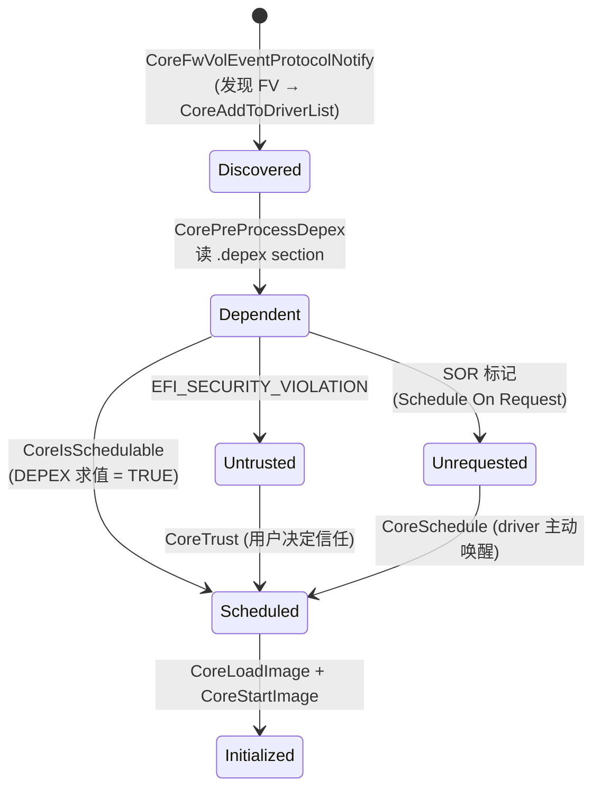
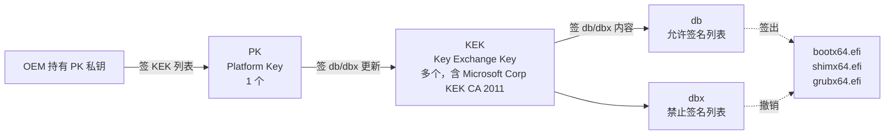

# 03-12 — EDK2 精读（侧重：UEFI 原理 + TianoCore 架构）

> **侧重定位：** EDK2 是 UEFI 规范的工业参考实现，**整个 PC + 服务器固件生态的根**。本笔记侧重**原理 + 架构**——理解 UEFI 阶段化（SEC/PEI/DXE/BDS/RT）、Protocol/Handle 数据库、Package 体系、DSC/FDF/INF 三件套。**不重复 03-05 横向对比 / 03-02 全景**，专攻 EDK2 自身的设计内核。
>
> **一句话答案：** EDK2 = "**UEFI 规范的可参考实现**"。Intel 2004 内部 EFI 1.0 → 2007 公开 → 2009 TianoCore 项目托管。**核心是 5 个阶段 + 几十个 Pkg**。每阶段加载下一阶段，每 Pkg 包含 N 个 INF 描述模块。学曲线陡峭因为元数据量巨大。

按 9 阶段递归大纲：本笔记覆盖 **阶段 3-5**（项目细化 + QuickStart + 熟练）。

---

## 0. ⭐ 先把 5 个名字厘清：UEFI Spec / Tianocore / EDK2 / EDK / UDK 的关系

读本笔记前最关键的认知：**这 5 个名字不是同义词**，是产业 / 项目 / 产品三个层次的不同对象，混用会让后面所有讨论失焦。

### 0.1 5 个名字本质对比

| 名字 | 是什么 | 维护方 | 出现时间 |
|------|--------|--------|---------|
| **UEFI Specification (规范)** | 一份**文档**（PDF + 章节定义）—— OS 启动前的"操作系统接口规范" | **UEFI Forum** (uefi.org) —— 产业联盟，2005 成立，含 Intel/AMD/Apple/Microsoft/IBM/HP/Dell/Lenovo/100+ 成员 | EFI 1.0 (1999, Intel 内部) → UEFI 2.0 (2007 公开) → UEFI 2.10 (2024) |
| **Tianocore** | 一个**开源项目代号 / 社区**（不是规范也不是单一产品） | **tianocore.org**（社区，由 Intel 2004 主导发起） | 2004 |
| **EDK** (EFI Development Kit) | Tianocore 早期产品（2008 重命名 EDK1） | Tianocore 项目 | 2008-2010 |
| **EDK II** | Tianocore 当前主力产品 —— **现代 C 语言重构版** | Tianocore 项目 | 2010 至今 |
| **UDK** (UEFI Development Kit) | EDK II 的"定期发布版"（类似 Ubuntu LTS 之于 Debian） | Tianocore 项目 | 2014 起 |

### 0.2 一句话区分

- **UEFI Spec = 规范**（写文档的人定标准）
- **Tianocore = 项目**（写代码的人组织起来）
- **EDK / EDK II = 产品**（项目下的具体产物）
- **UDK = EDK II 的快照发布版**（给外部稳定性需求用）

### 0.3 横向类比（帮你建心智模型）

| UEFI 生态 | Linux 生态 | Web 生态 |
|----------|-----------|---------|
| UEFI Forum | POSIX / IEEE | W3C / IETF |
| UEFI Spec | POSIX 标准 + System V ABI | HTML / CSS / HTTP RFC |
| Tianocore | Linux Foundation | Mozilla Foundation |
| EDK II | Linux 内核（具体实现） | Firefox |
| UDK | Linux LTS 发行版 | Firefox ESR |
| AMI Aptio / Insyde H2O / Phoenix（OEM 商用） | RHEL / SUSE / Ubuntu 商业发行版 | Chrome / Edge（商用 fork） |

### 0.4 Tianocore 项目完整历史

| 年份 | 事件 |
|------|------|
| 1999 | Intel 内部启动 EFI 1.0（Itanium 时代 BIOS 替代） |
| 2002 | Intel 公开 EFI 1.10 规范 |
| 2004 | Intel **开源 EFI Sample Implementation**，启动 Tianocore 社区 |
| 2005 | UEFI Forum 成立，从 Intel 接管规范权威 → EFI 改名 **UEFI** |
| 2007 | UEFI 2.0 发布（Apple 转 Intel CPU，UEFI 进入消费市场） |
| 2008 | Tianocore 把 EFI Sample Implementation 重命名 **EDK** (EFI Development Kit) |
| 2010 | **EDK II 发布**——彻底用 C 重写（去掉旧 EDK 的宏汇编套壳），现代化代码组织 |
| 2014 | UEFI Forum 接管所有规范权威，Tianocore 转为参考实现角色；首个 **UDK** 发布 |
| 2017+ | Secure Boot / TPM2 完整支持；**RISC-V port** 进入 EDK II（Western Digital 贡献） |
| 2019 | EDK II RISC-V port 跑通 SiFive HiFive Unleashed |
| 2022 | UEFI 2.10 + EDK II 跟进 |
| 2024-2026 | RISC-V H 扩展 / ACPI 适配 / LoongArch 支持持续推进 |

### 0.5 当前格局（谁实际在用 EDK II）

- **几乎所有 PC OEM 的 BIOS 基于 EDK II**：AMI MegaTrends Aptio V/Aptio 5、Insyde H2O、Phoenix SecureCore 都是 EDK II 二改产品
- **服务器**：Intel/AMD/ARM 服务器 BIOS 100% UEFI，主流基于 EDK II
- **虚拟化**：QEMU 用 OVMF（OvmfPkg in EDK II）做 UEFI 虚拟固件
- **嵌入式 ARM**：U-Boot 内置 efi loader 让 UEFI 应用能跑在 U-Boot 上（不是 EDK II 但 ABI 兼容）
- **RISC-V**：QEMU virt + EDK II RISC-V port 是当前 RISC-V UEFI 主路径

→ 一句话：**UEFI Forum 写规范，Tianocore 项目下的 EDK II 是参考实现，AMI/Insyde/Phoenix 在 EDK II 基础上二改卖给 OEM**。

---

## 0.5 ⭐ UEFI 应用是什么

### 0.5.1 一句话定义

**UEFI 应用 = 跑在 UEFI 固件之上的 PE/COFF 格式可执行文件**，通过调用 UEFI 提供的 Boot Services / Runtime Services / Protocol 实现各种功能。**没有 OS，但有完整 runtime**。

### 0.5.2 类比 Linux 应用

| 维度 | Linux 应用 | UEFI 应用 |
|------|-----------|----------|
| 运行环境 | Linux 内核之上 | UEFI 固件之上（无 OS） |
| 可执行格式 | ELF | **PE/COFF** (Windows .exe 同格式) |
| 调用接口 | syscall + libc | UEFI Boot Services + Protocol |
| 入口函数 | `main(argc, argv)` | `efi_main(image_handle, system_table)` |
| 标准库 | glibc / musl | EDK II 的 MdePkg / uefi-rs (Rust) |
| 文件系统访问 | `open/read/write` | `EFI_SIMPLE_FILE_SYSTEM_PROTOCOL` |
| 内存分配 | `malloc` | `BootServices->AllocatePages` |
| 网络 | socket | `EFI_PXE_BASE_CODE_PROTOCOL` |
| 退出 | `exit(code)` | `BootServices->Exit(image_handle, status, ...)` |
| 编译目标 | `x86_64-linux-gnu` | `x86_64-unknown-uefi` |

### 0.5.3 UEFI 应用的典型品类

| 类别 | 例子 | 用途 |
|------|------|------|
| **OS Loader** | grub.efi, shim.efi, systemd-boot, Windows bootmgfw.efi, rboot, **KuEFI 未来** | 加载并跳转到真 OS 内核 |
| **UEFI Shell** | Shell.efi (EDK II ShellPkg) | 命令行界面，类 DOS / Bash |
| **诊断工具** | memtest86.efi, MemTest86+ | 内存测试 |
| **固件升级** | fwupdate.efi, Lenovo BIOS Update | 用户触发的 BIOS 更新 |
| **网络工具** | iPXE.efi | UEFI 下的 PXE 增强（HTTP/HTTPS boot） |
| **安全工具** | TPM 工具, sbsigntool | Secure Boot key 管理 |
| **备份恢复** | Acronis Universal Restore | 操作系统备份 |
| **虚拟环境** | VMWare ESXi UEFI | Hypervisor 启动器 |

### 0.5.4 UEFI 应用 vs UEFI 驱动 vs UEFI 模块

UEFI 三种"可加载代码"易混淆：

| 类型 | PE/COFF Subsystem | 何时被加载 | 常驻？ |
|------|-------------------|-----------|--------|
| **UEFI 应用** | `IMAGE_SUBSYSTEM_EFI_APPLICATION` (10) | 用户/Boot Manager 显式启动 | 否，退出后释放 |
| **UEFI Boot Service Driver** | `IMAGE_SUBSYSTEM_EFI_BOOT_SERVICE_DRIVER` (11) | DXE 阶段自动 dispatch | 是，常驻直到 ExitBootServices |
| **UEFI Runtime Driver** | `IMAGE_SUBSYSTEM_EFI_RUNTIME_DRIVER` (12) | DXE 阶段自动 dispatch | **是，OS 启动后仍驻留**（暴露 Runtime Service） |

→ rboot / grub.efi 都是 **应用**（用户/Boot Manager 启动）；NVMe / USB / 文件系统驱动是 **Boot Service Driver**（DXE 自动加载）；Variable Service / Time Service 实现是 **Runtime Driver**（OS 启动后还需要它们）。

---

## 0.6 ⭐ UEFI 提供了哪些能力（完整能力清单）

### 0.6.1 5 大类能力（顶层视图）

```
UEFI 能力体系
├── 1. Boot Services (BS)        ← OS 启动前可用，ExitBootServices 后释放
├── 2. Runtime Services (RS)     ← OS 启动后仍可用（少数）
├── 3. Protocol (协议)          ← 模块化扩展机制（100+ 个）
├── 4. Variable Services        ← NVRAM 持久化键值
└── 5. 数据表 (Configuration Tables) ← ACPI / SMBIOS / DT 等暴露给 OS
```

### 0.6.2 Boot Services（BS）—— 30+ 个 API

OS 启动前可用的核心 API（`EFI_BOOT_SERVICES` 结构体里的函数指针）：

| 类别 | API | 用途 |
|------|-----|------|
| **任务优先级** | `RaiseTPL` / `RestoreTPL` | 任务优先级调整（类中断屏蔽） |
| **内存** | `AllocatePages` / `FreePages` / `AllocatePool` / `FreePool` / `GetMemoryMap` | 物理内存分配，4KB 页对齐或任意大小 |
| **事件** | `CreateEvent` / `SignalEvent` / `WaitForEvent` / `CloseEvent` / `CheckEvent` / `SetTimer` | 事件 / 定时器机制 |
| **Protocol 管理** | `InstallProtocolInterface` / `UninstallProtocolInterface` / `HandleProtocol` / `LocateProtocol` / `OpenProtocol` / `CloseProtocol` | Protocol 注册 / 查询 |
| **Image 管理** | `LoadImage` / `StartImage` / `Exit` / `UnloadImage` | UEFI 应用 / 驱动加载 / 启动 |
| **杂项** | `Stall` (微秒级延迟) / `SetWatchdogTimer` / `CopyMem` / `SetMem` / `GetNextMonotonicCount` | 工具函数 |
| **退出 BS** | `ExitBootServices` ⭐ | OS Loader 调用此 API 标志 BS 终止，UEFI 把控制权完全交给 OS |

### 0.6.3 Runtime Services（RS）—— 14 个 API

OS 启动后仍可调用的少量 API（`EFI_RUNTIME_SERVICES` 结构体）：

| API | 用途 |
|------|------|
| `GetVariable` / `SetVariable` / `GetNextVariableName` / `QueryVariableInfo` | NVRAM 变量读写（boot order / SecureBoot key 等） |
| `GetTime` / `SetTime` / `GetWakeupTime` / `SetWakeupTime` | RTC 时钟 |
| `SetVirtualAddressMap` | OS 启用 MMU 后告诉 UEFI 新的虚拟地址，UEFI 内部指针自动重映射 |
| `ConvertPointer` | 辅助 SetVirtualAddressMap |
| `ResetSystem` | 重启 / 关机 / 进 firmware 设置界面 |
| `GetNextHighMonotonicCount` | 单调递增计数器 |
| `UpdateCapsule` / `QueryCapsuleCapabilities` | OS 触发的 firmware 更新（fwupd 走这条） |

### 0.6.4 Protocol（协议）—— 100+ 个

UEFI 的"驱动模型" —— 每个 Protocol 是一组函数指针 + GUID 标识。常见品类：

| Protocol 类别 | 例子 | 作用 |
|--------------|------|------|
| **块设备** | `EFI_BLOCK_IO_PROTOCOL` / `EFI_BLOCK_IO2_PROTOCOL` | NVMe / SATA / USB 块设备读写 |
| **文件系统** | `EFI_SIMPLE_FILE_SYSTEM_PROTOCOL` / `EFI_FILE_PROTOCOL` | FAT12/16/32 文件读写（UEFI 强制支持 FAT，其他 fs 可选） |
| **网络** | `EFI_SIMPLE_NETWORK_PROTOCOL` / `EFI_PXE_BASE_CODE_PROTOCOL` / `EFI_HTTP_PROTOCOL` / `EFI_TLS_PROTOCOL` | 网络栈（IPv4/IPv6/TCP/UDP/PXE/HTTP/TLS） |
| **图形** | `EFI_GRAPHICS_OUTPUT_PROTOCOL` (GOP) | framebuffer 显示输出 |
| **输入** | `EFI_SIMPLE_TEXT_INPUT_PROTOCOL` / `EFI_SIMPLE_TEXT_OUTPUT_PROTOCOL` / `EFI_SIMPLE_POINTER_PROTOCOL` | 键盘 / 控制台 / 鼠标 |
| **设备路径** | `EFI_DEVICE_PATH_PROTOCOL` | 设备的可序列化 ID（"ACPI(...)/PCI(...)/Block()"）|
| **Loaded Image** | `EFI_LOADED_IMAGE_PROTOCOL` | UEFI 应用查询自己的加载信息（启动参数 / image base 等） |
| **Variable** | `EFI_VARIABLE_AUTHENTICATION_2` | 签名变量（SecureBoot db/dbx） |
| **TCG / TPM** | `EFI_TCG2_PROTOCOL` | TPM 2.0 测量启动 |
| **HII** | `EFI_HII_DATABASE_PROTOCOL` 等 | 设置界面框架 |
| **DriverBinding** | `EFI_DRIVER_BINDING_PROTOCOL` | 驱动注册 / dispatch 标准接口 |
| **Component Name** | `EFI_COMPONENT_NAME2_PROTOCOL` | 驱动名字本地化 |

### 0.6.5 Variable Services —— NVRAM 持久存储

| 标准变量 | 用途 |
|---------|------|
| `Boot####` / `BootOrder` / `BootCurrent` / `BootNext` | Boot Manager 配置（要启动哪个 OS，按什么顺序） |
| `SetupMode` / `SecureBoot` / `PK` / `KEK` / `db` / `dbx` | SecureBoot 密钥数据库 |
| `Lang` / `PlatformLang` | 用户界面语言 |
| `ConIn` / `ConOut` / `ErrOut` | 控制台设备路径 |
| `Timeout` | Boot Manager 超时秒数 |

### 0.6.6 Configuration Tables —— 暴露给 OS 的数据表

UEFI 启动时通过 `EFI_SYSTEM_TABLE->ConfigurationTable` 数组把以下表暴露给 OS：

| 表 | 用途 |
|----|------|
| **ACPI 1.0 / 2.0+ RSDP** | OS 拿到 ACPI 表（电源管理 / 拓扑 / 设备发现） |
| **SMBIOS** | OS 拿到 DMI/SMBIOS 表（厂商 / 序列号 / BIOS 版本） |
| **Device Tree (DT)** | ARM/RISC-V UEFI 通过此表暴露 DTB 给 OS（替代 ACPI 用） |
| **EFI_HOB_LIST** | Hand-Off Block（PEI → DXE 数据传递） |
| **EFI_MEMORY_TYPE_INFORMATION** | 内存类型预估 |
| **EFI_RT_PROPERTIES_TABLE** | Runtime Services 哪些函数在 SetVirtualAddressMap 后仍可用 |

### 0.6.7 总结：UEFI 能力的 "OS 前的 OS" 定位

UEFI 实际上是一个**完整的 boot 期 runtime environment**：
- 有内存管理（AllocatePages）
- 有事件 / 定时器
- 有完整网络栈
- 有 fs 抽象
- 有 driver model
- 有 NVRAM 持久存储
- 有 OS 切换机制（ExitBootServices）

**这就是为什么 UEFI 那么大（200 万行 C）—— 它实际是个微型 OS**。也是为什么 LinuxBoot 反对 UEFI：既然 Linux 已经有这些能力，何必再写一遍。详见 [03-18 LinuxBoot](03-18-linuxboot-walkthrough.md) §2-3。

---

## 1. 阶段 3 — 项目身份

| 项 | 值 |
|----|---|
| **正式名** | EDK II（EFI Development Kit II）|
| **托管** | TianoCore @ tianocore.org |
| **起源** | Intel EFI 1.0（1999-2004 内部）→ 2008 EDK 1 → 2009 EDK II 公开 |
| **协议** | BSD-2-Clause-Patent（宽松，OEM 可商用）|
| **代码量** | 200+ Pkg / ~200 万行 |
| **语言** | C 主要 + C++ 部分 + 大量 .dec/.dsc/.fdf/.inf 元数据 + Python（BaseTools） |
| **本仓库路径** | `/home/heke/tgln/stage2/material/boot/edk2/` |
| **主战场** | x86 桌面/服务器 UEFI（OEM 全采用，AMI/Insyde/Phoenix 都基于 EDK2 二改）+ ARM 服务器 + RISC-V QEMU |
| **关键 Pkg** | MdePkg / MdeModulePkg / OvmfPkg / ArmVirtPkg |
| **官方** | https://github.com/tianocore/edk2 |

---

## 2. 阶段 4 — UEFI 原理深挖（核心章节）

### 2.1 UEFI 五阶段全景



#### 2.1.1 SEC（Security）

**职责：** CPU reset 后**第一段代码**。
- x86：`SEC.fv` 在 reset vector 高地址 (0xFFFFFFF0)
- 用 **Cache-As-RAM (CAR)** 技巧（关闭 cache write-back，把 L1 cache 当 RAM）
- 把控制权转 PEI

#### 2.1.2 PEI（Pre-EFI Initialization）

**职责：** 平台早期初始化。
- DRAM 训练（最关键 + 最难，几千行）
- 加载并执行 PEIM（PEI Module）
- 建立 HOB（Hand-Off Block）传给 DXE
- 找到并加载 DXE 核心

#### 2.1.3 DXE（Driver Execution Environment）

**职责：** 加载所有驱动。
- 调度器（DXE Dispatcher）扫描 FV 找 DXE_DRIVER
- 每加载一个 driver → 注册多个 Protocol 到 Handle Database
- 通用驱动：USB / NVMe / 文件系统 / 网络 / GPU
- 用户能感知的"UEFI Shell"也是 DXE 阶段产物

#### 2.1.4 BDS（Boot Device Selection）

**职责：** 决定从哪儿启动。
- 读 NVRAM 中 `Boot####` 变量列表 + `BootOrder`
- 顺序尝试：PXE / USB / SATA / NVMe / 内置 EFI loader
- 找到 EFI 应用（`\EFI\BOOT\BOOTX64.EFI` 等）→ 调 LoadImage / StartImage
- 启动菜单（开机按 F12 看到的 Boot Menu）也在此

#### 2.1.5 TSL + RT（启动后）

- TSL：OS loader 跑（从 EFI 应用过渡到 OS）
- **RT (Runtime Services)：OS 启动后**仍可调用的 UEFI 接口（变量读写 / 时间 / Reset / Capsule update）
- 现代 Linux `efivarfs` 就是访问 UEFI Runtime 的桥梁

### 2.2 Protocol / Handle / GUID — UEFI 核心数据模型

UEFI 不是函数库，是**面向对象 + 服务发现**的运行时：

```c
// 核心数据：每个驱动注册多个 Protocol 到一个 Handle
EFI_HANDLE handle;
gBS->InstallProtocolInterface(&handle, &gEfiDevicePathProtocolGuid, ...);
gBS->InstallProtocolInterface(&handle, &gEfiBlockIoProtocolGuid, ...);

// 用户查询：通过 GUID 找接口
EFI_BLOCK_IO_PROTOCOL *blockIo;
gBS->LocateProtocol(&gEfiBlockIoProtocolGuid, NULL, (VOID**)&blockIo);
blockIo->ReadBlocks(blockIo, MediaId, Lba, BufferSize, Buffer);
```

→ 类似 **COM (Microsoft Component Object Model) 风格**。Protocol 用 128-bit GUID 唯一标识，Handle 是匿名的对象指针，Database 是全局服务目录。

### 2.3 Package 体系

EDK2 按 **Pkg** 组织代码（类似 Java package）：

| Pkg | 角色 |
|-----|------|
| **MdePkg** | UEFI 规范的"接口定义"（GUIDs / Protocols / 类型）|
| **MdeModulePkg** | 通用驱动 + DXE 核心（最大 Pkg）|
| **OvmfPkg** | QEMU x86_64 平台（Open Virtual Machine Firmware）|
| **ArmVirtPkg** | QEMU ARM/AArch64 平台 |
| **ArmPkg / ArmPlatformPkg** | ARM 通用 |
| **NetworkPkg** | TCP/UDP/HTTP/iSCSI/PXE |
| **CryptoPkg** | OpenSSL 移植 |
| **SecurityPkg** | TPM / Secure Boot |
| **ShellPkg** | UEFI Shell |
| **FmpDevicePkg** | Capsule update |
| **IntelFsp2Pkg** | Intel FSP 集成 |

OvmfPkg/RiscVVirt — RISC-V QEMU 平台（与本仓库 RustSBI 结合用）。

### 2.4 三件套：DSC / FDF / INF

**DSC（Description File）** — 描述一个**平台**：
```ini
[Defines]
PLATFORM_NAME = OvmfX64
DSC_SPECIFICATION = 0x00010005
OUTPUT_DIRECTORY = Build/Ovmf

[Components]
MdeModulePkg/Core/Dxe/DxeMain.inf
OvmfPkg/PlatformPei/PlatformPei.inf
...
```

**FDF（Flash Description File）** — 描述**Flash 镜像布局**：
```ini
[FV.PEIFV]
BlockSize = 0x10000
INF MdeModulePkg/Core/Pei/PeiMain.inf
INF OvmfPkg/PlatformPei/PlatformPei.inf

[FD.OVMF]
BaseAddress = 0xFFC00000
Size = 0x00400000
0x00000000|0x00040000 FV = SECFV
0x00040000|0x000C0000 FV = PEIFV
0x00100000|0x00300000 FV = DXEFV
```

**INF（Module Description）** — 描述**单个驱动 / 应用**：
```ini
[Defines]
INF_VERSION = 0x00010005
BASE_NAME = MyDxeDriver
FILE_GUID = ...
MODULE_TYPE = DXE_DRIVER
ENTRY_POINT = MyDxeEntry

[Sources]
MyDriver.c

[Packages]
MdePkg/MdePkg.dec
MdeModulePkg/MdeModulePkg.dec

[LibraryClasses]
UefiBootServicesTableLib
DebugLib

[Protocols]
gEfiBlockIoProtocolGuid
```

→ **DSC 选模块 → FDF 把模块打到固件 → INF 描述模块本身**。三件套是 EDK2 学习曲线最陡的地方。

---

## 3. 阶段 4 — QuickStart（编译 + QEMU 跑通 OVMF）

```bash
cd /home/heke/tgln/stage2/material/boot/edk2

# 1. 设置 BaseTools
make -C BaseTools
source edksetup.sh

# 2. 编辑 Conf/target.txt 设置目标
# ACTIVE_PLATFORM = OvmfPkg/OvmfPkgX64.dsc
# TARGET_ARCH     = X64
# TOOL_CHAIN_TAG  = GCC5

# 3. 编译（30 分钟+，巨慢）
build

# 4. 产物
ls Build/OvmfX64/RELEASE_GCC5/FV/
# OVMF.fd                  ← 完整固件
# OVMF_CODE.fd / OVMF_VARS.fd  ← 代码 / 变量分离

# 5. QEMU 跑（用 OVMF 当 BIOS）
qemu-system-x86_64 -bios Build/OvmfX64/RELEASE_GCC5/FV/OVMF.fd \
                   -nographic
# → 看到 TianoCore 启动 logo + UEFI Shell prompt

# 6. RISC-V 路径（与 RustSBI 结合，详见 00-19）
build -a RISCV64 -p OvmfPkg/RiscVVirt/RiscVVirtQemu.dsc -t GCC5 -b RELEASE
qemu-system-riscv64 -M virt,acpi=off,pflash0=p0,pflash1=p1 \
  -bios rustsbi-prototyper-dynamic.bin \
  -blockdev node-name=p0,driver=file,read-only=on,filename=...CODE.fd \
  -blockdev node-name=p1,driver=file,filename=...VARS.fd
```

---

## 4. 阶段 5 — 熟练（日常 EDK2 操作）

### 4.1 UEFI Shell 内常用命令

```
fs0:                          # 切到第一个文件系统
ls                            # 列文件
edit hello.txt                # 内置文本编辑器
hexedit /b 100 /dev/sda       # hex 编辑
drivers                       # 列所有 driver
devices                       # 列所有设备
dh -p BlockIo                 # 列实现 BlockIo Protocol 的 handles
loadpcirom rom.bin            # 加载 PCIe Option ROM
ifconfig                      # 网络接口
ping 8.8.8.8                  # ICMP
tftp get 192.168.1.1 file     # TFTP 下载
mount fs0:                    # 挂载
help -b                       # 浏览所有命令
```

### 4.2 调试

| 任务 | 工具 |
|------|------|
| Serial 输出 | DebugLib：`DEBUG((DEBUG_INFO, "Hello\n"))` |
| GDB 调试 | OvmfPkg 的 `EmulatorPkg`（在主机直接跑 EDK2 调试）|
| 看 ACPI 表 | UEFI Shell `acpiview` |
| 看变量 | `dmpstore` |
| 看 boot order | `bcfg boot dump` |

### 4.3 自定义 EFI 应用

```c
// hello.c
#include <Uefi.h>
#include <Library/UefiLib.h>
#include <Library/UefiBootServicesTableLib.h>

EFI_STATUS EFIAPI UefiMain(IN EFI_HANDLE ImageHandle, IN EFI_SYSTEM_TABLE *SystemTable) {
    Print(L"Hello UEFI!\n");
    return EFI_SUCCESS;
}
```

```ini
# hello.inf
[Defines]
INF_VERSION = 0x00010005
BASE_NAME   = HelloUefi
FILE_GUID   = abcdef12-3456-7890-abcd-ef1234567890
MODULE_TYPE = UEFI_APPLICATION
ENTRY_POINT = UefiMain

[Sources]
hello.c

[Packages]
MdePkg/MdePkg.dec

[LibraryClasses]
UefiApplicationEntryPoint
UefiLib
```

加到 OvmfPkgX64.dsc 的 [Components] → `build` → 产物 `hello.efi` → 拷到 fat32 → UEFI Shell `fs0:\hello.efi`。

### 4.4 OEM / 商业 UEFI 与 EDK2 的关系

- **AMI Aptio V**, **Insyde H2O**, **Phoenix SecureCore Tiano**：商业 OEM UEFI，**全部基于 EDK2 二次开发**
- **OEM 加自家：** GUI 设置界面 + Capsule 升级 + Secure Boot 证书 + 厂商驱动
- **学 EDK2 ≈ 学 OEM UEFI**：开源版让你看清商业 UEFI 怎么实现

---

## 5. 阶段 6 — 全 Pkg 枚举（"项目里都有什么"）

EDK2 共 27 个 Pkg（顶层）+ 隶属各 Pkg 的数百模块。完整枚举：

### 5.1 核心 / 基础

| Pkg | 角色 |
|-----|------|
| **MdePkg** | UEFI 规范接口定义（GUIDs / Protocols / 类型 / 协议头）|
| **MdeModulePkg** | 通用驱动 + DXE 核心 + 大量模块（最大）|
| **BaseTools** | 构建工具（Python + C，编译 EDK2 自身）|
| **EmbeddedPkg** | 嵌入式 SoC 通用 |
| **EmulatorPkg** | 在主机直接跑 EDK2（无虚拟机） |
| **UefiCpuPkg** | CPU 初始化（x86 / ARM 通用层）|
| **UnitTestFrameworkPkg** | 单元测试框架 |

### 5.2 平台特定

| Pkg | 平台 |
|-----|------|
| **OvmfPkg** | QEMU x86_64（Open Virtual Machine Firmware）|
| **OvmfPkg/RiscVVirt** | QEMU RISC-V virt 平台 |
| **ArmVirtPkg** | QEMU ARM/AArch64 |
| **ArmPkg** | ARM 通用底层 |
| **ArmPlatformPkg** | ARM 平台库 |
| **PcAtChipsetPkg** | PC AT 芯片组兼容 |
| **IntelFsp2Pkg / IntelFsp2WrapperPkg** | Intel FSP（Firmware Support Package）|
| **UefiPayloadPkg** | EDK2 作为 coreboot/Slim Bootloader 的 payload |
| **DynamicTablesPkg** | 运行时构造 ACPI / SMBIOS 表（无静态 ASL） |

### 5.3 网络 / 存储 / 加密 / 安全

| Pkg | 角色 |
|-----|------|
| **NetworkPkg** | TCP/UDP/IP/HTTP/HTTPS/iSCSI/PXE/DNS/TLS |
| **CryptoPkg** | OpenSSL / mbedTLS 移植到 UEFI |
| **SecurityPkg** | TPM 1.2/2.0 / TCG / Secure Boot PK/KEK/db/dbx |
| **TcgTpmPkg** | TCG TPM 协议（与 SecurityPkg 协同）|
| **FatPkg** | FAT12/16/32 文件系统驱动 |
| **FmpDevicePkg** | Capsule 升级 (Firmware Management Protocol) |
| **PrmPkg** | Platform Runtime Mechanism（OS 与固件的运行时通信）|

### 5.4 调试 / 管理 / Shell

| Pkg | 角色 |
|-----|------|
| **ShellPkg** | UEFI Shell（fs0:/edit/hexedit/...）|
| **SourceLevelDebugPkg** | 源码级调试支持 |
| **ManageabilityPkg** | IPMI / Redfish / 服务器管理 |
| **RedfishPkg** | Redfish 标准（DMTF）|
| **StandaloneMmPkg** | Standalone MM（Management Mode，x86 SMM 替代）|

### 5.5 关键 Protocol（MdePkg/Include/Protocol/）

数百个 Protocol GUID。常用：

```
EFI_BOOT_SERVICES                  启动服务表
EFI_RUNTIME_SERVICES               运行时服务表
EFI_DEVICE_PATH_PROTOCOL           设备路径
EFI_BLOCK_IO_PROTOCOL              块设备 I/O
EFI_DISK_IO_PROTOCOL               磁盘 I/O
EFI_SIMPLE_FILE_SYSTEM_PROTOCOL    文件系统
EFI_FILE_PROTOCOL                  单个文件
EFI_LOADED_IMAGE_PROTOCOL          已加载 EFI 应用
EFI_GRAPHICS_OUTPUT_PROTOCOL       GOP 显示
EFI_SERIAL_IO_PROTOCOL             串口
EFI_PCI_IO_PROTOCOL                PCIe
EFI_USB_IO_PROTOCOL                USB
EFI_HII_*                          人机交互（菜单）
EFI_TCP4_PROTOCOL / EFI_TCP6       TCP 网络
EFI_HTTP_PROTOCOL                  HTTP
EFI_TLS_PROTOCOL                   TLS
EFI_TPM2_PROTOCOL                  TPM 2.0
```

→ 完整列表 `find /home/heke/tgln/stage2/material/boot/edk2/MdePkg/Include/Protocol -name "*.h"`

### 5.6 BaseTools 构建链

EDK2 不用 GCC make 也不用 Cargo，用自有 BaseTools：
- `Conf/target.txt` 选 platform / arch / toolchain
- `build` 命令调度 `Build.py` Python 脚本
- 解析 DSC → 选 INF 模块 → 调 GenFds 把 INF 输出按 FDF 布局打成 .fd
- 工具：GenFds / GenFv / GenFw / GenSec / VfrCompile / EotTool 等

---

## 6. 源码级 deep-dive（"读完源码自己能造 KuUEFI"）

> 学习目标：以 OvmfPkg X64 为主轴，把 SEC→PEI→DXE→BDS 全链路的关键文件 + 行号 + 数据结构 + 算法摸清，让 KuUEFI 在 RISC-V/aarch64 上能复刻同样的"阶段化 + Protocol/Handle + Dispatcher"骨架。所有文件路径相对 `/home/heke/tgln/stage2/material/boot/edk2/`。

### 6.1 全景时序图（4 阶段 ↔ 关键源文件）



### 6.2 SEC 阶段：Reset Vector → C 入口点

#### 6.2.1 物理布局：FV 顶部最后 16 字节

EDK2 SEC FV 总在 4 GiB - SECFV_SIZE 上方。CPU reset 时 EIP=0xFFFFFFF0（**reset vector**），构造手段：
- `OvmfPkg/ResetVector/Ia16/ResetVectorVtf0.nasm.inc:186` 放置 `'V','T','F',0` 签名 + 0xFF 偏移
- `OvmfPkg/ResetVector/Ia16/ResetVectorVtf0.nasm.inc:191` 是真正 reset vector
- `OvmfPkg/OvmfPkgX64.fdf:95` `INF RuleOverride=RESET_VECTOR OvmfPkg/ResetVector/ResetVector.inf` 把这块 nasm 强制贴到 FV 末尾

#### 6.2.2 reset 那 16 字节（X64 SEV-ES 兼容）

```nasm
; OvmfPkg/ResetVector/Ia16/ResetVectorVtf0.nasm.inc:191-219
resetVector:
%ifdef ARCH_IA32
    nop
    nop
    jmp     EarlyBspInitReal16          ; 经典 IA32 reset
%else
    mov     eax, cr0
    test    al, 1                       ; CR0.PE bit?
    jz      .Real
BITS 32
    jmp     Main32                      ; 已是 protected mode (TDX/IGVM 入口)
BITS 16
.Real:
    jmp     EarlyBspInitReal16          ; legacy real mode (传统 KVM)
%endif
```

`EarlyBspInitReal16` 在 `UefiCpuPkg/ResetVector/Vtf0/Ia16/Init16.nasm.inc:16`，跳到 `Main16`（在 `OvmfPkg/ResetVector/Main.nasm.inc:29`）。

#### 6.2.3 Main.nasm.inc 主流程

```nasm
; OvmfPkg/ResetVector/Main.nasm.inc:29-101
Main16:
    OneTimeCall EarlyInit16
    OneTimeCall TransitionFromReal16To32BitFlat   ; CS/DS/ES/SS 重新 GDT
BITS 32
    mov     byte[WORK_AREA_GUEST_TYPE], 0
    OneTimeCall Flat32SearchForBfvBase            ; EBP = BFV 基地址
    OneTimeCall Flat32SearchForSecEntryPoint      ; ESI = SecCoreStartupWithStack 入口
    OneTimeCall Transition32FlatTo64Flat          ; 启动 long mode（X64 路径）
BITS 64
    jmp     rsi                                   ; 跳进 C
```

→ **关键 trick：** SEC 阶段还**没有 DRAM**。`PageTables64.nasm.inc` 把 `PcdOvmfSecPageTablesBase` 指向的 SPI flash 区当只读 PML4，仅供 long-mode 入门用；执行栈则靠 **Cache-As-RAM (CAR)**，即 `PcdOvmfSecPeiTempRamBase ~ +TempRamSize` 这块 32 KiB 物理地址被锁在 L1 cache write-back 当 RAM 用（详见 `OvmfPkg/PlatformPei/MemDetect.c` 与 SEC 的 `SecMtrrSetup`，`OvmfPkg/Sec/SecMain.c:763-783`）。

#### 6.2.4 C 入口：`SecCoreStartupWithStack`

`OvmfPkg/Sec/SecMain.c:786-995` 是 SEC 的 C 主入口。重要片段：

```c
// SecMain.c:788
VOID EFIAPI
SecCoreStartupWithStack (
  IN EFI_FIRMWARE_VOLUME_HEADER  *BootFv,        // 来自 nasm RBP
  IN VOID                        *TopOfCurrentStack
  )
{
  // ① TDX 测量（SecMain.c:799-823）
  // ② 清 GuidedExtractHandlerTable（SecMain.c:831-837）
  // ③ 装 IDT 模板到 stack（SecMain.c:843-863）
  // ④ ProcessLibraryConstructorList（SecMain.c:886）

  // ⑤ 计算 SecCoreData hand-off（SecMain.c:949-965）
  SecCoreData.TemporaryRamBase   = TopOfCurrentStack - TemporaryRamSize;
  SecCoreData.PeiTemporaryRamBase = SecCoreData.TemporaryRamBase;
  SecCoreData.PeiTemporaryRamSize = TemporaryRamSize >> 1;
  SecCoreData.StackBase           = TempRamBase + (TempRamSize >> 1);
  SecCoreData.BootFirmwareVolumeBase = BootFv;

  // ⑥ 启 APIC timer / MTRR（SecMain.c:982-989）
  // ⑦ 注册 Debug Agent，回调跳到 SecStartupPhase2（SecMain.c:994）
  InitializeDebugAgent (DEBUG_AGENT_INIT_PREMEM_SEC, &SecCoreData, SecStartupPhase2);
}
```

`EFI_SEC_PEI_HAND_OFF` 是 SEC→PEI **唯一通道**，PI Spec 强制定义。布局：

```
+-------------+    <- TopOfCurrentStack
|   Stack     | 32k
+-------------+
|    Heap     | 32k     (PeiTemporaryRamBase)
+-------------+    <- TemporaryRamBase
```

#### 6.2.5 找 PEI Core 并 jmp 过去

`SecMain.c:1009-1048` `SecStartupPhase2`：

```c
FindAndReportEntryPoints (&BootFv, &PeiCoreEntryPoint);   // SecMain.c:1025
// ↓ FindPeiCoreImageBase → FindFfsFileAndSection 在 BFV 里找 GUIDed FFS
//   FILE_TYPE = EFI_FV_FILETYPE_PEI_CORE，section=PE32

(*PeiCoreEntryPoint)(SecCoreData, EfiPeiPpiDescriptor);   // SecMain.c:1042
ASSERT (FALSE);  // PEI Core 永不返回
CpuDeadLoop ();
```

`FindFfsFileAndSection` 在 `OvmfPkg/Sec/SecMain.c:266-336`，是**从 SPI flash 直接定位 PEI Core PE32 镜像**的 FV 解析器（不依赖任何 RAM）。

#### 6.2.6 ARM 平台对照（一句话）

`ArmPlatformPkg/Sec/SecEntryPoint.S` 是 aarch64 / armv7 等价，区别：
- 从 EL3/EL2 起步而非 long mode
- 无 CAR；改用 Trusted Boot Firmware（TF-A BL31）提供的 SRAM
- 之后调 `CEntryPoint` (ArmPlatformPkg/Sec/SecMain.c) 同步 SecCoreData → PEI Core

KuUEFI 设计 RISC-V 入口时可参考此模型：M-mode 启动 → 由 SBI 把 hart 切到 S-mode → SEC equivalent 在 S-mode 跑。

---

### 6.3 PEI 阶段：Dispatcher + DEPEX + HOB

PEI 是**"在 DRAM 训练完之前/之后"**的双阶段执行环境。PEIMs 是受限的 PE/COFF 模块。

#### 6.3.1 双次进入 PEI Core（temp RAM → permanent RAM）

`MdeModulePkg/Core/Pei/PeiMain/PeiMain.c:169-568` 是 `PeiCore()` 主体。核心是 `OldCoreData == NULL` 分支（第一次）vs 非 NULL（第二次）：

```c
// PeiMain.c:196 第 1 次（temp RAM 阶段）
if (OldCoreData == NULL) {
  ZeroMem (&PrivateData, sizeof (PEI_CORE_INSTANCE));
  PrivateData.Signature = PEI_CORE_HANDLE_SIGNATURE;
  // 创建 PHIT HOB（HandOffInformationTable）
  InitializeMemoryServices (&PrivateData, SecCoreData, OldCoreData);  // PeiMain.c:418
  InitializeDispatcherData (&PrivateData, OldCoreData, SecCoreData);  // PeiMain.c:440
  PeiDispatcher (SecCoreData, &PrivateData);                          // PeiMain.c:516
  // ↑ 跑 PlatformPei，最后一定调 PeiServicesInstallPeiMemory，触发 SwitchStack 重入 PeiCore
}

// PeiMain.c:203-379 第 2 次（permanent RAM 阶段）
else {
  // PeiMain.c:213-283 把 HobList/PpiList/Fv[]/TempFileGuid 全部 fixup（offset 重定位）
  // PeiMain.c:316 ConvertMemoryAllocationHobs
  // PeiMain.c:321 ConvertPpiPointers
  // PeiMain.c:338 EvacuateTempRam (FV → permanent)
  // PeiMain.c:361 OldCoreData->ShadowedPeiCore = PeiCore;
  // PeiMain.c:366 ShadowPeiCore (复制 PeiCore 到 permanent RAM 重入)
  OldCoreData->ShadowedPeiCore (SecCoreData, PpiList, OldCoreData);  // PeiMain.c:372 不返回
}
```

→ **TempRamMigration** 是 PI Spec 最难懂的细节之一：从 CAR 切到真正 DRAM 时，**所有指针**（HobList / PpiPtrs / Fv[].FvFileHandles / DispatchNotifyList）都要 ±HeapOffset。

#### 6.3.2 PeiDispatcher 主循环

`MdeModulePkg/Core/Pei/Dispatcher/Dispatcher.c:1791-2160` 是 `PeiDispatcher`，本质是 **"所有 FV × 所有 PEIM 的多轮扫描"**：

```c
// Dispatcher.c:1908 主 do-while 循环
do {
  Private->PeimNeedingDispatch    = FALSE;
  Private->PeimDispatchOnThisPass = FALSE;

  for (FvCount = 0; FvCount < Private->FvCount; FvCount++) {       // 1947
    DiscoverPeimsAndOrderWithApriori (Private, CoreFvHandle);      // 1941: APRIORI 优先
    for (PeimCount = 0; PeimCount < Private->Fv[FvCount].PeimCount; PeimCount++) {
      if (state == PEIM_STATE_NOT_DISPATCHED) {
        if (!DepexSatisfied (Private, PeimFileHandle, PeimCount)) {  // 1955
          Private->PeimNeedingDispatch = TRUE;
          continue;                                                   // 跳过本 PEIM 进下个
        }
        // PEIM_STATE_NOT_DISPATCHED → DISPATCHED
        PeiLoadImage (...);                                            // 1983
        PeimEntryPoint (PeimFileHandle, PeiServices);                  // 2014
        Private->PeimDispatchOnThisPass = TRUE;
        ProcessDispatchNotifyList (Private);                           // 2041
        PeiCheckAndSwitchStack (SecCoreData, Private);                 // 2048
        // ↑ 这里可能切栈到 permanent RAM，PeiCore 重入
      }
    }
  }
} while (PeimDispatchOnThisPass);   // 直到一轮没新 PEIM 被分发
```

→ **核心思想：** PEIM 之间通过 PPI（PEI-to-PEI Interface, GUID 服务发现）互相提供能力。每安装一个 PPI 都触发 Notify list，可能让别的 PEIM 的 DEPEX 变 TRUE。这与 DXE Dispatcher 完全同构。

#### 6.3.3 DEPEX 表达式：后缀栈虚拟机

`MdeModulePkg/Core/Pei/Dependency/Dependency.c:91-260` 实现 PEIM 的 DEPEX 求值。文法是**逆波兰栈机**：

| Opcode | 行号 | 语义 |
|--------|------|------|
| `EFI_DEP_PUSH` (GUID) | Dependency.c:112 | 入栈：检查 PPI 是否安装 |
| `EFI_DEP_AND` | Dependency.c:132 | 栈顶两值与（短路：若第一个 FALSE 立刻 FALSE）|
| `EFI_DEP_OR` | Dependency.c:133 | 栈顶两值或（短路：若第一个 TRUE 立刻 TRUE）|
| `EFI_DEP_NOT` | Dependency.c:195 | 栈顶取反 |
| `EFI_DEP_TRUE` / `EFI_DEP_FALSE` | Dependency.c:212-242 | 常量 |
| `EFI_DEP_END` | Dependency.c:180 | 弹栈，返回当前结果 |

```c
// Dependency.c:99 求值栈尺寸
EVAL_STACK_ENTRY EvalStack[MAX_GRAMMAR_SIZE];   // 默认 64

while (TRUE) {
  switch (*(Iterator++)) {
    case EFI_DEP_PUSH:
      StackPtr->Operator = (VOID*)Iterator;
      Iterator += sizeof(EFI_GUID);
      StackPtr++;
      break;
    case EFI_DEP_AND:
      StackPtr--;
      if (!IsPpiInstalled(PeiServices, StackPtr)) {
        (StackPtr-1)->Result = FALSE;
        (StackPtr-1)->Operator = NULL;       // ← 短路：标记已确定
      }
      break;
    ...
    case EFI_DEP_END:
      return IsPpiInstalled (PeiServices, StackPtr);   // 1 个值留在栈底，求值返回
  }
}
```

DXE 阶段的 DEPEX 类似但多了 `EFI_DEP_BEFORE` / `EFI_DEP_AFTER` / `EFI_DEP_SOR`，在 `MdeModulePkg/Core/Dxe/Dispatcher/Dependency.c`。

#### 6.3.4 HOB 链（Handoff Block，PEI→DXE 唯一桥梁）

HOB 是 PI Spec 最重要的数据结构。布局：链表，第 1 个一定是 PHIT，最后一个是 EOL。

| 类型 | 值 | 作用 |
|------|----|----|
| `EFI_HOB_TYPE_HANDOFF` | 0x0001 | PHIT；MemoryTop / Bottom / FreeMemoryTop / FreeMemoryBottom / EndOfHobList |
| `EFI_HOB_TYPE_MEMORY_ALLOCATION` | 0x0002 | 已被 PEI 占用的内存（栈/BSP store/PEI core image）|
| `EFI_HOB_TYPE_RESOURCE_DESCRIPTOR` | 0x0003 | 系统物理内存映射（SystemMemory / MMIO / IO / Reserved / Unaccepted）|
| `EFI_HOB_TYPE_GUID_EXTENSION` | 0x0004 | 平台自定义（按 GUID 扩展，最常用）|
| `EFI_HOB_TYPE_FV / FV2 / FV3` | 0x0005/9/C | 把额外的 FV 暴露给 DXE Dispatcher |
| `EFI_HOB_TYPE_CPU` | 0x0006 | CPU 物理地址位宽 / IO 位宽 |
| `EFI_HOB_TYPE_MEMORY_POOL` | 0x0007 | PEI 临时堆遗物 |
| `EFI_HOB_TYPE_UEFI_CAPSULE` | 0x000B | Capsule 升级路径 |
| `EFI_HOB_TYPE_END_OF_HOB_LIST` | 0xFFFF | 链表终结 |

源码：`MdePkg/Include/Pi/PiHob.h:17-29`（type 常量）+ `:59-96`（PHIT struct）+ `:307-333`（ResourceDescriptor）。`MdeModulePkg/Core/Pei/Hob/Hob.c` 是 **PeiCreateHob / GetHobList** 实现。



DXE 通过 `gEfiHobListGuid` 配置表拿到 HobList，并在 `DxeMain.c:359` 把它装进 SystemTable.

---

### 6.4 DXE 阶段：Dispatcher 图依赖 + Handle Database

#### 6.4.1 DxeMain 启动序列

`MdeModulePkg/Core/Dxe/DxeMain/DxeMain.c:235-600` 是 DXE Core 入口。核心顺序：

```c
DxeMain (HobStart)                      // DxeMain.c:235
{
  InitializeCpuExceptionHandlers (...);              // 258
  CoreInitializeMemoryServices (&HobStart, ...);     // 275 → 真 page allocator
  CoreInitializeHandleServices ();                   // 282 → Handle DB
  CoreInitializeImageServices (HobStart);            // 288 → PE/COFF loader
  CoreInitializeGcdServices (...);                   // 294 → Global Coherency Domain
  gDxeCoreST = AllocateRuntimeCopyPool (...);        // 301 → System Table
  gDxeCoreRT = AllocateRuntimeCopyPool (...);        // 304 → Runtime Services
  ProcessLibraryConstructorList (...);               // 317
  CoreInstallConfigurationTable (&gEfiDxeServicesTableGuid, gDxeCoreDS);   // 353
  CoreInstallConfigurationTable (&gEfiHobListGuid, HobStart);              // 359
  CoreInitializeEventServices ();                    // 461
  CoreInitializeMemoryAttributesTable ();            // 471
  FwVolBlockDriverInit (...);                        // 527 → 让 DXE Dispatcher 可读 FV
  FwVolDriverInit (...);                             // 530
  CoreInitializeDispatcher ();                       // 542
  CoreDispatcher ();                                 // 547 ← 主调度循环
  gBds->Entry (gBds);                                // 591 ← 跳到 BDS（永不返回）
}
```

→ **要点：** DxeMain 自己不连接任何 driver；它建立**基础服务 + Dispatcher**，剩下全部由 DXE_DRIVER 在 DEPEX 满足时被加载。

#### 6.4.2 CoreDispatcher 算法

`MdeModulePkg/Core/Dxe/Dispatcher/Dispatcher.c:400-581` 是 DXE Dispatcher。比 PEI Dispatcher 多了**两阶段**：



主循环（Dispatcher.c:437-569）：

```c
do {
  // ① 排空 ScheduledQueue
  while (!IsListEmpty (&mScheduledQueue)) {
    DriverEntry = CR (mScheduledQueue.ForwardLink, ...);
    CoreLoadImage (...);                       // Dispatcher.c:456
    CoreStartImage (DriverEntry->ImageHandle, NULL, NULL);   // Dispatcher.c:520
    // ↑ 这步是 driver 入口被调用 → 它会 InstallProtocolInterface(...)
    //   触发 ProtocolNotify → 别的 driver 的 DEPEX 可能变 TRUE
  }

  // ② 重新扫描 mDiscoveredList，把新可调度的搬到 ScheduledQueue
  ReadyToRun = FALSE;
  for (Link in mDiscoveredList) {
    if (DriverEntry->Dependent && CoreIsSchedulable (DriverEntry)) {
      CoreInsertOnScheduledQueueWhileProcessingBeforeAndAfter (DriverEntry);
      ReadyToRun = TRUE;
    }
  }
} while (ReadyToRun);
```

#### 6.4.3 BEFORE/AFTER 排序（DXE 独有）

`Dispatcher.c:594-660` `CoreInsertOnScheduledQueueWhileProcessingBeforeAndAfter` 实现拓扑排序：

```c
// ① 先递归处理所有 BEFORE 这个 driver 的项
for (Link in mDiscoveredList) {
  if (DriverEntry->Before && CompareGuid(&InsertedDriverEntry->FileName,
                                         &DriverEntry->BeforeAfterGuid))
    CoreInsertOnScheduledQueueWhileProcessingBeforeAndAfter (DriverEntry);
}

// ② 把当前 driver 加到队尾
InsertTailList (&mScheduledQueue, &InsertedDriverEntry->ScheduledLink);

// ③ 再递归处理所有 AFTER 这个 driver 的项
for (Link in mDiscoveredList) {
  if (DriverEntry->After && ...)
    CoreInsertOnScheduledQueueWhileProcessingBeforeAndAfter (DriverEntry);
}
```

这给 driver 作者一个声明式的"必须早/晚于某 driver 跑"的能力，比单纯 DEPEX 更强。

#### 6.4.4 Protocol/Handle 数据库实现

- `MdeModulePkg/Core/Dxe/Hand/Handle.c` — `IHANDLE`、`PROTOCOL_INTERFACE`、`PROTOCOL_ENTRY` 三层链表
- `MdeModulePkg/Core/Dxe/Hand/Locate.c` — `LocateHandle / LocateProtocol / LocateHandleBuffer`
- `MdeModulePkg/Core/Dxe/Hand/Notify.c` — Protocol Notify（driver 安装时主动触发回调）

数据模型：

```
gHandleList ─┬─ IHANDLE[0]  ─ Protocols[]  ─ {GUID_A, IfacePtr_A}
             │                              ─ {GUID_B, IfacePtr_B}
             │
             └─ IHANDLE[1]  ─ Protocols[]  ─ {GUID_A, IfacePtr_A'}    (同 GUID 不同 handle)

mProtocolDatabase ─ ProtocolEntry[GUID_A] ─ Notify[]   (订阅者回调)
                                          ─ Protocols[]  (按 GUID 反向索引)
```

→ KuUEFI 复刻这套结构完全可以用 Zig 的 `std.AutoHashMap(Uuid, ArrayList(*Protocol))`。

---

### 6.5 BaseTools 编译流水线

#### 6.5.1 入口与编排

```
edksetup.sh                  # 设 WORKSPACE / EDK_TOOLS_PATH / PYTHONPATH
  └─ Conf/target.txt        # ACTIVE_PLATFORM / TARGET_ARCH / TOOL_CHAIN_TAG
build                       # shell wrapper → BaseTools/BinWrappers/PosixLike/build
  └─ python3 BaseTools/Source/Python/build/build.py
        ├─ Main()                            # build.py:2589
        ├─ ParseDefines / CheckEnvVariables  # build.py:2529 / 106
        ├─ Build() __init__                  # build.py:696 (workspace 元数据 load)
        ├─ Build()._BuildPlatform / _BuildModule   # build.py:1773 / 1872
        │   ├─ AutoGen.Workspace             # 解析 .dsc → 选 [Components]
        │   ├─ AutoGen.PlatformAutoGen       # 每 arch 一个；产 Makefile + AutoGen.c/h
        │   ├─ AutoGen.ModuleAutoGen         # 每模块一个；产 module Makefile
        │   └─ LaunchCommand("make ...")     # build.py:220
        └─ GenFdsApi(Wa.GenFdsCommandDict, Db)   # build.py:1466 / 2368
            └─ BaseTools/Source/Python/GenFds/GenFds.py:478 class GenFds
                ├─ GenFd / GenFv / GenCapsule
                ├─ Section.GenSection (PE32 / DEPEX / TE / GUIDED ...)
                └─ → 产 .Fv / .Fd / .efi / OVMF.fd
```

→ "**先编译每个 INF 成 PE/COFF (.efi)，再用 GenFds 按 FDF 把 .efi 串成 FV，最后把多个 FV 拼成 .Fd 烧录镜像**"。这与 Linux kernel `make bzImage`（每文件 .o → vmlinux → 压缩 + bootloader header）类比。

#### 6.5.2 关键工具

| 工具 | 路径 | 职责 |
|------|------|------|
| **build.py** | `BaseTools/Source/Python/build/build.py` | 主入口（2805 行）|
| **AutoGen** | `BaseTools/Source/Python/AutoGen/` | 解析 DSC/INF/DEC → 生成 AutoGen.c（PCD getter / lib constructor list）|
| **GenFds** | `BaseTools/Source/Python/GenFds/GenFds.py` | FDF → .Fd 镜像 |
| **GenFv** (C) | `BaseTools/Source/C/GenFv/` | 把多个 FFS 文件打包成 FV |
| **GenSec** (C) | `BaseTools/Source/C/GenSec/` | 把 .efi 包成 FFS section |
| **GenFw** (C) | `BaseTools/Source/C/GenFw/` | PE/COFF → TE / SetExtra（精简头）|
| **VfrCompile** (C) | `BaseTools/Source/C/VfrCompile/` | UEFI HII 表单语言 → IFR 字节码 |
| **EdkIIWorkspaceFile** | `BaseTools/Source/Python/Common/EdkIIWorkspaceFile.py` | DSC/FDF/INF 词法分析公共基类 |

→ KuUEFI 可以把 BaseTools 整套替换成 zig build：用 `comptime` 解析 DSC 等价的配置 + `addExecutable` 直出 .efi + 自写 GenFv 等价物（约 2k 行 Zig 应能复刻）。

---

### 6.6 OvmfPkg 平台定制（QEMU x86_64 适配点）

OvmfPkg 是"**最小可学的工业级 platform 包**"。逐文件看怎么把通用 EDK2 适配到 QEMU。

#### 6.6.1 DSC 关键段（OvmfPkgX64.dsc）

```ini
# OvmfPkgX64.dsc:17-26
[Defines]
  PLATFORM_NAME           = Ovmf
  PLATFORM_GUID           = 5a9e7754-d81b-49ea-85ad-69eaa7b1539b
  OUTPUT_DIRECTORY        = Build/OvmfX64
  SUPPORTED_ARCHITECTURES = X64
  BUILD_TARGETS           = NOOPT|DEBUG|RELEASE
  FLASH_DEFINITION        = OvmfPkg/OvmfPkgX64.fdf

# :32-38 编译期 toggle
DEFINE SECURE_BOOT_ENABLE   = FALSE
DEFINE SMM_REQUIRE          = FALSE
DEFINE QEMU_PV_VARS         = FALSE
DEFINE STANDALONE_MM_ENABLE = FALSE
DEFINE SOURCE_DEBUG_ENABLE  = FALSE
DEFINE CC_MEASUREMENT_ENABLE = TRUE   # confidential computing 测量
DEFINE DEBUG_TO_MEM         = FALSE

# :70-82 flash size 选择（1/2/4 MB，QEMU pflash 大小）
```

通过 `build -D SECURE_BOOT_ENABLE=TRUE` 可在命令行覆盖。

#### 6.6.2 FDF 关键段（OvmfPkgX64.fdf）

```ini
# OvmfPkgX64.fdf:20-33  完整 4MB 镜像（CODE+VARS 一体）
[FD.OVMF]
BaseAddress = 0xFFC00000   # 4 GiB - 4 MiB
Size        = 0x00400000   # 4 MiB
$(VARS_SIZE)|$(FVMAIN_SIZE)
FV = FVMAIN_COMPACT
$(SECFV_OFFSET)|$(SECFV_SIZE)
FV = SECFV

# :48-59  分离的 OVMF_CODE.fd（共享只读）
[FD.OVMF_CODE]
BaseAddress = $(CODE_BASE_ADDRESS)
0x00000000|$(FVMAIN_SIZE)  FV = FVMAIN_COMPACT
$(FVMAIN_SIZE)|$(SECFV_SIZE) FV = SECFV
```

→ QEMU 用 `-drive if=pflash,format=raw,file=OVMF_CODE.fd,readonly=on -drive if=pflash,format=raw,file=OVMF_VARS.fd` 让多 VM 共享 CODE.fd，VARS.fd 各自独立 NVRAM。

#### 6.6.3 SECFV（OvmfPkgX64.fdf:67-95）

```ini
[FV.SECFV]
FvNameGuid = 763BED0D-DE9F-48F5-81F1-3E90E1B1A015
INF  OvmfPkg/Sec/SecMain.inf
INF  RuleOverride=RESET_VECTOR OvmfPkg/ResetVector/ResetVector.inf
```

仅 2 个 INF：SEC C 主体 + reset vector nasm。`RuleOverride=RESET_VECTOR` 让 ResetVector.inf 用特殊规则（FFS 类型 = `EFI_FV_FILETYPE_RAW`，强制贴 FV 末尾）。

#### 6.6.4 PEIFV（fdf:98-146）APRIORI 列表

```ini
APRIORI PEI {
  INF  MdeModulePkg/Universal/PCD/Pei/Pcd.inf    # 强制最先跑
}
INF  MdeModulePkg/Core/Pei/PeiMain.inf
INF  OvmfPkg/PlatformPei/PlatformPei.inf         # ← QEMU 平台核心：探 fw_cfg / 建 HOB
INF  MdeModulePkg/Core/DxeIplPeim/DxeIpl.inf     # 通用 DXE IPL
INF  UefiCpuPkg/CpuMpPei/CpuMpPei.inf            # AP 唤醒
```

`OvmfPkg/PlatformPei/PlatformPei.c` 是 OVMF 的"DRAM 探测 + 平台 HOB 创建"，这里通过 QEMU **fw_cfg 接口**（`OvmfPkg/Library/QemuFwCfgLib/`）读 RAM 大小、SMBIOS、ACPI 等。**真硬件**这一步需要 SPD 读 DDR、做训练。

#### 6.6.5 DXEFV（fdf:150-280）

DXE FV 几百个 INF 是 OVMF 真正功能所在。注意几类：
- 基础架构协议：Cpu / Metronome / Timer / Watchdog / Runtime / Reset
- Bus driver 树：PciHostBridge → PciBus → SataController → AtaBus → AtaAtapiPassThru → AtaBusDxe → ...
- VirtIO 全家桶（`OvmfPkg/Virtio*Dxe/`）— QEMU 虚拟设备
- 文件系统：FatPkg + DiskIo / Partition / RamDisk
- 网络：NetworkPkg (TCP/UDP/iSCSI/PXE/HTTP)
- BDS：MdeModulePkg/Universal/BdsDxe + UiApp + BootManagerMenuApp
- Shell：ShellPkg/Application/Shell

---

### 6.7 Secure Boot 签名链（SecurityPkg / AuthVariableLib）

UEFI Secure Boot 的"四层信任链"：**PK → KEK → db ← dbx**。



#### 6.7.1 关键源文件

| 路径 | 职责 |
|------|------|
| `SecurityPkg/Library/AuthVariableLib/AuthVariableLib.c` | 入口、初始化 PK/KEK/db/dbx |
| `SecurityPkg/Library/AuthVariableLib/AuthService.c` | **核心：变量更新时验签**（2470+ 行）|
| `SecurityPkg/Library/AuthVariableLib/AuthServiceInternal.h` | 内部结构 |
| `SecurityPkg/VariableAuthenticated/SecureBootConfigDxe/` | 用户菜单 UI（HII） |
| `SecurityPkg/Library/DxeImageVerificationLib/DxeImageVerificationLib.c` | LoadImage 时验 PE/COFF 签名 |

#### 6.7.2 ProcessVarWithPk / Kek

`SecurityPkg/Library/AuthVariableLib/AuthService.c:687-815` 是 **PK 受保护变量**写入逻辑：

```c
// AuthService.c:687
EFI_STATUS ProcessVarWithPk (
  IN     CHAR16    *VariableName,
  IN     EFI_GUID  *VendorGuid,
  IN     VOID      *Data,
  IN     UINTN      DataSize,
  IN     UINT32     Attributes,
  IN     BOOLEAN    IsPk
  )
{
  // ① 自检属性必须有 EFI_VARIABLE_TIME_BASED_AUTHENTICATED_WRITE_ACCESS
  // ② 找现有 PK
  // ③ 用 PK 公钥验证 Data 中的 EFI_VARIABLE_AUTHENTICATION_2 签名
  Status = VerifyTimeBasedPayloadAndUpdate (
             VariableName, VendorGuid, Data, DataSize, Attributes,
             AuthVarTypePk,        // 或 AuthVarTypeKek
             IsPk ? &Del : NULL
             );
  ...
}
```

`VerifyTimeBasedPayloadAndUpdate` (AuthService.c:2458+) 调用 `Pkcs7Verify`（在 `CryptoPkg/Library/BaseCryptLib/`）做实际的 PKCS#7 签名验证；时间戳比较见 `AuthServiceInternalCompareTimeStamp` (AuthService.c:1181)。

#### 6.7.3 PE/COFF 镜像验证（LoadImage 钩子）

`SecurityPkg/Library/DxeImageVerificationLib/DxeImageVerificationLib.c` 注册 `gEfiSecurity2ArchProtocolGuid`，在 `CoreLoadImage` 中被调用，对每个 .efi 做：

1. 解析 PE/COFF 的 `IMAGE_DIRECTORY_ENTRY_SECURITY`
2. 提取 Authenticode SignerInfo
3. 在 db 中找 cert，在 dbx 中查 hash
4. 任一 db 命中且无 dbx 命中 → 允许执行；否则 EFI_SECURITY_VIOLATION

→ Linux 启动链：shim (Microsoft 签) 验 grub (shim 自带 vendor cert 验) 验 vmlinuz (用户 MOK 验)。

#### 6.7.4 自定义模式（自签内核）

启用 `CUSTOM_MODE_ENABLE` PCD（`SecurityPkg/SecurityPkg.dec`）后，用户可在 BDS 菜单进入"Custom Mode"清空 PK，注入自签的 PK/KEK/db。详见 `SecurityPkg/VariableAuthenticated/SecureBootConfigDxe/SecureBootConfigImpl.c`。

→ 任何要做 verified boot 的项目可参考此机制（用户控制的 PK 根证书 + 自家内核签名 db）。具体项目设计不在本节预设。

---

### 6.8 自造一个 UEFI 等价物的 checklist（基于本节源码深度，任何项目都可借鉴）


按"先骨架后血肉"顺序：

#### 阶段 A — 骨架最小可见（看到 Logo + Shell）
- [ ] **Reset vector + SEC**：参考 `OvmfPkg/Sec/SecMain.c:786-1048` + `OvmfPkg/ResetVector/Main.nasm.inc`，用 Zig 内联汇编/独立 .S 写 RISC-V S-mode 入口 (从 SBI 跳进来)
- [ ] **临时栈 + IDT/trap vector**：参考 `SecMain.c:843-863`，RISC-V 用 `mtvec`/`stvec`
- [ ] **EFI_SEC_PEI_HAND_OFF 等价物**：把 BootFv / TempRamBase / StackBase 传给 PEI
- [ ] **SBI 检测内存**：替换 `OvmfPkg/PlatformPei/MemDetect.c` 为 SBI BASE/HSM 探活 + DTB 读 memory@0

#### 阶段 B — PEI 等价物（HOB + Dispatcher）
- [ ] **HOB 链结构**：复刻 `MdePkg/Include/Pi/PiHob.h` 的 PHIT/Resource/MemoryAllocation/Fv/GuidExt/EOL（用 Zig packed struct）
- [ ] **PEIM 抽象**：用 Zig comptime 收集所有"PEIM"（标记某类型的 fn pointer + DEPEX list）
- [ ] **DEPEX 求值器**：参考 `MdeModulePkg/Core/Pei/Dependency/Dependency.c:91-260` 的栈机，约 200 行 Zig
- [ ] **Dispatcher 主循环**：参考 `Dispatcher.c:1908`，"do-while 多轮直到没新 PEIM 跑出来"

#### 阶段 C — DXE 等价物（Protocol + Handle）
- [ ] **Handle Database**：参考 `MdeModulePkg/Core/Dxe/Hand/Handle.c`，用 `std.AutoHashMap(GUID, ArrayList)`
- [ ] **Protocol Notify**：每次 InstallProtocolInterface 触发订阅回调
- [ ] **Image Loader**：PE/COFF 加载器（也可用 ELF + 自定义 PI 镜像格式）
- [ ] **Dispatcher with Before/After**：参考 `MdeModulePkg/Core/Dxe/Dispatcher/Dispatcher.c:400-660`

#### 阶段 D — BDS + 启动选项
- [ ] **NVRAM 后端**：把 `Boot####`/`BootOrder` 存到 SPI flash 或文件系统
- [ ] **EFI Application 启动**：复用 阶段 C 的 LoadImage / StartImage 加载 `\EFI\BOOT\BOOTRISCV64.EFI`
- [ ] **GOP / SerialIo 最小集**：参考 [03-16](03-16-rboot-walkthrough.md) rboot 的 BootInfo 模型（更轻量）

#### 阶段 E — Secure Boot
- [ ] **PK/KEK/db 变量服务**：参考 `SecurityPkg/Library/AuthVariableLib/AuthService.c`
- [ ] **PE/COFF 验签 hook**：参考 `SecurityPkg/Library/DxeImageVerificationLib/`
- [ ] 详见 [00-36 § 5](00-36-security-evolution.md) Secure Boot 章节

#### 阶段 F — 构建工具链
- [ ] **zig build 替代 BaseTools**：把 `OvmfPkgX64.dsc` 等价信息写成 zig 配置；`addExecutable(.efi)` + 自实现 GenFv 等价的 FV/FD 打包器（约 2k 行）
- [ ] **FDF 替代**：直接用 zig build step 输出 flash layout

→ 总目标：用 Zig **5-8k 行**完成"OVMF on RISC-V"等价物，比 EDK2 (200+ 万行) 精简 200 倍但保持 PI Spec 兼容关键点。可直接被 Linux EFI stub / Asterinas / xv6 EFI loader 启动。

---

## 7. 阶段 7+ — 工业实践（"谁在用 EDK2"）

### 6.1 商业 OEM UEFI（全部基于 EDK2 二改）

| 厂商 | 产品 | 占有率 |
|------|------|-------|
| **AMI (American Megatrends)** | Aptio V | PC + 服务器主流 |
| **Insyde Software** | InsydeH2O | 笔记本 / 移动 |
| **Phoenix Technologies** | SecureCore Tiano | 服务器 |
| **Byosoft (百敖软件，国产)** | BTRTV | 国产 PC / 服务器 |

→ 你电脑里的 UEFI **几乎肯定基于 EDK2**，开 F12 看到的菜单是 EDK2 BDS + OEM 自定义。

### 6.2 服务器 / 云

| 部署 | 用途 |
|------|------|
| **Hyperscaler 自研服务器** (Google / Meta / AWS) | 自建 EDK2 + LinuxBoot 削减 DXE |
| **AWS EC2 + Graviton** | EDK2 on aarch64 |
| **Azure / GCP confidential computing** | EDK2 + Intel TDX / AMD SEV |
| **国产服务器 (鲲鹏 / 倚天 / 飞腾)** | 各家定制 EDK2 |

### 6.3 桌面 / 笔记本

- 所有 Mac M1/M2/M3/M4：EDK2 + Apple 私有 iBoot 链
- Surface / ThinkPad / MacBook：OEM EDK2 派生

### 6.4 嵌入式 / IoT / 教育

- **OVMF**：QEMU 必备（云原生 / kata containers / firecracker 部分场景）
- **TianoCore RISC-V**：与 RustSBI/OpenSBI 协作启动 RISC-V Linux
- **NUC / SBC / 教学机**：EDK2 直接刷 Flash

### 6.5 与 EDK II 的"分支生态"

| 分支 | 维护方 | 用途 |
|------|--------|------|
| **edk2-stable\<year\>\<month\>** | TianoCore | 上游每季度 stable |
| **edk2-platforms** | TianoCore | 平台分离的"数百板"参考 |
| **edk2-libc** | TianoCore | UEFI 上的 libc / Python 移植 |
| **edk2-test** | TianoCore | 测试套件 |
| **slimbootloader** | Intel | EDK2 思路的 Slim 替代 |
| **coreboot + edk2 payload** | coreboot 社区 | coreboot 后接 EDK2 |

---

## 8. 阶段 7-9 简介（后续可深入的方向）

- **阶段 7 精通**：CapsulePEI 升级 / Secure Boot PK/KEK/db/dbx / SMM / TCG2 TPM 协议 / Confidential Computing (TDX/SEV)
- **阶段 8 子功能**：每个 Pkg 单独深耕（特别 NetworkPkg / SecurityPkg / OvmfPkg）
- **阶段 9 设计**：HOB 机制 / DEPEX 表达式 / Variable Service / Runtime VA Map / DXE Dispatcher 调度算法

---

## 9. 进一步阅读

- **官方 Wiki**：https://github.com/tianocore/tianocore.github.io/wiki
- **UEFI 规范**：https://uefi.org/specifications（必读，Spec 2.10 + 1500+ 页）
- **UEFI Programming Tutorials**：https://github.com/tianocore-docs/edk2-UefiDriverWritersGuide
- **本地源码**：`/home/heke/tgln/stage2/material/boot/edk2/`
- **本仓库相关**：[03-05](03-05-boot-domain-comparison.md) 横向对比 / [00-19 § 3.2](00-19-image-and-bootflow-quickstart.md) U-Boot vs EDK2 实战 / [03-16-rboot-walkthrough](03-16-rboot-walkthrough.md) Rust UEFI 应用对照
