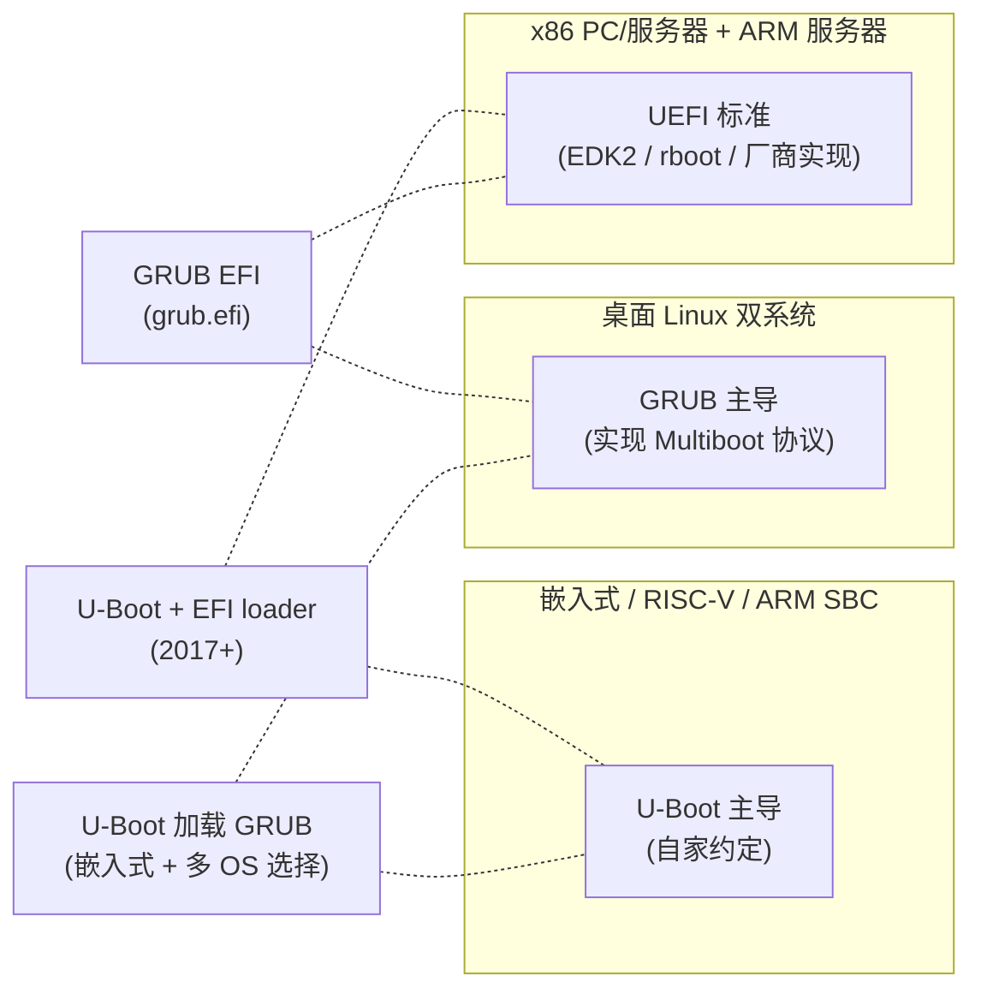
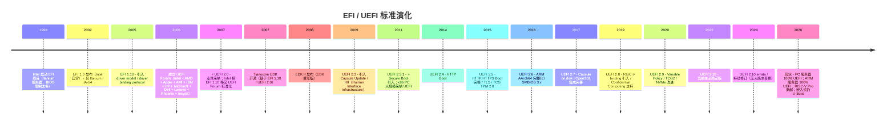
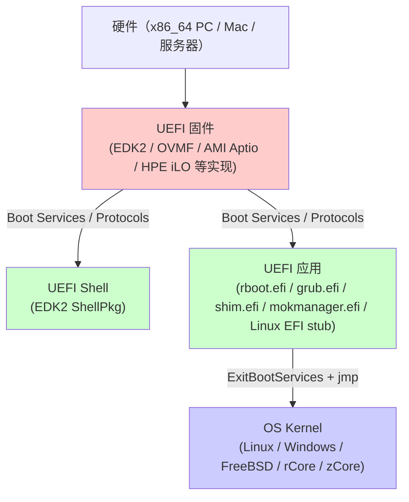
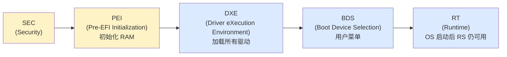

# 03-13 — UEFI 演化案例研究：从 EFI 1.0 到 UEFI 2.10 + EDK2 ↔ rboot 极致体量对比

> **核心问题：** "UEFI"到底是什么？它是一个标准、一个固件实现、还是一个生态？为什么写一个 UEFI bootloader 既可以用 200 万行 C 的 EDK2，也可以用 527 行 Rust 的 rboot？两者差在哪？U-Boot / GRUB / UEFI 三者作为"启动标准"分别又是什么？
>
> **一句话答案：** **UEFI 是一份开放标准（UEFI Forum 维护，2007 起取代 EFI 1.x）**，定义了 boot loader 与 OS 之间的统一 ABI（Boot Services / Runtime Services / Protocol / Variable / GUID 等）。**EDK2 是 UEFI 标准的"参考实现"**（200 万行 C，Tianocore 项目，对 OEM 完整覆盖）；**rboot 是用 uefi-rs 写的极简 UEFI 应用**（527 行 Rust，仅做"加载 ELF 内核 + 跳转"），跑在 EDK2 / OVMF 之上。两者展示了"UEFI 实现的两个极端"。本笔记同时解释 **U-Boot / GRUB / UEFI 三者标准定位的根本不同**。
>
> **本笔记定位：** 03 大类 boot 第 14 篇 —— **标准 vs 实现 + 极致体量对比**视角。配 [`03-12 EDK2 精读`](03-12-edk2-walkthrough.md) + [`03-16 rboot 精读`](03-16-rboot-walkthrough.md) 现状深读 + [`03-09 U-Boot 演化`](03-09-uboot-evolution-case-study.md) 平行案例。

---

## 0. ⭐ 先讲清楚：U-Boot / GRUB / UEFI 三者作为"标准"的根本不同

读本笔记前最关键的认知：**这三者不是同类东西**。混淆它们会让后面所有讨论失焦。

### 0.1 三者本质对比

| 项目 | 是什么 | 标准化程度 | 实现 | 跑在哪里 |
|------|--------|-----------|------|----------|
| **U-Boot** | **一个具体的 bootloader 项目**（自家代码 + 自家约定）| ❌ 无独立标准；自定义 cmd / env / FIT / Bootflow | U-Boot 自己（150 万行 C）| 嵌入式 / RISC-V / ARM SBC 主流 |
| **GRUB** | **另一个具体的 bootloader 项目**（GNU 出品）| 部分：实现 **Multiboot / Multiboot2 spec** | GRUB 自己（200K 行 C） | 桌面 Linux / 双系统 |
| **UEFI** | **一份开放规范（standard）**，不是实现 | ✅ 完整规范（UEFI Forum 维护） | EDK2 (200 万行 C) / rboot (527 行 Rust) / Apple boot.efi（闭源）/ AMI Aptio（闭源）/ Insyde H2O（闭源）/ Phoenix SecureCore / coreboot+TianoCore（混合）/ ... 数十种 | x86 桌面/服务器（100%）+ ARM 服务器 + 部分 RISC-V Pro |

### 0.2 一句话区分

- **U-Boot = "我是一个 bootloader 实现"** —— 给我板子，我帮你 boot
- **GRUB = "我是一个 bootloader 实现 + 实现了 Multiboot 协议"** —— 我能 boot 任何遵守 Multiboot 协议的内核
- **UEFI = "我是一份接口规范"** —— 谁实现我，谁就成为合法的 UEFI 固件；谁遵守我，谁就能在任何 UEFI 固件上启动

### 0.3 详解：UEFI 规范包含什么

**UEFI Specification v2.10**（2024，约 2700 页 PDF）规范定义：

1. **Boot Services (BS)** —— 操作系统启动前可用的 API 集合
   - `AllocatePages` / `LocateProtocol` / `LoadImage` / `StartImage` / `ExitBootServices` 等数十个
2. **Runtime Services (RS)** —— OS 启动后仍可调用的 API（少数）
   - `GetVariable` / `SetVariable` / `GetTime` / `ResetSystem` 等
3. **Protocol** —— 模块化接口协议（约 100+ 个）
   - `EFI_BLOCK_IO_PROTOCOL` / `EFI_SIMPLE_FILE_SYSTEM_PROTOCOL` / `EFI_GRAPHICS_OUTPUT_PROTOCOL` / `EFI_PXE_BASE_CODE_PROTOCOL` / ...
4. **Variable Services** —— NVRAM 持久存储（boot order / SecureBoot keys / 用户配置）
5. **Image Format** —— PE/COFF +x86_64 / aarch64 / RV64 / loongarch / riscv32 等
6. **GUID 体系** —— 每 protocol / 每 image / 每 variable 都用 128-bit GUID 标识
7. **System Table (`EFI_SYSTEM_TABLE`)** —— 启动时唯一入口，含 BS / RS / 配置表指针
8. **Boot Manager + Boot Variables（Boot####, BootOrder, BootCurrent, BootNext）**
9. **Secure Boot**（含 PK/KEK/db/dbx 数据库 + PE 签名验证）
10. **Capsule Update**（OS 触发的固件更新协议）
11. **HII (Human Interface Infrastructure)** —— 设置界面框架
12. **TCG Protocol** —— TPM 测量启动
13. **ACPI Configuration Tables** —— UEFI 通过 EFI_CONFIGURATION_TABLE 暴露 ACPI 给 OS
14. **DT (Device Tree)** —— UEFI 上 ARM/RISC-V 也通过 EFI_CONFIGURATION_TABLE 暴露 DT
15. **Network stack（仅 IPv4/IPv6 + TFTP/HTTP/PXE，规范定义）**

→ **UEFI 标准 = OS 启动前的"操作系统"** —— 提供完整 runtime 给 boot loader / 其他 EFI 应用使用。

### 0.4 详解：U-Boot 不是规范

U-Boot 没有独立"被另一项目实现"的规范。它的所有约定（U_BOOT_CMD / 环境变量 / FIT / Bootflow / DTB 传递协议）都在 U-Boot 自己代码里。

**唯一例外：U-Boot 的 "FIT 镜像格式"** 后来独立成 [fitspec.osfw.foundation](https://fitspec.osfw.foundation/)（详见 [`03-04 § 9`](03-04-dts-dtb-fdt-syntax-reference.md)）。

### 0.5 详解：GRUB 实现了 Multiboot Spec

**Multiboot Specification（FSF/GNU，1995 起）：**
- v1.0 / v2.0
- 定义"内核如何被 GRUB 加载"（header magic / 信息结构 / memory map 传递格式）
- GRUB 是 Multiboot 的**主参考实现**
- xv6 / ToaruOS / Plan 9 / Haiku / 各教学 OS 都实现 Multiboot header
- Linux 也支持 Multiboot（虽然 vmlinuz/EFI stub 更主流）

→ **GRUB 实现了一个"被其他 OS 遵守"的接口规范**，比 U-Boot 多一层标准化，但比 UEFI 简单得多。

### 0.6 三者重叠区



**重叠场景：**
- **U-Boot 内置 EFI loader（v2017+）**：U-Boot 既是自家 bootloader，又能跑 UEFI 应用（grub.efi / Linux EFI stub）
- **GRUB EFI 版本**（grub.efi）：GRUB 编译为 UEFI 应用，跑在 UEFI 固件上，再用 Multiboot 协议加载内核
- **U-Boot 加载 GRUB**：嵌入式带多 OS 选择时

### 0.7 ⭐ 进一步：UEFI Spec / Tianocore / EDK II / EDK / UDK 5 个名字关系

§ 0 把 **U-Boot / GRUB / UEFI** 三者作为不同性质的对象厘清了。但 UEFI 这一侧内部还有 5 个名字常被混用，必须再分清：

| 名字 | 是什么 | 维护方 | 出现 |
|------|--------|--------|------|
| **UEFI Specification** | **规范文档**（PDF，2700 页） | **UEFI Forum**（产业联盟，2005 成立） | 2007（UEFI 2.0） |
| **Tianocore** | **开源项目代号 / 社区** | tianocore.org（Intel 2004 主导发起） | 2004 |
| **EDK** (EFI Development Kit) | Tianocore 早期产品 | Tianocore 项目 | 2008-2010 |
| **EDK II** | Tianocore 当前主力产品（C 语言重构版） | Tianocore 项目 | 2010 至今 |
| **UDK** (UEFI Development Kit) | EDK II 的"定期稳定发布版" | Tianocore 项目 | 2014 起 |

**横向类比**：

| UEFI 生态 | Linux 生态 |
|----------|-----------|
| UEFI Forum | POSIX / IEEE |
| UEFI Spec | POSIX 标准 + System V ABI |
| Tianocore | Linux Foundation |
| EDK II | Linux 内核（具体实现） |
| UDK | Linux LTS 发行版 |
| AMI Aptio / Insyde H2O / Phoenix | RHEL / SUSE / Ubuntu 商业发行版 |

**一句话**：**UEFI Forum 写规范，Tianocore 项目下的 EDK II 是规范的参考实现，AMI/Insyde/Phoenix 在 EDK II 基础上二改卖给 OEM**。

详细 5 个名字的项目历史 + 当前格局 + 谁在用 EDK II → 见 [03-12 EDK2 § 0](03-12-edk2-walkthrough.md#0-先把-5-个名字厘清uefi-spec--tianocore--edk2--edk--udk-的关系)。

---

## 1. 顶层视野：UEFI 标准演化（25 年简史）

### 1.1 时间线（不跳过任何主版本）



### 1.2 关键转折点

#### (a) 1998-2002 EFI 起源（Intel Itanium 时代）

**痛点：** BIOS 设计于 1981 年 IBM PC，遗留 16-bit Real Mode / INT 中断 / 1MB RAM 假设。Itanium 服务器（IA-64 64-bit）需要全新固件。

**Intel 设计 EFI（Extensible Firmware Interface）：**
- 64-bit native
- 模块化（PEI / DXE / BDS 阶段）
- C 语言开发（不像 BIOS 几乎都汇编）
- 标准 ABI（Boot Services / Runtime Services）
- PE/COFF 镜像（Microsoft 的 Windows 可执行格式）

EFI 1.0 仅 Itanium 用，市场几乎为零。

#### (b) 2005-2007 UEFI Forum 成立 + UEFI 2.0

**Intel 决定：** 把 EFI 标准化、开放，让所有厂商都能用。

**UEFI Forum 成立（2005）**：Intel + AMD + Apple + AMI + IBM + HP + Microsoft + Dell + Lenovo + Phoenix + Insyde 等 11 创始成员。

**UEFI 2.0 (2007)** ：把 EFI 1.10 标准化升级，加 driver model / driver binding。Apple 第一个商用化（2006 Intel Mac）。

**Tianocore EDK 开源**：Intel 同时开放参考实现（先 EDK，后 EDK II）。

#### (c) 2011-2014 桌面 PC 大规模采纳

**UEFI 2.3.1 (2011)** ：引入 **Secure Boot**。Microsoft 推 Windows 8 强制 UEFI Secure Boot（2012），PC 厂商被动跟进。

**结果：** 2012-2014 年 x86 PC 从 BIOS 全面切换到 UEFI（带 CSM = Compatibility Support Module 可回退 BIOS）。**2020+ Intel 路线图删 CSM**，现在新机器仅 UEFI。

#### (d) 2016-2019 ARM/RISC-V 进入 UEFI

**UEFI 2.6 (2016)** ：ARM AArch64 完整化 → ARM 服务器（SBSA 规范）走 UEFI（详见 [`00-07 OS evolution`](00-07-os-evolution.md)）。

**UEFI 2.8 (2019)** ：RISC-V binding 加入。SiFive HiFive Pro / Unmatched / 阿里平头哥服务器 RISC-V 都走 UEFI。

#### (e) 2020+ 当前稳定期

UEFI 2.10 是当前主线（2022 起）。每年 errata 微调，无大版本变更。**现在是 UEFI 标准的"成熟稳定期"**。

---

## 2. EDK2 (Tianocore) ↔ rboot 极致体量对比

### 2.1 数字震撼

| 维度 | EDK2 (v2026) | rboot (v0.x) | 比值 |
|------|--------------|--------------|------|
| **总文件数** | 8,356 源文件 | **4 .rs 文件** | 2,089× |
| **C/H 行数** | **2,191,556 行** | **527 行 Rust** | **4,158×** |
| **Pkg 数** | 27 | 0（不分包）| - |
| **License** | BSD-2-Clause Patent | (单 LICENSE) | - |
| **构建系统** | BaseTools (Python + nmake) + DSC + FDF | **`cargo build`** | - |
| **编译时间** | 30 分钟（OvmfPkg）| **30 秒** | 60× |
| **启动时间** | 几秒 | **< 1s** | - |
| **目标** | UEFI 标准完整实现 + OEM 全功能 | UEFI 应用：加载 ELF 内核 + 跳转 | - |
| **跑在哪里** | 物理机 / QEMU 上的 OVMF | EDK2/OVMF 之上的 EFI 应用 | rboot 是 EDK2 的"客户" |

→ **4158 倍代码量差距** —— 这就是"完整 UEFI 实现"vs"最小 UEFI 应用"的差异。

### 2.2 EDK2 27 个 Pkg 全枚举（按职责分类）

```
EDK2/
├── 核心规范层（必备）
│   ├── MdePkg/           ← UEFI 规范基础库（1809 文件 / 419K 行）
│   └── MdeModulePkg/     ← UEFI 规范模块实现（1426 文件 / 595K 行 ← 最大）
│
├── CPU/平台特定
│   ├── ArmPkg/           ← ARM CPU 通用
│   ├── ArmPlatformPkg/   ← ARM 平台辅助
│   ├── ArmVirtPkg/       ← ARM 虚拟化平台（QEMU virt）
│   ├── EmulatorPkg/      ← Host 上跑 EDK2（开发/测试用）
│   ├── IntelFsp2Pkg/     ← Intel Firmware Support Package 2
│   ├── IntelFsp2WrapperPkg/  ← FSP 包装
│   ├── PcAtChipsetPkg/   ← x86 PC AT 兼容芯片组（南桥等）
│   ├── UefiCpuPkg/       ← x86/ARM/RV CPU 通用
│   ├── UefiPayloadPkg/   ← coreboot/SeaBIOS 之上的 UEFI payload
│   └── OvmfPkg/          ← OVMF（QEMU x86 完整 UEFI 固件）⭐ rboot 测试用
│
├── 子系统模块
│   ├── NetworkPkg/       ← 完整 TCP/IP 栈 + iSCSI + HTTP + PXE（199K 行）
│   ├── CryptoPkg/        ← OpenSSL 包装 + 算法（118K 行）
│   ├── SecurityPkg/      ← Secure Boot / TPM / measured boot（87K 行）
│   ├── ShellPkg/         ← UEFI Shell（130K 行）
│   ├── FatPkg/           ← FAT12/16/32 文件系统
│   ├── RamDiskPkg/       ← RAM disk 支持
│   ├── FmpDevicePkg/     ← Firmware Management Protocol（固件升级）
│   └── DynamicTablesPkg/ ← ACPI/SMBIOS 表生成
│
├── 嵌入式 / 工业 / 商业用
│   ├── EmbeddedPkg/      ← 嵌入式 UEFI 模块
│   ├── ManageabilityPkg/ ← BMC 集成
│   ├── PrmPkg/           ← Platform Runtime Mechanism
│   ├── StandaloneMmPkg/  ← Standalone MM (System Management Mode)
│   ├── ShellBinPkg/      ← Shell 预编译二进制
│   └── FspBinPkg/        ← FSP 预编译二进制
│
├── 工具 / 测试 / 文档
│   ├── BaseTools/        ← 构建系统（Python + 工具集）
│   ├── EdkCompatibilityPkg/  ← 老 EDK 向 EDK II 迁移辅助
│   ├── OemPkg/           ← OEM 自定义模板
│   ├── Conf/             ← 用户配置模板
│   ├── License.txt / License-History.txt / Maintainers.txt / ReadMe.rst
│   └── ...
```

→ **27 Pkg = 完整 UEFI 实现的所有维度**：规范基础 + 多 CPU/平台 + fs/net/sec/shell + 工具链。

### 2.3 rboot 4 文件全目录

```
rboot/
├── Cargo.toml          ← 依赖：uefi 0.36, xmas-elf, x86_64
├── src/
│   ├── lib.rs          ← 40 行  - BootInfo / GraphicInfo (kernel ABI)
│   ├── config.rs       ← 75 行  - rboot.conf 解析
│   ├── page_table.rs   ← 175 行 - x86_64 4-level 页表建立
│   └── main.rs         ← 237 行 - efi_main 入口 + 主流程
├── rboot.conf          ← 配置示例
├── OVMF.fd             ← 测试用（Tianocore 编出的 OVMF）⭐ 注意 EDK2 编出的产物
├── example-kernel/     ← 演示 kernel
├── README.md
└── Makefile            ← qemu 启动脚本
```

→ **4 .rs 文件 + 一个配置 = 完整 EFI 应用**。整个项目可以一晚上读完。

### 2.4 互补关系（不是互相替代）



**关系：**
- EDK2 是**固件实现**（提供 UEFI 服务给上层）
- rboot 是**固件之上的应用**（用 UEFI 服务做事，本身不提供服务）
- 类比：**EDK2 ≈ Linux 内核；rboot ≈ Linux 上的 cat / ls 命令**

---

## 3. UEFI 标准核心机制（必懂概念）

### 3.1 EFI System Table — 启动时的唯一入口

```c
// 任何 UEFI 应用入口签名
EFI_STATUS
EFIAPI
EfiMain(
    IN EFI_HANDLE        ImageHandle,    ← 自己镜像的 handle
    IN EFI_SYSTEM_TABLE  *SystemTable    ← 系统表，所有 UEFI 服务的入口
)
{
    // 通过 SystemTable->BootServices 调任何 BS API
    // 通过 SystemTable->RuntimeServices 调任何 RS API
    // 通过 SystemTable->ConIn / ConOut 读写控制台
}
```

**SystemTable 字段（精简）：**
- `BootServices *` —— 数十个 API
- `RuntimeServices *` —— `GetVariable / SetVariable / GetTime / ResetSystem` 等
- `ConIn / ConOut / StdErr` —— 控制台
- `ConfigurationTable[]` —— ACPI / DT / SMBIOS / random seed 等指针数组
- `NumberOfTableEntries`

### 3.2 Boot Services vs Runtime Services

| 类型 | 何时可用 | 典型 API |
|------|---------|---------|
| **Boot Services (BS)** | OS 启动前 | `AllocatePages` / `LocateProtocol` / `LoadImage` / `StartImage` / `SetWatchdogTimer` |
| **Runtime Services (RS)** | OS 启动前 + 启动后 | `GetVariable` / `SetVariable` / `GetTime` / `SetTime` / `ResetSystem` / `UpdateCapsule` |

**关键 API：`ExitBootServices`** —— 调用此函数后所有 BS API 失效，OS 接管硬件。这是"UEFI 时代结束、OS 时代开始"的瞬间。

### 3.3 Protocol 体系（UEFI 模块化的基石）

每个 Protocol 是一个 C struct，含函数指针向量 + 数据。通过 GUID 注册/查询：

```c
// 例：拿到块设备协议
EFI_BLOCK_IO_PROTOCOL *BlockIo;
gBS->LocateProtocol(
    &gEfiBlockIoProtocolGuid,   ← GUID 标识
    NULL,
    (VOID **)&BlockIo
);
// 现在可以调 BlockIo->ReadBlocks(...) / BlockIo->WriteBlocks(...)
```

**常用 Protocol（约 100+ 个，列高频）：**
| Protocol | GUID | 用途 |
|----------|------|------|
| `EFI_LOADED_IMAGE_PROTOCOL` | 0x5b1b31a1-... | 应用自身镜像信息（命令行 / 设备路径）|
| `EFI_BLOCK_IO_PROTOCOL` | 0x964e5b21-... | 块设备读写 |
| `EFI_SIMPLE_FILE_SYSTEM_PROTOCOL` | 0x964e5b22-... | 文件系统访问（FAT 通常）|
| `EFI_FILE_PROTOCOL` | 0x09576e92-... | 文件 I/O |
| `EFI_GRAPHICS_OUTPUT_PROTOCOL` | 0x9042a9de-... | 显示输出（GOP，取代老 UGA）|
| `EFI_PXE_BASE_CODE_PROTOCOL` | 0x03c4e603-... | PXE 网络启动 |
| `EFI_TLS_PROTOCOL` | 0x4d8f4f1c-... | TLS over UEFI（HTTPS Boot 用）|
| `EFI_LOAD_FILE_PROTOCOL` | 0x56ec3091-... | TFTP/HTTP 加载文件 |
| `EFI_SMBIOS_PROTOCOL` | 0x03583ff6-... | SMBIOS 表 |
| `EFI_DEVICE_PATH_PROTOCOL` | 0x09576e91-... | 设备路径（如 `PciRoot(0x0)/Pci(0x1f,0x2)/Sata(0x0,0xFFFF,0x0)/HD(...)`）|
| `EFI_TCG2_PROTOCOL` | 0x607f766c-... | TPM 2.0 测量 |

### 3.4 Variable（NVRAM 持久存储）

- 每个 variable 由 (GUID, Name) 标识
- 存于 SPI Flash 的 NVRAM 区域
- **关键变量：**
  - `Boot####`（BootOrder / Boot0001 / Boot0002 / ...）—— 启动选项
  - `BootCurrent` / `BootNext` —— 当前/下次启动
  - `PK` / `KEK` / `db` / `dbx` —— Secure Boot 公钥/吊销
  - `BootOptionSupport` / `Lang` / `Timeout` —— 用户配置

### 3.4.5 ⭐ ESP (EFI System Partition) 详解

**ESP = EFI System Partition** —— UEFI 启动链的"文件仓库"，UEFI 固件唯一原生认识的硬盘分区类型。

#### (a) 为什么需要 ESP？

老 BIOS 时代 boot loader 只有 446 字节空间（MBR 第一个扇区减去分区表）—— 装不下任何"复杂"启动逻辑。**UEFI 的革命**：固件自身内置 FAT 文件系统驱动，可以直接从特定分区里读取**任意大小、任意名字**的 `.efi` 文件。**这个特定分区就是 ESP**。

→ 本质：**把"boot loader"从"MBR 446 字节代码片段"升级为"独立分区里的 PE/COFF 应用文件"**。这一步让 boot 软件可以像用户态程序一样模块化开发。

#### (b) ESP 的硬规格（UEFI Specification 强制）

| 维度 | 规定 |
|------|------|
| **文件系统** | **FAT32**（必须，UEFI 2.10 §13.3.1.1 强制）；ESP < 512 MiB 时也允许 FAT16/FAT12 |
| **GPT type GUID** | `C12A7328-F81F-11D2-BA4B-00A0C93EC93B`（"EFI System") |
| **MBR partition type** | `0xEF`（仅 BIOS↔UEFI 兼容机器用 GPT 时用 protective MBR）|
| **大小约定** | 100 MiB（最小推荐）/ 200-512 MiB（主流 distro 默认）/ 1 GiB（够装多 OS bootloader）|
| **数量** | 一个磁盘**通常 1 个**，但 spec 不禁止多个；BDS 找第一个 |
| **文件名约束** | 8.3 短文件名 + LFN 长文件名都支持（FAT32 标准）|
| **路径分隔符** | UEFI 内部用 `\`（反斜杠），不是 Linux 的 `/` |

**为什么选 FAT32？**
- 公开标准（无专利费）—— UEFI Forum 选 ext4 / NTFS 都有法律风险
- **跨 OS 通用** —— Windows / macOS / Linux / BSD 全部能读写，便于装机
- **简单** —— FAT 实现可以塞进固件 ROM 里
- **历史包袱** —— 1996 年 FAT32 已有 12 年，Microsoft 不收费

→ **副作用：** FAT32 单文件 4 GB 限制 / 无权限 / 无日志 / 易损坏 —— 但 ESP 装的是几 MB 的 .efi 文件，这些缺点不影响。

#### (c) ESP 内部目录结构（"文件即 boot loader"）

```
ESP (FAT32, mounted as /boot/efi on Linux)
└── EFI/                         ← UEFI 规范唯一规定的顶级目录
    ├── BOOT/                    ← ⭐ 默认 fallback 目录（详见 (d)）
    │   ├── BOOTX64.EFI          ← x86_64 默认启动文件
    │   ├── BOOTAA64.EFI         ← AArch64 默认
    │   ├── BOOTRISCV64.EFI      ← RISC-V 64 默认
    │   ├── BOOTIA32.EFI         ← x86 32-bit 默认
    │   └── BOOTLOONGARCH64.EFI  ← LoongArch 默认
    ├── Microsoft/               ← Windows 专用
    │   └── Boot/
    │       ├── bootmgfw.efi     ← Windows Boot Manager
    │       ├── BCD              ← Boot Configuration Data
    │       └── ... (其他 Windows 启动文件)
    ├── ubuntu/                  ← Ubuntu/Debian 专用
    │   ├── grubx64.efi          ← GRUB EFI 版本
    │   ├── shimx64.efi          ← Microsoft 签名的 shim（绕开 SecureBoot 链）
    │   ├── mmx64.efi            ← MokManager（Machine Owner Key 管理）
    │   └── grub.cfg             ← GRUB 配置
    ├── fedora/                  ← Fedora 类似 ubuntu/
    ├── arch/                    ← Arch Linux 风格简化
    │   └── grubx64.efi
    ├── apple/                   ← macOS 风格
    │   └── (Apple boot.efi 闭源)
    ├── openSUSE/, debian/, ... 各 distro 自家目录
    └── kernel.elf               ← rboot 极简场景：内核直接放 ESP 根（非标准但可行）
```

#### (d) UEFI 固件如何选启动文件？两条路径

**路径 1：NVRAM Boot#### 变量（正式启动方式）**
```
UEFI 固件读 NVRAM 里的 BootOrder 变量（如 "0001, 0002, 0003"）
  ↓ 按顺序尝试 Boot0001 / Boot0002 / Boot0003 ...
每个 Boot#### 变量内容：
  - Description: "Ubuntu" / "Windows Boot Manager" / ...
  - DevicePath: PciRoot(0x0)/Pci(0x1f,0x2)/Sata(0x0,...,0x0)/HD(...,GPT,...,)/File(\EFI\ubuntu\shimx64.efi)
  ↓ UEFI 解析 DevicePath 找到 ESP 上的具体 .efi 文件
  ↓ LoadImage + StartImage
```

**路径 2：Removable Media Fallback（U 盘 / 没 NVRAM 时）**
```
UEFI 固件找不到 Boot#### 变量？或显式选"Boot from USB"？
  ↓ 自动找 \EFI\BOOT\BOOT<arch>.EFI
  ↓ x86_64 → \EFI\BOOT\BOOTX64.EFI
  ↓ AArch64 → \EFI\BOOT\BOOTAA64.EFI
  ↓ ...
  ↓ LoadImage + StartImage
```

→ **rboot 用第 2 条路径** —— 把 `rboot.efi` 改名 `BOOTX64.EFI` 放 `\EFI\BOOT\`，QEMU UEFI 启动直接找到。

→ **Linux distro 通常用第 1 条** —— 安装时 `efibootmgr` 写入 NVRAM Boot 项指向 `\EFI\ubuntu\shimx64.efi`。

#### (e) 各 OS 看到的 ESP

| OS | ESP 通常挂载点 / 表现 |
|----|---------------------|
| **Linux** | `/boot/efi` 或 `/efi`（mount type vfat），`mount` 命令可见 |
| **Windows** | **不可见**（隐藏分区，无盘符）；`mountvol /S` 可临时挂载到字母盘 |
| **macOS Intel** | 创建后默认不挂载；`diskutil mount /dev/disk0s1` 可挂 |
| **macOS Apple Silicon** | ESP 仍存在但**不再用作启动**（用 iBoot + APFS 容器）|
| **FreeBSD** | `/boot/efi` |
| **嵌入式 / IoT** | 通常 ESP + 第二分区（rootfs）|

#### (f) ESP 操作工具

```sh
# Linux
efibootmgr -v              # 看 NVRAM Boot#### 全列表 + DevicePath
efibootmgr -c -d /dev/sda -p 1 -L "MyOS" -l "\EFI\myos\boot.efi"
                           # 创建新 Boot 项
efibootmgr -o 0001,0002    # 改 BootOrder
efibootmgr -b 0001 -B      # 删除 Boot0001
mount /dev/sda1 /mnt/esp   # 挂 ESP（一般 sda1）
ls /mnt/esp/EFI/

# Windows (PowerShell admin)
mountvol B: /S             # 把 ESP 挂到 B:
bcdedit /enum firmware     # 看 Boot#### 等价物
bcdedit /set {bootmgr} ... # 改启动配置
mountvol B: /D             # 卸载

# macOS
diskutil list              # 看分区，找 EFI
sudo diskutil mount /dev/disk0s1
ls /Volumes/EFI/

# QEMU 实操（rboot 测试用）
mkdir -p esp/EFI/BOOT esp/EFI/kernel
cp rboot.efi esp/EFI/BOOT/BOOTX64.EFI
cp my_kernel.elf esp/EFI/kernel/
qemu-system-x86_64 \
    -bios OVMF.fd \
    -drive format=raw,file=fat:rw:esp     # ⭐ QEMU 自动把 esp/ 目录"虚拟成 FAT 分区"
```

→ **`-drive format=raw,file=fat:rw:esp` 是 QEMU 神技** —— 不需要真做 .img + 分区表 + mkfs.fat，QEMU 直接把 host 目录当 ESP 提供给 UEFI。

#### (g) ESP 路径的"\\" vs "/"

UEFI 内部用 `\`（反斜杠，Windows 风），不是 Linux `/`：

```rust
// rboot 代码片段（main.rs）
const CONFIG_PATH: &str = "\\EFI\\Boot\\rboot.conf";
                       //  ↑ 注意 Rust 字符串里写 \\ 实际是单个 \

let kernel = load_file(bs, "\\EFI\\kernel.elf")?;
```

```c
// EDK2 C 代码
EFI_STATUS Status = ShellOpenFileByName(
    L"\\EFI\\BOOT\\config.cfg",  // L"" 是 UCS-2 宽字符（UEFI 用）
    &Handle, EFI_FILE_MODE_READ, 0);
```

→ **路径用 `\` 不是 BUG**——是 UEFI 标准（继承 PE/Windows 风）。Linux 工具用 `/` 看 ESP 时是 mount 后的视图。

#### (h) 常见坑

| 坑 | 解决 |
|----|------|
| ESP 损坏 → 系统不能启动 | 用 LiveUSB 进维护；重做 `\EFI\BOOT\BOOTX64.EFI` |
| ESP 100 MiB 太小 → grub 后续装 OS 失败 | 装 distro 时手动选 ESP 大小 ≥ 200 MiB |
| 误删 ESP 中 Microsoft/ → Windows 不能启动 | bcdboot 重建 |
| Windows 重装覆盖 GRUB 的 BOOTX64.EFI → Linux 不能启 | LiveUSB + grub-install 修 |
| BootOrder 错乱 → 启动错 OS | efibootmgr -o 重排 |
| 双 ESP（旧装机 + 新硬盘）| efibootmgr -v 看 NVRAM 指向哪个，统一到一个 |
| FAT32 4 GB 单文件限制 | 大 initramfs 拆分 / 改用其他启动方案 |
| Secure Boot 检查 | 用 shim.efi（Microsoft 签名）+ MokManager 注册自家 key |


可参考的现有实践：
- 嵌入式 Linux：U-Boot proper 不用 ESP，直接读 SD 卡分区
- 桌面 Linux：ESP + grub.efi + grub.cfg + vmlinuz/initramfs
- macOS-style：ESP 仅 fallback，主用 APFS preboot 容器
- ChromeOS：ESP + verified boot chain

### 3.5 Image Format（PE/COFF）

- UEFI 应用是 **PE/COFF 格式**（Microsoft 的 Windows 可执行）
- 文件后缀 `.efi`
- 入口 subsystem = `EFI_APPLICATION` / `EFI_BOOT_SERVICE_DRIVER` / `EFI_RUNTIME_DRIVER` 等
- 多架构：x64 / aarch64 / riscv64 / loongarch / ia32 / arm

→ **BIOS 完全无标准 image 格式**，UEFI 用 PE/COFF 是革命性的统一。

### 3.6 GUID 体系

**128-bit GUID** 唯一标识每个 protocol / image / variable / config table：

```c
// GUID 写法（C struct）
EFI_GUID gEfiLoadedImageProtocolGuid = {
    0x5B1B31A1, 0x9562, 0x11D2,
    {0x8E, 0x3F, 0x00, 0xA0, 0xC9, 0x69, 0x72, 0x3B}
};

// 标准命名：tools/UnitTestFrameworkPkg/uuid 工具生成
```

→ **GUID 是 UEFI 模块化的"密钥"**。任何新 protocol / vendor extension 都注册一个新 GUID 避免冲突。

---

## 4. 写一个 UEFI 应用：rboot 主流程（4 文件 527 行实战）

### 4.1 入口（main.rs::efi_main）

```rust
const CONFIG_PATH: &str = "\\EFI\\Boot\\rboot.conf";

#[entry]
fn efi_main() -> Status {
    // ─── 1. 初始化 uefi-rs runtime ─────
    uefi::helpers::init().expect("failed to init uefi helpers");
    info!("bootloader is running");

    // ─── 2. 读 \EFI\Boot\rboot.conf ─────
    let config = {
        let mut file = open_file(CONFIG_PATH);
        let buf = load_file(&mut file);
        config::Config::parse(buf)
    };

    // ─── 3. 初始化图形 ─────
    let graphic_info = init_graphic(config.resolution);

    // ─── 4. 从 UEFI ConfigurationTable 拿 ACPI / SMBIOS ─────
    let acpi2_addr = system::with_config_table(|entries| {
        entries.iter().find(|e| e.guid == ConfigTableEntry::ACPI2_GUID)
            .expect("ACPI 2 RSDP missing").address
    });

    // ─── 5. 加载 ELF kernel ─────
    let elf = {
        let mut file = open_file(config.kernel_path);
        let buf = load_file(&mut file);
        ElfFile::new(buf).expect("failed to parse ELF")
    };
    unsafe { ENTRY = elf.header.pt2.entry_point() as usize; }

    // ─── 6. 加载 initramfs ─────
    let initramfs = config.initramfs.as_ref().map(|path| {
        let mut file = open_file(path);
        let buf = load_file(&mut file);
        (buf.as_ptr() as VirtAddr, buf.len() as u64)
    });

    // ─── 7. ⭐ ExitBootServices ─────
    // 拿 memory map → 调 ExitBootServices → 之后 BS API 全部失效
    let memory_map = exit_boot_services_and_get_memory_map();

    // ─── 8. 建立 4-level 页表 + 跳进 kernel ─────
    let page_table = setup_kernel_page_table(&elf, ...);
    unsafe {
        // 切 CR3 + 设栈 + 跳 entry，传 BootInfo 给 kernel
        asm!("mov cr3, {}; mov rsp, {}; jmp {}",
             in(reg) page_table_root, in(reg) stack_top, in(reg) ENTRY,
             in("rdi") &boot_info);
    }
    unreachable!()
}
```

→ **总流程 8 步，527 行 Rust 完成**。每步都对应 UEFI 标准的某个明确动作。

### 4.2 关键认识：rboot 不实现 UEFI，它"使用" UEFI

- rboot 不提供 BS / RS / Protocol —— 这些来自 EDK2/OVMF
- rboot 仅作为 EFI 应用，调 `LocateProtocol` / `LoadImage` / `ExitBootServices` 等
- rboot 编译为 `rboot.efi`，放 ESP（EFI System Partition）的 `\EFI\Boot\BOOTX64.EFI` 路径
- UEFI 固件 BDS 阶段自动找到这个路径 → 加载 → 启动 → rboot 接管
- rboot 完成 ELF 加载后调 `ExitBootServices` → kernel 接管

### 4.3 启发：写最小 UEFI 应用的"配方"

```
1. uefi-rs / uefi C SDK
2. cargo target = x86_64-unknown-uefi（或 aarch64/riscv64）
3. #[entry] fn efi_main() -> Status
4. 用 SystemTable 拿 BS / RS / ConfigurationTable
5. open_file → load_file → 自家逻辑
6. ExitBootServices
7. 跳进自己内核
```

→ **任何编译为 .efi 的应用都符合这个配方**。

---

## 5. EDK2 的复杂性来自哪里（为什么 200 万行）

### 5.1 EDK2 阶段化（PEI / DXE / BDS / RT）

完整 UEFI 固件启动经过 5 阶段：



**rboot 跑在哪？** —— **DXE 阶段加载完成后、BDS 选中后**。rboot 不参与 SEC/PEI/DXE/BDS 任何工作（这些都是 EDK2 完成的）。

### 5.2 EDK2 复杂性 6 大来源

1. **多 CPU 架构** —— x86_64 / IA-32 / ARM / AArch64 / RISC-V / LoongArch / Itanium 全支持，每架构数十万行汇编 + C
2. **多平台 firmware variant** —— OvmfPkg (QEMU x86) / ArmVirtPkg (QEMU ARM) / 真机 OEM 各家不同（OEM 通常 fork EDK2）
3. **完整 driver 生态** —— USB / SATA / NVMe / 显卡 / 网卡 / TPM / SecureBoot / Capsule update 全套
4. **完整 TCP/IP 栈**（NetworkPkg 199K 行）—— 从以太网 driver 到 HTTP/HTTPS/PXE 完整
5. **Crypto + Security**（CryptoPkg 118K + SecurityPkg 87K）—— 完整 OpenSSL 集成 + Secure Boot / TPM / Measured Boot
6. **构建工具链 + 模块系统** —— BaseTools (Python) + DSC (Description File) + FDF (Flash Description File) + INF (Module Information File) + DEC (Package DEClaration File) 多种元数据格式

→ **EDK2 = "OS 之前的 OS"**，体量与 OS 内核类似。

### 5.3 27 个 Pkg 不是都用

实际部署：
- **OEM 服务器**：MdePkg + MdeModulePkg + OvmfPkg/各厂商 + NetworkPkg + SecurityPkg + ShellPkg + 自家 OemPkg ≈ 1.5 M 行
- **ARM 嵌入式**：MdePkg + MdeModulePkg + ArmPkg + ArmVirtPkg + 简化 NetworkPkg ≈ 800K 行
- **rboot 用户**：仅需要 OVMF（已编译好的 OvmfPkg + MdePkg + MdeModulePkg 子集），**不直接用 EDK2 源码**

→ **rboot 用户看不到 EDK2 复杂性**，只看到 OVMF.fd 文件。

---

## 6. 历史 EDK2 抽取受限说明

⚠️ **本仓库 `boot/edk2/` 是 shallow git clone（仅 1 commit），无法用 `git archive` 抽老 tag 做考古**。

```sh
$ cd /home/heke/tgln/stage2/material/boot/edk2
$ git tag --list | wc -l
0
$ ls .git/shallow
.git/shallow                 ← 是 shallow clone
```

```sh
cd /home/heke/tgln/stage2/material/boot/edk2
git fetch --unshallow                    # 转完整 clone（耗时长）
# 或：cd .. && git clone https://github.com/tianocore/edk2.git edk2-full
git tag --list | sort -V                 # 看完整 tag 列表
# 主要 tag：edk2-stable201808 / 201905 / 202005 / 202205 / 202405 等
```


→ **本笔记基于 EDK2 公开历史 + 当前主线 + UEFI 规范文档** 写历史演化部分，不依赖本地 git tag。

---

## 7. 横向对比：U-Boot / GRUB / UEFI(EDK2) / rboot

| 维度 | U-Boot | GRUB | EDK2 | rboot |
|------|--------|------|------|-------|
| 性质 | bootloader 实现 | bootloader 实现 + Multiboot 协议参考 | UEFI 标准实现 | UEFI 应用 |
| 标准化 | ❌ 无独立 spec | 部分（Multiboot）| ✅ UEFI 2.10 完整 | 不实现规范 |
| 语言 | C + asm | C + asm | C + asm + Python | **Rust** |
| 行数 | 150 万 | 20 万 | **200 万** | **527** |
| 依赖 | 无 | 无 | 无 | uefi-rs / xmas-elf / x86_64 |
| 主流场景 | 嵌入式 / RV / ARM SBC | 桌面 Linux 双系统 | x86 PC + 服务器 + ARM 服务器 | 教学 / 研究 |
| Boot menu | 简陋 cmd | 强（grub.cfg）| 强（BDS） | 仅配置文件 |
| Secure Boot | 弱 | 配合 shim | ✅ 完整 | 不实现（依赖底层 EDK2）|
| 网络启动 | TFTP / HTTP（EFI loader 后）| 弱 | ✅ PXE / HTTP / HTTPS / iSCSI 全谱 | 不做 |
| 跨架构 | 14 架构 | 多架构 | 7 架构 | x86_64 (aarch64/riscv64 实验)|
| 学习时间 | 3 月 | 1 月 | 6 月+ | **一晚上** |

---


---

## 9. 学到的设计要点（任何 boot loader / 固件项目都通用）

### 9.1 标准 vs 实现的分离

- **若希望"任何人能写兼容应用"** → 必须标准化（UEFI 路线）
- **若仅自家用** → 不必标准化（U-Boot 路线，简单）
- **若想在某个标准生态内** → 实现已有标准（GRUB 实现 Multiboot / rboot 实现 UEFI 应用）

### 9.2 GUID + Protocol 模块化（UEFI 最大设计胜利）

任何想做"模块化固件"的项目都该考虑 GUID 体系。**Linux kernel modules 用 module name 字符串远不如 GUID 严谨**。

### 9.3 Boot Services / Runtime Services 分离

- **OS 启动前需要的服务** vs **OS 启动后仍要的服务** 应当明确分离
- `ExitBootServices` 是清晰的"权限交接"瞬间

### 9.4 极简 vs 完整都有价值

- EDK2 路线：完整覆盖每个角落 → 适合 OEM 量产
- rboot 路线：仅做核心 → 适合教学 / 研究 / 简化部署
- **不存在"哪个更好"** —— 看场景

### 9.5 PE/COFF 是好选择

- 跨多 ISA 标准镜像格式
- Microsoft 已承担兼容性维护成本（Windows 用 30+ 年）
- 比 ELF 简单（rboot 没用 ELF 而用 ELF 加载，是 rboot 的 kernel 用 ELF；rboot 自己是 PE）

### 9.6 配置驱动 vs 硬编码

- **rboot 用 `rboot.conf` 文本** —— 改启动选项不用重编
- **GRUB 用 `grub.cfg` 完整 shell** —— 灵活但复杂
- **EDK2 BDS 用 NVRAM Boot####变量** —— 用户可在 BDS 菜单交互改

→ 不同需求选不同方案。

---

## 10. 专有名词词典

| 术语 | 含义 |
|------|------|
| **EFI** | Extensible Firmware Interface（Intel 1998-2007）|
| **UEFI** | Unified EFI（UEFI Forum 2007 起标准化）|
| **UEFI Forum** | 标准维护组织（Intel/AMD/Apple/AMI/IBM/HP/MS/Dell/Lenovo/Phoenix/Insyde 主导）|
| **Tianocore** | UEFI 开源参考实现项目 |
| **EDK** | Tianocore 第一代实现（2007）|
| **EDK II** | Tianocore 第二代实现（2008+，当前主流）|
| **OVMF** | Open Virtual Machine Firmware（EDK2 的 QEMU x86 配置）|
| **AAVMF** | ARM AA Virtual Machine Firmware（EDK2 的 QEMU ARM 配置）|
| **AMI** | American Megatrends Inc.（最大 OEM BIOS/UEFI 厂商，约 50% PC 市占）|
| **Insyde / Phoenix** | 商业 UEFI 厂商 |
| **CSM** | Compatibility Support Module（UEFI 兼容老 BIOS 的过渡，2020+ 弃）|
| **SEC / PEI / DXE / BDS / RT** | UEFI 5 阶段 |
| **PEI** | Pre-EFI Initialization Phase |
| **DXE** | Driver Execution Environment Phase |
| **BDS** | Boot Device Selection Phase |
| **MM** | Management Mode（取代 SMM）|
| **SMM** | System Management Mode（x86 ring -2，UEFI 早期机制）|
| **HII** | Human Interface Infrastructure（UEFI 设置界面）|
| **GUID** | 128-bit Globally Unique Identifier |
| **Protocol** | UEFI 接口（GUID + 函数指针向量）|
| **EFI System Table** | 启动入口数据结构 |
| **Boot Services (BS)** | 仅启动前可用的 API |
| **Runtime Services (RS)** | 启动前 + 启动后都可用的 API |
| **ExitBootServices** | OS 接管硬件的瞬间 API 调用 |
| **PE/COFF** | UEFI 镜像格式（来自 Windows）|
| **EFI Application** | PE/COFF subsystem = 0xA |
| **ESP** | EFI System Partition（FAT32, GPT type GUID `C12A7328-F81F-11D2-BA4B-00A0C93EC93B`）|
| **BOOTX64.EFI / BOOTAA64.EFI / BOOTRISCV64.EFI** | 默认 fallback 启动路径 `\EFI\Boot\` |
| **Boot####** | NVRAM 中的启动选项（如 `Boot0001`）|
| **Secure Boot** | UEFI 2.3.1 引入的签名验证启动链 |
| **PK / KEK / db / dbx** | Secure Boot 公钥/密钥/数据库/吊销 |
| **shim.efi / mokmanager.efi** | Linux 用的 SecureBoot 中间层（绕开 Microsoft 签名链）|
| **TCG Protocol** | TPM 2.0 测量启动协议 |
| **Capsule Update** | OS 触发的固件更新协议 |
| **DSC / FDF / INF / DEC** | EDK2 4 种元数据格式 |
| **BaseTools** | EDK2 构建工具集 |
| **uefi-rs** | Rust UEFI bindings crate |
| **rboot** | rcore-os 出品的 Rust UEFI loader |
| **Multiboot Spec** | GRUB 实现的 OS 加载协议（与 UEFI 平行的另一种"标准"）|

---

## 11. 练习题

### 练习 1（基础）：跑 rboot

按 [`03-16 § 3-4`](03-16-rboot-walkthrough.md) 跑一遍 rboot + example-kernel：

```sh
cd /home/heke/tgln/stage2/material/boot/rboot
cargo build --release --target x86_64-unknown-uefi
ls target/x86_64-unknown-uefi/release/rboot.efi    # 看 PE/COFF 应用
qemu-system-x86_64 -bios OVMF.fd -drive ...
```

**自检：** 看到"bootloader is running"日志？kernel 接管打印 hello？

### 练习 2（中级）：抓一个 Protocol GUID

读 `boot/rboot/src/main.rs`，找出 rboot 用了哪些 Protocol GUID。每个写一行其用途。

### 练习 3（进阶）：统计 EDK2 一个 Pkg

```sh
cd /home/heke/tgln/stage2/material/boot/edk2/MdePkg
find . -type f -name "*.c" | wc -l
find . -type f -name "*.h" | wc -l
ls Include/Protocol/ | wc -l   # 看 MdePkg 暴露多少 Protocol
```

**自检：** MdePkg 大约多少 Protocol 定义？哪几个最常用？

### 练习 4（造轮）：自己写"hello world EFI app"设计草案

写一份 200 字设计：
- 入口签名
- 用哪个 Protocol 输出 hello
- 怎么 build（cargo / EDK2 BaseTools / clang efi target）
- 怎么 deploy（放 ESP / qemu -drive）

> 注：仅训练设计能力，不预设 KuUEFI 命名 / 实施。

---

## 12. 本地资料对应

### EDK2
- `boot/edk2/` —— 当前主线（167 MB / 8356 源文件 / 2.19M C/H 行 / 27 Pkg）
- 关键 Pkg：`MdePkg/`（规范基础）`MdeModulePkg/`（核心模块）`OvmfPkg/`（QEMU x86 配置）`ArmVirtPkg/`（QEMU ARM）`NetworkPkg/`（完整 TCP/IP）`SecurityPkg/`（Secure Boot/TPM）`CryptoPkg/`（OpenSSL 集成）`ShellPkg/`（UEFI Shell）

### rboot
- `boot/rboot/` —— 完整（4 .rs 文件 / 527 行 / Cargo + OVMF.fd 测试包）

### UEFI 规范（如需要）
- 在线：[https://uefi.org/specifications](https://uefi.org/specifications)
- UEFI 2.10：约 2700 页 PDF
- 各 ECR (Engineering Change Request) 持续修订

### 已有相关笔记
- [`03-12 EDK2 walkthrough`](03-12-edk2-walkthrough.md) —— EDK2 现状深度精读（27 Pkg / SEC/PEI/DXE/BDS 5 阶段 / Protocol/Handle/GUID / DSC/FDF/INF / 工业实践 AMI/Insyde/Phoenix）
- [`03-16 rboot walkthrough`](03-16-rboot-walkthrough.md) —— rboot 全 527 行源码导览
- [`03-09 U-Boot 演化`](03-09-uboot-evolution-case-study.md) —— 平行案例（U-Boot 24 年代码考古）
- [`03-02 boot overview`](03-02-boot-overview.md) —— 全 boot 类项目横向
- [`03-05 boot 6 项目对比`](03-05-boot-domain-comparison.md) —— U-Boot/barebox/EDK2/rboot/GRUB/optee_os 对比
- [`03-15 GRUB walkthrough`](03-15-grub2-walkthrough.md) —— GRUB 详解（Multiboot 实现）
- [`03-04 DTS/DTB/FDT 参考`](03-04-dts-dtb-fdt-syntax-reference.md) —— DT 详解（UEFI 在 ARM/RV 通过 ConfigurationTable 暴露 DT）
- [`00-36 安全演化`](00-36-security-evolution.md) —— Secure Boot 部分

---

## 13. 进一步阅读

### 标准文档
- **UEFI Specification 2.10**: [uefi.org/specifications](https://uefi.org/specifications)
- **UEFI Platform Initialization (PI) Specification 1.8**：UEFI 内部架构 spec
- **UEFI ACPI Specification 6.5**：与 ACPI 集成
- **UEFI Shell Specification 2.2**

### 实现 / 项目
- **Tianocore EDK2**: [github.com/tianocore/edk2](https://github.com/tianocore/edk2)
- **uefi-rs**: [github.com/rust-osdev/uefi-rs](https://github.com/rust-osdev/uefi-rs)
- **rboot**: [github.com/rcore-os/rboot](https://github.com/rcore-os/rboot)
- **Multiboot Specification 2.0** (GRUB)：https://www.gnu.org/software/grub/manual/multiboot2/

### 教学资源
- **Beyond BIOS** (Vincent Zimmer / Michael Rothman / Suresh Marisetty)：UEFI 圣经，Intel 自家书
- **Harnessing the UEFI Shell** (Michael Rothman)
- **Intel UEFI tutorials**：Intel 官网开发者中心

### 社区
- **edk2-devel mailing list**
- **Tianocore Bugzilla**
- **UEFI 中国论坛**（中文）

---

**回到学习路线：** 读完本笔记后你已经能：
- ✅ 区分 U-Boot / GRUB / UEFI 三者作为"标准"的根本不同
- ✅ 解释 UEFI 规范的核心机制（System Table / BS/RS / Protocol / GUID / Variable）
- ✅ 知道 EDK2 (200 万行 C) ↔ rboot (527 行 Rust) 是"标准实现"vs"标准应用"的两端
- ✅ 看清 UEFI 25 年历史脉络（EFI 1.0 → UEFI 2.10）
- ✅ 列出 EDK2 27 Pkg 的职责
- ✅ 写一个最小 UEFI 应用的"配方"
- ✅ 知道 EDK2 抽老 tag 受 shallow clone 限制（需手动 unshallow）

