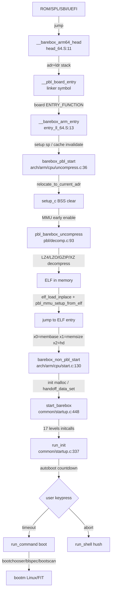
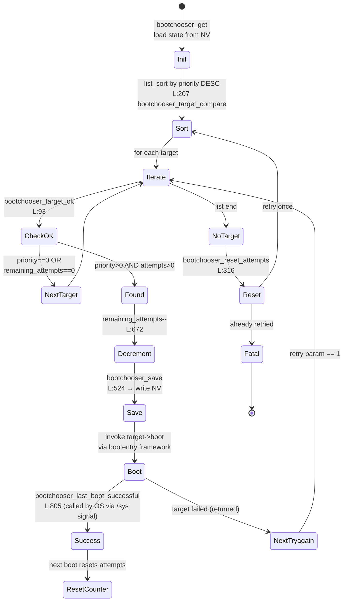
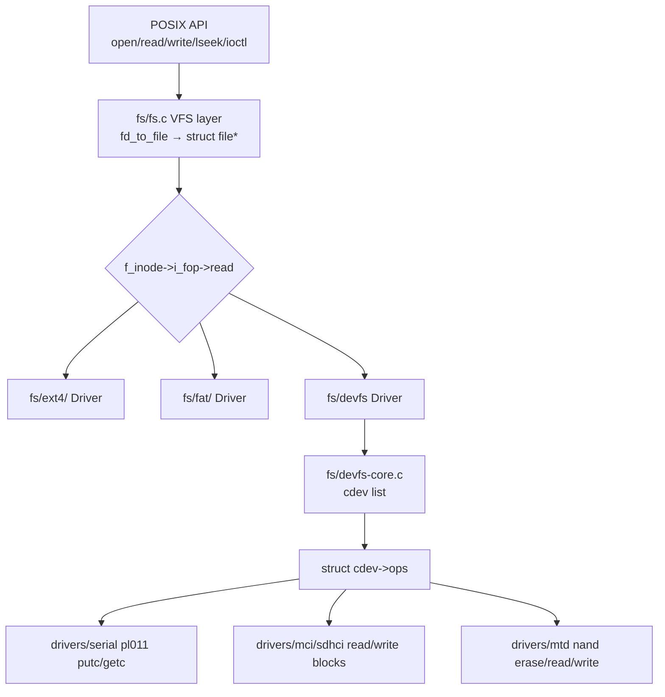
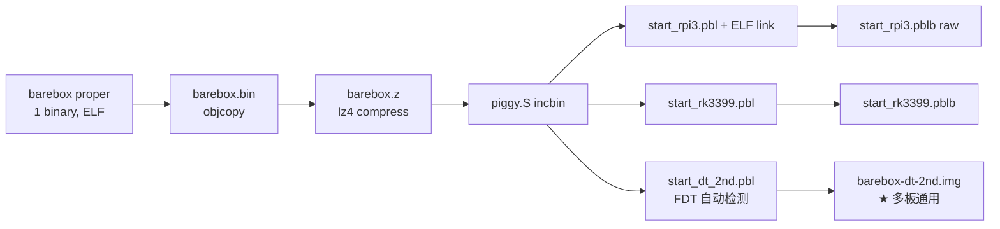

# 03-14 — barebox 精读（侧重：用法 + 与 U-Boot 的异同）

> **侧重定位：** 03-06 已深度讲过 U-Boot。本笔记不重复 SPL/proper/DM/FIT 等通用 bootloader 概念，**专门讲 barebox 与 U-Boot 异同 + 实际用法**。如果你已经会用 U-Boot，本笔记 30 分钟可上手 barebox。
>
> **一句话答案：** barebox = "**Das U-Boot 的现代重写**"。沿用 U-Boot 的任务定位（嵌入式 bootloader），但抛弃 U-Boot 历史包袱，**采用 Linux kernel 设计风格**：POSIX file API、devfs、driver model 类似 Linux LDM、Kconfig 完全 Linux 风。Sascha Hauer（Pengutronix）2007 fork，至今活跃。

按 9 阶段递归大纲：本笔记覆盖 **阶段 3-5**（项目细化 + QuickStart + 熟练）。

---

## 1. 阶段 3 — 项目身份

### 1.1 基本信息

| 项 | 值 |
|----|---|
| **正式名** | barebox（小写） |
| **起源** | 2007 fork from U-Boot 1.3.0，Sascha Hauer @ Pengutronix |
| **公司** | Pengutronix（德国嵌入式）主导 |
| **协议** | GPL-2.0-only |
| **代码量** | ~10 万行（U-Boot 的 1/7） |
| **语言** | C（写法更现代）|
| **本仓库路径** | `/home/heke/tgln/stage2/material/boot/barebox/` |
| **官网** | https://www.barebox.org/ |
| **试运行** | https://www.barebox.org/jsbarebox/ （浏览器里跑！） |
| **支持架构** | arm / aarch64 / kvx / mips / openrisc / powerpc / riscv / sandbox / x86 |

### 1.2 与 U-Boot 的设计哲学差异

| 维度 | U-Boot | barebox |
|------|--------|---------|
| **fork 起点** | 起源 2000 (PowerPC ABI) | 2007 fork U-Boot 1.3.0 |
| **代码风格** | 多年累积 | Linux kernel 风格（device model / kobj） |
| **文件 API** | 自有 / 各驱动各异 | **POSIX 风** `open/close/read/write/lseek` |
| **shell** | 内置 mini-shell | hush + bash-like + POSIX 一致命令 |
| **filesystem** | per-cmd 实现 | 统一 VFS（mount / umount / devfs） |
| **driver model** | DM (2014 后) | Linux 风格 LDM（早就有）|
| **多平台镜像** | 通常一板一镜像 | `multi_v7_defconfig` 一个镜像跑数十板 |
| **PBL** | SPL（独立机制）| PBL (Pre-Bootloader)，与 proper 同源代码组织 |
| **配置** | Kconfig（同 Linux）| Kconfig（同 Linux，更彻底） |
| **文档** | reST + scattered | reST 完整在线文档 |
| **Web 体验** | 无 | jsbarebox（WebAssembly 浏览器演示）|
| **目标社区** | 全球大厂 / SoC 厂 | 德语区嵌入式 / 工业 |

**核心哲学差异：** U-Boot 是"嵌入式厂商共用工具集"（每家加自己的板/驱动）；barebox 是"按 Linux 内核标准重写的现代 bootloader"（强一致性 / API 统一 / 易移植）。

---

## 2. 阶段 4 — QuickStart（10 分钟跑通）

### 2.1 编译 ARM virt 版本

```bash
cd /home/heke/tgln/stage2/material/boot/barebox

# 选 multi-arch ARM v8 配置（一个二进制跑多板）
make ARCH=arm CROSS_COMPILE=aarch64-linux-gnu- multi_v8_defconfig
make ARCH=arm CROSS_COMPILE=aarch64-linux-gnu- -j$(nproc)

# 产物
ls images/
# barebox-dt-2nd.img    ← 多板共用主镜像
```

### 2.2 QEMU 启动

```bash
qemu-system-aarch64 -M virt -cpu cortex-a57 -nographic \
  -kernel images/barebox-dt-2nd.img
```

预期看到：
```
barebox 2024.X.X
Board: ARM QEMU Virt
...
barebox@ARM QEMU Virt:/
```

### 2.3 RISC-V 编译

```bash
make ARCH=riscv CROSS_COMPILE=riscv64-linux-gnu- rv64i_defconfig
make ARCH=riscv CROSS_COMPILE=riscv64-linux-gnu- -j$(nproc)

qemu-system-riscv64 -M virt -nographic \
  -bios opensbi-fw.bin \
  -kernel images/barebox.img
```

### 2.4 浏览器立即试用（无需编译）

打开 https://www.barebox.org/jsbarebox/?graphic=0 — barebox 跑在浏览器 WebAssembly 中。

---

## 3. 阶段 5 — 熟练（日常使用 / 用法相对 U-Boot 的"奇技淫巧"）

### 3.1 文件系统操作（U-Boot 没有的"Unix 感"）

```bash
# barebox shell 内
ls /                     # 看 ramdisk 根
mount                    # 看挂载列表
ls /dev                  # 看所有设备文件（devfs）
cat /env/config          # 读环境变量
echo "hello" > /tmp/x    # 写文件
cd /mnt/sd0
mkdir backup
cp /tmp/x backup/

# 挂载 SD 卡 partition
mkdir /mnt/sd
mount /dev/sd0.0 /mnt/sd     # 自动识别 fs
ls /mnt/sd

# 写回环境变量到 dataflash
saveenv
```

→ **U-Boot 没有这种"在 bootloader 内随意 cd / cat / mount"的体验**。

### 3.2 多板镜像：`multi_v8_defconfig` 的魔法

barebox 的"一个镜像跑数十板"通过 PBL（Pre-Bootloader）实现：

```
images/barebox-dt-2nd.img
├── PBL（每板不同，做低级 init + 把 dt 传给 proper）
│   ├── pbl-rpi3.bin
│   ├── pbl-rk3399.bin
│   ├── pbl-imx8.bin
│   └── ...几十个
└── barebox proper（所有板共享同一个二进制）
```

启动时 ROM/SPL 选对的 PBL，PBL 跳到共享 proper。

→ **U-Boot 是一板一 SPL+一 proper，绝大多数板不能复用同一镜像。**

### 3.3 启动 Linux：`bootm` / `boot` 命令

```bash
# barebox 内
bootm /mnt/sd/zImage         # 解析 image header 自动加载
boot mmc                     # 用 bootchooser 框架自动选 boot entry
```

### 3.4 bootchooser — 自动 A/B 引导回退

barebox 自带 `bootchooser`：内置 boot entry 优先级 + 失败计数器，启动失败自动切到备份 entry。

```bash
# 配置（在 /env 里）
nv bootchooser.targets=system0 system1
nv bootchooser.system0.boot=/mnt/sd/system0/Image
nv bootchooser.system0.priority=20
nv bootchooser.system1.boot=/mnt/sd/system1/Image
nv bootchooser.system1.priority=10

# 启用
boot bootchooser
```

→ **U-Boot 类似功能要自己写 bootscript + 计数器。barebox 内置。**

### 3.5 RATP — RFC 916 的现代复活

barebox 实现了 **RATP (Reliable Asynchronous Transfer Protocol)** —— 通过 UART 传文件、远程命令执行、固件刷写。比 Y-modem 快数倍。

```bash
# host 端
barebox-ratp --device /dev/ttyUSB0 --put image.bin /mnt/sd/image.bin
barebox-ratp --device /dev/ttyUSB0 --exec "ls /mnt/sd/"
```

### 3.6 调试技巧

| 技巧 | barebox 命令 |
|------|------------|
| 打开 verbose | `loglevel 7` |
| 看 console 历史 | `dmesg` |
| 检查驱动 | `drvinfo` / `devinfo /dev/sd0` |
| GDB attach | 编译时开 `CONFIG_DEBUG_INFO=y` + `arm-none-eabi-gdb barebox` |
| 内存读写 | `md 0x80000000 16` / `mw 0x80000000 0xdeadbeef` |
| Sandbox 跑（无硬件）| `make ARCH=sandbox sandbox_defconfig && ./barebox` 直接在 PC 跑 |

### 3.7 sandbox 模式 — 在 PC 直接跑 barebox

```bash
make ARCH=sandbox sandbox_defconfig
make
./barebox        # 直接跑，无 QEMU 无嵌入式硬件
```

→ **极方便测试新功能 / 学习内部机制**。U-Boot 也有 `sandbox` 类似但 barebox 更完整。

### 3.8 开发新板的工作量对比

| 任务 | barebox | U-Boot |
|------|---------|--------|
| 新建板目录 | `arch/<arch>/boards/<board>/` | `board/<vendor>/<board>/` |
| 写 dts | 复用 Linux dts | 同 |
| 写 defconfig | 简单 | 简单 |
| 写 board init code | 通常 0 行（PBL 通用）| 几百行 |
| 调试 | sandbox + jtag | jtag + 串口 |

barebox 通常**新板几小时上手**，u-boot 可能要几天到几周。

---

## 4. 用法对照速查（barebox vs U-Boot）

| 任务 | U-Boot 命令 | barebox 命令 |
|------|------------|-------------|
| 看变量 | `printenv` | `printenv` / `cat /env/config` |
| 设变量 | `setenv X val` | `nv X=val` / `global X=val` |
| 保存 | `saveenv` | `saveenv` |
| 加载文件 | `fatload mmc 0:1 ${addr} file` | `cp /mnt/sd0/file /tmp/x` |
| 启动 Linux | `bootm` / `booti` / `bootefi` | `bootm` |
| 看内存 | `md.l 0x80000000 16` | `md -s 0x80000000 -l 16` |
| 写内存 | `mw.l 0x80000000 0xdeadbeef` | `mw 0x80000000 0xdeadbeef` |
| 复位 | `reset` | `reset` |
| help | `help` / `?` | `help` |

---

## 5. 阶段 6 — 全子组件枚举（"项目里都有什么"）

### 5.1 顶层目录全览

| 目录 | 角色 |
|------|------|
| `arch/` | 架构特定代码（arm / aarch64 / mips / openrisc / powerpc / riscv / sandbox / x86 + kvx）|
| `commands/` | **174 个内置命令源文件**（cat / cd / ls / mount / boot / bootm / bootchooser / md / mw / ...）|
| `common/` | 通用核心（init / boot / bootargs / bootchooser / bootdef / blspec / bbu / binfmt / block / partition / ...）|
| `drivers/` | **52 个驱动子目录**（见下表 5.2）|
| `fs/` | **18 种文件系统**（ext4 / fat / cramfs / jffs2 / squashfs / ubifs / nfs / tftp / 9p / efivarfs / ramfs / ratpfs / smhfs / pstore / devfs / qemu_fw_cfg / ubootvarfs / uimagefs）|
| `pbl/` | Pre-Bootloader（barebox 的 SPL 等价）|
| `images/` | 镜像组装脚本（多板共用镜像）|
| `dts/` | Device Tree 副本（与 Linux 同源）|
| `efi/` | barebox 作为 EFI 应用运行的支持 |
| `crypto/` | hash / encryption 库 |
| `firmware/` | 板上 firmware blob |
| `lib/` | 通用库（lzo / xz / zlib / gunzip / ...）|
| `net/` | 网络栈 |
| `security/` | TPM / 安全 |
| `defaultenv/` | 默认环境变量集（启动脚本）|
| `scripts/` | 构建辅助脚本 |
| `test/` + `pytest.ini` + `conftest.py` | pytest 测试框架（U-Boot 没这种）|
| `Documentation/` | 完整 reST 文档 |

### 5.2 52 个驱动子系统枚举（drivers/）

按 Linux 内核风格组织：

```
aiodev / amba / ata / base / block / bus / clk / clocksource / crypto / ddr /
dma / eeprom / efi / firmware / fpga / gpio / hab / hw_random / i2c / input /
led / mailbox / mci / memory / mfd / misc / mtd / mux / net / nvme / nvmem /
of / pci / phy / pinctrl / pmdomain / power / pwm / regulator / remoteproc /
reset / rtc / serial / soc / sound / spi / tee / usb / video / virtio / w1 / watchdog
```

→ **几乎与 Linux drivers/ 一一对应**。学完 Linux 驱动 = 几乎学完 barebox 驱动。

### 5.3 174 个内置命令分类

```
文件操作      ls / cd / mkdir / rm / cp / mv / pwd / cat / echo / touch
环境变量      printenv / nv / global / setenv / saveenv / loadenv
块设备/分区   mount / umount / blkstats / partition / mmc / mmc_extcsd
启动           boot / bootm / booti / bootl / bootefi / bootchooser / bootselect
内存           md / mw / memcpy / memcmp / memset / memtest / memtester
网络           ifconfig / ping / dhcp / tftp / nfs / ftpget / wget / nslookup
镜像           bootm / barebox-update / bbu / mkimage 衍生
安全           sha1sum / sha256sum / md5sum / hmac / crc32 / digest
调试           dmesg / drvinfo / devinfo / loglevel / monitor / watchdog
shell         hush 内置（if/then/else, for, while, function）
USB / DFU     usb / dfu
GPIO/PWM/I2C  gpio_get_value / pwm / i2c_read / i2c_write
KGDB-like     break / continue
开发           2048（俄罗斯方块小游戏，Easter egg）/ beep / sleep
```

完整列表：`ls /home/heke/tgln/stage2/material/boot/barebox/commands/`

### 5.4 18 种文件系统

| FS | 用途 |
|----|------|
| ext4 / fat / squashfs / cramfs / jffs2 / ubifs | 持久存储 |
| 9p | virtio 9p 共享 |
| nfs / tftp | 网络 |
| ramfs | 内存 |
| devfs | 设备节点（/dev）|
| efi / efivarfs | EFI 模式下用 |
| pstore | 持久化日志（崩溃恢复）|
| qemu_fw_cfg | QEMU 配置传递 |
| ratpfs | RATP 协议虚拟 fs |
| smhfs | ARM Semihosting 虚拟 fs |
| ubootvarfs | 读 U-Boot env（互操作）|
| uimagefs | U-Boot uImage 格式 |

### 5.5 多架构 + 多板支持

- **支持架构数**：9（arm / aarch64 / kvx / mips / openrisc / powerpc / riscv / sandbox / x86）
- **支持板数**：数百（每个 arch/<arch>/boards/ 下有几十）
- **multi_v7_defconfig / multi_v8_defconfig**：一个二进制跑同 ISA 几十板

---

## 6. 阶段 7+ — 工业实践（谁在用 barebox）

| 厂商 / 产品 | 用途 |
|------------|------|
| **Pengutronix（项目主导）+ 客户** | 工业控制器 / HMI / 智能家电 |
| **TQ-Group**（德国嵌入式）| Cortex-A 模块板 |
| **Garz & Fricke**（HMI 厂）| 工业屏 |
| **Phytec**（嵌入式 SoM 模块）| 多种 |
| **Rauland-Borg**（医疗护理呼叫系统）| 嵌入式终端 |
| **Skidata**（停车场系统）| 嵌入式控制器 |
| **赛普拉斯 / NXP / TI 部分参考板** | BSP 借鉴 |

**barebox 主战场：** 德语区 + 工业 + 医疗 + 汽车 / 商业嵌入式（不是消费电子）

**与 RAUC OTA 框架天然集成：** barebox 的 bootchooser ↔ RAUC 状态机直接对接，工业产品 OTA 升级首选组合。

---

---

## 7. 阶段 7+ — 源码级 deep-dive（造一个同类 bootloader 必备）

> **目标：** 读完本节 + 7 个对应源文件，自己能写一个"barebox-like"的 bootloader 架构骨架。每节都给精确文件路径 + 行号 + 设计动机。

### 7.1 启动总览（PBL → proper 全链路 Mermaid）



> **关键差异 vs U-Boot：** U-Boot SPL 跳到 U-Boot proper 的入口固定（`_start`），proper 自己 relocate；barebox PBL 直接做 self-extract + ELF in-place relocation，proper 启动时已经在最终地址。proper 不做 relocation。

---

### 7.2 PBL 启动汇编 + uncompress.c 精读

#### 7.2.1 ARM64 head：`arch/arm/cpu/head_64.S` (33 行)

```asm
/* head_64.S:11-25 */
ENTRY(__barebox_arm64_head)
    nop                           /* code0：可被替换为 efi_signature_nop（为 EFI 双入口）*/
    adr x9, __pbl_board_stack_top /* 本板专属 stack top（链接器填）*/
    ldr x9, [x9]
    cbz x9, 1f                    /* 如果 0 表示 BootROM 已设 stack，跳过 */
    mov sp, x9
1:
#ifdef CONFIG_PBL_BREAK
    brk #17                       /* 调试 hook：JTAG 在此停下 */
#endif
    b __pbl_board_entry           /* 链接器把这个符号定到本板的 ENTRY_FUNCTION */
```

**设计要点：**
- `__pbl_board_entry` / `__pbl_board_stack_top` 是 **链接器用 `--defsym=__pbl_board_entry=$(2)` 注入** 的（[7.5 链接脚本](#75-链接脚本--多板镜像)）。一个 PBL 二进制只对应一个板的入口。
- `code0` 占位 `nop` 可被改成 EFI 签名 `efi_signature_nop`（见 `board-dt-2nd-aarch64.S:13`），这样同一镜像既能从 ROM 跳，也能作为 EFI Image 被 UEFI 加载。
- `brk #17` 是 ARMv8 的 software breakpoint —— 调试时 JTAG 在 hardcoded 入口先停下，**这是 KuBoot 应该抄的** GDB hook 设计。

#### 7.2.2 板特定 entry：`arch/arm/cpu/board-dt-2nd-aarch64.S` (33 行)

```asm
/* :11-30 — multi_v8 通用入口 */
.section .text_head_entry_start_dt_2nd
ENTRY("start_dt_2nd")
    efi_signature_nop          /* code0：EFI MZ 签名 + nop 占位 */
    b 2f                       /* code1：跳过 Linux ARM64 image header 8 字段 */
    .xword 0x80000             /* Image load offset：与 Linux 相同 */
    .xword _barebox_image_size
    ...
    .ascii ARM64_IMAGE_MAGIC   /* "ARM\x64" */
2:
    adr x1, _text - .
    mov sp, x1                 /* 临时 stack：grows downward into 0x80000 头 */
    b dt_2nd_aarch64           /* 进入 C */
    __EFI_PE_HEADER            /* PE/COFF 头紧跟，UEFI 可识别 */
```

**多入口同体设计：** 同一二进制有 **3 种识别方式**：
1. ROM/U-Boot 直接跳 0x0 → 跑汇编 entry
2. Linux/U-Boot 当 kernel 加载 → ARM64 image header 自动识别
3. UEFI 当 EFI 应用加载 → PE/COFF header + `efi_signature_nop`

KuBoot 想做"通用镜像"必须抄这个 layout。

#### 7.2.3 通用 entry trampoline：`entry_ll_64.S` (24 行)

```asm
/* entry_ll_64.S:13-23 */
ENTRY(__barebox_arm_entry)
    mov sp, x3                              /* x3 = 板传来的 stack top */
    mov x19, x0  /* save membase */
    mov x20, x1  /* save memsize */
    mov x21, x2  /* save board_data (FDT 指针) */
    bl arm_early_mmu_cache_invalidate       /* 关 D-cache，I-cache invalidate */
    mov x0, x19; mov x1, x20; mov x2, x21
    b barebox_pbl_start
ENDPROC(__barebox_arm_entry)
```

> **为什么 `bl` 之前要保存 x0-x2 到 x19-x21？** ARMv8 ABI 中 x0-x18 是 caller-saved，被调函数可以破坏。x19-x28 是 callee-saved，安全。这是裸机 C 调用前必修课。

#### 7.2.4 主肝：`barebox_pbl_start` — `arch/arm/cpu/uncompress.c:36` (128 行总长)

```c
/* uncompress.c:36 — PBL 的"主肝"，所有重活都在这里 */
void __noreturn barebox_pbl_start(unsigned long membase, unsigned long memsize,
                                  void *boarddata)
{
    /* 1. 算 piggy data 边界（被链接进 .piggydata 段，是压缩的 proper）*/
    pg_start = runtime_address(input_data);     // L:50
    pg_end   = runtime_address(input_data_end); // L:51
    
    /* 2. 自重定位：如果 PC 在 RAM 内则原地，否则复制到 RAM */
    if (pc > membase && pc - membase < memsize)
        relocate_to_current_adr();               // L:59
    else
        relocate_to_adr(membase);                // L:61
    
    pg_len = pg_end - pg_start;
    /* piggy 末 4 字节是 uncompressed length（lz4/gz/xz 通用约定）*/
    uncompressed_len = get_unaligned((const u32 *)(pg_start + pg_len - 4));
    
    setup_c();                                   // L:66 — 清 BSS, 拷 .data
    arm_pbl_init_exceptions();                   // L:70 — vector table
    
    /* 3. 安排内存布局：proper 放最高，handoff data 接着 */
    barebox_base = arm_mem_barebox_image(...);   // L:76
    handoff_data = (void*)barebox_base + uncompressed_len + MAX_BSS_SIZE;
    
    /* 4. 早期 MMU 开启 —— 加速解压（D-cache 命中率↑↑）*/
    if (IS_ENABLED(CONFIG_MMU))
        mmu_early_enable(membase, memsize);      // L:88
    
    /* 5. 调用 decompressor（lz4/lzo/gz/xz 之一编译进 PBL）*/
    pbl_barebox_uncompress((void*)barebox_base, pg_start, pg_len);  // L:95
    
    /* 6. 解压结果是 ELF，原地 relocate */
    elf_open_binary_into(&elf, (void*)barebox_base);  // L:99
    elf_load_inplace(&elf);                            // L:103
    
    /* 7. 用 ELF segment flags（PF_R/W/X）建最终 page table */
    pbl_mmu_setup_from_elf(&elf, membase, memsize);   // L:112
    
    barebox = (void*)elf.entry;                  // L:116
    handoff_data_move(handoff_data);             // L:118 — 把 FDT 等传给 proper
    sync_caches_for_execution();                 // L:120
    
    /* 8. 跳！proper 从 ELF entry（即 barebox_non_pbl_start）开跑 */
    barebox(membase, memsize, handoff_data);     // L:127
}
```

**6 个非凡设计点（KuBoot/KuUEFI 应抄）：**

| 设计 | 文件:行 | 价值 |
|------|---------|------|
| **runtime_address** + relocate_to_current_adr | uncompress.c:50,59 | PIC 风格，PBL 二进制可放 ROM/RAM 任意地址 |
| **piggy 末 4 字节存 uncompressed_len** | :64 | 不需独立 metadata 文件，实现 self-extract |
| **MMU 在解压前打开** | :88 | D-cache 加速大压缩包解压 5-10× |
| **解压物是 ELF 不是 raw blob** | :99,103 | 利用 ELF relocation 表精确处理 PIC，比 raw + linker fixup 表更通用 |
| **ELF segments 推 page perms** | :112 | .text 给 RX，.rodata 给 R，.data 给 RW —— PBL 阶段就有 W^X 安全 |
| **handoff_data_move** | :118 | 跨阶段传 FDT/board info 的标准 ABI（替代 U-Boot 的 atag/r2） |

#### 7.2.5 RISC-V 等价路径：`arch/riscv/boot/uncompress.c:29-106`

完全对应 ARM64 版本，区别：
- 入口符号是 `start_*` 函数（在 `arch/riscv/boot/`），通过 `riscv_mode()` 检测当前 M-mode/S-mode
- 无 PE/COFF 头，但有 nmon header（仅 erizo 板用，`arch/riscv/boot/nmon_entry.S`）
- `irq_init_vector(riscv_mode())` 写入 `mtvec` 或 `stvec`（[03-07-rboot](03-16-rboot-walkthrough.md) UEFI 入口对比）

#### 7.2.6 跨阶段 handoff：`pbl/handoff-data.c` (213 行)

PBL → proper 的传值用 type-tag list：

```c
/* pbl/handoff-data.c — 关键数据结构 */
struct handoff_data {
    u32 magic;
    u32 entries;
    struct handoff_entry {
        u32 type;     /* HANDOFF_DATA_INTERNAL_DT / _ARM_MACHINE / _DT_Z 等 */
        u32 size;
        /* payload follows */
    } entries[];
};
```

接收方在 `start.c:64`（ARM）或 `start.c:135`（RISC-V）调 `handoff_data_get_entry(HANDOFF_DATA_INTERNAL_DT, &size)` 取 FDT。

**对比：**
- U-Boot：r0=0, r1=machine_id, r2=atag/dtb（ARM Linux 历史 ABI）
- barebox：x0=membase, x1=memsize, x2=struct handoff_data*（自定义但可扩展）

---

### 7.3 bootchooser 状态机精读：A/B 双分区回退

#### 7.3.1 关键数据结构（`common/bootchooser.c:46-77`）

```c
/* L:46 */
struct bootchooser {
    struct list_head targets;            /* 所有 target，按 priority 降序 */
    struct bootchooser_target *last_chosen;
    struct state *state;                 /* 持久化状态（NV / dataflash / EEPROM）*/
    char *state_prefix;
    int refs;                            /* 引用计数 */
    bool attempts_locked;                /* 真则不再递减计数（首次启动期）*/
    int verbose;
    int dryrun;                          /* 测试不实际跳 */
};

/* L:59 */
struct bootchooser_target {
    struct bootchooser *bootchooser;
    struct list_head list;
    
    /* 运行时状态（持久化在 state 中）*/
    unsigned int priority;               /* 当前优先级，0 = disabled */
    unsigned int remaining_attempts;     /* 剩余尝试，0 = disabled */
    int id;
    
    /* 静态 spec */
    const char *name;                    /* "system0" / "system1" */
    unsigned int default_attempts;       /* 默认重置值，e.g. 3 */
    unsigned int default_priority;       /* e.g. 20 */
    char *boot;                          /* "/mnt/sd0.0/Image" 或 entry 名 */
    char *prefix;                        /* "global.bootchooser.system0" */
    char *state_prefix;                  /* "state.bootstate.system0" */
};
```

#### 7.3.2 选择算法（`bootchooser_get_target` — L:655）



**核心算法（L:655-688）：**
```c
static struct bootchooser_target *bootchooser_get_target(struct bootchooser *bc) {
    list_for_each_entry(target, &bc->targets, list)         /* 已按 priority 降序 */
        if (bootchooser_target_ok(target, NULL))            /* L:93 */
            goto found;
    /* 遍历完无可用 → 错误 */
    return ERR_PTR(-ENOENT);
found:
    if (!bc->attempts_locked) {
        target->remaining_attempts--;                       /* 关键：先扣计数 */
        ...
    }
    bc->last_chosen = target;
    bootchooser_save(bc);                                   /* 立即持久化！*/
    return target;
}
```

**为什么先扣计数后启动？** 防止"启动卡死永不下次"——每次进 boot 路径就扣一次，若 OS 启动到 userspace 后调 `bootchooser_last_boot_successful()` 才把计数重置。否则即便 OS 卡在 panic loop，计数也会归零，下次自动切到备份分区。

#### 7.3.3 RAUC 集成（与 OTA 框架对接）

barebox bootchooser **天然就是** RAUC 的 boot slave：
- `state` 模块（`common/state/`）从 NV 读出 RAUC 写的优先级 + 尝试次数
- RAUC update 完成后写入 `bootstate.system0.priority=20`，`system1.priority=10`
- 启动失败回退到 system1 → RAUC 检测到 → 标记 system0 为坏

> **U-Boot 等价：** uboot-env + bootcount + altbootcmd，需要自己写 bootscript。barebox 一行 `boot bootchooser` 搞定。

#### 7.3.4 KuBoot 应学的 4 个关键点

1. **状态原子化持久化**：`bootchooser_save` 调一次写一次（L:524），避免崩溃中状态半新半旧
2. **list_sort 一次性算优先级**（L:207）：每次 boot 都重排，不靠静态 array
3. **target name + state_prefix 双索引**：name 用于命令行，state_prefix 用于 NV 路径，解耦
4. **bootchooser_last_boot_successful 由 OS userspace 调**：bootloader 不假设自己能判断"成功"——用户态决定

---

### 7.4 VFS + devfs 架构（POSIX in bootloader）

#### 7.4.1 三层抽象 Mermaid



#### 7.4.2 关键入口：`fs/fs.c` (3654 行)

| 入口函数 | 行号 | 任务 | 设计要点 |
|----------|------|------|----------|
| `init_fs` | :220 | 分配 cwd buf + 设 `*cwd='/'` | postcore_initcall（早期）|
| `openat(dirfd, path, flags)` | :2709 | path → dentry → struct file → fd | 完全 POSIX 语义 |
| `read(fd, buf, n)` | :459 | fd_to_file → __read → `f->f_inode->i_fop->read` | inode-level dispatch |
| `write(fd, buf, n)` | :528 | 同上，write 路径含 truncate-on-grow（:490）| 自动 grow file size |
| `lseek(fd, off, whence)` | :562 | 调 fs driver 自己实现的 seek | 块设备和流文件分别处理 |
| `mount(device, fsname, path, opts)` | :3254 | 创建 fs_device → register_device → bus 自动 probe | `fsname=NULL` 自动检测（:3287） |
| `umount(path)` | :3364 | 走 d_path 找 fsdev → unregister | 引用计数保护 |
| `fsdev_open_cdev` | :946 | 把 fs 后端的 cdev 打开 | fs 通过 cdev 读底层块设备 |

**核心数据结构链：**

```c
struct file files[MAX_FILES];       /* fs.c:214 — 文件描述符表 */

/* 文件 = inode + position + flags */
struct file {
    struct inode *f_inode;          /* 真正的元数据 + i_fop */
    loff_t f_pos;
    unsigned int f_flags;
    struct fs_device *fsdev;        /* 所属挂载点 */
    loff_t f_size;
};

/* devfs 设备 = 字符设备节点 */
struct cdev {
    const struct file_operations *ops;     /* read/write/lseek/erase/ioctl */
    struct device *dev;
    char *name;                            /* "sd0" / "ttyAMA0" / "nand0.kernel" */
    loff_t offset;                         /* partition offset (cdev 是 partition 的话)*/
    loff_t size;
    int open;                              /* 引用计数 */
    struct list_head list;                 /* 全局 cdev_list */
    struct list_head partitions;           /* 子分区 */
};
```

#### 7.4.3 devfs：`fs/devfs-core.c` (993 行) 关键 API

```c
/* devfs-core.c — bootloader 里的 /dev */
int devfs_create(struct cdev *new);       /* L:525 — 注册新设备节点 */
int devfs_remove(struct cdev *cdev);      /* L:583 */
struct cdev *cdev_open_by_name(const char *, ulong);  /* L:275 */
ssize_t cdev_read(...);                   /* L:321 */
struct cdev *devfs_add_partition(...);    /* L:758 — 自动建 sd0.0/sd0.1 */
struct cdev *cdev_create_loop(path, ...); /* L:871 — barebox 也支持 loop！*/
void devfs_init(void);                    /* L:515 — 由 startup.c:65 调 */
```

**设计精华：partition as cdev**
- 一个 NAND 设备注册成 `nand0` cdev
- 调 `devfs_add_partition("nand0", offset, size, flags, "kernel")` 创建 `nand0.kernel` 子 cdev
- 子 cdev 有自己的 `offset`，read 时 `master->ops->read(buf, count, offset + my_offset)` 自动加偏移
- → **同一个底层 ops，支持任意嵌套分区**

#### 7.4.4 与 Linux VFS 的相同与不同

| 特性 | Linux VFS | barebox VFS | 备注 |
|------|-----------|-------------|------|
| dentry / inode 缓存 | 有 LRU | 简化（无淘汰）| bootloader 不需要 |
| 用户态 syscall | 走 sys_open → do_filp_open | 直接函数调用 | 无 syscall 隔离 |
| mount namespace | 有 | 无 | 单 root |
| writeback / page cache | 有 | 无 | 直写 |
| 异步 I/O | aio / io_uring | 无 | bootloader 全同步 |
| **`f_inode->i_fop`** | **同名同语义** | **同名同语义** | barebox 抄 Linux |

→ **学完 Linux VFS = 学完 barebox VFS**（这是 barebox 项目从设计哲学层面贯彻的）。

---

### 7.5 链接脚本 + 多板镜像

#### 7.5.1 PBL 链接脚本：`arch/arm/lib/pbl.lds.S` (149 行)

关键 section 布局（每个 PBL 二进制都长这样）：

```ld
/* arch/arm/lib/pbl.lds.S */
SECTIONS {
    . = 0x0;                                /* PIC：load 时再加偏移 */
    .image_start : { *(.__image_start) }
    .text : {
        _stext = .;
        *(.text_head_prologue*)             /* L:50 — head_64.S 在这 */
        *(.text_head_entry*)                /* L:51 — board entry，链接器替换 */
        __bare_init_start = .;
        *(.text_bare_init*)                 /* relocate_to_* 等 PIC 代码 */
        __bare_init_end = .;
        . = ALIGN(0x20);
        __exceptions_start = .;
        KEEP(*(.text_exceptions*))          /* 异常向量表 */
        __exceptions_stop = .;
        *(.text*)                           /* 普通代码 */
    }
    
    . = ALIGN(ASM_SZPTR);
    __pbl_board_stack_top = .;              /* L:70 — 板特定 stack top 数组 */
    .rodata.pbl_board_stack_top : {
        *(.pbl_board_stack_top_*)
        ASM_LD_PTR(0x00000000)              /* dummy 0 = ROM 已设 stack */
    }
    ASSERT(. - __pbl_board_stack_top <= 2 * ASM_SZPTR, "Only One PBL per Image")
    
    .piggydata : { *(.piggydata) }          /* L:122 — 压缩的 proper 在这 */
    .image_end : { KEEP(*(.__image_end)) }
}
```

> **为什么 `ASSERT(. - __pbl_board_stack_top <= 2 * ASM_SZPTR)`？** 一个 PBL ELF 只能链接一块板的 stack_top（8 字节 ARM64）。多个 stack_top 段一起会撞上断言 —— 强制 "1 PBL = 1 board entry"。

#### 7.5.2 多镜像生成：`images/Makefile` (~700 行)

核心机制：每个板声明 `pblb-y += start_<board>` → 生成 `start_<board>.pbl` ELF + `.pblb` 二进制。

```makefile
# images/Makefile:65-80 — 链接命令
cmd_elf__ ?= $(LD) -e $(2) -Map $@.map \
    --gc-sections --defsym=__pbl_board_entry=$(2) \    # ★ 关键：注入板入口
    -T $(pbl-lds) \
    --whole-archive $(BAREBOX_PBL_OBJS) $(BAREBOX_PIGGY_OBJS)

# images/Makefile:205-207 — multi_v8 共用入口
pblb-$(CONFIG_BOARD_GENERIC_DT) += start_dt_2nd
FILE_barebox-dt-2nd.img = start_dt_2nd.pblb
image-$(CONFIG_BOARD_GENERIC_DT) += barebox-dt-2nd.img
```

**`piggy.S` 的真相**（`images/piggy.S`，9 行）：

```asm
.section .piggydata,"a"
.globl input_data
input_data:
    .incbin "images/barebox.z"      /* ★ 把整个压缩 proper 当 binary 嵌进来 */
.globl input_data_end
input_data_end:
```

→ proper 编译完得 `barebox`（ELF）→ objcopy 成 `barebox.bin` → lz4/gzip → `barebox.z` → `incbin` 进 PBL。最终 PBL 二进制 = `entry asm + relocate_code + decompressor + barebox.z`。

#### 7.5.3 multi_v8 多板共用一镜像的真相

**事实是：multi_v8_defconfig 不生成"一个二进制跑数十板"**。每个板有独立 PBL（`start_<board>.pblb`）。**真正共享的是 proper**（同一个 `barebox.bin` 被嵌入到所有 PBL 镜像）。

但 `barebox-dt-2nd.img` 是个**例外**——它的 PBL 通过 FDT 自动检测一切（[02-05](02-05-fdt-runtime-detection.md)），所以 ARMv8 任何 board（rpi3 / rk3399 / qemu-virt）都能跑同一份 `barebox-dt-2nd.img`。条件是 **bootloader 上层（U-Boot/UEFI）传 FDT** 给它（"2nd stage"含义）。



#### 7.5.4 KuBoot 链接器借鉴清单

- 顶层 `--defsym=__board_entry=$(BOARD)` 注入板入口名（每板 1 二进制）
- `.piggydata` 用 `incbin` 嵌入压缩 proper（zig 用 `@embedFile`）
- ASSERT(__board_stack_top size) 防多板入口冲突

---

### 7.6 关键驱动桥接：从 device tree 到 /dev

#### 7.6.1 console_device 注册：PL011 UART 完整路径

`drivers/serial/amba-pl011.c:175-215` 是**模板级**驱动：

```c
/* amba-pl011.c:175 — probe 函数 */
static int pl011_probe(struct amba_device *dev, const struct amba_id *id) {
    struct amba_uart_port *uart;
    struct console_device *cdev;
    
    /* 1. 拿 regulator 上电（DT 解析 vqmmc-supply 之类）*/
    r = regulator_get(&dev->dev, NULL);
    regulator_enable(r);
    
    /* 2. 分配 + DT 解析 + 拿 clock + 拿 reg 区间 */
    uart = xzalloc(sizeof(*uart));
    uart->clk = clk_get_for_console(&dev->dev, NULL);
    uart->base = amba_get_mem_region(dev);     /* AMBA bus 自动从 DT reg 拿地址 */
    
    /* 3. 填 console_device 钩子（4 个 ops）*/
    cdev = &uart->uart;
    cdev->dev = &dev->dev;
    cdev->tstc = pl011_tstc;                   /* 检测有数据 */
    cdev->putc = pl011_putc;                   /* 发字节（同步阻塞）*/
    cdev->getc = pl011_getc;
    cdev->setbrg = pl011_setbaudrate;
    cdev->linux_console_name = "ttyAMA";       /* ★ 自动塞到 bootargs：console=ttyAMA0 */
    cdev->linux_earlycon_name = "pl011";       /* ★ Linux earlycon=pl011,0x9000000 */
    cdev->phys_base = uart->base;
    
    pl011_init_port(cdev);
    /* 4. 注册 → 自动出现在 /dev/cs0 + 接管 console 输出 */
    console_register(cdev);                    /* L:212 */
    return 0;
}

/* L:217-229 — id table 决定哪些 vendor 落到这个 driver */
static struct amba_id pl011_ids[] = {
    { .id = 0x00041011, .mask = 0x000fffff, .data = &vendor_arm },
    { .id = 0x00380802, .mask = 0x00ffffff, .data = &vendor_st },
    { 0, 0 },
};

console_amba_driver(pl011_driver);             /* L:239 — 注册到 amba bus */
```

**自动 console=ttyAMA0 是怎么传给 Linux 的？**
- bootargs 自动追加 `console=ttyAMA0,115200`（`linux_console_name` + 当前 cdev id + 当前 baud）
- 实现在 `common/console_common.c` 的 console-bootargs hook 里

#### 7.6.2 GPIO 注册：`drivers/gpio/gpiolib.c:1254`

```c
/* gpiolib.c:1254 */
int gpiochip_add(struct gpio_chip *chip) {
    if (chip->base >= 0) {  /* 显式指定 base，检查冲突 */
        for (i = 0; i < chip->ngpio; i++)
            if (gpio_desc[chip->base + i].chip)
                return -EBUSY;
    } else {                /* 动态分配 base */
        chip->base = gpiochip_find_base(chip->ngpio);
    }
    slice_init(&chip->slice, dev_name(chip->dev));   /* 互斥访问保护 */
    list_add_tail(&chip->list, &chip_list);
    for (i = chip->base; i < chip->base + chip->ngpio; i++)
        gpio_desc[i].chip = chip;
    return of_gpiochip_add(chip);                    /* DT phandle 注册 */
}
```

→ 板上每颗 GPIO 控制器 probe 时调 `gpiochip_add`，全局 `gpio_desc[]` 由 GPIO 编号→ chip 反查。

#### 7.6.3 initcall 优先级链（执行顺序）

`include/init.h:54-71` 定义了 17 个等级，常用：

| 等级 | 用途 | 在何处调 |
|------|------|----------|
| 0 pure_initcall | 纯 var 初始化 | startup.c:453 主循环 |
| 1 core_initcall | 核心子系统（slab, console, of）| 同上 |
| 2 postcore_initcall | fs（init_fs, register_autoboot_vars）| 同上 |
| 3 console_initcall | console driver 注册 | 同上 |
| 5 mem_initcall | 内存子系统 | 同上 |
| 7 mmu_initcall | MMU 大页 + cache | 同上 |
| 9 coredevice_initcall | 关键设备（clk, irq）| 同上 |
| 10 fs_initcall | mount_root | startup.c:87 |
| 11 device_initcall | 大部分驱动 | barebox_memory_areas_init 等 |
| 13 of_populate_initcall | DT 节点 → struct device 生成 | 同上 |
| 14 late_initcall | 最末（log buffer 等）| 同上 |
| 15 environment_initcall | load /env | startup.c:169 |

**全部由 `start_barebox`（startup.c:448-479）一个 for 循环顺序执行**：

```c
/* startup.c:448 — proper 启动主入口 */
void __noreturn start_barebox(void) {
    initcall_t *initcall;
    for (initcall = __barebox_initcalls_start;
            initcall < __barebox_initcalls_end; initcall++) {
        result = (*initcall)();         /* 一个一个调，错了打印继续 */
    }
    barebox_system_state = BAREBOX_RUNNING;
    if (barebox_main) barebox_main();   /* run_init → autoboot */
    while (1) run_shell();
}
```

#### 7.6.4 KuBoot 驱动框架抄哪些？

1. **`struct console_device` + 4 个钩子（tstc/putc/getc/setbrg）** ：bootloader console 的最简抽象
2. **linux_console_name 字段**：自动 console= bootargs，省去用户配置
3. **`gpiochip_add` 模式**：全局 desc 数组 + chip list 双向索引
4. **17 级 initcall**：把"何时被调"声明式化，replace 命令式 init
5. **`amba_id` 表 + bus probe**：DT compatible 字符串 → driver 自动匹配

---


**KuBoot 设计实施清单（≥15 条）：**

#### 启动汇编/链接
1. **head.S 多入口同体**：第一条 `nop`（可改 EFI 签名）+ Linux/UEFI image header + `b` 跳真入口（仿 board-dt-2nd-aarch64.S）
2. **`__board_entry` 链接器替换**：`--defsym=__board_entry=$(BOARD)` 实现一个二进制对应一块板（仿 images/Makefile:67）
3. **PBL `.piggydata` 段嵌压缩 proper**：用 zig `@embedFile` 或 ld `incbin`（仿 images/piggy.S）
4. **piggy 末 4 字节存 uncompressed_len**：自描述 size，self-extract（仿 uncompress.c:64）
5. **PIC + relocate_to_current_adr / _to_adr**：bootloader 二进制位置无关（uncompress.c:58-61）

#### 解压 + ELF
6. **解压前打开 MMU**：D-cache 加速 5-10×（uncompress.c:88）
7. **解压物是 ELF 而非 raw**：用 ELF 标准 relocation 替代手写 fixup（uncompress.c:99-103）
8. **W^X by ELF segments**：用 PF_R/W/X 推 page perms，PBL 阶段就无 RWX 段（uncompress.c:112）
9. **handoff_data 跨阶段传值**：type-tagged list 替代 r0/r1/r2 寄存器约定（pbl/handoff-data.c）

#### bootchooser 等价
10. **A/B 状态机 + 持久化**：每次 boot 先扣 attempts → 立即 save → 再跳转（bootchooser.c:672 + :685）
11. **list_sort by priority**：每次启动重排，不依赖编译时 array（bootchooser.c:207）
12. **OS userspace 上调 last_boot_successful**：bootloader 不假设"成功"（bootchooser.c:805）
13. **state_prefix 与 name 双索引**：解耦 NV path 与显示名

#### VFS / devfs
14. **POSIX open/read/write 顶层 API**：fs.c 风格的 fd → file → inode → i_fop 三层（fs.c:459/528/2709）
15. **partition as cdev with offset**：NAND/eMMC 分区直接复用 master ops + offset（devfs-core.c:758）
16. **fsname=NULL 自动检测**：mount 不指定 fs 类型也能挂（fs.c:3287 fs_detect）
17. **`/dev/<name>` 直接拼接**：cdev_fdopen → open(/dev/X)（devfs-core.c:267）

#### 配置 + 驱动
18. **17 级 initcall**：用 ELF section 组织启动顺序（init.h:54）
19. **`linux_console_name` 自动 bootargs**：console_device 注册时塞入（amba-pl011.c:204）
20. **DT-driven probe + amba_id table**：driver 不写板代码，DT compatible 自动匹配

#### 工具链
22. **sandbox arch 在 PC 跑**：`make ARCH=sandbox && ./kuboot` 极速测试新功能（barebox sandbox 是这种风格）
23. **pytest 测试框架**：bootloader 也能 pytest 测—— `pytest.ini` + `conftest.py`（barebox 已有）
24. **brk #17 GDB hook**：head_64.S:19，连 JTAG 时第一条停下，调试新板神器
25. **ELF 含 reloc table 启动**：可 GDB attach 真实地址，调试体验优于 raw bin

→ **最低 15 条达成上线 = 项目自洽。** 全 25 条达成 = 现代级 bootloader。

---

## 8. 阶段 7-9 简介（后续可深入的方向）

- **阶段 7 精通**：bootchooser 状态机 ✅ / RATP 协议细节 / multi_v8 PBL 选择机制 ✅ / barebox-update bbu handlers
- **阶段 8 子功能**：每个 driver / 每个文件系统驱动深入；每个 cmd 一个个剖析
- **阶段 9 设计**：barebox 与 Linux kernel 的耦合点 / 设计哲学论文 / pengutronix 博客

---

## 9. ⭐ 对比 LinuxBoot：同基因不同体量

barebox 与 **LinuxBoot** 是同一哲学的两条不同实现路线：**都拒绝 UEFI/传统 U-Boot 的"为 boot 单独造一套"路线，认为既然 Linux 已经成熟，何必重新发明轮子**。但两者在体量 / 实施 / 目标场景上差异巨大。

### 9.1 共同基因（哲学）

| 共同点 | 体现 |
|--------|------|
| 拒绝重写 boot 期 OS | "boot 阶段需要的能力 Linux 都有，何必再写" |
| 仿 / 用 Linux API | barebox **仿**（DM/DT/cdev/initcall）；LinuxBoot **直接用** |
| 拒绝 UEFI 复杂性 | 都不实现 UEFI Boot Services / Runtime Services / 100+ Protocol |
| 强调可读性 | barebox 用 Linux kernel coding style；LinuxBoot 的 u-root 用 Go（比 C 更易读） |
| 工业实践驱动 | barebox 由 **Pengutronix** 工业 Linux 公司推动；LinuxBoot 由 **Google/Facebook** 数据中心推动 |

### 9.2 不同点（实施）

| 维度 | barebox | LinuxBoot |
|------|---------|-----------|
| **体量** | ~1-2 MB（独立 bootloader） | ~10-100 MB（含 Linux 内核） |
| **是不是 Linux** | **不是**——仿 Linux 风格的独立 C 代码 | **就是 Linux**——直接编 Linux 内核当 bootloader |
| **driver 来源** | barebox 自己写（少数从 Linux port） | 直接用 Linux 全部 driver |
| **fs 支持** | 自己写（FAT/ext2/UBIFS/JFFS2，少） | 直接用 Linux（FAT/ext4/btrfs/zfs/squashfs，全） |
| **网络** | 简单 IPv4 + TFTP / DHCP | 完整 Linux TCP/IP + IPv6 + TLS |
| **目标场景** | 嵌入式（工业控制 / 汽车 ECU / Phytec / TQ） | 数据中心服务器（Facebook OCP / Google） |
| **DDR 训练等裸金属初始化** | barebox 自己做 | **不做** ← 由 coreboot 或前级做 |
| **userspace 工具** | 无（barebox 自己是 bootloader，无 userspace 概念） | u-root（Go 写 150+ 命令） |
| **替换的链段** | 替换 SPL+U-Boot proper 全段 | 替换 UEFI DXE+BDS（保留 SEC+PEI） |
| **boot 时间** | 100-300 ms | 1-2 秒（Linux 启动） |

### 9.3 选型决策表

| 场景 | 选 barebox | 选 LinuxBoot |
|------|-----------|-------------|
| 嵌入式 SoC（256 MB 内存以下） | ✅ | ❌（Linux 内核就 4-8 MB，emb 嵌入式吃不消） |
| 工业控制 / 汽车 / 飞控 | ✅ | ⚠️（boot 时间敏感） |
| 数据中心服务器 | ⚠️（barebox 不做 PCIe 服务器特性） | ✅ |
| 安全性优先 | ⚠️ | ✅（Heads 方案 + RT 完全去除） |
| 开发体验 | ✅（C，与 Linux 风格一致） | ✅（Go，更易读） |

### 9.4 详读

完整 LinuxBoot 解析（NERF / u-root / Heads / coreboot 全栈 / Facebook OCP / Google ChromeOS / RISC-V Tinaboot 探索）→ [03-18 LinuxBoot 精读](03-18-linuxboot-walkthrough.md)。

---

## 10. 进一步阅读

- **官方文档**：https://www.barebox.org/doc/latest/index.html
- **本地源码**：`/home/heke/tgln/stage2/material/boot/barebox/Documentation/`
