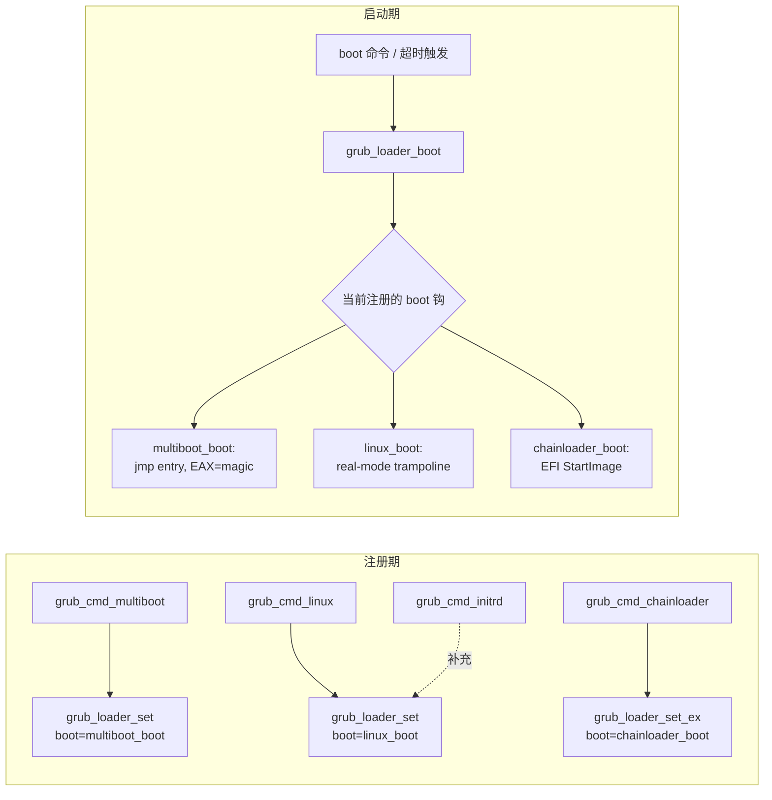
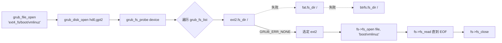
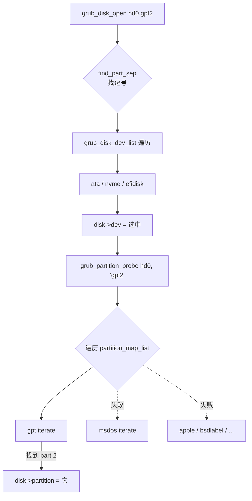
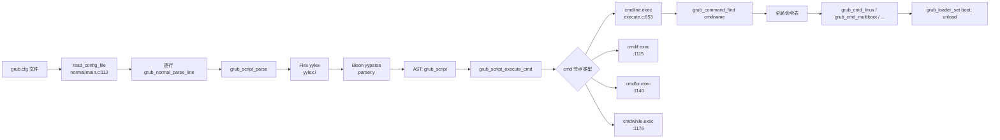

# 03-15 — GRUB 2 精读（领域+做啥+怎么用+子组件全枚举+工业实践）

> **核心：** GRUB 2 = "**桌面 Linux 默认 boot manager**"，30 年历史 (GRUB 1995 → GRUB 2 2005)。**任务定位**：在 BIOS / UEFI 之上，提供"启动菜单 + 多 OS 选择 + 加载 kernel/initrd/multiboot"。**与 U-Boot 不同：** GRUB 不做硬件初始化，只做"OS 选择 + 加载"；**与 systemd-boot 不同：** GRUB 功能极全（脚本 / 多协议 / 多 fs），但配置复杂。
>
> 本笔记按 9 阶段递归大纲覆盖**阶段 3-7**（项目身份 + QuickStart + 熟练 + 全 API + 子组件 + 工业实践）。

---

## 1. 阶段 3 — 项目身份

| 项 | 值 |
|----|---|
| **正式名** | GNU GRUB 2（GRand Unified Bootloader）|
| **起源** | 1995 GRUB Legacy (Erich Boleyn @ Yggdrasil) → 2005 GRUB 2 完全重写 (Yoshinori K. Okuji)|
| **协议** | GPL-3.0+ |
| **代码量** | ~30 万行 C |
| **本仓库路径** | `/home/heke/tgln/stage2/material/boot/grub2/` |
| **官方** | https://www.gnu.org/software/grub/ |
| **维护** | GNU + 主流 distros (Debian / Ubuntu / Fedora / Arch / SUSE)|
| **支持架构** | x86/x86_64 / arm / arm64 / i386-pc (BIOS) / i386-efi / x86_64-efi / mips / mipsel / ia64 / sparc64 / powerpc / RISC-V (实验) / LoongArch |

---

## 2. 阶段 3 续 — 领域定位 + "做啥"

GRUB 2 在启动链中的位置：

```
[BIOS/UEFI 固件] → GRUB → [Linux/Windows/BSD/...] kernel
       ↑              ↑
    硬件初始化       OS 选择 + 加载
```

**3 大职责：**

1. **多 OS 启动菜单**：双系统 / 三系统选择，超时默认引导
2. **加载 kernel + initrd + cmdline**：带 multiboot/multiboot2/Linux/EFI/chainload 协议
3. **预启动操作**：在 OS 启动前修改 cmdline、看分区、执行 shell（GRUB 内置 mini Lua/JS-like 脚本）

**与同生态位项目对比：**
- vs **systemd-boot (sd-boot)**：极简，只读 ESP，不支持 ext4 / 多协议；GRUB 全能但复杂
- vs **rEFInd**：图形美观，专双系统；GRUB 文本菜单
- vs **shim**：Microsoft 签名 EFI，**与 GRUB 配合**做 Secure Boot 链（shim → grubx64.efi → kernel）
- vs **U-Boot bootefi**：U-Boot 是嵌入式 bootloader，GRUB 是桌面/服务器 boot manager

---

## 3. 阶段 4 — QuickStart

### 3.1 安装到 UEFI 系统（典型 Ubuntu）

```bash
sudo grub-install --target=x86_64-efi --efi-directory=/boot/efi --bootloader-id=ubuntu
sudo update-grub                          # 重新生成 /boot/grub/grub.cfg
```

`update-grub` = `grub-mkconfig -o /boot/grub/grub.cfg`，扫描 /etc/grub.d/ 模板生成菜单。

### 3.2 安装到 BIOS（古老）

```bash
sudo grub-install --target=i386-pc /dev/sda
sudo update-grub
```

### 3.3 编辑菜单（典型场景）

```bash
# 改默认启动项
sudo vim /etc/default/grub
GRUB_DEFAULT=0                # 第 0 项
GRUB_TIMEOUT=3                # 3 秒超时
GRUB_CMDLINE_LINUX="quiet splash"

sudo update-grub              # 重生成
```

### 3.4 启动时临时改 cmdline

GRUB 菜单按 `e` → 编辑当前条目 → 改 `linux ...` 行加 `single` 进入单用户模式 → `Ctrl+X` 启动。

### 3.5 在 GRUB shell（按 `c`）

```
grub> ls
(hd0) (hd0,gpt1) (hd0,gpt2) (cd0)
grub> ls (hd0,gpt2)/
boot/  etc/  home/ ...
grub> linux (hd0,gpt2)/boot/vmlinuz-6.x root=/dev/sda2
grub> initrd (hd0,gpt2)/boot/initrd.img-6.x
grub> boot
```

---

## 4. 阶段 5 — 熟练用法

### 4.1 grub.cfg 关键语法

```bash
# 加载模块
insmod ext2
insmod gfxterm
insmod gettext

# 默认 / 超时
set default=0
set timeout=5

# 菜单项（典型 Linux）
menuentry "Ubuntu 22.04" {
    set root=(hd0,gpt2)
    linux /boot/vmlinuz-6.x root=UUID=abc... ro quiet splash
    initrd /boot/initrd.img-6.x
}

# Windows chainload
menuentry "Windows 11" {
    insmod chain
    chainloader (hd0,gpt1)/EFI/Microsoft/Boot/bootmgfw.efi
}

# Memtest
menuentry "Memtest86+" {
    linux16 /boot/memtest86+.bin
}
```

### 4.2 启动协议矩阵

| 协议 | GRUB 命令 | 用途 |
|------|---------|------|
| **Linux** | `linux` + `initrd` | Linux kernel 经典加载 |
| **Linux EFI Stub** | `linuxefi` (UEFI) | UEFI 模式 Linux |
| **multiboot 1** | `multiboot` + `module` | xv6 / 部分教学 OS / Plan 9 |
| **multiboot 2** | `multiboot2` + `module2` | 现代教学 OS / Limine 兼容 |
| **chainload** | `chainloader` | Windows / *BSD / 其他 bootloader |
| **EFI** | `bootefi` (UEFI) | 通用 EFI 应用 |
| **kFreeBSD** | `kfreebsd` + `kfreebsd_loadenv` | FreeBSD |
| **NetBSD** | `knetbsd` | NetBSD |
| **xnu (macOS)** | `xnu_kernel`/`xnu_kernel64` | 黑苹果（已过时）|

→ **GRUB 2 对协议覆盖度业界第一**。Limine 后来居上但只支持新协议。

### 4.3 调试 + 故障排查

```bash
# Boot 失败掉到 grub rescue> 怎么办：
grub rescue> ls                                   # 看哪些设备
grub rescue> set prefix=(hd0,gpt2)/boot/grub
grub rescue> set root=(hd0,gpt2)
grub rescue> insmod normal
grub rescue> normal                                # 进入正常 GRUB

# 修复菜单
sudo grub-install --recheck /dev/sda
sudo update-grub
```

### 4.4 工业脚本：Secure Boot 链

```
UEFI (Microsoft 签名 db)
  → shim.efi (Microsoft 签名)
  → grubx64.efi (distro 签名)
  → vmlinuz (distro 签名 + IMA appraisal)
  → initrd
```

shim 是 GRUB 与 Secure Boot 的桥梁：让 GRUB 不必经过微软签名（distro 自己签 GRUB，shim 验证 distro 公钥）。

---

## 5. 阶段 6 — 全子组件枚举（"项目里都有什么"）

### 5.1 顶层结构

| 目录 | 角色 |
|------|------|
| `grub-core/` | 核心代码 + 模块（最大）|
| `grub-core/kern/` | 内核（mm / dl / parser / disk / partition / device）|
| `grub-core/loader/` | 加载器（**multiboot / linux / xnu / efi / chainload / macho** 等）|
| `grub-core/fs/` | 文件系统驱动（**40+** 种，见下表）|
| `grub-core/disk/` | 磁盘驱动（ata / nvme / scsi / loopback / cryptodisk / lvm）|
| `grub-core/net/` | 网络栈（tcp / udp / dns / http / tftp / ipv6）|
| `grub-core/normal/` | 主菜单 / 命令解析 / autocomplete |
| `grub-core/script/` | GRUB 脚本（Bash-like 语法）|
| `grub-core/term/` | 终端（gfxterm / serial / morse / spkmodem）|
| `grub-core/video/` | 显示驱动（vbe / vga / efi_gop / radeon / etc）|
| `grub-core/commands/` | 内置命令（ls / cat / probe / loadenv / search / ...）|
| `grub-core/lib/` | 通用库（zlib / xz / json / crypto）|
| `util/` | 主机工具（grub-install / grub-mkconfig / grub-mkrescue / grub-editenv）|
| `docs/` | 文档（info 格式）|
| `tests/` | 测试 |
| `po/` | 国际化 |
| `themes/` | 启动菜单皮肤 |

### 5.2 文件系统驱动（40+ 种）

```
ext2/ext3/ext4 / btrfs / xfs / jfs / reiserfs / minix / minix2/3 / hfs / hfsplus /
fat / exfat / ntfs / iso9660 / udf / squashfs / cpio / tar / cpio_be /
zfs / nilfs2 / f2fs / archelp / affs / sfs / bfs / cbfs /
nfs / ntfscomp / odc / ufs1 / ufs2 / xfs / ...
```

→ **比 Linux mainline 还广**（GRUB 要从所有这些 fs 读 kernel）。

### 5.3 内置命令（100+ 个）

```
ls / cat / cmp / cp / mv / rm / search / probe / parttool / cryptomount /
help / set / unset / export / source / sleep / true / false / test /
linux / linux16 / initrd / initrd16 / module / module2 / boot / chainloader /
loadenv / save_env / load_env / ls_envblk / setdate / date / uptime /
cpuid / lspci / lsacpi / lsmmap / pmap / lscoreboot / dump / hashsum /
keystatus / play / read / wait / nativedisk / hdparm / file / file_filters /
videoinfo / videotest / gfxmode / gfxterm_background_image / theme /
serial / terminal_input / terminal_output / 等等
```

### 5.4 GRUB 脚本语言

GRUB 内置 mini-shell，类似 Bash 但语法略不同：

```bash
# 变量
set var=value
echo $var

# 条件
if [ "${grub_platform}" = "efi" ]; then
    insmod efinet
fi

# 循环
for entry in (hd0,gpt1) (hd0,gpt2); do
    echo $entry
done

# 函数
function load_video {
    insmod efi_gop
    insmod gfxterm
    terminal_output gfxterm
}
load_video
```

### 5.5 Multiboot 协议简介（教学 OS 必须知道）

**Multiboot 1 (1995)** 与 **Multiboot 2 (2005)**：GRUB 与 OS 的握手协议。

```
OS kernel 头部加 magic + flags →
GRUB 识别 → 加载 kernel + module 到指定地址 →
跳到 entry, EAX=0x36d76289, EBX=信息表指针
```

教学 OS（xv6 / OSDev wiki / Pintos / 各 RustOS）几乎都用 multiboot/multiboot2。

---

## 6. 阶段 7 — 工业实践（"谁在用 GRUB"）

| 用户 | 部署 |
|------|------|
| **Debian / Ubuntu / Fedora / RHEL / SUSE / CentOS / Arch / Manjaro** | 默认 boot manager |
| **桌面双系统党** | Win + Linux 多启动 |
| **服务器** | RHEL / SUSE Enterprise 服务器默认 |
| **教学** | OSDev / xv6 / Pintos / 多种学术 OS |
| **嵌入式 Linux** | 部分用 GRUB（多数用 U-Boot）|
| **国产 distro** | openKylin / Loongnix / openEuler 都用 |

**当前竞争压力：** Pop!_OS / Arch / SteamOS 转 systemd-boot；嵌入式继续 U-Boot；GRUB 在桌面 Linux 仍主导但份额下滑。

---

## 7. 阶段 8-9 简介（后续可深入的方向）

- **阶段 8 子功能**：每个 fs 驱动 / 每个 loader 协议 / GRUB 脚本完整语法
- **阶段 9 设计**：modular kernel-like 架构 / DEPEX / 模块加载器 / Lua 集成（grub-shell）

---

## 8. 进一步阅读

- **官方手册**：https://www.gnu.org/software/grub/manual/grub/grub.html
- **本地源码**：`/home/heke/tgln/stage2/material/boot/grub2/`
- **本仓库相关**：[03-05](03-05-boot-domain-comparison.md) 横向对比 / [00-19](00-19-image-and-bootflow-quickstart.md) U-Boot vs EDK2 vs GRUB

---

# 阶段 8 — 源码级 deep-dive（"读完能自己写一个 boot manager"）

> 目标：把 GRUB 的"OS 选择器 + 加载器"骨架理顺。GRUB 不是 hardware boot loader（不做 DDR 训练 / 时钟初始化），它运行在 BIOS / UEFI 之上，所以**抽象与最小实现都比 U-Boot SPL 简单**。读完本章应能为任何要写 boot manager 的项目动手实现一个 50-80% GRUB 功能的极简 boot manager。
>
> 全部行号基于 `/home/heke/tgln/stage2/material/boot/grub2/`。

## 9. 加载器抽象：`grub_loader_set` + boot/unload 双钩

GRUB 把"加载某个 OS"的所有协议（multiboot/linux/efi/chainload/...）统一成一对函数指针注册到全局 loader 槽。**这是整个项目最关键的抽象**——只要看清这个，所有 loader 都同构。

**核心 API**（`include/grub/loader.h:39-46`）：

```c
void grub_loader_set    (grub_err_t (*boot)(void),
                         grub_err_t (*unload)(void), int flags);
void grub_loader_set_ex (grub_err_t (*boot)(void *ctx),
                         grub_err_t (*unload)(void *ctx),
                         void *context, int flags);
```

`flags` 见 `loader.h:32-37`：`NORETURN` / `PXE_NOT_UNLOAD` / `EFI_KEEP_ALLOCATED_MEMORY`。

**典型使用模式**（伪代码）：

```c
static grub_err_t my_boot(void)   { /* 跳到 OS 入口，不返回 */ }
static grub_err_t my_unload(void) { /* 释放资源 */ }

static grub_err_t grub_cmd_my_loader(...) {
    grub_loader_unset();          // 卸载之前的 loader
    /* 1. 打开文件: grub_file_open() */
    /* 2. 校验 header */
    /* 3. 分配内存 + 加载段 */
    /* 4. 准备启动信息表 (mbi/initrd 描述/...) */
    grub_loader_set(my_boot, my_unload, 0);
    return GRUB_ERR_NONE;
}
```

**调用时机：** 用户在菜单项写 `multiboot /xv6.elf` 或 `linux /vmlinuz`，脚本引擎查表 → 调用 `grub_cmd_*` → 它注册 boot 钩。当用户最终执行 `boot` 命令（或菜单超时自动启动）时 → `grub_loader_boot()` 调注册的 `my_boot()` 跳到 OS。

**自造 boot manager 必备：** 你只要抽象出"loader 协议表 + 当前加载器槽"这一层，剩下所有协议都是实现 `cmd_xxx + xxx_boot + xxx_unload` 三件套，互不耦合。



## 10. Multiboot 1/2 协议 + Loader 实现

### 10.1 协议家族 + 命令注册

`grub-core/loader/multiboot.c` 是 **Multiboot 1 与 Multiboot 2 共用的脚手架**——通过 `GRUB_USE_MULTIBOOT2` 宏 + `GRUB_MULTIBOOT(x)` 宏展开为 `grub_multiboot_x` 或 `grub_multiboot2_x`（见 `multiboot.c:31-39`）。两套独立 .o 通过 build 系统编译两遍。

注册命令在 `multiboot.c:439-457`：

| MB1 模式 | MB2 模式 |
|---|---|
| `multiboot` → `grub_cmd_multiboot` | `multiboot2` → 同函数 |
| `module`    → `grub_cmd_module`    | `module2`    → 同函数 |

### 10.2 `grub_cmd_multiboot` 加载流程（`multiboot.c:285-359`）

```c
grub_loader_unset();                                            // 285
file = grub_file_open(argv[0], GRUB_FILE_TYPE_MULTIBOOT_KERNEL);// 324
GRUB_MULTIBOOT(init_mbi)(argc-1, argv+1);                       // 331  cmdline 等
GRUB_MULTIBOOT(relocator) = grub_relocator_new();               // 334  内存 relocator
err = GRUB_MULTIBOOT(load)(file, argv[0]);                      // 339  解析 header + 加载段
GRUB_MULTIBOOT(set_bootdev)();                                  // 343  填 boot device 号
grub_loader_set(grub_multiboot_boot, grub_multiboot_unload, 0); // 345  注册 boot 钩
```

### 10.3 ELF 段加载（`multiboot_elfxx.c`，被 multiboot.c:215-221 双重 include 出 32/64 两份）

- `multiboot_elfxx.c:55-61` 通过 `e_ident[EI_CLASS]` 区分 ELF32 / ELF64，避开手写两份代码
- `:77-82` 验证 ELF magic + LSB
- `:113-119` 扫所有 PT_LOAD 段算 `link_base_addr / highest_load`
- `:126-153` 若 relocatable，调 `grub_relocator_alloc_chunk_align_safe` 一次性分配；否则按段 `alloc_chunk_addr`
- `:160-213` 逐段 `grub_file_seek + grub_file_read` 写到 source（虚拟地址），bss 区 `grub_memset` 清零
- `:216-247` 找到包含 `e_entry` 的段计算 `payload_eip`（物理 entry）

### 10.4 模块加载（`multiboot.c:361-435`）

`grub_cmd_module` 流程与内核类似，但 `lowest_addr=0x100000`（MB1 quirk，避开 1 MiB 以下 BIOS 区域）；通过 `GRUB_MULTIBOOT(add_module)(target, size, argc-1, argv+1)` 把 (start, size, cmdline) 三元组挂到模块链表（见 `multiboot_mbi2.c:57-66` 的 `struct module`）。

### 10.5 mbi2 信息表构建（`multiboot_mbi2.c`）

GRUB 与 OS 之间的 ABI 是一张**变长 tag 表**：

```
[Total size | Reserved] [Tag {type,size,data}] [Tag] ... [End-tag type=0]
```

GRUB 解析的 OS-side header 在 `multiboot_mbi2.c:89-106` 的 `find_header`：扫描 kernel 前 32 KiB，匹配 `MULTIBOOT2_HEADER_MAGIC` + `architecture` + checksum 自洽。

`grub_multiboot2_load`（`:108`）解析 header 内嵌 tag（`:153-188`）：CMDLINE / FRAMEBUFFER / EFI_BS / RELOCATABLE / ENTRY_ADDRESS_EFI64 / LOAD_BASE_ADDR ...

`grub_multiboot2_make_mbi`（`:704`）反向构造 OS 看到的 mbi 表，把 modules / mmap / framebuffer / EFI system table / ACPI RSDP 全部塞 tag。

### 10.6 boot 跳转（`multiboot.c:174-198`）

```c
state.MULTIBOOT_ENTRY_REGISTER = payload_eip;         // 184
err = make_mbi(&state.MULTIBOOT_MBI_REGISTER);        // 186
grub_relocator32_boot(rel, state, 0);                 // 192  (BIOS 路径)
grub_relocator_efi_boot(rel, state_efi);              //      (UEFI 路径，efi_boot)
```

**ABI**（OS 入口期望状态，BIOS 模式）：
- `EAX = 0x2BADB002` (MB1) 或 `0x36D76289` (MB2)
- `EBX = mbi 物理地址`
- 32-bit 保护模式 / 段描述符已建立 / 中断关闭

EFI 模式额外保留 boot services。`include/grub/i386/multiboot.h:22-46` 定义这些寄存器初值。

**自造 boot manager 启示：**
1. 模块化协议——header 找不到就 fallback 下一个 loader
2. Relocator 抽象（虚拟地址 vs 物理目标地址）让加载阶段与跳转阶段解耦
3. 信息表用 type-length-value tag 串而不是固定结构体——可向后兼容地扩展

## 11. Linux Loader：BIOS / EFI Stub / 跨架构对比

GRUB 的 `linux` 命令在不同平台路径不同：

| 平台 | 实现文件 | 入口约定 |
|---|---|---|
| BIOS x86 | `grub-core/loader/i386/linux.c` (1191 行) | bzImage 真实模式 16-bit head + protected entry 32-bit |
| UEFI x86_64 / arm64 / loongarch / riscv | `grub-core/loader/efi/linux.c` (614 行) | EFI Stub 协议或 EFI LoadFile2 协议 |
| ARM (传统) | `grub-core/loader/arm/linux.c` | ATAG / FDT chosen |
| MIPS | `grub-core/loader/mips/linux.c` | a0=argc, a1=argv |

### 11.1 BIOS x86 路径（`i386/linux.c:675-1062`）

`grub_cmd_linux` 流程：

1. 读 bzImage `setup_header`（i386/linux.c:700-706），校验 `boot_flag = 0xAA55`（:708）、协议版本 ≥ 2.03（:723）、`FLAG_BIG_KERNEL`（:733）
2. 算 `real_size = setup_sects << 9`、`prot_file_size`（:757-758）
3. 解析 relocatable 字段、kernel_alignment（:760-768）
4. 分配 relocator chunk，把 setup（real-mode）+ protected mode 部分按地址放好
5. 用户 cmdline 经 `grub_create_loader_cmdline` 验签（:1024-1036）
6. **`grub_loader_set(grub_linux_boot, grub_linux_unload, 0)`**（:1045）

`grub_cmd_initrd`（:1065-1166）：算 `addr_max = min(initrd_addr_max, GRUB_LINUX_INITRD_MAX_ADDRESS=0x37FFFFFF, mem_size)`，把 initrd 放尽量高（:1126），写 `linux_params.hdr.ramdisk_image / ramdisk_size`（:1158-1159）传给 setup_header。

### 11.2 UEFI 路径（`efi/linux.c:477-596`）

UEFI 模式有两条子路径：
- **现代 EFI Stub + LoadFile2 initrd 协议**（arm64/riscv/x86 新内核走这条）：把 vmlinuz 直接当 PE 给 UEFI 起，initrd 通过 `LINUX_EFI_INITRD_MEDIA_GUID` 设备路径回调
- **x86 legacy fallback**（`efi/linux.c:520-533`）：调 `grub_cmd_linux_x86_legacy` —— 这是 `i386/linux.c:1186-1190` 的别名，进 BIOS-style setup_header 路径但保留 EFI memory map

EFI Stub 启动核心 `grub_arch_efi_linux_boot_image`（`efi/linux.c:194-267`）：

```c
mempath[0] = MEMORY_MAPPED_DEVICE_PATH(addr, addr+size);    // 207-212
status = grub_efi_load_image(0, image_handle, mempath,
                              addr, size, &image_handle);   // 221-223
loaded_image = grub_efi_get_loaded_image(image_handle);     // 236
loaded_image->load_options = utf8_to_utf16(args);           // 244-253  cmdline UTF-16
status = grub_efi_start_image(image_handle, 0, NULL);       // 256
```

ARM/RISC-V FDT 注入在 `efi/linux.c:148-191` 的 `finalize_params_linux`：
```c
fdt = grub_fdt_load(EXTRA_SPACE);
node = grub_fdt_find_subnode(fdt, 0, "chosen") or add_subnode();
grub_fdt_set_prop64(fdt, node, "linux,initrd-start", initrd_start);
grub_fdt_set_prop64(fdt, node, "linux,initrd-end",   initrd_end);
grub_fdt_install();   // EFI ConfigurationTable 注册新 FDT
```


### 11.3 BIOS 与 EFI 的 cmdline 传递差异

| 模式 | cmdline 容器 | OS 入口看到 |
|---|---|---|
| BIOS x86 | `linux_params.hdr.cmd_line_ptr` 物理指针 → 一段 ASCII 内存 | setup_header 字段 |
| EFI Stub | `loaded_image->load_options` UTF-16 字符串 | 标准 EFI ImageStart 参数 |
| EFI + FDT (arm64/riscv) | FDT `chosen/bootargs` 节点 | 内核解析 DT |

**自造 boot manager 启示：** 内核入口 ABI 是**最难抽象**的部分。每个平台 + 每代内核都不同，老老实实分平台写。但所有路径都汇成 `grub_loader_set(linux_boot, linux_unload, 0)` 同一个槽。

## 12. EFI Chainloader：让 GRUB 链调 Windows / shim / sd-boot

`grub-core/loader/efi/chainloader.c` (442 行) 是 GRUB 在 UEFI 下"启动另一个 EFI app"的实现，是**双系统启动 Windows 和 Secure Boot 链 shim 的关键**。

### 12.1 `grub_cmd_chainloader`（`efi/chainloader.c:211-428`）

```c
file = grub_file_open(filename, GRUB_FILE_TYPE_EFI_CHAINLOADED_IMAGE);
size = grub_file_size(file);
b->allocate_pages(GRUB_EFI_ALLOCATE_ANY_PAGES,
                  GRUB_EFI_LOADER_CODE, pages, &address);  // EFI BootServices
grub_file_read(file, boot_image, size);

dev_handle = grub_efi_get_device_handle(dev->disk);
file_path = make_file_path(dp, filename);                  // 建 EFI device path
status = grub_efi_load_image(0, image_handle, file_path,
                              boot_image, size, &image_handle);  // 344-345
loaded_image = grub_efi_get_loaded_image(image_handle);    // 360
loaded_image->device_handle = dev_handle;                  // 366  让 OS 知道从哪个盘启的
/* argv[1..] → loaded_image->load_options (UTF-16) */      // 369-396
grub_loader_set_ex(grub_chainloader_boot,
                   grub_chainloader_unload, image_handle, 0);  // 405
```

### 12.2 boot 钩（`:65-102`）

```c
status = grub_efi_start_image(image_handle, &exit_data_size, &exit_data);
/* StartImage 不返回（OS 已起）；返回了说明失败，回菜单 */
grub_loader_unset();
```

### 12.3 device path 解析（`copy_file_path :104-130` / `make_file_path :132-...`）

把 GRUB 文件名（`(hd0,gpt1)/EFI/Microsoft/Boot/bootmgfw.efi`）转 EFI device path 协议结构：
- `dir_start` = `)` 之后（跳过设备名）
- 把 `/` 改 `\\`（Windows 风格路径，:122）
- UTF-8 → UTF-16（:118）
- 拼接到原磁盘 dev_handle 的 device path 后面

**Secure Boot 链路的 chainloader 用法：**

```
shim.efi  ← MS db 签名
  │ chainloader (hd0,gpt1)/EFI/distro/grubx64.efi   (从 shim 跳 GRUB)
  ↓
GRUB
  │ chainloader (hd0,gpt1)/EFI/Microsoft/Boot/bootmgfw.efi  (跳 Windows)
  ↓
Windows
```

shim 提供 `EFI_SHIM_LOCK_PROTOCOL`，GRUB 调它验证下一级 EFI image，绕过 MS db 直接信任 distro 签名。详见 `efi/linux.c:486` `grub_is_using_legacy_shim_lock_protocol`。

## 13. 文件系统驱动：统一 vtable

GRUB 文件系统层是它移植性最好的部分。每个 fs 实现一个 `struct grub_fs`，注册到全局链表，`grub_fs_probe` 顺序尝试直到 mount 成功。

### 13.1 接口定义（`include/grub/fs.h:51-103`）

```c
struct grub_fs {
    struct grub_fs *next, **prev;            // 全局链表
    const char *name;                         // "ext2" / "fat" / "btrfs"
    grub_dl_t mod;
    grub_err_t (*fs_dir)  (grub_device_t, const char *path,
                           grub_fs_dir_hook_t hook, void *data);
    grub_err_t (*fs_open) (struct grub_file *file, const char *name);
    grub_ssize_t (*fs_read)  (struct grub_file *, char *buf, grub_size_t len);
    grub_err_t   (*fs_close) (struct grub_file *);
    grub_err_t (*fs_label)(grub_device_t, char **label);
    grub_err_t (*fs_uuid) (grub_device_t, char **uuid);
    grub_err_t (*fs_mtime)(grub_device_t, grub_int64_t *timebuf);
};
```

注册函数 `grub_fs_register`（`fs.h:118-122`）只是 `grub_list_push`。`FOR_FILESYSTEMS(var)` 宏（:131）遍历链表。

### 13.2 ext2 实现（`grub-core/fs/ext2.c`，1155 行）

- `grub_ext2_mount`（:735）读 superblock @ 1024 字节偏移，校验 magic `0xEF53`
- `grub_ext2_read_inode`（:634）按 group desc + inode table 算物理块
- `grub_ext2_read_block`（:481）走 direct/single/double/triple indirect
- `grub_ext2_open`（:905）→ `grub_fshelp_find_file` 走路径
- `grub_ext2_read`（:971）→ 调 `grub_ext2_read_file` 限长读
- `grub_ext2_dir`（:1017）回调 hook 给上层迭代目录项
- vtable 注册：`ext2.c:1128-1143` 的 `static struct grub_fs grub_ext2_fs`，`GRUB_MOD_INIT(ext2)`（:1145）`grub_fs_register(&grub_ext2_fs)`

### 13.3 FAT 实现（`grub-core/fs/fat.c`，1327 行；含 exFAT 共用）

- `grub_fat_mount`（:229）读 BPB、判 FAT12/16/32 / exFAT（同一文件 `MODE_EXFAT` 宏切换）
- `grub_fat_read_data`（:453）按 cluster 链表读，FAT 表查下一 cluster
- `grub_fat_dir / grub_fat_open`（:974 / :1050）—— 大小写不敏感
- vtable `fat.c:1283-1306`，`name` 字段根据 `MODE_EXFAT` 编译期选 `"exfat"` 或 `"fat"`

### 13.4 btrfs 实现（`grub-core/fs/btrfs.c`，2458 行，最长 fs）

复杂度反映现实——CoW + B-tree + chunk map + 多设备 RAID + 子卷：
- `grub_btrfs_mount`（:1256）读 superblock @ 0x10000
- `grub_btrfs_read_logical`（:861）核心：把"逻辑地址"经 chunk_tree 翻译成物理 (device, sector)，处理 RAID 0/1/10/5/6
- B-tree 遍历：`:244-393` 递归 `iter` 节点
- vtable `:2434-2447`

### 13.5 fs_probe 调度（`include/grub/fs.h:133`）

```c
grub_fs_t grub_fs_probe(grub_device_t device);
```

底层 `FOR_FILESYSTEMS` 顺序对每个 fs 调 `fs_dir(device, "/", noop_hook, NULL)`，第一个不返回 BAD_FS 的就是它。**没有 fs 头部 magic 表 / 不依赖固定签名位置**——只看每个 fs 自己 mount 是否成功。



**自造 boot manager 启示：**
- vtable 接口控制在 7 个回调以内，每个 fs 一两千行可独立移植
- 用 fshelp（`grub-core/fs/fshelp.c`）抽离公共逻辑（路径分割、symlink 跟随、文件类型判断）
- 不依赖外部头部位置——让每个 fs 自己 probe，避免错误识别（XFS / btrfs 都用过 0x10000 偏移）

## 14. Disk + Partition 抽象

文件系统之下，GRUB 把"任意可寻址块设备"抽象成 `grub_disk`，"任意分区表格式"抽象成 `grub_partition_map`。

### 14.1 disk 设备链（`grub-core/kern/disk.c`，568 行）

```c
grub_disk_dev_register(dev);   // disk.c:153-158  插链表头
grub_disk_t grub_disk_open(const char *name);  // :191-293
grub_err_t  grub_disk_read(disk, sector, offset, size, buf);  // :421
```

`grub_disk_open(name)` 流程：
1. 用 `find_part_sep`（:175-189）找逗号分隔（`hd0,gpt2`）拆设备名 / 分区描述
2. 遍历 `grub_disk_dev_list`（:228-236），第一个 `disk_open(raw, disk)` 返 OK 的 dev 中标
3. 若有分区描述，调 `grub_partition_probe`（:257）

dev 类型例：
- `grub-core/disk/ata.c` / `ahci.c` / `nvme.c` / `scsi.c`：真实硬件（BIOS 模式）
- `grub-core/disk/efi/efidisk.c`：UEFI BlockIo 协议封装
- `grub-core/disk/loopback.c` / `host.c`：测试用
- `grub-core/disk/cryptodisk.c` / `lvm.c` / `diskfilter.c`：层叠式（在已有 disk 上做 LUKS / LVM / RAID）

### 14.2 GPT 解析（`grub-core/partmap/gpt.c`，241 行）

`grub_gpt_partition_map_iterate`（:53-132）：

```c
grub_disk_read(disk, 0, 0, sizeof(mbr), &mbr);                 // 67  protective MBR
if (mbr.signature != 0xAA55) return BAD_PART_TABLE;            // 71-72
for i in 0..3:                                                  // 75-77
  if mbr.entries[i].type == 0xEE: break;  // GPT_DISK marker
grub_disk_read(disk, 1<<sector_log, 0, sizeof(gpt), &gpt);     // 84
if memcmp(gpt.magic, "EFI PART") != 0: return BAD_PART_TABLE;  // 87
entries = gpt.partitions << sector_log;
for i in 0..gpt.maxpart:                                        // 96
  read entry @ entries+last_offset
  if entry.type != empty:
    part = { start, len, partmap=&grub_gpt_partition_map };
    hook(disk, &part);                                          // 119
```

注册 `:223-228` 的 `grub_gpt_partition_map`，`GRUB_MOD_INIT(part_gpt)`（:230）`grub_partition_map_register`。

### 14.3 MS-DOS / MBR 解析（`grub-core/partmap/msdos.c`，438 行）

`grub_partition_msdos_iterate`（:108-229）多个看点：
- `:120-126` 不允许 MBR 分区上做嵌入
- `:147-150` 检 MBR 是不是 protective MBR 的 dummy（前 4 项 type=0xEE 就让 GPT 接管）
- `:152-162` 循环检测算法：保存"上次为 2 的幂次的偏移"，三轮内必中环
- `:168-170` 校验 boot flag bit
- `:173-203` 4 个主分区表项遍历，区分 normal / extended（链式逻辑分区在 `:205-220`）

### 14.4 其他 partmap

`partmap/`：apple（HFS+ Apple Partition Map）/ amiga / acorn / bsdlabel / dvh (SGI) / sun / sunpc / dfly (DragonflyBSD)。每个一个 `_iterate` + `_register`，全部通过 vtable `struct grub_partition_map`。



**自造 boot manager 启示：**
- disk vtable / partition vtable 两层独立——加新协议（NVMe）只动 disk 层，加新分区表（如自家分区方案）只动 partmap 层
- 加载顺序：分区表 magic 越精确越靠前注册（GPT 比 MBR 早），避免 GPT 盘被当 MBR 误读

## 15. 脚本编译器 + 执行流（grub.cfg 怎么跑起来）

GRUB 自带一个 mini-shell 解析器，技术栈是 **Flex (词法) + Bison (语法) + 树解释器**。

### 15.1 文件结构

| 文件 | 角色 |
|---|---|
| `grub-core/script/yylex.l` | Flex 词法规则（生成 `grub_script.yy.c`）|
| `grub-core/script/parser.y` | Bison 语法规则（356 行，生成 `grub_script.tab.c/h`）|
| `grub-core/script/lexer.c` | Flex 状态封装、`grub_script_yylex` 包装 |
| `grub-core/script/script.c` | AST 节点构造（`grub_script_create_cmdline` 等）|
| `grub-core/script/execute.c` | AST 解释器（1217 行）|
| `grub-core/script/function.c` | function 命令存储 |
| `grub-core/script/argv.c` | 参数 argv 处理（变量展开、wildcard）|

### 15.2 Token 表（`parser.y:49-83`）

```
GRUB_PARSER_TOKEN_AND  "&&"      TOKEN_OR   "||"
TOKEN_PIPE  "|"   TOKEN_AMP  "&"   TOKEN_SEMI ";"   TOKEN_SEMI2 ";;"
TOKEN_LBR  "{"   TOKEN_RBR "}"   TOKEN_NOT "!"
TOKEN_LSQBR2 "["   TOKEN_RSQBR2 "]"
TOKEN_LT  "<"   TOKEN_GT  ">"
关键字：case do done elif else esac fi for if in select then until while function
TOKEN_NAME (变量名/函数名)   TOKEN_WORD (普通词)
```

### 15.3 语法主干（`parser.y:100-356`）

```
script: newlines0
      | newlines0 commands1 delimiters
script_init: { state->err=0; } script { state->parsed=$2; }
command: grubcmd | ifcmd | forcmd | whilecmd | untilcmd
grubcmd: word arguments0 block0    { grub_script_create_cmdline(state, ...) }
ifcmd:   "if" ifclause "fi"
forcmd:  "for" "name" "in" arguments0 ";" "do" commands1 ";" "done"
whilecmd:"while" commands1 ";" "do" commands1 ";" "done"
function: "function" "name" newlines0 "{" commands1 "}"
```

→ 这就是个**简化版 Bash**：if/for/while/function、argument、`!` 反转、命令块。**不支持** pipe `|` / 重定向 `<>` 实际行为（保留 token 但 `cmdline` 不组装 pipeline）/ 复杂参数展开 `${var:-default}` / 子 shell `()`。

### 15.4 解析触发链

```
read_config_file (normal/main.c:113)
 └─ 逐行 grub_normal_parse_line(line, getline_callback, file)
     └─ grub_script_parse(line, getline_callback, data)
         ├─ grub_script_lexer_init(parser, line, getline, data)   // lexer.c:234
         ├─ yyparse(parser)                                        // Bison 入口
         └─ 返回 struct grub_script*  (AST 根)
```

### 15.5 解释器（`execute.c`）

入口 `grub_script_execute_cmd`（:823-843）走 `cmd->exec(cmd)` 多态。每种 `grub_script_cmd_*` 节点有自己的 exec：

| AST 节点 | exec 函数 |
|---|---|
| cmdline (单条命令) | `grub_script_execute_cmdline` (:953-) |
| cmdif (if/elif/else) | `grub_script_execute_cmdif` (:1115-) |
| cmdfor | `grub_script_execute_cmdfor` (:1140-) |
| cmdwhile / until | `grub_script_execute_cmdwhile` (:1176-) |
| menuentry | `grub_script_execute_menuentry`（normal/menu_entry.c）|

**`grub_script_execute_cmdline`（:953-1044+）核心**：

```c
grub_script_arglist_to_argv(cmdline->arglist, &argv);   // 968  变量展开 + glob
cmdname = argv.args[0];
grubcmd = grub_command_find(cmdname);                   // 1009  全局命令表查表
if (!grubcmd) {
    func = grub_script_function_find(cmdname);          // 1015  user-defined function
    if (!func) {
        /* 试当 var=value 处理 */
        char *eq = strchr(assign, '=');                 // 1023
        if (eq) grub_script_env_set(assign, eq);        // 1033
    }
}
ret = grubcmd->func(grubcmd, argc, args);
```

`grub_command_find`（在 `kern/command.c`）维护一个全局的 `{name, func, prio}` 表，所有 `grub_register_command` 注册的命令都进这表。**这就是脚本里 `linux ...` / `multiboot ...` 调到 `grub_cmd_linux` / `grub_cmd_multiboot` 的桥梁**。



### 15.6 menuentry 收集

`menuentry` 在 GRUB 里是一个内置命令（不是关键字），由 `grub-core/normal/menu.c` 提供。`grub_cmd_menuentry` 把 `{name, body 字符串, options}` 加到 `grub_env_get_menu()` 链表，留待 `grub_show_menu` 显示。当用户回车选中，就在新 scope 里 `grub_script_execute_sourcecode(body)`，执行块内的 `linux / initrd / boot` 等。

**自造 boot manager 启示：**
- 脚本不需要全 Bash 兼容，**支持 set/if/for/function + 命令查表**已经能跑 95% 的 grub.cfg
- 命令注册表 + AST 解释器是最直接的设计；不要先写 JIT
- menuentry 当成"延迟 eval 的字符串块"，避免它在解析期被立刻 dispatch

## 16. 菜单生成器：grub-mkconfig + /etc/grub.d/

`grub.cfg` 不该手写，应由 `update-grub`（=`grub-mkconfig`）扫主机生成。

### 16.1 grub-mkconfig 流程（`util/grub-mkconfig.in`，317 行）

```sh
prefix / sbindir / sysconfdir = ...      # 配置时填入
grub_mkconfig_dir="${sysconfdir}"/grub.d   # /etc/grub.d/
grub_probe = sbindir/grub-probe          # 探测 fs / 分区 / UUID
grub_script_check = bindir/grub-script-check   # 语法检查

# 1. 从 /etc/default/grub 读用户偏好
. ${sysconfdir}/default/grub  ||  true

# 2. export GRUB_DEFAULT / GRUB_TIMEOUT / GRUB_CMDLINE_LINUX 等 ~30 个变量

# 3. 顺序执行 /etc/grub.d/* 模板，每个输出一段菜单
for i in "${grub_mkconfig_dir}"/* ; do          # 280
    if grub_file_is_not_garbage "$i" && test -x "$i" ; then
        echo "### BEGIN $i ###"
        "$i"                                     # 执行模板，stdout → grub.cfg
        echo "### END $i ###"
    fi
done

# 4. grub-script-check 校验语法 → 原子替换 grub.cfg
```

### 16.2 模板列表（`util/grub.d/`）

| 文件 | 输出 |
|---|---|
| `00_header.in` | 全局 `set default / timeout / theme / gfxmode`，加 `insmod gzio / part_gpt / ext2` |
| `10_linux.in` | 扫 `/boot/vmlinuz-*` 生成 Linux menuentry |
| `10_kfreebsd.in` / `10_netbsd.in` / `10_hurd.in` / `10_illumos.in` | 各 BSD / Hurd 菜单 |
| `10_windows.in` | 检 Windows 启动管理器 |
| `10_xnu.in` | 黑苹果（已停用）|
| `20_linux_xen.in` | Xen dom0 启动 |
| `25_bli.in` | Boot Loader Interface |
| `30_os-prober.in` | 调 `os-prober` 工具发现其他 OS（双系统 Win 检测的核心）|
| `30_uefi-firmware.in` | "Reboot to firmware setup" 菜单项 |
| `40_custom.in` / `41_custom.in` | 用户自定义条目，不会被覆盖 |

每个模板是 shell 脚本（输出到 stdout），引用 `grub_probe` / `grub_script_check` 等工具填入 UUID / fs 类型 / kernel 文件名。

**自造 boot manager 启示：** 配置生成与解析**严格分离**——`grub-mkconfig` 只产 `grub.cfg`，OS 启动期不需要 distros 的脚本框架。生产环境 grub.cfg 是机器生成的，可读性差，但解析期最简单。

## 17. 自造 boot manager checklist（基于上述源码）

按从底到顶的顺序实现，每层独立可测：

### 必备（MVP 60-70% GRUB 功能，~5000 行）

1. **disk 抽象**（参考 `kern/disk.c` + 一个 efidisk 后端，~500 行）
   - vtable: `disk_open / disk_close / disk_read / disk_get_size`
   - 注册链表 + `find_part_sep` 解析 `disk_name,part_id`

2. **partmap 抽象 + GPT/MBR**（参考 `partmap/gpt.c` + `partmap/msdos.c`，~600 行）
   - vtable: `partition_map_iterate(disk, hook, data)`
   - GPT 必备（现代 UEFI 默认），MBR 留 fallback

3. **fs 抽象 + 至少 3 种 fs**（参考 `include/grub/fs.h` + `fs/fat.c` + `fs/ext2.c` + `fs/iso9660.c`，~3000 行总计）
   - vtable: 7 回调
   - 优先 FAT（ESP 必读）+ ext4（Linux rootfs）

4. **loader 抽象 + 2 个 loader**（参考 `loader/efi/linux.c` + `loader/efi/chainloader.c`，~800 行）
   - 全局 boot/unload 槽 + `grub_loader_set`
   - EFI Stub linux loader（最简）+ EFI chainloader（启 Windows）
   - 是否实现 multiboot 协议由项目目标决定（自家协议可省 multiboot）

5. **mini 脚本解析器**（参考 `script/parser.y` + `execute.c`，~1500 行）
   - **可选简化方案**：用 lemon (smaller than yacc) 或者手写递归下降；只支持 `set / if / for / function / menuentry / 命令调用`
   - 不支持 `case`、pipe、heredoc、子 shell —— 90% grub.cfg 可省

6. **menu UI**（参考 `normal/menu.c` + `menu_text.c`，~600 行）
   - 文本 UI 即可：箭头选择、回车启动、e 编辑、c 进 shell
   - 超时倒计时 + 默认项

### 增强（接近 GRUB 90% 功能，再加 5000 行）

7. **常用命令**：`ls / cat / search / set / probe / linux / initrd / chainloader / boot / source / insmod`（参考 `grub-core/commands/`）
8. **更多 fs**：btrfs / xfs / iso9660 / squashfs（教学场景常用）
9. **网络栈** + `tftp` / `http` 加载（参考 `grub-core/net/`）
10. **gfx terminal**（参考 `term/gfxterm.c`）+ 主题
11. **Secure Boot** shim 集成（验签后再交给 chainloader）
12. **LUKS / LVM**（参考 `disk/cryptodisk.c` / `disk/lvm.c`）

### "如果造一个等价物" 通用阶段建议（不预设具体项目）

任何要写 boot manager 的项目可参考以下从简到复的路径：

- 第一版：最小 EFI loader（参考 rboot [03-16](03-16-rboot-walkthrough.md) 思路），**单条菜单**，从 ESP 读固定路径内核
- 第二版：加 GRUB 风格 loader vtable + 两 fs（FAT/ext4）+ 简单菜单
- 第三版：脚本支持 + chainloader（双系统）
- 第四版：网络启动 + Secure Boot 集成


## 18. 跨引用

- 上层启动链分布与对手矩阵：[03-05](03-05-boot-domain-comparison.md)
- 同生态位的 UEFI 极简实现：[03-16](03-16-rboot-walkthrough.md)（rboot，527 行 Rust）
- UEFI 协议体系全图：[03-12](03-12-edk2-walkthrough.md)（GRUB 在 UEFI 上的 chainloader 调的就是 EDK2 的 BootServices）
- UEFI 标准演化 + EDK2 ↔ rboot 极致对比：[03-13](03-13-uefi-evolution-case-study.md)
- ESP 详解：[03-13 § 3.4.5](03-13-uefi-evolution-case-study.md#345--esp-efi-system-partition-详解)
- Linux 内核 EFI Stub + FDT chosen 注入：[03-03](03-03-fdt-dts-boot-flow.md) / [02-05](02-05-fdt-runtime-detection.md)
- 编译器/解析器演化（GRUB 用 Flex+Bison）：[00-08](00-08-lang-evolution.md)
- 镜像/分区/FS 综合：[00-19](00-19-image-and-bootflow-quickstart.md)
