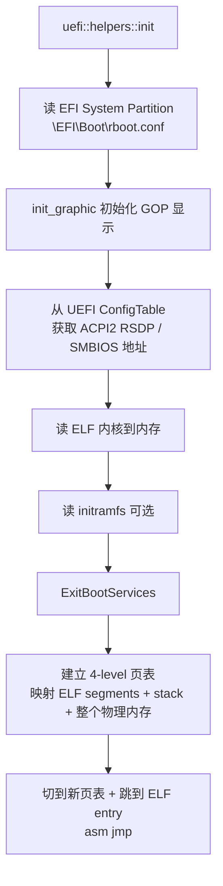

# 03-16 — rboot 精读（侧重：小而精，全源码导览 + Rust UEFI 范式）

> **侧重定位：** rboot 极小（**总共 527 行 Rust + 22 文件**），是 EDK2 那 200 万行的极致对照。本笔记**全源码导览**——5 个文件全部翻一遍。读完你能：① 看懂任何 Rust UEFI 应用 ② 知道一个最小 OS bootloader 真实代码量 ③ 启发 KuUEFI 设计。
>
> **一句话答案：** rboot = "**rcore-os 的 x86_64 UEFI loader**"，527 行 Rust 完成"读 ELF → 建页表 → 退出 boot services → jump kernel"全流程。它不是 UEFI 实现，是 UEFI **应用**——跑在 EDK2 / OVMF 之上。

按 9 阶段递归大纲：本笔记覆盖 **阶段 3-5 + 阶段 9（设计实现）**，因为代码小可全部读完。

---

## 0. ⭐ 学 rboot 必须先理解 EDK2 提供了什么

rboot 只有 527 行 Rust，但**它不是从 0 开始**——rboot 是 **UEFI 应用**，跑在 EDK2 / OVMF / 各种 UEFI 实现之上，**"免费"用了 UEFI 提供的几十种能力**：

### 0.1 rboot 没写但用了的能力（EDK2 / UEFI 提供）

| rboot 调用 | 实际是 UEFI 提供的什么 | 没有 UEFI 你得自己写多少代码 |
|-----------|----------------------|---------------------------|
| 读 `\EFI\Boot\rboot.conf` | `EFI_SIMPLE_FILE_SYSTEM_PROTOCOL` + FAT32 driver | FAT32 解析器 ~5000 行 |
| 读 ELF 内核到内存 | 同上（fs protocol） | 同上 |
| 内存分配 | `BootServices->AllocatePages` | 物理内存管理器 ~2000 行 |
| 控制台输出（`println!`） | `EFI_SIMPLE_TEXT_OUTPUT_PROTOCOL` | UART driver + 终端 escape 序列 ~1500 行 |
| 显示初始化（GOP） | `EFI_GRAPHICS_OUTPUT_PROTOCOL` | GPU framebuffer driver ~3000 行 |
| 拿 ACPI / SMBIOS 表 | `EFI_SYSTEM_TABLE->ConfigurationTable` 数组遍历 | ACPI 表查找 ~500 行 |
| ExitBootServices 切换地址空间 | `BootServices->ExitBootServices` + memory map 拿取 | 完整 boot 状态切换协议 ~3000 行 |
| PE/COFF 自身加载 | UEFI 固件的 image loader | PE/COFF parser + relocator ~2000 行 |

**合计**：rboot 527 行的背后**省去了 17000+ 行如果从 0 开始写所需的代码**。这就是 UEFI 应用模式的"免费午餐"。

### 0.2 必读前置：什么是 UEFI 应用

UEFI 应用 = **PE/COFF 格式可执行文件**，跑在 UEFI 固件提供的 runtime 之上。详见 [03-12 EDK2 § 0.5](03-12-edk2-walkthrough.md#05-uefi-应用是什么)：

- 入口函数：`efi_main(image_handle: Handle, system_table: SystemTable<Boot>) -> Status`
- 编译目标：`x86_64-unknown-uefi` / `aarch64-unknown-uefi` / `riscv64gc-unknown-uefi`
- 调用接口：UEFI Boot Services + Protocol（不是 syscall + libc）
- 退出：`BootServices->Exit` 或 `ExitBootServices` 后 jump 到 OS

**rboot = OS Loader 类 UEFI 应用**：从 ESP 读 ELF 内核 → 建页表 → 跳转。

### 0.3 必读前置：UEFI 提供了哪些能力（5 大类）

**详见 [03-12 EDK2 § 0.6](03-12-edk2-walkthrough.md#06-uefi-提供了哪些能力完整能力清单)**。简版：

1. **Boot Services**（30+ API）—— 内存 / 事件 / Image / Protocol 管理 / 退出 BS
2. **Runtime Services**（14 API）—— Variable / Time / Reset / Capsule
3. **Protocol**（100+）—— 块设备 / 文件系统 / 网络 / 图形 / 输入 / TPM 等
4. **Variable Services** —— Boot####/SecureBoot key/Lang 等 NVRAM 存储
5. **Configuration Tables** —— ACPI / SMBIOS / DT 暴露给 OS

**rboot 主要用到 Protocol（Block IO / File / GOP / 输出）+ Boot Services（AllocatePages / ExitBootServices）+ Configuration Tables（拿 ACPI/SMBIOS 给内核）**。剩下 90% 的 UEFI 能力 rboot 都没碰。

### 0.4 学习顺序建议

1. **先读 [03-12 EDK2 § 0-2](03-12-edk2-walkthrough.md)**（UEFI 概念 + 5 个名字关系 + 能力清单 + 5 阶段）
2. **再读 [03-13 UEFI 演化](03-13-uefi-evolution-case-study.md)**（标准 vs 实现对比）
3. **再读本笔记**（rboot 全源码）—— 此时才能看懂"哪些行调 UEFI、哪些行是 rboot 自己的逻辑"
4. （可选）读 [03-18 LinuxBoot](03-18-linuxboot-walkthrough.md)（理解为什么有人想完全去掉 UEFI）

---

## 1. 阶段 3 — 项目身份

| 项 | 值 |
|----|---|
| **正式名** | rBoot（GitHub 仓库名 `rboot`）|
| **作者** | Runji Wang (王润基, rcore-os 主导者)|
| **协议** | (LICENSE 见仓库) |
| **代码量** | **527 行 Rust 源 + 4 文件**（src/ 下：main.rs / lib.rs / config.rs / page_table.rs）|
| **依赖** | uefi 0.36 / xmas-elf / x86_64 |
| **本仓库路径** | `/home/heke/tgln/stage2/material/boot/rboot/` |
| **目标** | x86_64 UEFI 加载 rCore / zCore 内核 |
| **Cargo target** | `x86_64-unknown-uefi`（编译为 PE32+ EFI 应用）|

---

## 2. 阶段 9（设计实现）— 全源码导览

> 不像 EDK2 要分 9 阶段慢慢爬。rboot 直接全读完。

### 2.1 文件结构（4 个 .rs 共 527 行）

| 文件 | 行 | 职责 |
|------|----|------|
| `src/lib.rs` | 40 | 公开数据结构 `BootInfo` / `GraphicInfo`（kernel 接收的握手）|
| `src/config.rs` | 75 | 解析 `rboot.conf` 文本配置 |
| `src/page_table.rs` | 175 | x86_64 页表建立（4-level / 5-level）|
| `src/main.rs` | 237 | UEFI 入口 + 主流程 |

### 2.2 主流程（main.rs::efi_main）



### 2.3 关键代码片段（main.rs）

```rust
const CONFIG_PATH: &str = "\\EFI\\Boot\\rboot.conf";

#[entry]
fn efi_main() -> Status {
    uefi::helpers::init().expect("failed to init uefi helpers");
    info!("bootloader is running");

    // 1. 读配置
    let config = {
        let mut file = open_file(CONFIG_PATH);
        let buf = load_file(&mut file);
        config::Config::parse(buf)
    };

    // 2. 初始化图形
    let graphic_info = init_graphic(config.resolution);

    // 3. 从 UEFI ConfigTable 拿 ACPI / SMBIOS 地址（传给 kernel）
    let acpi2_addr = system::with_config_table(|entries| {
        entries.iter().find(|e| e.guid == ConfigTableEntry::ACPI2_GUID)
            .expect("ACPI 2 RSDP missing").address
    });

    // 4. 读 ELF
    let elf = {
        let mut file = open_file(config.kernel_path);
        let buf = load_file(&mut file);
        ElfFile::new(buf).expect("failed to parse ELF")
    };
    unsafe { ENTRY = elf.header.pt2.entry_point() as usize; }

    // ...省略 initramfs / memory map 等
    // 5. ExitBootServices + 跳转
}
```

### 2.4 BootInfo 结构（lib.rs，传递给 kernel）

```rust
#[repr(C)]
pub struct BootInfo {
    /// Kernel command line
    pub cmdline: &'static str,
    /// The memory map
    pub memory_map: Vec<MemoryDescriptor>,
    /// The physical memory offset (kernel virtual = phys + offset)
    pub physical_memory_offset: u64,
    /// The graphic output information
    pub graphic_info: GraphicInfo,
    /// The system table virtual address
    pub system_table: VirtAddr,
    /// Initramfs address and size
    pub initramfs: Option<(VirtAddr, u64)>,
    /// ACPI2 RSDP address
    pub acpi2_rsdp_addr: u64,
    /// SMBIOS address
    pub smbios_addr: u64,
}
```

→ Kernel `_start(boot_info: &BootInfo)` 签名直接接收。**这就是 ABI 契约**。

### 2.5 配置文件（rboot.conf 例）

```
kernel_path=\EFI\kernel\rcore.elf
kernel_stack_address=0xFFFFFF8000000000
kernel_stack_size=512
physical_memory_offset=0xFFFF800000000000
resolution=1024x768
initramfs=\EFI\kernel\initrd.img
cmdline=root=/dev/sda1 console=ttyS0
```

config.rs 解析 75 行（split = 解析 = 字段映射）。

### 2.6 页表（page_table.rs，175 行）

x86_64 标准 4-level 分页：
- PML4 (Page Map Level 4) → 256 TiB
- PDPT (Page Directory Pointer Table)
- PD (Page Directory)
- PT (Page Table)

rboot 做：
1. 创建新 PML4
2. 把 kernel ELF 的每个 segment 映射到指定虚拟地址
3. 把 kernel stack 映射
4. 把整个物理 RAM 线性映射到 `physical_memory_offset` 起始的虚拟段（这是 kernel 访问任意物理地址的 trick）
5. CR3 切到新 PML4

→ 这是**所有内核 boot loader 的核心数学**。看懂这 175 行 = 看懂任何 OS 启动。

---

## 3. 阶段 4 — QuickStart

```bash
cd /home/heke/tgln/stage2/material/boot/rboot

# 1. 编译（出 EFI 应用）
cargo build --release --target x86_64-unknown-uefi
ls target/x86_64-unknown-uefi/release/rboot.efi

# 2. 跑示例 kernel（仓库自带 example-kernel/）
cd example-kernel
./test.sh
# 内部：编译 example kernel ELF + 创建 FAT32 ESP 镜像 + 拷 rboot.efi 和 kernel
#       qemu-system-x86_64 -bios /usr/share/edk2-ovmf/OVMF.fd -drive ESP

# 看到 rboot 启动日志 → kernel 接管 → 串口打印 "Hello from kernel!"
```

---

## 4. 阶段 5 — 熟练（用 rboot 启动你自己的 kernel）

### 4.1 改 rboot.conf 启动新内核

```
kernel_path=\EFI\kernel\my_os.elf
cmdline=debug
```

### 4.2 把 rboot 当 kernel 的 boot 跳板

> **ESP 详解** —— rboot 所有路径（`\EFI\Boot\rboot.conf` / `\EFI\kernel.elf` 等）都是 ESP（EFI System Partition，FAT32）内的路径。完整 ESP 工作机制 + UEFI 固件如何选启动文件（NVRAM Boot#### vs `\EFI\BOOT\BOOTX64.EFI` fallback）+ 各 OS 看 ESP 的方式 + 操作工具 见 [`03-13 § 3.4.5 ESP 详解`](03-13-uefi-evolution-case-study.md#345--esp-efi-system-partition-详解)。

```bash
# 步骤
1. 编译你的 kernel 为 ELF（target = x86_64-none，custom）
2. 把 rboot.efi 改名 BOOTX64.EFI 放 \EFI\Boot\
3. rboot.conf 指向 kernel ELF 路径
4. UEFI 启动 → rboot 自动加载

# 例子
mkdir -p esp/EFI/Boot esp/EFI/kernel
cp rboot.efi esp/EFI/Boot/BOOTX64.EFI
cp my_kernel.elf esp/EFI/kernel/
cat > esp/EFI/Boot/rboot.conf << 'EOF'
kernel_path=\EFI\kernel\my_kernel.elf
kernel_stack_size=512
physical_memory_offset=0xFFFF800000000000
EOF

# 用 OVMF + esp 跑
qemu-system-x86_64 -bios OVMF.fd -drive format=raw,file=fat:rw:esp
```

### 4.3 调试技巧

| 任务 | 方法 |
|------|------|
| 看 rboot 日志 | `info!` 自动到 UEFI Console（即 stdout） |
| 中断 jump 前看 | 改源码加 `loop {}` 在 jump 前 |
| GDB 调 kernel | qemu `-s -S` + `gdb -ex "target remote :1234"` |
| 看页表 | rboot 的 `info!("CR3: {:#x}", ...)` |

---

## 5. rboot vs EDK2：极简 vs 巨型

| 对比维度 | rboot | EDK2 |
|---------|-------|------|
| 代码量 | 527 行 Rust | 200 万行 C + 元数据 |
| 角色 | UEFI **应用**（boot loader）| UEFI **实现**（固件）|
| 编译时间 | 30 秒 | 30 分钟 |
| 内存需求 | 几百 KB | 几 MB |
| 学习曲线 | 一晚上 | 数月 |
| 灵活性 | 改源码即变 | 改 DSC/FDF/INF + 重新编译 |
| 跨架构 | x86_64（aarch64 实验）| 全 |
| 工业用 | 教学 / 研究 | OEM / 服务器主流 |

**互补关系：** EDK2 提供 UEFI 服务（ExitBootServices / 文件 IO / 显存）→ rboot 是其上的**应用程序**。两者一起跑（OVMF + rboot.efi）才完整。

---

## 6. 启发 KuUEFI 设计


1. **Rust UEFI 应用范式**：`uefi-rs` crate 已经成熟，不需要重新发明
2. **小即美**：527 行做完 boot loader 该做的事，证明大部分 UEFI 复杂度在固件层不在 loader 层
3. **明确 ABI**：`BootInfo` 结构定义清楚 kernel 接口，KuUEFI 可借鉴
4. **支持其他 ISA**：rboot 主要 x86_64，KuUEFI 直接支持 RISC-V / aarch64（uefi-rs 已支持）
5. **配置驱动**：纯文本 conf 解析比 GRUB 复杂语法简单


---

## 7. 进一步阅读

- **uefi-rs 文档**：https://docs.rs/uefi/latest/uefi/
- **UEFI Spec**（参考）：https://uefi.org/specifications
- **本地源码**：`/home/heke/tgln/stage2/material/boot/rboot/src/` 全部 4 文件可一晚读完
- **本仓库相关**：[03-12-edk2-walkthrough](03-12-edk2-walkthrough.md) 巨型对照 / [03-05 § 1](03-05-boot-domain-comparison.md) 横向对比 / [00-19 § 7](00-19-image-and-bootflow-quickstart.md) U-Boot vs EDK2 路径
