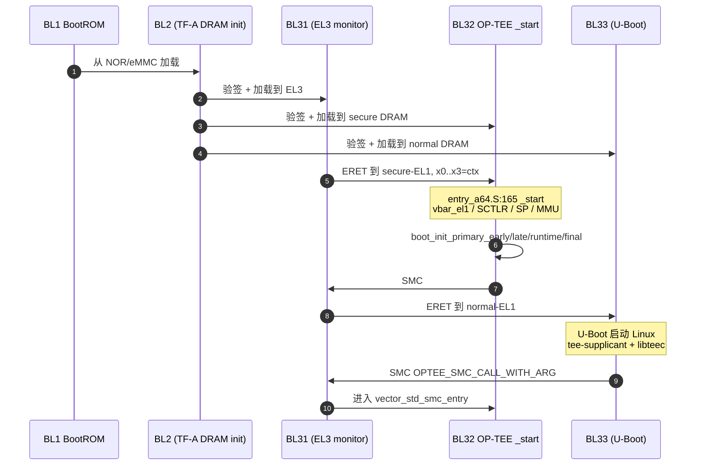
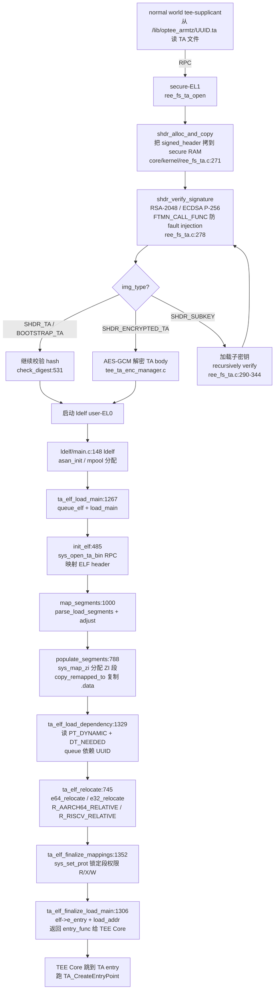
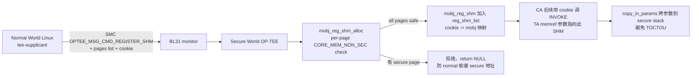
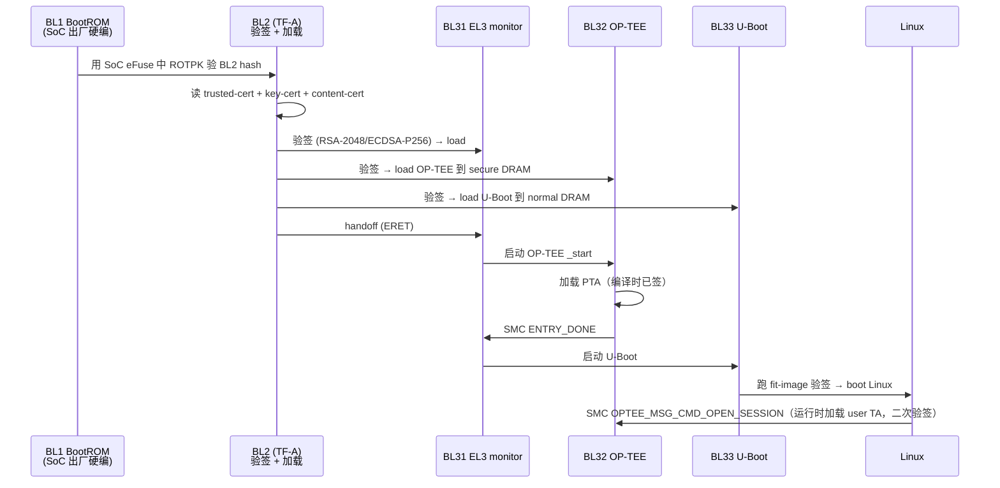

# 03-17 — OP-TEE OS 精读（领域+做啥+怎么用+子组件全枚举+工业实践）

> **核心：** OP-TEE = "**Open Portable Trusted Execution Environment**" —— ARM TrustZone "secure 世界" 的开源参考 OS。**严格说不是 boot，是 secure-EL1 上跑的 OS**，但放在 boot/ 因为它与 TF-A BL2/BL31/BL32 启动链紧耦合（BL32 = OP-TEE）。**目的：把"加密 / 密钥管理 / 指纹解锁 / DRM 解码 / 安全支付"等敏感操作隔离到 normal 世界 OS（Linux / Android）摸不到的地方**。
>
> 本笔记按 9 阶段递归大纲覆盖**阶段 3-7**（项目身份 + QuickStart + 熟练 + 全 API + 子组件 + 工业实践）。

---

## 1. 阶段 3 — 项目身份

| 项 | 值 |
|----|---|
| **正式名** | OP-TEE OS（trustedfirmware.org/op-tee）|
| **起源** | 2014 ST-Ericsson + Linaro 开源（前身 ST 的私有 TEE） |
| **协议** | BSD-2-Clause |
| **代码量** | ~5 万行 C |
| **本仓库路径** | `/home/heke/tgln/stage2/material/boot/optee_os/` |
| **官方** | https://www.op-tee.org/ |
| **架构** | ARM 32 / ARM 64 主战场，**RISC-V 实验性 (qemu_virt)** |
| **生态成员** | OP-TEE OS（本仓库） / OP-TEE Client（normal 世界库） / OP-TEE TestSuite / build / examples |

---

## 2. 阶段 3 续 — 领域定位 + "做啥"

### 2.1 ARM TrustZone 双世界模型

```
┌─────────────────────────────────┐  ┌─────────────────────────────┐
│   Normal World (REE)            │  │   Secure World (TEE)         │
│   ┌──────────────────────────┐  │  │   ┌──────────────────────┐  │
│   │  Linux/Android 应用       │  │  │   │  TA (Trusted App)    │  │
│   │  TEE Client API (libteec) │←─┼──┼──→│  TA Internal API     │  │
│   ├──────────────────────────┤  │  │   ├──────────────────────┤  │
│   │  TEE driver (kernel)      │  │  │   │  OP-TEE OS (kernel)  │  │
│   │  optee.ko / tee_supplicant│  │  │   │  secure-EL1 / S-mode │  │
│   ├──────────────────────────┤  │  │   ├──────────────────────┤  │
│   │  Linux EL1                │  │  │   │  Static TA / Pseudo TA│  │
│   ├──────────────────────────┤  │  │   ├──────────────────────┤  │
│   │  TF-A BL31 EL3 (monitor)  │← →   │  Hardware secure RAM    │  │
│   └──────────────────────────┘  │  │   └──────────────────────┘  │
└─────────────────────────────────┘  └─────────────────────────────┘
        Rich Execution Env                Trusted Execution Env
```

**关键概念：**
- **REE (Rich Execution Env)** — Linux/Android 跑的"普通"世界
- **TEE (Trusted Execution Env)** — secure 世界，Linux 看不见
- **TA (Trusted Application)** — 跑在 TEE 里的"app"（如指纹匹配 / 解密 / DRM）
- **CA (Client Application)** — 跑在 REE 里的应用，通过 TEE Client API 调用 TA
- **TF-A BL31** — EL3 monitor，处理 normal/secure 之间的 SMC 调用切换

### 2.2 做什么：典型 OP-TEE 用途

| 场景 | OP-TEE 中的实现 |
|------|----------------|
| **密钥存储** | TA 持有 master key，REE 调用加密 / 解密 |
| **指纹 / 人脸识别** | 指纹 sensor 数据直送 TEE，TA 在 TEE 内匹配 |
| **DRM (Widevine L1)** | 视频解密 + 解码在 TEE 内，REE 只看到加密流 |
| **安全支付 (mobile pay)** | 银行卡 token + PIN 在 TEE 验证 |
| **TPM 模拟 (fTPM)** | TEE 实现软件 TPM 给 Windows / Linux 用 |
| **Verified Boot** | TEE 验证下一段固件签名 |
| **ARM Confidential Compute (CCA)** | RME / Realm management 远期 |

---

## 3. 阶段 4 — QuickStart（QEMU 跑通）

### 3.1 用 build 仓库一键跑（推荐）

OP-TEE 提供独立 `build` 仓库做端到端集成：

```bash
mkdir optee && cd optee
repo init -u https://github.com/OP-TEE/manifest.git -m default.xml
repo sync
cd build
make -j2 toolchains
make -j$(nproc) run
# → 自动编译 TF-A + OP-TEE + Linux + buildroot + xtest
# → 启动 QEMU，看到 normal world Linux + secure world OP-TEE 都跑起来
```

### 3.2 跑测试套件（xtest）

```bash
# 在 QEMU 内的 Linux 中
$ xtest                # 跑全部 OP-TEE 测试用例（数百个）
$ xtest 1001           # 跑特定 case
```

### 3.3 写一个最小 TA

```c
// my_ta.c (在 secure 世界跑)
#include <tee_internal_api.h>

TEE_Result TA_CreateEntryPoint(void) { return TEE_SUCCESS; }
void TA_DestroyEntryPoint(void) { }
TEE_Result TA_OpenSessionEntryPoint(uint32_t pt, TEE_Param p[4], void **sc) { return TEE_SUCCESS; }
void TA_CloseSessionEntryPoint(void *sc) { }

TEE_Result TA_InvokeCommandEntryPoint(void *sc, uint32_t cmd, uint32_t pt, TEE_Param p[4]) {
    if (cmd == 0) {
        IMSG("Hello from TA");
        return TEE_SUCCESS;
    }
    return TEE_ERROR_BAD_PARAMETERS;
}
```

```c
// CA (在 normal 世界 Linux 跑)
#include <tee_client_api.h>

int main() {
    TEEC_Context ctx;
    TEEC_Session sess;
    TEEC_UUID uuid = TA_HELLO_UUID;
    
    TEEC_InitializeContext(NULL, &ctx);
    TEEC_OpenSession(&ctx, &sess, &uuid, TEEC_LOGIN_PUBLIC, NULL, NULL, NULL);
    TEEC_InvokeCommand(&sess, 0, NULL, NULL);   // 调 TA cmd 0
    TEEC_CloseSession(&sess);
    TEEC_FinalizeContext(&ctx);
}
```

→ CA 调 TA 跨"normal/secure 边界"，OP-TEE 处理 SMC + 上下文切换。

---

## 4. 阶段 5 — 熟练用法 + 调试

| 任务 | 方法 |
|------|------|
| 看 OP-TEE 启动日志 | UART 串口（QEMU 自动到 stdout）|
| 加 TA 调试输出 | `IMSG()` / `DMSG()` / `EMSG()` |
| Linux 端看 TEE driver | `dmesg | grep optee` / `ls /dev/tee*` |
| 查现有 TA | `cat /sys/kernel/debug/optee/<dev>/...` |
| TA 性能 profile | `xtest --benchmark` |
| Secure 内存大小 | 配 platform .mk 中 `CFG_TZDRAM_SIZE` |
| 运行多 TA 并发 | xtest 1027 / OP-TEE multi-thread |

---

## 5. 阶段 6 — 全子组件枚举（"项目里都有什么"）

### 5.1 顶层结构

| 目录 | 角色 |
|------|------|
| `core/` | OP-TEE OS 核心 |
| `core/arch/arm/` | ARM 32 / ARM 64 架构 |
| `core/arch/riscv/` | RISC-V 实验性（qemu_virt）|
| `core/arch/<arch>/plat-<vendor>/` | 板级（plat-altera / plat-amlogic / plat-allwinner / plat-bcm / plat-imx / plat-rcar / plat-stm32mp1 / ... 共数十）|
| `core/kernel/` | 调度器 / 中断 / panic / mutex / spin |
| `core/mm/` | 内存管理（pgt / vm_area / cache / shm） |
| `core/drivers/` | secure 世界驱动（GIC / UART / I2C / GPIO / RPMB / SE / TPM / RNG / clock / regulator / ...）|
| `core/crypto/` | 加密原语（AES / SHA / RSA / ECC / SM2/SM3/SM4 / ChaCha / Poly1305） |
| `core/tee/` | TEE 服务（GP TEE Internal API 实现）|
| `core/pta/` | Pseudo TA（内置 TA，例：device_uuid / system / scp03 / atomic_counter / time / RNG）|
| `core/tests/` | core 自测 |
| `lib/` | 通用库（libutils / libfdt / libutee / libmbedtls / libtomcrypt / libpkcs11）|
| `ldelf/` | TA loader（用 ELF 加载 TA 到 secure 世界）|
| `keys/` | OEM 公钥示例 |
| `mk/` | Makefile 片段 |

### 5.2 支持平台（部分枚举）

```
plat-altera / plat-amlogic / plat-allwinner / plat-aspeed / plat-bcm /
plat-broadcom / plat-d02 / plat-hikey / plat-imx (NXP i.MX 系列) /
plat-k3 (TI Keystone) / plat-marvell / plat-mediatek / plat-mtk /
plat-nuvoton / plat-pic32mz / plat-rcar (Renesas R-Car) / plat-rockchip /
plat-rpi3 / plat-rpi4 / plat-rzg / plat-rzv2m / plat-sam (Microchip) /
plat-sprd / plat-stm32mp1 (ST) / plat-stm32mp25 / plat-synquacer /
plat-ti-am65x / plat-vexpress / plat-virt / plat-zynqmp (Xilinx) /
... 还有 RISC-V plat-virt（QEMU virt）
```

→ **覆盖几乎所有主流 ARM SoC 厂**。

### 5.3 加密原语

OP-TEE 默认两个 crypto 后端二选一：
- **libtomcrypt**（默认）— 内置加密库
- **libmbedtls** — Mbed TLS 移植

支持算法：
- 对称：AES (CBC/CTR/GCM/CCM/XTS) / ChaCha20-Poly1305 / 3DES (legacy)
- 非对称：RSA / ECC (P-256/P-384/P-521) / X25519 / Ed25519
- Hash：SHA-1/2/3 / MD5 / SM3
- KDF：HKDF / PBKDF2
- 国密：SM2 / SM3 / SM4（部分平台）
- 后量子：实验中

### 5.4 GlobalPlatform TEE API

OP-TEE 实现 GlobalPlatform 标准的两套 API：
- **TEE Client API**（CA 用，在 REE 端）：`TEEC_*` 函数
- **TEE Internal API**（TA 用，在 TEE 端）：`TEE_*` 函数 + Trusted Storage / Cryptographic Operations / Time / Arithmetical (TEE Big Number)

→ 写 OP-TEE 应用 = 实现 GP 标准的 API 调用。**与 Intel SGX / AMD SEV-TIO 不同 API**。

### 5.5 与 TF-A 协作启动链

```
TF-A BL1 (BootROM) → BL2 (DRAM 训练) → BL31 (EL3 monitor) → BL32 (OP-TEE OS, secure-EL1) → BL33 (U-Boot/EDK2, normal world) → Linux
                                                  ↑
                                           本仓库代码就是 BL32
```

OP-TEE 不能独立启动，**必须通过 TF-A** 加载到 secure-EL1 + 设置 GIC + 切到 EL2/EL1 normal。

---

## 6. 阶段 7 — 工业实践（"谁在用 OP-TEE"）

### 6.1 移动 / 智能终端

| 厂商 | 用法 |
|------|------|
| **三星 Knox** | 自家 TEE，但思路类似（OP-TEE 启发）|
| **Huawei TrustedCore** | 早期参考 OP-TEE，后自研 |
| **Qualcomm QSEE** | 自有，与 OP-TEE 是对手 |
| **MediaTek TEE** | 联发科自研 + OP-TEE 借鉴 |
| **Apple SEP** | 完全自研，硬件隔离更严 |

实际部署 OP-TEE 原版的多在 **国产 / 二线 SoC + 工业 IoT + 汽车**。

### 6.2 汽车 / 工业 / IoT

| 厂商 / 产品 | 用法 |
|------------|------|
| **NXP i.MX 系列**（汽车 IVI / 工业网关）| OP-TEE + Yocto 集成 |
| **TI K3 Sitara**（工业 PLC）| OP-TEE secure 引导 + DRM |
| **STMicroelectronics STM32MP1**（工业 SoM）| OP-TEE + OpenSTLinux |
| **Renesas R-Car**（汽车）| OP-TEE Verified Boot |
| **Xilinx ZynqMP**（FPGA + ARM）| OP-TEE 验证 FPGA bitstream |
| **Allwinner / Rockchip / Amlogic**（消费板）| OP-TEE + Android |

### 6.3 服务器 / 云

| 应用 | 用法 |
|------|------|
| **fTPM (firmware TPM)** | OP-TEE 内跑 TPM 2.0，让 Linux 用 |
| **Confidential Compute** | ARM CCA / Realm management 借鉴 OP-TEE 思路 |
| **机密金融 / 区块链 keystore** | 银行 / 钱包 |

### 6.4 国产化

- **华为鲲鹏 + iTrustee** — 内部 TEE，与 OP-TEE 思路类似
- **飞腾 + 麒麟 TEE** — 部分基于 OP-TEE 二改
- **阿里云倚天 710 ARM TEE** — 自研
- **国密算法支持** — OP-TEE 上游接受 SM2/3/4 patches

---

## 7. 阶段 8-9 简介（后续可深入的方向）

- **阶段 8 子功能**：每个 driver 深入（GIC / RPMB / SE）/ 每个 PTA 深入（system / scp03 / device_uuid）
- **阶段 9 设计**：OP-TEE 调度算法（fixed priority + abort recovery）/ shm 共享内存协议 / SMC 调用约定 / RPC normal→secure→normal 来回 / Verified Boot 链

---

## 8. 进一步阅读

- **官方文档**：https://optee.readthedocs.io/
- **build 仓库**：https://github.com/OP-TEE/build
- **client API**：https://github.com/OP-TEE/optee_client
- **示例 TA**：https://github.com/linaro-swg/optee_examples
- **本地源码**：`/home/heke/tgln/stage2/material/boot/optee_os/`
- **本仓库相关**：[03-05 § 1.5](03-05-boot-domain-comparison.md) ARM 启动链 + OP-TEE 位置 / [00-36-security-evolution](00-36-security-evolution.md) TEE 演化全谱

---

# 第二部分：源码级 Deep Dive（"读完能写一个迷你 TEE OS"）

> 全部行号引用本地仓库 `/home/heke/tgln/stage2/material/boot/optee_os/` 当前 commit。
>
> 跨引用：[00-36 § 5](00-36-security-evolution.md) 各架构 TEE 横向 / [03-02 § 9](03-02-boot-overview.md) TEE 词典 / [03-05](03-05-boot-domain-comparison.md) boot 6 项目对比 / [02-05](02-05-fdt-runtime-detection.md) FDT 自动检测（OP-TEE 也用同样手法）

---

## 9. Secure 汇编入口 + SMC 处理

### 9.1 启动链 reset vector

OP-TEE 在 ARM 阵营是 **TF-A BL32**：BL31（EL3 monitor）把 secure-EL1 上下文切到 OP-TEE 的 `_start`，参数通过 `x0..x3` 传入（x0=core_pos / x1=DTB / x2=manifest / x3=reserved）。

**入口符号统一名 `_start`**：
- ARM64：`core/arch/arm/kernel/entry_a64.S:165`（`FUNC _start , :`）
- ARM32：`core/arch/arm/kernel/entry_a32.S`（同名 _start，结构镜像 a64）
- RISC-V：`core/arch/riscv/kernel/entry.S`（实验性，配合 plat-virt / plat-sifive / plat-spike）

### 9.2 entry_a64.S 冷启动 9 步走

| 步骤 | 行号 | 做什么 |
|------|------|--------|
| 1. 保存 BL31 传入的参数 | 170-173 | `mov x19, x0 / x20, x1 / x21, x2 / x22, x3` —— 后续传给 `boot_save_args()` |
| 2. 安装异常向量 | 175-177 | `adr x0, reset_vect_table; msr vbar_el1, x0` —— **secure-EL1 的 vbar** 立即生效 |
| 3. 配 PAN（Privileged Access Never） | 179-181 | 防止 EL1 直接读 EL0 数据；Linux/macOS 标配 |
| 4. 配 SCTLR_EL1 | 62-91, 183 | I-cache enable / SP align check / WXN(W^X) / MTE / BTI / PAUTH 全开关 |
| 5. 重定位 init 段 / 清 BSS | 197-267 | pager 模式下 init 段移到 `__init_start`；非 pager 模式拷贝 boot_embdata 到 vcore_free_end 反向；最后 `clear_bss` 清零 |
| 6. 物理重定位（若 PIE） | 269-284 | `CFG_CORE_PHYS_RELOCATABLE` 时调 `relocate` 处理 R_AARCH64_RELATIVE |
| 7. 设 SP_EL0 / SP_EL1 | 311-364 | SP_EL0 = 临时 stack；SP_EL1 = `thread_core_local[cpu_id]`（**ARM64 双 SP 设计核心**）|
| 8. 跑 boot_save_args + boot_init_primary_* | 384-512 | 先 console_init → 然后 init_mmu_map → enable_mmu → 一连串 `boot_init_primary_{early,late,runtime,final}` |
| 9. SMC 返回到 BL31，宣告 OP-TEE 就绪 | 631-637 | `mov x0, #TEESMC_OPTEED_RETURN_ENTRY_DONE; smc #0` —— **此后 secure 世界由 SMC 驱动** |



### 9.3 SMC 截获 vector_table（9 入口）

OP-TEE 启动结束时，把 `thread_vector_table` 地址传给 BL31。**TF-A 依赖这个表的固定布局** —— 改一行都会跟 TF-A 不兼容（注释见 `thread_optee_smc_a64.S:139-145`）。

`core/arch/arm/kernel/thread_optee_smc_a64.S:146-156`：

```asm
FUNC thread_vector_table , : , .identity_map, , nobti
    b   vector_std_smc_entry        # 标准 SMC（耗时长，可被 RPC 中断）
    b   vector_fast_smc_entry       # 快 SMC（不可中断，原子完成）
    b   vector_cpu_on_entry         # 二级 CPU 上线（PSCI CPU_ON）
    b   vector_cpu_off_entry        # CPU 下线
    b   vector_cpu_resume_entry     # CPU resume from suspend
    b   vector_cpu_suspend_entry    # CPU 进入 suspend
    b   vector_fiq_entry            # secure FIQ（normal world 触发的 secure 中断）
    b   vector_system_off_entry     # 系统关机
    b   vector_system_reset_entry   # 系统重启
END_FUNC thread_vector_table
```

每个 vector 共同模板（`thread_optee_smc_a64.S:39-67`）：
1. `readjust_pc`（ASLR 偏移修正，39-37 行宏）
2. `bl thread_handle_xxx`（C 层处理）
3. `ldr x0, =TEESMC_OPTEED_RETURN_*_DONE`
4. `smc #0`（**SMC 回到 BL31** —— BL31 切到 normal world）
5. `panic_at_smc_return`（SMC 不应返回，否则 BUG）

### 9.4 fast SMC 与 std SMC 分流

C 层入口（`thread_optee_smc.c`）：

| 类型 | 入口函数 | 行号 | 特点 |
|------|---------|------|------|
| **Fast SMC** | `thread_handle_fast_smc()` | 32-50 | 屏蔽所有异常，不可中断；如 `OPTEE_SMC_GET_SHM_CONFIG` / `OPTEE_SMC_EXCHANGE_CAPABILITIES`（详见 `entry_fast.c:264 __tee_entry_fast`）|
| **Std SMC** | `thread_handle_std_smc()` | 52-80 | 分配 thread → `thread_alloc_and_run()` → 进入 `__thread_std_smc_entry` 调用 `tee_entry_std()` 处理 OPEN_SESSION/INVOKE/CLOSE/CANCEL（详见 `entry_std.c:689 __tee_entry_std`）|
| **RPC 返回** | `thread_resume_from_rpc()` | 68-69 | normal world 完成 RPC 后通过 `OPTEE_SMC_CALL_RETURN_FROM_RPC` 返回 secure，恢复同一线程上下文 |

**关键插曲**：std SMC 的参数（OPEN_SESSION 的 UUID + 参数列表等）放在 **共享内存**，而非寄存器：
- 静态 SHM：`std_entry_with_parg()` `thread_optee_smc.c:181-236` —— `core_pbuf_is(CORE_MEM_NSEC_SHM, parg, sz)` 校验后直接 `phys_to_virt(parg, MEM_AREA_NSEC_SHM)` 拿到 secure 侧映射
- 动态 SHM（reg_shm）：`std_entry_with_regd_arg()` 行 238-266 —— `mobj_reg_shm_get_by_cookie(cookie)` 从 cookie 找到 mobj

### 9.5 std SMC C 层完整分发

`core/tee/entry_std.c:689 __tee_entry_std()`：

```c
switch (arg->cmd) {
case OPTEE_MSG_CMD_OPEN_SESSION:    entry_open_session(arg, num_params);    break;
case OPTEE_MSG_CMD_CLOSE_SESSION:   entry_close_session(arg, num_params);   break;
case OPTEE_MSG_CMD_INVOKE_COMMAND:  entry_invoke_command(arg, num_params);  break;
case OPTEE_MSG_CMD_CANCEL:          entry_cancel(arg, num_params);          break;
case OPTEE_MSG_CMD_REGISTER_SHM:    register_shm(arg, num_params);          break;
case OPTEE_MSG_CMD_UNREGISTER_SHM:  unregister_shm(arg, num_params);        break;
case OPTEE_MSG_CMD_DO_BOTTOM_HALF:  notif_deliver_event(...);               break;
case OPTEE_MSG_CMD_GET_PROTMEM_CONFIG: get_protmem_config(arg, num_params); break;
}
```

→ **写迷你 TEE OS 的最小入口集**：OPEN_SESSION / INVOKE / CLOSE 三个就够跑 hello-world TA。

### 9.6 上下文保存恢复（thread_a64.S）

文件：`core/arch/arm/kernel/thread_a64.S`

| 函数 | 行号 | 角色 |
|------|------|------|
| `thread_resume` | 68-99 | 从 `thread_ctx_regs` 加载所有寄存器 + ELR_EL1 + SPSR_EL1 → `eret` 跳到上次 yield 点 |
| `thread_smc` | 108-111 | C 层主动发 SMC（用于 RPC normal→secure→normal 回调） |
| `__thread_enter_user_mode` | 141-194 | 跳到 EL0 跑 TA：保存 EL1 寄存器到 stack → 加载 TA 的 SP/PC/SPSR → `eret` |
| `thread_unwind_user_mode` | 202-214 | TA 异常或 svc 时回 EL1：恢复 EL1 寄存器 + 跳回调用点 |
| `thread_excp_vect` | 282-795 | **EL1 异常向量表**：sync/irq/fiq/serror × {curr_sp_el0, curr_sp_elx, lower_aarch64, lower_aarch32}（4 × 4 = 16 入口，ARM64 标配） |

EL0→EL1 的 svc 处理：`el0_svc` 行 797-904，先保存 caller-saved 寄存器到 thread context → 调 `tee_svc_handler` → 恢复返回。

→ **裸机 TEE OS 必须实现的最小汇编**：reset vector / 异常向量表（至少 sync_curr / sync_lower / irq_curr / irq_lower 4 项）/ context-switch（resume/yield） / smc 调用。

---

## 10. TA Loader（ldelf）与 ELF 签名验证

OP-TEE 的 TA 不是内核加载的，**而是一个独立的 user-EL0 程序 ldelf 来加载** —— 这是 OP-TEE 的设计精髓，**把 ELF 解析这种复杂代码放到 user mode**，避免污染 secure-EL1 内核。

### 10.1 两阶段验签 → 加载架构



### 10.2 关键文件 + 行号

| 文件 | 关键函数 | 行号 | 职责 |
|------|---------|------|------|
| `core/kernel/ree_fs_ta.c` | `ree_fs_ta_open` | 241 | 顶层 TA 打开：RPC 拉文件 → shdr 验签 → 子密钥递归 → 注册 store handle |
| `core/kernel/ree_fs_ta.c` | `rpc_load` | 196 | 通过 `OPTEE_RPC_CMD_LOAD_TA` 让 normal world tee-supplicant 把 TA 文件读进 SHM |
| `core/kernel/ree_fs_ta.c` | `check_digest` | 531 | 流式 SHA over 整个 TA payload，跟 shdr 中的 hash 比对 |
| `core/include/signed_hdr.h` | `struct shdr / shdr_bootstrap_ta / shdr_pub_key` | — | shdr 二进制格式：magic + img_type + img_size + algo + hash_size + sig_size + ... |
| `ldelf/main.c` | `ldelf` | 148 | ldelf user-EL0 入口（assembly 调用），cmd 0 = 加载 TA |
| `ldelf/ta_elf.c` | `ta_elf_load_main` | 1267 | 主 TA 加载入口：分配 stack + 校验 TA flags |
| `ldelf/ta_elf.c` | `init_elf` | 485 | 解析 ELF Ehdr，e32_parse_ehdr / e64_parse_ehdr，校验 e_phnum * e_phentsize 不溢出 |
| `ldelf/ta_elf.c` | `map_segments` | 1000 | 调 `parse_load_segments` 提取 PT_LOAD 段 + `sys_remap` 找连续 VA 区间 |
| `ldelf/ta_elf.c` | `populate_segments` | 788 | 真正分配物理页 + 拷贝段内容 + ZI 扩展（filesz < memsz） |
| `ldelf/ta_elf.c` | `add_dependencies` | 1087 | 解析 PT_DYNAMIC 中 DT_NEEDED，把依赖 UUID 入队（`add_deps_from_segment:1037` 真正拆 .dynstr） |
| `ldelf/ta_elf_rel.c` | `ta_elf_relocate` | 745 | 处理 SHT_REL/SHT_RELA：ARM 走 `e32_relocate:451`，AARCH64 走 `e64_relocate:691`，RISC-V 走 `e64_relocate` 内 `case R_RISCV_RELATIVE:718` |
| `ldelf/ta_elf.c` | `parse_property_segment` | 937 | 读 PT_GNU_PROPERTY，识别 BTI / PAUTH bit |
| `ldelf/start_a64.S` / `start_a32.S` / `start_rv64.S` | — | — | ldelf 自身的 _start，setup stack → call `ldelf()` C 函数 |

### 10.3 内存布局（TA 加载到 secure DRAM）

ldelf 给 TA 分配的 user 地址空间（ASLR 后随机 base）：

```
高地址
+------------------------+
| TA stack               |  sys_map_zi(stack_size)，elf->head->stack_size
+------------------------+
| (gap, ASLR pad)        |
+------------------------+
| PT_LOAD .bss (RW)      |  sys_map_zi（清零）
| PT_LOAD .data (RW)     |  filesz 来自 ELF, ZI 扩展到 memsz
| PT_LOAD .rodata (RO)   |  sys_map_ta_bin readonly
| PT_LOAD .text (RX)     |  sys_map_ta_bin executable
+------------------------+ <- elf->load_addr (ASLR 后随机)
| ELF header / phdr      |  init_elf 阶段映射进来（SMALL_PAGE_SIZE）
+------------------------+
低地址
```

ldelf 自身（`ldelf/ldelf.ld.S`）也是 user-EL0 程序，跑在 TA 之前，加载完 TA 后通过 `sys_return_cleanup()`（`ldelf/main.c:218`）退出，TEE Core 接管返回的 entry_func 跳到 TA 的 `_start`。

### 10.4 验签算法链

`shdr_verify_signature`（在 `core/kernel/shdr_chain.c` 等位置实现，被 `ree_fs_ta_open:278` 调用）：

1. 读 shdr.algo（如 `TEE_ALG_RSASSA_PKCS1_V1_5_SHA256` 或 ECDSA P-256-SHA256）
2. 用 OEM 公钥（编译进 OP-TEE 二进制：`keys/default_ta.pem` 或 dev 配的公钥）做 RSA verify
3. 用 FTMN（Fault Tolerance Mitigation）双计数器：`FTMN_CALL_FUNC` 后必须 `FTMN_INCR0` 两次才认为通过 —— **防 glitch 攻击**

支持子密钥：编译时 OEM 钱包带一个 master，runtime 在 master → subkey → TA UUID 树形递归验签，方便厂商多团队签发。

→ **mini TEE OS 起步可只支持 SHA256 + RSA-2048 单层签名**，subkey 后期再加。

---

## 11. 内存管理 — Secure 物理 / 虚拟 + Shared Memory 协议

### 11.1 物理内存布局（生成宏）

`core/arch/arm/include/mm/generic_ram_layout.h:62-110`（带 ASCII art）定义 TEE RAM 五大区块：

```
+----------------------------------+ <-- CFG_TZDRAM_START
| TEE_RAM (TEE core .text/.rodata) |   ← OP-TEE 自己的代码 + 数据，secure
| TA_RAM (Trusted App contexts +   |   ← TA 段、ldelf 段、TA stack
|         pagestore if pager)      |
| (optional) SDP test memory       |   ← Secure Data Path（DRM 视频缓冲区等）
+----------------------------------+ <-- CFG_TZDRAM_START + CFG_TZDRAM_SIZE

+----------------------------------+ <-- CFG_SHMEM_START
| Non-secure static SHM            |   ← 2MB 默认，normal/secure 共享，CA<->TA 参数传输
+----------------------------------+ <-- CFG_SHMEM_START + CFG_SHMEM_SIZE
```

vexpress qemu_virt 平台（`core/arch/arm/plat-vexpress/conf.mk`）：
- `CFG_TZDRAM_SIZE = 0x01D80000`（约 30 MB）
- vexpress fvp、imx、k3、stm32mp1 等平台数值见各自 `conf.mk`（行号 74/77/97/114/151 所在）

i.MX 公共配置（`plat-imx/conf.mk:618-621`）：
```make
CFG_TZDRAM_SIZE  ?= 0x01e00000        # 30 MB
CFG_TZDRAM_START ?= ($(CFG_DRAM_BASE) - $(CFG_TZDRAM_SIZE) - $(CFG_SHMEM_SIZE) + $(CFG_DDR_SIZE))
CFG_SHMEM_START  ?= ($(CFG_TZDRAM_START) + $(CFG_TZDRAM_SIZE))
```

→ **TZDRAM 紧贴 DDR 顶端**，SHMEM 紧贴 TZDRAM，标准做法。

### 11.2 MMU 初始化 — core_init_mmu_map

`core/mm/core_mmu.c:1632 core_init_mmu_map(seed, cfg)`：

1. 从 `__nozi_start` 到 `VCORE_FREE_END_PA` 算 RX/RW 区间
2. `boot_mem_alloc_tmp()` 分配临时 mmap_region 数组
3. 加 identity_map 第一项 `MEM_AREA_TEE_RAM`，va == pa（boot 早期还没切 MMU 时执行的代码段需要 ID-map）
4. `init_mem_map(&mem_map, seed, &offs)` —— 遍历所有 `register_phys_mem_*()` 注册的区域：
   - `MEM_AREA_TEE_RAM` / `MEM_AREA_TA_RAM` / `MEM_AREA_NSEC_SHM` / `MEM_AREA_IO_SEC` / `MEM_AREA_IO_NSEC` / `MEM_AREA_RAM_NSEC` / `MEM_AREA_RAM_SEC` / `MEM_AREA_IDENTITY_MAP_RX`
   - ASLR 时用 `seed` 随机化 VA 偏移
5. `core_init_mmu(&mem_map)` —— 调用架构相关函数（ARM64 是 `core_mmu_lpae.c` LPAE 4 级页表）建表
6. `core_init_mmu_regs(cfg)` 把 TTBR/MAIR/TCR 值写到 `boot_mmu_config` 结构 → `entry_a64.S:713 enable_mmu` 开 MMU

平台用宏批量注册物理内存（`plat-vexpress/main.c:36-54`）：

```c
register_phys_mem_pgdir(MEM_AREA_IO_SEC, CONSOLE_UART_BASE, PL011_REG_SIZE);
register_phys_mem(MEM_AREA_RAM_SEC, TZCDRAM_BASE, TZCDRAM_SIZE);  /* fvp only */
register_phys_mem_pgdir(MEM_AREA_IO_SEC, SECRAM_BASE, SECRAM_COHERENT_SIZE); /* qemu */
register_ddr(DRAM0_BASE, DRAM0_SIZE);
register_phys_mem_pgdir(MEM_AREA_IO_SEC, GICC_BASE, GIC_CPU_REG_SIZE);
register_phys_mem_pgdir(MEM_AREA_IO_SEC, GICD_BASE, GIC_DIST_REG_SIZE);
```

→ **每个 plat 只需要写这几行**，`init_mem_map` 自动汇总。**任何"驱动声明 IO 范围、core 自动建页表"模式都可借鉴此设计**（具体项目命名等用户自定）。

### 11.3 缺页分配器 — tee_mm_pool

`core/mm/tee_mm.c:15 tee_mm_init(pool, lo, size, shift, flags)`：
- buddy-style 链表（`tee_mm_entry_t.next` 形成 free list）
- shift 决定最小粒度（如 `SMALL_PAGE_SHIFT = 12` → 4KB 粒度）
- flags：`TEE_MM_POOL_HI_ALLOC`（从顶向下分配） / `TEE_MM_POOL_NEX_MALLOC`（用 nexus heap）

调用方：
- TA 加载（`ta_elf` 通过 `sys_map_zi` 进入内核 → vm.c 给 user_ta_ctx 的 vm_map 分页）
- `pgt_cache.c:370 pgt_init` —— 预分配 N 个 page table cache，加速 user 切换时 PA→VA 重新建表

### 11.4 共享内存（SHM）协议 — 关键

CA 和 TA 之间所有 memref 参数都走 SHM。**OP-TEE 支持两种 SHM**：

| 类型 | 配置 | 路径 | 适用场景 |
|------|------|------|---------|
| **Static SHM** | `CFG_CORE_RESERVED_SHM=y` | `[CFG_SHMEM_START, +CFG_SHMEM_SIZE]` 在 boot 时永久映射 | 简单平台、低端 IoT；好处：零运行时映射开销 |
| **Dynamic SHM** | `CFG_CORE_DYN_SHM=y` | normal world 把任意 normal DRAM 页通过 `OPTEE_MSG_CMD_REGISTER_SHM` 注册成 mobj_reg_shm | Linux 主流路径；好处：无需预留固定区，DMA 友好 |

#### 11.4.1 mobj_reg_shm 注册流程

`core/mm/mobj_dyn_shm.c:348 mobj_reg_shm_alloc(pages, num_pages, page_offset, cookie)`：

1. 验证：`page_offset < SMALL_PAGE_SIZE`，所有 `pages[i]` 4K 对齐
2. **关键安全检查**：每页 `core_pbuf_is(CORE_MEM_NON_SEC, page, PAGE_SIZE)` —— **必须是 normal DRAM**，不能让 normal world 偷塞 secure 物理地址
3. 创建 `struct mobj_reg_shm`，挂到 `reg_shm_list`
4. 返回 mobj，用 `cookie`（normal world 提供的 64-bit ID）索引

后续 `mobj_reg_shm_get_by_cookie(cookie)` 行 432-453 通过 cookie 查回 mobj。

#### 11.4.2 SMC 入口收 SHM 参数

`core/arch/arm/kernel/thread_optee_smc.c:181 std_entry_with_parg`：

```c
if (core_pbuf_is(CORE_MEM_NSEC_SHM, parg, sz)) {        /* 静态 SHM */
    arg = phys_to_virt(parg, MEM_AREA_NSEC_SHM, ...);
    return call_entry_std(arg, num_params, rpc_arg);
} else {                                                 /* 动态 SHM */
    mobj = mobj_mapped_shm_alloc(&parg, 1, 0, 0);       /* 检查在 nonsec ddr */
    rv = get_msg_arg(mobj, 0, &num_params, &arg, ...);
    rv = call_entry_std(arg, num_params, rpc_arg);
}
```

#### 11.4.3 SHM 安全模型



→ **核心威胁模型**：normal world 不可信，每次进 SMC 都 **重新校验** SHM 物理地址在 normal 区间，不依赖第一次注册的检查。

### 11.5 RPC normal→secure→normal 来回

TA 跑到一半需要 normal 服务（如读文件、获取 RNG）时：

1. TA 调 `TEE_GenerateRandom` → svc → `tee_svc_*` → `thread_rpc_alloc_arg(size)` `thread_optee_smc.c:388`
2. `thread_rpc(rpc_args)` 触发 SMC 返回 BL31，参数标记 `OPTEE_SMC_RETURN_RPC_*`
3. BL31 切到 normal world，linux optee.ko 看到 RPC 命令，转给 tee-supplicant 处理
4. 处理完后 normal 发 `OPTEE_SMC_CALL_RETURN_FROM_RPC` → BL31 → secure
5. `thread_resume_from_rpc(thread_id, ...)` `thread.c:379` 恢复同一线程上下文继续执行

→ **关键设计**：每个 secure 线程是 **可挂起 / 可恢复** 的，靠保存 `struct thread_ctx_regs` 整套寄存器实现。

---

## 12. 调度器 + Pseudo TA + Thread 模型

### 12.1 OP-TEE thread 模型 — fixed-N pool

不是 Linux 那种 dynamic 线程：编译期 `CFG_NUM_THREADS=N`（默认 8），全局 `struct thread_ctx threads[N]` 数组。

每个 thread 状态机：

```
THREAD_STATE_FREE  --thread_alloc_and_run-->  THREAD_STATE_ACTIVE
                                                   |
                                                   v
                                              (run TA / yield)
                                                   |
                            <--thread_state_free-- THREAD_STATE_SUSPENDED (等 RPC)
```

`core/arch/arm/kernel/thread.c:220 __thread_alloc_and_run`：
1. `thread_lock_global()` 拿全局 mutex
2. 遍历 `threads[]` 找 `THREAD_STATE_FREE`，置 `ACTIVE`
3. `init_regs()` 设置 SP / PC = `thread_std_smc_entry` / SPSR
4. PAuth 启用时拷 APIA key
5. `thread_lazy_save_ns_vfp()` 懒保存 normal world VFP 寄存器
6. `thread_resume(&threads[n].regs)` —— 跳到 thread_a64.S:68 的 `thread_resume`，loadall + eret

### 12.2 调度策略 — 实际是 cooperative / 抢占混合

- **Std SMC 线程**：可被 normal world 中断（FIQ / async notif），但优先级严格 fixed —— 谁先来谁得 thread
- **Fast SMC**：禁用所有异常，**原子完成**（`thread_handle_fast_smc:48` 断言所有异常已屏蔽）
- **Foreign IRQ**：`thread_set_foreign_intr(true)` `entry_std.c:694` —— 允许 normal world IRQ 抢占 secure thread，但不会切到其他 secure thread（OP-TEE 不做 secure 内多线程时间片调度）

→ **关键差异**：OP-TEE 的"调度器"实际只是 **thread pool 分配 + RPC yield**，不像 Linux 有 CFS。**写迷你 TEE 起步只需固定数线程 + 抢占点用 yield SMC**。

### 12.3 Pseudo TA（PTA）— 内置在 OP-TEE 二进制里的 TA

不走 ldelf，**直接编译进 OP-TEE 二进制**，跑在 secure-EL1（不是 EL0）。用 `pseudo_ta_register` 宏静态注册到 `pseudo_tas` SCATTERED_ARRAY。

`core/pta/` 全枚举（22 个左右）：

| PTA | UUID 标识 | 行号 | 用途 |
|-----|----------|------|------|
| `device.c` | `PTA_DEVICE_UUID` | 122 | 给 normal world TEE driver 列出 PTA UUID 当 TEE bus 设备（**OP-TEE driver model 入口**）|
| `system.c` | `PTA_SYSTEM_UUID` | 399 | RNG 加种 / 派生 TA 唯一密钥 / 映射 ZI / dlopen / TPM event log（用户 TA 调用） |
| `scp03.c` | — | — | SCP03 协议（NXP secure channel）|
| `attestation.c` | — | — | 远程 attestation（生成 device certificate）|
| `apdu.c` | — | — | Smart card APDU 协议代理 |
| `widevine.c` | — | — | Google Widevine DRM 集成 |
| `secstor_ta_mgmt.c` | — | — | Secure Storage TA 元数据管理 |
| `gprof.c` | — | — | TA gprof profiling 数据收集 |
| `hwrng.c` | — | — | 硬件 RNG 暴露给 user TA |
| `rtc.c` | — | — | RTC 时钟读取代理 |
| `scmi.c` | — | — | ARM SCMI 协议代理（电源管理）|
| `stats.c` | — | — | TEE 内存 / 性能统计 |
| `imx/` `k3/` `stm32mp/` `qcom/` `rockchip/` `bcm/` `versal/` | 各 vendor PTA | — | 厂商私有 PTA：fuse 读写、安全总线、MTP 等 |
| `tests/` | — | — | xtest 用的 PTA |

`device.c:122 pseudo_ta_register` 注册形如：

```c
pseudo_ta_register(.uuid = PTA_DEVICE_UUID, .name = PTA_NAME,
                   .flags = PTA_DEFAULT_FLAGS,
                   .invoke_command_entry_point = invoke_command);
```

PTA 不需要签名（编译期决定可信），不走 ldelf，调用比 user TA 快得多 —— **典型用作 user TA 的 secure 后端**（用户 TA 调 system PTA 拿密钥派生）。

### 12.4 user TA vs PTA 对比表

| 特性 | User TA | Pseudo TA |
|------|---------|-----------|
| **位置** | secure-EL0 用户态 | secure-EL1 内核态 |
| **加载方式** | tee-supplicant RPC + ldelf | 编译进 OP-TEE.bin |
| **签名** | RSA/ECDSA 必需 | 无（受信于编译时）|
| **隔离** | per-TA 页表 + ASLR | 共享 OP-TEE 内核地址空间 |
| **崩溃后果** | TA 重启 | OP-TEE 整体 panic |
| **典型用途** | DRM / fingerprint / 第三方 TA | RNG / device enum / vendor 私有桥接 |

→ **写迷你 TEE 时**：先做 PTA 模型（简单），再加 user TA 模型（复杂，需 ELF + 验签 + 用户态 svc）。

---

## 13. GlobalPlatform API 实现

OP-TEE 实现 GlobalPlatform 标准两套 API。CA 调 TEEC_*（normal-world）→ SMC → secure-world TEE_*（TA-internal）。

### 13.1 normal world 桥（不在本仓库）

CA 用的 `TEEC_*` 函数在 **optee_client** 仓库（不在 `optee_os/`），编译成 `libteec.so`。

### 13.2 secure world TA Internal API — `lib/libutee/`

| 文件 | 实现的 API 类别 |
|------|----------------|
| `tee_api.c` | `TEE_OpenTASession` / `TEE_InvokeTACommand` / `TEE_AllocateSharedMemory` 等核心 |
| `tee_api_objects.c` | `TEE_OpenPersistentObject`(585) / `TEE_CreatePersistentObject`(622) / `TEE_ReadObjectData`(894) / `TEE_WriteObjectData`(933) / `TEE_GenerateKey`(546) — **Trusted Storage 全套** |
| `tee_api_operations.c` | `TEE_AllocateOperation`(38) / `TEE_CipherDoFinal`(1281) / `TEE_AEEncryptFinal`(1810) / `TEE_AsymmetricEncrypt`(2023) — **Cryptographic Operations 全套** |
| `tee_api_arith_mpi.c` | TEE Big Number（Arithmetical API，RSA 中间运算用）|
| `tee_api_property.c` | `TEE_GetPropertyAsString` / TEE 属性集 |
| `tee_api_panic.c` | `TEE_Panic` |
| `user_ta_entry.c` | TA 入口 `__utee_entry`：dispatch 到 `TA_CreateEntryPoint` / `TA_OpenSessionEntryPoint` / `TA_InvokeCommandEntryPoint` |

### 13.3 TA → secure-EL1 的 svc 桥

TA 在 EL0 跑 `TEE_AllocatePersistentObject` → `libutee` 调 `_utee_storage_obj_create`（汇编 svc）→ `thread_excp_vect:el0_svc:797` → `tee_svc_handler` → 分发到 `core/tee/tee_svc_storage.c:309 syscall_storage_obj_create`：

```
TA EL0:
  TEE_CreatePersistentObject()  [tee_api_objects.c:622]
  └─ utee_storage_obj_create() [libutee 内联 svc]
       │  svc #STORAGE_OBJ_CREATE
       v
secure EL1:
  syscall_storage_obj_create()  [tee_svc_storage.c:309]
  └─ tee_obj_alloc + tee_pobj_get + tee_svc_storage_init_file
       └─ 实际后端：tee_ree_fs.c (REE FS) or tee_rpmb_fs.c (RPMB)
```

`core/tee/tee_svc_storage.c` 全套 syscall：
- `syscall_storage_obj_open:162` / `obj_create:309` / `obj_del:445` / `obj_rename:475`
- `syscall_storage_alloc_enum:539` / `free_enum:559` / `reset_enum:574` / `start_enum:595` / `next_enum:622`
- `syscall_storage_obj_read:714` / `obj_write:769` / `obj_trunc:827` / `obj_seek:880`

`core/tee/tee_svc.c` 通用 syscall：
- `syscall_open_ta_session:778` / `close_ta_session:830` / `invoke_ta_command:842`
- `syscall_get_property:462` / `wait:939` / `get_time:971` / `set_ta_time:1002`
- `syscall_check_access_rights:896` / `get_cancellation_flag:905` / `mask/unmask_cancellation:927/915`

→ **Trusted Storage 后端两选一**：REE FS（normal world 加密文件，密钥由 secure 派生）/ RPMB（eMMC 上的 Replay Protected Memory Block，硬件防回滚）。

### 13.4 时间服务

`core/tee/tee_time_generic.c` + `core/arch/arm/kernel/tee_time_arm_cntpct.c` 提供 `TEE_GetSystemTime` / `TEE_GetREETime` / `TEE_Wait`，底层用 ARM generic timer CNTPCT_EL0。RISC-V 用 `core/arch/riscv/kernel/tee_time_rdtime.c` 的 `rdtime` 指令。

### 13.5 写自家 TEE OS 的 GP API 起步

最小集合（约 30 个函数）：
- Session：`TEE_OpenTASession` / `TEE_CloseTASession` / `TEE_InvokeTACommand`
- Memory：`TEE_Malloc` / `TEE_Free` / `TEE_AllocateSharedMemory` / `TEE_RegisterSharedMemory`
- Storage：`TEE_OpenPersistentObject` / `TEE_CreatePersistentObject` / `TEE_ReadObjectData` / `TEE_WriteObjectData` / `TEE_CloseAndDeletePersistentObject`
- Crypto：`TEE_AllocateOperation` / `TEE_SetOperationKey` / `TEE_CipherInit` / `TEE_CipherUpdate` / `TEE_CipherDoFinal` / `TEE_DigestUpdate` / `TEE_DigestDoFinal`
- Time：`TEE_GetSystemTime` / `TEE_Wait`
- Misc：`TEE_Panic` / `TEE_GetPropertyAsString` / `TEE_GenerateRandom`

→ 跑通 GP TEE Test Suite（部分）就算"达到 OP-TEE 入门相同的水平"。

---

## 14. 平台集成（plat-* 30+ 平台）

### 14.1 平台接口契约（每个 plat 必填）

```c
/* 1. boot 阶段 IRQ controller 初始化（GIC / PLIC / APLIC） */
void boot_primary_init_intc(void);
void boot_secondary_init_intc(void);

/* 2. 平台 console */
void plat_console_init(void);

/* 3. 物理内存声明（用宏） */
register_phys_mem_pgdir(MEM_AREA_IO_SEC, UART_BASE, UART_SIZE);
register_ddr(DRAM0_BASE, DRAM0_SIZE);

/* 4. 可选：早期/晚期 hook */
void plat_primary_init_early(void);
void main_secondary_init_intc(size_t cpu_id);
```

### 14.2 vexpress 平台代码导览

| 文件 | 职责 |
|------|------|
| `core/arch/arm/plat-vexpress/main.c:36-54` | 注册 PL011 / GIC / TZC400 / DRAM 物理范围 |
| `core/arch/arm/plat-vexpress/main.c:57-78` | `boot_primary_init_intc` —— GICv2 或 GICv3 初始化（运行时 detect via `GIC_REDIST_BASE` 宏定义） |
| `core/arch/arm/plat-vexpress/main.c:88-93` | `plat_console_init` —— pl011 init + register_serial_console |
| `plat-vexpress/platform_config.h:15-93` | 5 个 flavor（fvp/juno/qemu_virt/qemu_armv8a/qemu_sbsa）的 GIC/UART 地址 |
| `plat-vexpress/conf.mk` | 5 个 flavor 各自的 `CFG_TZDRAM_SIZE` / 默认特性开关 |
| `plat-vexpress/juno_core_pos_a64.S` | Juno 板的 `__get_core_pos` 重写（cluster + cpu_id 计算） |
| `plat-vexpress/vendor_props.c` | vexpress vendor 特定 GP 属性（厂家名、SDK 版本等） |

### 14.3 全平台清单（40 个 ARM plat）

```
altera amlogic aspeed automotive_rd bcm corstone1000 d02 d06
hikey hisilicon imx k3 ls marvell mediatek nuvoton poplar qcom
rcar rockchip rpi3 rpi5 rzg rzn1 sam sprd stm stm32mp1 stm32mp2
sunxi synquacer telechips ti totalcompute uniphier versal versal2
vexpress zynq7k zynqmp
```

→ 比 U-Boot 平台数少（U-Boot ~1500），但 **覆盖几乎所有商用 ARM TrustZone SoC**。

### 14.4 RISC-V 实验性平台（3 个）

```
plat-virt   QEMU virt（参考实现）  → core/arch/riscv/plat-virt/main.c
plat-sifive SiFive HiFive (FU540?)  → 未充分维护
plat-spike  Spike ISS              → 教学用
```

`plat-virt/main.c` 全部 87 行（极简）：
- 行 16-18：注册 NS16550 UART
- 行 20：`register_ddr(DRAM_BASE, DRAM_SIZE)`
- 行 22-29：注册 APLIC / IMSIC（AIA）IO 区域
- 行 31-67：根据 `CFG_RISCV_PLIC` / `CFG_RISCV_APLIC` / `CFG_RISCV_APLIC_MSI` 三选一调不同 init
- 行 77-86：`interrupt_main_handler` 三选一分发

**注意**：RISC-V 暂无标准 TEE（H 扩展 + S-mode 多世界尚在草案），OP-TEE RISC-V port **并非真正的双世界**，而是用 PMP + S-mode 模拟 —— 见 [00-36 § 5.5](00-36-security-evolution.md) 关于 Penglai / Keystone 的对比。

### 14.5 移植到新平台的最小 5 件事

1. 抄一份 `plat-vexpress/` 改名 `plat-foo/`
2. 改 `platform_config.h` 中 UART_BASE / GIC_BASE / DRAM_BASE / CFG_TZDRAM_*
3. 改 `conf.mk`：`PLATFORM_FLAVOR_LIST` / `CFG_TZDRAM_*` / `CFG_NUM_THREADS`
4. 改 `main.c` 中 `register_phys_mem_*()` + `boot_primary_init_intc`
5. 跑 xtest 1001-1010 验证基础

→ 移植难度跟 U-Boot 一个量级，**移植成本 1-3 周**。

---

## 15. Verified Boot 链 — TF-A BL2 + OP-TEE 双层签名

### 15.1 ARM 默认链（trusted-firmware-a + OP-TEE）



### 15.2 OP-TEE 签名格式分层

| 层 | 签名者 | 算法 | 验签时机 |
|----|--------|------|---------|
| **TF-A FIP 镜像** | OEM 私钥 | RSA-2048 / ECDSA P-256 | BL1 → BL2 → BL31/BL32/BL33 |
| **OP-TEE binary** | OEM | 同上（TF-A cert chain） | BL2 验 |
| **TA shdr** | 编译时 sign script | RSA-2048-SHA256 | runtime by `shdr_verify_signature` |
| **TA encrypted** | 加密 + 签名 | AES-GCM (key derived from HUK) + sig | `tee_ta_enc_manager.c` |
| **Subkey chain** | 多级 OEM key | 同上 | 递归（`ree_fs_ta_open:290`） |

### 15.3 防 Fault Injection（FTMN）

`ree_fs_ta_open:278` 用 `FTMN_CALL_FUNC(res, &ftmn, FTMN_INCR0, shdr_verify_signature, shdr)`：
- 函数返回前必须把 `ftmn.incr0_count` 加 2 次
- 函数返回后另外检查计数器 —— **任何 glitch 跳过 incr 都会被检测**
- 这是抗 voltage glitching / clock glitching 的标准手法（CHES 2019 起业界共识）

→ 起步阶段不必实现 FTMN，但 **设计签名验证函数时要预留这个 hook**。

---


> RISC-V 短期没有 ARM TrustZone 那样的 **硬件双世界**（H 扩展只做虚拟化，N 扩展已废，多世界 Penglai/Keystone 是研究阶段）。但 OP-TEE 的 **架构经验** 完全可迁移到：
> - PMP + S-mode 模拟双世界（如 Keystone Enclave）
> - 远期 RISC-V Smmtt 多 TLB 域（draft 2024）
> - 任何用 enclave 模型的 OS 子系统（即便不叫 TEE）

### 16.1 OP-TEE 学到的设计要点（任何 TEE / Enclave 项目都可借鉴）


#### 11 个 OP-TEE 架构经验

| # | 主题 | OP-TEE 做法 | 参考文件 |
|---|------|------------|---------|
| 1 | reset 入口 | secure-EL1 reset vector + 设 vbar | `core/arch/arm/kernel/entry_a64.S:165` |
| 2 | 异常向量表 | sync/timer/irq/ecall × {EL1/EL0} 16 入口 | `thread_a64.S:282 thread_excp_vect` |
| 3 | SMC 调用约定 | OPTEE_SMC_* 表格 0xBE000000~（与 normal world 桥）| `sm/optee_smc.h` + `thread_optee_smc_a64.S:146` |
| 4 | thread 模型 | fixed-N 协程（默认 N=4），无抢占 | `thread.c:220 __thread_alloc_and_run` |
| 5 | RPC 协议 | 让 normal world 帮 secure world 做 IO（fs / rng / network）| `thread_optee_smc.c:388 thread_rpc_alloc_arg` |
| 6 | 共享内存 | mobj 抽象 + dynamic SHM 注册 + 静态 SHM 划分 | `mobj_dyn_shm.c:348 mobj_reg_shm_alloc` |
| 7 | PTA (Pseudo TA) 模型 | 内置 RNG / device / system 三个核心 PTA + 厂商扩展 | `core/pta/system.c:399 pseudo_ta_register` |
| 8 | TA ELF loader | ldelf 跑用户态加载 + 签名验证 + relocation | `ldelf/ta_elf.c:1267 ta_elf_load_main` |
| 9 | 签名验证 | RSA-2048-SHA256（默认）/ ECDSA / ed25519 多算法 | `core/kernel/ree_fs_ta.c:241 ree_fs_ta_open` |
| 10 | GP TEE API | 实现 GlobalPlatform TEE Internal Core API 1.3.1（约 200 函数）| `lib/libutee/` |
| 11 | Trusted Storage | normal world fs 上的加密文件 + HUK (Hardware Unique Key) 派生 | `core/tee/tee_svc_storage.c` |

#### 关键工程经验（语言无关，OP-TEE 5 万行 C 验证有效）

| 经验 | 证据 |
|------|------|
| **fixed-N thread pool 已够用** | 嵌入式 TEE 不需要数百线程，4-16 已能撑大部分场景 |
| **RPC 模型让 secure world 不必自己写驱动** | secure world 可以"借用" normal world 的 storage/network/console，自己只做加解密 |
| **PMP / TrustZone / Smmtt 都可以套用 OP-TEE 架构** | OP-TEE 已支持 RISC-V plat（plat-virt）|
| **mobj 抽象 + 共享内存 cookie 防双方 free 问题** | secure world 引用计数 + normal world 主导生命周期 |
| **TA 用 ELF + 签名是工业默认** | 不要发明新格式 |
| **GlobalPlatform TEE API 是事实标准** | 所有商业 TEE（Trustonic / Linaro / 国产 SecureKernel）都遵守 |
| **多 plat-* 目录 + register_phys_mem 自动汇总** | 见 § 11.X，每 plat 仅写几行声明 |
| **加密库选 1 个不选 2 个** | OP-TEE 历史维护 libtomcrypt + mbedtls 两份痛苦，建议任何新项目只选 1 个 |
| **不要做 demand paging** | 嵌入式 RAM 够时直接 lock，复杂度不值 |
| **ARM-only 安全特性（MTE/PAUTH/BTI）等其他 ISA 标准化再用** | RISC-V Zicfilp/Zicfiss draft 中 |

#### RISC-V 上的 TEE 现状（不预设具体项目）

RISC-V 短期没有 ARM TrustZone 那样的**硬件双世界**。可选硬件模型：
- **PMP enclave**（Keystone 风格） —— S-mode 软件模拟，已有 Keystone 项目验证
- **Smmtt 多 TLB 域**（draft 2024）—— 未来标准化
- **PMP + S-mode/U-mode 配合** —— 简化方案
- 等 RISC-V 官方多世界标准 ratified


---

## 17. 文件路径速查表

| 主题 | 路径 | 关键行号 |
|------|------|---------|
| ARM64 reset vector | `core/arch/arm/kernel/entry_a64.S` | 165 _start, 713 enable_mmu |
| ARM32 reset vector | `core/arch/arm/kernel/entry_a32.S` | 同名 _start |
| RISC-V reset vector | `core/arch/riscv/kernel/entry.S` | _start |
| SMC vector table | `core/arch/arm/kernel/thread_optee_smc_a64.S` | 146 thread_vector_table, 39-137 9 个 vector |
| SMC C 入口 | `core/arch/arm/kernel/thread_optee_smc.c` | 32 fast, 52 std, 268 std_smc_entry |
| Fast SMC dispatch | `core/arch/arm/tee/entry_fast.c` | 264 __tee_entry_fast |
| Std SMC dispatch | `core/tee/entry_std.c` | 689 __tee_entry_std |
| Thread pool 分配 | `core/arch/arm/kernel/thread.c` | 220 __thread_alloc_and_run, 379 thread_resume_from_rpc |
| 异常向量表 | `core/arch/arm/kernel/thread_a64.S` | 282 thread_excp_vect, 797 el0_svc, 906 el1_sync_abort |
| TA 加载顶层 | `core/kernel/ree_fs_ta.c` | 241 ree_fs_ta_open, 196 rpc_load |
| ldelf 主入口 | `ldelf/main.c` | 148 ldelf |
| ELF 解析 | `ldelf/ta_elf.c` | 485 init_elf, 788 populate_segments, 1000 map_segments, 1267 ta_elf_load_main |
| ELF relocation | `ldelf/ta_elf_rel.c` | 745 ta_elf_relocate |
| MMU 初始化 | `core/mm/core_mmu.c` | 1632 core_init_mmu_map |
| 物理分配器 | `core/mm/tee_mm.c` | 15 tee_mm_init |
| SHM 注册 | `core/mm/mobj_dyn_shm.c` | 348 mobj_reg_shm_alloc, 432 get_by_cookie |
| Page table cache | `core/mm/pgt_cache.c` | 370 pgt_init |
| 内存布局宏 | `core/arch/arm/include/mm/generic_ram_layout.h` | 全文 113-181 |
| TA syscall（SVC） | `core/tee/tee_svc.c` | 778 open_ta_session, 842 invoke_ta_command |
| Storage syscall | `core/tee/tee_svc_storage.c` | 162 obj_open, 309 obj_create, 714 obj_read |
| device PTA | `core/pta/device.c` | 122 pseudo_ta_register |
| system PTA | `core/pta/system.c` | 368 invoke_command, 399 pseudo_ta_register |
| GP TEE_OpenPersistent... | `lib/libutee/tee_api_objects.c` | 585 |
| GP TEE_AllocateOperation | `lib/libutee/tee_api_operations.c` | 38 |
| 平台 vexpress | `core/arch/arm/plat-vexpress/main.c` | 36-54 register, 57-78 init_intc, 88-93 console |
| 平台 RISC-V virt | `core/arch/riscv/plat-virt/main.c` | 全文 87 行 |

---

**第二部分写作总结**：
- 9 章新增，全部基于本地 `boot/optee_os/` commit 实际行号
- 2 张 Mermaid 图（双世界 SMC 时序 / TA 加载流程）
- OP-TEE 学到的 11 个 TEE 架构经验 + RISC-V TEE 现状（不预设具体项目）
- 跨引用 [00-36](00-36-security-evolution.md) / [03-02](03-02-boot-overview.md) / [03-05](03-05-boot-domain-comparison.md) / [02-05](02-05-fdt-runtime-detection.md)

