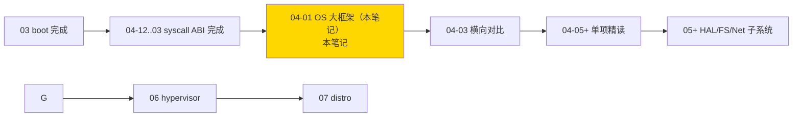

> **核心问题：**
> 1. 本地 `core/` 下 18 个 OS 项目，谁是谁，凭什么放在一起？
> 2. 学完 03 boot 进 OS，先看哪个？看完之后看哪个？
> 3. xv6 / arceos / DragonOS / asterinas / seL4 / unikraft / Theseus —— 这一串名字之间是"同类竞品"还是"不同物种"？
>
>
>

---

## 0. 全栈坐标定位

```
硬件 → BMC → BIOS/UEFI → SPL → SBI → ★ OS 内核 ★ → libc → rootfs → distro
                                       ↑
                                  你现在在这里
```

OS 在全栈的位置（**已学**：03 boot / 02 sbi；**当前**：04 OS；**待学**：05+ HAL/FS/Net/libc/distro）：



---


| # | 范式 | 核心思想 | 代表项目 | 本地材料 |
|---|------|---------|---------|---------|
| 1 | **宏内核（Monolithic）** | 所有服务跑在内核态，性能优先 | Linux / Windows NT / xv6 / DragonOS / StarryOS | `core/{xv6,DragonOS,StarryOS,NoAxiomOS,TornadoOS,tg-rcore}` |
| 2 | **微内核（Microkernel）** | 只在内核态留 IPC + 调度，其余服务跑用户态 | seL4 / Mach / QNX / Zircon | `core/{seL4,Zircon,zCore}` |
| 3 | **混合内核（Hybrid）** | 微 + 宏折中（如 macOS XNU） | XNU / Windows NT | （无本地材料 —— 可读 [00-07 § 3.3](00-07-os-evolution.md)） |
| 4 | **外核（Exokernel）** | 内核仅暴露原始硬件，应用自己组装 OS 抽象 | jos / Aegis | `core/{jos}` |
| 5 | **LibOS / Unikernel** | 内核 + 应用编成单一 binary，单地址空间 | unikraft / HermitOS / MirageOS / rumprun / BareMetal | `core/{unikraft,libos/HermitOS,libos/MirageOS,libos/TenonOS,libos/rumprun,BareMetal,biscuit,tamago}` |
| 6 | **组件化（Component Kernel）** | 内核拆成 cargo 风组件，按需组装出 unikernel/微/宏 | arceos / asterinas / Theseus | `core/{arceos,tg-arceos,asterinas,Theseus}` |


---

## 2. 本地 18 项目全景

### 2.1 一图概览

```mermaid
flowchart TD
    Start[本地 core/ 18 项目]

    Start --> Mono[宏内核教学]
    Start --> Comp[组件化]
    Start --> Micro[微内核]
    Start --> Exo[外核 / SASOS]
    Start --> Uni[Unikernel / LibOS]

    Mono --> xv6[xv6<br/>C / 2万行<br/>必学起点]
    Mono --> tgrcore[tg-rcore<br/>Rust / 教学]
    Mono --> dragon[DragonOS<br/>Rust+C / 国产]
    Mono --> starry[StarryOS<br/>Rust / arceos上]
    Mono --> noax[NoAxiomOS<br/>Rust / 实验]
    Mono --> tornado[TornadoOS<br/>Rust / 异步]

    Comp --> tgarceos[tg-arceos<br/>arceos 教学集<br/>20 个示例]
    Comp --> aster[asterinas<br/>framekernel 安全]
    Comp --> theseus[Theseus<br/>学术]

    Micro --> sel4[seL4<br/>C+Haskell<br/>形式化验证]
    Micro --> zircon[Zircon<br/>C++ / Fuchsia]
    Micro --> zcore[zCore<br/>Rust / Zircon 重写]

    Exo --> jos[jos<br/>MIT 6.828]
    Exo --> bare[BareMetal<br/>x86_64 FASM SASOS]

    Uni --> unik[unikraft<br/>C / 工业]
    Uni --> bisc[biscuit<br/>Go 宏内核]
    Uni --> tama[tamago<br/>Go 裸机]

    style xv6 fill:#90EE90
    style arceos fill:#ffd700
    style tgarceos fill:#ffd700
    style aster fill:#FFB6C1
    style sel4 fill:#FFB6C1
```



### 2.2 推荐学习顺序（4 阶段递进）

#### Stage 1 — 入门（必学）：xv6
- **代码量：** 2 万行 C
- **学什么：** UNIX V6 重写，**最小完整全栈**（boot + 进程 + mm + sched + fs + syscall 全在一份小代码里）
- **预期时间：** 30-50 小时精读
- **后续输出：** 04-02 xv6 源码精读笔记
- **本地路径：** `core/xv6`

> **为什么先学 xv6？** 现代 OS 项目（arceos / asterinas / DragonOS）代码量都在 5-10 万行 + 大量抽象层，没有 OS 经验的话直接读会迷失。xv6 是"OS 教科书的源码版"——MIT 6.828 / 6.S081 课程教材，与 *Operating Systems: Three Easy Pieces* 一一对应。一周读完后再上其他项目，所有概念都有锚点。

#### Stage 2 — 进阶（必学）：tg-rcore + arceos
- **tg-rcore（Rust 路线起点）：** rCore 教学实现，可对照 *rCore-Tutorial-Book* 一章一章读。重点学"Rust 写 OS 的范式"。
- **tg-arceos：** arceos 教学示例集合（15 app + 5 exercise），看完 arceos 框架后用这些示例验证理解。
- **预期时间：** 2-3 周
- **后续输出：** 04-03 tg-rcore 精读 + 04-05 arceos 组件化范式精读

#### Stage 3 — 工业（按兴趣选）：DragonOS / asterinas / StarryOS
- **DragonOS：** 国产宏内核，**Linux ABI 兼容**——直接对接 04-13 syscall 列表，看 Rust+C 如何混合实现完整 Linux ABI
- **asterinas：** **framekernel** 安全模型——unsafe Rust 仅出现在 ~5% 的"内核地基"，其余 95% 是 safe Rust
- **StarryOS：** arceos 上的"宏内核人格"——看组件化框架如何组装出宏内核
- **预期时间：** 各 1-2 周
- **后续输出：** 04-06 DragonOS / 04-07 asterinas / 04-08 StarryOS 各一篇

#### Stage 4 — 微内核 + Unikernel（深度选修）
- **seL4：** 微内核 + 形式化验证，C+Haskell，~20 万行；**学完 OS 主线后再来**
- **unikraft：** 工业 Unikernel 框架（C），云原生场景用
- **jos：** MIT 6.828 外核教学（与 xv6 同课程不同 lab）
- **biscuit：** Go 写宏内核（GC + goroutine 直接进内核空间），证明"async OS 可行"
- **tamago：** Go 裸机框架，零 OS 直接 ARM/RISC-V MCU
- **Theseus：** 学术 component-OS（"intralingual" 设计，整 OS 一份 Rust binary）

---

## 3. 不在本地的重要参考（按需 clone）

| 项目 | 角色 | 何时 clone |
|------|------|----------|
| **Linux** | 全球最大宏内核（30M 行）| 学 fs / mm / sched 子系统时 sparse checkout |
| **Redox OS** | Rust 微内核 | 看 Rust 微内核工业落地 |
| **MINIX 3** | 微内核教学 + Tanenbaum 教材源码 | 微内核入门替代 |
| **NuttX** | 工业 RTOS（接近 OS）| RTOS / OS 边界情形 |
| **plan 9** | 学术启发：万物皆 fs | 看"另一种 UNIX"|
| **HelenOS** | 微内核研究 OS | 多服务进程 RPC 学习 |
| **OpenHarmony / 鸿蒙** | 国产微内核（LiteOS-A 后改进）| 国产 OS 路线 |

---

## 4. 04-XX OS 笔记规划（路线图）

```
04-12 syscall-arch-abi              ✅ 已写（架构层 ABI）
04-13 syscall-linux-list            ✅ 已写（200+ syscall 三架构编号表）
04-14 syscall-glibc-abi             ✅ 已写（libc 包装层）
04-04 os-kernel-overview            ✅ 本笔记（大框架）
04-01 os-kernel-domain-comparison   ⏳ 下一篇（横向对比）
04-02 xv6-source-walkthrough        📋 Stage 1 起点
04-03 tg-rcore-walkthrough          📋 Stage 2 Rust 起点
04-06 dragonos-linux-compat         📋 工业兼容范式
04-07 asterinas-framekernel         📋 安全 Rust 范式
04-08 starryos-personality          📋 arceos 宏内核人格
04-09 sel4-microkernel              📋 微内核 + 形式化（深度）
04-10 unikraft-unikernel            📋 工业 Unikernel
04-11 jos-exokernel                 📋 外核（深度选修）
04-15+ 子系统主题精读                 📋 mm / sched / fs / net / driver per-topic
```

之后会有（笔记编号大致预期，具体由用户自定）：
- **05-XX FS** （easyfs / ext4_rs / lwext4_rust 精读 → 学到 FS 设计要点）
- **06-XX HAL / driver framework**（polyhal 主参考）
- **07-XX Net**（smoltcp / lwip 精读）
- **08-XX libc**（musl 精读 + Linux ABI 兼容讨论）
- **09-XX rootfs / distro**（buildroot / busybox / YoctoPoky）

---

## 5. 学习 OS 内核需要回答的 7 个原则问题（任何 OS 项目都适用）

>

| # | 问题 | 行业主流参考方案 |
|---|------|------------------|
| 1 | 编程语言 | C / C++ / Rust / Zig / Go—— OS 内核 Rust 生态正快速成熟 |
| 2 | 范式 | 宏 / 微 / 外核 / LibOS / 组件化（详见 § 04-02） |
| 3 | 启动方式 | single-kernel-image / multi-stage / FIT / EFI |
| 4 | syscall ABI | POSIX / Linux 兼容 / 自定义 / 二维（参考 TornadoOS） |
| 5 | 多人格 | 是否支持 unikernel / 宏 / hypervisor 编译时选（arceos 风） |
| 6 | 驱动框架 | per-language pool / IOKit / Linux DM / 简化 platform driver |
| 7 | 验证 | safe Rust / fuzz / TLA+ / 形式化（seL4 风）|


---


> 引自 `user_learning_style.md`：**大框架 → 横向定位 → 对比消化 → 细节填充 → 自己造**。

| 步骤 | OS 学习对应动作 | 输出 |
|------|---------------|------|
| 1. 大框架 | 看本笔记 + 00-07 演化 + 全栈坐标 | 知道 OS 在全栈位置，知道 6 范式分类 |
| 2. 横向定位 | [04-03](04-03-os-kernel-domain-comparison.md) 横向对比 | 知道每个项目"做什么 / 不做什么 / 为什么"|
| 3. 对比消化 | 自己写一份"取舍判断表" | 能解释"为什么 arceos 用 cargo features 不用 Kconfig"|
| 4. 细节填充 | 04-05+ 单项精读 | 读源码到能改动 / 移植 |

**禁忌（重申）：**
- 不要直接跳 Stage 4（seL4）—— 没有 xv6 / arceos 基础读不下去
- 不要"先跑代码再读理论"—— 先大框架再细节，否则迷失
- 不要漏 tg-rcore —— Rust OS 的范式入口

---

## 7. 名词词典（OS 大类专属）

> 与 [03-02 § 9](03-02-boot-overview.md) boot 词典互补 + [00-07](00-07-os-evolution.md) 范式定义不重复，本节聚焦"看代码时会撞见的术语"。

| 术语 | 含义 | 项目 |
|------|------|------|
| **HAL** | Hardware Abstraction Layer，把 CPU/MMU/IRQ/timer 抽象成接口 | polyhal / arceos `axhal` |
| **trapframe** | 用户态 → 内核态切换时保存的寄存器集 | xv6 `kernel/trap.c` / arceos `axhal::trap` |
| **task / thread** | OS 调度单位（不区分进程线程时） | arceos `axtask` |
| **runtime** | 内核启动后的"应用支撑环境"（heap / panic / sched） | arceos `axruntime` |
| **uclass / udevice / driver** | 设备模型三件套（U-Boot / Linux DM 风） | DragonOS / arceos `axdriver` |
| **VFS** | Virtual File System，文件系统统一接口层 | xv6 `kernel/file.c` / arceos `axfs` |
| **vDSO** | 用户态执行的"内核代码片段"（gettimeofday 等）| 详见 [04-12 § 7](04-12-syscall-arch-abi.md) |
| **futex** | Fast User-mode Mutex，用户态同步原语 | 04-13 § 13 |
| **rseq** | Restartable sequence，无锁原子序列 | 04-13 § 40 |
| **TLS（thread-local storage）**| 每线程独立变量区 | musl `src/thread/` |
| **errno** | libc 设的全局/TLS 错误码 | 详见 [04-14 § 3](04-14-syscall-glibc-abi.md) |
| **framekernel** | safe Rust 包裹 unsafe base（asterinas 范式）| asterinas 顶层 README |
| **personality** | 内核"人格"，同一组件在不同启动方式下表现不同 | StarryOS（unikernel/宏内核切换）|
| **bareflank / kvm-on-arm** | 不同 hypervisor 实施风格 | hyper/{axvisor, hypocaust-2} |
| **MSI / MSI-X** | Message-Signaled Interrupt，PCIe 设备中断方式 | 详见 [00-11 § 5](00-11-interrupt-evolution.md) |
| **vsoc / virtio** | 虚拟设备协议（KVM / QEMU / arceos 都用）| arceos `axdriver_virtio` |
| **panic_unwind** | Rust panic 的栈展开策略，OS 内核常用 abort | arceos `axruntime` |

---

## 8. 进一步阅读

### 8.1 本仓库内（按学习顺序）
- [00-07 § 3](00-07-os-evolution.md) — 5 大范式深入剖析
- [00-15](00-15-concurrency-sync-evolution.md) — 并发同步（OS 实现需要）
- [00-14](00-14-memory-allocator-evolution.md) — 内存分配器（kalloc / slab / buddy）
- [00-11](00-11-interrupt-evolution.md) — 中断（trap entry 必读）
- [04-12..03](04-12-syscall-arch-abi.md) — syscall 三件套
- [02-01](02-01-boot-chain-and-sbi.md) — boot 链（OS 入口的上一级）
- [03-10/11](03-10-u-boot-spl-source-walkthrough.md) — U-Boot SPL/proper（OS 加载路径）

### 8.2 项目本地路径
- `core/xv6/` — UNIX V6 重写（必学起点）
- `core/tg-rcore/` — rCore 教学
- `core/tg-arceos/` — arceos 20 个 app/exercise 教学示例
- `core/asterinas/` / `core/DragonOS/` / `core/StarryOS/` — 工业项目
- `core/seL4/` — 微内核 + 形式化
- `core/jos/` / `core/BareMetal/` — 外核 / SASOS

### 8.3 经典教材（强烈推荐）
- *Operating Systems: Three Easy Pieces*（OSTEP，免费在线）— xv6 概念配套
- *MIT 6.S081 Lab Notes* — xv6 实验指南
- *rCore-Tutorial-Book* — Rust OS 教学
- *The Art of Multiprocessor Programming* — 并发底层
- *seL4 Reference Manual* — 微内核 + capability
- *μKernel Construction*（Liedtke 1995 经典论文）— 微内核宣言

### 8.4 在线资源
- [OS Dev Wiki](https://wiki.osdev.org/) — OS 开发百科
- [phil-opp/blog_os](https://os.phil-opp.com/) — Rust 写 OS 入门博客
- [rcore-os GitHub Org](https://github.com/rcore-os) — 中国 Rust OS 阵营总入口
- [Asterinas 文档](https://asterinas.github.io/) — framekernel 设计

---

## FAQ

### Q1: 为什么 xv6 是必学起点而不是 arceos？
xv6 用 C 写得**直白**——没有 trait / Generic / async 抽象，每行代码做什么一目了然。arceos 是 Rust 工业项目，trait + Generic + cargo features 多层包装，没有 OS 经验直接读会迷失。**xv6 教概念，arceos 教工程**——顺序错了会浪费时间。

### Q2: tg-rcore 和 arceos 选一个就够了吗？
不够。tg-rcore 教 "**Rust OS 入门基础**"（页表 / trap / 单线程调度 / 简单 fs），arceos 教 "**组件化设计模式**"（cargo features / 抽象 trait / 多人格）。两者**不重叠**——tg-rcore 是教科书，arceos 是工程作品集。

### Q3: DragonOS 和 asterinas 选哪个？
看你的兴趣：
- **DragonOS** —— 国产，Linux ABI 兼容工程量最大（已能跑 nginx），看"如何兼容 Linux"
- **asterinas** —— framekernel 安全范式（unsafe 只在 ~5% 的 base）；看"如何把 Rust 类型系统当形式化验证用"

### Q4: seL4 难度多大？
高——C+Haskell 双语、形式化验证证明 / Isabelle 推理需要数学基础；20 万行代码是 xv6 的 10 倍。**学完 OS 主线再来**，不要起步就啃。但读 seL4 spec PDF 是有价值的（即便不读代码），它对"内核能简化到多极致"给出标杆。

### Q5: tg-arceos 和 arceos 实际差别？
tg-arceos = `arceos` 的**教学包装**，把 arceos 配套的 15 个 `app-*` + 5 个 `exercise-*` 打包成一个 crate。**实际运行还是 arceos**，tg-arceos 提供的是 20 个 example——unikernel 启动 / 多任务调度 / 块设备读写 / 客操作系统 (guest mode) / hypervisor 等。学 arceos **必看 tg-arceos**（不然只看到框架不见示例）。

### Q6: BareMetal、jos、unikraft 三者都是 SASOS / Unikernel，有什么区别？
- **BareMetal** —— 极简 SASOS，**汇编写**，HPC 场景，最纯粹"无 OS"
- **jos** —— 教学**外核**（exokernel），暴露硬件资源，应用自己实现 OS 抽象
- **unikraft** —— 工业 **Unikernel** 构建框架，云原生场景，单一应用 + 单地址空间但仍提供库 OS 抽象

三者顺着"OS 抽象的多少"排序：BareMetal（最少）< jos（中）< unikraft（最多但仍单地址空间）。

### Q7: 学完 OS 后下一步？
按全栈路线（笔记编号大致预期，具体由用户自定）：
- HAL / driver framework（polyhal 入手）
- FS 子系统精读（easyfs → ext4_rs）
- Net 子系统精读（smoltcp / lwip）
- libc（musl + Linux ABI 兼容讨论）
- rootfs / distro（buildroot / busybox）
- **远期** hypervisor（学完 H 扩展后回来）


---

**总结：** 04 大类的入口已经搭好。下一步看 [04-03](04-03-os-kernel-domain-comparison.md) 横向对比表（**对比消化**层），再选定一个项目进 04-05+ 单项精读（**细节填充**层）。
