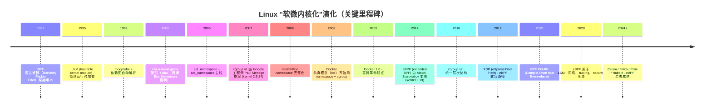
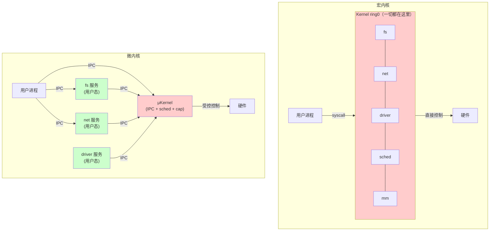
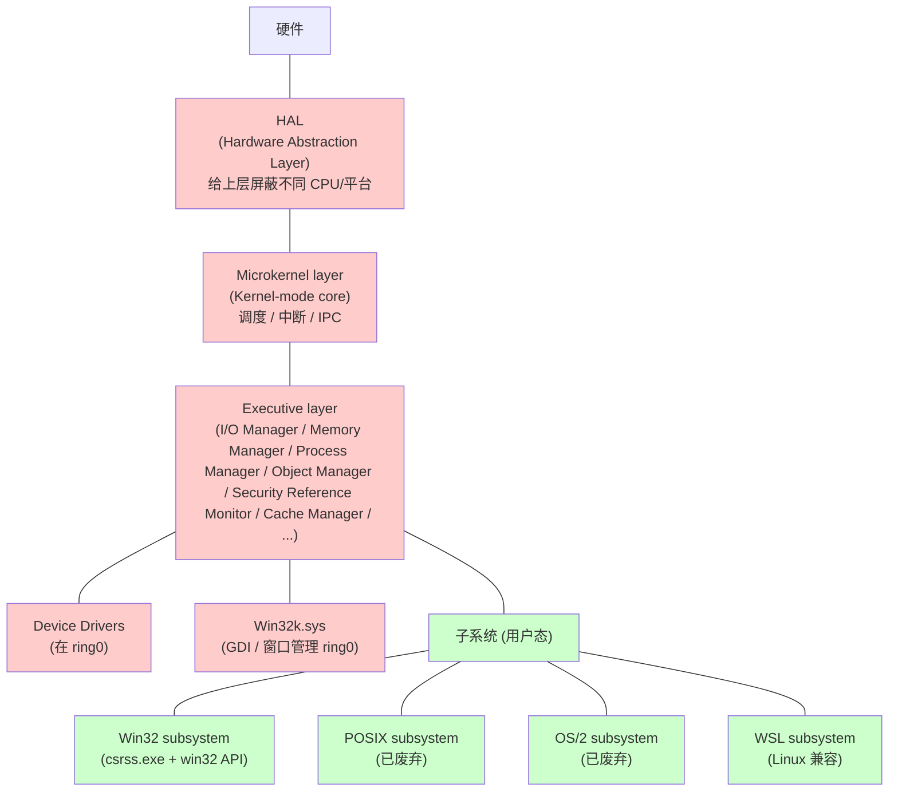
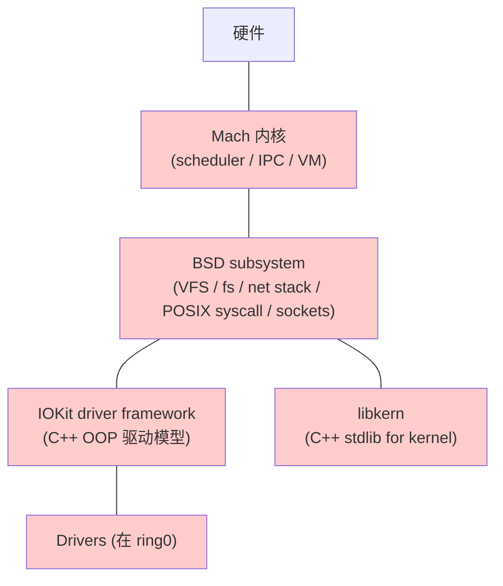
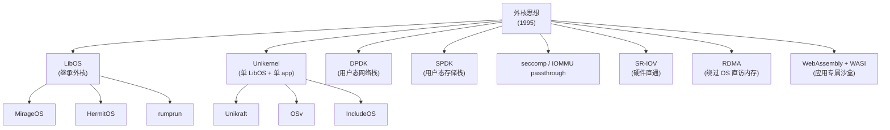
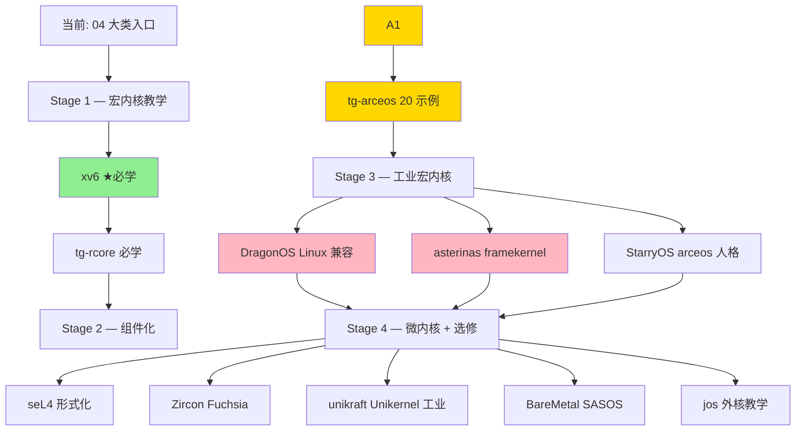

# 04-02 — OS 内核范式归纳：宏 / 微 / 混合 / 外核 / SASOS / LibOS / Unikernel / 虚拟化 / RTOS / 组件化 / 异步 全谱

> **核心问题：**
> 1. "宏内核 / 微内核 / 外核 / LibOS / Unikernel / RTOS / Hypervisor"——这些词到底是同一维度的并列项，还是不同切面？
> 
> 2. xv6 是宏内核 / arceos 是组件化 unikernel / asterinas 是 framekernel / Linux 是宏内核 + 模块——同一份"内核"代码，怎么衍生出这么多名字？
> 3. 微内核效率低 30 年了，凭什么 seL4 / QNX / Zircon 还活着？
> 4. RTOS 与通用 OS 区别仅在"调度算法"还是"整体架构"？
>
> **一句话答案：** OS 范式不是"5 选 1"的并列项，而是 **3 个独立维度的笛卡尔积**——结构维度（谁在内核）/ 边界维度（怎么隔离）/ 部署维度（怎么打包）。一个项目可同时是"组件化 + Unikernel + 宏内核人格"（arceos）。
>
>
> 与 [00-07](00-07-os-evolution.md) 分工：00-07 偏宏观历史 + 范式定义；本篇按**统一坐标系**重组，给"为什么有这么多范式 / 它们如何并存 / 如何混搭"提供答案。

---

## 0. 三个独立维度（OS 范式分类的真相）

> **关键洞察：** 通常说 OS "范式"是把 3 个独立维度的标签混着喊。读懂这一节，后面所有名词都自动归位。

| 维度 | 取值 | 描述 |
|------|------|------|
| **A. 结构（谁在内核）** | 全包 / 最小 / 折中 / 无 | 所有 OS 服务进内核 vs 仅留 IPC vs 折中 vs 无内核 |
| **B. 边界（怎么隔离）** | 多地址空间 / 单地址空间 / 软件隔离 | 硬件 MMU 多空间 vs 单空间 vs 类型系统/能力隔离 |
| **C. 部署（怎么打包）** | 多应用 / 单应用 / 模块化 | 通用 OS 跑多 app vs 单 app + OS 编一起 vs 按需组装 |

### 0.1 维度 A — 结构（"谁在内核"）

```
全包 ━━━━━━━━━━━━━━━━━━ 折中 ━━━━━━━━━━━━━━━━━━ 最小 ━━━━━━━━━━━━━━━━━━ 无
宏内核                  混合内核                  微内核                  外核
Linux/Windows           macOS XNU                 seL4/QNX/Zircon        jos/Aegis
fs/net/driver/sched     部分服务用户态            仅 IPC + 调度 + MMU    只暴露硬件资源
全在内核                                                                  应用自己组装
```

### 0.2 维度 B — 边界（"怎么隔离"）

```
多地址空间                  单地址空间                  软件隔离
Linux/xv6/seL4              SASOS/Unikernel             Theseus/asterinas
每进程独立 MMU 空间          全系统单一空间               类型系统 + Capability
```

### 0.3 维度 C — 部署（"怎么打包"）

```
通用 OS                单应用打包                组件化按需组装
Linux distro           Unikernel                 arceos
跑无数 app             OS+app 编成一份            cargo features 选
```

### 0.4 三维笛卡尔积示例（消除"范式混淆"）

```
xv6           = 宏 (A) + 多空间 (B) + 通用 (C)        ← 经典 UNIX 教学版
Linux         = 宏 (A) + 多空间 (B) + 通用 (C)        ← 工业版 xv6
seL4          = 微 (A) + 多空间 (B) + 通用 (C)        ← 微内核 + 多服务
HermitOS      = 微 (A) + 单空间 (B) + 单 app (C)      ← 微 + Unikernel
unikraft      = 库 (A) + 单空间 (B) + 单 app (C)      ← LibOS + Unikernel
arceos        = 组件 (A) + 单空间 (B) + 模块化 (C)    ← unikernel 默认人格
StarryOS      = 组件 (A) + 多空间 (B) + 通用 (C)      ← arceos 上的"宏内核人格"
asterinas     = 组件 (A) + 多空间 (B) + 类型隔离 (B') ← framekernel
Theseus       = 组件 (A) + 软件隔离 (B') + 通用 (C)   ← intralingual safety
RTOS (FreeRTOS)= 微/库 (A) + 单/多空间 (B) + 任务 (C) ← 嵌入式
Hypervisor (xen)= 微 (A) + 多 VM 空间 (B) + 多 OS (C) ← 虚拟化的"OS"
BareMetal     = 无内核 (A) + 单空间 (B) + 单 app (C)  ← SASOS 极简
```

→ **范式名实际是 ABC 三维某些值的固定组合的简称**。理解这一点，后面所有"宏/微/外核/LibOS"的术语就不再混淆。

---

## 1. 范式 A — 宏内核（Monolithic Kernel）

### 1.1 定义
**所有 OS 服务（fs/net/driver/sched/mm/syscall）都跑在内核态特权级**。模块之间通过函数调用通信，无 IPC 开销。

### 1.2 核心思想
**性能优先**——syscall 入内核 → fn call → fn call → fn call → 返回。所有调用都是直接的函数调用，几纳秒级。

### 1.3 时代背景
- **1969 UNIX V1** —— 第一个宏内核
- 1970s-80s 单 CPU 时代，宏内核简单且性能好，**事实标准**
- 1990s "宏 vs 微"大辩论（Linus vs Tanenbaum 1992 famous 论战）—— 宏内核胜
- 2026 仍是工业主流（Linux / Windows / macOS XNU 部分）

### 1.4 关键创新

#### 1.4.1 静态时代的两个基本盘
- **conditional configs（Kconfig）** —— 编译期裁剪：通过 .config 决定哪些子系统进 vmlinux。1990s Linux 起就有；OpenWrt / Buildroot / Yocto 的全部"裁剪发行版"概念皆基于此
- **monolithic build** —— 链接时一切静态确定，跑起来后内核形态不变

#### 1.4.2 ⭐ 演化趋势：宏内核如何"软微内核化"

宏内核 30 年一直在向微内核学习——通过一系列**机制弥补"单一巨石"的死板**：



##### (a) **LKM (Loadable Kernel Module)** — 运行时加载内核代码

| 维度 | 详解 |
|------|------|
| **是什么** | 编译为 `.ko` 文件的内核代码片段，运行时 `insmod` 加载到 ring0，`rmmod` 卸载 |
| **解决什么** | 静态编译的内核改一个驱动要重编整个 vmlinux + 重启；LKM 让"加 USB 驱动"变成 5 秒事 |
| **诞生** | Linux 1.2（1995），借鉴 SunOS 的 modular kernel |
| **核心机制** | `module_init()` / `module_exit()` 宏；ELF 重定位到内核地址空间；EXPORT_SYMBOL 暴露符号给模块 |
| **典型用途** | nvidia/amdgpu 显卡驱动、wireguard、ceph、各 fs 模块 |
| **限制** | 模块仍跑 ring0，bug 照样宕机（**非真微内核化**）|

##### (b) **namespace** — 内核里"假装"多个独立 OS 实例

| 维度 | 详解 |
|------|------|
| **是什么** | 把内核全局资源（pid 表 / 文件系统挂载点 / 网络栈 / IPC / hostname / cgroup / time）做"分片"，每个 namespace 看到一份独立视图 |
| **8 种 namespace** | mnt（2002）/ uts（2006）/ ipc（2006）/ pid（2008）/ net（2008）/ user（2013）/ cgroup（2016）/ time（2020）|
| **解决什么** | 让多个进程"以为自己是 PID 1 / 网络只有自己 / hostname 是自己设的" → 容器隔离的内核基础 |
| **核心 syscall** | `unshare()` / `setns()` / `clone(CLONE_NEW*)` |
| **典型用途** | Docker / Kubernetes / systemd-nspawn / LXC / unprivileged user namespace |
| **像微内核什么** | 微内核把"OS 服务"分散到多进程，namespace 把"全局资源"分片给多 namespace——都是"打散内核单一实体" |

##### (c) **cgroup (Control Group)** — 资源用量分组限额

| 维度 | 详解 |
|------|------|
| **是什么** | 把进程归到一个 cgroup，对该 cgroup 设 CPU 配额 / 内存上限 / IO 带宽 / PID 上限 |
| **诞生** | 2006 Google 工程师 Paul Menage / Rohit Seth 提案，2007 进 kernel 2.6.24 |
| **v1 vs v2** | v1（2007-2016）每种资源独立层次树，紊乱；v2（2016+）统一层次，systemd 主推 |
| **解决什么** | 单进程 fork bomb 不再吃光全机；多租户时严格限额 |
| **核心控制器** | cpu / cpuset / memory / blkio / pid / net_cls / freezer / hugetlb / rdma |
| **典型用途** | 容器资源限额；systemd 服务隔离；K8s pod 资源 |
| **像微内核什么** | 微内核的"capability + quota" 思想被 cgroup 在宏内核里近似实现 |

##### (d) **BPF / eBPF** — 用户态程序"安全注入"内核 ⭐

这是**最深刻的"软微内核化"演化**——用户态程序能在不破坏内核安全的前提下，**直接在内核地址空间运行自己的代码**。

| 维度 | 详解 |
|------|------|
| **BPF 起源** | 1992 Steven McCanne / Van Jacobson 在 USENIX 提出 *The BSD Packet Filter*——给 tcpdump 用，把过滤逻辑下推到内核避免 user/kernel 频繁拷贝 |
| **classic BPF（cBPF）** | 仅限网络包过滤；32 位虚拟机；2 个寄存器；几十条指令 |
| **eBPF（2014 起）** | Alexei Starovoitov 大改造：64 位虚拟机；11 通用寄存器；512 字节栈；map/helper/JIT；进入 kernel 3.18 |
| **eBPF 核心安全机制** | **Verifier** —— 加载前静态分析：所有循环必须有界 / 所有内存访问范围内 / 不调未授权 helper / 不读不该读的内存。**通不过 verifier 直接拒绝加载** |
| **eBPF JIT** | 验证后被 JIT 成 x86_64 / aarch64 / RV64 native 指令，跑得跟内核 C 一样快 |
| **挂载点** | XDP（网卡入口）/ tc（流量控制）/ kprobe（任意函数前后）/ uprobe（用户函数）/ tracepoint / perf / LSM / sock_filter / cgroup_skb |
| **典型工业应用** | Cilium（CNI 网络插件，K8s 主流）/ Falco（运行时安全）/ Pixie（observability）/ Hubble（service map）/ bpftrace（动态追踪）/ Cloudflare 抗 DDoS |
| **像微内核什么** | 微内核要 IPC 进出 ring0，eBPF 让用户**直接在 ring0 跑代码**——**比微内核更激进**（用 verifier 的形式化检查代替 IPC 隔离）|

**eBPF 的精妙之处：**
- **传统宏内核：** 加新功能 → 改 kernel → 重编 → 重启
- **传统微内核：** 加新功能 → 写用户态 server → 通过 IPC 通信（慢）
- **eBPF 的"软微内核"：** 加新功能 → 写 BPF 程序 → verifier 检查 → JIT 进内核 → **零开销 + 不重启 + 安全隔离**

→ **这是宏内核+微内核的"第三条道路"**：保留宏内核性能，获得微内核的可扩展/安全性。Linus 本人对 eBPF 极少有的赞许态度："eBPF is what Linux modules should have been all along."

##### (e) "软微内核化" 的边界与局限

| 能力 | 宏内核（带 LKM/ns/cgroup/eBPF） | 真微内核（seL4） |
|------|---------------------------|--------------|
| 隔离粒度 | 进程 / namespace / cgroup | 每服务独立地址空间 |
| 故障隔离 | LKM bug 仍宕机；eBPF 受 verifier 限不会宕机但场景受限 | 服务 crash 不影响内核 |
| 形式化验证 | 几乎不可能（Linux 30M 行）| 已完成（seL4 9.4K 行）|
| 性能 | 极佳（无 IPC）| 受限于 IPC 速度（L4 ~1μs）|
| 工业部署 | 99% 服务器 / 桌面 | 关键基础设施（汽车 / 卫星 / 防火墙）|

→ **结论：宏内核能借鉴微内核的"模块化、分片、安全"，但根本架构无法变成真微内核**——LKM 仍 ring0，namespace 仍共享内核，eBPF 仍受单点失败影响。这些机制是"以工程方式逼近微内核理想"，本质上还是宏内核。

#### 1.4.3 其他后续创新
- **modprobe** —— 自动解析模块依赖图（depmod 生成）
- **Live patching（kpatch / kGraft / livepatch）** —— 不重启打补丁（2014 RHEL/SLES 引入）
- **CRIU**（Checkpoint/Restore in Userspace）—— 进程快照 + 迁移（2012）
- **io_uring**（2019）—— 全异步 I/O（详见 [04-04 § RTOS 基础](04-04-rtos-walkthrough.md) + [04-09 unikernel](04-09-unikernel-libos-walkthrough.md)）
- **Rust for Linux**（2022 主线）—— 内核加 Rust 语言支持，缓解 80% 内存安全 CVE

### 1.5 优势 vs 弱点
| 优势 | 弱点 |
|------|------|
| 性能极佳（无 IPC）| 单点故障：driver bug 全 OS 崩 |
| 开发简单（普通 fn 调用）| 难形式化验证（30M 行 C 代码量）|
| 工具链成熟（Linux 生态）| 安全攻击面大（任意子系统 0day = ring0）|
| 长期实战调优 | C 内存安全问题（80% Linux CVE 是内存安全）|

### 1.6 代表项目
| 项目 | 语言 | 大小 | 角色 |
|------|------|------|------|
| **Linux** | C + ASM | 30 M 行 | 全球最大宏内核，云 / 桌面 / 嵌入式 |
| **Windows NT kernel** | C + ASM | 闭源 | "混合"实际偏宏 |
| **xv6** | C | 2 万行 | UNIX V6 重写，**教学起点** |
| **DragonOS** | Rust + C | ~50 万行 | 国产 Rust 宏内核，Linux ABI 兼容 |
| **StarryOS** | Rust | ~10 万行 | arceos 上的宏内核人格 |
| **NoAxiomOS** | Rust | ~5 万行 | 实验性 |
| **TornadoOS** | Rust | ~3 万行 | **异步宏内核**探索 |
| **tg-rcore** | Rust | ~2 万行 | rCore 教学 Rust 宏内核 |
| **biscuit** | Go | ~5 万行 | Go 写宏内核（GC + goroutine 进内核空间）|

### 1.7 学到的设计要点
- **宏内核仍是工业主流**——性能、生态、工具链不可替代
- **现代趋势是"组件化 + 模块化 + 软微内核化"**（详见 § 1.4.2）
- 任何"自己造 OS"的项目都建议先从宏内核起步——最容易跑通；后续可迭代到组件化 / 微内核 / 异步内核

---

## 2. 范式 B — 微内核（Microkernel）

### 2.1 定义
**只在内核态留 3 件事：IPC、调度、最低权限管理**。fs / net / driver 全跑用户态服务进程，通过 IPC 交互。

### 2.2 核心思想
**安全 + 可靠优先**——driver bug 不会影响内核；fs 可以热重启；模块独立部署。

### 2.3 时代背景
- **1969 RC 4000**（Per Brinch Hansen）—— 微内核思想雏形
- **1985 Mach 1.0**（CMU，Avi Tevanian）—— 第一代工业微内核
- **1991 Tanenbaum vs Linus 大辩论** —— 微内核学术界胜，工业界 Linux 胜
- **1995 L4** —— Liedtke 革命性论文 *μKernel Construction*，证明微内核可以快
- **2009 seL4** —— 第一个**形式化验证**通过的微内核，C+Haskell
- **2016 Fuchsia** —— Google Zircon 微内核，C++

### 2.4 关键创新
- **L4 系列：** 极简 syscall 数（L4Ka 仅 7 个），切换 < 1μs
- **seL4：** 9.4K 行 C，formally verified（Isabelle/HOL 证明）
- **Zircon：** 用 C++ 重写微内核，Channel/Port/VMO 等 capability 抽象

### 2.5 优势 vs 弱点
| 优势 | 弱点 |
|------|------|
| 安全：driver crash 不影响 kernel | 性能：每次跨服务都要 IPC（虽然 L4 已优化到 ~1μs）|
| **易于形式化验证**（小代码量）⭐ | 编程模型复杂（异步消息）|
| 模块化部署 | 工业生态薄（compared to Linux）|
| Capability-based 安全 | 学习曲线陡 |

#### 2.5.1 ⭐ 详解："易于形式化验证（seL4 是首个被证明无 bug 的内核）"

这条优势是微内核流派最有分量的工程成就，但也常被误读。下面把"形式化验证 / seL4 证明了什么 / 怎么证明的 / 边界在哪"讲清楚。

##### (a) 什么是"形式化验证（formal verification）"

| 维度 | 详解 |
|------|------|
| **核心思想** | 用**数学逻辑**（不是测试）证明：程序的实现 ↔ 规范是等价的，**所有可能输入下都不会出错** |
| **vs 测试** | 测试是"举例验证"，覆盖几个 case；形式化是"全称证明"，覆盖**所有可能 case**（含未来、含恶意输入、含极端边界）|
| **数学工具** | 用 **定理证明器**（Coq / Isabelle/HOL / Lean / Agda / TLA+）写 specification + 写 implementation + 写 proof |
| **证明对象** | 包括功能正确性（functional correctness）/ 不变量（invariants）/ 安全属性（safety）/ 活性（liveness）|

**对比一个 1+1=2 的形式化证明：**
- 测试式：跑一遍 `assert(1+1 == 2)` —— 但只验证了"这次是 2"
- 形式化：在 Peano 公理系下推导 `succ(0)+succ(0) = succ(succ(0)) = 2` —— 这个证明对**所有定义的+操作**都成立

##### (b) seL4 具体证明了什么

**seL4 是 2009 年 NICTA（澳大利亚）+ UNSW 研究团队发布的微内核**，由 Gerwin Klein / Kevin Elphinstone / June Andronick / Toby Murray 等人主导。

**证明的层次（逐层加深）：**

| 层次 | 证明内容 | 证明产物 |
|------|---------|---------|
| **L1 功能正确性** | C 代码实现 ↔ 抽象规范（Haskell 风的 spec） | 200K 行 Isabelle/HOL 证明 |
| **L2 二进制等价** | 编译器输出的汇编 ↔ C 代码语义（绕过编译器 trust）| 跨 ARM/x86 的二进制等价证明 |
| **L3 信息流安全** | 没有非授权信息泄漏（confidentiality）| infoflow 证明 |
| **L4 完整性** | 没有非授权写入（integrity）| integrity 证明 |
| **L5 启动时正确性** | boot loader 把内核装载后状态符合预设 | boot proof |

**一句话：seL4 证明了 9.4K 行 C 代码 + 600 行汇编的内核——在已声明的硬件假设下、按已声明的规范使用——不会发生：**
- buffer overflow / underflow
- null pointer dereference
- 整数溢出
- 类型混淆
- 死锁 / 活锁
- 任意代码执行
- 信息泄漏（违反 capability 边界）

→ **"无 bug"是相对其规范而言** —— 如果规范本身定义对了就真无 bug；如果规范有误（GIGO），证明也无效。

##### (c) "首个被证明无 bug 的内核"的精确含义

**学术界 2009 之前已有形式化验证内核尝试：**
- **CertiKOS（耶鲁，2008）** —— 早于 seL4，但范围更小
- **VFiasco**（德国 TU Dresden，2002）—— L4 微内核形式化尝试，未完成
- **Verisoft**（德国，2003-2010）—— 验证整 OS 栈但更偏教学

**seL4 的首创性：**
1. **第一个完整的、可用于生产的内核** —— 不是教学玩具，能跑实际嵌入式系统
2. **第一个完成全栈证明** —— 不仅 functional correctness，还有 binary equivalence + infoflow + integrity
3. **2009 论文 *seL4: Formal Verification of an OS Kernel*（SOSP'09）** —— 业界标志性事件
4. **2014 进一步证明 binary 级**（即编译器输出也正确）

##### (d) 工程量：证明比代码大 25 倍

| 维度 | 数字 |
|------|------|
| seL4 内核 C 代码 | **9.4 K 行** |
| seL4 内核汇编 | ~600 行 |
| **Isabelle/HOL 证明** | **~200 K 行**（约 25× 代码量）|
| 证明耗时 | 累计 **20+ 人年** |
| 证明维护 | 每改一行 C 要重证相关 lemma；CI 跑一次证明数小时 |

→ **形式化验证不是"自动证"，是"人写证明 + 工具检查"**。Isabelle/HOL 是定理证明器，验证证明的每一步逻辑步骤是否合法（自动），但**证明文本本身要人写**。

##### (e) 为什么微内核"易于"形式化验证

不是所有微内核都形式化了，而是微内核**架构上更适合**：

1. **代码量小** —— 9.4 K 行 vs Linux 30 M 行（**3000 倍差距**）。证明工作量与代码量超线性增长，30M 行根本证不动
2. **接口窄** —— seL4 仅 12 个 syscall（capability 操作 + IPC 为核心）；Linux 400+ syscall
3. **状态简单** —— 微内核不管 fs / net / driver，状态空间小
4. **设计纯粹** —— 微内核遵循"机制不策略"原则，逻辑可预测；宏内核混杂大量优化技巧

##### (f) 为什么宏内核"难以"形式化验证

| 障碍 | 详解 |
|------|------|
| **代码规模** | Linux 30M 行 / Windows kernel 估计 50M+ 行——超出现有定理证明工具能力数量级 |
| **C 语言本身的不确定性** | UB（undefined behavior）、整数溢出、指针运算——很多无法在 C 标准下严格建模 |
| **巨量 hack 优化** | Linux 内核充斥"为性能做的危险代码"（lockless / RCU / memory barrier），形式化建模极难 |
| **驱动数量** | Linux 80% 代码是驱动；驱动跟硬件交互——硬件正确性又是另一个证明层 |
| **持续演化** | 内核每天几百 commit，证明速度跟不上代码速度 |

→ **未来：CompCert（C 编译器形式化）+ Rust 类型系统 + Coq/Lean 工具改进 = 让宏内核局部形式化变可能**。Rust for Linux 是这个方向的早期产物。

##### (g) seL4 证明的边界（哪些没证）

⚠️ **常见误解："seL4 证明了无 bug = 任何使用 seL4 的系统都安全"**——错。

seL4 证明**不包括**：
- ❌ 硬件 bug（如 Spectre/Meltdown 在 CPU 层）—— 证明假设硬件按 spec 运作
- ❌ 编译器 bug（早期版本）—— 后续 binary verification 解决了
- ❌ 用户态 bug —— 用户进程 crash 仍是用户问题
- ❌ 配置错误 —— capability 给错对象会导致权限错误
- ❌ 边信道（cache timing / power analysis）—— 信息流证明对此不完美
- ❌ DoS 攻击（资源耗尽）—— 活性证明针对单 trace，不针对 adversarial workload

→ **seL4 证明的是"内核实现严格符合规范"，而不是"使用 seL4 的系统不可能被攻破"**。这是非常重要的边界。

##### (h) 工业落地

seL4 不是只在学术界——已有真实工业部署：

| 应用 | 单位 | 用途 |
|------|------|------|
| **Boeing's Unmanned Little Bird (ULB) helicopter** | DARPA HACMS 项目 | 防黑客飞控 |
| **军用无人机 / 卫星** | 多个国家政府 | 高保障级 |
| **HENSOLDT Cyber MiG-V CPU** | 欧洲 | 防御级 |
| **F1 赛车遥测** | 部分车队 | 实时关键 |
| **NIO（蔚来）** | 中国汽车 | 自动驾驶域控（探索）|
| **Cog（人脑机接口）** | Mike Ware | 医疗 |

工业用 seL4 不是因为快（实际比 Linux 慢一些），而是因为**安全证明的法律意义**——通过 EAL7 认证 / DO-178C 等高保障软件标准。

##### (i) seL4 后继者

形式化验证内核流派 2009 之后有更多探索：

| 项目 | 团队 | 时间 | 特点 |
|------|------|------|------|
| **CertiKOS** | 耶鲁 Zhong Shao | 2008-2018 | 第一个 concurrent 内核形式化 |
| **Hyperkernel** | UW | 2017 | 自动化证明（不用人写 proof）|
| **Komodo** | MSR | 2017 | SGX enclave 形式化 |
| **CertikOS-Concurrent** | 耶鲁 | 2018 | 多核 concurrent 证明 |
| **Project Everest** | MS / INRIA / CMU | 2017+ | TLS/HTTPS 协议栈形式化（含部分 OS 接口）|

##### (j) 与本仓库的对应

- 本地：`/home/heke/tgln/stage2/material/core/seL4/`
- 项目主页：https://sel4.systems/
- 相关笔记：[04-07 microkernels-walkthrough § 1 seL4](04-07-microkernels-walkthrough.md) — 完整精读
- 相关笔记：[00-37 verification-formal-evolution](00-37-verification-formal-evolution.md) — 形式化验证全谱（TLA+/Coq/Lean/Isabelle/Agda + seL4/CompCert/Project Everest）

##### (k) 给小型 OS 项目（含教学/研究项目）的启示

| 路径 | 可行性 |
|------|--------|
| **完全形式化整个内核** | ❌ 不现实（除非成立专职团队 + 数十人年）|
| **关键路径形式化**（如固件 boot hart 抢占 / 调度器核心）| ✅ 中长期可考虑（参考 seL4 思路从最小核证起）|
| **借助 Rust 类型系统获得"近似形式化"** | ✅ 推荐——Rust ownership / Send/Sync / 类型状态机，不写 unsafe 即可获得"无内存错误"+"无数据竞争"保证 |
| **用 TLA+ 验证关键协议** | ✅ 简单可行（参考 AWS DynamoDB / MongoDB 的 TLA+ 应用） |

→ **现实策略：先用 Rust 类型系统 + 测试 + fuzz 把工程做扎实，关键协议用 TLA+ 验证模型层正确性，远期不强追求 Isabelle 级证明**。具体项目方案不在本节预设。

### 2.6 代表项目
| 项目 | 语言 | 大小 | 角色 |
|------|------|------|------|
| **seL4** | C+Haskell | ~20 万行 | 形式化验证微内核 |
| **L4Ka::Pistachio** | C++ | ~10 万行 | L4 经典实现 |
| **QNX** | C | 闭源 | 工业 RTOS + 微内核（汽车 / 医疗）|
| **Zircon** | C++ | ~30 万行 | Google Fuchsia |
| **zCore** | Rust | ~10 万行 | Zircon 的 Rust 重实现 |
| **Mach** | C | — | 历史项目，被 macOS XNU 改造为混合 |
| **MINIX 3** | C | ~10 万行 | Tanenbaum 的教学 OS，工业可用 |
| **HelenOS** | C | ~30 万行 | 学术微内核研究 |

### 2.7 学到的设计要点
- **微内核要严格遵守"机制不策略"原则**——内核仅留 IPC + sched + cap，其他全用户态
- **IPC fast path 是性能瓶颈**——L4 / seL4 优化到 ~1μs，仍比 fn call 慢
- **driver 必须能在用户态写**——这是与宏内核最大架构差异
- **capability-based 安全模型**比 POSIX uid 更精细

### 2.8 微 vs 宏 历史辩论小结
| 时期 | 共识 |
|------|------|
| 1985 Mach | 微内核值得做 |
| 1991 Linus vs Tanenbaum | 工业上宏内核赢（性能）|
| 1995 L4 | 微内核可以快（< 1μs IPC） |
| 2009 seL4 | 微内核可以**正确**（formally verified）|
| 2016 Fuchsia | 工业仍在尝试（Google）|
| 2026 现状 | **领域共存** —— 通用 OS 宏（Linux/macOS/Windows），关键基础设施微（seL4 在 F1 / 防火墙 / 卫星）|

### 2.9 ⭐ 微 vs 宏 不是二元，而是 N 维：组件位置策略矩阵


#### 2.9.1 重新审视"宏 vs 微"——其实是组件级选择

传统论述把"宏 vs 微"讲成二选一，但**真实工程中每个 OS 组件可独立选择"放在哪"**。这才是变体设计的本质。

**任何 OS 组件 X（fs / scheduler / driver / mm / net / ipc / time / ...）有 5 种"放置策略"：**

| 策略代号 | 名称 | 描述 | 典型代表 | 性能 | 隔离 |
|---------|------|------|---------|------|------|
| **K-builtin** | 内核内置 | 编译进 vmlinux/kernel.elf 单 binary | Linux fs/ext4 / xv6 fs | ★★★★★ | ★ |
| **K-module** | 内核模块 | ring0 但运行时加载（LKM） | Linux .ko 驱动 | ★★★★★ | ★ |
| **K-component** | 内核组件 | 编译期组件化（cargo features 选）| **arceos axfs / axdriver** ⭐ | ★★★★★ | ★ |
| **K-shared** | 跨地址空间共享 | 单独编译 .bin + 多方共享 raw table | **TornadoOS shared-scheduler** ⭐ | ★★★★ | ★★ |
| **U-server** | 用户态服务 | 独立用户态进程 + IPC | **seL4/QNX fs server / Hurd translators** ⭐ | ★★★ | ★★★★★ |

#### 2.9.2 OS 实例的策略矩阵（不同 OS 选择不同）

| 组件 \ OS | Linux | xv6 | arceos | TornadoOS | seL4 | QNX | Windows NT | macOS XNU |
|-----------|-------|-----|--------|-----------|------|-----|------------|-----------|
| **fs** | K-builtin / K-module | K-builtin | K-component | K-component+async | **U-server** | **U-server** | K-builtin | K-builtin |
| **scheduler** | K-builtin | K-builtin | K-component | **K-shared** | K-builtin | K-builtin | K-builtin | K-builtin |
| **driver** | **K-module** ✅ | K-builtin | K-component | K-component | **U-server** | **U-server** | K-module（KMDF/WDF）| K-builtin（IOKit）|
| **mm** | K-builtin | K-builtin | K-component | K-component | 部分 K + U | K-builtin | K-builtin | K-builtin |
| **net** | K-builtin / K-module | 无 | K-component | K-component | **U-server** | **U-server** | K-builtin | K-builtin |
| **ipc** | K-builtin | K-builtin | K-component | K-component | **K-builtin（必留）** | **K-builtin（必留）** | K-builtin | Mach msg K-builtin |

**观察：**
- **Linux** 几乎全 K-builtin/K-module → 经典宏内核
- **arceos** 几乎全 K-component → "组件化宏内核"，新派
- **TornadoOS** scheduler 用 K-shared → 唯一一个
- **seL4 / QNX** 几乎全 U-server → 经典微内核
- **Windows NT / macOS XNU** 都是 K-builtin 占主导，少量 U → "混合"实际偏宏

→ **理解了组件级策略，"宏 vs 微"就不再是辩论问题，而是工程组合问题**。

#### 2.9.3 给 OS 学习者的启示

理解了"组件位置策略矩阵"后，再看任何 OS 都不再迷茫：
- **看 OS = 看其策略矩阵** —— 不要纠结"它是宏还是微"，问"它每个组件用什么策略"
- **设计 OS = 选策略矩阵** —— 不是选范式，是选 N 个组件 × 5 个策略
- **改 OS = 调策略** —— Linux 把 fs 改成 K-component（containers 路线）、KubeVirt 把 driver 改成 K-shared 等都是工业实践

→ **这是 OS 设计的"原子化思维"**——比"宏 vs 微 vs 混合"的旧二分法更精确、更工程化、更现代。


claude 在本节及全部笔记中：
- ✅ 可讲清楚"组件位置策略矩阵"这一**抽象事实**
- ✅ 可对照现有 OS（Linux/arceos/TornadoOS/seL4/...）讲它们的实际策略
- ❌ 不写 cargo features / Cargo.toml / 实施代码 / 路线图
- ❌ 不标记任何变体为"默认 / 主推"


---

## 3. 范式 C — 混合内核（Hybrid Kernel）

### 3.0 ⭐ 先把宏 vs 微的"显著区别"说清楚

读 hybrid 之前必须把宏内核（§1）和微内核（§2）的根本对立先吃透——hybrid 是这两者之间的折中，不理解两端就看不懂"折"在何处。

#### 3.0.1 5 维度对比表

| 维度 | 宏内核（Monolithic） | 微内核（Microkernel） |
|------|--------------------|----------------------|
| **内核态都装什么** | fs / net / driver / sched / mm / IPC 全在 ring0 | 仅 IPC + sched + 最低权限管理；fs/net/driver 全跑用户态 |
| **服务间通信** | 普通 fn call（直接跳）| IPC 消息（要陷入 + 切地址空间）|
| **故障隔离** | driver bug = 全 OS 崩 | driver crash = 该服务崩，内核正常，可重启 |
| **代码规模** | 几十 M 行 C（Linux 30M）| 几 K~几十 K 行（seL4 9.4K）|
| **典型项目** | Linux / FreeBSD / Windows kernel core | seL4 / QNX / Zircon / L4 / MINIX 3 |

#### 3.0.2 一图看懂结构差异



#### 3.0.3 显著区别（精简 7 条）

1. **代码归属：宏内核把 fs/net/driver 装内核，微内核装用户态**
2. **调用方式：宏 = fn call（ns 级），微 = IPC（μs 级）**
3. **崩溃半径：宏 = 全 OS，微 = 单服务**
4. **形式化：宏 = 几乎不可能（30M 行 C），微 = 已实现（seL4 9.4K 行）**
5. **性能：宏快，微慢（但 L4 已优化到 ~1μs IPC，差距收窄）**
6. **生态：宏（Linux）99% 服务器/桌面，微（QNX/seL4/Zircon）关键基础设施**
7. **演化方向：宏在"软微内核化"（LKM/ns/cgroup/eBPF，详见 § 1.4.2），微在"工业化"（seL4/QNX 真实部署）**

#### 3.0.4 1992 Tanenbaum vs Linus 大辩论摘要

> 这是 OS 史上最有名的"宏 vs 微"公开撕——背景必须知道。

- **Andrew Tanenbaum**（MINIX 作者，《现代操作系统》教科书作者）在 comp.os.minix 发帖："LINUX is obsolete"——批评 Linux 是 monolithic 设计，"monolithic kernel is a giant step back into the 1970s"
- **Linus Torvalds**（21 岁，刚发布 Linux 0.01）回帖："I forgive you, but you should have known better. Microkernels are not better designs in many ways. Of course this is largely a matter of taste."
- 双方一来一回多个回合，Ken Thompson、Theodore Ts'o、Peter Gutmann 等都加入

**结果：**
- 学术上 Tanenbaum 正确（微内核架构更优雅）
- 工业上 Linus 正确（性能 + 生态决定了 Linux 统治市场）
- **2026 回头看：两人都对一半，正如 § 3.0.3 第 7 条——双向收敛**

→ **这不是技术上"谁赢"的问题，是"在什么场景下哪个赢"的问题**。理解这点，就能理解为什么 hybrid 内核作为折中存在。

---

### 3.1 定义

**混合内核 = 外形声称微内核（部分服务用户态化），但实际上很多关键服务仍在内核态运行——为了性能而妥协。**

不是简单的"宏+微平均"，而是**"用微内核架构开始设计 → 性能压力下把热路径搬回内核 → 最终形态"**的工程产物。

### 3.2 典型项目

| 项目 | 厂商 | 内核 | 起源 | 规模 | 现状 |
|------|------|------|------|------|------|
| **Windows NT 系列** | Microsoft | NT kernel | 1993 NT 3.1（David Cutler 主导，借鉴 VMS）| 闭源~50M+ 行 | NT 主线：XP/Vista/7/10/11/Server，全球桌面 70%+ |
| **macOS XNU** | Apple | XNU = X is Not Unix | 2001 macOS 10.0（基于 NeXTSTEP 的 Mach 2.5 改造）| 几 M 行（部分开源 Darwin）| macOS / iOS / iPadOS / tvOS / watchOS / visionOS 全系 |
| **ReactOS** | 开源社区 | NT-clone | 1996 起 | ~10 M 行 C | NT 内核兼容开源实现，仍 alpha |
| **BeOS / Haiku** | Be Inc / 开源 | NewOS kernel | 1995 / 2001（Haiku 续 BeOS）| ~几 M 行 C++ | 桌面 OS 学术研究 |
| **DragonFlyBSD** | 开源 | DragonFly kernel | 2004 fork from FreeBSD 4.x | ~几 M 行 C | 微内核化尝试，引入 message passing |

→ Windows 和 macOS 是地球上**用户最多的混合内核**——加起来覆盖 90% 桌面用户。

### 3.3 关键设计

#### 3.3.1 Windows NT 内核分层



**架构特征：**
- **底层**：Microkernel layer（小巧，类微内核）
- **中层**：Executive layer（一堆 manager 在 ring0，**这一层把 NT 推向"宏"**）
- **上层**：subsystem 在用户态（多 personality—— Win32 / POSIX / OS/2 / WSL）

→ **NT 的"混合"体现在：底层 microkernel 风 + 中层一堆 manager 仍 ring0 + 上层 subsystem 用户态**。Cutler 设计时是想做微内核（受 VMS / Mach 启发），但性能压力把 Object Manager / I/O Manager / Memory Manager 全留在 ring0。

**关键文件（NT 内核反编译/Win Internals 整理）：**
- `ntoskrnl.exe` —— Executive + Microkernel 层全部（几 M 大小）
- `hal.dll` —— HAL
- `win32k.sys` —— GUI（GDI/USER 模块）放进了 ring0（Win NT 4.0 起，为性能）
- `*.sys` driver 文件 —— ring0
- `csrss.exe` —— Win32 用户态部分
- `smss.exe` —— Session Manager（最早启动的用户进程）

#### 3.3.2 macOS XNU 内核



**架构特征：**
- **Mach 部分**：来自 CMU Mach 2.5（1985 起的微内核）—— 提供调度 / IPC（mach_msg）/ VM（vm_map）
- **BSD 部分**：来自 FreeBSD —— VFS / 网络栈 / POSIX syscall
- **IOKit 部分**：Apple 自家 —— C++ 驱动框架（OOP，IOService 类）

→ **macOS 的"混合"体现在：把 Mach 微内核 + BSD 宏内核 + IOKit C++ driver 框架强行融合到一个 binary**。Mach 的 IPC 仍存在但很多操作已直接跳到 BSD 服务层（fast path bypass），这违背了纯微内核原则。

**关键文件：**
- `/System/Library/Kernels/kernel` —— XNU 主体
- `osfmk/` 源码目录 —— Mach 部分（Apple 改过的）
- `bsd/` 源码目录 —— BSD subsystem
- `iokit/` 源码目录 —— IOKit 框架
- 部分开源：[`opensource.apple.com/source/xnu/`](https://opensource.apple.com/source/xnu/)

#### 3.3.3 通用架构特点

混合内核共享的设计原则：

1. **底层留微内核外形** —— 调度器 / IPC / VM 模块小巧，可对外宣称"我是微内核"
2. **中层把 manager 拉回 ring0** —— I/O / Memory / Process / Object Manager 性能敏感，不能 IPC
3. **上层 subsystem 在用户态** —— 提供"多 personality"（Win32 / WSL / POSIX / OS/2）
4. **driver 在 ring0** —— 跟宏内核一样，不是真的隔离
5. **C++/OOP 用法** —— Windows NT 用 C 但有 OOP 风格；macOS XNU IOKit 全 C++

### 3.4 优势 vs 缺点

#### 3.4.1 优点

| 优势 | 详解 |
|------|------|
| **兼具微的模块性 + 宏的性能** | 上层 subsystem 可独立开发 / 替换；下层关键路径仍是 fn call |
| **多 personality 容易** | Win NT 同时支持 Win32 / POSIX / OS/2 / WSL；macOS 同时支持 BSD POSIX + Mach API |
| **驱动模型成熟** | 都有完善的 driver framework（NT WDM/WDF / IOKit）|
| **工业生态完整** | Windows 全球桌面；macOS 全 Apple 生态——证明混合可量产 |
| **演进灵活** | 可以从微 → 混合 → 趋宏（NT 4.0 把 GDI 拉进 ring0），或反向 |

#### 3.4.2 缺点 ⚠️

| 缺点 | 详解 |
|------|------|
| **名实不符** | 宣称"微内核架构"但实际跟宏内核行为接近；引发学术争议（Linux 阵营曾嘲笑 NT "is a microkernel like a fish is a bicycle"）|
| **架构复杂** | NT 有 7 层抽象；XNU 把 Mach/BSD/IOKit 三套体系糅合——开发者要懂多套范式 |
| **难以形式化验证** | 代码规模 + 多套范式糅合，比纯宏更难证明 |
| **微内核的"故障隔离"优势丢失** | driver/manager 都在 ring0，bug 仍宕机 → 蓝屏（NT）/ kernel panic（macOS）|
| **微内核的"代码量小"优势丢失** | NT 内核估计 50M+ 行，XNU 也几 M 行 |
| **"两不像"** | 用户态服务仍要 IPC（慢），ring0 服务又是宏内核问题（不可隔离）—— **得到两者的缺点**（部分场景）|
| **演化受历史包袱** | NT 起源 VMS 设计，30+ 年累积；XNU 的 Mach 部分长期未升级（仍接近 Mach 3.0 而非现代 L4）|

#### 3.4.3 业内争议

> 微内核学派（Tanenbaum、Liedtke）一直批评："Hybrid 是营销话术，本质上还是宏内核"
>
> 微软 / Apple 阵营反驳："混合是工程上的最优折中，形式化的纯粹性不重要"

**两边都有道理：**
- 从架构纯度看，混合是堕落版微内核
- 从工程效果看，混合是市场上最成功的内核形态（Windows + macOS = 桌面 90%+）

### 3.5 学到的设计要点

**混合内核的"教训"：**
- 名实不符问题严重——宣称微内核但实际偏宏
- 复杂度爆炸——多套范式糅合，开发者要懂多种模型
- 架构落地极重，30 年累积历史包袱

**混合内核值得借鉴的设计点（OS 通用，不预设特定项目）：**
- **multi-personality 概念**（NT subsystem / WSL）——同一内核支持多种 ABI
- **HAL 抽象**（NT HAL.dll / IOKit HW）——硬件抽象单独成层
- **driver framework**（NT WDM/WDF / macOS IOKit）——OOP 风格驱动模型
- **Object Manager**（NT 亮点）——统一对象/句柄管理


---

## 4. 范式 D — 外核（Exokernel）

### 4.1 定义
**内核仅暴露原始硬件资源**（CPU 时间片 / 物理内存页 / 块设备扇区），不提供任何 OS 抽象。应用自己组装抽象（fs / net / sched 都用户态）。

### 4.2 核心思想
**应用自治**——OS 抽象（如 file / process）是应用层的库，应用想要什么 OS 接口自己写一份 LibOS。

### 4.3 时代背景
- **1995 MIT Engler & Kaashoek** —— *Exokernel: An Operating System Architecture for Application-Level Resource Management*
- **1997 Aegis** —— 第一个 Exokernel 实现
- **1998 jos** —— MIT 6.828 教学外核（与 xv6 同课程不同 lab）
- **2014 后** —— 学术热度降，但思想注入 Unikernel / Serverless

### 4.4 关键创新
- **Capability 暴露原始硬件** —— 应用直接拿"DMA 通道 #3"
- **LibOS 概念** —— 操作系统抽象作为应用层库

### 4.5 优势 vs 弱点
| 优势 | 弱点 |
|------|------|
| 应用最大灵活性 | **每应用都要重写"OS 一半的代码"** ⚠️ |
| 极致性能（无中间层）| 编程门槛高；难以维护 |
| LibOS 思想后继有人（Unikernel）| 历史项目少（Aegis / jos）|

#### 4.5.1 ⭐ 详解："应用要重写 OS 一半的代码"——外核的致命缺点

##### (a) 这"一半"指什么

外核内核**只暴露原始硬件资源**：
- CPU 时间片配额（不管调度策略）
- 物理内存页（不管虚拟内存语义）
- 块设备扇区（不管文件系统）
- 网卡帧（不管 TCP/IP）
- 中断（不管何时关、何时开）

那"OS 抽象"——也就是**普通应用赖以生存的高层接口**——全部由应用自己提供：

| OS 抽象 | 谁负责（在外核里）|
|--------|------------------|
| 进程 / 线程 | 应用自己实现（或链接 LibOS） |
| 文件 / 文件夹 | 应用自己实现 fs（或链接 LibOS） |
| TCP / UDP / sockets | 应用自己实现网络栈 |
| 虚拟内存 / mmap / 共享内存 | 应用自己管理页表 |
| 信号 / 管道 / 信号量 | 应用自己造 |
| C 库 / printf / malloc | 当然也是自己 |
| 用户/权限 / 安全 | 应用自己设计 |
| 调度策略 | 应用自己写 scheduler |

**这就是"OS 一半的代码"** —— 传统 OS 这些东西在内核 / libc 里写好、被所有应用共享；外核里**应用各写一份**。

##### (b) 现实工作量量化

写一个跑在外核上的"hello world"要：
1. 启动加载器
2. 物理内存分配器
3. 简单 scheduler
4. 控制台 driver（直接读写 UART）
5. 二进制加载（如果有 elf）
6. printf / malloc 等 libc 基础

写一个**有用的应用**（比如 web server）还要：
7. 一个 fs（哪怕只是 in-memory）
8. 完整 TCP/IP 栈
9. epoll-like reactor
10. 多线程 / 信号

→ 估计 **5-20 K 行代码**，相当于一个小型操作系统。每个应用都要这样写一遍——**不可能规模化**。

##### (c) LibOS 的妥协

外核团队不傻，知道"全应用自治"不现实，所以提出 **LibOS（Library OS）** —— OS 抽象**作为可链接的库**：

- 你想要 UNIX？链接 ExOS（jos 项目里的 LibOS）
- 你想要更轻量？链接 minimal LibOS
- 你想要专用的高性能 fs？写自己的 LibOS

但这又引入新问题：
- LibOS 之间不兼容（A 应用的 fs 与 B 应用的 fs 不通）
- 升级 LibOS 要重链接所有应用
- 多个应用各自管理硬件资源会冲突

##### (d) 难以维护

| 维度 | 痛点 |
|------|------|
| 跨应用共享 | 应用 A 改了 LibOS 不会影响 B；优秀的优化也不会"自动惠及" |
| 调试 | 一个应用挂了要看应用层 + LibOS 层 + 外核层 三层栈 |
| 安全 | LibOS 各自实现网络栈 → 各自的 0day → 攻击面 N 倍 |
| 演进 | 上游某 LibOS 停止维护，依赖它的应用全部"悬空" |
| 协议升级 | 添加 IPv6？所有 LibOS 都要改 |

→ **这就是为什么外核学术失败的根本原因——工程上不可持续**。

#### 4.5.2 ⭐ 详解："学术失败，但思想被 LibOS / DPDK / SPDK 借鉴"

##### (a) "学术失败"的精确含义

外核**学术成果完成、工业落地失败**：

| 学术维度 | 评价 |
|---------|------|
| 论文影响力 | **巨大** —— Engler & Kaashoek 1995 SOSP 论文是 OS 设计经典 |
| 引用次数 | 几千次（OS 学界 top 论文之一）|
| 后续研究 | 派生大量研究（LibOS / Unikernel / Multikernel 等）|

| 工业维度 | 评价 |
|---------|------|
| 量产产品 | **零** |
| 持续维护项目 | jos 仅作为 MIT 6.828 教学（没有自我演化）；Aegis 早已停 |
| 商业部署 | 无 |

→ **学术上是"成功的失败"** —— 思想强烈影响了后续 30 年 OS 设计，但没有任何商业 OS 直接采用纯外核架构。

##### (b) 为什么思想存活下来

外核思想的核心 = **"OS 内核应该提供尽可能少的抽象，让应用自己决定怎么用硬件"**。这个思想被分散到多个领域：



##### (c) DPDK / SPDK —— 工业界最成功的"外核思想落地"

**DPDK（Data Plane Development Kit）** —— 2010 Intel 开源，**用户态网络栈框架**。

| 维度 | 详解 |
|------|------|
| **核心做法** | 把网卡通过 UIO / VFIO 从内核里"夺过来"给用户态进程独占；用户进程跑自己的 PMD（Poll Mode Driver）+ 网络栈 |
| **绕过的 OS 层** | Linux 内核网络栈（lwIP / netfilter / sk_buff / qdisc）全部跳过 |
| **性能** | 普通 Linux 网络栈：每秒 Mpps 级；DPDK：每秒 100M+ pps（1000× 加速）|
| **工业用** | 5G 基站 / SDN（Open vSwitch-DPDK）/ 高频交易 / Cloudflare / AWS Nitro / 阿里云洛神 |
| **像外核什么** | 内核仅给"网卡资源"，应用自己写网络栈——**这正是外核哲学的工程版**|

**SPDK（Storage Performance Development Kit）** —— 2015 Intel 开源，**用户态存储栈框架**。

| 维度 | 详解 |
|------|------|
| **核心做法** | NVMe 设备从内核夺过来给用户态独占；用户进程跑自己的 NVMe driver + fs |
| **绕过的 OS 层** | Linux 块层 / fs / 调度器全跳过 |
| **性能** | 内核 NVMe：~500K IOPS；SPDK：10M+ IOPS（20× 加速）|
| **工业用** | NVMe-oF target / VirtIO-blk-PMD / 阿里云盘古 / 腾讯云 CBS / OpenZFS 加速 |
| **像外核什么** | 内核仅给"NVMe 设备"，应用自己写存储栈 |

→ **DPDK + SPDK 共同提供了"绕过 OS 的工业级范式"——这是外核思想在 2010s+ 的工业胜利**。每年节省云计算公司数十亿美元。

##### (d) 其他外核思想的传承者

| 项目 / 技术 | 外核思想体现 |
|-----------|-------------|
| **Unikernel**（MirageOS / Unikraft / OSv） | 单应用 + 单 LibOS + 单地址空间 = 外核 LibOS 思想的极致形态 |
| **WebAssembly + WASI** | 应用以 wasm 运行，OS 只提供 capability 接口（capabilities 哲学源自外核）|
| **eBPF**（详见 § 1.4.2.d）| 让用户代码进内核——某种"外核反向"（应用要内核功能，外核要内核让出资源）|
| **RDMA**（InfiniBand / RoCE） | 绕过 OS 直接访问远程内存 |
| **kernel-bypass IO**（io_uring SQPOLL / iouring-c） | 内核尽量退出 IO 路径 |
| **Multikernel**（Barrelfish 微软研究院 2009） | 每个核跑独立内核，inter-core 用消息——外核思想 + 多核 |
| **library OS for security**（Drawbridge / Graphene / Gramine） | 把 Linux ABI 在用户态实现 + intel SGX 包裹 |
| **AF_XDP**（Linux 4.18+）| 内核给用户进程"raw 网卡 socket"，跳过整个网络栈 |
| **vDSO 扩张** | 把更多内核功能（gettimeofday / clock_gettime）移到用户态 |

##### (e) 外核 vs 微内核的微妙差异

很多人把外核混同于微内核——其实不同：

| 维度 | 外核 | 微内核 |
|------|------|--------|
| 内核管理什么 | 仅原始硬件资源 | IPC + sched + cap + 部分服务 |
| 应用看到什么 | 原始资源（页 / 扇区 / 帧）| 高层服务（fs / net via IPC）|
| 抽象在哪 | 应用层 LibOS | 用户态 OS 服务 |
| 通信机制 | 应用直接操作硬件 | IPC 消息 |
| 代表项目 | Aegis / jos / Drawbridge | seL4 / QNX / Zircon |

**简记：** 微内核"OS 抽象在用户态服务里"，外核"OS 抽象在应用自带的库里"。

##### (f) 给现代 OS 设计的启示（不预设具体项目）

外核思想留给后人的可借鉴点：
- **不做纯外核** —— 应用门槛高、生态不够、工程不可持续，已被历史证明
- **LibOS 思想** —— OS 抽象作为应用层库（直接转化为 Unikernel）
- **"绕过内核 IO"** —— DPDK / SPDK / RDMA 已经工业落地
- **"仅暴露最小硬件抽象"** —— 让上层灵活组装
- **capability 哲学** —— 比 POSIX uid 更精细的权限系统


### 4.6 代表项目
| 项目 | 语言 | 角色 |
|------|------|------|
| **Aegis** | C | MIT 1997 第一个 Exokernel |
| **jos** | C | MIT 6.828 教学（xv6 课程同源）|
| **MS Drawbridge** | C++ | 微软 LibOS 研究 |

### 4.7 学到的设计要点
- **外核思想 → 影响了 Unikernel / DPDK / SPDK / RDMA / Wasm/WASI**（详见范式 F + § 4.5.2）
- **纯外核工程不可持续**（应用门槛高 + 生态不够）—— 任何项目应避免走纯外核路线

---

## 5. 范式 E — SASOS（Single Address Space OS）

### 5.1 定义
**整个 OS + 所有应用共享单一地址空间**，无 user/kernel 隔离，无 MMU 进程切换。

### 5.2 核心思想
**性能极致** —— 没有 MMU 切换 / TLB flush，跨"进程"调用 = 普通 fn call。

### 5.3 优势 vs 弱点
| 优势 | 弱点 |
|------|------|
| 极致性能（无 MMU 开销）| 完全无安全隔离 |
| 简单（无虚拟内存）| 应用 bug 直接破坏 OS |
| 嵌入式 / HPC 友好 | 不适合多租户 |

### 5.4 代表项目
| 项目 | 语言 | 角色 |
|------|------|------|
| **BareMetal** | x86_64 FASM | Return Infinity 极简 SASOS（HPC）|
| **Cosmos** | C# | .NET 写的 SASOS（实验）|
| **Phantom OS** | C | 持久化 SASOS（俄罗斯）|

### 5.5 与 Unikernel 关系
SASOS = **类**Unikernel（单地址空间），但**不限定单 app**。Unikernel = SASOS + 单 app + 主流语言（C/Rust）。

### 5.6 学到的设计要点
- 通用 OS 不适合走纯 SASOS（无安全隔离 = 不适合多租户）
- BareMetal 思想可启发"内核态零拷贝优化"——这是任何 OS 都可借鉴的局部技巧
- 具体项目方向由作者自行决定

---

## 6. 范式 F — LibOS / Unikernel

### 6.1 定义
- **LibOS：** OS 抽象作为应用层库（继承 Exokernel 思想）
- **Unikernel：** LibOS + 单一应用 + 编成单一 binary + 单地址空间

### 6.2 核心思想
**面向云原生 / serverless** —— 一个 VM 一个应用，OS 仅提供这个 app 需要的服务。镜像几 MB，启动 < 1s。

### 6.3 时代背景
- **2010-2013 MirageOS** —— Cambridge，OCaml Unikernel
- **2013-2017 Unikraft / OSv / IncludeOS** —— 工业兴起
- **2014+ 容器替代 Unikernel 风口** —— Docker / K8s 主流，Unikernel 边缘化但存活
- **2020+ Wasm + WASI** —— 新一代"应用 OS 一体"形态

### 6.4 关键创新
- **专用化（specialization）** —— 编译时知道是哪个 app，可大胆优化（无关 syscall 不编译进来）
- **极小镜像** —— MirageOS unikernel 几 MB（vs 完整 Linux distro 几 GB）
- **快速启动** —— 100ms 级（适合 Lambda 风 serverless）

### 6.5 代表项目
| 项目 | 语言 | 角色 |
|------|------|------|
| **MirageOS** | OCaml | Cambridge，Unikernel 鼻祖 |
| **HermitOS** | Rust | Rust LibOS |
| **rumprun** | C | NetBSD rump 内核 Unikernel 化 |
| **OSv** | C++ | Cloudius 工业 Unikernel |
| **IncludeOS** | C++ | 极小 IoT Unikernel |
| **unikraft** | C | 工业 Unikernel 构建框架 |
| **TenonOS** | C | 国产 LibOS（飞腾 / 龙芯）|
| **Nanos** | C | NanoVMs 商业 Unikernel |

### 6.6 与组件化关系
**arceos 默认人格 = Unikernel**——所有 cargo features 默认开 = Unikernel；选择性开 = 其他人格。

### 6.7 学到的设计要点
- **Unikernel 适合云原生 / serverless / VM 场景**——一应用一镜像
- **专用化（specialization）是 Unikernel 性能的根本来源**——编译时全知，可大胆优化
- **arceos 的"组件化 + 人格"模式**值得任何现代 Rust OS 项目参考
- 具体项目方向由作者自行决定

---

## 7. 范式 G — Hypervisor（虚拟化层）

### 7.1 定义
**OS 之下的"OS"** —— 提供 ISA 兼容的虚拟硬件，让多个客户 OS 同时运行。本质是"虚拟硬件资源管理 OS"。

### 7.2 子分类（Type 1 / 1.5 / 2）

| 类型 | 描述 | 代表 |
|------|------|------|
| **Type 1（裸金属）** | 直接跑硬件，host = guest | xen / KVM-on-bare-metal / hypocaust |
| **Type 1.5（混合）** | Linux + KVM 模块 | KVM / RVM 1.5 |
| **Type 2（宿主）** | 用户态进程 | VirtualBox / VMware Workstation / rcore-vmm |

### 7.3 与微内核关系
**Hypervisor = 特化的微内核**（仅暴露虚拟 CPU / 虚拟设备）。seL4 + 虚拟化扩展 = 严格意义微内核 hypervisor。

### 7.4 代表项目（本地）
| 项目 | 类型 | 语言 | 备注 |
|------|------|------|------|
| **xen** | T1 | C | 200 万行工业经典 |
| **bao-hypervisor** | T1 | C | 静态分区，安全认证 |
| **hypocaust** | T1 | Rust | RISC-V H 扩展教学 |
| **hypocaust-2** | T1 | Rust | hypocaust 改进 |
| **axvisor** | T1 | Rust | arceos 派生 hypervisor |
| **RVM 1.5** | T1.5 | Rust | rCore Linux 上 |
| **rust-hypervisor-firmware** | T1 | Rust | Cloud Hypervisor 配套 |
| **rHyper / rcore-vmm** | T1/T2 | Rust | rCore 系列 |
| **rustyvisor** | T1 | Rust | 学习版 |
| **kvmtool** | tool | C | KVM 用户态工具 |
| **rvvm** | sim | C | RISC-V 软件模拟器 |

### 7.5 学到的设计要点
- **Hypervisor 与 OS 内核共享大量设计**（调度 / mm / IPC / 设备虚拟化）
- **RISC-V H 扩展**让 hypervisor 实现门槛大幅下降
- **arceos 派生 axvisor**展示了"组件化 OS → 衍生 hypervisor"的可能路径
- 具体项目方向由作者自行决定

详见 [project_kunikos_driver_arch § 12](../memory/project_kunikos_driver_arch.md) 的 HS-mode 适配章节（task #7）。

---

## 8. 范式 H — RTOS（Real-Time Operating System）

### 8.1 定义
**承诺确定性时延的 OS** —— 关键事件（如外部中断）必须在硬截止时间内响应（usec 级）。

### 8.2 子分类
- **硬实时（Hard real-time）** —— 错过截止时间 = 系统失败（航天 / 汽车 / 医疗）
- **软实时（Soft real-time）** —— 错过截止时间 = 性能下降（视频 / 多媒体）

### 8.3 与通用 OS 区别
| 维度 | 通用 OS | RTOS |
|------|---------|------|
| **调度** | 公平 / 吞吐优先 | 优先级抢占（PRIO）|
| **MMU** | 必须 | 可选（多数 RTOS 无 MMU）|
| **中断延迟** | 几十 μs 以上 | < 1 μs |
| **代码体积** | MB-GB | KB-MB |
| **锁** | 复杂 | 简单（多数禁用 / preempt-disable）|
| **优先级反转** | 不严格处理 | 必须处理（PIP / PCP 协议）|

### 8.4 代表项目
| 项目 | 语言 | 角色 |
|------|------|------|
| **FreeRTOS** | C | 最广泛使用（AWS 接管）|
| **rt-thread** | C | 国产工业（车联网 / IoT）|
| **uC-OS2/3** | C | 经典教学 |
| **VxWorks** | C/C++ | 闭源工业（火星探测器 / 美军 / 商飞）|
| **QNX** | C | 闭源微内核 RTOS（汽车 / 医疗）|
| **Zephyr** | C | Linux 基金会嵌入式 RTOS |
| **embassy** | Rust | async runtime（非传统 RTOS）|
| **ariel-os** | Rust | 现代 IoT OS（与 RIOT 同生态位）|
| **RIOT-OS** | C | 学术界主导成熟 IoT OS（FU Berlin / INRIA）|

### 8.5 与微内核 / Unikernel 重叠
RTOS 通常是**微内核 + Unikernel**风格（小代码 + 单地址空间 + 多任务）。**QNX = 微内核 RTOS**；**FreeRTOS = 库 RTOS**（嵌入式应用直接 link FreeRTOS 编一份 binary）。


---

## 9. 现代衍生 I — 组件化内核（Component / Modular Kernel）

### 9.1 定义
**内核拆成 cargo / make 风组件，按需组装**。同一份代码可编译成 unikernel / 宏 / hypervisor 多种形态。

### 9.2 关键创新
- **cargo features 选组件** —— rust 阵营惯用
- **personality（人格）抽象** —— 同组件不同启动方式 = 不同 OS 形态
- **类型隔离替代 MMU**（部分项目，如 Theseus）

### 9.3 代表项目
| 项目 | 语言 | 角色 |
|------|------|------|
| **tg-arceos** | Rust | arceos 教学 20 示例 |
| **asterinas** | Rust | **framekernel** 安全（unsafe ~5%）|
| **Theseus** | Rust | intralingual safety |
| **Embassy** | Rust | async runtime（也算组件化）|

### 9.4 与 Unikernel / 宏 关系
arceos / asterinas 不是与 Unikernel 并列，而是 "**组件化基础**"，**通过 features 选择当前是 Unikernel 还是宏内核**。


---

## 10. 现代衍生 II — 异步内核（Async Kernel）

### 10.1 定义
**用 async/await 重构内核调度**——任务以 Future 形式存在，调度器是 async runtime。

### 10.2 核心思想
- 传统内核：syscall 阻塞 = 调度其他线程（trap/yield 切换）
- 异步内核：syscall 是 async fn，await = 主动让出 CPU，无栈协程切换 < 100ns

### 10.3 优势 vs 挑战
| 优势 | 挑战 |
|------|------|
| 切换极快（无栈协程）| 编程模型陡峭 |
| 内存占用小（无每线程内核栈）| Future 结构生成大 |
| 自然支持 io_uring 风 IO | trap-based syscall 难映射 |
| 适合大并发（io_uring 模型）| 内核态 async runtime 复杂 |

### 10.4 代表项目
| 项目 | 语言 | 角色 |
|------|------|------|
| **TornadoOS** | Rust | RISC-V 异步内核探索（HUST）|
| **embassy** | Rust | async-RTOS（嵌入式裸机）|
| **Theseus** | Rust | 部分异步特性 |
| **biscuit** | Go | 用 goroutine 实现内核异步（间接证明可行）|


---

## 11. 跨范式对照大表

```
+--------------+--------+--------+---------+----------+----------+----------+----------+----------+----------+----------+
+--------------+--------+--------+---------+----------+----------+----------+----------+----------+----------+----------+
| Linux         | 宏     | 多 MMU | 通用    | C/ASM    | 30 M     | ★★★★★    | ★★★      | ★★★★★    | 高       | ABI 兼容 |
| xv6           | 宏     | 多 MMU | 通用    | C        | 2 K      | ★★       | ★        | -        | 低       | 教学起点 |
| seL4          | 微     | 多 MMU | 通用    | C+Haskell| 9 K + 验证| ★★       | ★★★★★    | ★★★★     | 极高     | 安全启示 |
| Zircon        | 微     | 多 MMU | 通用    | C++      | 30 万     | ★★★      | ★★★★     | ★★★      | 高       | -        |
| jos           | 外核   | 多 MMU | 多 LibOS| C        | 1 万     | -        | -        | -        | 中       | 思想     |
| BareMetal     | 无     | 单地址 | 单 app  | x86_64 ASM| 几千    | ★★★★★    | ★        | -        | 中       | 极致性能 |
| MirageOS      | 库     | 单地址 | 单 app  | OCaml    | 几万     | ★★★★     | ★★★★     | ★★       | 高       | -        |
| HermitOS      | 库     | 单地址 | 单 app  | Rust     | 几万     | ★★★★     | ★★★★     | ★★       | 中       | -        |
| arceos        | 组件   | 单地址 | 模块化  | Rust     | 26 K     | ★★★★     | ★★★★     | ★★★      | 中       | ★★★★★    |
| tg-arceos     | 同 arceos | 同  | 教学    | Rust     | 23 K     | -        | -        | -        | 低       | 必看示例 |
| asterinas     | 组件   | 多 MMU | 通用    | Rust     | 5 万     | ★★★★     | ★★★★★    | ★★★      | 高       | 安全 frame|
| Theseus       | 组件   | 类型隔离| 模块化  | Rust     | 5 万     | ★★★★     | ★★★★★    | ★★       | 高       | 学术启示 |
| StarryOS      | 组件   | 多 MMU | 通用    | Rust     | 10 万    | ★★★      | ★★★★     | ★★       | 中       | ★★★★     |
| DragonOS      | 宏     | 多 MMU | 通用    | Rust+C   | 50 万    | ★★★★     | ★★★      | ★★★      | 高       | ABI 兼容 |
| TornadoOS     | 异步宏 | 多 MMU | 通用    | Rust     | 3 万     | ★★★★     | ★★★      | ★★       | 高       | 异步实验 |
| FreeRTOS      | 库 RTOS| 单地址 | 单/多任务| C       | 9 千     | ★★★★★    | ★★       | ★★★★★    | 低       | RTOS 启示 |
| QNX           | 微 RTOS| 多 MMU | 通用    | C        | 闭源     | ★★★★     | ★★★★     | ★★★★★    | 高       | -        |
| ariel-os      | 组件   | 单地址 | 单 app  | Rust     | 54 K     | ★★★      | ★★★★     | ★★       | 中       | RTOS 借鉴 |
| RIOT-OS       | 库     | 多/单  | 模块化  | C        | 1.91 M   | ★★★      | ★★★      | ★★★★     | 中       | RTOS 工业 |
| xen           | 微+T1  | 多 VM  | 多 OS   | C        | 200 万   | ★★★★     | ★★★★     | ★★★★★    | 高       | T1 标杆  |
| axvisor       | T1     | 多 VM  | 多 OS   | Rust     | 几万     | ★★★★     | ★★★★     | ★★★      | 中       | arceos 派生|
+--------------+--------+--------+---------+----------+----------+----------+----------+----------+----------+----------+
```

---


```
你要做的是?
│
├── 通用 OS (跑各种 app) ──┐
│                          ├── 性能优先 → 宏 (Linux/DragonOS) + 模块化
│                          ├── 安全优先 → 微 (seL4/Zircon)
│
├── 单应用打包 (云/嵌入式) ──┐
│                            ├── 极小镜像 → Unikernel (MirageOS/unikraft)
│                            ├── 异步 → embassy / ariel-os
│                            └── 极致 → SASOS (BareMetal)
│
├── 实时 (确定性) ──┐
│                    ├── 嵌入式工业 → FreeRTOS / rt-thread / Zephyr
│                    └── 安全关键 → QNX / VxWorks
│
└── 跑虚拟机 (云基础设施) → Hypervisor (xen / axvisor / RVM 1.5)
```

- 基础结构：组件化 Rust（arceos 主参考）
- 部署：三人格（Unikernel 默认 + 宏内核 personality + Hypervisor personality）
- 安全：safe Rust 优先 + framekernel base（asterinas 借鉴）
- ABI：长期 Linux 兼容（DragonOS / asterinas 借鉴）
- 异步：v1 不做（trap-based 优先），v2+ 评估

---

## 13. 范式间的 "假对立" 与 "真共存"

### 13.1 假对立（其实可共存）
- **宏 vs 微：** arceos 通过人格切换证明可同源 binary，二者非对立
- **组件化 vs 单一形态：** 组件化是基础，可组装出任意单一形态
- **异步 vs 同步：** 内核可同时支持（async fn + 传统 syscall）

### 13.2 真共存（不同领域）
- **通用 OS（Linux/Windows/macOS）+ RTOS（FreeRTOS/QNX）+ Unikernel（MirageOS）+ Hypervisor（xen）** —— 各自占领领域

### 13.3 死对立（不可调和）
- **MMU 多空间 vs SASOS** —— 物理上互斥（要么有 MMU 切换要么无）
- **C 内存模型 vs Rust 内存安全** —— 历史包袱级互斥
- **Hard real-time vs 大缓存 OS** —— 时延确定性与缓存预测互斥

---

## 14. 学习路径（按范式归纳）




---

## 15. 进一步阅读

### 本仓库内
- [04-01 OS 内核大类全局视图](04-01-os-kernel-overview.md) —— 项目地图（前置）
- [04-03 OS 内核横向深对比](04-03-os-kernel-domain-comparison.md) —— 7 维度项目对比（下一篇）
- [00-07 OS 演化](00-07-os-evolution.md) —— 60 年宏观历史
- [00-15 并发同步演化](00-15-concurrency-sync-evolution.md) —— 内核并发实现
- [04-12..03 syscall 三件套](04-12-syscall-arch-abi.md)

### 项目本地
- `core/{xv6,tg-rcore,arceos,tg-arceos,asterinas,DragonOS,StarryOS,seL4,jos,unikraft,BareMetal}/`
- `rtos/{ariel-os,RIOT,FreeRTOS,rt-thread,uC-OS2,uC-OS3,embassy}/`
- `hyper/{xen,axvisor,hypocaust,hypocaust-2,RVM1.5,bao-hypervisor}/`

### 经典论文 / 教材
- *μKernel Construction* (Liedtke 1995) — 微内核的"反辩"
- *Exokernel: An Operating System Architecture for Application-Level Resource Management* (Engler & Kaashoek 1995)
- *seL4 Reference Manual* — 形式化验证内核 spec
- *MirageOS: A LibOS Approach to Cloud Operating Systems* (Madhavapeddy 2013)
- *Theseus: an Experiment in Operating System Structure and State Management* (Boos 2020)
- *Asterinas: A Linux ABI-Compatible, Rust-Based Framekernel OS* (2024 paper)

### 在线资源
- [OSTEP](https://pages.cs.wisc.edu/~remzi/OSTEP/) — 经典 OS 教科书
- [OS Dev Wiki](https://wiki.osdev.org/)
- [phil-opp/blog_os](https://os.phil-opp.com/) — Rust 写 OS

---

## FAQ

### Q1: 范式之间有"主流""非主流"之分吗？
有领域差别，没价值差别：
- **通用桌面/服务器** —— 宏内核（Linux / Windows / macOS）100% 主流
- **关键基础设施** —— 微内核（QNX 汽车 / seL4 防火墙 / Zircon Fuchsia 渐起）
- **云原生 / serverless** —— Unikernel + Hypervisor 混搭
- **嵌入式 IoT** —— RTOS（FreeRTOS / Zephyr / RIOT）+ async runtime（embassy / ariel-os）
- **学术 / 实验** —— 组件化 / framekernel / 异步内核（arceos / asterinas / TornadoOS）


### Q2: 微内核学的seL4 是不是"鸡肋"？小代码量但工程繁琐？
不是。seL4 工程繁琐但**思想价值最高**——它是唯一能严格证明"无 bug"的内核（在其安全模型内）。学 seL4 不是为了用，而是为了理解"内核能简化到什么程度"和"如何用类型/逻辑保证正确性"。**asterinas framekernel 直接借鉴 seL4 思想**（safe Rust 当形式化）。

### Q3: 异步内核现在能用吗？

### Q4: 我学完 xv6 后，是先看 arceos 还是先看 DragonOS？
先 arceos。**arceos 教组件化范式（小且优雅）**，然后用 arceos 视角看 DragonOS 的"完整 Linux 兼容"会有"为什么这样实现"的清晰度。先看 DragonOS（50 万行）会迷失。

### Q5: 微 vs 宏 30 年大辩论的最终判决？
**领域分赢家：** 通用桌面 / 服务器 = 宏（Linux），关键基础设施 = 微（seL4 / QNX），云原生 = Unikernel + Hypervisor。**没有谁全面胜利**——OS 范式是工具，按需选用。

### Q6: 组件化是"宏 + 微"的混合产物吗？
**不是**。组件化是**第三条路**——既不是纯宏（全包内核）也不是纯微（仅留 IPC），而是"**结构上像微（独立组件），构建上像 Unikernel（编一份 binary）**"。同 binary 不同 features 编出不同形态。

**理论上可以**——arceos / StarryOS 已证明 unikernel ↔ 宏内核切换可行。Hypervisor 人格更复杂，需要 H 扩展（[04-01 § 5 task #7](04-01-os-kernel-overview.md)）。**v1 优先 unikernel + 宏两人格**，hypervisor 远期。

---

**总结：** 范式不是 "5 选 1"的并列项，而是 ABC 三维独立标签的笛卡尔积。下一步看 [04-03](04-03-os-kernel-domain-comparison.md) 项目维度横向对比，或直接 [04-XX](04-01-os-kernel-overview.md) 选项目精读。
