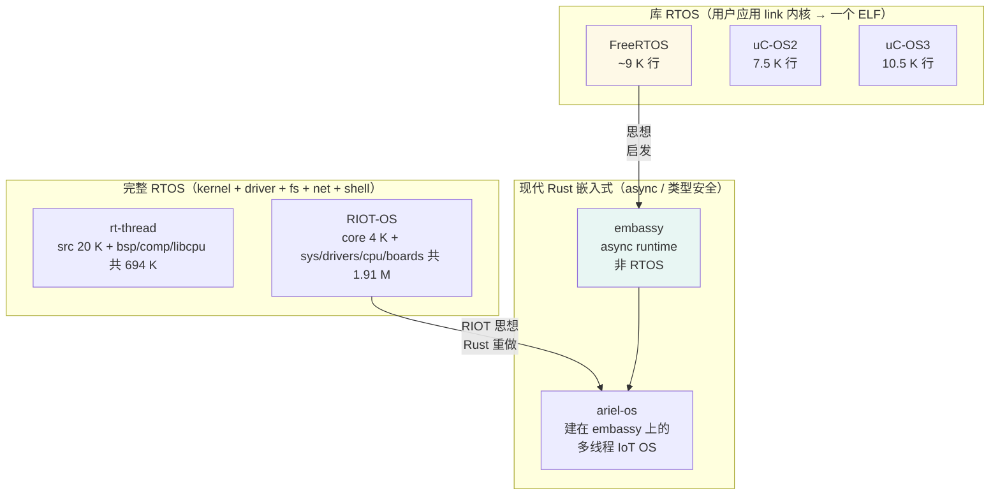
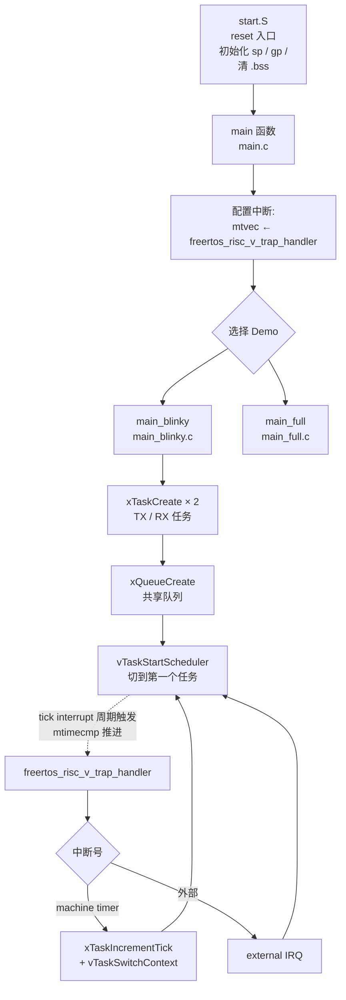
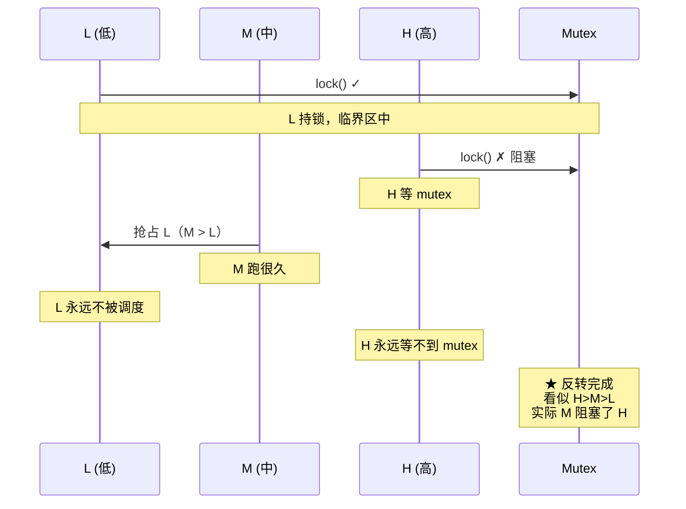
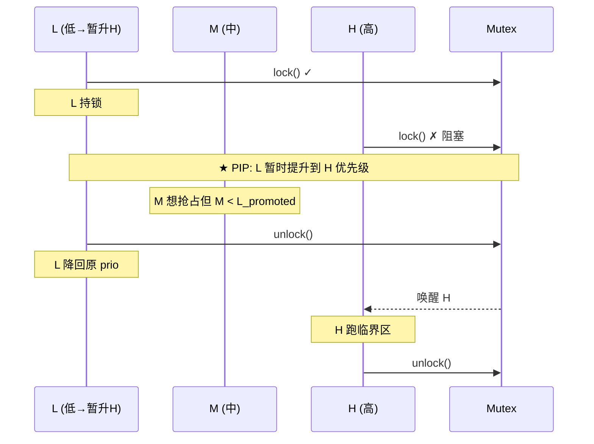
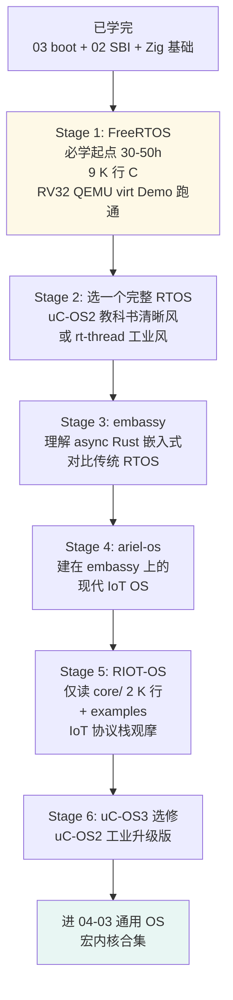

# 04-04 — RTOS 精读合集：FreeRTOS / rt-thread / uC-OS2 / uC-OS3 / embassy / ariel-os / RIOT-OS

> **核心定位 + 学习铺垫意义：**
> RTOS 比通用 OS 简单——**无 MMU 多空间、调度算法直白、代码量极小（FreeRTOS 仅 ~9 K 行 C）**——是学习 OS 内核的**最佳铺垫**。建议先把本篇 7 个 RTOS 项目至少读完前 2 个（FreeRTOS + uC-OS2 或 rt-thread），再进 [04-05](04-05-monolithic-kernels-walkthrough.md) 宏内核 / [04-06](04-06-component-kernels-walkthrough.md) 组件化内核 / [04-07](04-07-microkernels-walkthrough.md) 微内核。RTOS 把"调度 / 任务切换 / IPC / 中断处理"用最简形式呈现，理解之后再上 Linux 风格宏内核或 seL4 微内核就有 fundamentals 锚点；许多通用 OS 难点（如优先级反转 / 抢占点选择 / 中断 ↔ 任务上下文区分）其实在 RTOS 里就讲透了。
>
> **核心问题：**
> 1. 7 个 RTOS 项目代码组织 / 启动 / 调度器 / IPC 怎么实现？为什么 FreeRTOS 仅 ~9 K 行能在工业上广泛使用？
> 2. 优先级反转是什么？PIP（Priority Inheritance）/ PCP（Priority Ceiling）怎么解决？源码层各家怎么实现？
> 3. embassy / ariel-os 用 async Rust，与传统 RTOS（FreeRTOS / uC-OS）有什么本质区别？为什么 embassy 自称"obsoletes the need for a traditional RTOS"？
> 4. RIOT-OS 1.91 M 行 vs FreeRTOS Demo 树（kernel ~9 K 行）——同是 RTOS 为什么差 200 倍？
> 5. 如何选学习路径：什么时候选 FreeRTOS、什么时候选 RIOT、什么时候选 embassy？
>
>
> 与 [04-05](04-05-monolithic-kernels-walkthrough.md)（宏内核精读合集）平行——形式上都是"项目身份 → 目录结构 → 启动流程 → 核心子系统 → 数据结构 → 必读源文件"6 段精读，区别只是范式（宏内核 vs RTOS）。

---

## 0. RTOS 范式速览（对比通用 OS）

### 0.1 一句话定义（参见 [04-02 § 8](04-02-os-kernel-paradigms.md)）

**RTOS（Real-Time Operating System）** = 承诺**确定性时延**的 OS——关键外部事件（中断 / 超时 / IPC 唤醒）必须在硬截止时间内响应（μs 级）。代价：放弃通用 OS 的公平 / 吞吐优先策略，调度退化为最简的**优先级抢占（preemptive priority）**，并且通常**不用 MMU、单地址空间、单可执行映像**。

### 0.2 硬实时 vs 软实时 vs 一般实时

| 类别 | 错过截止时间的代价 | 例 |
|------|-------------------|-----|
| **Hard real-time（硬）** | 系统失败（人命关天 / 物理破坏）| 航天器姿态控制 / ABS 刹车 / 心脏起搏器 |
| **Firm real-time（紧）** | 该次结果作废，但系统继续运行 | 工业生产线 / 视频会议丢帧 |
| **Soft real-time（软）** | 性能下降 | 视频播放卡顿 / 网络游戏延迟 |

注意：**RTOS 是"工具"**，不是"硬实时系统"本身——把 FreeRTOS 跑在 Linux 用户态当然不再硬实时。硬实时需要"RTOS + 确定性硬件 + 关闭虚存抖动 + 中断关闭区段可计算 + 不调用阻塞 syscall"等一整套。

### 0.3 RTOS vs 通用 OS（差异速查表）

| 维度 | 通用 OS（Linux / Windows） | RTOS（FreeRTOS / RIOT / uC-OS）|
|------|---------------------------|----------------------------------|
| **调度** | 公平（CFS）/ 吞吐优先 | **严格优先级抢占（PRIO preemption）**——最高优先级 ready 任务一定在跑 |
| **同优先级** | 时间片轮转 | 默认 **FIFO**（先到先得），可选 **Round-Robin（RR）**（uC-OS3 / RIOT 都支持）|
| **MMU / 多地址空间** | 必须 | **多数无 MMU、单地址空间**（FreeRTOS / uC-OS2/3 / RIOT 默认；rt-thread `lwp` 可选用户态多空间）|
| **中断延迟** | 几十 μs 以上 | **< 1 μs**（FreeRTOS Cortex-M ~125 cycles ≈ 770 ns @ 162 MHz）|
| **kernel 代码体积** | 几十 MB（Linux 30 M+）| **数 KB-数十 KB**（FreeRTOS 内核 ~3 K 行 C，编译后 ~10 KB）|
| **任务概念** | 进程（独立地址空间）+ 线程 | **任务（task / thread）= 共享地址空间的执行流** ≈ 通用 OS 的内核态线程 |
| **任务数上限** | 几千-几万 | **数十-数百**（uC-OS2 ≤ 64，uC-OS3 / FreeRTOS 无硬限制但配置常见 ≤ 32）|
| **栈** | 每线程动态扩展 + guard page | **静态分配，每任务独立栈**（FreeRTOS `xTaskCreate` 时指定）|
| **锁** | mutex / spinlock / rwlock / RCU 多种复杂 | mutex（含 PIP）/ semaphore / event group——简单 |
| **优先级反转** | 不严格处理（Linux 用 RT_MUTEX 才有 PIP）| **必须处理**（PIP / PCP 协议是 RTOS 标配）|
| **timer** | hrtimer + jiffies 双层 | 单一 tick（典型 1 ms）+ 软 timer 链表 |
| **驱动模型** | 复杂分层（bus / class / device / driver / cgroup）| **直接函数调用**（FreeRTOS）或 **DM 简化版**（rt-thread）|
| **fs / net / 显示** | 内核自带 + LSM | **可选模块**——RIOT / rt-thread 自带，FreeRTOS 配 FreeRTOS+TCP / FreeRTOS+FAT |

### 0.4 库 RTOS / 完整 RTOS / 异步 runtime / 现代 OS 风（4 种打包方式）

| 打包方式 | 特征 | 代表 |
|----------|------|------|
| **库 RTOS（Library RTOS）** | 用户应用 link RTOS 静态库，编出**一个 ELF / HEX**烧到 MCU；RTOS 是用户应用的"内嵌内核" | FreeRTOS / uC-OS2 / uC-OS3 / Zephyr |
| **完整 RTOS（Full-stack RTOS）** | 像通用 OS 一样有 kernel / driver / fs / net / shell / pkg manager 全套 | rt-thread / RIOT-OS / Zephyr |
| **async runtime** | 不是 RTOS——用 Rust async/await 编译期生成状态机 + executor 调度，单栈协程化 | embassy |
| **现代 OS 风（Modern Rust IoT OS）** | 在 async runtime 之上叠加可抢占多线程、网络栈、密钥管理、build system | ariel-os |

注意：**Zephyr 不在本笔记 7 项目内**（本地未克隆——见 `notes/00-07-os-evolution.md`），但概念上同 rt-thread / RIOT 同类，是 Linux 基金会托管的当代主流。

### 0.5 7 项目对比表

| # | 项目 | 语言 | 起源年 | 维护者 | 代码量（cloc）| 范式 | 多核 | async | RISC-V | 工业级 |
|---|------|------|--------|--------|--------------|------|------|-------|--------|--------|
| 1 | **FreeRTOS** | C | 2003 | Real Time Engineers / AWS | 内核 ~9 K | 库 RTOS | ✅（SMP 分支）| ❌ | ✅（QEMU virt / SiFive E）| ★★★★★ |
| 2 | **rt-thread** | C | 2006 | 朱天龙 / 中国社区 | 总 694 K（src 20 K）| 完整 RTOS | ✅（SMP 调度器分文件）| ❌（C 风格）| ✅（rv64 / virt64 / t-head）| ★★★★ |
| 3 | **uC-OS2** | C | 1992 | Jean J. Labrosse / Weston Embedded | Source 7.5 K | 库 RTOS（教学）| ❌（uniprocessor）| ❌ | 端口需自找 | ★★★ |
| 4 | **uC-OS3** | C | 2009 | 同 uC-OS2 / Silicon Labs | Source 10.5 K | 库 RTOS | ❌ | ❌ | 端口需自找 | ★★★ |
| 5 | **embassy** | Rust | 2020 | embassy-rs 社区 | 总 ~300 K（含 HAL）| async runtime | 部分 | ✅（核心）| ✅（embassy-rp / ch32-hal）| ★★★（增长中）|
| 6 | **ariel-os** | Rust | 2024 | FU Berlin + Inria + Kaspar Schleiser | 总 27 K | 现代 Rust IoT OS | ✅（rp / esp32s3）| ✅（基于 embassy）| ✅（Cortex-M / RV / Xtensa）| ★★（学术起步）|
| 7 | **RIOT-OS** | C | 2013 | FU Berlin + Inria | 总 1.91 M | 完整 RTOS | ❌（per-core 单核为主）| ❌（C 风格）| ✅（fe310 / gd32v / esp32-c3）| ★★★★（学术 + 工业）|



### 0.6 RTOS 学习铺垫意义（为什么先学 RTOS 再学 Linux 风内核）

| 通用 OS 难点 | RTOS 怎么"用最简方式"教会 |
|-------------|--------------------------|
| **调度器** | RTOS = 严格 PRIO 抢占（O(1) 位图查最高优先级），无 CFS / red-black tree / nice / cgroup |
| **任务切换 / 上下文** | RTOS port 层（~200 行汇编）即把 PendSV / mtvec 用法讲透 |
| **中断与任务的边界** | RTOS 把"中断上下文 / 任务上下文"两类区分得最清晰（FromISR API 后缀）|
| **同步原语** | mutex / sem / queue 三种就够，无 RCU / lockless / wait/wake 那些 |
| **优先级反转** | 在通用 OS 里 PI-mutex 是"特殊补丁"，RTOS 里是"必备组件"，源码 50 行讲透 PIP |
| **内存管理** | RTOS 多用 simple heap / fixed-block pool，无 buddy / slab / RCU / cgroup memcg |
| **驱动框架** | RTOS 直接函数调用（FreeRTOS）或单层注册（rt-thread DM），无 platform device tree / sysfs / udev 链 |
| **boot 链** | RTOS reset → vector → main → vTaskStartScheduler 一条直线，无 SBI / SMP boot / DT 解析 / VDSO |

学完 RTOS 再读 Linux / xv6，"调度 / 中断 / 同步"三大难点就只剩**复杂度叠加**而非概念重学。

---

## 1. FreeRTOS 精读（最广泛使用）

> **本地路径：** `/home/heke/tgln/stage2/material/rtos/FreeRTOS`
>
> **顶层结构：** `FreeRTOS/`（kernel + 100+ Demo）+ `FreeRTOS-Plus/`（TCP / FAT / coreMQTT / coreHTTP 扩展）
>
> **重要提示：** 本地 FreeRTOS 仓库是上游 `FreeRTOS/FreeRTOS` 主仓，kernel 通过 git submodule 引用 `FreeRTOS-Kernel`（`FreeRTOS/Source/` 是空目录——`.gitmodules:1-3`），所以本节大量基于 README + Demo 树（特别是 RISC-V_RV32_QEMU_VIRT_GCC）+ 公开知识。要看 kernel 源码请 `cd FreeRTOS/Source && git submodule update --init`，下游会拉到 `tasks.c / queue.c / timers.c / list.c / event_groups.c / stream_buffer.c` 共 8 个 .c。

### 1.1 项目身份

- **创始人：** Richard Barry（Real Time Engineers Ltd）
- **首发：** 2003
- **当前归属：** 2017 年起 Amazon Web Services（AWS）接管为主要维护方，开源 MIT 协议
- **目标：** **极小、可移植、广泛用于 MCU 的内核**
- **主页：** https://www.freertos.org/
- **Git：** https://github.com/FreeRTOS/FreeRTOS（主仓 Demo + 文档）/ https://github.com/FreeRTOS/FreeRTOS-Kernel（仅内核）
- **行业地位：** 工业 RTOS 装机量全球第一（占 MCU 市场 RTOS 份额估测 50%+）；AWS IoT Greengrass / Matter 默认底层

### 1.2 顶层目录速查

```
FreeRTOS/              ← 本地路径
├── FreeRTOS/          ← 主仓主目录
│   ├── Demo/          ← 100+ Demo（按 MCU + IDE 命名）
│   │   ├── RISC-V_RV32_QEMU_VIRT_GCC/  ★ RISC-V 起手
│   │   ├── RISC-V_RV32_SiFive_HiFive1-RevB_IAR/
│   │   ├── RISC-V_RV64_PolarFire_SoftConsole/
│   │   ├── CORTEX_M3_STM32F103/
│   │   └── ... (100+ 板子)
│   ├── License/       ← MIT 等
│   ├── Source/        ← submodule → FreeRTOS-Kernel ★ 主要内核源
│   └── Test/          ← CMock 单元测试
├── FreeRTOS-Plus/
│   ├── Source/        ← TCP / FAT / coreMQTT / coreHTTP 等
│   └── Demo/
├── README.md
└── manifest.yml
```

`README.md:39-46` 明确说明 `FreeRTOS/Source` 是 `FreeRTOS-Kernel` submodule。

### 1.3 核心源文件（kernel ~9 K 行 C，submodule 内）

| 文件 | 估行数 | 角色 |
|------|--------|------|
| `tasks.c` | ~5500 | 任务管理 + 调度器主体（创建 / 删除 / 挂起 / 恢复 / `vTaskSwitchContext` / 时基 tick）|
| `queue.c` | ~3000 | 队列（FIFO 消息） + 信号量（绑定到队列实现） + mutex + 递归 mutex |
| `timers.c` | ~1100 | 软定时器（一次性 / 周期 / daemon task）|
| `list.c` | ~440 | 双向链表（`xList` + `xListItem`，O(1) 调度的核心数据结构）|
| `event_groups.c` | ~700 | 事件组（24 bit set/wait/sync）|
| `stream_buffer.c` | ~1200 | 流缓冲（无锁 SPSC 字节流）|
| `croutine.c` | ~370 | 协程（已不推荐，仅遗留）|
| `portable/<arch>/<compiler>/port.c` | ~300-700 | 架构相关（context switch / tick interrupt / mtvec / PendSV）|
| `portable/MemMang/heap_*.c` | ~200-400 | 5 种分配器（heap_1..5）|

**总计：** kernel 主体 ~12 K 行带注释，去除注释和空行约 **9 K 行 C 实代码**——这是工业界津津乐道的"miniature kernel"传奇。

### 1.4 启动流程（RISC-V QEMU virt 视角）

本地 `FreeRTOS/Demo/RISC-V_RV32_QEMU_VIRT_GCC/` 是 RV32 起手好选择。



`main.c:139` 显式 `vTaskStartScheduler();`——这是 FreeRTOS 启动的"必念咒语"。该函数最终调用 port 层 `xPortStartScheduler()`（`portable/GCC/RISC-V/port.c`），后者：

1. 设置 `mtimecmp` 为初始值（让 timer 立即触发）
2. 写 `mstatus.MIE = 1`（开机器中断）
3. 跳到第一个最高优先级任务的栈顶 `prvPortStartFirstTask()`（一段汇编 mret 切到 user 上下文）

这条链条 **从 reset 到第一条用户任务指令只有 ~150 行汇编 + ~50 行 C**，没有任何 SBI / DT / SMP boot / VDSO 复杂度——这就是 RTOS 的极简之美。

### 1.5 优先级抢占调度（O(1) 位图）

FreeRTOS 调度器特征（`tasks.c::vTaskSwitchContext`）：
- **严格抢占（preemptive priority）**：当 ISR 唤醒比当前任务高优先级的任务，ISR 退出时立即切（`portYIELD_FROM_ISR`）
- **同优先级 FIFO 或 RR**：`configUSE_TIME_SLICING == 1` 时同优先级 RR
- **优先级位图：** `pxReadyTasksLists[ configMAX_PRIORITIES ]` 每个优先级一条链表 + `uxTopReadyPriority` 位图——查最高优先级用 CLZ 指令 O(1)
- **优先级数：** 配置项 `configMAX_PRIORITIES`（典型 5~32）；本地 RV32 QEMU virt Demo 设为 `9`（`FreeRTOSConfig.h:74 #define configMAX_PRIORITIES (9UL)`）

调度的所有触发点：
1. **时间片到（tick）**：`xTaskIncrementTick()` 设 `xYieldPending = pdTRUE`，trap handler 退出前检查
2. **任务主动 yield**：`taskYIELD()` → `portYIELD()`（RV 上是 `ecall`，Cortex-M 上 pend SVCall / PendSV）
3. **任务阻塞**：`xQueueReceive()` / `vTaskDelay()` / `vTaskSuspend()` 后立即调度
4. **ISR 唤醒高优先级任务**：`xQueueSendFromISR()` 把高优先级任务挪到 ready 队列，`portYIELD_FROM_ISR()` 设 PendSV/yield 标志

### 1.6 IPC 原语（队列 / 信号量 / mutex / event group）

FreeRTOS 设计哲学：**所有阻塞 IPC 用 queue 实现**。

| 原语 | 实现 |
|------|------|
| **Queue** | `queue.c::xQueueCreate` 分配 `QueueHandle_t` + 数据 buffer + 两条等待链（send / receive 阻塞）|
| **Counting semaphore** | `xSemaphoreCreateCounting` = queue 长度 N 但 item size 0（计数靠队列填充度）|
| **Binary semaphore** | counting sem 长度 1 |
| **Mutex** | binary sem + holder 字段（记录持有任务）+ **优先级继承（PIP）** |
| **Recursive mutex** | mutex + 递归计数 |
| **Event group** | 独立实现（24-bit 标志 + wait_for_all / wait_for_any 语义）|
| **Stream buffer** | SPSC 无锁字节流（用于 ISR ↔ task）|

**优先级继承（PIP）实现要点：**
- `xQueueGiveMutexRecursive` / `xSemaphoreTake` 拿不到时检查持有者优先级
- 若 holder 优先级 < 当前任务优先级 → **临时把 holder 提升到当前任务优先级**
- holder 释放 mutex 时降回 base priority
- 不防嵌套（"chained PI"），只防一层；不实现 PCP

源码引用：`tasks.c::xTaskPriorityInherit` / `xTaskPriorityDisinherit` / `xTaskPriorityDisinheritAfterTimeout`（submodule，本地未拉取，但 GitHub 上可查；行号约 5800-6100）。

### 1.7 移植到新架构（portable/）

`FreeRTOS-Kernel/portable/` 下 ~30 个架构 + 编译器组合：

```
portable/
├── GCC/RISC-V/        ← RV32 / RV64
├── GCC/ARM_CM0/       ← Cortex-M0
├── GCC/ARM_CM3/       ← Cortex-M3
├── GCC/ARM_CM4F/      ← Cortex-M4 with FPU
├── GCC/ARM_CM7/       ← Cortex-M7
├── GCC/ARM_CRx_*/     ← Cortex-R / Cortex-A
├── GCC/MicroBlaze*/
├── GCC/PowerPC_*/
├── GCC/MSP430*/
├── GCC/AVR*/
├── GCC/MIPS_*/
├── IAR/...
├── Keil/...            ← Keil 已迁移到 GCC 复用
└── MemMang/heap_1..5.c
```

每个 port 提供 3 类东西：
1. **`portmacro.h`**：宏 `portYIELD()`、`portENTER_CRITICAL()`、`portDISABLE_INTERRUPTS()`、`portTICK_TYPE_IS_ATOMIC` 等
2. **`port.c`**：函数 `xPortStartScheduler()`、`vPortInitialiseStack()`、tick 中断处理
3. **`portASM.S`**：上下文切换汇编（保存 caller-saved 寄存器到任务栈，切 `pxCurrentTCB`，恢复目标任务寄存器）

**RISC-V port 特殊点（GCC/RISC-V）：**
- `portasmHANDLE_INTERRUPT` 是个 weak symbol，让用户挂载自己的外设中断分发
- `mtvec` 模式选 vectored 还是 direct，看 `mainVECTOR_MODE_DIRECT` 配置（`main.c:70`）
- 浮点保存可选（看 `__riscv_flen`）

### 1.8 关键源码引用速查（.gitmodules + Demo + Config）

- `FreeRTOS/.gitmodules:1-3` —— FreeRTOS-Kernel 是 submodule
- `FreeRTOS/FreeRTOS/Demo/RISC-V_RV32_QEMU_VIRT_GCC/main.c:139` —— `vTaskStartScheduler()` 调用点
- `FreeRTOS/FreeRTOS/Demo/RISC-V_RV32_QEMU_VIRT_GCC/main_blinky.c:91-139` —— 创建 send/recv 任务 + queue + 启动调度器
- `FreeRTOS/FreeRTOS/Demo/RISC-V_RV32_QEMU_VIRT_GCC/FreeRTOSConfig.h:49` —— `configUSE_PREEMPTION 1`
- `FreeRTOS/FreeRTOS/Demo/RISC-V_RV32_QEMU_VIRT_GCC/FreeRTOSConfig.h:66` —— `configUSE_MUTEXES 1`
- `FreeRTOS/FreeRTOS/Demo/RISC-V_RV32_QEMU_VIRT_GCC/FreeRTOSConfig.h:74` —— `configMAX_PRIORITIES 9UL`

### 1.9 适用场景 + 局限

**适用：**
- MCU 上的工业控制 / 传感器节点 / 智能家居
- AWS IoT Greengrass / Matter / 蓝牙 Mesh / LoRaWAN
- 配套库齐全（FreeRTOS+TCP / FreeRTOS+FAT / coreMQTT / coreHTTP / coreJSON）

**局限：**
- **不是完整 RTOS**——没有自带 fs / shell / pkg 系统，要自己拼
- 无 MMU 多空间（FreeRTOS-MPU 仅 ARMv7-M MPU 支持）
- 调度器极简（不支持 EDF / RM 这类 deadline-based 算法）
- C 代码风格保守（避免 C99 一些特性以兼容老编译器）

---

## 2. rt-thread 精读（国产工业 RTOS）

> **本地路径：** `/home/heke/tgln/stage2/material/rtos/rt-thread`
>
> **整体规模：** **总 694 K 行** cloc 统计（含 bsp / components / libcpu / 文档），单**纯内核 src/ 目录 20 K 行 C** ——比 FreeRTOS 多 ~1 倍但比 RIOT 少得多

### 2.1 项目身份

- **创始人：** 朱天龙（Bernard Xiong）
- **首发：** 2006
- **维护：** 上海睿赛德电子科技 + 中国开源社区（GitHub + Gitee 双仓）
- **特征：** **国产 RTOS 工业代表 + Linux 风格设计 + 设备模型 + 软件包生态**
- **License：** Apache 2.0
- **Git：** https://github.com/RT-Thread/rt-thread / https://gitee.com/rtthread/rt-thread
- **特色：** 软件包生态 **450+ 包**（lwIP / mbedTLS / Lua / MicroPython / OpenCV-tiny 等都能 `pkg install`）；BSP **110+ 块板子**（`rt-thread/bsp/`）

### 2.2 顶层目录（README:75-86 给的官方表）

```
rt-thread/
├── src/              ← 内核源（20 K 行 C）★ 本笔记重点
├── include/          ← 内核头文件
├── libcpu/           ← CPU 移植（aarch64 / arm / risc-v / mips / ia32 / xtensa / 19 个）
├── components/       ← 组件层（dfs / drivers / finsh / lwp / mm / net / libc / utilities / rust）
├── bsp/              ← Board Support Package（110+ 板子）
├── examples/         ← 应用示例
├── documentation/    ← 文档
├── tools/            ← scons 构建脚本
├── Kconfig           ← 顶层 Kconfig
└── ...
```

`bsp/` 目录列举（`ls`）：CME_M7 / ESP32_C3 / Infineon / Vango / acm32 / airm2m / allwinner / amebaz / apm32 / apollo2 / asm9260t / at32 / at91 / avr32 / beaglebone / bf533 / bluetrum / ... 共 110 个目录——含 stm32（占大头）+ ARM Cortex-A 系列 + RISC-V 平头哥 / 兆易 GD32V / 西门子等。

### 2.3 核心源文件（src/，20 K 行 C，按行号引用）

```
src/
├── scheduler_up.c        ← 731 行（单核调度器主体）★
├── scheduler_mp.c        ← 1588 行（多核 SMP 调度器）
├── scheduler_comm.c      ← 527 行（共用数据结构）
├── thread.c              ← 1231 行（线程管理）★
├── ipc.c                 ← 4040 行（IPC 全家桶：sem / mutex / mailbox / msgq / event / signal）★
├── timer.c               ← 871 行（软定时器 + tick）
├── clock.c               ← 261 行（系统时钟）
├── irq.c                 ← 157 行（中断管理）
├── object.c              ← 814 行（"对象"基类——RT-Thread 的 OO 风格）★
├── components.c          ← 291 行（rtthread_startup / 启动入口）★
├── idle.c                ← 253 行（idle 线程 + tick hook）
├── kservice.c            ← 1421 行（kprintf / list / 工具）
├── mem.c                 ← 667 行（small heap）
├── memheap.c             ← 998 行（multi-heap）
├── mempool.c             ← 412 行（fixed-block pool）
├── slab.c                ← 856 行（slab allocator——Linux 风格）
├── signal.c              ← 683 行（信号 / kill / sigaction）
├── cpu_up.c              ← 126 行（uniprocessor cpu hook）
├── cpu_mp.c              ← 276 行（SMP cpu hook）
├── defunct.c             ← 178 行（zombie 线程清理）
└── klibc/                ← 内核 C 库子集
```

**单文件最大 4040 行的 `ipc.c`** 是工业级标志——把 sem / mutex / mailbox / msg queue / event / signal 6 种同步原语合并在一个文件里，是 Linux Kernel 风格的"模块整合"思路。

### 2.4 启动流程（rtthread_startup → board_init → main）

`src/components.c:243-289` 给出**严格的启动序列**（注意中断关闭 / 打开的时机）：

```c
int rtthread_startup(void) {                    // components.c:243
    rt_hw_local_irq_disable();                  // 关中断
    rt_hw_board_init();                         // BSP 板级初始化（DDR / 时钟 / UART）
    rt_show_version();                          // 打印 RT-Thread 版本（"\ |/" logo）
    rt_system_timer_init();                     // 软定时器 init
    rt_system_scheduler_init();                 // 调度器 init（pri 链表清空）
    rt_application_init();                      // 创建 main_thread（执行 user main）
    rt_system_timer_thread_init();              // 软定时器线程
    rt_thread_idle_init();                      // idle 线程
    rt_thread_defunct_init();                   // defunct 线程
    rt_system_scheduler_start();                // 启动调度器（不返回）
    return 0;                                   // 永远到不了
}
```

`scheduler_up.c:245-265` —— `rt_system_scheduler_start()`：
```c
void rt_system_scheduler_start(void) {
    struct rt_thread *to_thread;
    rt_ubase_t highest_ready_priority;

    to_thread = _scheduler_get_highest_priority_thread(&highest_ready_priority);
    rt_cpu_self()->current_thread = to_thread;
    CLR_CRITICAL_SWITCH_FLAG();
    rt_sched_remove_thread(to_thread);
    RT_SCHED_CTX(to_thread).stat = RT_THREAD_RUNNING;
    rt_hw_context_switch_to((rt_uintptr_t)&to_thread->sp);   // 不返回
}
```

`rt_hw_context_switch_to()` 在 `libcpu/<arch>/context_*.S` 里，核心思想：从 0 寄存器状态恢复到任务初始栈帧。

### 2.5 调度器（scheduler_up.c::rt_schedule，单核）

`scheduler_up.c:281-360+` —— `rt_schedule()` 是抢占的**唯一入口**（与 FreeRTOS 设计一致）：

```c
void rt_schedule(void) {
    /* disable interrupt */
    level = rt_hw_interrupt_disable();
    curr_thread = rt_thread_self();

    if (rt_scheduler_lock_nest == 0) {                    // 调度器没被锁
        if (rt_thread_ready_priority_group != 0) {        // 有 ready 任务
            to_thread = _scheduler_get_highest_priority_thread(&highest_ready_priority);

            // 当前任务优先级更高 → 继续跑
            if (RT_SCHED_PRIV(curr_thread).current_priority < highest_ready_priority) {
                to_thread = curr_thread;
            }
            // 同优先级且当前任务没主动 yield → 继续跑
            else if (... == highest_ready_priority &&
                     (... & RT_THREAD_STAT_YIELD_MASK) == 0) {
                to_thread = curr_thread;
            }
            else {
                need_insert_from_thread = 1;              // 需切，把当前任务回插 ready
            }

            if (to_thread != curr_thread) {
                /* 真正切换 */
                rt_hw_context_switch(...);
            }
        }
    }
}
```

调度策略与 FreeRTOS 高度同构：
- **优先级位图**：`rt_thread_ready_priority_group`（32 bit）+ `rt_thread_priority_table[]`
- **同优先级**：FIFO + 可选 time slice（`RT_USING_TIMESLICE`）
- **抢占点**：tick / yield / mutex post / sem post / queue send / signal wake
- **`rt_scheduler_lock_nest`**：锁住调度器（嵌套计数）

### 2.6 IPC（ipc.c 4040 行的 6 种原语 + PIP）

`ipc.c` 集中实现：

| 原语 | 关键函数 | 行号 |
|------|---------|------|
| **semaphore** | `rt_sem_create / rt_sem_take / rt_sem_release` | 早段 |
| **mutex** | `rt_mutex_create / rt_mutex_take / rt_mutex_release / rt_mutex_setprioceiling` | 中段 1152-1718 |
| **event** | `rt_event_create / rt_event_send / rt_event_recv` | |
| **mailbox** | `rt_mb_create / rt_mb_send / rt_mb_recv` | |
| **msgqueue** | `rt_mq_create / rt_mq_send / rt_mq_recv` | |
| **completion** | 简化版 binary sem | |

**优先级继承（PIP）实现** —— `ipc.c:846-911`：

```c
/* 收集 thread 持有的所有 mutex 中最高优先级（含 ceiling） */
rt_inline rt_uint8_t _thread_get_mutex_priority(struct rt_thread* thread) {
    rt_uint8_t priority = rt_sched_thread_get_init_prio(thread);  // base prio
    rt_list_for_each_entry(mutex, &(thread->taken_object_list), taken_list) {
        rt_uint8_t mutex_prio = mutex->priority;
        // 至少为 ceiling priority（PCP 风格）
        mutex_prio = mutex_prio < mutex->ceiling_priority ? mutex_prio : mutex->ceiling_priority;
        if (priority > mutex_prio)                                // 数字越小优先级越高
            priority = mutex_prio;
    }
    return priority;
}

/* 调整 thread 当前优先级 + 链式传播给等待该 thread 的其他 thread */
rt_inline void _thread_update_priority(struct rt_thread *thread, rt_uint8_t priority, ...) {
    rt_sched_thread_change_priority(thread, priority);
    /* 若 thread 也阻塞在某 mutex 上，链式更新 owner 优先级 */
    while (thread is suspended on a mutex) {
        pending_mutex = ...;
        _mutex_update_priority(pending_mutex);
        ... = _thread_get_mutex_priority(pending_mutex->owner);
        rt_sched_thread_change_priority(pending_mutex->owner, ...);
    }
}
```

**亮点：** rt-thread 同时实现 **PIP（Priority Inheritance）+ PCP（Priority Ceiling）** 两个协议（FreeRTOS 仅 PIP），`ipc.c:1152-1185 rt_mutex_setprioceiling()` 暴露给应用——这是工业 RTOS 标准。

### 2.7 设备驱动框架（components/drivers/）

rt-thread 设备驱动框架 = **Linux 设备模型简化版**：

```
components/drivers/
├── core/              ← device 注册框架
├── serial/            ← UART 子系统（rt_serial_device）
├── spi/               ← SPI bus / device
├── i2c/               ← I2C bus / device
├── usb/               ← USB host / device
├── sdio/              ← SD/MMC
├── pin/               ← GPIO pinctrl
├── ipc/               ← workqueue / waitqueue
├── wlan/              ← Wi-Fi 框架
├── audio/             ← Audio framework
└── ...（共数十类）
```

每个驱动注册 `struct rt_device` 进系统，通过 `rt_device_find("uart0") / rt_device_open / rt_device_read / write` 统一访问——**和 Linux `/dev` 用法体验非常接近**。

### 2.8 网络栈集成（lwip）

`components/net/lwip/` —— 集成第三方 lwIP 协议栈（按 Kconfig 选择 lwIP 1.4 / 2.0 / 2.1）+ `components/net/sal/` Socket 抽象层（让应用用 BSD socket API 风格不管底层 lwIP 还是其他栈）。

### 2.9 文件系统（DFS = Device File System）

`components/dfs/` —— Linux VFS 风格：
- `dfs_v1/` `dfs_v2/` 两代实现
- 后端文件系统：FAT（fatfs）、ext2/3/4（lwext4）、yaffs / jffs2、romfs、devfs、procfs、ramfs
- 应用通过 `open / read / write / close / ioctl` 用，和 Linux 一致

### 2.10 工业部署案例

- **车联网**：吉利 / 长城等车企 T-Box（高级仪表盘 / 网联模块）
- **工业控制**：DCS / PLC / 传感器节点
- **智能家居**：小米 / 涂鸦的部分模组
- **航天**：卫星载荷子系统（部分研究院型号）
- **OS 大赛**：rt-thread 多次作为竞赛底座

### 2.11 关键源码引用清单

- `src/components.c:243-289` —— `rtthread_startup`
- `src/components.c:91-110` —— `rt_components_board_init / rt_components_init`（INIT_BOARD_EXPORT 风格的注册式初始化）
- `src/scheduler_up.c:245-265` —— `rt_system_scheduler_start`
- `src/scheduler_up.c:281-360+` —— `rt_schedule`（核心调度逻辑）
- `src/thread.c:346-375` —— `rt_thread_init`
- `src/ipc.c:846-865` —— `_thread_get_mutex_priority`（PIP 核心）
- `src/ipc.c:868-915` —— `_thread_update_priority`（PIP 链式传播）
- `src/ipc.c:1152-1185` —— `rt_mutex_setprioceiling`（PCP 入口）
- `src/ipc.c:1539-1543` —— `rt_mutex_take`
- `src/ipc.c:1591-1718` —— `rt_mutex_release`
- `libcpu/risc-v/common/context_gcc.S` —— RISC-V 上下文切换汇编
- `libcpu/risc-v/common/trap_common.c` —— RISC-V trap 分发

---

## 3. uC-OS2 精读（经典教学 RTOS）

> **本地路径：** `/home/heke/tgln/stage2/material/rtos/uC-OS2`
>
> **代码量：** Source/ 目录 **7.5 K 行 C 实代码**（cloc：12 .c + 3 .h，含注释/空行 11.7 K 行）
>
> **关键文件：** `Source/os_core.c (2153 行) / os_task.c (1386 行) / os_q.c (964 行) / os_mutex.c (818 行) / os_sem.c (679 行)`

### 3.1 项目身份

- **创始人：** Jean J. Labrosse（前 Micrium / Silicon Labs）
- **首发：** 1992（书《MicroC/OS-II: The Real-Time Kernel》同期）
- **当前归属：** Weston Embedded Solutions（Micrium 老员工创立的官方守护方）
- **特征：** **教科书级清晰代码 + 安全关键认证（DO-178B / IEC 61508）**
- **License：** Apache 2.0（早期 Micrium 时商业 + 个人非商业免费，2020 年 Weston 把全部 µC/OS 系列开源 Apache 2.0）
- **Git：** https://github.com/weston-embedded/uC-OS2

### 3.2 顶层目录

```
uC-OS2/
├── Source/        ← 内核源（11 .c + 3 .h，7.5 K 行）★
├── Cfg/           ← 默认配置模板（os_cfg.h.template / os_cpu_a.asm.template）
├── Ports/         ← 各 CPU 移植（ARM Cortex-M / x86 / PowerPC / ...）
├── TLS/           ← Thread-Local Storage 扩展
├── Trace/         ← Tracealyzer 集成
├── LICENSE / NOTICE
└── README.rst
```

注意：与 FreeRTOS 不同——**移植不放在内核目录里，而单独 Ports/ 目录**，每个 port 三件套：`os_cpu.h` + `os_cpu_a.asm` + `os_cpu_c.c`。

### 3.3 核心源文件

| 文件 | 行数 | 角色 |
|------|------|------|
| `os_core.c` | 2153 | OSInit / OSStart / OSSched / OSTimeTick / 优先级位图 ★ |
| `os_task.c` | 1386 | OSTaskCreate / OSTaskDel / OSTaskSuspend / OSTaskResume |
| `os_flag.c` | 1286 | Event Flag（事件标志组）|
| `os_tmr.c` | 1140 | 软定时器 |
| `os_q.c` | 964 | Message Queue |
| `os_mutex.c` | 818 | Mutex（含 PIP）★ |
| `os_mbox.c` | 708 | Mailbox |
| `os_sem.c` | 679 | Semaphore |
| `os_mem.c` | 489 | Fixed-block memory partition（不是 heap，是 pool）|
| `os_dbg_r.c` | 342 | Debug 信息（变量大小 / 表格大小）|
| `os_time.c` | 280 | OSTimeDly / OSTimeDlyHMSM / OSTimeGet |
| `ucos_ii.c` | 39 | 顶层"include all 单 .c 编译"汇总文件 |

### 3.4 启动流程

```c
// User main:
int main(void) {
    OSInit();                                   // os_core.c:582
    OSTaskCreate(MyTask, ..., MyStack, prio);
    OSStart();                                  // os_core.c:869 (不返回)
}
```

`os_core.c:869-879` —— `OSStart()`：
```c
void  OSStart (void) {
    if (OSRunning == OS_FALSE) {
        OS_SchedNew();                          // 选最高优先级 ready 任务
        OSPrioCur     = OSPrioHighRdy;
        OSTCBHighRdy  = OSTCBPrioTbl[OSPrioHighRdy];
        OSTCBCur      = OSTCBHighRdy;
        OSStartHighRdy();                       // ★ 这是 port 层汇编（os_cpu_a.asm）
                                                //   恢复任务初始栈帧 + 跳到任务入口
                                                //   不返回
    }
}
```

### 3.5 调度器（O(1) 优先级抢占，最多 64 优先级）

uC-OS2 设计上 **最多 64 个优先级，每个优先级 1 个任务**——这是教学清晰度的关键设计：**任务 ID = 优先级**。

`Source/ucos_ii.h:81-89` 计算调度表大小：
```c
#define  OS_TASK_STAT_PRIO  (OS_LOWEST_PRIO - 1u)
#define  OS_TASK_IDLE_PRIO  (OS_LOWEST_PRIO)
#if OS_LOWEST_PRIO <= 63u
#define  OS_EVENT_TBL_SIZE ((OS_LOWEST_PRIO) / 8u + 1u)
#define  OS_RDY_TBL_SIZE   ((OS_LOWEST_PRIO) / 8u + 1u)
#else
#define  OS_EVENT_TBL_SIZE ((OS_LOWEST_PRIO) / 16u + 1u)
#define  OS_RDY_TBL_SIZE   ((OS_LOWEST_PRIO) / 16u + 1u)
#endif
OS_EXT  OS_PRIO  OSRdyGrp;                   // ucos_ii.h:718（8 bit 组掩码）
OS_EXT  OS_PRIO  OSRdyTbl[OS_RDY_TBL_SIZE];  // ucos_ii.h:719（每行 8 bit）
```

**最高优先级查找** —— 经典 8×8 位图（two-level bitmap）：
1. `OSRdyGrp`：8 bit，表示 8 组中哪几组有 ready 任务
2. `OSRdyTbl[8]`：8 字节，每字节代表一组的 8 个优先级
3. **查表**：`y = OSUnMapTbl[OSRdyGrp]; x = OSUnMapTbl[OSRdyTbl[y]]; prio = (y << 3) + x`
4. `OSUnMapTbl[256]` 在 `os_core.c` 是预置常量表——**无需 CLZ 指令也能 O(1) 查最高优先级位**

这是 1992 年的发明在 8 bit MCU 上 O(1) 查最高优先级位的经典方案，至今仍在嵌入式教科书里出现。

### 3.6 优先级反转处理（PIP）

`os_mutex.c` 实现 PIP：
- `OSMutexCreate(prio, ...)` 创建时**预留一个比 mutex 用户更高的"优先级 ceiling"**——这是 PCP 风格但实际只用作 PIP
- `OSMutexPend()` 拿不到时检查 holder 优先级，若 holder 比当前 task 低则提升 holder 到当前 task 的 prio（暂时占用 ceiling 优先级槽位）
- `OSMutexPost()` 释放时降回 base priority

注意：uC-OS2 的限制——**任务 ID = 优先级，所以"提升优先级"实际是切换到 ceiling 槽位**，需要 ceiling 是**未被任何任务占用的优先级**。这是 uC-OS3 解决的痛点。

### 3.7 与 FreeRTOS 对比

| 维度 | uC-OS2 | FreeRTOS |
|------|--------|----------|
| **任务 vs 优先级** | 1:1（每优先级 1 任务）| N:1（多任务可同优先级 RR）|
| **优先级数** | 最多 64 | `configMAX_PRIORITIES`（无硬上限）|
| **任务 ID** | = 优先级 | = TaskHandle_t（指针）|
| **API 风格** | OSXxx（驼峰）| xXxx（匈牙利前缀 v/x/p/l 表返回类型）|
| **代码风格** | 大量教科书注释 | 工业码风格（注释偏少）|
| **License** | Apache 2.0（2020 起）| MIT |
| **教学** | 配套教科书《µC/OS-II: The Real-Time Kernel》| FreeRTOS 官方 PDF + Books |
| **市场** | 安全关键（医疗 / 航天 / 工业）| MCU / IoT 通用 |

---

## 4. uC-OS3 精读（uC-OS2 继任）

> **本地路径：** `/home/heke/tgln/stage2/material/rtos/uC-OS3`
>
> **代码量：** Source/ 目录 **10.5 K 行 C 实代码**（cloc：17 .c + 3 .h，含注释/空行 15.6 K 行）—— 比 uC-OS2 多 3 K 行（主要是 OS_TaskChangePrio 抽象 + 多任务/优先级 + tick wheel + 时间戳）

### 4.1 项目身份

- 同 uC-OS2 ——同 Jean J. Labrosse / Weston Embedded Solutions
- **首发：** 2009
- **License：** Apache 2.0
- **Git：** https://github.com/weston-embedded/uC-OS3

### 4.2 与 uC-OS2 的关键改进

| 改进 | uC-OS2 | uC-OS3 |
|------|--------|--------|
| **任务数 / 优先级** | 1:1，最多 64 优先级 | **N:1**（多任务可同优先级 + Round-Robin） |
| **优先级数** | ≤ 64 | **理论无上限**（OS_CFG_PRIO_MAX 配置；Source/os.h:118）|
| **同优先级 RR** | ❌ | ✅（同优先级时间片轮转）|
| **时间戳粒度** | tick（典 1 ms）| **CPU_TS（CPU clock）** —— 子 μs 粒度 |
| **Tick wheel** | 单链表 O(N) | **多 bucket wheel** O(1) 平均 |
| **Mutex 优先级继承** | 简化版（占用 ceiling 槽）| 完整 PIP（保存 base prio + 还原） |
| **Tickless（低功耗）** | ❌ | ✅（带 OS_DynTickEn 配置）|
| **代码量** | ~7.5 K | ~10.5 K（增加 ~40%）|

### 4.3 顶层目录

```
uC-OS3/
├── Source/        ← 内核源（17 .c + 3 .h，10.5 K 行）★
├── Cfg/           ← 默认配置 + Templates
├── Ports/         ← 各 CPU 移植
├── Template/      ← 应用模板（与 Cfg 区别：Cfg 是内核 cfg、Template 是 user app cfg）
├── TLS/ Trace/
├── LICENSE / NOTICE / README.rst
```

### 4.4 核心源文件（重点行号）

| 文件 | 行数 | 角色 |
|------|------|------|
| `os_task.c` | 2845 | OSTaskCreate / Del / ChangePrio / TimeQuanta（RR）★ |
| `os_core.c` | 2163 | OSInit / OSStart / OSSched / OSIntExit / 锁/解锁调度器 ★ |
| `os_tmr.c` | 1660 | 软定时器 + tick wheel |
| `os_flag.c` | 1305 | Event Flag |
| `os_mutex.c` | 1131 | Mutex + 完整 PIP ★ |
| `os_q.c` | 989 | Message Queue |
| `os_sem.c` | 968 | Semaphore |
| `os_msg.c` | 349 | Message pool（pmsg ↔ task 解耦）|
| `os_tick.c` | 576 | Tick 处理（含 tickless 模式）|
| `os_time.c` | 600 | TimeDly / DlyHMSM |
| `os_mem.c` | 393 | Fixed pool |
| `os_stat.c` | 571 | 统计任务（CPU 利用率 / 栈水位）|
| `os_dbg.c` | 522 | Debug |
| `os_cfg_app.c` | 253 | 用户配置导出 |
| `os_prio.c` | 183 | **位图 + CLZ 查最高优先级** ★ |
| `os_var.c` / `__dbg_uCOS-III.c` | 33 / 32 | 全局变量 + 调试符号 |

### 4.5 优先级位图实现（O(1) 查最高，CLZ 风格）

`Source/os_prio.c:78-100`：
```c
OS_PRIO  OS_PrioGetHighest (void) {
#if OS_CFG_PRIO_MAX <= DEF_INT_CPU_NBR_BITS
    return ((OS_PRIO)CPU_CntLeadZeros(OSPrioTbl[0]));   // 单字 CLZ
#else
    if (OSPrioTbl[0] == 0u) {                            // 多字 CLZ
        return ((OS_PRIO)((OS_PRIO)CPU_CntLeadZeros(OSPrioTbl[1]) + (CPU_CFG_DATA_SIZE * 8u)));
    } else {
        return ((OS_PRIO)((OS_PRIO)CPU_CntLeadZeros(OSPrioTbl[0])));
    }
#endif
}
```

**`OSPrioTbl[]` 大小** —— `Source/os.h:118`：
```c
#define OS_PRIO_TBL_SIZE (((OS_CFG_PRIO_MAX - 1u) / ((CPU_CFG_DATA_SIZE * 8u))) + 1u)
```
即按 CPU 字宽（32 / 64 bit）切分，可支持任意优先级数。**ARM Cortex-M3+ / RISC-V 都有 `clz` 指令一条** ——这就是 uC-OS3 在现代 32-bit MCU 上脱掉 uC-OS2 "8×8 位图"束缚的关键。

### 4.6 调度器入口（OSSched，os_core.c:430-490）

```c
void OSSched (void) {
    CPU_SR_ALLOC();
    if (OSIntNestingCtr > 0u)        return;        // ISR context, 跳过
    if (OSSchedLockNestingCtr > 0u) return;        // 调度器被锁，跳过

    CPU_INT_DIS();
    OSPrioHighRdy   = OS_PrioGetHighest();         // 位图找最高 ★
    OSTCBHighRdyPtr = OSRdyList[OSPrioHighRdy].HeadPtr;

    if (OSTCBHighRdyPtr == OSTCBCurPtr) {
        CPU_INT_EN();
        return;                                    // 当前已是最高，不切
    }
    ...
    OS_TASK_SW();                                  // ★ 触发 port 层切换（PendSV / ecall）
    CPU_INT_EN();
}
```

### 4.7 完整 PIP 实现（os_mutex.c:497-501）

```c
p_tcb = p_mutex->OwnerTCBPtr;                   // os_mutex.c:497
if (p_tcb->Prio > OSTCBCurPtr->Prio) {          // owner 优先级低于当前 task
    OS_TaskChangePrio(p_tcb, OSTCBCurPtr->Prio); // 提升 owner 优先级
    OS_TRACE_MUTEX_TASK_PRIO_INHERIT(p_tcb, p_tcb->Prio);
}
```

释放时（os_mutex.c:670-690+）链式恢复——遍历 owner 持有的所有 mutex，找出最高的 inherited 优先级，确保 owner 还原到正确级别。这是 uC-OS3 比 uC-OS2 完善的地方——**不再依赖"占用 ceiling 槽"的 hack**。

### 4.8 工业用例

- **Silicon Labs**：Wi-Fi / Bluetooth / Zigbee 模组（Silicon Labs 当年是 µC/OS-III 主推方）
- **医疗设备**：心电监护 / 输液泵（FDA 认证基础）
- **航天**：商业航天卫星载荷（部分国内民商航天）
- **工业**：罗克韦尔 / 通用电气仪表（早期）

### 4.9 关键源码引用清单

- `os_core.c:48-91` —— `OSInit`
- `os_core.c:430-490` —— `OSSched`（调度核心）
- `os_core.c:1705-1789` —— `OS_RdyListInsertHead/Tail/Remove`
- `os_prio.c:78-100` —— `OS_PrioGetHighest`（CLZ）
- `os_task.c::OS_TaskChangePrio` —— 任务优先级动态变更
- `os_mutex.c:355-555` —— `OSMutexPend`（含 PIP 提升）
- `os_mutex.c:790-870` —— `OSMutexPost`（含 PIP 释放）
- `os.h:118` —— `OS_PRIO_TBL_SIZE` 宏

---

## 5. embassy 精读（async Rust 嵌入式 runtime）

> **本地路径：** `/home/heke/tgln/stage2/material/rtos/embassy`
>
> **代码量：** 总 27 K 行 Rust + 4.4 K TOML（cloc）；核心 `embassy-executor/src/` **2 K 行 Rust**
>
> **多个独立 crate：** embassy-executor / embassy-time / embassy-net / embassy-sync / embassy-usb / embassy-stm32 / embassy-nrf / embassy-rp / embassy-mspm0 / embassy-mcxa / embassy-imxrt / embassy-microchip / embassy-nxp / embassy-stm32-wpan / embassy-boot 共 30+ 个

### 5.1 项目身份

- **创始人：** Dario Nieuwenhuis（Dirbaio） + 社区
- **首发：** 2020
- **License：** Apache 2.0 / MIT 双协议
- **Git：** https://github.com/embassy-rs/embassy
- **特征：** **第一个生产可用的 async Rust 嵌入式 runtime + HAL 全家桶**
- **生态：** STM32 / nRF / RP2040 / ESP32（社区）/ MSPM0 / MCXA / iMX RT / NXP / Microchip / 平头哥 CH32 / Microchip MPFS

### 5.2 与传统 RTOS 的本质区别

README 第 5 段说："[async Rust] obsoletes the need for a traditional RTOS with kernel context switching, and is faster and smaller than one!"

| 维度 | 传统 RTOS（FreeRTOS）| embassy |
|------|---------------------|---------|
| **任务 = ?** | 一个独立栈 + TCB（典型每任务 ≥ 256 B 栈）| 一个 Future（编译期生成的状态机，**单栈共享**）|
| **任务切换** | 保存 18+ 寄存器到栈 → 切栈 → 恢复（~100 cycles）| **return-and-poll**（< 10 cycles，本质是函数返回）|
| **栈估算** | 每任务独立栈，必须保守预留 | **单栈** ——栈深度 = max(所有 await 链栈深度) |
| **抢占** | tick / yield 触发 | **协作（cooperative）** —— `.await` 是唯一调度点 |
| **优先级** | 任务级 | **executor 级**（多 executor 不同 IRQ 优先级）|
| **优先级反转** | 必须 PIP/PCP 处理 | **天然避免** ——无锁/await 链替代锁 |
| **内核 context** | task / ISR 严格分离 | task 即 Future poll，ISR 调用 waker 唤醒 task |
| **代码尺寸** | FreeRTOS kernel ~10 KB | embassy executor ~2-4 KB |

### 5.3 关键 crate 分工

| Crate | 行数（约）| 角色 |
|-------|----------|------|
| **embassy-executor** | 2 K | core executor + Task + Spawner ★ |
| **embassy-executor-macros** | | `#[embassy_executor::task]` / `#[embassy_executor::main]` 宏 |
| **embassy-time** | ~3 K | Instant / Duration / Timer / Delay（全局时基）|
| **embassy-time-driver** | | 时基后端 trait |
| **embassy-time-queue-utils** | | timer queue 实用工具 |
| **embassy-sync** | | Mutex / Channel / Pipe / Pubsub / Signal（async 同步原语）|
| **embassy-net** | | smoltcp 包装 + async TCP/UDP/ICMP/DHCP |
| **embassy-usb** | | USB device 栈（CDC ACM / HID / MSC）|
| **embassy-stm32** | ~10 K | STM32 全家族 HAL（async 风格）|
| **embassy-nrf / -rp / -mspm0 / -mcxa / -imxrt / -microchip / -nxp** | | 各厂家 HAL |
| **embassy-boot / -boot-stm32 / -boot-nrf / -boot-rp** | | A/B 双分区 bootloader |
| **embassy-usb-dfu** | | USB DFU 协议 |
| **embassy-usb-host** | | USB host 栈（新增）|

### 5.4 启动流程（main async fn → executor::run）

最简 cortex-m 例子（README 末尾的 sneak peek）：

```rust
#[embassy_executor::task]                       // 宏展开为 spawn 函数
async fn blink(pin: Peri<'static, AnyPin>) {
    let mut led = Output::new(pin, Level::Low, OutputDrive::Standard);
    loop {
        led.set_high();
        Timer::after_millis(150).await;         // ← await = 让出执行权
        led.set_low();
        Timer::after_millis(150).await;
    }
}

#[embassy_executor::main]                       // 入口宏
async fn main(spawner: Spawner) {
    let p = embassy_nrf::init(Default::default());
    spawner.spawn(blink(p.P0_13.into())).unwrap();
    // main 本身是个 task
}
```

宏展开后的本质（cortex_m 平台）—— `embassy-executor/src/platform/cortex_m.rs:73-110`：

```rust
pub struct Executor {                            // line 68-71
    inner: raw::Executor,
    not_send: PhantomData<*mut ()>,
}

impl Executor {
    pub fn new() -> Self {                       // line 75-80
        Self {
            inner: raw::Executor::new(THREAD_PENDER as *mut ()),
            not_send: PhantomData,
        }
    }

    pub fn run(&'static mut self, init: impl FnOnce(Spawner)) -> ! {  // line 100
        init(self.inner.spawner());
        loop {
            unsafe {
                self.inner.poll();              // ★ 跑所有 ready 任务
                asm!("wfe");                    // ★ 没事干就 WFE 等中断
            }
        }
    }
}
```

`THREAD_PENDER = usize::MAX` 是哨兵值（line 49）。`__pender(context)` 函数（line 1-43）把"有任务变 ready"通知给 executor —— 在 thread mode 用 `sev`（让 wfe 退出休眠）；在 interrupt mode 用 `NVIC pending` 拉起对应 IRQ。

### 5.5 中断驱动 vs 轮询模型 + run_queue

`embassy-executor/src/raw/mod.rs:466-486` —— `Executor::poll()` 主循环：

```rust
pub(crate) unsafe fn poll(&'static self) {
    self.run_queue.dequeue_all(|p| {           // ★ 把整条 run_queue 一次性取出
        let task = p.header();
        task.poll_fn.get().unwrap_unchecked()(p);  // 调用 task 的 poll 函数
    });
}
```

唤醒机制 —— `embassy-executor/src/raw/mod.rs:441-446`：
```rust
unsafe fn enqueue(&self, task: TaskRef, l: state::Token) {
    if self.run_queue.enqueue(task, l) {
        self.pender.pend();                    // 通知 platform 层（cortex_m 是 sev）
    }
}
```

run_queue 实现是**单链 lock-free MPSC** —— `embassy-executor/src/raw/run_queue.rs` 全文 213 行，基于 atomic 单向链表，dequeue_all 一次拿走所有 ready 任务用完再 poll，所以 poll 一次实际跑了"当前所有 ready 任务的一轮"。

### 5.6 多 executor + 优先级（preemption）

embassy 的"抢占"是通过**多 executor** + **不同中断优先级**实现的：

- `embassy-executor` thread mode executor：跑在 thread 模式（最低优先级）
- `embassy-executor` interrupt mode executor：绑定到一个未用的 IRQ；IRQ 触发时跑 poll；不同 IRQ priority 给出不同抢占级别
- 例：`SWI0_IRQ` 绑高优先级 executor，`thread_mode` 绑低优先级 → 高优先级 task 总是抢占低优先级 task

源码：`embassy-executor/src/platform/cortex_m.rs:147-end`（`InterruptExecutor` 部分）

### 5.7 与 ariel-os 的关系

- **embassy = runtime**（async executor + HAL + net）
- **ariel-os = OS**（在 embassy 之上叠加 preemptive 多线程、应用框架、build system、密钥管理 → 见 § 6）

ariel-os 直接 `use embassy_executor::Executor` —— 复用 embassy 的 async 部分，自己加多线程层。

### 5.8 关键源码引用清单

- `embassy-executor/src/raw/mod.rs:524-545` —— `Executor` struct + `new`
- `embassy-executor/src/raw/mod.rs:466-486` —— `Executor::poll`
- `embassy-executor/src/raw/mod.rs:441-446` —— `SyncExecutor::enqueue`
- `embassy-executor/src/raw/run_queue.rs:24-110` —— `RunQueue` lock-free 链表
- `embassy-executor/src/platform/cortex_m.rs:1-43` —— `__pender` 函数
- `embassy-executor/src/platform/cortex_m.rs:68-110` —— thread mode `Executor`
- `embassy-executor/src/platform/cortex_m.rs:147-end` —— `InterruptExecutor`
- `embassy-executor/src/platform/riscv32.rs` —— RISC-V32 平台 pender（80 行）
- `embassy-executor/src/platform/cortex_ar.rs` / `avr.rs` / `std.rs` / `wasm.rs` / `spin.rs` —— 其他平台

### 5.9 适用场景 + 局限

**适用：**
- Cortex-M / RISC-V32 / RISC-V64 MCU 应用，要写很多并发 IO 操作
- 低功耗（自动 WFE 让 CPU 进 sleep）
- 网络密集场景（TCP / 蓝牙 / USB 多并发连接）

**局限：**
- 不是传统 RTOS——**没有抢占多线程概念**（除非用 InterruptExecutor 多 priority）
- 调度精度受限于 IRQ 优先级数量（Cortex-M 通常 8-16 priority bits）
- 没有 fs / shell / 包管理（要靠 ariel-os 或上层应用补）

---

## 6. ariel-os 精读（现代 Rust IoT OS）

> **本地路径：** `/home/heke/tgln/stage2/material/rtos/ariel-os`
>
> **整体规模：** 总 27 K 行 Rust + 4.4 K TOML（README 给的 6.3 M / 54 K 行是含 Cargo.lock + 全部子 crate 的统计）

### 6.1 项目身份

- **维护：** Freie Universität Berlin（FU Berlin） + Inria + Kaspar Schleiser
- **首发：** 2024（前身 Riot-rs，2024 年改名 ariel-os）
- **License：** Apache 2.0 / MIT 双协议
- **Git：** https://github.com/ariel-os/ariel-os
- **特征：** **建在 embassy / esp-hal / defmt / probe-rs / sequential-storage 之上的"集成方案 OS"**
- **README 原文：** "supports hardware based on 32-bit microcontroller architectures (Cortex-M, RISC-V, and Xtensa)"
- **MSRV：** Rust stable 1.95+

### 6.2 多架构支持（README + boards 目录）

```
ariel-os/boards/
├── nrf52840dk     ← Nordic Cortex-M4F
├── rp2040         ← Raspberry Pi RP2040 dual Cortex-M0+
├── rp2350         ← RP2350 Cortex-M33 / RISC-V Hazard3
├── stm32xxx       ← STM32 全家族
├── esp32-c3       ← Espressif RISC-V
├── esp32-s3       ← Espressif Xtensa
├── microbit-v2    ← BBC Micro:bit 教育板
├── ariel-native   ← Linux/Mac 主机模拟（开发用）
└── ...
```

ISA 覆盖：**Cortex-M0/0+/3/4/4F/33 + RISC-V (RP2350 Hazard3 / esp32-c3 / esp32-h2) + Xtensa (esp32-s3)**——比 embassy 单纯堆 HAL 上一层"OS 集成"。

### 6.3 顶层目录

```
ariel-os/
├── src/                  ← 所有 crate（Rust workspace）★
│   ├── ariel-os/             ← 顶层 façade crate
│   ├── ariel-os-rt/          ← 运行时（startup / panic / linker）
│   ├── ariel-os-embassy/     ← embassy 集成
│   ├── ariel-os-threads/     ← 多线程层（preemptive）★
│   ├── ariel-os-runqueue/    ← 优先级 runqueue
│   ├── ariel-os-hal/         ← HAL 抽象 trait
│   ├── ariel-os-stm32/       ← STM32 适配
│   ├── ariel-os-nrf/         ← Nordic 适配
│   ├── ariel-os-rp/          ← RP2040/2350 适配
│   ├── ariel-os-esp/         ← ESP32 适配
│   ├── ariel-os-native/      ← Linux 主机适配
│   ├── ariel-os-coap/        ← CoAP 协议
│   ├── ariel-os-storage/     ← 持久化
│   ├── ariel-os-power/       ← 电源管理
│   ├── ariel-os-random/      ← RNG 抽象
│   ├── ariel-os-debug/       ← defmt 集成
│   ├── ariel-os-log/         ← log 抽象
│   ├── ariel-os-identity/    ← 设备身份
│   ├── ariel-os-sensors/     ← 传感器框架
│   ├── ariel-os-bench/       ← 基准测试
│   ├── ariel-os-buildinfo/   ← 编译信息
│   ├── ariel-os-utils/ -alloc/ -boards/ -macros/ -stm32-mapping/
│   └── lib/
├── examples/             ← 示例（hello-world / coap-server / sensors）
├── tests/                ← embedded-test 测试
├── boards/               ← 板子定义（laze build system）
├── book/                 ← mdbook 文档
├── doc/                  ← 文档源
├── scripts/ / supply-chain/ / proofs/
├── Cargo.toml / Cargo.lock
├── laze-project.yml      ← laze meta-build system 配置 ★
└── ...
```

### 6.4 关键模块（runtime / threads / runqueue）

#### 6.4.1 ariel-os-threads（preemptive 多线程层）

**1613 行 Rust**（`src/ariel-os-threads/src/*.rs` 总和）—— 在 embassy async 之上提供"传统抢占多线程"。

`src/ariel-os-threads/src/lib.rs:638-667` —— `create()`：
```rust
pub fn create<T>(
    stack: &'static mut [u8],
    func: T,
    arg: *mut c_void,
    name: &'static str,
    prio: RunqueueId,
) -> ThreadId
where T: FnOnce(*mut c_void) + Send + 'static,
{ /* ... */ }
```

`src/ariel-os-threads/src/lib.rs:743` —— `pub fn yield_same()`（同优先级 yield）
`src/ariel-os-threads/src/lib.rs:787` —— `pub fn park()`（park/unpark 风格阻塞）
`src/ariel-os-threads/src/lib.rs:814-822` —— `get_priority` / `set_priority`

**架构特定** —— `src/ariel-os-threads/src/arch/`：
- `cortex_m.rs` —— Cortex-M 上下文切换（PendSV）
- `native.rs` —— Linux 主机模拟（用 ucontext / setjmp）
- `riscv.rs` —— RISC-V 上下文切换（mret + 寄存器保存）

**多核 SMP** —— `src/ariel-os-threads/src/smp/`：
- `mod.rs` —— SMP 抽象
- `esp32s3.rs` —— ESP32-S3 双核（Xtensa LX7 dual）
- `rp.rs` —— RP2040/2350 双核

#### 6.4.2 ariel-os-runqueue（优先级 runqueue 数据结构）

`src/ariel-os-runqueue/src/runqueue.rs` —— 与 embassy run_queue 不同——这是**显式优先级 runqueue**，支持任意优先级数 + bitcache：

```rust
// runqueue.rs:62-67
pub struct RunQueue<const N_QUEUES: usize, const N_THREADS: usize> {
    bitcache: usize,                            // 位图：哪些优先级有 ready 线程
    queues: clist::CList<N_QUEUES, N_THREADS>,
}

// runqueue.rs:82-181 各方法
pub fn add(&mut self, n: ThreadId, rq: RunqueueId);
pub fn peek_head(&self, rq: RunqueueId) -> Option<ThreadId>;
pub fn pop_head(&mut self, n: ThreadId, rq: RunqueueId);
pub fn del(&mut self, n: ThreadId);
pub fn get_next(&self) -> Option<ThreadId>;
pub fn pop_next(&mut self) -> Option<ThreadId>;
pub fn advance(&mut self, rq: RunqueueId) -> bool;
```

**注意：`N_QUEUES` 和 `N_THREADS` 是 const generics**——支持最多 32 优先级（usize 32 bit）+ 任意线程数（u8 上限 254）。这种"compile-time 配置"用 Rust 的方式比 C 的 `#define` 更安全。

#### 6.4.3 同步原语 src/ariel-os-threads/src/sync/

```
sync/
├── mod.rs        ← 模块入口
├── channel.rs    ← MPSC channel
├── event.rs      ← 事件标志组
├── lock.rs       ← spinlock / 临界区
├── mutex.rs      ← 抢占多线程 mutex（含 PI）
└── wait_queue.rs ← 等待队列（条件变量风）
```

### 6.5 启动流程（ariel-os-rt）

`src/ariel-os-rt/src/` 提供：
- `Reset_Handler`（cortex-m）/ `_start`（riscv）
- 链接脚本生成（`memory.x`）
- panic 处理（panic-probe / panic-rtt-target / panic-halt 多选）
- `#[ariel_os::main]` 宏入口（在 src/ariel-os-macros 里）

应用代码示例：
```rust
#[ariel_os::main]
async fn main() {
    // 启动后默认 spawn 一个 main task 在 embassy executor 上跑
    // 同时多个 #[ariel_os::thread] 标注的函数会被 spawn 成 preemptive thread
}

#[ariel_os::thread(autostart, priority = 2)]
fn worker() {
    // preemptive 抢占线程，与 async task 并存
}
```

### 6.6 与 RIOT 的关系（README 显式说明）

README 引用："Ariel OS thus follows an approach whereby it simultaneously integrates many heterogeneous pre-existing crates, and adds missing operating system functionalities such as a preemptive multicore scheduler, portable peripheral APIs, additional network security facilities, as well as laze, a meta-build system to bind it all together."

- **ariel-os 前身就叫 Riot-rs**，是 RIOT 团队（FU Berlin / Inria）在 Rust 重做 RIOT 思想的尝试
- 设计理念继承 RIOT：模块化 / 32-bit MCU / IoT 协议（CoAP / 6LoWPAN）/ 学术品质
- 实现完全替换：用 Rust 重写 + 复用 embassy / esp-hal 等成熟 Rust 嵌入式社区

### 6.7 laze（meta-build system）

`laze-project.yml` —— laze 是 ariel-os 同伴 build system（也是 Kaspar Schleiser 写的），定位：把 cargo 之上再加一层"应用 / 板子 / 构建剖面"组合，类似 RIOT 的 Makefile.features 但用 YAML 表达——这是 ariel-os 比纯 cargo 多的工程层。

### 6.8 工业部署案例（早期，2024 起步）

- 教学（FU Berlin 课程材料）
- IoT 演示（CoAP + Matter + 6LoWPAN）
- 学术论文实验平台（IEEE / ACM 嵌入式会议）
- 部分早期开源 IoT 设备探索

### 6.9 关键源码引用清单

- `Cargo.toml`（root） —— workspace 成员列表
- `laze-project.yml` —— laze build 配置
- `src/ariel-os-threads/src/lib.rs:515` —— `CoreId` 类型
- `src/ariel-os-threads/src/lib.rs:638-667` —— `pub fn create` / `create_noarg`
- `src/ariel-os-threads/src/lib.rs:743` —— `yield_same`
- `src/ariel-os-threads/src/lib.rs:787-800` —— `park` / `unpark`
- `src/ariel-os-threads/src/lib.rs:814-822` —— `get_priority` / `set_priority`
- `src/ariel-os-threads/src/arch/cortex_m.rs` —— Cortex-M 上下文切换
- `src/ariel-os-threads/src/arch/native.rs` —— Linux 主机模拟
- `src/ariel-os-threads/src/smp/{mod,rp,esp32s3}.rs` —— SMP 多核
- `src/ariel-os-threads/src/sync/mutex.rs` —— mutex 实现
- `src/ariel-os-runqueue/src/runqueue.rs:62-181` —— 优先级 runqueue 数据结构

---

## 7. RIOT-OS 精读（学术界主导成熟 IoT OS）

> **本地路径：** `/home/heke/tgln/stage2/material/rtos/RIOT`
>
> **整体规模：** **总 1.91 M 行**（cloc 统计；最大单类 C 含头文件占大头）—— 与 FreeRTOS 内核 ~9 K 行成 200 倍差距，原因：完整 RTOS = kernel + 全套 driver + 网络协议栈 + 文件系统 + bootloader + 测试套件 + 298 块板子定义
>
> **内核 core/ 目录极小：** 仅 **2152 行 C** + 头文件——本节聚焦于 `core/`

### 7.1 项目身份

- **创始人：** Emmanuel Baccelli + Oliver Hahm（FU Berlin / Inria 双方启动）
- **首发：** 2013（论文 *RIOT OS: Towards an OS for the Internet of Things*）
- **当前维护：** 国际开源社区（无单一公司主导）
- **License：** **LGPLv2.1**（注意 —— 与本笔记其他项目的 MIT/Apache 不同，是 copyleft 风格但 link 可商用）
- **Git：** https://github.com/RIOT-OS/RIOT
- **特征：** **学术界设计、代码质量极佳、与 IoT 协议（6LoWPAN / CoAP / RPL / OSCORE）深度集成**
- **README 原文：** "designed to match the requirements of Internet of Things (IoT) devices ... 8-bit, 16-bit and 32-bit microcontrollers"
- **学术论文引用基数：** 数千次（IEEE / ACM）

### 7.2 顶层目录

```
RIOT/
├── core/             ← 内核核心（**2152 行 C**）★ 本笔记重点
├── cpu/              ← CPU 移植（每架构一个目录，cortexm_common / fe310 / gd32v / esp32 / atmega 等）
├── boards/           ← 板子定义（**298 个板子**！）
├── drivers/          ← 设备驱动框架（外设 + 传感器 + 显示）
├── sys/              ← 系统组件（数百个：shell / xtimer / ztimer / uri_parser / fido2 / saul / mtd / netdev / ...）
├── pkg/              ← 第三方包（lwIP / mbedTLS / OpenThread / jerryscript / micropython 等）
├── examples/         ← 示例（hello-world / cord_ep / dhcpv6_relay / fido2_tests / suit_update / ...）
├── tests/            ← 自动化测试套件
├── bootloaders/      ← bootloader（如 riotboot）
├── doc/              ← Doxygen 文档
├── makefiles/        ← Makefile 系统（"RIOT make 系统"——比 Linux Kconfig 简化但更紧凑）
├── kconfigs/         ← Kconfig 集成（与 Makefile 双轨并存）
├── features.yaml     ← 特性 ↔ 板子能力矩阵
├── Makefile + Makefile.base + Makefile.dep + Makefile.features + Makefile.include
├── README.md / SECURITY.md / GOVERNANCE.md / SUBSYSTEMS.md
├── Vagrantfile       ← Vagrant 开发环境
└── ...
```

### 7.3 核心源文件（core/ 目录全 2152 行）

```
core/
├── sched.c          ← 374 行（调度器）★
├── thread.c         ← 410 行（线程管理）★
├── msg.c            ← 563 行（IPC 消息）★
├── mutex.c          ← 297 行（mutex 不带 PIP！）★
├── thread_flags.c   ← 157 行（thread flag 标志位）
├── mbox.c           ← 124 行（mailbox）
├── cond.c           ← 85 行（condition variable）
├── thread_flags_group.c ← 72 行（flag 分组）
└── msg_bus.c        ← 70 行（消息总线 pub/sub）
```

**core/ 极致克制** —— 只放最纯净的内核原语（sched / thread / msg / mutex / cond / mbox / flags）。其他东西全在 `sys/` 和 `drivers/` 里——这是 RIOT "微内核风设计 + 外加完整生态"的体现。

### 7.4 启动流程（cpu/<cpu>/ → core/init → main）

以 **fe310 (SiFive E)** 为例 —— `RIOT/cpu/riscv_common/`（这是 GD32V / fe310 共用代码）：

```
cpu/riscv_common/
├── start.S            ← 复位入口 ★
├── riscv_init.c       ← C 部分初始化
├── irq_arch.c         ← 中断分发
├── thread_arch.c      ← 上下文切换
├── context_frame.c    ← 上下文栈帧
├── trap_common.c      ← trap 处理（异常 / interrupt）
├── panic.c            ← panic 处理
├── periph/            ← 外设抽象
└── ldscripts/         ← 链接脚本
```

启动顺序（典型 RISC-V）：
1. `start.S` 复位 → 设置 sp / gp → 清 .bss / 拷 .data → 调用 `cpu_init`
2. `cpu_init`（cpu/riscv_common/riscv_init.c） → 设置 mtvec / 时钟 / NVIC
3. `kernel_init`（core/init.c——本地仓库 core/ 没单独 init.c，逻辑分散在 sched.c / thread.c / 启动主线程） → 创建 main thread + idle thread
4. `auto_init`（sys/auto_init/） → 自动化初始化各组件
5. 调度器跑起来 → 切到 main_thread
6. `main()` 从 `examples/<app>/main.c` 进入

### 7.5 核心调度器（sched.c::sched_run，374 行全文）

`core/sched.c:144-220` —— `sched_run()`：

```c
thread_t *__attribute__((used)) sched_run(void) {
    thread_t *active_thread = thread_get_active();
    thread_t *previous_thread = active_thread;

    /* 没 idle thread 时若没 ready，sched_arch_idle 等中断 */
    if (!IS_USED(MODULE_CORE_IDLE_THREAD) && !runqueue_bitcache) {
        if (active_thread) {
            _unschedule(active_thread);
            active_thread = NULL;
        }
        do { sched_arch_idle(); } while (!runqueue_bitcache);
    }

    sched_context_switch_request = 0;

    unsigned nextrq = _get_prio_queue_from_runqueue();    // ★ 找最高优先级 runqueue（位图）
    thread_t *next_thread = container_of(sched_runqueues[nextrq].next->next,
                                         thread_t, rq_entry);

    next_thread->status = STATUS_RUNNING;

    if (previous_thread == next_thread) { /* 不切 */ return next_thread; }

    sched_active_pid = next_thread->pid;
    sched_active_thread = next_thread;
    return next_thread;                                    // 上下文切换由调用方做（thread_arch.c）
}
```

数据结构（`core/sched.c:56-76`）：
- `volatile kernel_pid_t sched_active_pid` —— 当前 pid
- `volatile thread_t *sched_active_thread` —— 当前 thread 指针
- `clist_node_t sched_runqueues[SCHED_PRIO_LEVELS]` —— 每优先级一条 circular list
- `runqueue_bitcache`（uint32_t） —— 位图记录哪些优先级有 ready 线程

`SCHED_PRIO_LEVELS` 默认 **16**——比 uC-OS2 (64) / FreeRTOS (任意) 都少，体现 RIOT 偏 IoT 端简化设计。

### 7.6 多架构支持（cpu/ 53 个目录，README 显式 8/16/32 bit 都支持）

```
cpu/
├── arm7_common / arm7tdmi_gba         ← ARM7（GBA 复古）
├── atmega1281/atmega1284p/atmega2560/atmega328p/atmega32u4/atmega8/avr8_common  ← Arduino
├── atxmega                             ← Atmel XMEGA
├── cc2538/cc26x0_cc13x0/cc26x2_cc13x2/cc26xx_cc13xx                              ← TI Z-Wave/Zigbee MCU
├── cortexm_common                      ← ★ ARM Cortex-M 共用（含 stm32 / nrf / lpc / sam / kinetis 等都基于此）
├── efm32                               ← Silicon Labs
├── esp32                               ← Espressif Xtensa
├── esp8266                             ← ESP8266 Tensilica
├── esp_common                          ← ESP 共用
├── fe310                               ← SiFive RISC-V E31
├── gd32v                               ← GigaDevice RISC-V
├── kinetis                             ← NXP Kinetis ARM
├── lm4f120                             ← TI Stellaris
├── lpc1768/lpc23xx                     ← NXP LPC ARM
└── ... 共 53 个 CPU 系列
```

**RIOT 唯一覆盖 8-bit / 16-bit / 32-bit 三档的 RTOS** ——这是 IoT 应用的实用主义（旧的 ATmega / 新的 RISC-V 都支持）。

### 7.7 IPC（msg.c 563 行 + mutex.c 297 行 + thread_flags.c）

`core/msg.c` —— 同步/异步消息 + msg queue：

| 函数 | 角色 |
|------|------|
| `msg_send()` | 同步发送（阻塞直到对方 receive）|
| `msg_send_int()` | ISR 内异步发送（绝不阻塞）|
| `msg_send_receive()` | RPC 风（发送 + 接收回复）|
| `msg_send_to_self()` | 发给自己（用作内部信号）|
| `msg_receive()` / `msg_try_receive()` | 阻塞 / 非阻塞接收 |
| `msg_init_queue()` | 启用消息队列模式（默认无 queue）|

设计哲学：**msg 优先于 mutex** —— RIOT 推荐用 msg 做线程间同步，mutex 保留给保护数据结构。

`core/mutex.c:184-258` —— `mutex_unlock()`：
```c
void mutex_unlock(mutex_t *mutex) {
    DEBUG("mutex_unlock(): queue.next: %p\n", mutex->queue.next);
    /* 没人等 → 释放锁 */
    /* 有人等 → 唤醒队首（FIFO，无优先级排序）*/
    /* ★ 注意：RIOT mutex 不实现 PIP！文档 mutex.doc.md 解释 */
}
```

**RIOT mutex 设计取舍** —— `core/mutex.doc.md` 明确说明：
- mutex 不实现优先级继承（PIP）
- 推荐用 thread priority 来防止反转，或用 msg-based RPC 替代锁
- 这是 IoT 单核 + 短临界区前提下的工程选择

### 7.8 网络栈（GNRC + 6LoWPAN + CoAP + Matter）

RIOT 的网络栈是行业旗帜：

| 层 | 组件 |
|------|------|
| **L1 物理 + L2 链路** | IEEE 802.15.4 / BLE / 以太网 / SubGHz / LoRa |
| **L3 网络** | **GNRC**（RIOT 自研协议栈，模块化 IPv6） / lwIP（pkg 集成）|
| **6LoWPAN** | IPv6 over IEEE 802.15.4（IETF RFC 4944/6282）|
| **路由** | RPL（IETF RFC 6550）|
| **传输** | TCP（GNRC TCP / lwIP TCP）/ UDP |
| **应用协议** | CoAP（gcoap）/ MQTT-SN / OSCORE / DTLS / TinyDTLS / Matter（与 Project CHIP 集成）/ FIDO2 |
| **DNS / DHCP / NTP / SUIT 升级** | 都内建 |

**学术影响：** RIOT 是 6LoWPAN / RPL / CoAP / SUIT 这些 IETF 协议的**实际开源参考实现**之一——不少 IETF 草案直接 cite RIOT 实现作为 Reference。

### 7.9 与 ariel-os 的关系（设计哲学传承）

| 维度 | RIOT | ariel-os |
|------|------|----------|
| **语言** | C | Rust |
| **维护团队** | FU Berlin + Inria（共同） | FU Berlin + Inria + Kaspar Schleiser（同班人马）|
| **设计哲学** | 模块化 / IoT / 协议丰富 | 同（继承）|
| **build system** | Makefile + Kconfig（双轨）| laze（YAML）|
| **多线程** | 抢占 priority + msg 优先 | 抢占 priority + embassy async 共生 |
| **网络** | GNRC / lwIP / 全 IETF 套 | embassy-net（smoltcp）+ ariel-os-coap |
| **文档** | Doxygen | mdbook + rustdoc |

**关系总结：** ariel-os = RIOT 的 Rust 重做（同团队、同思想、不同语言生态）。

### 7.10 工业 + 学术部署

- **学术：** 全球 200+ 大学课程使用；IETF 协议参考实现；数千篇论文 cite
- **工业：** 部分工业 IoT mesh / 智能仪表 / 农业 IoT
- **远程升级（SUIT）：** RIOT 是 IETF SUIT manifest 标准的早期参考实现
- **Matter / 智能家居：** 集成 Project CHIP

### 7.11 关键源码引用清单

- `core/sched.c:56-76` —— sched 全局变量（runqueues / bitcache / sched_active_pid）
- `core/sched.c:144-220` —— `sched_run`（核心调度）
- `core/sched.c:262-278` —— `sched_set_status`（线程状态变更）
- `core/sched.c:278+` —— `sched_switch`
- `core/thread.c:151-161` —— `thread_yield`
- `core/thread.c:236-321` —— `thread_create`
- `core/mutex.c:184-258` —— `mutex_unlock`
- `core/mutex.c:65-130` —— `mutex_lock_internal`
- `core/msg.c` —— msg API 全套（563 行）
- `cpu/riscv_common/start.S` —— RISC-V 启动入口
- `cpu/riscv_common/thread_arch.c` —— 上下文切换
- `cpu/riscv_common/riscv_init.c` —— C 初始化
- `core/mutex.doc.md` —— mutex 设计文档（说明无 PIP）

---

## 8. 7 项目共性 + 差异梳理

### 8.1 共性

| 共性 | 体现 |
|------|------|
| **优先级抢占调度（PRIO preemption）** | 全部 7 个项目都用——找最高优先级 ready 任务，立即切上去（除 embassy 是 cooperative 但多 executor 模拟）|
| **任务（task / thread）** | 全部用任务概念，不是进程；任务 = TCB + 独立栈（embassy 例外，是 Future）|
| **位图查最高优先级** | uC-OS2（8×8 表查找）/ uC-OS3（CLZ）/ FreeRTOS（CLZ）/ rt-thread（位图）/ RIOT（bitcache）/ ariel-os（const-generic bitcache） |
| **单地址空间为默认** | 所有 7 个项目默认无 MMU 多空间；rt-thread `lwp` 模块和 RIOT 部分 cpu 提供 MMU 选项 |
| **静态任务栈** | 创建任务时指定栈大小；embassy 例外（编译期算栈）|
| **mutex / sem / msgq 三件套** | 全部都有；细节差异 = PIP/PCP 实现不同 |

### 8.2 差异

| 差异维度 | 项目区分 |
|----------|---------|
| **语言** | C × 5（FreeRTOS / rt-thread / uC-OS2 / uC-OS3 / RIOT）vs Rust × 2（embassy / ariel-os）|
| **范式** | 库 RTOS（FreeRTOS / uC-OS2 / uC-OS3）/ 完整 RTOS（rt-thread / RIOT）/ async runtime（embassy）/ 现代 OS 风（ariel-os）|
| **代码量** | 9 K 行（FreeRTOS 内核）vs 1.9 M 行（RIOT 全树）—— **200 倍差距**（差距来自 driver / sys / boards / pkg 不在内核里）|
| **优先级反转处理** | FreeRTOS 简化 PIP / uC-OS2 ceiling 槽 PIP / uC-OS3 完整 PIP / rt-thread PIP+PCP / RIOT 不实现 PIP / embassy 天然无锁 / ariel-os 用抢占 + sync mutex |
| **多核 SMP** | rt-thread（scheduler_mp.c）/ FreeRTOS（SMP 分支）/ ariel-os（rp/esp32s3 双核）/ RIOT 弱 / uC-OS 不 / embassy 部分 |
| **网络栈** | RIOT GNRC + lwIP / rt-thread lwIP + SAL / embassy embassy-net / FreeRTOS+TCP / uC-OS 无内建 / ariel-os embassy-net + CoAP |
| **fs** | rt-thread DFS / RIOT MTD + 部分 fs / FreeRTOS+FAT / 其他基本无 |
| **驱动框架** | rt-thread DM + RIOT SAUL（驱动统一抽象层）+ embassy HAL trait / FreeRTOS 直接函数 / uC-OS 直接函数 / ariel-os HAL trait |
| **build system** | FreeRTOS 直接 IDE / Make / uC-OS Make / rt-thread scons + Kconfig / RIOT Make + Kconfig / embassy cargo / ariel-os laze + cargo |
| **生态广度** | RIOT 298 板子 + 数百 sys/ + pkg/ / rt-thread 110 BSP + 450 包 / FreeRTOS 100+ Demo + AWS 集成 / 其他较窄 |

### 8.3 跨项目对比大表

| 项目 | 启动 | 调度核心 | 任务 vs 优先级 | mutex PIP | 位图最高优先级 | 多核 | async | 文件系统 | 网络栈 |
|------|------|---------|---------------|-----------|--------------|------|-------|---------|--------|
| **FreeRTOS** | `vTaskStartScheduler` → port `xPortStartScheduler` | `vTaskSwitchContext`（tasks.c）| N:1 + RR 可选 | ✅ 简化（一层）| ✅ CLZ + readyList[] | SMP 分支 | ❌ | FreeRTOS+FAT | FreeRTOS+TCP |
| **rt-thread** | `rtthread_startup` → `rt_system_scheduler_start` | `rt_schedule`（scheduler_up.c）| N:1 + 时间片 | ✅ PIP + PCP | ✅ 32-bit group | ✅（scheduler_mp.c）| ❌ | DFS（FAT/ext/...）| lwIP + SAL |
| **uC-OS2** | `OSStart` → `OSStartHighRdy`（汇编）| `OSSched`（os_core.c）| **1:1** ≤ 64 | ✅ ceiling 槽 PIP | ✅ 8×8 unmap 表 | ❌ | ❌ | ❌ | ❌ |
| **uC-OS3** | `OSStart` → `OSStartHighRdy` | `OSSched`（os_core.c:430）| N:1 + RR | ✅ 完整 PIP | ✅ CLZ（os_prio.c）| ❌ | ❌ | ❌ | ❌ |
| **embassy** | `Executor::run` → loop poll + wfe | `SyncExecutor::poll`（raw/mod.rs:466）| Future（无任务概念）| 天然无（无锁）| MPSC run_queue | 部分 | ✅ ★ | ❌ | embassy-net |
| **ariel-os** | `#[ariel_os::main]` 宏 → embassy + threads | `runqueue::pop_next` + arch ctxsw | N:1 const-generic | ✅（sync/mutex.rs）| ✅ bitcache（runqueue.rs）| ✅（rp / esp32s3）| ✅（embassy）| sequential-storage | embassy-net + coap |
| **RIOT** | `cpu_init` → `kernel_init` → main thread | `sched_run`（sched.c:144）| N:1 | ❌ 无 PIP | ✅ runqueue_bitcache（sched.c:76）| 弱（部分 cpu）| ❌ | MTD + littlefs / SPIFFS | GNRC / lwIP |

---

## 9. 优先级反转 + 解决方案 deep-dive

> **RTOS 必学话题**——通用 OS 教科书可能一笔带过，但 RTOS 教科书会花一整章讲。本节用源码级细节讲透。

### 9.1 问题：经典 Mars Pathfinder 案例

1997 年 NASA 火星探路者号到达火星后频繁系统重置——根因是 VxWorks 的优先级反转：

- **H** 高优先级任务：航天数据收集（运行频率高）
- **M** 中优先级任务：通信
- **L** 低优先级任务：weather 数据采集，与 H 共享一个 **mutex**（数据缓冲区）
- **场景：** L 拿了 mutex 正在跑，H 想拿 mutex 阻塞 → M 抢占 L → L 没机会释放 mutex → H 永远等不到 → watchdog 重置



**根本原因：** 当 L 持锁、H 等锁时，**任何中等优先级 M 都能间接阻塞 H**（通过抢占 L），破坏了优先级抢占语义。

### 9.2 解决方案 1：Priority Inheritance Protocol（PIP，优先级继承）

**核心思想：** L 持锁期间临时把 L 提升到 max(等锁者优先级, L 自身)，让 L 跑完临界区。M 不再能抢占（M < H = L_promoted）。



源码层实现 —— FreeRTOS / uC-OS3 / rt-thread 都做这事，但细节不同。

#### 9.2.1 uC-OS3 的 PIP（os_mutex.c:497-501）

```c
p_tcb = p_mutex->OwnerTCBPtr;
if (p_tcb->Prio > OSTCBCurPtr->Prio) {              // owner 优先级低于当前 task
    OS_TaskChangePrio(p_tcb, OSTCBCurPtr->Prio);   // 提升 owner
    OS_TRACE_MUTEX_TASK_PRIO_INHERIT(p_tcb, p_tcb->Prio);
}
```

**释放时（os_mutex.c:670-688）链式还原：**
```c
p_tcb_owner = p_mutex->OwnerTCBPtr;
prio_new    = p_tcb_owner->Prio;
if ((p_tcb_owner->Prio != p_tcb_owner->BasePrio) &&        // 之前被继承过
    (p_tcb_owner->Prio == p_tcb->Prio)) {                  // 释放给的是继承源
    prio_new = OS_MutexGrpPrioFindHighest(p_tcb_owner);    // 看 owner 还持有哪些 mutex
    prio_new = (prio_new > p_tcb_owner->BasePrio) ? p_tcb_owner->BasePrio : prio_new;
}
if(prio_new != p_tcb_owner->Prio) {
    OS_TaskChangePrio(p_tcb_owner, prio_new);
    OS_TRACE_MUTEX_TASK_PRIO_DISINHERIT(p_tcb_owner, p_tcb_owner->Prio);
}
```

#### 9.2.2 rt-thread 的 PIP+PCP（ipc.c:846-911）

`ipc.c:846-865` 计算 thread 应有优先级（取 base / mutex priority / ceiling 三者最高）：
```c
rt_inline rt_uint8_t _thread_get_mutex_priority(struct rt_thread* thread) {
    rt_uint8_t priority = rt_sched_thread_get_init_prio(thread);  // base
    rt_list_for_each_entry(mutex, &(thread->taken_object_list), taken_list) {
        rt_uint8_t mutex_prio = mutex->priority;
        mutex_prio = mutex_prio < mutex->ceiling_priority ? mutex_prio : mutex->ceiling_priority;
        if (priority > mutex_prio) priority = mutex_prio;
    }
    return priority;
}
```

`ipc.c:868-911` 链式传播（处理"等锁者也持锁"的多级嵌套）：
```c
rt_inline void _thread_update_priority(struct rt_thread *thread, rt_uint8_t priority, ...) {
    rt_sched_thread_change_priority(thread, priority);
    /* 若 thread 也阻塞在某 mutex 上，链式更新 owner 优先级 */
    while (thread is suspended on a mutex) {
        pending_mutex = ...;
        _mutex_update_priority(pending_mutex);
        new_owner_prio = _thread_get_mutex_priority(pending_mutex->owner);
        rt_sched_thread_change_priority(pending_mutex->owner, new_owner_prio);
    }
}
```

#### 9.2.3 RIOT 的"无 PIP"取舍（core/mutex.doc.md）

**反例：RIOT 不实现 PIP**——`core/mutex.c` 全文 297 行，完全没有 priority 调整逻辑。

设计理由（mutex.doc.md 解释）：
- mutex 应短临界区——长临界区是设计错误
- 推荐用 msg 替代 mutex 做线程间同步（msg 是基于 priority 的 FIFO 唤醒）
- 应用应配置好任务优先级，不让 PI 必要

### 9.3 解决方案 2：Priority Ceiling Protocol（PCP）

**核心思想：** 给 mutex 静态指定一个 ceiling priority（≥ 所有可能持锁者最高优先级）。任何 task 拿这个 mutex 时**立即**提升到 ceiling，无论是否有人在等。

| 维度 | PIP | PCP |
|------|-----|-----|
| **何时提升** | 有人等才提升（lazy）| 拿锁立即提升（eager）|
| **死锁** | 链式可避免简单死锁 | 完全避免死锁 + 抢占阻塞 |
| **配置** | 自动 | 需静态计算 ceiling（设计期）|
| **支持** | FreeRTOS / uC-OS3 / rt-thread / VxWorks | rt-thread (rt_mutex_setprioceiling) / RTAI |

源码：`rt-thread/src/ipc.c:1152-1185 rt_mutex_setprioceiling()`：
```c
rt_uint8_t rt_mutex_setprioceiling(rt_mutex_t mutex, rt_uint8_t priority) {
    rt_uint8_t ret_priority = 0xFF;
    if (mutex && priority < RT_THREAD_PRIORITY_MAX) {
        rt_spin_lock(&_ipc_lock);
        ret_priority = mutex->ceiling_priority;
        mutex->ceiling_priority = priority;
        ... // 触发 thread 优先级更新
    }
    return ret_priority;
}
```

### 9.4 async Rust（embassy）如何天然避开优先级反转

**关键：embassy 没有锁** ——临界区由 `.await` 边界自动定义：

```rust
async fn h_task() {
    let value = SHARED.lock().await;            // 拿"锁"——其实是 async Mutex
    process(value);
    // 自动释放（drop）
}
```

embassy 的 `embassy-sync::Mutex`：
- 不是 OS 原语，是**用户态状态机**
- 没拿到锁 → 当前 Future 注册 waker，立即 return Pending → 让出 executor
- 释放锁 → 通过 waker 唤醒下一个等待者
- **没有任务被"持锁但被中等优先级抢占"的场景** ——因为 await 时整个状态机已经 return，不存在"持锁的栈帧"

简言之：embassy 把"持锁的临界区"压缩成**编译期就能看到的连续代码段**（两个 await 之间），不会被中间打断——因为根本没有任务切换发生（除非主动 await）。

### 9.5 选学习路径

| 想理解 | 读哪个 |
|--------|--------|
| **PIP 入门** | uC-OS3 `os_mutex.c:497-501` ★ 最简单清晰 |
| **完整 PIP + PCP** | rt-thread `ipc.c:846-911` |
| **不做 PIP 的 RTOS 设计哲学** | RIOT `core/mutex.doc.md` |
| **async 替代锁** | embassy `embassy-sync/src/mutex.rs` |

---

## 10. 学习路径（RTOS 作为 OS 铺垫）



### 10.1 Stage 1 — FreeRTOS（30-50 小时）

**目标：** 跑通 RV32 QEMU virt 的 blinky demo，能改一个任务、一个 queue、一个中断。

**步骤：**
1. `cd FreeRTOS && git submodule update --init` 把 kernel 拉下来
2. `cd FreeRTOS/Demo/RISC-V_RV32_QEMU_VIRT_GCC && make`
3. `qemu-system-riscv32 -nographic -machine virt -bios none -kernel build/RTOSDemo.elf`
4. 阅读 `tasks.c` —— 重点 `vTaskSwitchContext` / `xTaskCreate` / `vTaskStartScheduler`
5. 阅读 `queue.c` —— `xQueueSend` / `xQueueReceive` / mutex 实现
6. 阅读 `portable/GCC/RISC-V/port.c` + `portASM.S` —— 上下文切换 + tick

**学习产出：** 能解释一个 RTOS 从 reset 到第一个用户任务执行的全部步骤；能解释队列阻塞的整个机制。

### 10.2 Stage 2 — uC-OS2 或 rt-thread（任选一个）

**uC-OS2（推荐 教科书学习者）：** 配合书《MicroC/OS-II: The Real-Time Kernel》（Jean Labrosse 著），随书源码 ≈ 本地 Source/，每章对应一组源文件。读完能看懂"任务 ID = 优先级"的极简设计。

**rt-thread（推荐 工业实践者）：** 跑通一个 STM32 BSP（如 stm32f407-rt-spark），用 finsh shell + 软件包系统体验完整 RTOS。读 `src/scheduler_up.c` + `src/ipc.c`。

### 10.3 Stage 3 — embassy（理解 async Rust）

**前提：** 已掌握 Rust 基础（[01-01](01-01-zig-basics.md) 是 Zig 类比但 Rust 类似）+ async/await 概念

**步骤：**
1. clone embassy + 选 `examples/nrf52840/src/bin/multiprio.rs` 这个最经典示例
2. 读 `embassy-executor/src/raw/mod.rs:466 Executor::poll` —— 状态机调度本质
3. 读 `embassy-executor/src/platform/cortex_m.rs:73-110` —— wfe / sev 实际起作用机制
4. 对比 FreeRTOS：写一份"两个 task 通过 channel 通信"的代码，对比代码量 / 栈用量 / 二进制大小

### 10.4 Stage 4 — ariel-os（现代 Rust IoT OS）

**步骤：**
1. 跑通 `examples/hello-world` —— laze build + probe-rs 烧录
2. 读 `src/ariel-os-threads/src/lib.rs` 看抢占线程层如何叠在 embassy 上
3. 读 `src/ariel-os-runqueue/src/runqueue.rs` 看 const-generic 优先级 runqueue
4. 比较：相同应用 embassy-only vs ariel-os 写法的差异

### 10.5 Stage 5 — RIOT-OS（学术 IoT 协议栈观摩）

**注意：** 1.91 M 行不全读。聚焦：
1. `core/` 目录全 2 K 行——必读
2. 1-2 个 examples（hello-world + cord_ep CoAP 示例）
3. `cpu/riscv_common/` —— RISC-V 移植（与 FreeRTOS RISC-V port 对比）
4. `sys/` 任挑 1-2 个组件读（如 `xtimer` / `gcoap`）

### 10.6 Stage 6 — uC-OS3（选修）

如对工业认证（DO-178B / IEC 61508）感兴趣才读——uC-OS3 是 uC-OS2 工业升级版，技术上的改进见 § 4.2 表格。

### 10.7 学完进 [04-05](04-05-monolithic-kernels-walkthrough.md) 通用 OS 宏内核合集

完成本笔记 7 个 RTOS 后，进 [04-05](04-05-monolithic-kernels-walkthrough.md) 学 xv6 / tg-rcore / DragonOS / StarryOS / NoAxiomOS / TornadoOS / biscuit 7 个宏内核。**RTOS 学好的回报：** 调度 / 中断 / 同步原语三个概念已熟，xv6 30 小时即可读完；进 Linux 风内核也只需补 MMU / VFS / netdev 三大块。

---

## 11. 经典论文 + 教材

### 11.1 经典教科书

| 书 | 作者 | 出版年 | 角色 |
|----|------|--------|------|
| **MicroC/OS-II: The Real-Time Kernel** | Jean J. Labrosse | 2002（2 版）| 配套 uC-OS2 源码逐行讲；嵌入式 RTOS 入门必读 |
| **µC/OS-III, The Real-Time Kernel** | Jean J. Labrosse | 2009 | uC-OS3 源码教程 |
| **Real-Time Concepts for Embedded Systems** | Qing Li, Caroline Yao | 2003 | 嵌入式实时概念全面教科书；优先级反转章节经典 |
| **Mastering the FreeRTOS Real Time Kernel** | Richard Barry | 多版 | FreeRTOS 官方书，免费 PDF |
| **Hands-On RTOS with Microcontrollers** | Brian Amos | 2020 | FreeRTOS + STM32 实战 |
| **Programming Embedded Systems with C and GNU Development Tools** | Michael Barr | 2006 | 涵盖 RTOS / 中断 / 协议 |

### 11.2 经典论文

| 论文 | 作者 | 会议 / 年份 | 重要性 |
|------|------|------------|--------|
| **RIOT OS: Towards an OS for the Internet of Things** | Baccelli et al. | INFOCOM CCN 2013 | RIOT 首发论文 |
| **Priority Inheritance Protocols: An Approach to Real-Time Synchronization** | Sha, Rajkumar, Lehoczky | IEEE Trans. Computers 1990 | PIP 协议奠基论文 |
| **The Mars Pathfinder Bug: A "What if?" Tale of Spectacular Failure** | Mike Jones（Microsoft）| 1997 邮件列表帖 | 优先级反转最著名实例 |
| **An Architectural Approach to Preventing Code Injection Attacks** | Riley et al. | DSN 2007 | 嵌入式安全 |
| **embassy: an async runtime for embedded systems** | Dario Nieuwenhuis（Dirbaio）| RustConf / Embedded World 演讲 | embassy 设计哲学 |

### 11.3 标准 + 规范

| 标准 | 适用 | 涉及 |
|------|------|------|
| **DO-178C** | 航空电子认证 | uC-OS2 / VxWorks / DDC-I 等已认证 |
| **IEC 61508** | 工业功能安全 | 电机控制 / 化工流程控制 |
| **ISO 26262** | 汽车功能安全 | QNX / VxWorks / OSEK |
| **IEC 62304** | 医疗软件 | uC-OS2 / FreeRTOS+ 部分组件 |
| **POSIX 1003.13** | 实时 POSIX 子集 | Linux RT_PREEMPT / VxWorks / QNX |

### 11.4 在线资源

- **FreeRTOS 官网：** https://www.freertos.org/ （文档全 + Quick Start）
- **rt-thread 文档中心：** https://www.rt-thread.org/document/site/
- **uC-OS 文档（Atlassian）：** https://micrium.atlassian.net/
- **embassy book：** https://embassy.dev/book/index.html
- **ariel-os book：** https://ariel-os.github.io/ariel-os/dev/docs/book/
- **RIOT Getting Started：** https://guide.riot-os.org/getting-started/installing/
- **RIOT API：** https://api.riot-os.org/

---

## 12. 跨引用 + FAQ + 进一步阅读

### 12.1 跨笔记引用

**OS 系列：**
- [04-01](04-01-os-kernel-overview.md) —— OS 内核大类全局视图
- [04-02](04-02-os-kernel-paradigms.md) —— OS 范式分类（§ 8 RTOS 范式速览，本笔记是其细节版）
- [04-03](04-03-os-kernel-domain-comparison.md) —— OS 项目横向对比（部分包含 RTOS）
- [04-05](04-05-monolithic-kernels-walkthrough.md) —— 宏内核精读合集（**学完本笔记的下一步**）
- [04-06](04-06-component-kernels-walkthrough.md) —— 组件化内核（arceos / asterinas / Theseus）
- [04-07](04-07-microkernels-walkthrough.md) —— 微内核（seL4 / Zircon / zCore）
- [04-08](04-08-exokernel-sasos-walkthrough.md) —— 外核 / SASOS
- [04-09](04-09-unikernel-libos-walkthrough.md) —— Unikernel / LibOS
- [04-10](04-10-hypervisors-walkthrough.md) —— Hypervisor 精读

**演化系列：**
- [00-07](00-07-os-evolution.md) —— OS 60 年演化史（含 RTOS 谱系：FreeRTOS / uC-OS / VxWorks / Zephyr / embassy）

**底层系列：**
- [02-01](02-01-boot-chain-and-sbi.md) —— RISC-V 启动链与 SBI（RTOS 跑在 M-mode 或 S-mode 直接，跳过 SBI 也可）
- [02-04](02-04-sbi-complete-reference.md) —— SBI 全扩展（RTOS 用 SBI 时序 / IPI 服务）
- [03-02](03-02-boot-overview.md) —— Boot 层概览
- [03-06](03-06-u-boot-overview.md) —— U-Boot SPL（部分 RTOS 由 U-Boot 加载）

**专题系列：**
- [00-15](00-15-concurrency-sync-evolution.md) —— 并发同步（含 RTOS 同步原语演化）
- [00-17](00-17-power-energy-evolution.md) —— 能耗（embassy / ariel-os WFE/WFI 低功耗模型）
- [00-11](00-11-interrupt-evolution.md) —— 中断（RTOS ISR vs 任务上下文是核心模型）

**Zig 系列（Rust 类比）：**
- [01-05](01-05-zig-freestanding.md) —— freestanding 环境（与 RTOS 部分概念重叠）
- [01-06](01-06-zig-async.md) —— async（与 embassy 思想一致，Zig vs Rust 实现对比）

### 12.2 FAQ

**Q1: 我应该先学 FreeRTOS 还是 RIOT？**
A: **先 FreeRTOS** ——内核 ~9 K 行 C 可一周读完；RIOT 1.91 M 行只看 core/ 2 K 行也行但生态学习投入大得多。FreeRTOS 是**最小完整 RTOS**，RIOT 是**协议丰富 IoT OS**——目的不同。

**Q2: embassy 和 RTOS 矛盾吗？**
A: 不矛盾——embassy 自称替代传统 RTOS，但实践中**两者可叠加**（如 ariel-os）。在 IRQ priority 紧张的场景，embassy 可以跑成 RTOS 任务的"协程库"。

**Q3: 优先级反转必须用 PIP 解决吗？**
A: 不一定——PIP 是一种解决方案，PCP 是另一种，RIOT 用"avoid mutex 用 msg"的设计哲学也算。**最关键是设计期就把优先级反转风险看到**——硬实时系统设计时要做 priority assignment 分析。

**Q4: rt-thread 中文文档丰富但代码复杂，能不能一边学一边读？**
A: 可以——rt-thread 是国产 RTOS 中文学习材料最多的（《RT-Thread 内核实现与应用开发实战指南》朱天龙等著）。配合 stm32f407-rt-spark BSP 上手最快。

**Q5: ariel-os / embassy 这种 Rust RTOS 真的能替代 C RTOS 吗？**
A: 工业上**还没完全替代**（截止 2026 年）——FreeRTOS / VxWorks / QNX 在汽车/航天/医疗仍主流。但**新项目越来越选 Rust** ——尤其是高安全敏感的（密码模块 / 安全 element / Matter 设备）。预计 5-10 年内会有 Rust RTOS 进入工业认证（DO-178C / ISO 26262）。

**Q6: RIOT 1.91 M 行 vs FreeRTOS 9 K 行差距来自哪？**
A: 三块：(1) **driver / 板子定义**——RIOT 298 块板子 + 数百外设驱动占大头；(2) **网络协议栈**——GNRC + lwIP + IETF 协议族；(3) **sys/ 组件库**——xtimer / shell / SUIT / FIDO2 / SAUL / nanocoap 等数百模块。**纯内核 core/ 只有 2 K 行**——比 FreeRTOS 的 9 K 还小。

**Q7: 不同 RTOS 任务切换时间到底差多少？**
A: 同一硬件下：FreeRTOS Cortex-M4 168 MHz ≈ 800 ns；uC-OS3 ≈ 600-700 ns；rt-thread ≈ 1 μs；embassy （cooperative / Future poll） ≈ 50-200 ns（更接近函数调用）。**embassy "更快更小"** 的论断在编译期已知任务集时成立。

**Q8: 多核 SMP 在 RTOS 里成熟吗？**
A: **rt-thread SMP**（scheduler_mp.c, 1588 行）+ **FreeRTOS SMP** 是工业级；**ariel-os** rp/esp32s3 双核可用；**RIOT** SMP 较弱；**uC-OS** 不支持。多核在 RTOS 是个热点话题——汽车 / 工业控制器越来越多核。

**Q9: 我能在 Linux 上跑 FreeRTOS 做实验吗？**
A: 可以——FreeRTOS 有 POSIX port（`Demo/Posix_GCC` 在 Linux 上模拟），适合算法验证；但**不是真正实时**（受 Linux 调度延迟）。生产用还是要烧到 MCU。

**Q10: 我学 RTOS 是不是只为了能力锚点，最后还是搞 Linux？**
A: 看方向 —— **嵌入式 / 工业 / IoT** 工作大量用 RTOS（FreeRTOS / Zephyr / RIOT 是当代主流）；**云原生 / 服务器** 工作主用 Linux。即使搞 Linux 内核，"任务 / 调度 / 中断 / 同步原语"四个基本概念在 RTOS 里学最纯粹，回头看 Linux 内核更轻松。

### 12.3 进一步阅读

**深度学习路径：**
1. **跑 demo + 改代码** ——看比读重要 50 倍
2. **配 Tracealyzer / SystemView** ——RTOS 时序可视化（FreeRTOS / uC-OS / rt-thread / Zephyr / embassy 都有支持）
3. **看 IETF SUIT / Matter / Thread / Zigbee 协议规范** ——在 RIOT 实现里看协议如何落地
4. **读硬实时系统的论文** ——EDF / RM 调度算法（RTOS 默认的 PRIO 是 RM 简化版，理论上 EDF 更优）

**写作技巧：**
- 写一个简单 RTOS 自己 —— 几百行 C 即可（可看 *Building Your Own Realtime Operating System* by Joseph Yiu）
- 移植 FreeRTOS 到一个新 MCU —— 写 portable/<arch>/port.c（约 500 行）
- 在 embassy 上写一个 async 设备驱动 —— 真正理解 async Rust + 状态机

**社区：**
- FreeRTOS 论坛：https://forums.freertos.org
- RT-Thread 中文社区：https://www.rt-thread.org/
- RIOT 邮件列表 + Matrix：https://matrix.to/#/#riot-os:matrix.org
- Embassy Matrix：https://matrix.to/#/#embassy-rs:matrix.org
- ariel-os Matrix：见 ariel-os README

---

## 附录 A — 7 项目版本快照（2026-05 视角）

| 项目 | 当前主版本 | 最近更新频率 | 总贡献者数 | 主流编译器 |
|------|-----------|--------------|-----------|-----------|
| **FreeRTOS** | 202411.00 / Kernel V11.x | 月度 | 200+ | GCC / IAR / Keil / clang |
| **rt-thread** | 5.x（5.2 系列）| 周度 | 1000+（含 Gitee） | GCC / IAR / Keil |
| **uC-OS2** | V2.93+ | 季度（维护态）| 几十 | GCC / IAR / Keil |
| **uC-OS3** | V3.08+ | 季度 | 几十 | GCC / IAR / Keil |
| **embassy** | 0.x（0.7+） | 周度 | 300+ | rustc nightly + stable 部分 |
| **ariel-os** | 0.x | 周度 | 50+ | rustc 1.95+ stable |
| **RIOT-OS** | 2025.04+（季度发布）| 日度 | 500+ | GCC / clang |

---

## 附录 B — 关键术语速查表

| 术语 | 全称 | 解释 |
|------|------|------|
| **PRIO** | Priority Preemption | 优先级抢占调度 |
| **PIP** | Priority Inheritance Protocol | 优先级继承协议（持锁者临时升级到等待者优先级）|
| **PCP** | Priority Ceiling Protocol | 优先级天花板协议（拿锁立即升级到锁的 ceiling）|
| **HRT** | Hard Real-Time | 硬实时（错过截止时间 = 系统失败）|
| **SRT** | Soft Real-Time | 软实时（错过截止时间 = 性能下降）|
| **RR** | Round Robin | 同优先级时间片轮转 |
| **TCB** | Task Control Block | 任务控制块（保存任务状态 / 上下文 / 栈指针）|
| **ISR** | Interrupt Service Routine | 中断服务程序 |
| **DPC** | Deferred Procedure Call | 延迟过程调用（ISR 中触发 task 接力做剩余工作）|
| **DM** | Device Model（rt-thread / U-Boot 通用术语）| 设备模型（设备 / 驱动 / 总线抽象）|
| **HAL** | Hardware Abstraction Layer | 硬件抽象层 |
| **BSP** | Board Support Package | 板级支持包 |
| **IPC** | Inter-Process Communication | 进程间 / 线程间通信 |
| **WFE / WFI** | Wait For Event / Interrupt | ARM 节能等待指令；RISC-V 对应 `wfi` |
| **PendSV** | Pending Service Call | Cortex-M 用于上下文切换的最低优先级中断 |
| **mtvec / stvec** | Machine/Supervisor Trap Vector | RISC-V 中断向量寄存器 |
| **mret / sret** | Machine/Supervisor Return | RISC-V 从中断返回指令 |

---

> **最后同步：** 写完本笔记后立即同步到 Windows Obsidian：
> ```sh
> rsync -av --delete --exclude='.obsidian/' --exclude='.git/' \
>   /home/heke/tgln/stage2/material/notes/ \
>   /mnt/c/Users/heke/AllProjects/MarkdownProjects/notes/
> ```
