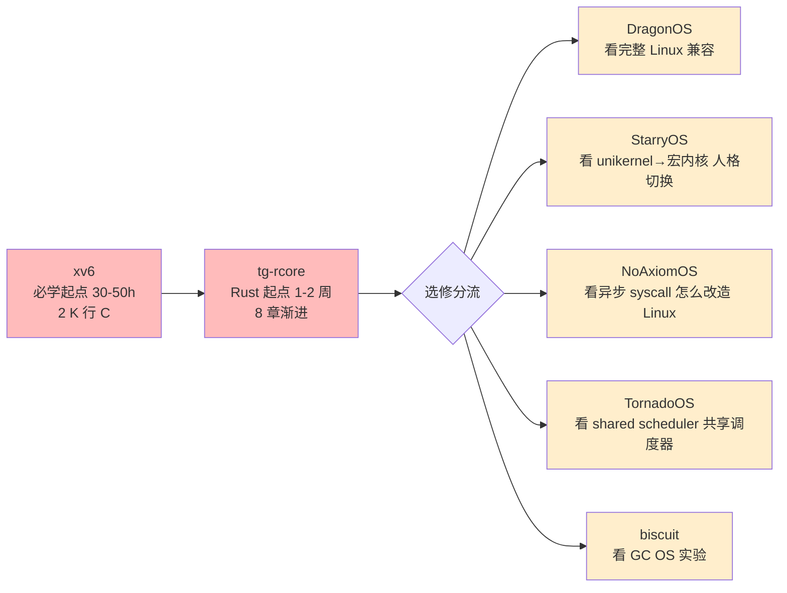
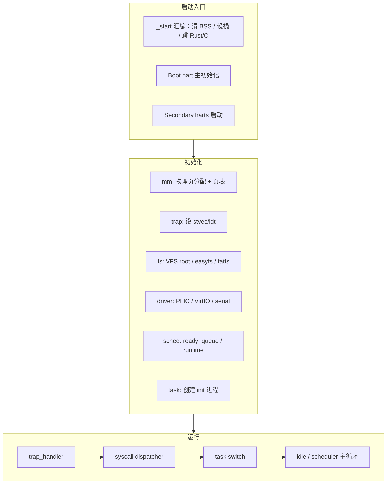
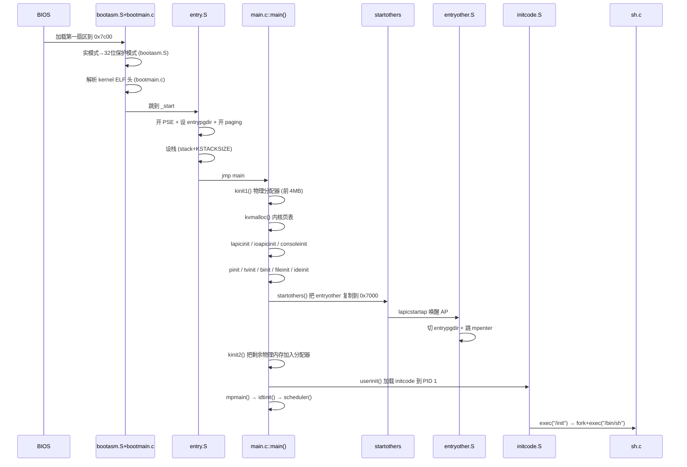
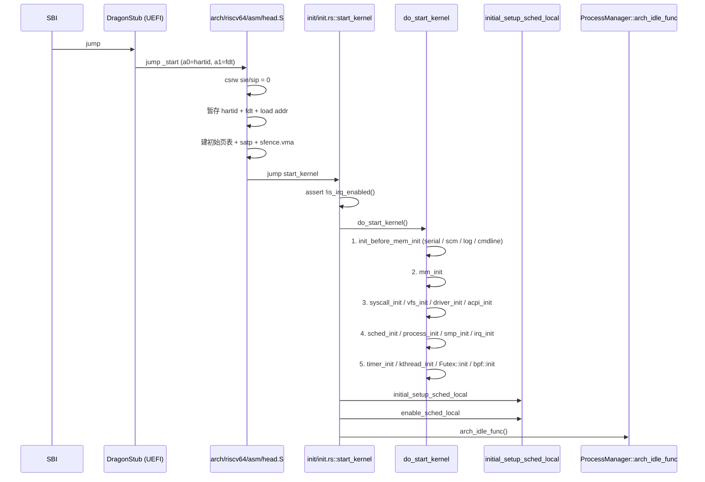
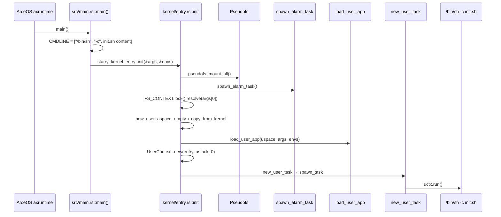
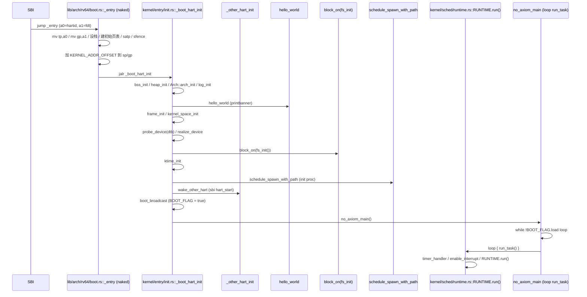
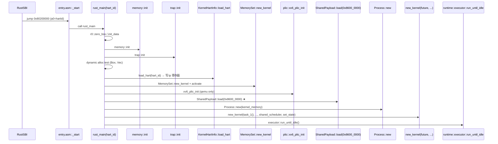
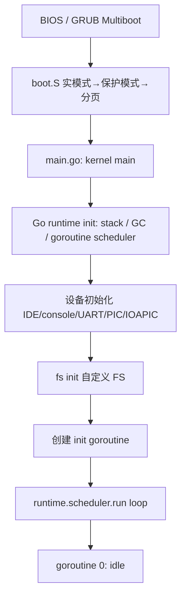

# 04-05 — 宏内核精读合集：xv6 / tg-rcore / DragonOS / StarryOS / NoAxiomOS / TornadoOS / biscuit

> **核心问题：** 同样是"宏内核"范式（kernel + monolithic + 多地址空间），7 个项目在 **代码组织 / 启动入口 / 核心子系统** 三个层面**到底怎么实现**？为什么相同范式会写出风格差异这么大的代码？
>
>
> 与 [03-14](03-14-barebox-walkthrough.md) ~ [03-17](03-17-optee-walkthrough.md) boot 单项精读对应：boot 层每个项目独立成章，OS 层因数量多、范式同（都是宏内核）合并成精读合集。

---

## 0. 宏内核范式速览

### 0.1 一句话定义（参见 [04-02 § 1.2](04-02-os-kernel-paradigms.md)）

宏内核（Monolithic Kernel）= **所有 OS 服务（mm / sched / fs / net / driver）跑在同一个特权地址空间**，用户进程通过 `ecall`/`syscall`/`int 0x80` 陷入内核。Linux / FreeBSD / xv6 / Solaris / AIX 全是这一系。

与组件化内核（arceos）的区别：宏内核**子系统耦合在 kernel/ 下**（共享 struct，互相 grep 得到），组件化内核把每个子系统拆成 crate；与微内核（seL4 / Zircon）的区别：宏内核 fs/driver/net 都在内核态，微内核它们都在用户态服务进程里。

### 0.2 7 项目代码量 / 语言 / 学术工业 对比表

| 项目 | 代码量（cloc）| 主要语言 | 教学/工业 | 多核 | 异步 | 多架构 | Linux ABI |
|------|--------------|----------|-----------|------|------|--------|-----------|
| **xv6** | 6.5 K C + 200 汇编 | C | 教学（MIT 6.828）| ✅ | ❌ | x86_32 | 自定义 21 syscall |
| **tg-rcore** | 14 K Rust（8 章渐进）| Rust | 教学（清华 rCore）| ✅ | ❌ | RV64 | 自定义 ~50 syscall |
| **DragonOS** | 195 K Rust + 部分 C | Rust+C+汇编 | 工业（国产 cloud-native）| ✅ | ❌ | x86_64/RV64/LA64 | ~25% Linux 兼容 |
| **StarryOS** | 14 K Rust（基于 ArceOS）| Rust | 教学+工业（ArceOS 多人格）| ✅ | ❌ | RV64/LA64/AArch64 | Linux 兼容 |
| **NoAxiomOS** | 40 K Rust | Rust | 教学（OS 大赛一等奖）| ✅ | ✅ stackless coroutine | RV64/LA64 | Linux 兼容 |
| **TornadoOS** | 12 K Rust | Rust | 实验（异步内核探索）| ✅ | ✅ shared scheduler | RV64 (qemu/k210) | 自定义 |
| **biscuit** | ~28 K Go + 部分汇编 | Go | 学术（MIT 论文 OSDI'18）| ✅ | ❌ | x86_64 | POSIX 子集 |

**注意 1：** xv6 仓库是早期 x86 版（已停维），主流学习用 [xv6-riscv](https://github.com/mit-pdos/xv6-riscv)；本地仓库就是 x86 版，其设计精髓不变。

**注意 2：** 本地 `/home/heke/tgln/stage2/material/core/biscuit/` 仅有 `.git` 没有工作树（master 分支无 commit），下文 § 7 基于公开论文 / GitHub 上游信息整理。

### 0.3 推荐学习顺序



**学习心法：**

- **xv6** 是无可替代的"**手撕宏内核**"起点 —— 进程表、调度器、fork、exec、syscall 表全在 2 K 行 C 里。读完它，宏内核的"形"就在脑子里固化了。
- **tg-rcore** 是"**用 Rust 重新讲一遍 xv6**"+8 章渐进式，比 xv6 多了：分页/虚存/虚存空间抽象、ELF 加载、easy-fs、信号、线程同步原语 (Mutex/Sem/Condvar) — 等于一份**进阶版 xv6**。
- 工业级（DragonOS/StarryOS/NoAxiom/Tornado/biscuit）选修：每个选 1-2 个 子系统精读即可，不要全读 50 万行。

### 0.4 7 项目共性钢筋骨架（先看清骨架再读细节）



**所有 7 个项目都是这个骨架**，区别在：

1. 用 C 还是 Rust 还是 Go 写
2. 是否带 Linux ABI 兼容
3. 调度器是 RR / CFS / 异步 future poll
4. 是否多架构（HAL 抽象厚薄）
5. 是否多核（spinlock 的实现细节）

带着这个骨架去读，每个项目你都能 30 分钟内画出它的 `_start → main → scheduler` 主线。

---

## 1. xv6 精读

### 1.1 项目身份

| 项 | 值 |
|----|-----|
| **本地路径** | `/home/heke/tgln/stage2/material/core/xv6` |
| **架构** | x86 32-bit（已停维，PR/Issue 都不接收）|
| **大小** | 6.5 K 行 C + 200 行汇编 + ~840 行头文件（cloc） |
| **作者** | Frans Kaashoek / Robert Morris / Russ Cox（MIT PDOS）|
| **课程** | MIT 6.828 / 6.S081（前者用 x86 版，后者已切到 RV64 版）|
| **License** | MIT |
| **依赖** | i386-jos-elf-gcc + QEMU + bochs |
| **入口** | `bootasm.S` → `bootmain.c` → `entry.S` → `main.c::main()` |

xv6 是**整个系统编程教育的中文/英文世界共同起点**。它故意写得**短而美**，没有功能堆砌，每一个文件都直接对应 OS 教材的一个概念。

### 1.2 目录结构（扁平化，无子目录）

```
xv6/
├── 入口 / 启动
│   ├── bootasm.S         # 第一阶段引导（实模式 → 保护模式 + 加载 kernel）
│   ├── bootmain.c        # 解析 ELF 头，跳到内核 entry
│   ├── entry.S           # 内核入口（开 paging + 切 high half + 跳 main）
│   ├── entryother.S      # AP 处理器（secondary core）的入口
│   ├── initcode.S        # 第一个用户进程的启动汇编
│   └── main.c            # C 主入口
├── 进程管理
│   ├── proc.c / proc.h   # struct proc + scheduler / fork / exec / wait
│   ├── swtch.S           # 内核线程上下文切换的 5 行汇编
│   └── exec.c            # exec 系统调用：加载 ELF
├── 内存
│   ├── kalloc.c          # 物理页分配器（freelist 链表）
│   ├── vm.c              # 页表 + walkpgdir / mappages
│   ├── memlayout.h       # 地址布局常量
│   └── mmu.h             # x86 分页/段相关常量
├── 中断 / 系统调用
│   ├── trap.c / trapasm.S / vectors.pl
│   ├── syscall.c         # syscall dispatcher（21 个）
│   ├── sysproc.c         # fork/exit/wait/kill/getpid/sbrk/sleep/uptime
│   └── sysfile.c         # open/read/write/close/dup/pipe/...
├── 文件系统
│   ├── fs.c / fs.h       # inode / dirent / superblock
│   ├── log.c             # 日志 transaction 实现 crash safety
│   ├── bio.c             # 块缓存（buffer cache）
│   ├── file.c / file.h   # struct file / pipe-backed / inode-backed
│   └── pipe.c
├── 设备驱动
│   ├── ide.c / memide.c  # IDE 磁盘驱动
│   ├── console.c         # 控制台 + 行编辑
│   ├── uart.c            # 串口
│   ├── kbd.c / kbd.h     # 键盘
│   ├── lapic.c           # 本地中断控制器
│   ├── ioapic.c          # IO APIC
│   └── picirq.c          # 8259 PIC（被禁用）
├── 同步
│   ├── spinlock.c / .h
│   └── sleeplock.c / .h
├── 用户态
│   ├── ulib.c / umalloc.c / printf.c
│   ├── usys.S            # syscall 桩
│   ├── init.c            # PID 1
│   ├── sh.c              # shell
│   ├── ls.c / cat.c / echo.c / ...
│   └── usertests.c
├── 工具
│   ├── mkfs.c            # 在 host 上构建 fs.img
│   ├── sign.pl / vectors.pl / runoff
└── 链接
    └── kernel.ld
```

**重点：xv6 没有子目录** —— 88 个文件全在顶层，看似乱，实则极利于 grep 学习。

### 1.3 启动流程精读



**关键文件行号引用：**

- `entry.S:40-66` — `_start = V2P_WO(entry)`，开 4MB 大页 (CR4_PSE)，加载 entrypgdir 到 CR3，开 paging (CR0_PG)，设栈跳 `main`。
- `main.c:18-38` — main 函数：14 个 init 调用一字排开（`kinit1 / kvmalloc / mpinit / lapicinit / seginit / picinit / ioapicinit / consoleinit / uartinit / pinit / tvinit / binit / fileinit / ideinit`）+ `startothers()` + `kinit2()` + `userinit()` + `mpmain()`。
- `main.c:64-95` — `startothers()`：把 `entryother.S` 镜像复制到物理地址 0x7000，对每个 AP 写栈/入口/页表，调用 `lapicstartap()` 唤醒，自旋等 `c->started`。
- `main.c:103-108` — `entrypgdir[]`：boot 期间用的 4MB 页恒等映射（VA 0..4MB → PA 0..4MB）+ 高端映射（VA KERNBASE..+4MB → PA 0..4MB）。

### 1.4 核心子系统精读

#### 1.4.1 进程（proc）— `proc.c` + `proc.h`

xv6 进程模型几乎是 Unix V6 的 Rust→C 翻译：

```c
// proc.h:38-52
struct proc {
  uint sz;                     // Size of process memory (bytes)
  pde_t* pgdir;                // Page table
  char *kstack;                // Bottom of kernel stack for this process
  enum procstate state;        // UNUSED/EMBRYO/SLEEPING/RUNNABLE/RUNNING/ZOMBIE
  int pid;
  struct proc *parent;
  struct trapframe *tf;        // Trap frame for current syscall
  struct context *context;     // swtch() here to run process
  void *chan;                  // If non-zero, sleeping on chan
  int killed;
  struct file *ofile[NOFILE];
  struct inode *cwd;
  char name[16];
};
```

**5 个核心函数：**

- `proc.c:74` `allocproc()` — 在全局 `ptable` 找一个 UNUSED 槽位，分配 kstack，初始化 `context`（让 `eip = forkret`）。
- `proc.c:121` `userinit()` — 创建 PID 1，`initcode` 二进制硬编码到内核，复制进新进程地址空间。
- `proc.c:181` `fork()` — 复制 parent 的 sz / pgdir（页表）/ ofile / cwd，新 pid，子进程返回 0。
- `proc.c:227` `exit()` — 关闭所有 fd，置 ZOMBIE，唤醒 parent。
- `proc.c:323` `scheduler()` — 每个 CPU 一个 scheduler 函数，遍历 ptable 找 RUNNABLE 进程，`swtch()` 进去。

#### 1.4.2 调度（sched）— `proc.c::scheduler` + `swtch.S`

xv6 用最朴素的 RR（Round-Robin）：

```c
// proc.c:323
void scheduler(void) {
  struct proc *p;
  struct cpu *c = mycpu();
  c->proc = 0;
  for(;;){
    sti();
    acquire(&ptable.lock);
    for(p = ptable.proc; p < &ptable.proc[NPROC]; p++){
      if(p->state != RUNNABLE) continue;
      c->proc = p;
      switchuvm(p);
      p->state = RUNNING;
      swtch(&(c->scheduler), p->context);
      switchkvm();
      c->proc = 0;
    }
    release(&ptable.lock);
  }
}
```

`swtch.S` 是整个内核中最值得单独读的 ~10 行汇编 —— 保存 callee-saved 寄存器到旧 context，从新 context 恢复，`ret`。所有"线程切换"的本质：**两次寄存器装填夹一个 ret**。

#### 1.4.3 内存（mm）— `kalloc.c` + `vm.c`

物理分配器极简（`kalloc.c`）：

```c
struct run { struct run *next; };
struct { struct spinlock lock; struct run *freelist; } kmem;

char* kalloc(void) {
  struct run *r = kmem.freelist;
  if(r) kmem.freelist = r->next;
  return (char*)r;
}
```

**重点：xv6 的 `freelist` 节点 = 空闲页本身**（把 `next` 指针写在那一页的开头）—— 一个零开销的链表分配器。

虚存（`vm.c`）：

- `vm.c::walkpgdir(pgdir, va, alloc)` — 软件地走 2 级页表（PD → PT → PA）。x86 是 2 级，RISC-V Sv39 是 3 级，逻辑相同。
- `vm.c::mappages(pgdir, va, size, pa, perm)` — 批量建页表项（PTE）。
- `vm.c::switchuvm(p)` — 切换到进程 p 的页表（写 CR3）+ 设 TSS（让中断返回到 kstack）。

#### 1.4.4 syscall — `syscall.c` + `usys.S`

```c
// syscall.c:107-129
static int (*syscalls[])(void) = {
[SYS_fork]    sys_fork,
[SYS_exit]    sys_exit,
[SYS_wait]    sys_wait,
[SYS_pipe]    sys_pipe,
[SYS_read]    sys_read,
[SYS_kill]    sys_kill,
[SYS_exec]    sys_exec,
[SYS_fstat]   sys_fstat,
[SYS_chdir]   sys_chdir,
[SYS_dup]     sys_dup,
[SYS_getpid]  sys_getpid,
[SYS_sbrk]    sys_sbrk,
[SYS_sleep]   sys_sleep,
[SYS_uptime]  sys_uptime,
[SYS_open]    sys_open,
[SYS_write]   sys_write,
[SYS_mknod]   sys_mknod,
[SYS_unlink]  sys_unlink,
[SYS_link]    sys_link,
[SYS_mkdir]   sys_mkdir,
[SYS_close]   sys_close,
};

void syscall(void) {
  int num = curproc->tf->eax;
  if(num > 0 && num < NELEM(syscalls) && syscalls[num])
    curproc->tf->eax = syscalls[num]();
  else { ... eax = -1; }
}
```

只有 21 个 syscall（参见 [04-13](04-13-syscall-linux-list.md) Linux 有 ~450 个）—— 教学 OS 的克制美。

#### 1.4.5 文件系统 — `fs.c` + `log.c`

xv6 自定义 6 层 FS：

```
file descriptor
   ↓
pathname (sysfile.c)
   ↓
directory (fs.c::dirlookup)
   ↓
inode  (fs.c::iget/iput/ilock)
   ↓
log    (log.c — crash recovery)
   ↓
buffer cache (bio.c)
   ↓
disk
```

**亮点：`log.c` 是 OS 教学界**最经典的 crash safety 实现 —— 写入先记日志再写主区，crash 后启动时回放日志。读完它你就懂 ext4 的 jbd2 / xfs 的 log 是什么意思。

### 1.5 关键数据结构清单

| 结构 | 文件 | 用途 |
|------|------|------|
| `struct proc` | proc.h:38 | 进程控制块（PCB）|
| `struct cpu` | proc.h:2 | 每 CPU 状态（含 scheduler context）|
| `struct context` | proc.h:27 | 内核线程上下文（5 个寄存器）|
| `struct trapframe` | x86.h | 用户态 → 内核态时压栈的所有寄存器 |
| `struct inode` | fs.h | 内存中的 inode |
| `struct file` | file.h | 打开文件实例 |
| `struct buf` | buf.h | 块缓存项 |
| `pde_t` | mmu.h | 页目录项 |

### 1.6 必读源文件清单（按学习顺序）

1. **`bootasm.S` + `bootmain.c`**（30 + 80 行）— 实模式→保护模式→加载 kernel ELF；理解"OS 是什么时候获得控制权的"
2. **`entry.S`** + `main.c`（70 + 110 行）— 内核 C 入口前后所有汇编 + main 14 个 init
3. **`proc.h`**（60 行）— PCB / context / cpu 结构，必背
4. **`proc.c::scheduler` + `swtch.S`**（50 + 25 行）— 调度 + 上下文切换
5. **`proc.c::fork / exec`**（在 `exec.c`）— 进程创建模型
6. **`syscall.c` + `sysproc.c` + `sysfile.c`** — 21 个 syscall 全实现
7. **`vm.c`** — 页表所有操作
8. **`fs.c` + `log.c` + `bio.c`** — FS 6 层
9. **`spinlock.c`** + `sleeplock.c` — 同步原语 2 招

### 1.7 与其他项目对比

- vs **tg-rcore**：xv6 是"骨架版 OS"（2 K 行），tg-rcore 是"骨架 + 8 章渐进 + Rust 类型安全"。tg-rcore 的 ch1-ch8 几乎一一对应 xv6 各章，但用 Rust 的 `Box`/`Vec`/`Arc` 替代手写 freelist。
- vs **DragonOS**：DragonOS 是"工业版宏内核"（195 K 行），xv6 是它的精神祖先，DragonOS 的 `process_init / vfs_init / driver_init` 跟 xv6 的 `pinit / fileinit / ideinit` 一一对应，只是每一项展开了千百倍。
- vs **biscuit**：biscuit 把 xv6 用 Go 重写并在内核中跑 GC（参见 § 7）。

---

## 2. tg-rcore 精读

### 2.1 项目身份

| 项 | 值 |
|----|-----|
| **本地路径** | `/home/heke/tgln/stage2/material/core/tg-rcore` |
| **架构** | RISC-V 64-bit（QEMU virt）|
| **大小** | 14 K 行 Rust + 90 行 Asm + 5.9 K 行 Markdown 文档（cloc） |
| **作者** | YdrMaster / Yifan Wang / Yu Chen（清华 rCore 课程组）|
| **课程** | rCore-Tutorial AI4OSE Lab1 |
| **License** | GPL-3.0 |
| **依赖** | nightly Rust + qemu-system-riscv64 |
| **入口** | 每章 ch[1-8] 都有自己的 `_start` (naked) → `rust_main` |

tg-rcore = "**TanGram-rCore-Tutorial**"：8 章渐进式教学 OS + 一组可复用的内核组件 crate（虚存 / context / easy-fs / signal / sync / task-manage 等）。

### 2.2 目录结构

```
tg-rcore/
├── 8 章渐进章节（每章独立 cargo crate）
│   ├── tg-rcore-tutorial-ch1/   # 最小 LibOS（裸机 println!）
│   ├── tg-rcore-tutorial-ch2/   # 批处理（特权级切换）
│   ├── tg-rcore-tutorial-ch3/   # 多道程序 + 时钟中断 + RR 调度 ★
│   ├── tg-rcore-tutorial-ch4/   # 虚存（Sv39 + AddressSpace）
│   ├── tg-rcore-tutorial-ch5/   # 进程模型（fork/exec/wait）
│   ├── tg-rcore-tutorial-ch6/   # 文件系统（easy-fs）★
│   ├── tg-rcore-tutorial-ch7/   # 进程间通信 + 信号
│   └── tg-rcore-tutorial-ch8/   # 线程 + Mutex/Sem/Condvar ★
├── 可复用组件（每个独立 crate，被 ch[1-8] 复用）
│   ├── tg-rcore-tutorial-sbi/         # SBI 调用封装
│   ├── tg-rcore-tutorial-console/     # print!/log!
│   ├── tg-rcore-tutorial-linker/      # 生成链接脚本
│   ├── tg-rcore-tutorial-syscall/     # syscall 编号 + 用户/内核两面
│   ├── tg-rcore-tutorial-kernel-context/ # trap context + foreign portal
│   ├── tg-rcore-tutorial-kernel-vm/   # Sv39 页表抽象
│   ├── tg-rcore-tutorial-kernel-alloc/# 物理页分配
│   ├── tg-rcore-tutorial-easy-fs/     # 文件系统
│   ├── tg-rcore-tutorial-signal/      # 信号
│   ├── tg-rcore-tutorial-sync/        # Mutex/Sem/Condvar
│   ├── tg-rcore-tutorial-task-manage/ # 进程/线程管理
│   ├── tg-rcore-tutorial-user/        # 用户态测试程序
│   └── tg-rcore-tutorial-checker/     # 自动评测
├── docs/        # 设计文档
└── scripts/     # 编译/打包脚本
```

**核心设计哲学：** tg-rcore 把"教学 OS"拆成"**章节**（独立可运行）+ **组件**（可复用 crate）"两个维度。第一维度让初学者能逐步学，第二维度让组件可以横切共享 — 对比 xv6 全平铺，tg-rcore 是"章节维 + 组件维"双维结构。

### 2.3 启动流程精读（以 ch3 为例 — 多道程序 + 时钟中断）

```mermaid
sequenceDiagram
    participant SBI as RustSBI/OpenSBI
    participant Entry as _start (naked)
    participant Rust as rust_main
    participant Console
    participant Sys as syscall init
    participant TCB as TaskControlBlock 数组
    participant Loop as RR 主循环
    participant App as user app

    SBI->>Entry: jump 0x80200000
    Entry->>Entry: la sp, STACK + STACK_SIZE
    Entry->>Rust: j rust_main
    Rust->>Rust: zero_bss()
    Rust->>Console: init_console + set_log_level
    Rust->>Sys: init_io / init_process / init_scheduling / init_clock / init_trace
    Rust->>TCB: 遍历 AppMeta::iter() 加载所有用户程序到 tcbs[]
    Rust->>Rust: sie::set_stimer() 开 S-mode 时钟中断
    Loop->>App: tcb.execute() (sret 进 U-mode)
    App-->>Loop: ecall / 时钟中断 → trap → S-mode
    Loop->>Loop: scause → match Trap::Interrupt(SupervisorTimer) / Trap::Exception(UserEnvCall)
    Loop->>App: 切换到下一个 tcb 或处理 syscall
```

**关键文件行号引用：**

- `tg-rcore-tutorial-ch3/src/main.rs:66-86` — `_start` naked 函数：分配 STACK = (32+2)*8KB，写 `la sp, STACK + STACK_SIZE` 然后 `j rust_main`。
- `tg-rcore-tutorial-ch3/src/main.rs:88-119` — `rust_main`：zero_bss → init_console → init_syscall (5 个 trait) → load TCBs → set_stimer。
- `tg-rcore-tutorial-ch3/src/main.rs:121-200` — RR 主循环：**Rust match scause 模式**（Trap::Interrupt / Trap::Exception），是整个 ch3 的灵魂。

### 2.4 章节渐进路线表

| 章 | 主题 | 新增内容 | TCB 字段增长 | 必读文件 |
|----|------|---------|-------------|----------|
| ch1 | LibOS | sbi_putchar | — | main.rs |
| ch2 | 批处理 | trap context, sret, ecall | — | main.rs + trap |
| ch3 | 多道+时钟 | TaskControlBlock + RR + sie::set_stimer | execute / handle_syscall / finish | main.rs + task.rs |
| ch4 | 虚存 | Sv39 / AddressSpace / VmFlags | + page table | main.rs + tg-kernel-vm |
| ch5 | 进程 | fork / exec / wait / ProcId | + parent/children | main.rs + process.rs + processor.rs |
| ch6 | FS | easy-fs / Inode / FileSystemManager | + ofile[] | + fs.rs + tg-easy-fs |
| ch7 | IPC + 信号 | pipe / SignalAction | + pending signals | + tg-signal |
| ch8 | 线程 | Process + Thread 拆分 + Mutex/Sem/Condvar | Process: aspace/fd/sync/signal; Thread: ctx/tid | + tg-sync |

**学习心法：** ch3 / ch4 / ch6 / ch8 是 4 个**质变点**，每章读懂这 4 个，整个 tg-rcore 就掌握了。

### 2.5 核心组件精读

#### 2.5.1 `tg-rcore-tutorial-syscall`

```rust
// tg-rcore-tutorial-syscall/src/lib.rs:35
#[derive(PartialEq, Eq, Clone, Copy, Debug)]
#[repr(transparent)]
pub struct SyscallId(pub usize);
```

**双面 crate 设计：** 同一个 crate 通过 cargo feature 切换：
- `feature = "user"` → 编译进用户程序，提供 syscall 号 + 内联汇编 `ecall`
- `feature = "kernel"` → 编译进内核，提供 trait `Process / IO / Time / Signal` 让内核实现

**这是 tg-rcore 最值得学的设计** —— 用户态/内核态共享同一套 syscall 编号定义，避免两边编号漂移。

#### 2.5.2 `tg-rcore-tutorial-task-manage`

```rust
// tg-rcore-tutorial-task-manage/src/lib.rs
pub use manager::Manage;       // trait: 对象存储（lookup by id）
pub use scheduler::Schedule;   // trait: 调度策略（pick_next）

#[cfg(feature = "proc")]
pub use proc_manage::PManager;  // 单层进程管理（ch5-ch7）
#[cfg(feature = "thread")]
pub use thread_manager::PThreadManager;  // 双层进程+线程（ch8）
```

**Manage / Schedule 两个 trait** 把"对象存储"和"调度策略"解耦 —— 替换调度器只需换 `Schedule` 实现，不影响其他代码。

#### 2.5.3 `tg-rcore-tutorial-easy-fs`

文件清单：
- `bitmap.rs` — 位图分配器（用于 inode/data 块号分配）
- `block_cache.rs` — LRU 块缓存
- `block_dev.rs` — `BlockDevice` trait（解耦 vs 具体磁盘驱动）
- `efs.rs` — `EasyFileSystem` 总入口
- `layout.rs` — 磁盘 layout（superblock / inode bitmap / data bitmap / inode area / data area）
- `vfs.rs` — Inode 抽象
- `pipe.rs` — 管道（FIFO）
- `file.rs` — `File` trait

**与 xv6 fs.c 对比：** xv6 的 fs.c 是 600 行 C，easy-fs 拆成 9 个文件 ~1500 行 Rust，但语义几乎一致（block-bitmap / inode-bitmap / log）。

### 2.6 必读源文件清单

1. **ch1 main.rs** — 看 SBI 调用怎么打 println!
2. **ch3 main.rs** — RR 调度 + 时钟中断（OS 范式起点）
3. **ch4 main.rs + tg-kernel-vm/space/** — 虚存空间抽象
4. **ch5 process.rs + processor.rs** — 进程父子关系
5. **ch6 fs.rs + tg-easy-fs/** — 文件系统
6. **ch8 process.rs（Process + Thread 拆分）** — 线程模型
7. **tg-rcore-tutorial-syscall/lib.rs** — 双面 crate 模式
8. **tg-rcore-tutorial-task-manage/lib.rs** — Manage / Schedule trait

### 2.7 与其他项目对比

- **vs xv6：** tg-rcore = "Rust 重写 + 8 章渐进 + 现代抽象"，相同时间下学习收益更大；但 xv6 那种"扁平化压缩美"对锻炼系统直觉无可替代。
- **vs StarryOS：** StarryOS 用 ArceOS 当组件库，更工业化；tg-rcore 是教学 OS，每个组件独立 crate 但所有逻辑都自己写完。
- **vs NoAxiomOS / TornadoOS：** 它们引入 async/await 改造 syscall，tg-rcore 是**经典同步内核**的标杆 —— 想学异步内核应当先掌握 tg-rcore 同步版本。

---

## 3. DragonOS 精读

### 3.1 项目身份

| 项 | 值 |
|----|-----|
| **本地路径** | `/home/heke/tgln/stage2/material/core/DragonOS` |
| **架构** | x86_64（主） / RISC-V64 / LoongArch64（实验） |
| **大小** | 195 K 行 Rust + ~60 K 行 C + 1176 行 Asm + ~270 K 总（cloc） |
| **作者** | DragonOS Community（中国，2022 年起） |
| **License** | GPL-2.0 |
| **目标** | "Lightweight Cloud-Native Kernel"，~25% Linux 兼容 |
| **入口** | `arch/x86_64/asm/head.S` 或 `arch/riscv64/asm/head.S` → `init/init.rs::start_kernel` |

DragonOS 是"**国产 Linux ABI 兼容宏内核**"的代表 —— 大量复用 Linux 概念（VFS / driver model / syscall 编号），目标是"**5 年内大规模生产环境部署**"。

### 3.2 目录结构（kernel/src/）

```
DragonOS/kernel/src/
├── arch/                  # 架构相关
│   ├── x86_64/           # 主架构（最完整）
│   │   ├── asm/head.S    # 启动汇编
│   │   ├── init/         # 早期初始化
│   │   ├── interrupt/    # IDT + 异常处理
│   │   ├── mm/           # 页表 + 4-level paging
│   │   ├── process/      # x86_64 task switch
│   │   ├── syscall/      # syscall_via_int80 + sysenter + syscall
│   │   ├── kvm/          # KVM 虚拟化
│   │   └── ...
│   ├── riscv64/          # RISC-V 移植
│   │   ├── asm/head.S    # _start (DragonStub 跳转入口)
│   │   ├── interrupt/entry.S
│   │   ├── mm/           # Sv39/Sv48
│   │   └── ...
│   └── loongarch64/      # 实验性
├── init/                  # 架构无关初始化
│   ├── init.rs           # start_kernel (★)
│   ├── boot.rs           # boot params
│   ├── cmdline.rs        # 内核命令行
│   ├── initcall.rs       # initcall 机制
│   ├── initial_kthread.rs
│   └── initram.rs        # initramfs
├── mm/                    # 内存管理
│   ├── memblock.rs       # boot-time 物理内存登记
│   ├── allocator/        # buddy / slab
│   ├── page.rs / page_table/
│   └── syscall/          # mmap/munmap/brk/sbrk
├── process/               # 进程
│   ├── fork.rs
│   ├── exec.rs / execve.rs
│   ├── exit.rs
│   ├── kthread.rs        # 内核线程
│   ├── pid.rs
│   ├── signal.rs / posix_timer.rs
│   ├── namespace/        # PID/MNT/UTS/IPC namespace
│   └── ...
├── sched/                 # 调度
│   ├── cfs.rs            # CFS-like
│   ├── completion.rs
│   ├── fair.rs
│   └── ...
├── filesystem/            # 文件系统
│   ├── vfs/              # VFS
│   ├── ext2/, ext4/
│   ├── procfs/, sysfs/, devfs/
│   ├── ramfs/, tmpfs/
│   └── overlayfs/
├── driver/                # 驱动
│   ├── base/             # device/bus/class/kobject 模型
│   ├── pci/
│   ├── usb/
│   ├── tty/
│   ├── net/
│   ├── disk/
│   ├── virtio/
│   ├── acpi/
│   └── input/
├── exception/             # 中断/异常
├── ipc/                   # SysV IPC + futex + signal
├── net/                   # 网络栈
├── syscall/               # 架构无关 syscall
├── smp/                   # 多核
├── sched/
├── time/                  # timekeeping / timer
├── bpf/                   # eBPF 子系统
├── perf/                  # perf events
├── tracepoint/            # 追踪点
├── virt/                  # 虚拟化
├── cgroup/                # cgroup
└── lib.rs                 # 内核 crate 入口
```

**重点：DragonOS 是 7 个项目里唯一包含 BPF / cgroup / namespace / overlayfs / KVM 的** —— 是真正按"未来生产环境 Linux 替代"做的，不是教学 OS。

### 3.3 启动流程精读（RV64 路径）



**关键文件行号引用：**

- `arch/riscv64/asm/head.S:34` — `.global _start` 入口，参数 a0=hartid, a1=fdt（来自 DragonStub）
- `init/init.rs:42-53` — `start_kernel()` 入口，4 步：assert IRQ 关 → do_start_kernel → setup sched → enable sched → idle
- `init/init.rs:55-110` — `do_start_kernel()` 19 个 init 函数链：从 `init_before_mem_init` 到 `vmx_init`
- `init/init.rs:114-131` — `init_before_mem_init`：early serial / video / scm / log / cmdline 5 步
- `arch/riscv64/init/mod.rs:1-40` — `ArchBootParams { fdt_paddr / fdt_vaddr / fdt_size / boot_hartid }`

**DragonOS 启动复杂度对比：**
- xv6 main 只有 14 行 init
- tg-rcore ch3 rust_main 只有 5 个 init
- DragonOS do_start_kernel 有 19+ 个 init —— 对应 Linux kernel 的 `start_kernel` 在 init/main.c 的复杂度

### 3.4 核心子系统精读

#### 3.4.1 进程 — `process/`

`process/` 子目录含 25 个文件：
- `fork.rs` — `do_fork` 完全模拟 Linux clone 语义
- `execve.rs` — ELF 加载 + ABI argv/envp
- `kthread.rs` — 内核线程（kthreadd 模式，对应 Linux）
- `pid.rs` — PID namespace / PID allocator
- `signal.rs` — POSIX signal（不是 SBI 的 signal！）
- `namespace/` — pid_namespace.rs / mnt_namespace.rs / uts_namespace.rs / ipc_namespace.rs

**与 xv6 对比：** xv6 一个 `proc.c` 600 行搞定，DragonOS 拆 25 个文件几千行，**因为它实现了 Linux clone()/wait4()/setns()/unshare() 全语义**。

#### 3.4.2 调度 — `sched/`

DragonOS 选择 **CFS-like**（Linux Completely Fair Scheduler）：
- `cfs.rs` — Completely Fair Scheduler
- `fair.rs` — fair class
- `completion.rs` — kernel completion 同步原语

**入口：** `init/init.rs:83` `crate::sched::sched_init();`

#### 3.4.3 syscall — `syscall/` + `arch/x86_64/syscall/`

```rust
// syscall/mod.rs:99-156 (摘要)
pub fn handle_syscall(syscall_num: usize, args: [usize; 6], frame: &mut TrapFrame) -> Result<usize, SystemError> {
    if let Some(handler) = syscall_table().get(syscall_num) {
        return handler.handle(args, frame);
    }
    // fallback to legacy switch
    match syscall_num {
        SYS_PUT_STRING => Self::put_string(...),
        SYS_SBRK => sys_sbrk(...),
        SYS_CLOCK => Self::clock(),
        SYS_SCHED => { schedule(SchedMode::SM_NONE); Ok(0) },
        SYS_SYSLOG => ...,
        _ => Err(SystemError::ENOSYS),
    }
}
```

DragonOS syscall **双层分发：**
1. 优先查 `syscall_table` 哈希表（动态注册的 handler）
2. 落到 legacy `match` 分支（少量 DragonOS 特有 syscall）

`arch/<arch>/syscall/nr.rs` 定义所有 syscall 编号（直接 mirror Linux 编号）。

#### 3.4.4 文件系统 — `filesystem/`

DragonOS VFS 几乎复刻 Linux VFS：
- `vfs/` — VFS 抽象层（dentry / inode / superblock / file_operations）
- `ext2/`, `ext4/` — ext 家族
- `procfs/`, `sysfs/`, `devfs/`, `ramfs/`, `tmpfs/`, `overlayfs/`
- `init/init.rs:79` `vfs_init().expect("vfs init failed");`

#### 3.4.5 驱动 — `driver/`

`driver/base/` 是 DragonOS 最大的特色 — 完整复刻 **Linux device driver model**：

```
driver/base/
├── device.rs       # struct Device + DeviceState
├── kobject.rs      # Linux kobject
├── kset.rs
├── platform/       # platform driver/device
├── subsys.rs
├── class.rs        # /sys/class/
├── block/          # 块设备框架
├── char/           # 字符设备框架
├── cpu.rs / firmware.rs / map.rs
└── ...
```

**与 xv6 对比：** xv6 的 driver = `ide.c + console.c + uart.c + kbd.c` 各自独立函数；DragonOS 的 driver 是统一的 device tree 模型 (kobject 总线/类/驱动 三元组)。

### 3.5 关键数据结构清单

| 结构 | 文件 | 用途 |
|------|------|------|
| `ProcessControlBlock` | `process/mod.rs` | 进程控制块（对应 Linux task_struct）|
| `ProcessFlags` | `process/mod.rs` | 进程状态 flag |
| `TrapFrame` | `arch/<arch>/interrupt/` | 异常压栈 |
| `MemoryManagementArch` | `arch/<arch>/mm/` | 架构相关的 mm 抽象 |
| `Inode` | `filesystem/vfs/` | VFS inode |
| `Device` | `driver/base/device.rs` | 设备 |
| `KObject` | `driver/base/kobject.rs` | Linux 风格内核对象 |
| `SyscallTable` | `syscall/table.rs` | syscall 哈希表 |
| `SystemError` | （来自 `system_error` crate）| 统一错误码（`-EINVAL` 等）|

### 3.6 必读源文件清单

由于 DragonOS 195 K 行不可能全读，按子系统优先精读：

1. **`arch/<arch>/asm/head.S`** — 启动入口
2. **`init/init.rs`** — `start_kernel` + `do_start_kernel` 主线
3. **`process/fork.rs` + `process/execve.rs`** — 看 Linux clone/exec 模拟
4. **`syscall/mod.rs` + `syscall/table.rs`** — syscall 双层分发
5. **`filesystem/vfs/mod.rs`** — VFS 抽象
6. **`driver/base/device.rs` + `kobject.rs`** — Linux device model
7. **`mm/init.rs`** — 内存子系统初始化
8. **`sched/cfs.rs`** — CFS 调度器

### 3.7 与其他项目对比

- **vs xv6 / tg-rcore：** DragonOS 是"工业级 + Linux 兼容"，xv6/tg-rcore 是"教学骨架"。DragonOS 195 K 行 ≈ 30 倍 tg-rcore，10 倍 xv6 + tg-rcore + StarryOS 之和。
- **vs StarryOS：** StarryOS 复用 ArceOS 组件库；DragonOS 完全自研 + 部分参考 Linux。
- **vs NoAxiomOS：** 都追求 Linux 兼容，但 DragonOS 是经典同步内核 + CFS，NoAxiomOS 是异步内核 + 协程调度。

---

## 4. StarryOS 精读

### 4.1 项目身份

| 项 | 值 |
|----|-----|
| **本地路径** | `/home/heke/tgln/stage2/material/core/StarryOS` |
| **架构** | RISC-V 64 / LoongArch 64 / AArch64 / x86_64（开发中） |
| **大小** | 14 K 行 Rust + 519 行 Makefile + ~16 K 总（cloc） |
| **作者** | Azure-stars / Yuekai Jia / KylinSoft / 朝倉水希 / Mivik |
| **License** | Apache-2.0 |
| **依赖** | ArceOS（外部 git submodule）+ rootfs (img download) |
| **入口** | ArceOS 启动 → `axruntime` → `kernel/src/main.rs::main()` |

StarryOS = "**一个跑在 ArceOS 之上的 Linux 兼容宏内核**"。它本身只有 14 K 行 Rust，因为大量基础设施（mm/driver/sched/HAL）都在 ArceOS submodule 里。这是宏内核 + 组件化的杂交方案。

参见 [04-02 § 5](04-02-os-kernel-paradigms.md) ArceOS 的"多人格"机制 —— StarryOS 就是 ArceOS 的"宏内核人格"。

### 4.2 目录结构

```
StarryOS/
├── Cargo.toml          # workspace = ["kernel"]，exclude = ["arceos"]
├── Makefile            # 调用 ArceOS 的 make 系统
├── src/
│   ├── main.rs         # main 函数 = 调用 starry_kernel::entry::init(args, envs)
│   └── init.sh         # /bin/sh -c init.sh 用户态启动脚本
└── kernel/             # 主要代码（独立 crate "starry-kernel"）
    └── src/
        ├── lib.rs      # crate 入口
        ├── entry.rs    # entry::init(args, envs) ★
        ├── config/     # 内核配置
        ├── file/       # 文件描述符表 FD_TABLE
        ├── mm/         # 用户地址空间 + load_user_app
        ├── pseudofs/   # /proc /sys /dev/tty 等
        ├── syscall/    # syscall handler ★
        │   ├── mod.rs        # handle_syscall dispatcher
        │   ├── fs/, mm/, signal/, ipc/, net/, sync/, task/, time/, ...
        ├── task/       # 用户任务 spawn
        │   ├── mod.rs        # ProcessData + Thread + spawn_alarm_task
        │   └── user.rs       # new_user_task + ReturnReason 主循环
        └── time.rs
```

### 4.3 启动流程精读



**关键文件行号引用：**

- `src/main.rs:9-22` — `CMDLINE = &["/bin/sh", "-c", include_str!("init.sh")]`，main 函数 = 转发到 `starry_kernel::entry::init(args, envs)`
- `kernel/src/entry.rs:1-50` — `entry::init`：mount_all → spawn_alarm_task → resolve binary path → new_user_aspace_empty → load_user_app → new_user_task → spawn
- `kernel/src/task/user.rs:13-70` — 用户态主循环：`uctx.run()` → match `ReturnReason`：Syscall / PageFault / Interrupt / Exception
- `kernel/src/syscall/mod.rs:23-40` — `handle_syscall`：根据 `Sysno` 枚举 dispatcher

### 4.4 核心子系统精读

#### 4.4.1 用户任务主循环（StarryOS 灵魂）

`kernel/src/task/user.rs:13-70` 是 StarryOS 最关键的代码：

```rust
pub fn new_user_task(name: &str, mut uctx: UserContext, set_child_tid: usize) -> TaskInner {
    TaskInner::new(move || {
        // ... set child tid ...
        let thr = curr.as_thread();
        while !thr.pending_exit() {
            let reason = uctx.run();    // ← 进入 U-mode
            set_timer_state(&curr, TimerState::Kernel);
            match reason {
                ReturnReason::Syscall => handle_syscall(&mut uctx),
                ReturnReason::PageFault(addr, flags) => {
                    if !thr.proc_data.aspace.lock().handle_page_fault(addr, flags) {
                        raise_signal_fatal(SignalInfo::new_kernel(Signo::SIGSEGV))
                            .expect("Failed to send SIGSEGV");
                    }
                }
                ReturnReason::Interrupt => {}
                ReturnReason::Exception(exc_info) => { ... },
                r => { ... raise SIGSEGV },
            }
            // signal handling...
        }
    })
}
```

这跟 tg-rcore ch3 的"`tcb.execute()` + match scause"是同一个模式 —— ArceOS 的 `UserContext::run()` 抽象了"进 U-mode"，return 时返回结构化的 `ReturnReason`，Rust enum 让 trap dispatch 极简。

#### 4.4.2 syscall — `kernel/src/syscall/`

```
syscall/
├── mod.rs              # handle_syscall（按 Sysno 大 match）
├── fs/                 # ioctl/chdir/getdents64/...
├── mm/                 # mmap/munmap/brk
├── ipc/                # SysV IPC
├── io_mpx/             # epoll / select / poll
├── net/                # socket / send / recv
├── resources.rs        # getrlimit / setrlimit
├── signal.rs           # rt_sigaction / kill
├── sync/               # futex
├── sys.rs              # uname / sysinfo
├── task/               # clone / wait / exit
└── time.rs             # gettimeofday / nanosleep
```

`handle_syscall` 用 `syscalls` crate 的 `Sysno` 枚举，所以编号自动对齐 Linux —— 这是它能直接跑 busybox/musl 的关键。

#### 4.4.3 进程模型 — 复用外部 `starry_process` crate

```rust
use starry_process::{Pid, Process};
// kernel/src/entry.rs:50
let proc = Process::new_init(pid);
proc.add_thread(pid);
```

`Process` / `Thread` 是 ArceOS 生态的独立 crate，StarryOS 直接复用 — 又一个组件化优势。

### 4.5 必读源文件清单

1. **`src/main.rs`** + `src/init.sh` — 启动入口
2. **`kernel/src/entry.rs::init`** — 加载第一个用户进程
3. **`kernel/src/task/user.rs`** — 用户主循环（match ReturnReason）
4. **`kernel/src/syscall/mod.rs`** — syscall dispatcher
5. **`kernel/src/mm/`** — load_user_app + new_user_aspace_empty
6. **`kernel/src/file/`** — FD_TABLE
7. **`kernel/Cargo.toml`** — 看 ArceOS 外部依赖列表

### 4.6 与其他项目对比

- **vs ArceOS：** ArceOS 是"组件化内核框架"，StarryOS 是它在"宏内核人格"下的实例化（参见 [04-02](04-02-os-kernel-paradigms.md) "多人格"原理）。
- **vs DragonOS：** 都追求 Linux 兼容，但 DragonOS 全部自研，StarryOS 只写宏内核语义层（fork/exec/syscall），底层 mm/driver 委托给 ArceOS。
- **vs tg-rcore：** tg-rcore 是单 crate 渐进，StarryOS 是基于 ArceOS 的薄宏内核 — 教学价值低，工程参考价值高。

---

## 5. NoAxiomOS 精读

### 5.1 项目身份

| 项 | 值 |
|----|-----|
| **本地路径** | `/home/heke/tgln/stage2/material/core/NoAxiomOS` |
| **架构** | RISC-V 64 + LoongArch 64（自研 HAL）|
| **大小** | 40 K 行 Rust + 421 行 Asm + ~42 K 总（cloc） |
| **作者** | 杭州电子科技大学 NoAxiom 团队 |
| **License** | (未在顶层 LICENSE 文件中找到 SPDX 字段) |
| **比赛** | 2025 全国大学生计算机系统能力大赛 OS 内核赛道 一等奖 |
| **入口** | `lib/arch/src/rv64/boot.rs::_entry` (naked) → `_boot_hart_init` |

NoAxiomOS = "**Rust 异步无栈协程宏内核**"。**最特别之处：syscall 是 `async fn`**，配合无栈协程实现"非阻塞内核"。

### 5.2 目录结构

```
NoAxiomOS/
├── NoAxiom/             # 主仓库
│   ├── kernel/          # 内核
│   │   └── src/
│   │       ├── main.rs           # crate 入口
│   │       ├── entry/            # 启动序列
│   │       │   ├── init.rs       # _boot_hart_init / _other_hart_init
│   │       │   ├── main.rs       # rust_main (run_task 死循环)
│   │       │   ├── init_proc.rs  # spawn 第一个用户进程
│   │       │   └── mod.rs
│   │       ├── cpu/              # per-cpu 抽象
│   │       ├── mm/               # 内存
│   │       ├── sched/            # 调度（含 runtime.rs）
│   │       ├── task/             # task control block
│   │       ├── trap/             # trap handler
│   │       ├── syscall/          # ★ async syscall
│   │       │   ├── mod.rs        # 编号常量
│   │       │   ├── syscall.rs    # Syscall struct + syscall_inner ★
│   │       │   ├── fs.rs / mm.rs / process.rs / sched.rs / signal.rs / ...
│   │       ├── fs/               # 文件系统
│   │       ├── net/              # 网络
│   │       ├── signal/           # 信号
│   │       ├── time/             # time keeping
│   │       ├── driver/           # 驱动
│   │       ├── include/          # 通用结构（result.rs 等）
│   │       └── ...
│   └── lib/             # HAL + 通用库
│       ├── arch/        # ISA 抽象（rv64 / la64）
│       │   └── src/
│       │       ├── rv64/boot.rs  # _entry (naked) + page table + ★
│       │       ├── rv64/trap.S
│       │       ├── la64/boot.rs
│       │       └── ...
│       ├── platform/    # 平台抽象
│       ├── memory/      # 内存通用
│       ├── ksync/       # 内核同步原语
│       ├── kfuture/     # async runtime 支持
│       ├── driver/      # 驱动框架
│       ├── driver_ahci/
│       ├── fatfs/       # FAT32
│       └── config/      # CPU_NUM 等编译期常量
├── NoAxiom-OS-Document/ # 文档（包括决赛 PDF）
├── NoAxiom-OS-Test/     # 测试套件
├── NoAxiom-OS-User/     # 用户态测试程序
├── NoAxiom-OS-Utils/    # 工具链管理
└── docs/                # 决赛文档
```

### 5.3 启动流程精读



**关键文件行号引用：**

- `lib/arch/src/rv64/boot.rs:51-88` — `_entry` naked 函数：设栈 / satp / 跳 `_boot_hart_init`，关键是 `li s0, KERNEL_ADDR_OFFSET; or sp, sp, s0` 把栈指针加 high half offset
- `kernel/src/entry/init.rs:68-100` — `_boot_hart_init`：bss/heap/log/fs/device/init proc/wake aps/run_task
- `kernel/src/entry/init.rs:38-48` — `_other_hart_init`：AP 路径，唯一入口 `crate::no_axiom_main()`
- `kernel/src/entry/main.rs:10-19` — `rust_main`：等 BOOT_FLAG = true，然后 `loop { run_task() }`
- `kernel/src/sched/runtime.rs:121` — `pub fn run_task() { timer_handler(); enable_interrupt; RUNTIME.run() }`

### 5.4 核心子系统精读 — async syscall 设计

NoAxiomOS 的"**async syscall**"是它最大的招牌。`kernel/src/syscall/syscall.rs:21-80` 节选：

```rust
#[rustfmt::skip]
impl<'a> Syscall<'a> {
    async fn syscall_inner(&mut self, id: SyscallID, args: [usize; 6]) -> SyscallResult {
        use SyscallID::*;
        match id {
            // fs
            SYS_FCHMOD =>           self.sys_fchmod(args[0], args[1]),
            SYS_READ =>             self.sys_read(args[0], args[1], args[2]).await,
            SYS_READV =>            self.sys_readv(args[0], args[1], args[2]).await,
            SYS_WRITE =>            self.sys_write(args[0], args[1], args[2]).await,
            SYS_OPENAT =>           self.sys_openat(args[0] as isize, args[1], args[2] as i32, args[3] as u32).await,
            // ...
        }
    }
}
```

**关键洞察：**

- `syscall_inner` 本身是 `async fn`，整个 syscall handler 是一个 `Future`
- `sys_read / sys_write / sys_openat` 等等都是 `async fn`，里面遇到 I/O 阻塞时直接 `await`，让出当前 task
- **配合 `RUNTIME.run()`** —— 内核里跑一个 future executor，syscall future 阻塞时 runtime 调度下一个 task
- 这等价于 io_uring 的"内核态 epoll"，但用 Rust async 写得更优雅

参见 [01-06 zig-async](01-06-zig-async.md) 异步演化对比 —— Rust 的无栈协程是这种设计的基础。

### 5.5 关键数据结构

| 结构 | 文件 | 用途 |
|------|------|------|
| `Task` | `task/mod.rs` | 任务控制块（含 future）|
| `Syscall<'a>` | `syscall/syscall.rs:13` | per-syscall 上下文（持有 `&Arc<Task>`）|
| `SyscallID` | `include/syscall_id.rs` | syscall 编号枚举 |
| `RUNTIME` | `sched/runtime.rs` | 全局 future executor |
| `BOOT_FLAG` | `entry/main.rs:5` | hart 同步原子 bool |
| `Arch` trait | `lib/arch/src/...` | 架构抽象 trait |

### 5.6 必读源文件清单

1. **`lib/arch/src/rv64/boot.rs`** — 启动汇编
2. **`kernel/src/entry/init.rs`** — `_boot_hart_init`
3. **`kernel/src/entry/main.rs` + `sched/runtime.rs`** — run_task 主循环
4. **`kernel/src/syscall/syscall.rs`** — async syscall dispatcher（1500+ 行 match）
5. **`kernel/src/syscall/fs.rs`** — async fs syscall 实现
6. **`kernel/src/task/`** — Task 与 future 的关系
7. **`docs/final.pdf`** — 决赛汇报（设计意图最权威）

### 5.7 与其他项目对比

- **vs xv6 / tg-rcore：** 经典宏内核 syscall 是同步阻塞，遇到 I/O 当前线程 wait；NoAxiom 是 async syscall，遇到 I/O `await` 让出 future 槽。
- **vs TornadoOS：** TornadoOS 也是异步内核，但它走"shared scheduler"路线（M/N 用户态协程 → N 内核线程）；NoAxiom 是"内核里直接跑 future executor"。
- **vs DragonOS：** DragonOS 是经典同步 + CFS；NoAxiom 是 async + future runtime。

---

## 6. TornadoOS 精读

### 6.1 项目身份

| 项 | 值 |
|----|-----|
| **本地路径** | `/home/heke/tgln/stage2/material/core/TornadoOS` |
| **架构** | RISC-V 64（QEMU virt + K210 真机）|
| **大小** | 12 K 行 Rust + 1.3 K 行 Python + 137 行 Asm + ~15 K 总（cloc） |
| **作者** | HUST-OS / 飓风内核团队 |
| **License** | Apache-2.0 / Mulan PSL v2 双协议 |
| **比赛** | 全国大学生 OS 设计大赛参赛作品（早期）|
| **入口** | `tornado-kernel/src/entry.asm` → `rust_main(hart_id)` |

TornadoOS = "**飓风内核**" — 探索"**共享调度器**"理念：调度器作为独立动态库，由不同地址空间共享，进而在 OS 层提供"内核协程"。设计思路在论文性质，不追求功能完整。

### 6.2 目录结构

```
TornadoOS/
├── Cargo.toml              # workspace
├── tornado-kernel/         # 主内核 ★
│   ├── src/
│   │   ├── main.rs         # rust_main(hart_id)
│   │   ├── entry.asm       # _start 汇编
│   │   ├── linker-qemu.ld / linker-k210.ld
│   │   ├── console.rs
│   │   ├── hart.rs         # KernelHartInfo per-hart 抽象
│   │   ├── memory/         # 物理/虚拟内存
│   │   ├── trap/           # trap handler
│   │   ├── plic.rs         # PLIC 中断控制器
│   │   ├── async_rt/       # 异步运行时
│   │   ├── algorithm/      # 算法（buddy / FIFO 调度策略）
│   │   ├── fs/             # 文件系统
│   │   ├── cache/
│   │   ├── sbi.rs          # SBI 调用
│   │   ├── sdcard.rs       # K210 sdcard 驱动
│   │   ├── virtio/         # virtio-blk
│   │   ├── syscall/
│   │   │   ├── mod.rs / config.rs / user_syscall.rs
│   │   ├── task/           # KernelTask + Process
│   │   └── user.rs         # 加载用户程序
├── shared-scheduler/       # ★ 独立共享调度器 crate（裸机库）
├── tornado-user/           # 用户程序
├── async-mutex/            # 异步互斥锁
├── async-fat32/            # 异步 FAT32
├── async-sd/               # 异步 SD 卡
├── async-virtio-driver/    # 异步 VirtIO
├── event/
├── rv-lock/
├── SBI/                    # SBI 项目（参见 [02-03](02-03-sbi-implementations.md) RustSBI 同源）
├── xtask/                  # 构建任务
└── ktool.py                # Python 调试工具
```

**最大特色：`shared-scheduler/` 是单独编译的二进制 + 加载到固定物理地址 0x8600_0000**，由内核 / 用户进程 / 多核共享访问 —— 真正的"共享调度器"。

### 6.3 启动流程精读



**关键文件行号引用：**

- `tornado-kernel/src/main.rs:55-56` — `pub extern "C" fn rust_main(hart_id: usize) -> !`
- `tornado-kernel/src/main.rs:71-74` — `r0::zero_bss + r0::init_data`（来自 `r0` crate，比手写 BSS 清零更简洁）
- `tornado-kernel/src/main.rs:46-53` — `SHAREDPAYLOAD_BASE = 0x8600_0000` (qemu) / `0x8040_0000` (k210)
- `tornado-kernel/src/main.rs:143` — `let shared_payload = unsafe { async_rt::SharedPayload::load(SHAREDPAYLOAD_BASE) };` ★
- `tornado-kernel/src/main.rs:154-159` — `task::new_kernel(task_1(), process, shared_payload.shared_scheduler, shared_payload.shared_set_task_state)`

### 6.4 核心子系统精读 — 共享调度器 + 异步任务

#### 6.4.1 共享调度器（shared-scheduler）

`shared-scheduler` 是独立编译的二进制，**裸机环境的动态库**：

- 编译后通过 linker.ld 放到物理地址 0x8600_0000（或 K210 的 0x8040_0000）
- 内核启动时调用 `async_rt::SharedPayload::load(BASE)` 把它"链接"进来
- 内核态 / 用户态 / 多核都能调用这个调度器的 `add_task / set_task_state / next_task`

**对比传统内核：** Linux / xv6 / DragonOS 调度器**编译进内核**，TornadoOS 把调度器做成"**独立模块 + 多角色共享**"。

#### 6.4.2 任务模型 — `tornado-kernel/src/task/`

```rust
// task/mod.rs
pub use kernel_task::{KernelTask, TaskId};
pub use process::{Process, ProcessId};

pub fn new_kernel(
    future: impl Future<Output = ()> + 'static + Send + Sync,
    process: Arc<Process>,
    shared_scheduler: NonNull<()>,
    set_task_state: unsafe extern "C" fn(NonNull<()>, usize, TaskState),
) -> Arc<KernelTaskRepr> { ... }
```

**任务 = future + process + 共享调度器句柄**。这是把 future（用户态协程语言原语）"带进内核"的尝试。

#### 6.4.3 syscall — 5 维度分类

```rust
// syscall/mod.rs:46
pub fn syscall(param: [usize; 6], user_satp: usize, func: usize, module: usize) -> SyscallResult {
    match module {
        MODULE_PROCESS => do_process(...),
        MODULE_TEST_INTERFACE => do_test_interface(...),
        MODULE_TASK => do_task(...),
        // ...
    }
}
```

**TornadoOS syscall 编号采用 `(module, func)` 二维结构** — 不是 Linux 那种连续编号（`SYS_READ = 63`），而是更面向 OO 的"模块 + 方法"调用。

#### 6.4.4 异步驱动 — `async-virtio-driver` / `async-fat32`

整个驱动栈也是 `async fn`：
- VirtIO 块设备读 → `async` 让出
- FAT32 文件读 → `await` VirtIO 完成
- 用户 `read(fd, buf, len)` → `await` FAT32 → 驱动 → 调度器 切到下一个 future

这是"**stackless coroutine 进入 OS 内核**"的早期探索（2021 年）。

### 6.5 关键数据结构

| 结构 | 文件 | 用途 |
|------|------|------|
| `KernelTask` | `task/kernel_task.rs` | 内核任务（含 future）|
| `Process` | `task/process.rs` | 进程（持 MemorySet）|
| `KernelHartInfo` | `hart.rs` | per-hart 状态（写入 tp 寄存器）|
| `SharedPayload` | `async_rt/...` | 共享调度器 ABI 入口 |
| `MemorySet` | `memory/...` | 地址空间 |
| `SyscallResult` | `syscall/mod.rs:18` | 6 种返回类型 (Procceed/Retry/NextASID/KernelTask/IOTask/Check/Terminate) |

### 6.6 必读源文件清单

1. **`tornado-kernel/src/entry.asm` + `main.rs`** — 启动入口
2. **`tornado-kernel/src/async_rt/`** — 异步运行时
3. **`tornado-kernel/src/task/`** — KernelTask + Process
4. **`shared-scheduler/`** — 独立编译的共享调度器（必读，理解整个架构）
5. **`async-virtio-driver/`** — 异步驱动样例
6. **`async-fat32/`** — 异步 FS 样例
7. **`tornado-kernel/src/syscall/mod.rs`** — 二维 syscall (module, func)
8. **`README.md`** + `assets/飓风内核系统架构.png`

### 6.7 与其他项目对比

- **vs NoAxiomOS：** NoAxiom 把 future 编入内核（`async fn syscall`）；Tornado 把调度器抽出去做独立模块。两者都是"**让 future 进内核**"，方向不同。
- **vs xv6 / tg-rcore：** 同步内核 → 异步内核的范式跃迁。
- **vs Linux io_uring：** io_uring 在用户态 ring buffer 上操作；Tornado 让用户和内核**共享同一个调度器实体**，更激进。

---

## 7. biscuit 精读

> ⚠️ **状态注意：** 本地 `/home/heke/tgln/stage2/material/core/biscuit/` 仅含 `.git`，无工作树（master 分支无 commit），git remote 也连不上。本节内容基于公开论文 / GitHub README / OSDI'18 论文 整理，**不含本地行号引用**。如果未来 fetch 成功，应在此节补 path:LINE。

### 7.1 项目身份

| 项 | 值 |
|----|-----|
| **本地路径** | `/home/heke/tgln/stage2/material/core/biscuit/` （工作树为空） |
| **上游** | https://github.com/mit-pdos/biscuit |
| **架构** | x86_64 |
| **大小（公开数据）** | ~28 K 行 Go + 部分汇编 + 修改过的 Go runtime |
| **作者** | Cody Cutler / Frans Kaashoek / Robert Morris（MIT）|
| **License** | （上游自带 LICENSE）|
| **论文** | OSDI'18 "The benefits and costs of writing a POSIX kernel in a high-level language" |

biscuit = "**Go 写的宏内核**" — 把 Go runtime（GC / goroutine / channel）整体搬进内核态运行。MIT PDOS 的实验性研究项目，证明"**用高级语言（带 GC）也能写出可用的 OS 内核**"。

### 7.2 目录结构（基于 GitHub）

```
biscuit/
├── biscuit/                # 内核
│   ├── src/                # Go 源代码
│   │   ├── kernel/         # 内核主体
│   │   ├── boot/           # 启动汇编（x86）
│   │   └── runtime/        # 修改过的 Go runtime（移除 syscall 依赖）
│   ├── obj/                # build artifacts
│   └── go.sh               # 构建脚本
├── biscuit/user/           # 用户态程序（C 写）
├── biscuit/test/
└── ...
```

### 7.3 启动流程概要

biscuit 启动比其他内核多一步：**Go runtime 必须改造后才能裸跑**：



**关键：** Go runtime 默认依赖 mmap/sigaction/futex 等 syscall（向 OS 借资源），**biscuit 把这些 syscall 替换成内核内部的等价物**（自己分自己用）。这是整个项目最难的部分。

### 7.4 核心子系统精读（按论文）

#### 7.4.1 GC 进内核

- biscuit 的内核态对象由 Go GC 管理
- 中断/syscall 处理过程中 GC 不能 stop-the-world 太久 → biscuit 限制 GC pause < 100us
- 论文：在 webserver / NFS 等 benchmark 上，biscuit 比同等规模的 Linux 慢 ~5-15%（GC + Go runtime 开销）

#### 7.4.2 goroutine 即内核线程

- 每个用户进程对应一个 goroutine
- 内核服务（disk / network）也是 goroutine
- channel 用于内核内部通信（替代 POSIX 信号量 / wait queue）

**对比：** xv6 用 spinlock + sleeplock + chan + wakeup；biscuit 直接用 Go 的 channel/select。

#### 7.4.3 文件系统

biscuit 自己写了 ext4-like 的 journaled FS（不是直接搬 ext4），用 Go 实现，论文中专门评测了 fsync / metadata 操作性能。

#### 7.4.4 网络栈

biscuit 网络栈也是 Go 写，跑在内核态（与 Linux 类似），论文比较了 nginx / redis 等 benchmark。

### 7.5 与其他项目对比

- **vs xv6：** xv6 是 biscuit 的精神祖先 + C 同义对照（同 MIT PDOS 团队），biscuit 在 OSDI'18 论文里直接拿 xv6 当对比 baseline 之一。
- **vs Linux：** biscuit 论文核心结论是"高级语言 OS 是可行的，性能开销 5-15% 可接受"。
- **vs Rust 内核（tg-rcore / DragonOS / asterinas）：** Rust 没 GC，所以没"GC pause 进内核"问题；但 Rust 借用检查 + Box 编译期管理也提供了类似 GC 的内存安全性。biscuit 是"GC 派"，Rust OS 是"非 GC 派"，两者代表了"**高级语言进内核**"的两条不同路径。
- **vs NoAxiomOS / TornadoOS：** Go goroutine 是有栈 M:N 协程；Rust async/await 是无栈 future。biscuit 是"有栈协程进内核"；NoAxiom/Tornado 是"无栈协程进内核"。

### 7.6 阅读建议

1. **先读 OSDI'18 论文** "The benefits and costs of writing a POSIX kernel in a high-level language" — 25 页，是项目的**唯一权威设计文档**
2. 然后从 GitHub 在线浏览（本地无源码）
3. 重点关注：`biscuit/src/runtime/` 看修改过的 Go runtime 怎么裸跑
4. 测试：biscuit 跑 redis / memcached / NFS 的 benchmark，体会 GC OS 的真实性能

---

## 8. 7 项目共性 + 差异梳理

### 8.1 共性钢筋（同范式锁定的部分）

所有 7 个宏内核项目共享下列结构（详见 [04-01 § 4](04-01-os-kernel-overview.md)）：

| 组件 | 必有 |
|------|------|
| **入口汇编（_start）** | ✅ 所有项目 |
| **物理页分配器** | ✅ 所有项目 |
| **页表 / 虚存抽象** | ✅ 所有项目 |
| **进程/任务控制块（PCB/TCB）** | ✅ 所有项目 |
| **调度器主循环** | ✅ 所有项目 |
| **trap / 异常处理** | ✅ 所有项目 |
| **syscall 分发表** | ✅ 所有项目 |
| **VFS 层** | ⚠️ xv6/tg-rcore 简化为单一 inode 模型，其他都有 VFS |
| **驱动框架** | ⚠️ xv6/tg-rcore 一个文件一驱动，其他有统一框架 |
| **网络栈** | ⚠️ 仅 DragonOS / StarryOS / NoAxiomOS / biscuit 有 |
| **多核 SMP** | ✅ 所有项目都支持，xv6 用 lapic，RV64 项目用 sbi_hart_start |

### 8.2 跨项目对比表（启动 / mm / sched / syscall / fs / net / driver）

| 维度 | xv6 | tg-rcore | DragonOS | StarryOS | NoAxiomOS | TornadoOS | biscuit |
|------|-----|----------|----------|----------|-----------|-----------|---------|
| **入口汇编** | `entry.S` | `_start` (naked Rust) | `arch/<arch>/asm/head.S` | ArceOS axruntime | `lib/arch/.../boot.rs::_entry` | `entry.asm` | `boot.S` |
| **C 主入口** | `main.c::main` (line 18) | `rust_main`（每章自己写）| `init/init.rs::start_kernel` | `entry::init` | `_boot_hart_init` | `rust_main(hart_id)` | `main.go::main` |
| **物理分配器** | `kalloc.c` freelist | `tg-kernel-alloc` | `mm/allocator/` (buddy+slab) | ArceOS `axalloc` | `mm/frame_allocator.rs` | `algorithm/` (buddy) | Go GC heap |
| **页表** | `vm.c` 2-level | `tg-kernel-vm` Sv39 | `arch/<arch>/mm/page_table` 4-level | ArceOS axhal | `arch/<arch>/memory.rs` Sv39 | `memory/` | x86_64 4-level |
| **调度算法** | RR (proc.c::scheduler) | RR (ch3 主循环) | CFS-like | ArceOS scheduler | future executor (RUNTIME) | shared scheduler | Go runtime sched |
| **PCB/TCB 结构** | `struct proc` (proc.h:38) | `TaskControlBlock` / `Process+Thread` | `ProcessControlBlock` | `starry_process::Process` | `Task` (含 future) | `KernelTask + Process` | goroutine |
| **syscall 入口** | `syscall.c::syscall` (函数指针表) | trait + 双面 crate | `handle_syscall` 双层 (table+match) | `handle_syscall` 大 match Sysno | `Syscall::syscall_inner` async | `syscall(param,satp,func,module)` 二维 | Go runtime intercept |
| **syscall 数量** | 21 | 50+ | 数百（Linux 兼容）| 数百（Sysno 枚举）| 数百（Linux 兼容）| 几十 | POSIX 子集 |
| **VFS** | 单 inode 模型 (fs.c) | tg-easy-fs | `filesystem/vfs/` (Linux-like) | ArceOS axfs | `fs/` (FAT/ext4) | `fs/` + async-fat32 | 自研 ext4-like |
| **网络栈** | ❌ | ❌ | smoltcp + 自研 | ArceOS axnet | smoltcp | smoltcp（？）| 自研 Go TCP/IP |
| **驱动模型** | 各文件各驱动 | 模块化 crate | Linux device-model (kobject) | ArceOS axdriver | `driver/` + probe_device | `virtio/` `sdcard.rs` | Go interface |
| **同步原语** | spinlock + sleeplock | tg-sync (Mutex/Sem/Condvar) | spinlock+rwlock+futex | axsync | ksync + Mutex | rv-lock + async-mutex | Go channel |
| **多核启动** | lapic (entryother.S) | sbi_hart_start | sbi/x86 startup IPI | ArceOS smp | sbi_hart_start | sbi_hart_start | x86 startup IPI |

### 8.3 差异本质 — 6 个分歧点

#### 差异 1：语言（C vs Rust vs Go）

- **C：** xv6 — 0 抽象、最贴硬件、易读，但安全靠人
- **Rust：** tg-rcore / DragonOS / StarryOS / NoAxiomOS / TornadoOS — 内存安全 + 类型系统 + ownership，"现代 OS 的默认选择"
- **Go：** biscuit — 验证"GC + 内核可行"，性能折损 5-15%

参见 [00-08 lang-evolution](00-08-lang-evolution.md)。

#### 差异 2：是否带 Linux ABI

- **不带（自定义 syscall 编号）：** xv6 / tg-rcore / TornadoOS
- **完全 Linux 兼容：** DragonOS（25%）/ StarryOS / NoAxiomOS（都对接 musl/busybox）
- **POSIX 子集：** biscuit

是否兼容 Linux 决定了"能不能直接跑 busybox/glibc/musl 程序"，是教学 OS 与工业 OS 的分水岭。

#### 差异 3：调度算法

- **RR**（教学，最简单）：xv6 / tg-rcore
- **CFS-like**（Linux 公平）：DragonOS
- **future executor**（异步）：NoAxiomOS / TornadoOS
- **Go runtime sched**（Go 语言原生）：biscuit
- **ArceOS scheduler**（可配置）：StarryOS

#### 差异 4：syscall 模型

- **同步函数指针表**：xv6 (`syscalls[]`)
- **同步 trait dispatch**：tg-rcore（双面 crate）
- **同步双层 match**：DragonOS（先 table 再 fallback）
- **同步 Sysno 枚举**：StarryOS（直接 mirror Linux Sysno）
- **异步 fn**：NoAxiomOS（`async fn syscall_inner`）
- **二维 (module, func)**：TornadoOS

#### 差异 5：HAL 抽象厚薄

- **无 HAL**：xv6 / tg-rcore / biscuit（单架构，直接写）
- **轻 HAL（条件编译）**：TornadoOS（qemu/k210 feature）
- **完整 HAL trait**：NoAxiomOS（`Arch` trait + rv64/la64 实现）/ StarryOS（ArceOS axhal）/ DragonOS（`arch/<arch>/`）

HAL 抽象厚薄决定**多架构成本** — 越厚越能横移，但启动代码越难读。

#### 差异 6：组件复用 vs 自造

- **完全自造**：xv6 / DragonOS / NoAxiomOS / TornadoOS / biscuit
- **复用 + 教学组件**：tg-rcore（自家 13 个 crate 横切复用）
- **大量复用外部**：StarryOS（站在 ArceOS 肩膀上）

### 8.4 对内核学习者的建议

读 7 个项目时，**带着 6 个分歧点去对比阅读**：
1. 拿 xv6 当"参照系"（最简单的版本）
2. 读其他项目时，每遇到一个子系统 → 问 "**xv6 是怎么做的？为什么这里更复杂/不一样？**"
3. 每个分歧点独立成一个**小专题笔记**

例如：xv6 的 RR 调度 50 行，DragonOS 的 CFS 几千行，NoAxiomOS 的 future executor 又是另一个范式 —— 但**它们都在解决同一个问题**："runnable 任务集合 → 选下一个跑"。把这层抽象抓住，读起来就不会被代码量吓退。

---

## 9. 学习路径推荐（30 天 / 100 天双方案）

### 9.1 30 天速成路线（在校学生 / 第一次接触 OS）

| 周 | 内容 | 时间 |
|----|------|------|
| Week 1 | xv6 全读：bootasm.S → main.c → proc.c → fs.c → syscall.c | 30-40h |
| Week 2 | tg-rcore ch1-ch3：LibOS / 批处理 / 多道+RR | 20h |
| Week 3 | tg-rcore ch4-ch6：虚存 / 进程 / FS | 20h |
| Week 4 | tg-rcore ch7-ch8：信号 / 线程 / 同步 | 15h + 复盘整理 |

读完后你已经具备：手写一个最小宏内核 + 用 Rust 重新实现一遍的能力。

### 9.2 100 天进阶路线（系统软件工程师方向）

| 阶段 | 内容 | 时间 |
|------|------|------|
| **Stage 1（必学）** | xv6 + tg-rcore 全套（同 30 天速成） | 30 天 |
| **Stage 2（任选 1）**| 工业级系统：DragonOS（精读 init/process/syscall/vfs/driver 5 子系统） | 25 天 |
| **Stage 3（任选 1）**| 异步内核：NoAxiomOS（精读 async syscall + RUNTIME） 或 TornadoOS（共享调度器） | 20 天 |
| **Stage 4（选修）** | StarryOS（看 ArceOS 多人格实现）+ biscuit（读论文）+ 范式比较 | 15 天 |

100 天结束：**能在 RV64/x86_64 上独立设计/实现/调试一个宏内核 + 启动 busybox**。

### 9.3 单项目精读时间预估

| 项目 | 全读 | 主线精读 | 通览（看 README + 启动）|
|------|------|---------|------------------------|
| xv6 | 30-50h | 15h | 2h |
| tg-rcore | 60-80h（含练习）| 25h | 3h |
| StarryOS | 40h | 10h | 2h |
| NoAxiomOS | 80h | 20h | 4h |
| TornadoOS | 40h | 15h | 3h |
| DragonOS | 200h+（不可能全读）| 50h（5 子系统）| 4h |
| biscuit | 论文 + 网上浏览 25h | 15h | 1h |

---

## 10. 跨引用 + FAQ + 进一步阅读

### 10.1 笔记跨引用

- [04-01 OS 内核全景](04-01-os-kernel-overview.md) — OS 大类总览（先读这个）
- [04-02 5 大结构范式](04-02-os-kernel-paradigms.md) — 范式分类（宏 / 微 / 外 / 组件 / Lib）
- [04-03 8 项目 × 9 维度横向对比](04-03-os-kernel-domain-comparison.md) — 横向消化（必读 + 反复查）
- [04-12 syscall arch ABI](04-12-syscall-arch-abi.md) / [04-13 Linux syscall list](04-13-syscall-linux-list.md) / [04-14 glibc ABI](04-14-syscall-glibc-abi.md) — syscall 三联（理解 syscall 编号、ABI、libc 包装）
- [02-01 boot chain & SBI](02-01-boot-chain-and-sbi.md) — RISC-V 启动链上下文（OS 是如何被加载的）
- [02-04 SBI 全扩展](02-04-sbi-complete-reference.md) — OS ↔ M-mode 边界
- [03-03 FDT/DTS boot flow](03-03-fdt-dts-boot-flow.md) — fdt 怎么从 SBI 传给 OS
- [01-03 Zig stdlib](01-03-zig-stdlib.md) / [01-05 Zig freestanding](01-05-zig-freestanding.md) — 裸机编程对比 Rust
- [00-07 OS evolution](00-07-os-evolution.md) — 60 年 OS 演化史（宏内核为何主导）

### 10.2 FAQ

**Q1：为什么要读 7 个 OS 而不是只读 Linux？**

A：Linux 25M+ 行，初学者直接读会迷失方向。这 7 个 OS 是"小型化的 Linux 各侧面" — xv6 解构了 Unix 骨架；tg-rcore 解构了 Rust OS 写法；DragonOS 是"Linux 替代"的雏形；NoAxiom 解构了"async 进内核"；biscuit 解构了"GC 进内核"。**先读小型 OS 把范式抓住，再回头看 Linux 才能定位代码。**

**Q2：xv6 是 x86 的，我学 RV64 还有用吗？**

A：极有用。xv6 教的是"宏内核范式"（PCB / scheduler / fork / exec / fs layered），这跟 ISA 无关。真要做 RV64，主流学习用 [xv6-riscv](https://github.com/mit-pdos/xv6-riscv)（同结构、换 ISA）。

**Q3：tg-rcore vs StarryOS 选哪个？**

A：**先 tg-rcore 后 StarryOS**。tg-rcore 是"教学骨架"，每行代码你都能掌握；StarryOS 是"工程参考"，必须先有 tg-rcore 那种内核直觉再读才有效。

**Q4：异步内核（NoAxiom / Tornado）值得学吗？**

A：值得，但**不是入门首选**。先把 xv6/tg-rcore 同步内核打通，然后再读异步内核会有"哦原来 future 替换了 runqueue"的顿悟感。直接从 NoAxiom 入门会被 async/await 的语法 + 内核 trap context + page table 多重抽象同时砸晕。

**Q5：biscuit 不能本地源码读怎么办？**

A：① 读 OSDI'18 论文（26 页）就能理解 80% 的设计决策；② 在 GitHub 网页上浏览源码（搜索 ki.go / proc.go / fs.go）；③ 最重要的不是抠行号，而是理解"GC 进内核 + goroutine 进内核"两个理念。

**Q6：DragonOS 195 K 行怎么读？**

A：选 5 个子系统精读，不要试图全读。优先级：① `init/init.rs::start_kernel` 找主线 → ② `process/fork.rs` 看 Linux clone 模拟 → ③ `syscall/mod.rs` 看双层 dispatch → ④ `filesystem/vfs/` 看 VFS → ⑤ `driver/base/device.rs` 看 Linux device model。

**Q7：宏内核与 Linux 是什么关系？**

A：Linux 就是世界上最大的宏内核（25M+ 行）。本笔记 7 个项目都是"小型化的宏内核"或"宏内核的某个侧面"。读完它们再去读 Linux，会发现 `init/main.c::start_kernel` 其实就是 DragonOS `init/init.rs::start_kernel` 的"放大千倍版"，每个 init 调用都能在小内核里找到对应的简化实现。

### 10.3 进一步阅读

#### 教材
- **xv6 Book** —《xv6: a simple, Unix-like teaching operating system》（PDF 免费）— 配 xv6 源码读，强烈推荐
- **MIT 6.S081 / 6.828 Lecture Notes**
- **rCore Tutorial Book v3** — 配 tg-rcore 教程读
- **《操作系统：设计与实现》** — Andrew Tanenbaum（MINIX 原著）

#### 论文
- biscuit 论文 — OSDI'18 "The benefits and costs of writing a POSIX kernel in a high-level language"
- "Theseus: A Modern Operating System for Future-Proofing Reliability and Security" — OSDI'20
- "Hyperkernel: Push-Button Verification of an OS Kernel" — SOSP'17

#### 视频课
- MIT 6.S081 — Robert Morris 主讲 (YouTube 公开)
- 清华 rCore 教学视频 / 训练营公开课

#### 社区
- [DragonOS 论坛](https://bbs.dragonos.org.cn)
- [rcore-os Discord](https://github.com/rcore-os) / 清华 OS 课程组
- StarryOS / NoAxiomOS GitHub Issues 讨论
- OS 内核大赛历年作品 RvOSBoot

---


```sh
rsync -av --delete --exclude='.obsidian/' --exclude='.git/' \
  /home/heke/tgln/stage2/material/notes/ \
  /mnt/c/Users/heke/AllProjects/MarkdownProjects/notes/
```
