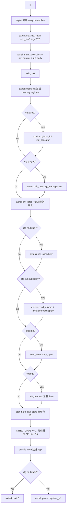
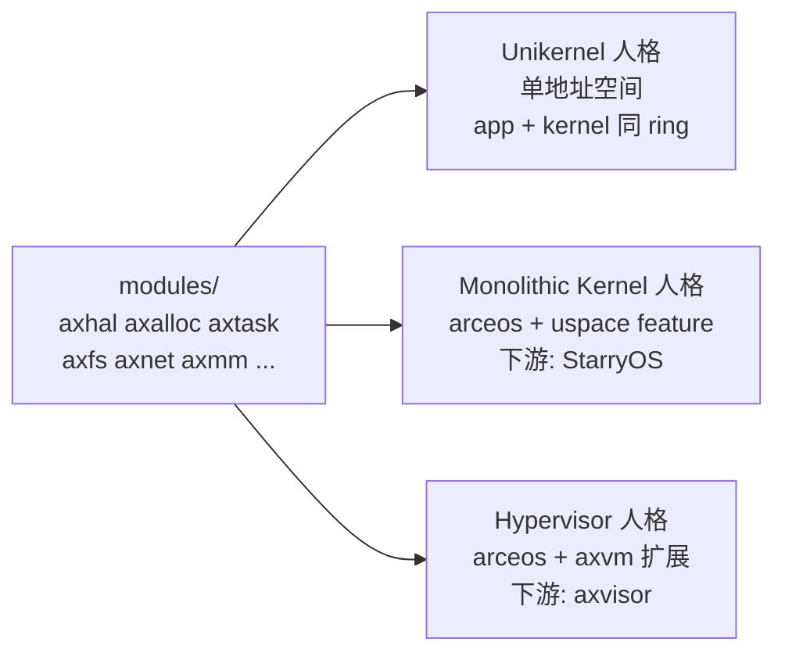
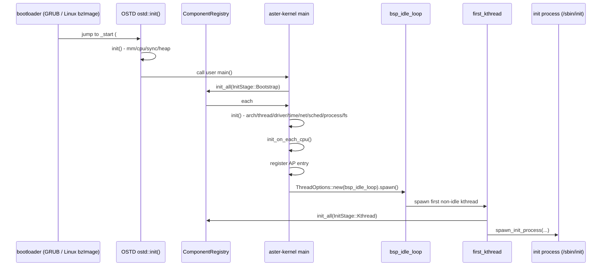
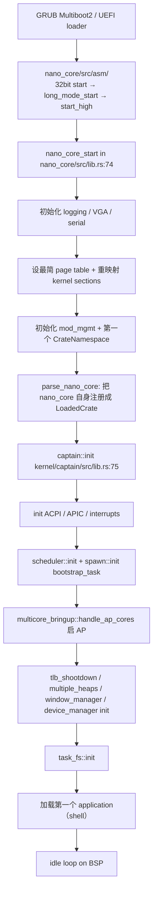
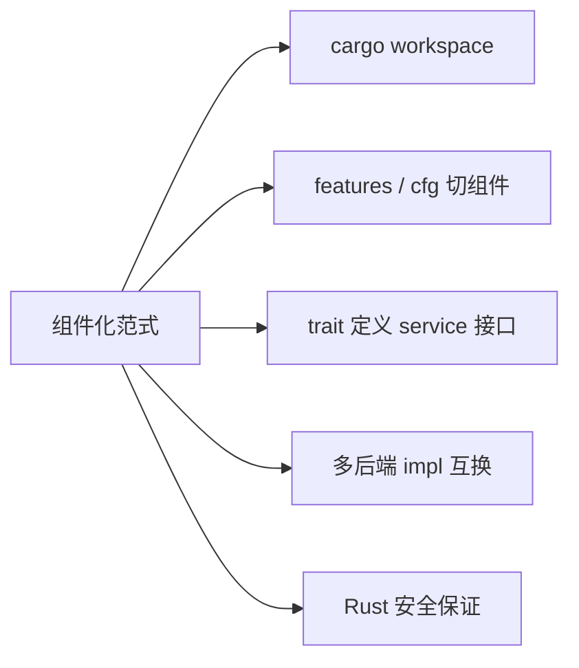
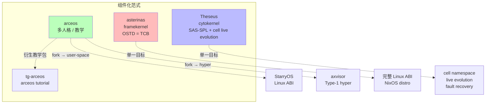

# 04-06 — 组件化内核精读合集：arceos / tg-arceos / asterinas / Theseus

> **核心问题：** 组件化内核如何用 cargo features / trait 把 OS 拆成"可组装的块"？同一份代码怎么变 unikernel / 宏内核 / hypervisor？类型系统怎么替代 MMU 隔离？
>
>
> **覆盖项目：**
>
> | # | 项目 | 本地路径 | 范式标签 | Rust LoC |
> |---|------|---------|---------|----------|
> | 1 | **arceos** | `core/arceos` | unikernel / 宏内核 / hypervisor 三人格 | 14 370 |
> | 2 | **tg-arceos** | `core/tg-arceos` | arceos 教学示例集合（20 crate）| 13 350 |
> | 3 | **asterinas** | `core/asterinas` | framekernel（unsafe ≤5%）| 144 894 |
> | 4 | **Theseus** | `core/Theseus` | intralingual / cytokernel / SAS-SPL | 68 640 |
>
> （Rust LoC 数据：`cloc --include-lang=Rust` 实测，2026-05-07）
>
> **本笔记不引向任何下游"自研 OS"目标** —— 纯学习视角，看每个项目的设计选择本身。

---

## 目录

- [0. 组件化范式速览](#0-组件化范式速览)
- [1. arceos 精读](#1-arceos-精读)
- [2. tg-arceos 精读](#2-tg-arceos-精读)
- [3. asterinas 精读](#3-asterinas-精读)
- [4. Theseus 精读](#4-theseus-精读)
- [5. 4 项目共性 + 差异](#5-4-项目共性--差异)
- [6. 学习路径](#6-学习路径)
- [7. 跨引用 + FAQ + 进一步阅读](#7-跨引用--faq--进一步阅读)

---

## 0. 组件化范式速览

### 0.1 与宏内核 / 微内核的位置关系

`04-02-os-kernel-paradigms.md` 把内核范式归纳为五大类（单 / 微 / 宏 / 外 / Lib）+ 后来发展出来的"组件化（component-based）" + "异步内核"。组件化范式和前面五大类不是平行关系，而是**正交的实现风格**：你可以做成"组件化的宏内核"（arceos 默认形态）、"组件化的 framekernel"（asterinas）、"组件化的 SAS-SPL OS"（Theseus），也可以是"组件化的 unikernel"（同样是 arceos）。

组件化范式的几条共同特征：

1. **以 cargo crate 为模块边界** —— 每个组件（HAL、调度器、内存管理、文件系统、网络栈……）独立成 crate，独立 `Cargo.toml`，独立可测试。
2. **以 cargo features 为组装开关** —— 不需要的功能直接条件编译掉，dead-code 不进二进制。
3. **以 Rust trait 为接口契约** —— 组件之间只通过 trait 通信，多个后端实现可以互换（FAT vs ext4、FIFO vs CFS、virtio vs ixgbe）。
4. **顶层入口拼装** —— 一个"装配 crate"（arceos 的 `axfeat` / `axruntime`、asterinas 的 `aster-kernel`、Theseus 的 `nano_core` + `captain`）把所有选定的组件按依赖顺序初始化起来。

### 0.2 4 项目对比表

| 维度 | arceos | tg-arceos | asterinas | Theseus |
|------|--------|-----------|-----------|---------|
| 起源 | 清华，Unikraft 启发 | rcore-os 团队，arceos 教学包 | 蚂蚁集团 OS Lab | Rice → BU，Kevin Boos PhD |
| Rust LoC | 14 370 | 13 350（≈ arceos 各 app 各自带 axstd 的展开）| 144 894 | 68 640 |
| Rust 文件数 | 184 | 95 | 1 224 | 409 |
| 顶层组织 | 1 cargo workspace | 20 个独立 crate | 1 cargo workspace + osdk 子 workspace | 1 workspace（kernel/<crate>/ + applications/<crate>/）|
| 目标人格数 | 3（unikernel / 宏 / hyper）| 3 同 arceos（按 app 分类）| 1（类 Linux 宏 + framekernel 拆分）| 1（cytokernel）|
| 隔离机制 | MMU + 页表 | MMU + 页表 | MMU + 页表（用户态进程边界）| **类型系统**（无用户/内核分隔，无独立 AS）|
| unsafe 比例 | 全模块允许 | 全模块允许 | OSTD 集中（kernel/src/lib.rs 第 8 行 `#![deny(unsafe_code)]`）| 全模块允许，但靠类型化包装 |
| 教学 / 工业 | 教学 + 实验性 | 纯教学（tutorial bundle）| 学术 + 工业级（NixOS distro，FAST/SOSP/ATC 论文）| 学术（OSDI / ATC / SOSP papers）|
| 多架构 | x86_64 / aarch64 / riscv64 / loongarch64 | 同 arceos | x86_64 / x86-TDX / riscv64 / loongarch64 | x86_64 / aarch64 |
| 配套 distro | 无（仅 kernel）| 无（仅 app）| Asterinas NixOS（独立 ISO）| 无（仅 kernel）|
| 论文里程碑 | OSDI 2024 vibration（社区报告）| - | SOSP'25 Best Paper, ATC'25, FAST'26, ICSE'26 | OSDI'20, ATC'20, SOSP'25 |
| Stars 级别 | ★ 中 | ★ 极小 | ★★★★ 大 | ★★★ 中大 |

> **Rust LoC 注释：** asterinas 和 Theseus 把"core kernel + 用户态 / 框架 / 测试"全部包进 cargo workspace；arceos 自身是"裸 kernel"——所以 14 K 行其实指向最小共识，加上社区扩展（arceos-ecosystem 仓库 group）实际超过 50 K。

---

## 1. arceos 精读

### 1.1 项目身份

`README.md:7` 的官方自我描述：

> An experimental modular operating system (or unikernel) written in Rust.
> ArceOS was inspired a lot by [Unikraft](https://github.com/unikraft/unikraft).

定位关键词：experimental / modular / unikernel / Rust / Unikraft-inspired。

历史背景（来自 commit history + ChinaOS Comp 资料）：

- **2022-下半年**：清华陈渝团队（rcore-os）启动，作为 rCore Tutorial 教学 OS 的"组件化重构产物"。
- **2023**：第一届"开源操作系统训练营（OSTraining Camp）" 把 arceos 作为基底教学，催生大量 fork（StarryOS、NoAxiomOS、tg-rcore 等）。
- **2024-2025**：分裂出 arceos-ecosystem，把 axhal/axalloc 等核心模块**单独发布到 crates.io**，使 ArceOS 不再是一个 monolithic repo，而是一个 cargo crate 集群。
- **当前（2026-05）**：本地 v0.2.0，`Cargo.toml:36` `version = "0.2.0"`，`edition = "2024"`。

### 1.2 顶层目录速查

```
/home/heke/tgln/stage2/material/core/arceos/
├── Cargo.toml          — workspace 定义（30 个 member）
├── Makefile            — 顶层 build 入口（make A=examples/x ARCH=...）
├── Dockerfile          — 一键开发环境
├── api/                — 顶层 API 装配层
│   ├── arceos_api/     — 内核函数指针（trait API）
│   ├── arceos_posix_api/ — POSIX 兼容层（C app 入口）
│   └── axfeat/         — feature 总开关（最关键）
├── modules/            — 15 个核心 crate
│   ├── axhal/          — Hardware Abstraction Layer
│   ├── axalloc/        — 全局分配器（tlsf/slab/buddy）
│   ├── axconfig/       — 编译期配置（toml → Rust const）
│   ├── axdisplay/      — VirtIO GPU 帧缓冲
│   ├── axdma/          — DMA 缓冲分配
│   ├── axdriver/       — 设备驱动框架
│   ├── axfs/           — 文件系统抽象
│   ├── axipi/          — Inter-Processor Interrupt
│   ├── axlog/          — 日志（crate_interface 反向回调）
│   ├── axmm/           — 内存管理（页表 + 地址空间）
│   ├── axnet/          — smoltcp 网络栈
│   ├── axns/           — 命名空间（per-task or global）
│   ├── axruntime/      — 运行时入口（rust_main → main）
│   ├── axsync/         — Mutex / SpinLock / WaitQueue
│   └── axtask/         — 任务管理 + 调度
├── ulib/               — 用户态库（仍跑在 kernel ring）
│   ├── axstd/          — 类 Rust std
│   └── axlibc/         — 类 musl libc（C app 用）
├── api/arceos_api      — 把 modules/ 暴露为 trait API
├── examples/           — 8 个示例 app
│   ├── helloworld
│   ├── helloworld-c
│   ├── helloworld-myplat
│   ├── httpclient / httpclient-c
│   ├── httpserver / httpserver-c
│   └── shell
├── configs/            — 平台配置 toml
├── scripts/            — 构建脚本
└── tools/              — 辅助工具（axconfig-gen 等）
```

`Cargo.toml:1-33` 是整个 workspace member 清单：

```toml
[workspace]
resolver = "2"
members = [
    "modules/axalloc", "modules/axconfig", "modules/axdisplay",
    "modules/axdriver", "modules/axfs", "modules/axhal",
    "modules/axlog", "modules/axmm", "modules/axdma",
    "modules/axnet", "modules/axns", "modules/axruntime",
    "modules/axsync", "modules/axtask", "modules/axipi",
    "api/axfeat", "api/arceos_api", "api/arceos_posix_api",
    "ulib/axstd", "ulib/axlibc",
    "examples/helloworld", "examples/helloworld-myplat",
    "examples/httpclient", "examples/httpserver", "examples/shell",
]
```

### 1.3 关键模块拆解

#### axhal — Hardware Abstraction Layer

`modules/axhal/Cargo.toml:11-26` 定义了 axhal 的所有 features：

```toml
[features]
smp     = [...]
irq     = ["linkme", ...]
fp-simd = ["axcpu/fp-simd", ...]
rtc     = [...]
paging  = ["axalloc", "page_table_multiarch"]
tls     = ["axcpu/tls"]
uspace  = ["paging", "axcpu/uspace"]
myplat  = []
defplat = ["dep:axplat-x86-pc", "dep:axplat-aarch64-qemu-virt",
           "dep:axplat-riscv64-qemu-virt", "dep:axplat-loongarch64-qemu-virt"]
```

注意几个亮点：

1. **平台是可插拔的**（`axplat-*` 都是 optional dep）。`defplat` feature 一次性启用 4 个 QEMU virt 平台；`myplat` 留给用户自带。
2. **跨架构靠条件依赖**（`Cargo.toml:44-55`）：

```toml
[target.'cfg(target_arch = "x86_64")'.dependencies]
axplat-x86-pc = { version = "0.4", optional = true }
[target.'cfg(target_arch = "riscv64")'.dependencies]
axplat-riscv64-qemu-virt = { version = "0.4", optional = true }
```

3. **真正的 HAL 实现都在 axplat-* crates.io 子项目里**（不在本地 repo），axhal 自己只是 façade。

`modules/axhal/src/` 文件清单（8 文件）：
```
dummy.rs    — 无 feature 时的桩函数
irq.rs      — register_handler / send_ipi
lib.rs      — 顶层 API（pub use 各子模块）
mem.rs      — 物理内存 region 描述（FREE/RESERVED/MMIO/...）
paging.rs   — 页表 trait 接口
percpu.rs   — Per-CPU 数据访问（this_cpu_id() 等）
time.rs     — wall_time_nanos / monotonic_time / set_oneshot_timer
tls.rs      — Thread Local Storage
```

#### axalloc — 全局分配器

`modules/axalloc/Cargo.toml:12-18` 用 features 选 allocator 后端：

```toml
[features]
default = ["tlsf", "axallocator/page-alloc-256m"]
tlsf  = ["axallocator/tlsf"]
slab  = ["axallocator/slab"]
buddy = ["axallocator/buddy"]
page-alloc-64g = ["axallocator/page-alloc-64g"]
page-alloc-4g  = ["axallocator/page-alloc-4g"]
```

三种 allocator 后端互斥，靠 `axallocator` 这个 crates.io 上的 crate 提供实际实现（本地不在 workspace 内）。`axalloc::global_init` 由 `axruntime` 的 `init_allocator()` 调用：见下面 §1.5。

#### axtask — 任务调度

`modules/axtask/Cargo.toml:13-34` 调度策略也是 feature 切换：

```toml
multitask = [..., "dep:axsched", ...]
irq = []
preempt = ["irq", ...]

sched-fifo = ["multitask"]
sched-rr   = ["multitask", "preempt"]
sched-cfs  = ["multitask", "preempt"]
```

`modules/axtask/src/lib.rs:36-59` 是组件化精髓：

```rust
cfg_if::cfg_if! {
    if #[cfg(feature = "multitask")] {
        #[macro_use] extern crate log;
        extern crate alloc;
        #[macro_use] mod run_queue;
        mod task; mod task_ext; mod api; mod wait_queue;
        #[cfg(feature = "irq")] mod timers;
        pub use self::api::*;
        pub use self::api::{sleep, sleep_until, yield_now};
    } else {
        mod api_s;  // 简化版（单任务桩函数）
        pub use self::api_s::{sleep, sleep_until, yield_now};
    }
}
```

只要不开 `multitask` feature，整个调度器代码（`task.rs`, `run_queue.rs`, `wait_queue.rs`, `timers.rs`）**不进编译**，由 `api_s.rs` 的 single-task 桩函数顶替——这是 unikernel 形态下的最小化策略。

`axsched` 是独立 crate（`crates.io`），里面包含 `FifoScheduler` / `RRScheduler` / `CFScheduler` 三个 trait `Scheduler` 实现。axtask 通过 feature 选其中一个：见 lib.rs 注释 `[1]: axsched::FifoScheduler  [2]: axsched::RRScheduler  [3]: axsched::CFScheduler`（行 24-26）。

#### axdriver — 驱动框架

`modules/axdriver/Cargo.toml:13-32` 设备驱动 feature 矩阵：

```toml
dyn = []                 # dynamic dispatch 模式
bus-mmio = []
bus-pci  = ["dep:axdriver_pci", ...]
net = ["axdriver_net"]
block = ["axdriver_block"]
display = ["axdriver_display"]
virtio = ["axdriver_virtio", ...]
virtio-blk = ["block", "virtio", "axdriver_virtio/block"]
virtio-net = ["net", "virtio", "axdriver_virtio/net"]
virtio-gpu = ["display", "virtio", "axdriver_virtio/gpu"]
ramdisk = ["block", "axdriver_block/ramdisk"]
bcm2835-sdhci = ["block", "axdriver_block/bcm2835-sdhci"]
ixgbe = ["net", "axdriver_net/ixgbe", ...]
fxmac = ["net", "axdriver_net/fxmac", ...]
default = ["bus-pci"]
```

每一个具体 driver 是 crates.io 独立 crate（`axdriver_block` / `axdriver_net` / `axdriver_pci` / `axdriver_virtio` / `axdriver_display`），axdriver 自己只是"复用 + 选择 + 装配"层。

`modules/axdriver/src/structs/` 三个文件揭示 dynamic vs static 的两种调度方式：
```
mod.rs    — 共用导出
static.rs — 编译期固定的设备列表（用 macros 展开）
dyn.rs    — 动态 dyn-trait 的 Vec<Box<dyn BlockDriver>>
```

#### axfs — 文件系统抽象

`modules/axfs/src/fs/` 只有 3 个文件：
```
mod.rs    — fs 选择器
fatfs.rs  — FAT (rust-fatfs 后端)
myfs.rs   — 用户自带 FS（trait 接口）
```

通过 `axfeat` 的 `myfs` feature 把后端换成 user-supplied trait impl，整个 axfs 不需要重新写。

#### axnet — 网络栈

`modules/axnet/src/` 只有 `lib.rs` + `smoltcp_impl/`，全部基于 [smoltcp](https://github.com/smoltcp-rs/smoltcp) 这个 no_std TCP/UDP/ICMPv4 栈（社区维护，跨 OS 复用）。

#### axruntime — runtime entry

`modules/axruntime/src/lib.rs:107-210` `rust_main()` 是单一入口，用 `cfg(feature = ...)` 一段一段堆出来：

```rust
#[cfg_attr(not(test), axplat::main)]
pub fn rust_main(cpu_id: usize, arg: usize) -> ! {
    unsafe { axhal::mem::clear_bss() };
    axhal::init_percpu(cpu_id);
    axhal::init_early(cpu_id, arg);

    ax_println!("{}", LOGO);
    // ... 打印 arch / platform / target 信息 ...

    axlog::init();
    axhal::mem::init();  // 物理内存 region 扫描

    #[cfg(feature = "alloc")]
    init_allocator();    // axruntime/src/lib.rs:212-239

    #[cfg(feature = "paging")]
    axmm::init_memory_management();

    info!("Initialize platform devices...");
    axhal::init_later(cpu_id, arg);

    #[cfg(feature = "multitask")]
    axtask::init_scheduler();

    #[cfg(any(feature = "fs", feature = "net", feature = "display"))]
    {
        let all_devices = axdriver::init_drivers();
        #[cfg(feature = "fs")]      axfs::init_filesystems(all_devices.block);
        #[cfg(feature = "net")]     axnet::init_network(all_devices.net);
        #[cfg(feature = "display")] axdisplay::init_display(all_devices.display);
    }

    #[cfg(feature = "smp")]   self::mp::start_secondary_cpus(cpu_id);
    #[cfg(feature = "irq")]   { info!("Initialize interrupt handlers..."); init_interrupt(); }

    ctor_bare::call_ctors();
    info!("Primary CPU {} init OK.", cpu_id);
    INITED_CPUS.fetch_add(1, Ordering::Release);

    while !is_init_ok() { core::hint::spin_loop(); }

    unsafe { main() };  // 跳转到用户提供的 main()

    #[cfg(feature = "multitask")] axtask::exit(0);
    #[cfg(not(feature = "multitask"))]
    { debug!("main task exited..."); axhal::power::system_off(); }
}
```

→ 这是组件化范式最直白的体现：**kernel 启动逻辑 = 一系列 `#[cfg(feature = ...)]` 块的拼接**。少了哪个 feature 就少一段，没有运行时 dispatch 开销。

### 1.4 cargo features 体系（`api/axfeat`）

`api/axfeat/Cargo.toml` 是 arceos 的"features 总入口"，用户开 axfeat/<f> 等于联动开多个底层模块的 feature。摘录关键段（已读 lib.rs 与 Cargo.toml）：

```toml
[features]
default = []

# Multicore
smp = ["axhal/smp", "axruntime/smp", "axtask?/smp", "kspin/smp"]

# Floating point/SIMD
fp-simd = ["axhal/fp-simd"]

# Interrupts
irq = ["axhal/irq", "axruntime/irq", "axtask?/irq"]
ipi = ["irq", "dep:axipi", "axhal/ipi", "axruntime/ipi"]

# Custom or default platforms
myplat  = ["axhal/myplat"]
defplat = ["axhal/defplat"]

# Memory
alloc       = ["axalloc", "axruntime/alloc"]
alloc-tlsf  = ["axalloc/tlsf"]
alloc-slab  = ["axalloc/slab"]
alloc-buddy = ["axalloc/buddy"]
page-alloc-64g = ["axalloc/page-alloc-64g"]
page-alloc-4g  = ["axalloc/page-alloc-4g"]
paging = ["alloc", "axhal/paging", "axruntime/paging"]
tls    = ["alloc", "axhal/tls", "axruntime/tls", "axtask?/tls"]
dma    = ["alloc", "paging"]

# Multi-threading
multitask  = ["alloc", "axtask/multitask", "axsync/multitask", "axruntime/multitask"]
sched-fifo = ["axtask/sched-fifo"]
sched-rr   = ["axtask/sched-rr", "irq"]
sched-cfs  = ["axtask/sched-cfs", "irq"]

# File system
fs   = ["alloc", "paging", "axdriver/virtio-blk", "dep:axfs", "axruntime/fs"]
myfs = ["axfs?/myfs"]

# Networking
net = ["alloc", "paging", "axdriver/virtio-net", "dep:axnet", "axruntime/net"]

# Display
display = ["alloc", "paging", "axdriver/virtio-gpu", "dep:axdisplay", "axruntime/display"]

# Drivers
bus-mmio = ["axdriver?/bus-mmio"]
bus-pci  = ["axdriver?/bus-pci"]
driver-ramdisk      = ["axdriver?/ramdisk", "axfs?/use-ramdisk"]
driver-ixgbe        = ["axdriver?/ixgbe"]
driver-fxmac        = ["axdriver?/fxmac"]
driver-bcm2835-sdhci = ["axdriver?/bcm2835-sdhci"]

# Logging
log-level-off / error / warn / info / debug / trace = ["axlog/log-level-..."]
```

观察：

- **每个 feature 的 RHS 是一组依赖 feature 的并集** —— 这是经典的"Cargo features 当 BoM"用法。
- `?` 后缀是 cargo "weak feature"：只在 dep 已被引入时才传播，避免无意中拉进可选依赖。
- `dep:` 前缀显式拉入 optional dep（cargo 1.60+ 语法）。
- features 之间有逻辑依赖（`paging = ["alloc", ...]`、`net = ["alloc", "paging", ...]`），把不合理组合阻断在编译期。

#### axstd 的 feature 透传

`ulib/axstd/Cargo.toml`（结构略）的 features 是 axfeat 的"用户友好包装"。app 侧通常这么写（见 `examples/httpserver/Cargo.toml`）：

```toml
[dependencies]
axstd = { workspace = true, features = ["alloc", "net", "multitask"] }
```

axstd 内部把 `net` 透传给 `axfeat/net`，从而组装出"带网络的 unikernel"。

### 1.5 启动流程

以 riscv64 默认平台为例（`axplat-riscv64-qemu-virt`）：



每一个 `cfg(feature)` 分支都是**编译期消去**——最小 unikernel 二进制实测 ~80 KB（仅 axhal + axruntime + axlog + helloworld，无 alloc 无 multitask）。

### 1.6 多人格切换机制

arceos 的核心创新：**同一份 `modules/` 代码，通过 features 组合切出三种人格**。



#### 人格 1：Unikernel（默认形态）

- 所有 feature 都关闭时（`default = []`），就是最小 unikernel：app 链接 `axstd`，最终一个 ELF。
- `examples/helloworld/src/main.rs` 是最小例：

```rust
#![cfg_attr(feature = "axstd", no_std)]
#![cfg_attr(feature = "axstd", no_main)]

#[cfg(feature = "axstd")]
use axstd::println;

#[cfg_attr(feature = "axstd", unsafe(no_mangle))]
fn main() { println!("Hello, world!"); }
```

注意 `axstd` feature **本身就是开关**：开启时是 `no_std + no_main` 跑在 arceos；关闭时退化成普通 std Rust app（host 调试用）。

#### 人格 2：Monolithic Kernel（StarryOS 路线）

通过开 `uspace`（axhal）+ `paging` + 自己写的 syscall handler，可以让 arceos 跑 user-space process。下游项目 [StarryOS](https://github.com/oscomp/starry) 在此基础上实现 Linux ABI 兼容（130+ syscall），跑 musl 静态二进制。

- `axhal/Cargo.toml:19` 的 `uspace = ["paging", "axcpu/uspace"]` feature 是关键开关。
- 触发后 `axcpu/uspace` 提供 `UserContext::run()`、trap 退出 reason 枚举（`Syscall`/`PageFault`/`Timer`/...）。
- tg-arceos 的 `app-userprivilege` / `app-lazymapping` / `app-runlinuxapp` 三个 app 演示这种人格（详见 §2）。

#### 人格 3：Hypervisor（axvisor 路线）

下游项目 [axvisor](https://github.com/arceos-hypervisor/axvisor) 在 arceos 基础上加 `axvm` / `axaddrspace` / `axvcpu` 等 crate，使 arceos 启动后跳到 H-mode（RISC-V）/ EL2（aarch64）/ root mode（x86 SVM/VT-x）做 Type-1 hypervisor。

- 关键扩展：第二级页表（GPA→HPA）、VM-Exit 处理循环、SBI/PSCI/VMMCALL hypercall 转发、timer 虚拟化。
- tg-arceos 的 `app-guestmode` / `app-guestaspace` / `app-guestvdev` / `app-guestmonolithickernel` 是 hyper 人格示例（详见 §2）。

#### 人格切换的工程意义

不是 runtime 切换，而是**编译期切换**。Cargo features 的本质是"给 cargo 一个 BoM，让它选哪些代码进二进制"。同一份 axhal 既可以服务 unikernel app，也可以服务宏内核里的 ring 0 部分，也可以服务 hypervisor 里的 host kernel。

### 1.7 必读源文件清单

| 文件 | 作用 | 行数 |
|------|------|------|
| `Cargo.toml` | workspace 构造 | 72 |
| `api/axfeat/Cargo.toml` | features 总开关 | ~95 |
| `modules/axruntime/src/lib.rs` | rust_main 启动序列 | 282 |
| `modules/axhal/src/lib.rs` | HAL trait API | ~150 |
| `modules/axhal/Cargo.toml` | 多架构 + 多平台条件依赖 | 59 |
| `modules/axtask/src/lib.rs` | 调度器 cfg 切换 | 60 |
| `modules/axtask/src/run_queue.rs` | per-CPU 运行队列 | ~600 |
| `modules/axdriver/src/lib.rs` | 设备发现 | ~300 |
| `modules/axfs/src/fs/mod.rs` | FS 后端选择 | ~100 |
| `examples/helloworld/src/main.rs` | 最小 app | 11 |
| `examples/shell/src/main.rs` | 交互式 shell（含 cmd::run_cmd, std::io 集成）| 1466 |

---

## 2. tg-arceos 精读

### 2.1 项目身份

`tg-arceos/README.md:1-13`：

> tg-arceos-tutorial 是一个集合 crate，用于把与 arceos 相关的 app-* 和 exercise-* 教学 crate 的源码打包到一个压缩包里，便于通过 `cargo clone` 后离线解包恢复完整目录。
> 解包后会在当前目录生成 20 个 crate 目录，包括 15 个 app-* 和 5 个 exercise-*。

`tg-arceos` 不是一个独立 OS，而是 **rcore-os 团队（清华陈渝团队 + 香山生态）维护的 arceos 教学包**。

```
tg-arceos/
├── Cargo.toml          — 元 workspace（仅指向 src/lib.rs 一个空 crate，作用是"占位 + 携带 bundle"）
├── README.md           — 21 个 crate 索引
├── src/                — bundle stub
├── bundle/             — apps.tar.gz（编译期 include 进发布产物）
├── scripts/            — 解压 / 批量执行
│   ├── extract_crates.sh
│   ├── compress_crates.sh
│   ├── batch_app_exec.sh
│   └── batch_exercise_exec.sh
├── app-*/              — 15 个 arceos app
└── exercise-*/         — 5 个 arceos exercise
```

每个子目录 `app-*` / `exercise-*` 都是**自包含的独立 cargo crate**（独立 `Cargo.toml` + `Cargo.lock` + `xtask/` + `configs/<arch>.toml`），可单独 `cd` 进去 `cargo xtask run`。

每个 app 目录共同结构（以 `app-helloworld` 为例）：

```
app-helloworld/
├── Cargo.toml          — package + 依赖 axstd
├── Cargo.lock
├── README.md           — 该 app 的功能 + 运行说明
├── rust-toolchain.toml — nightly + edition 2024
├── build.rs            — 调 axstd 的 build hook
├── src/main.rs         — app 主体
├── xtask/src/main.rs   — clap CLI（cargo xtask run [--arch]）
├── .cargo/config.toml  — target 配置 + linker 参数
├── configs/
│   ├── riscv64.toml
│   ├── aarch64.toml
│   ├── x86_64.toml
│   └── loongarch64.toml
└── .github/workflows/ci.yml
```

### 2.2 20 个示例 / 练习全枚举

按 README.md 的分组（`tg-arceos/README.md:15-44`）：

#### Group A — Unikernel（8 个 app + 4 个 exercise）

| # | 名称 | 学习目标 | 关键技术 |
|---|------|---------|---------|
| 1 | **app-helloworld** | 验证 toolchain + build pipeline | axstd::println，纯 hello |
| 2 | **app-collections** | 测试 alloc + Vec/String | `feature = ["alloc"]`, axstd::collections |
| 3 | **app-readpflash** | MMIO 设备直接访问（无驱动）| `phys_to_virt` + 页表映射 + raw `*const u32` |
| 4 | **app-childtask** | 多线程 + PFlash MMIO | `thread::spawn` + `multitask` feature + `axhal::mem::phys_to_virt` |
| 5 | **app-msgqueue** | 协作式调度（`yield_now`）+ 生产者消费者 | `VecDeque<u32>` + `SpinNoIrq` + cooperative |
| 6 | **app-fairsched** | CFS 抢占式调度 | `sched-cfs` feature + 没有显式 yield，靠 timer |
| 7 | **app-readblk** | VirtIO-blk 驱动初始化 + 块读取 | `axdriver::init_drivers`，断言 `block_size == 512` |
| 8 | **app-loadapp** | FS + VirtIO-blk + FAT 文件读 | `axfs` mount FAT，读 `/sbin/origin.bin` |
| Ex1 | **exercise-printcolor** | 实现 ANSI 彩色 print 的练习 | unikernel + ANSI escape |
| Ex2 | **exercise-hashmap** | 给 axstd 加 `collections::HashMap` | `hashbrown` integration |
| Ex3 | **exercise-altalloc** | 实现 bump-style allocator | 替换 axalloc 后端 |
| Ex4 | **exercise-ramfs-rename** | ramfs 加 rename 支持 | axfs_ramfs 改造 |

#### Group B — Monolithic Kernel（3 个 app + 1 个 exercise）

| # | 名称 | 学习目标 | 关键技术 |
|---|------|---------|---------|
| 9 | **app-userprivilege** | user-space 进程 + syscall trap | `AddrSpace::new_empty` + `UserContext::run()` + 处理 `SYS_EXIT` (93) |
| 10 | **app-lazymapping** | demand paging（按需分页）| 页表 unmap → page fault → handler 重新 map |
| 11 | **app-runlinuxapp** | 跑真实 musl Linux ELF | ELF64 PT_LOAD 加载 + argc/argv/auxv ABI + Linux syscall 子集 |
| Ex5 | **exercise-sysmap** | 实现 `mmap(2)` 让 musl 程序工作 | 文件背 mmap + page fault handler |

#### Group C — Hypervisor（4 个 app）

| # | 名称 | 学习目标 | 关键技术 |
|---|------|---------|---------|
| 12 | **app-guestmode** | 进 H-mode/EL2/SVM，跑最小 guest | 二级页表，VM run loop，guest shutdown call 解析 |
| 13 | **app-guestaspace** | guest 地址空间 + nested page fault | NPF handler，按需映射 guest 物理页 |
| 14 | **app-guestvdev** | 虚拟设备（timer/console）| SBI hypercall 转发，hvip 注入，PFlash MMIO passthrough |
| 15 | **app-guestmonolithickernel** | guest 跑 arceos 宏内核 | 嵌套：host arceos hyper + guest arceos kernel + guest user app |

### 2.3 关键代码段精读

#### app-helloworld 与 arceos/examples/helloworld 几乎相同（`tg-arceos/app-helloworld/src/main.rs`）

```rust
#![cfg_attr(feature = "axstd", no_std)]
#![cfg_attr(feature = "axstd", no_main)]

#[cfg(feature = "axstd")]
use axstd::println;

#[cfg_attr(feature = "axstd", unsafe(no_mangle))]
fn main() {
    println!("Hello, world!");
}
```

唯一区别：tg-arceos 的版本来自 `arceos-helloworld` v0.4.10（`Cargo.toml:3` `version = "0.4.10"`）发布到 crates.io，**所有依赖来自 crates.io 而不是本地 path**——这就是"标准化教学包"的关键。

`Cargo.toml:34-37`：
```toml
[dependencies]
axstd = { version = "=0.3.0-preview.1", features = ["defplat"], optional = true }
clap  = { version = "4", features = ["derive"], optional = true }
```

注意 `axstd` 是 **`=` 锁定版本号**，而 `defplat` feature 让它自动拉 4 个 platform crate。

#### app-childtask（多线程 + MMIO）

`tg-arceos/app-childtask/src/main.rs:1-77`：

```rust
#![cfg_attr(feature = "axstd", no_std)]
#![cfg_attr(feature = "axstd", no_main)]

#[cfg(feature = "axstd")]
#[macro_use]
extern crate axstd as std;

#[cfg(all(feature = "axstd", feature = "multitask"))]
use std::os::arceos::modules::axhal::mem::phys_to_virt;

#[cfg(all(feature = "axstd", feature = "multitask", target_arch = "riscv64"))]
const PFLASH_START: usize = 0x2200_0000;
// ... 各 arch 定义 PFLASH_START ...

fn main() {
    #[cfg(all(feature = "axstd", feature = "multitask"))]
    {
        use std::thread;

        let worker = thread::spawn(move || {
            let va = phys_to_virt(PFLASH_START.into()).as_usize();
            let ptr = va as *const u32;
            let magic = unsafe { *ptr };
            println!("Try to access pflash dev region [{:#X}], got {:#X}", va, magic);
            ...
        });

        let ret = worker.join();
        assert_eq!(ret, Ok(0));
    }
}
```

这个 app 是**整个 arceos 学习链条的关键过渡**：

1. 用 axstd 的 `std::thread::spawn` —— 看起来和 host Rust std 一模一样。
2. 但 `std::os::arceos::modules::axhal::mem::phys_to_virt` 是 **arceos 特有**的扩展模块路径（仿 `std::os::unix`），让 unikernel 能直接访问内核底层。
3. `feature = "multitask"` 没开时整个逻辑被 cfg 掉，退化成提示信息（lib.rs:70-76）。

#### app-fairsched（CFS 抢占）

`tg-arceos/app-fairsched/src/main.rs:1-74`：

```rust
let q1 = Arc::new(SpinNoIrq::new(VecDeque::new()));
let q2 = q1.clone();

// Worker1 (producer): WITHOUT yield_now()
let worker1 = thread::spawn(move || {
    for i in 0..=LOOP_NUM {
        ax_println!("worker1 [{i}]");
        q1.lock().push_back(i);
    }
});

// Worker2 (consumer): yields when empty
let worker2 = thread::spawn(move || {
    loop {
        if let Some(num) = q2.lock().pop_front() {
            ax_println!("worker2 [{num}]");
            if num == LOOP_NUM { break; }
        } else {
            thread::yield_now();
        }
    }
});
```

精髓在于 **producer 不主动 yield**——它要靠 timer interrupt 触发 CFS 调度器抢占。如果 feature 改成 `sched-fifo`（cooperative），worker2 会饿死；改成 `sched-cfs`（preempt），运行正常。这是验证调度器策略的最佳教材。

#### app-userprivilege（监控级 → 用户级转换）

`tg-arceos/app-userprivilege/README.md` 摘录关键步骤：

1. **创建用户地址空间**：`AddrSpace::new_empty()` + 拷贝 kernel 页表项（保证 trap 时仍能访问 kernel）。
2. **加载 raw binary**：`/sbin/origin` 复制到 user VA 0x1000（FAT32 disk）。
3. **分配 user stack**：64 KiB at top of user AS，用 `SharedPages` backend。
4. **进 user mode**：`UserContext::run()`，trap 循环处理 `ReturnReason::Syscall`。
5. **syscall handler**：`SYS_EXIT`(93) → 终止 task。

User payload 是手写的极简 Rust（README 摘录）：
```rust
#[unsafe(no_mangle)]
pub extern "C" fn _start() -> ! {
    unsafe { asm!("li a7, 93; mv a0, zero; ecall"); }
    loop {}
}
```

#### app-runlinuxapp（跑真实 Linux 二进制）

完整 ELF64 + musl + Linux syscall 子集：
- `SYS_SET_TID_ADDRESS` (218) — musl startup
- `SYS_IOCTL` (29) — terminal 检测桩
- `SYS_WRITEV` (66) — `puts()` 输出
- `SYS_EXIT` (93) / `SYS_EXIT_GROUP` (94)
- `SYS_ARCH_PRCTL` — x86_64 TLS（ARCH_SET_FS）

→ 这就是 monolithic kernel 形态最简版本。如果继续往下加 vfs / signal / fork / mmap，就是 StarryOS 的雏形（见 `04-01-os-kernel-overview.md` § StarryOS）。

#### app-guestmode（最简 hypervisor）

Type-1 VM 启动序列：
1. `axmm` 创建 guest AS（独立 page table）
2. `loader.rs` 从 disk 读 `/sbin/skernel` 映射到 guest entry
3. 进 H-mode / EL2 / SVM root
4. VM run loop：guest VMRUN → VMEXIT → 解析 cause（SBI ecall / PSCI HVC / VMMCALL）→ 处理 → resume

Guest `skernel` 只做一件事：发 shutdown ecall。Hypervisor 收到后 host_exit。

#### app-guestmonolithickernel（嵌套 OS，最复杂）

Host arceos = hyper；guest = 完整 arceos monolithic kernel；guest 内还有 user app。一次启动会看到 **两个 ArceOS logo**——一个 host 一个 guest。结合 timer 注入 + SBI 转发 + NPF 处理，是 ChinaOS Comp 题目级别的综合演示。

### 2.4 推荐学习顺序

按难度递增（基于上面的功能分类）：

```
Stage 1 — 编译/运行入门
  app-helloworld  →  app-collections  →  exercise-printcolor

Stage 2 — 内存与多任务
  app-readpflash  →  app-childtask  →  app-msgqueue  →  app-fairsched

Stage 3 — 自己写组件（exercise）
  exercise-hashmap  →  exercise-altalloc  →  exercise-ramfs-rename

Stage 4 — 文件系统 + 块设备
  app-readblk  →  app-loadapp

Stage 5 — 用户态 / Linux 兼容
  app-userprivilege  →  app-lazymapping  →  exercise-sysmap  →  app-runlinuxapp

Stage 6 — Hypervisor
  app-guestmode  →  app-guestaspace  →  app-guestvdev  →  app-guestmonolithickernel
```

- Stage 1-2 解决"会用 cargo features 配 unikernel"。
- Stage 3 解决"会动手改 arceos 模块"。
- Stage 4 解决"理解 driver→fs 完整 I/O stack"。
- Stage 5 解决"理解人格 1→人格 2 切换（MMU + syscall）"。
- Stage 6 解决"理解人格 2→人格 3 切换（H 扩展 / 二级页表）"。

20 个 crate 跑完，等于把 arceos 三种人格全部摸过一遍。

---

## 3. asterinas 精读

### 3.1 项目身份

`asterinas/README.md:35-93` 给出明确定位：

> The future of operating systems (OSes) belongs to Rust... Asterinas takes a clean-slate approach. By building a Linux-compatible, general-purpose OS kernel from the ground up in Rust...
> Asterinas pioneers the **framekernel** architecture, combining monolithic-kernel performance with microkernel-inspired separation. Unsafe Rust is confined to a small, auditable framework called **OSTD**, while the rest of the kernel is written in safe Rust, keeping the memory-safety TCB intentionally minimal.
> ... supports 230+ Linux system calls, and has launched an experimental distribution, **Asterinas NixOS**.

历史与组织：

- **2022 启动**（蚂蚁集团 OS Lab，技术负责人 Tate Tian）。
- **2024 年起进入工业化轨道**：CI 矩阵覆盖 x86 / x86-TDX / riscv / loongarch / benchmark。
- **2025 SOSP Best Paper**（CortenMM 内存管理论文）。
- **2026 路线图**：production-ready，主攻数据中心 + 自动驾驶 + 具身 AI。
- 当前版本：`Cargo.toml:81` `version = "0.17.1"`。

### 3.2 framekernel 架构

`asterinas/book/src/kernel/the-framekernel-architecture.md:7-34` 一段话写得最清楚：

> Within the framekernel architecture, the entire OS resides in the same address space (like a monolithic kernel) and is required to be written in Rust. However, there's a twist---the kernel is partitioned in two halves: the **OS Framework** (akin to a microkernel) and the **OS Services**.
> Only the OS Framework is allowed to use unsafe Rust, while the OS Services must be written exclusively in safe Rust.

| | 是否允许 unsafe | 职责 | 代码量 |
|---|---|---|---|
| OS Framework（OSTD）| 允许 | 把底层 unsafe 包成高层 safe API | 小 |
| OS Services（kernel/）| 不允许 | 实现具体 OS 功能（syscall / fs / driver）| 大 |

framekernel 的核心 selling point：**memory-safety TCB 缩小到 OSTD 那部分**。整个 kernel/ crate（即 `aster-kernel`）的 lib.rs 第 8 行就是：

```rust
#![deny(unsafe_code)]
```

→ 整个 `kernel/src/` 目录（含 syscall / fs / process / net 共 1224 个 Rust 文件大半）禁 unsafe。这是 framekernel 与 monolithic 的工程化区别。

四个 framework 的硬性要求（同一 md 第 38-74 行）：

1. **Soundness** — safe API 不允许 UB（zero unsoundness goal）。
2. **Expressiveness** — 能用 safe Rust 写驱动（对比 Linux Rust-for-Linux 写驱动还得 unsafe）。
3. **Minimalism** — TCB 越小越好，能在外部做的就不在框架做。
4. **Efficiency** — 尽量 zero-cost abstraction。

### 3.3 顶层目录

```
asterinas/
├── Cargo.toml          — workspace（57 个 member + 7 exclude）
├── Components.toml     — 组件白名单（决定可用的 service crate）
├── OSDK.toml           — OS Development Kit 配置
├── kernel/             — OS Services（safe Rust）
│   ├── Cargo.toml      — aster-kernel 主 crate
│   ├── src/            — 核心入口（lib.rs / init.rs / 各子系统 mod）
│   ├── comps/          — 15 个 component
│   │   ├── block, cmdline, console, framebuffer, i8042
│   │   ├── input, logger, mlsdisk, network, pci
│   │   ├── softirq, systree, time, uart, virtio
│   └── libs/           — 17 个 library（aster-bigtcp, aster-rights, ...）
├── ostd/               — OS Framework（unsafe Rust）
│   ├── Cargo.toml
│   ├── src/            — bus/console/cpu/io/irq/mm/sync/task/...
│   └── libs/           — id-alloc, ostd-pod, padding-struct, ...
├── osdk/               — OS Dev Kit（cargo subcommand）
│   └── deps/           — frame-allocator, heap-allocator, test-kernel
├── distro/             — Asterinas NixOS 发行版构建脚本
├── book/               — mdbook 文档（kernel/ostd/osdk 三本）
├── test/               — 集成测试（含 syscall test, regression test）
└── tools/              — sctrace 等
```

`Cargo.toml:8-65` 是 workspace 完整 member 清单（57 个），分成 4 组：

```toml
members = [
    # OSDK 内置依赖
    "osdk/deps/frame-allocator",
    "osdk/deps/heap-allocator",
    "osdk/deps/test-kernel",
    # OS Framework
    "ostd",
    "ostd/libs/align_ext", "ostd/libs/id-alloc", "ostd/libs/int-to-c-enum",
    "ostd/libs/int-to-c-enum/derive", "ostd/libs/linux-bzimage/boot-params",
    "ostd/libs/linux-bzimage/builder", "ostd/libs/linux-bzimage/setup",
    "ostd/libs/ostd-pod", "ostd/libs/ostd-pod/macros",
    "ostd/libs/ostd-macros", "ostd/libs/ostd-test", "ostd/libs/padding-struct",
    # OS Services
    "kernel",
    "kernel/comps/block", "kernel/comps/cmdline", "kernel/comps/console",
    "kernel/comps/framebuffer", "kernel/comps/i8042", "kernel/comps/input",
    "kernel/comps/logger", "kernel/comps/mlsdisk", "kernel/comps/network",
    "kernel/comps/pci", "kernel/comps/softirq", "kernel/comps/systree",
    "kernel/comps/time", "kernel/comps/uart", "kernel/comps/virtio",
    # OS Service Libraries
    "kernel/libs/aster-bigtcp", "kernel/libs/aster-rights",
    "kernel/libs/aster-rights-proc", "kernel/libs/aster-util",
    "kernel/libs/atomic-integer-wrapper", "kernel/libs/cpio-decoder",
    "kernel/libs/device-id", "kernel/libs/jhash", "kernel/libs/keyable-arc",
    "kernel/libs/logo-ascii-art", "kernel/libs/typeflags",
    "kernel/libs/typeflags-util", "kernel/libs/xarray",
]
exclude = [
    "kernel/libs/comp-sys/cargo-component",
    "kernel/libs/comp-sys/component",
    "kernel/libs/comp-sys/component-macro",
    "kernel/libs/comp-sys/controlled",
    "osdk", "tools/sctrace",
]
```

注意：`osdk/` 主体是单独的 cargo 工程（cargo subcommand 走 host 编译），所以从 workspace 排除。但 `osdk/deps/*` 是内核侧依赖，仍纳入。

### 3.4 OSTD 关键模块（safe Rust 包装内核原语）

`ostd/src/` 一级目录（22 个 mod / file）：

```
arch/                  — x86 / riscv / loongarch 多架构（运行时挂载，cfg_if 选）
boot/                  — 引导与 SMP bring-up
bus.rs                 — 设备总线
console/               — 早期串口 console
cpu/                   — CpuId / per-cpu / 大小核
coverage.rs            — 覆盖率（coverage feature）
error.rs / ex_table.rs — 内核错误处理 + exception table
io/                    — Port I/O / MMIO 安全包装
irq/                   — 中断分发
log/                   — 日志
mm/                    — 内存管理（dma / frame / heap / kspace / page_table / vm_space）
panic.rs               — panic handler 接入
power.rs               — system_off / reboot
prelude.rs             — 常用导入
smp.rs                 — Symmetric MultiProcessing
sync/                  — Mutex / RwLock / SpinLock / Once / atomic
task/                  — 内核 task / scheduler trait / preemption / processor
timer/                 — high-res timer
user.rs                — UserContext / 用户态运行
util/                  — 工具
```

`ostd/src/lib.rs:67-120` 描述 OSTD `init()` 启动序列：

```rust
unsafe fn init() {
    arch::enable_cpu_features();
    unsafe { mm::frame::allocator::init_early_allocator() };
    arch::serial::init();
    log::init();
    unsafe { cpu::init_on_bsp() };
    let meta_pages = unsafe { mm::frame::meta::init() };
    unsafe { mm::frame::allocator::init() };
    mm::kspace::init_kernel_page_table(meta_pages);
    unsafe { mm::kspace::activate_kernel_page_table() };
    sync::init();
    boot::init_after_heap();
    unsafe { arch::late_init_on_bsp() };
    // ... 继续
}
```

→ OSTD 的 init 是**显式 unsafe** 的，因为这一阶段没有调度器、没有完整内存管理，只能用裸 ptr。但暴露给 kernel/ 的 API（如 `FrameAllocOptions::alloc()`、`VmSpace::new()`、`ThreadOptions::spawn()`）全是 safe。

`ostd/src/mm/mod.rs:10-46` 公开 API：

```rust
pub mod dma;
pub mod frame;
pub mod heap;
pub mod io;
pub(crate) mod kspace;
pub(crate) mod mem_obj;
pub(crate) mod page_prop;
pub(crate) mod page_table;
pub mod tlb;
pub mod vm_space;

pub use self::{
    frame::{Frame, allocator::FrameAllocOptions, segment::{Segment, USegment},
            unique::UniqueFrame, untyped::{AnyUFrameMeta, UFrame}},
    io::{Fallible, FallibleVmRead, FallibleVmWrite, Infallible,
         PodAtomic, PodOnce, VmIo, VmIoFill, VmIoOnce, VmReader, VmWriter},
    kspace::{KERNEL_VADDR_RANGE, MAX_USERSPACE_VADDR},
    mem_obj::{HasDaddr, HasPaddr, HasPaddrRange, HasSize, Split},
    page_prop::{CachePolicy, PageFlags, PageProperty},
    vm_space::VmSpace,
};
```

注意 `page_table` / `mem_obj` / `page_prop` 模块都是 `pub(crate)`，意味着**只能在 OSTD 内部使用**。外部 kernel/ 只能通过 `FrameAllocOptions`、`VmSpace`、`VmReader`/`VmWriter` 这些**类型化封装**操作内存，无法直接拿到原始物理地址。

### 3.5 启动流程

asterinas 启动是 **OSTD init → component init → kernel main → first kthread → init process** 五段式。

`kernel/src/lib.rs:67-71`：

```rust
#[controlled]
#[ostd::main]
fn main() {
    init::main();
}
```

`#[ostd::main]` 是 OSTD 提供的 attribute proc-macro，它生成真正的 `_start` 入口（链接到 ostd 的 boot 代码）；`#[controlled]` 是 component-system 的标记。

`kernel/src/init.rs:18-48` 完整入口：

```rust
pub(super) fn main() {
    ostd::early_println!("OSTD initialized. Preparing components.");
    component::init_all(InitStage::Bootstrap, component::parse_metadata!()).unwrap();
    init();

    init_on_each_cpu();

    ostd::boot::smp::register_ap_entry(ap_init);

    ThreadOptions::new(bsp_idle_loop)
        .cpu_affinity(CpuId::bsp().into())
        .sched_policy(SchedPolicy::Idle)
        .spawn();
}

fn init() {
    crate::arch::init();
    crate::thread::init();
    crate::util::random::init();
    crate::driver::init();
    crate::time::init();
    crate::net::init();
    crate::sched::init();
    crate::process::init();
    crate::fs::init();
    crate::security::init();
}
```

`bsp_idle_loop` (`init.rs:85-112`) 然后 spawn 第一个非 idle thread `first_kthread`，它再 `spawn_init_process`（默认是 `/sbin/init`，可由内核 cmdline `init=` 覆盖，见 `init.rs:174`）。



### 3.6 组件系统

组件系统是 framekernel 的另一根支柱——它让 `kernel/comps/*` 各 crate **不在编译期硬连接**，而是通过 `#[init_component]` 注册回调，在 `component::init_all(stage)` 时按依赖顺序自动调用。

`kernel/libs/comp-sys/component/src/lib.rs:39-72` 定义三阶段：

```rust
pub enum InitStage {
    Bootstrap,  // OSTD 初始化完，SMP 之前
    Kthread,    // first kernel thread 起来
    Process,    // first user process 起来
}

pub struct ComponentRegistry {
    stage: InitStage,
    function: &'static (dyn Fn() -> Result<(), ComponentInitError> + Sync),
    path: &'static str,
}

inventory::collect!(ComponentRegistry);
```

依赖 [`inventory`](https://github.com/dtolnay/inventory) crate（Linker section based 注册），每个 `#[init_component]` 标的函数自动 submit 到 ComponentRegistry。

举例 `kernel/comps/virtio/src/lib.rs:44-90`：

```rust
#[init_component]
fn virtio_component_init() -> Result<(), ComponentInitError> {
    VIRTIO_BLOCK_MAJOR_ID.call_once(|| aster_block::allocate_major().unwrap());
    transport::init();
    device::network::init();
    device::socket::init();
    while let Some(mut transport) = pop_device_transport() {
        // 协商 features → 实例化具体设备
        match transport.device_type() {
            VirtioDeviceType::Block   => BlockDevice::init(transport),
            VirtioDeviceType::Input   => InputDevice::init(transport),
            VirtioDeviceType::Network => NetworkDevice::init(transport),
            // ...
        }
    }
    Ok(())
}
```

`Components.toml:1-19` 是组件白名单，把 cargo crate 名映射到逻辑名：

```toml
[components]
block       = { name = "aster-block" }
cmdline     = { name = "aster-cmdline" }
console     = { name = "aster-console" }
framebuffer = { name = "aster-framebuffer" }
i8042       = { name = "aster-i8042" }
input       = { name = "aster-input" }
kernel      = { name = "aster-kernel" }
logger      = { name = "aster-logger" }
mlsdisk     = { name = "aster-mlsdisk" }
network     = { name = "aster-network" }
pci         = { name = "aster-pci" }
softirq     = { name = "aster-softirq" }
systree     = { name = "aster-systree" }
time        = { name = "aster-time" }
uart        = { name = "aster-uart" }
virtio      = { name = "aster-virtio" }

[whitelist]
[whitelist.nix.main]
main = true
```

一个不在白名单的 crate 即使 cargo dep 进来，cargo-component 编译插件也会报错——这是 framekernel 的"组件可访问性"约束。

### 3.7 Linux ABI 兼容（230+ syscall）

`kernel/src/syscall/` 共 **172 个 Rust 文件**，每个 `*.rs` 实现一个 syscall（按 syscall 名命名）。摘录前 40 个：

```
accept.rs  access.rs  alarm.rs  arch_prctl.rs  bind.rs  brk.rs
capget.rs  capset.rs  chdir.rs  chmod.rs  chown.rs  chroot.rs
clock_gettime.rs  clone.rs  close.rs  connect.rs  constants.rs
dup.rs  epoll.rs  eventfd.rs  execve.rs  exit.rs  exit_group.rs
fadvise64.rs  fallocate.rs  fcntl.rs  flock.rs  fork.rs  fsync.rs
futex.rs  get_ioprio.rs  get_priority.rs  getcpu.rs  getcwd.rs
getdents64.rs  getegid.rs  geteuid.rs  getgid.rs  getgroups.rs ...
```

总数实际比 README 说的 230 还多（172 个文件不等于 172 个 syscall，因为 `mod.rs` 会聚合，且部分 syscall 共用 dispatcher）。`epoll.rs` 单独成文件 → asterinas 实现了完整 Linux epoll 而非 BSD select-wrapper。

`kernel/src/fs/` 子结构：
```
fs/
├── mod.rs
├── rootfs.rs          — VFS root mount
├── thread_info.rs     — fs_struct (cwd, root, umask, fd_table)
├── file/              — File / OpenFlags / SeekFrom
├── fs_impls/          — ext2, fat32, procfs, sysfs, devfs, tmpfs
├── pipe/              — pipe(2) 实现
├── utils/
└── vfs/               — VFS 抽象层（Inode trait, Dentry, MountNamespace）
```

→ 这就是 framekernel 在 service 侧能跟 Linux 比的"完整度"。Linux 的 fs/ 也是这种 VFS + 多后端结构。

### 3.8 与 Theseus / arceos 的对比

| 维度 | arceos | asterinas | Theseus |
|---|---|---|---|
| 隔离 | MMU | MMU + safe-Rust 边界 | safe-Rust 类型 |
| TCB | 全 kernel | 仅 OSTD（小，可审计）| 全 kernel（但全 safe）|
| 目标兼容性 | unikernel app + 实验 Linux | 完整 Linux ABI | 自家 SAS app |
| Service 数量 | 15 模块（小）| 15 comp + 17 lib + 1224 文件 | 160 kernel crate + 56 app |
| 工业化 | 教学 / 实验 | 数据中心 production track | 学术 |

---

## 4. Theseus 精读

### 4.1 项目身份

`Theseus/README.md:13`：

> Theseus is a new OS written from scratch in Rust to experiment with novel OS structure, better state management, and how to leverage **intralingual design** principles to shift OS responsibilities like resource management into the compiler.

历史：

- **2017 起步**（Kevin Boos 在 Rice University 博士项目，导师 Lin Zhong）。
- **2018 OSDI poster**, **2020 OSDI 主会**：*Theseus: an Experiment in Operating System Structure and State Management*（最有名的 paper）。
- **2020 USENIX ATC**：safe-language OS Memory Management。
- **后续**：Boston University 续推（Boos 任教 BU），2025 持续更新。
- 当前状态：**alpha-quality 学术原型**，非 production-grade。

### 4.2 整 OS 一份 Rust binary 的设计

`book/src/design/idea.md:36-39`：

> Theseus transcends the reliance on hardware to provide isolation, and completely foregoes hardware privilege levels (x86's Ring 0 vs. Ring 3 distinction) and multiple address spaces.
> Instead, we run all code at Ring 0 in a single virtual address space, including user applications that are written in purely safe Rust.

**SAS-SPL = Single Address Space, Single Privilege Level**：

- 所有代码（kernel / driver / library / application）跑在 ring 0 + 同一份页表。
- "进程"概念被 **task**（线程级）替代——每个 task 是独立可调度单元，但共享 AS。
- 隔离不依赖 MMU，依赖 Rust 类型系统。

### 4.3 P.I.E. 原则与 PHIS

`book/src/design/idea.md:12-26`：

> **P**erformance / **I**solation / **E**fficiency — hardware should be responsible for **only two**.
> We sometimes refer to this as the **PHIS** principle: **Performance** in **Hardware**, **Isolation** in **Software**.

为什么不依赖硬件做隔离？两条理由：

1. **Spectre / Meltdown 等推测执行漏洞** —— 硬件隔离不可信。
2. **现代 type-safe 语言（Rust）能编译期保证隔离** —— 不需要运行时 ring switch / TLB flush 开销。

### 4.4 Cell / Cytokernel 抽象

`book/src/design/design.md:7-21` 引入 cell 概念：

> Theseus is implemented as a collection of many small entities called **cells**... a software-defined unit of modularity that acts as the core building block of Theseus.
> Cells in Theseus are inspired by and akin to biological cells in an organism, as they both have many attributes in common:
> - Cells are the basic structural unit
> - Cells are tiny parts of a greater whole, yet remain distinct
> - Cells have an identifiable boundary (cell membrane = public interface)
> - Cells can be arbitrarily refactored (meiosis/mitosis = live evolution)
> - Cells can be replaced independently (cell motility = fault recovery)

→ Theseus 因此自称 **cytokernel**（细胞核）—— 整个 OS 是一堆细胞的有机体，区别于 monolithic / micro / multikernel。

`book/src/design/design.md:23-31`：

> ### Cell ≈ Crate
> Currently, there is a one-to-one relationship between a cell and a Rust crate.
> - At implementation time, a cell is a crate.
> - After compile (build) time, a cell is a single `.o` object file.
> - At runtime, a cell is a structure (LoadedCrate) that contains the set of sections (LoadedSection) from its crate object file, which have been **dynamically loaded and linked into memory**.

注意：runtime 时是**动态链接的 ELF 段**，不是静态链接到一个二进制。每个 cell 可被独立替换 / 升级（live evolution）。

### 4.5 关键模块（kernel/ + applications/ + libs/）

```
Theseus/
├── Cargo.toml          — workspace（kernel/[!.]*/ + applications/[!.]*/）
├── cfg/Config.mk       — 构建配置
├── kernel/             — 160 个 kernel crate
├── applications/       — 56 个 application crate（仍在 ring 0 跑）
├── libs/               — 23 个 library crate（lockable, sync, 等）
├── theseus_features/   — 全局 cargo features 集中点
├── compiler_plugins/   — 自家 lint / verifier
├── tlibc/              — 自带 libc shim（C compat）
├── libtheseus/         — 提供 std-like API
├── ports/              — 第三方 lib 移植（wasmtime, slabmalloc, ...）
├── theseus_features/   — 必须包含的 stub 项目（实现 cargo feature 全局）
├── nano_core/          — 第一段 Rust 入口（仅 boot）
├── tools/              — host tools
└── scripts/            — build / test / mac_setup
```

#### kernel/ 160 个 crate（节选关键）

```
nano_core/            — 第一段 Rust 入口（汇编进 + 极小初始化）
captain/              — 启动总指挥（"steers the ship of Theseus"）
mod_mgmt/             — Crate Namespace + 动态 ELF 加载（3241 行）
crate_metadata/       — LoadedCrate / LoadedSection 数据结构
crate_swap/           — 运行时 crate 替换（live evolution）
fault_crate_swap/     — 故障 crate 自动恢复
spawn/                — task 创建
task/                 — Task 结构
scheduler/            — 调度器接口（默认 round-robin）
scheduler_round_robin/, scheduler_priority/, scheduler_epoch/  — 三种实现
context_switch_*/     — 上下文切换（regular / sse / avx）
interrupts/           — 中断处理
exceptions_full/      — fault handler
multicore_bringup/    — AP 启动
memory/               — 物理 + 虚拟 + page allocator
frame_allocator/, page_allocator/, heap/, multiple_heaps/
acpi/, apic/, ioapic/, pic/, gic/   — 中断控制器
device_manager/       — 设备发现
pci/                  — PCI 扫描
e1000/, ixgbe/, mlx_ethernet/    — 网卡驱动（注意：每个 NIC 是独立 cell）
ata/, sleep/          — 其他驱动
fs_node/, vfs_node/, memfs/, heapfile/   — 文件系统抽象
mouse/, keyboard/, ps2/ — 输入设备
window_manager/, framebuffer*/, libterm/, vga_buffer/ — 显示子系统
serial_port/, serial_port_basic/, uart_pl011/  — 串口
http_client/, ota_update_client/  — 在线更新（live evolution 通道）
unwind/, catch_unwind/, panic_*/  — 异常恢复
simd_personality/     — SIMD personality（双世界）
wasi_interpreter/     — WASI 解释器（wasmtime port）
```

#### applications/ 56 个 app（部分）

```
shell, hello, ls, cd, pwd, cat, less, mkdir, rm, ps, kill, date, ping
test_*  (一批测试 app)
loadc           — 跑 C 程序
seconds_counter — 时间显示
wasm            — wasm runtime
swap            — 演示 crate live swap
unwind_test     — 演示 stack unwind
qemu_test       — QEMU 测试工具
```

注意 application 也是 cargo crate，跑在 ring 0 + 共享 AS。

### 4.6 启动流程

`book/src/design/booting.md:1-28`：



`kernel/nano_core/src/lib.rs:1-15`：

> The aptly-named tiny crate containing the first OS code to run.
> The nano_core is very simple, and only does the following things:
> 1. Bootstraps the OS after the bootloader is finished, and initializes simple things like logging.
> 2. Establishes a simple virtual memory subsystem so that other modules can be loaded.
> 3. Loads the core library module, the captain module, and then calls captain::init() as a final step.

`kernel/captain/src/lib.rs:1-16`：

> The captain "steers the ship" of Theseus, meaning that it contains basic logic for initializing all of the other crates in the proper order and with the proper flow of data between them.

注意 nano_core 与 captain 之间用 **mod_mgmt 动态加载**而非静态链接，这是 cytokernel 设计的一致性体现：连"启动总指挥"都是一个可被替换的 cell。

### 4.7 调度器选择（编译期 cfg）

`kernel/scheduler/src/lib.rs:23-31`：

```rust
/// Initializes the scheduler on this system using the policy set at compiler time.
///
/// The policy is selected by specifying a Rust cfg value at build time:
/// - make: round-robin scheduler
/// - make THESEUS_CONFIG=epoch_scheduler: epoch scheduler
/// - make THESEUS_CONFIG=priority_scheduler: priority scheduler
pub fn init() -> Result<(), &'static str> {
    ...
}
```

`Cargo.toml`/`Config.mk` 把 `THESEUS_CONFIG=...` 翻成 `--cfg`，然后 `scheduler/Cargo.toml` 用 `cfg-if` 在 `scheduler_round_robin / scheduler_priority / scheduler_epoch` 三个 crate 之间选。

→ 这跟 arceos 的 `sched-fifo / sched-rr / sched-cfs` features 是一回事，差别只在用 `cfg(...)` 还是 cargo features。

### 4.8 SIMD Personality（双世界示例）

`kernel/simd_personality/src/lib.rs:1-49` 一段长 doc 解释这个 crate 的存在：

> Management of two kernel personalities, one for SIMD-enabled code, and one for regular code.
> This crate is responsible for creating and managing **multiple CrateNamespaces** so that Theseus can run two instances of code side-by-side, like library OS-style personalities.

技术细节：
1. 每个 namespace 是独立的 crate 集合（独立动态链接结果）。
2. 一个 namespace 的所有 task 用 `context_switch_regular`（不存 xmm）。
3. 另一个用 `context_switch_sse`（存 xmm）。
4. 切换 namespace ≈ 切换"OS 个性"——library OS 风格的 personality。

→ Theseus 把 "personality" 概念**实现成一阶对象**（CrateNamespace），运行时可创建、切换、热替换；arceos 的 personality 是编译期 cargo features，运行时不可换。

### 4.9 论文要点（OSDI'20）

Boos et al., *Theseus: an Experiment in OS Structure and State Management*, OSDI 2020。

核心贡献：

1. **Intralingual design**：把 OS 资源管理 lift 到语言（Rust）层，让 borrow checker / lifetime / RAII / Drop 来管资源生命周期。例如 `MappedPages` 的 Drop 自动 unmap 物理页 —— 不存在"忘了释放"的可能。
2. **State spill freedom**：通过类型化 API 严格区分"我拥有 / 我借用 / 我引用"，避免组件间状态泄漏。
3. **Live evolution + fault recovery**：通过 mod_mgmt 的 crate hot-swap，运行时升级 / 替换出问题的 cell。
4. **PHIS (Performance in Hardware, Isolation in Software)** 实证：在 SAS-SPL 下跑 Linux app（通过 tlibc）+ 驱动 + 网卡，比 monolithic 没显著退化（因为省了 ring switch）。

后续论文：
- Boos et al., *Theseus: 1B objects in a single address space*, ASPLOS 2024（理论上限）
- 多篇 ATC / SOSP 衍生（live evolution / fault recovery 量化）

---

## 5. 4 项目共性 + 差异

### 5.1 共性



具体到 4 项目：

| 共性 | arceos | tg-arceos | asterinas | Theseus |
|---|---|---|---|---|
| Cargo workspace | ✓ | 多个独立（每 app 自带）| ✓ | ✓ |
| Features 切组件 | ✓ axfeat | ✓ 透传 axstd | ✓ comp-sys + Components.toml | ✓ THESEUS_CONFIG / cargo features |
| Trait service 接口 | ✓ axhal/axdriver | ✓ 同 arceos | ✓ OSTD safe API | ✓ kernel/* trait |
| 多后端互换 | tlsf/slab/buddy 三选一 | 同 arceos | virtio / pci / mmio 多 transport | round-robin / priority / epoch |
| Rust 安全 | safe-by-default | 同 arceos | OSTD 集中 unsafe | safe + intralingual |
| no_std | ✓ | ✓ | ✓ | ✓ |
| Edition | 2024 | 2024 | 2024 | 2018/2021 混合 |

### 5.2 差异

| 维度 | arceos | tg-arceos | asterinas | Theseus |
|---|---|---|---|---|
| 人格数 | 3 编译期 | 3 同 arceos | 1 (Linux-compat) | 1 (cytokernel) + simd_personality 运行期 |
| 隔离机制 | MMU + ring | MMU + ring | MMU + ring + safe-Rust 边界 | safe-Rust 类型 only |
| TCB 大小 | 整 kernel | 整 kernel | OSTD 部分 | 整 kernel（但全 safe）|
| 工业级 | 教学 | 教学 | 工业生产 | 学术 |
| Linux 兼容 | StarryOS 子项目 | tg-arceos/app-runlinuxapp | 230+ syscall（强 Linux 路线）| tlibc + ports |
| 启动 boot 链 | OpenSBI / GRUB / EDK2 → axplat _start | 同 arceos | linux-bzimage / multiboot2 / GRUB | GRUB Multiboot2 / UEFI |
| 论文 | - | - | SOSP / ATC / FAST | OSDI / ATC / SOSP |
| Distro | - | - | Asterinas NixOS | - |
| 教学辅助 | examples/ 8 个 | 20 个 app/exercise | osdk + book | book + papers |

### 5.3 一图小结



---

## 6. 学习路径

### Stage 1：arceos 理解组件化（1-2 周）

- 读 `arceos/Cargo.toml` 顶层 workspace。
- 读 `api/axfeat/Cargo.toml` 全部 features 定义（最关键 1 个文件）。
- 读 `modules/axruntime/src/lib.rs:107-210` 启动序列。
- 读 `modules/axhal/Cargo.toml` 学跨架构条件依赖。
- 跑 `examples/helloworld` 在 4 架构上。
- 改一个 feature 重新编译，看二进制大小变化。

### Stage 1.5：tg-arceos 20 示例（2-3 周）

按 §2.4 的 Stage 1-6 顺序走完。每跑一个 app，先读 README，再读 `src/main.rs`，再 `cargo xtask run --arch=...`，再换一个 arch 再跑。

跑完后理解：
- unikernel / 宏内核 / hypervisor 的边界。
- cargo features 实际怎么影响二进制。
- arceos 三人格的实现差异。

### Stage 2：asterinas 理解 framekernel（2-4 周）

- 读 `book/src/kernel/the-framekernel-architecture.md`。
- 读 `ostd/src/lib.rs` 全部（目标：理解 OSTD 边界）。
- 读 `kernel/src/init.rs`（启动）+ `kernel/src/lib.rs`（`#![deny(unsafe_code)]`）。
- 读 `kernel/libs/comp-sys/component/src/lib.rs` 组件系统。
- 读一个 syscall 实现（推荐 `kernel/src/syscall/read.rs`）追到 fs/file/inode。
- 用 `make run_kernel` 起一个最小 asterinas，看启动 log。
- 进阶：读 CortenMM SOSP 25 论文 + `ostd/src/mm/`。

### Stage 3：Theseus 学术深度（选修，4+ 周）

- 读 OSDI'20 论文（最重要）。
- 读 `book/src/design/idea.md` + `design.md` + `intralingual.md`（如果存在）。
- 读 `kernel/nano_core/src/lib.rs` + `kernel/captain/src/lib.rs` 启动。
- 读 `kernel/mod_mgmt/src/lib.rs` 动态 crate 加载（3241 行，啃硬骨头）。
- 读 `kernel/crate_swap/src/lib.rs` live evolution。
- 读 `kernel/simd_personality/src/lib.rs` 双 personality 设计。
- 跑 `make run`，进 shell，体验 cell-as-crate。

---

## 7. 跨引用 + FAQ + 进一步阅读

### 7.1 笔记跨引用

- `00-07-os-evolution.md` § 5 五大结构范式 + 组件化 / 异步 → 本笔记是该节的细化。
- `04-01-os-kernel-overview.md` § 4 主流 OS 项目分类 → 4 项目都在那里出现。
- `04-02-os-kernel-paradigms.md` § 9 组件化范式与 5 大经典范式正交 → 本笔记的理论锚点。
- `04-03-os-kernel-domain-comparison.md` § 教学 OS / 实验 OS 横向比较 → 与本笔记互补，那篇广，本篇深。
- `04-04-rtos-walkthrough.md`（如已写）—— RTOS 也讲 cargo features 配置内核大小，但用 trait 不普及，与本组件化路线对照。
- `00-05-chip-design-flow-evolution.md` § Tiny Tapeout —— Theseus 的 cell 概念与硬件设计的 module 复用类比。

### 7.2 FAQ

**Q1：组件化和微内核有什么区别？**
A：微内核是**运行期分离**（不同进程，IPC 通信）；组件化是**编译期分离**（不同 cargo crate，编译进同一二进制，运行期共享 AS）。微内核为可靠性牺牲性能（IPC 开销），组件化通过 Rust 类型系统在编译期保证可靠性，运行期保留 monolithic 性能。

**Q2：framekernel 比组件化的宏内核多了什么？**
A：framekernel 强制要求 service 不允许 unsafe，把 unsafe 集中在 framework（asterinas 是 OSTD）。这让"safety TCB"显式且小。普通组件化（如 arceos）允许任意 module 用 unsafe，安全性靠开发者自律。

**Q3：Theseus 的 cell 跟 cargo crate 有什么区别？**
A：实现层 1:1（一个 crate 一个 cell），但 runtime 表现不同：cargo crate 在编译期被静态链接到一个二进制；cell 在 runtime 是独立 ELF .o 段，由 mod_mgmt 动态加载，可独立替换升级（live evolution）。

**Q4：asterinas 的 230+ syscall 是怎么实现的？safe Rust 怎么访问用户态指针？**
A：OSTD 的 `VmReader` / `VmWriter` 类型把"读用户态地址"包成 safe 操作（内部做边界检查 + 异常表回滚 page fault）。kernel/src/syscall/*.rs 用这些类型，不需要 raw `*const u8`。

**Q5：arceos 的"三人格"是不是真的运行时切换？**
A：**不是**。三人格是编译期切换——cargo features 选完之后，最终二进制只代表一种人格。运行时切换是 Theseus 的 simd_personality（多 namespace）才支持。

**Q6：组件化内核的劣势？**
A：(1) cargo features 矩阵爆炸，CI 测试不全；(2) 跨 crate 通信靠 trait，编译时间长（尤其 generics 多的 case）；(3) 调试时跨 crate 跳转复杂，IDE 索引慢；(4) 全 Rust 限制了可移植性（C 代码不能直接 reuse）。

**Q7：tg-arceos 的 20 个 crate 跟 arceos 的 examples/ 8 个有什么关系？**
A：是不同生态层。arceos 的 examples/ 跟 arceos 同 workspace（path dependency）；tg-arceos 的 20 个 crate 是 crates.io 上独立发布的（version pinning），用户通过 `cargo install`/`cargo clone` 离线获取，目的是教学场景能跑通且免去自带 arceos 源码。

**Q8：4 个项目哪个最适合作为"自己改一改写自己的 OS"的起点？**
A：取决于目标。想做最小可玩 OS → arceos；想做 Linux-compat → asterinas（成本高）或 StarryOS（基于 arceos）；想做 SAS-SPL 实验 → Theseus；纯学习 cargo features 怎么用 → tg-arceos 20 个 app。

### 7.3 进一步阅读

**arceos：**
- 项目主页：https://arceos-org.github.io/arceos/
- arceos-org 组织：https://github.com/arceos-org（含 axhal_crates / axplat_crates / axdriver_crates 等子模块仓库）
- StarryOS 衍生：https://github.com/oscomp/starry
- axvisor 衍生：https://github.com/arceos-hypervisor/axvisor

**tg-arceos：**
- rcore-os 组织：https://github.com/rcore-os
- 训练营：https://opencamp.cn/os2edu

**asterinas：**
- 主仓库：https://github.com/asterinas/asterinas
- 文档书：https://asterinas.github.io/book/
- API docs：https://asterinas.github.io/api-docs/
- 论文清单：
  - *CortenMM* (SOSP'25 Best Paper) — 内存管理 scalability
  - *Asterinas Framekernel* (USENIX ATC'25)
  - *Converos* (ATC'25) — model checking concurrency
  - *MlsDisk* (FAST'26) — TEE secure storage
  - *RusyFuzz* (ICSE'26) — Rust OS kernel fuzzing
  - *Asterinas* (`;login:` 2025-06-18) — 总结性介绍
- Asterinas NixOS：https://asterinas.github.io/book/distro/

**Theseus：**
- 项目主页：https://www.theseus-os.com/
- 文档书：https://theseus-os.github.io/Theseus/book/
- API docs：https://theseus-os.github.io/Theseus/doc/
- 论文清单：
  - Boos et al., *Theseus: an Experiment in OS Structure and State Management*, OSDI 2020
  - Boos et al., *A Characterization of State Spill in Modern OSes*, EuroSys 2017
  - Boos et al., 后续 ATC / SOSP / ASPLOS 衍生
  - 论文页：https://theseus-os.github.io/Theseus/book/misc/papers_presentations.html
- Discord：https://discord.gg/NuUnqeYT8R

**组件化范式综合阅读：**
- Unikraft 论文（EuroSys'21）— arceos 的灵感来源
- HermiTux / RustyHermit — Rust unikernel 早期工作
- Redox OS — 微内核 + Rust（区分对照）
- seL4 + Rust binding — 形式化验证 + Rust，与 framekernel 互补路线

---

## 文档元信息

- 路径：`/home/heke/tgln/stage2/material/notes/04-06-component-kernels-walkthrough.md`
- 更新：2026-05-07
- 命名规范：`04-08-` 表示 OS 大类第 8 篇（`04-` 第 4 大类，`08` 序号）
- 同步：`rsync` 到 `/mnt/c/Users/heke/AllProjects/MarkdownProjects/notes/`
- 上一篇：`04-04-rtos-walkthrough.md`（RTOS 精读）
- 下一篇：`04-07-microkernels-walkthrough.md`（计划：seL4 + Zircon + zCore + 微内核形式化验证）
