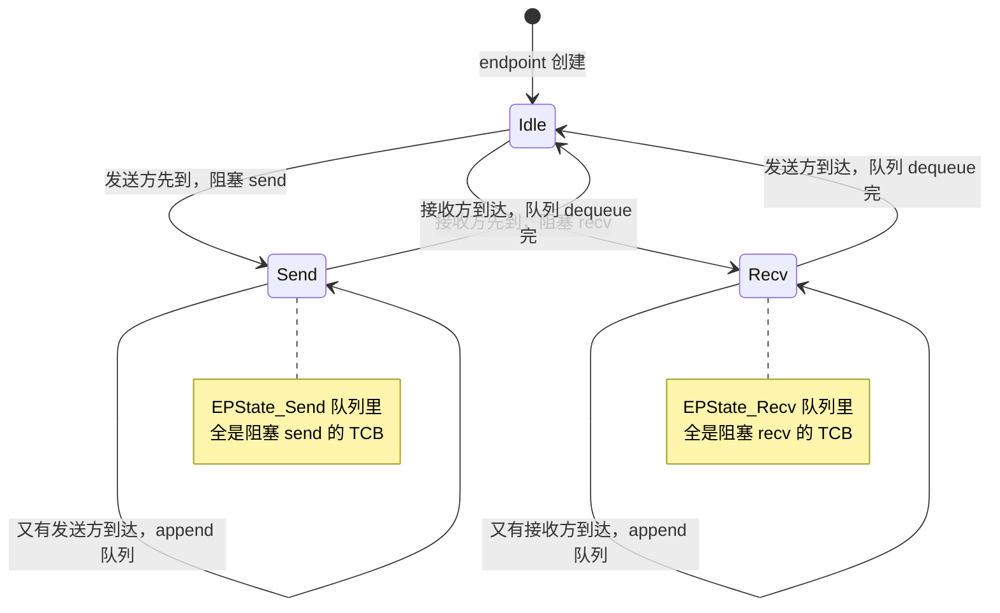
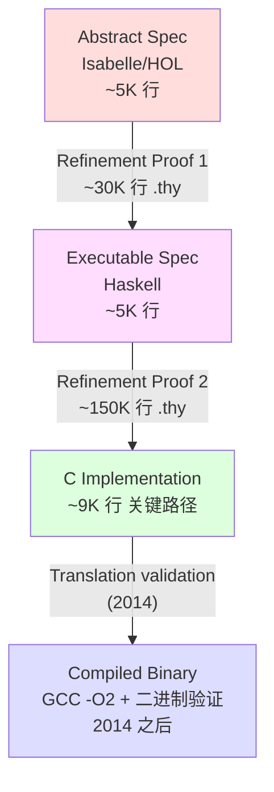
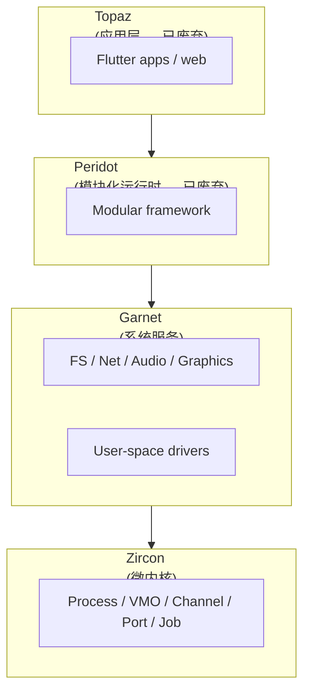
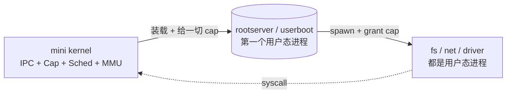
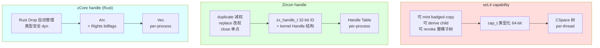
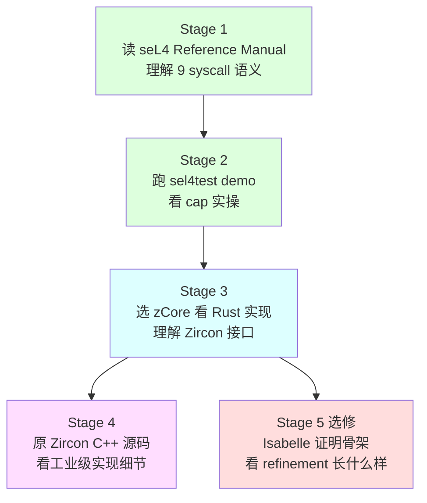

# 04-07 — 微内核精读合集：seL4 / Zircon / zCore

> **核心问题：**
> 1. 微内核怎么把 OS "拆"成最小内核 + 用户态服务？
> 2. IPC 怎么做到 < 1 μs？为什么"微内核太慢"是 1990 年代的旧账？
> 3. capability 与 UNIX `fd` 看起来都是数字句柄——本质区别在哪里？
> 4. seL4 怎么做到把 ~9 千行 C 内核完全形式化证明？
> 5. Zircon（Google Fuchsia）的 `Channel/Port/VMO/Job/Process` 与 seL4 的 `Endpoint/Notification/CNode/TCB` 怎么对照？
> 6. zCore 用 Rust 重写 Zircon 的工程意义是什么？哪些地方更安全 / 哪些地方妥协了？
>
> **一句话答案：** 微内核把 fs/net/driver/sched 全部赶出内核态、内核只留 IPC + 调度 + MMU + cap 管理；IPC 性能瓶颈通过"fastpath"（预检查 + 直接寄存器传递 + 跳过调度器）压到几百 cycle；capability 是带"权利位 + 不可伪造对象引用"的 token（不像 fd 仅是 per-process 索引），形式化验证靠"Haskell 抽象规约 → C 实现 → Isabelle 等价证明"三层精化（refinement）。Zircon 是工业派微内核（接口多、强调实用），zCore 复用 Zircon 接口但改用 Rust 重写以求内存安全。
>
> **本笔记定位：** 04 OS 大类**实现细节**层（5 步法第 4 步）。前置 [04-01 OS 内核总览](04-01-os-kernel-overview.md) / [04-02 OS 范式](04-02-os-kernel-paradigms.md) / [04-03 OS 项目横向对比](04-03-os-kernel-domain-comparison.md)。本篇走读 3 个微内核源码，挖出"为什么这样写"的设计权衡。
>
> 与 [00-07 OS 演化史](00-07-os-evolution.md) 分工：00-07 给 L4 家族 30 年时间线；本篇给"代码尺度"的剖面图。

---

## 0. 三个项目速览（背景 + 体量 + 定位）

### 0.1 项目身份卡

| 项目 | 出身 | 语言 | 规模（cloc） | 定位 |
|------|------|------|-------------|------|
| **seL4** | 澳大利亚 NICTA / UNSW / Data61 / CSIRO（2009 首次发布，主创 Gerwin Klein / Gernot Heiser） | C 主体 + Haskell（抽象规约）+ Python（bitfield 生成器）+ XML（接口）+ Isabelle/HOL（证明，不在主仓库） | 内核 C 约 **3.7 万行**，头文件 2.3 万行，汇编 2 千行（不计 libsel4） | 形式化验证微内核，目标"无 bug"——一切以可证明性为最高优先 |
| **Zircon** | Google Fuchsia 项目内核（前身 LK / Little Kernel，2016 公开） | C++17（kernel/）+ C（system/utility）+ Assembly | **40 万行 C++ + 7 万行 C + 13 万行 header + 600K 行总体**（含 system/ 用户态服务） | Fuchsia 的工程级微内核，强调实用接口（VMO 共享内存、Channel/Port 异步消息），驱动跑在用户态 |
| **zCore** | 清华 rCore-OS 团队 2020 年项目（最初为 OS 课程实验"用 Rust 重写 Zircon"） | Rust + 极少 C（内联 / FFI） | 约 **3 万行 Rust**（zCore 主体 + zircon-object + zircon-syscall + linux-syscall） | 在 Rust 安全前提下复用 Zircon ABI，多人格（zircon mode / linux mode）+ 多模式（bare-metal / libos） |

> **数据来源：** 三项目目录下 `cloc --quiet` 实际跑出的统计（详见各节）。

### 0.2 共同骨架（微内核必备）

任何微内核都长这样：

```
┌───────────── User space ─────────────┐
│  rootserver ──→ fs / net / driver    │
│        ↑   ↓ IPC + cap                │
│        ↓   ↑                          │
│   process / thread / VMO              │
└──────────────────────────────────────┘
            ↑   ↓ syscall (~10 个)
┌─────────── Microkernel ──────────────┐
│  IPC / Notify / Cap / Sched / MMU    │
└──────────────────────────────────────┘
            ↑   ↓ trap / fault
        Hardware (CPU / MMU / IRQ)
```

差别仅在：

- **内核里到底放多少东西**：seL4 极致克制（不含调度策略，仅机制）；Zircon 因强调便利保留较多 dispatcher 类
- **如何隔离用户态服务**：seL4 / Zircon / zCore 都用 capability，但具体形态不同

### 0.3 三项目对比小结表

| 维度 | seL4 | Zircon | zCore |
|------|------|--------|-------|
| **语言** | C + Haskell 规约 | C++17 | Rust |
| **内核行数** | ~9.7 K（仅 src/ C 部分关键路径） / 总 ~37 K | ~40 万 C++ kernel/ | ~30 K Rust 全部 |
| **syscall 数** | 8（核心 IPC）+ 11（MCS 拓展）+ debug | ~150（statically defined） | ~125（lib.rs 分发表逐条对应 Zircon） |
| **对象类型** | TCB / CNode / Endpoint / Notification / Untyped / Frame / PageTable | Process / Thread / Job / VMO / Channel / Port / Event / Socket / Fifo / Timer ... | 镜像 Zircon 全部对象 |
| **隔离粒度** | per-thread CSpace + VSpace；cap 是内核管理的 64-bit 类型化 capability | per-process handle table；handle 是 user-visible 32-bit ID + kernel 内部 `Handle` 结构 | 等同 Zircon |
| **形式化验证** | C kernel 完整证明（Isabelle/HOL，30 万行 proof） | 无 | 无（Rust 类型系统替代部分 unsafe 排查） |
| **驱动位置** | 用户态（CAmkES / sel4-driver） | 用户态（DDK） | 用户态（kernel-hal 抽象层 + linux-object 兼容） |
| **目标平台** | x86 / ARMv7 / ARMv8 / RISC-V 32/64 | x86_64 / aarch64 | x86_64 / aarch64 / riscv64（含 LibOS 模式） |
| **典型部署** | Defence / 汽车 ECU / 锁设备 / 信任根（Apple Secure Enclave 借鉴 L4） | Google Nest Hub（Fuchsia 已商用）、Chromebook 部分 | 学术、教学 |
| **License** | GPL-2.0（kernel）/ BSD-2 (libsel4) | MIT | MIT / Apache-2 双授权 |

---

## 1. seL4 精读

### 1.1 项目身份

- **历史链：** Liedtke 1991 _μKernel Construction_ → L4 / Pistachio / Fiasco / OKL4 → 2009 NICTA 发布 seL4 + 同期完成首次形式化证明（_seL4: Formal Verification of an OS Kernel_, SOSP 2009 best paper）
- **slogan：** "The world's first formally verified operating system kernel"
- **里程碑：**
  - 2009 — 功能正确性证明（functional correctness）
  - 2011 — 完整性 / 机密性证明（integrity & confidentiality）
  - 2014 — 二进制级正确性证明（编译器 GCC 也被证明保留语义）
  - 2018 — MCS（Mixed Criticality System）实时调度扩展
  - 2020 — RISC-V 64 平台正式支持
- **当前格局：** 由 seL4 Foundation（成员含 NIO / NXP / Cog / HENSOLDT）治理；进入汽车 / 国防 / 卫星 / 锁定式医疗设备

### 1.2 顶层目录

```
/home/heke/tgln/stage2/material/core/seL4/
├── src/                  # C 内核实现（约 37K 行 C + 2K 汇编）
│   ├── api/syscall.c     # syscall 总分发（643 行，本节核心）
│   ├── arch/             # x86 / arm / riscv 各自的入口、上下文切换、MMU
│   ├── fastpath/fastpath.c  # IPC 快速路径（899 行，~70% 的 IPC 走这里）
│   ├── kernel/boot.c     # 启动 + rootserver 创建（1095 行）
│   ├── kernel/thread.c   # 调度 + 上下文切换（752 行）
│   ├── object/endpoint.c # 同步 IPC 端点（497 行）
│   ├── object/notification.c # 异步通知（366 行）
│   ├── object/cnode.c    # CSpace 操作 + cap 派生 / 撤销
│   ├── object/tcb.c      # 线程控制块管理
│   └── object/untyped.c  # Untyped retype（一切对象的源头）
├── include/              # 头文件 + 关键 .bf bitfield 规范
│   └── object/structures_64.bf  # 所有 cap / kernel object 的位图布局
├── libsel4/              # 用户态接口库（不是内核的一部分）
│   ├── include/api/syscall.xml  # 8/11 syscall 名字声明
│   └── tools/syscall_stub_gen.py  # 由 XML 生成 C / Rust stub
├── tools/bitfield_gen.py # .bf → C 头文件生成器（保留 Haskell 风味）
├── manual/               # 官方 Reference Manual LaTeX 源码
└── configs/              # 36 种已验证配置（按板子 + 架构）
```

> 注意：**Isabelle 证明本身不在此仓库**，在 `seL4/l4v` 单独仓（约 30 万行 .thy）。本仓库的 `manual/` 是 PDF Reference Manual 源（Klein 等人维护）。

### 1.3 9 个核心 syscall

来自 [`libsel4/include/api/syscall.xml:9-37`](../core/seL4/libsel4/include/api/syscall.xml)：

```xml
<api-master>
    <config>
        <syscall name="Call"      />   <!-- send + 阻塞等回复（RPC 风格）-->
        <syscall name="ReplyRecv" />   <!-- 服务端：回复后立即阻塞收下一个 -->
        <syscall name="Send"      />   <!-- 阻塞 send -->
        <syscall name="NBSend"    />   <!-- 非阻塞 send -->
        <syscall name="Recv"      />   <!-- 阻塞 recv -->
        <syscall name="Reply"     />   <!-- 仅回复，不收 -->
        <syscall name="Yield"     />   <!-- 让出时间片 -->
        <syscall name="NBRecv"    />   <!-- 非阻塞 recv -->
    </config>
</api-master>
```

非 MCS 模式下就这 8 个。MCS 模式（Mixed Criticality）多 3 个：`NBSendRecv` / `NBSendWait` / `Wait` / `NBWait`（共 11）。

> **关键洞察：** 与 Linux 的 ~400 个 syscall 比，seL4 暴露给用户的"原语"个位数。**所有更高层服务（fs / net / driver）都是用户态进程，通过这 8 个 syscall 跟其他用户态进程通信**。这是微内核的"最小机制原则"。

#### syscall 总分发（src/api/syscall.c:542-643）

```c
exception_t handleSyscall(syscall_t syscall)
{
    exception_t ret;
    MCS_DO_IF_BUDGET({
        switch (syscall)
        {
        case SysSend:
            ret = handleInvocation(/*isCall=*/false, /*isBlocking=*/true, ...);
            break;
        case SysNBSend:
            ret = handleInvocation(false, false, ...);
            break;
        case SysCall:
            ret = handleInvocation(true, true, ...);
            break;
        case SysRecv:
            handleRecv(true, true);
            break;
        case SysReply:
            handleReply();
            break;
        case SysReplyRecv:
            handleReply();
            handleRecv(true, true);
            break;
        case SysNBRecv:
            handleRecv(false, true);
            break;
        case SysYield:
            handleYield();
            break;
        default:
            fail("Invalid syscall");
        }
    })
    schedule();
    activateThread();
    return EXCEPTION_NONE;
}
```

→ [src/api/syscall.c:542](../core/seL4/src/api/syscall.c) 真正的 entry point；`MCS_DO_IF_BUDGET` 在 MCS 模式下检查时间预算，否则空。

`handleInvocation` 逻辑（src/api/syscall.c:286-368）：

1. 从 capRegister（即 RISC-V `a0` / x86 `rdi`）读出 cap pointer（cptr）
2. `lookupCapAndSlot(thread, cptr)` 在当前线程的 CSpace 树形 cap 表里找到对应 slot
3. `lookupExtraCaps(thread, buffer, info)` 从 IPC buffer 读额外 cap（最多 3 个）
4. `decodeInvocation(label, length, cptr, slot, cap, ...)` 按 cap 类型分派到具体处理（endpoint → sendIPC、tcb → 操作 TCB、untyped → retype 等）

### 1.4 capability 数据结构

#### cap_t — 64-bit × 2 = 128-bit 的位图（structures_64.bf）

[include/object/structures_64.bf:7-43](../core/seL4/include/object/structures_64.bf)：

```bf
block null_cap {
    padding        64
    field capType  5
    padding        word_size - 5    -- (word_size = 64)
}

block untyped_cap {
    field capFreeIndex  canonical_size
    padding             word_size - canonical_size - 1 - 6
    field capIsDevice   1
    field capBlockSize  6
    field capType       5
    field_ptr capPtr    word_size - 5
}

block endpoint_cap(capEPBadge, capCanGrantReply, capCanGrant, capCanSend,
                   capCanReceive, capEPPtr, capType) {
    field capEPBadge       64           -- 用户标识，由 mint 时设置
    field capType          5
    field capCanGrantReply 1            -- 权利位
    field capCanGrant      1
    field capCanReceive    1
    field capCanSend       1
    field_ptr capEPPtr     word_size - 5 - 4
}

block notification_cap {
    field capNtfnBadge       64
    field capType            5
    field capNtfnCanReceive  1
    field capNtfnCanSend     1
    field_ptr capNtfnPtr     word_size - 5 - 2
}
```

`.bf`（"bitfield"）由 `tools/bitfield_gen.py` 编译成 C 静态 inline `cap_endpoint_cap_get_capCanSend(cap)` 等访问函数。**不可伪造性**靠两点保证：

1. `capType` 5 bit 位于固定位置；类型不对就 reject
2. `capEPPtr` 指向内核物理内存，用户态根本拿不到指针——cap 只在内核 CSpace 里流转

#### CSpace（cspace.c）— per-thread capability 树

每个线程有 root CNode（一棵 N 叉树），叶子是 cap slot。**cap pointer（cptr）是在树里的"路径 + index"**，不是平坦数组下标。`lookupCap()` 走树结构：

[src/object/cnode.c](../core/seL4/src/object/cnode.c)（结构定义在 include/object/structures.h:148-153）：

```c
struct cte {
    cap_t cap;
    mdb_node_t cteMDBNode;   // mapping database：用于 revoke 追溯派生关系
};
typedef struct cte cte_t;
```

`mdb_node_t` 维护**派生树**：A `mint` 出 B → B 的 mdb 记 A 是父；将来 A revoke 时可以递归撤销 B、C、...。这是 seL4 安全的关键机制——**资源可被原子撤销**。

#### Endpoint / Notification 状态机

[include/object/structures.h:36-48](../core/seL4/include/object/structures.h)：

```c
enum endpoint_state {
    EPState_Idle = 0,    // 没人在等
    EPState_Send = 1,    // 队列里全是阻塞 send 的线程，等接收方
    EPState_Recv = 2     // 队列里全是阻塞 recv 的线程，等发送方
};

enum notification_state {
    NtfnState_Idle    = 0,
    NtfnState_Waiting = 1,   // 有线程在等（异步）
    NtfnState_Active  = 2    // 有 pending 信号
};
```

> Endpoint 同步 IPC（rendezvous，发送方阻塞直到接收方拿走消息）；Notification 是异步的"位掩码信号"——类似 Unix signal 但走 cap 通道。

### 1.5 IPC fastpath — < 1 μs 的关键

[src/fastpath/fastpath.c:19-260](../core/seL4/src/fastpath/fastpath.c) `fastpath_call`：

```c
void NORETURN fastpath_call(word_t cptr, word_t msgInfo)
{
    seL4_MessageInfo_t info;
    cap_t ep_cap;
    endpoint_t *ep_ptr;
    word_t length;
    tcb_t *dest;
    word_t badge;
    cap_t newVTable;
    vspace_root_t *cap_pd;
    pde_t stored_hw_asid;
    word_t fault_type;
    dom_t dom;

    /* 1) 解 message info */
    info = messageInfoFromWord_raw(msgInfo);
    length = seL4_MessageInfo_get_length(info);
    fault_type = seL4_Fault_get_seL4_FaultType(NODE_STATE(ksCurThread)->tcbFault);

    /* 2) 检查：消息短 + 无 fault → 才能走快路径 */
    if (unlikely(fastpath_mi_check(msgInfo) ||
                 fault_type != seL4_Fault_NullFault)) {
        slowpath(SysCall);    // 任何条件不符 → 跳到 src/api/syscall.c 慢路径
    }

    /* 3) cap lookup（树深 ≤ 1 时是 O(1)） */
    ep_cap = lookup_fp(TCB_PTR_CTE_PTR(NODE_STATE(ksCurThread), tcbCTable)->cap, cptr);

    /* 4) 必须是 endpoint cap 且有 send 权 */
    if (unlikely(!cap_capType_equals(ep_cap, cap_endpoint_cap) ||
                 !cap_endpoint_cap_get_capCanSend(ep_cap))) {
        slowpath(SysCall);
    }

    /* 5) endpoint 必须正好处于 Recv 状态（队列里有等接收的线程） */
    ep_ptr = EP_PTR(cap_endpoint_cap_get_capEPPtr(ep_cap));
    dest = TCB_PTR(endpoint_ptr_get_epQueue_head(ep_ptr));
    if (unlikely(endpoint_ptr_get_state(ep_ptr) != EPState_Recv)) {
        slowpath(SysCall);
    }

    /* 后面是：取出目标线程 vspace，切页表，把消息寄存器拷过去，
     * 不调用调度器，直接 restore_user_context 跳到目标用户态 */
    ...
}
```

#### 为什么这么快（fastpath 的关键技巧）

| 技巧 | 说明 |
|------|------|
| **跳过调度器** | 同步 IPC 时直接把 CPU 给目标线程（`possibleSwitchTo` 都不用，**不进调度队列**） |
| **寄存器传消息** | 短消息 ≤ 4 word 直接走 `a0..a3`（不碰内存） |
| **手工内联展开** | 函数体几乎全 inline，无函数调用栈帧开销 |
| **统一异常路径** | 任何异常 / 不满足条件 → `slowpath()` 跳回 src/api/syscall.c 慢路径，**fastpath 自身无任何异常处理代码** |
| **页表切换最小化** | 仅切 ASID 寄存器（aarch64） / SATP（RISC-V），不刷 TLB（ASID 复用） |

#### 慢路径（sendIPC）—— src/object/endpoint.c:18-122

```c
void sendIPC(bool_t blocking, bool_t do_call, word_t badge,
             bool_t canGrant, bool_t canGrantReply, tcb_t *thread, endpoint_t *epptr)
{
    switch (endpoint_ptr_get_state(epptr)) {
    case EPState_Idle:
    case EPState_Send:
        if (blocking) {
            /* 把自己加入 send 队列 → 阻塞 */
            thread_state_ptr_set_tsType(&thread->tcbState, ThreadState_BlockedOnSend);
            ...
            queue = ep_ptr_get_queue(epptr);
            queue = tcbEPAppend(thread, queue);
            endpoint_ptr_set_state(epptr, EPState_Send);
        }
        break;

    case EPState_Recv: {
        /* 接收方在等 → 直接交付 */
        tcb_queue_t queue = ep_ptr_get_queue(epptr);
        tcb_t *dest = queue.head;
        queue = tcbEPDequeue(dest, queue);
        ep_ptr_set_queue(epptr, queue);
        if (!queue.head) endpoint_ptr_set_state(epptr, EPState_Idle);
        doIPCTransfer(thread, epptr, badge, canGrant, dest);
        ...
        setThreadState(dest, ThreadState_Running);
        possibleSwitchTo(dest);
        ...
    }
    }
}
```

完整的状态机图：



→ 一个端点**永远不会同时有发送方和接收方等待**——一旦双方都到，立即匹配 + 传输 + 退队。这个不变量是形式化证明里**最关键的引理**之一。

#### Notification — 异步信号位掩码（src/object/notification.c）

[src/object/notification.c](../core/seL4/src/object/notification.c) 是 endpoint 的"异步表亲"。一个 Notification 对象内部就是一个 word 的 signal bitmask；`signalNotification` 把 badge OR 进去，`receiveSignal` 阻塞等任意 bit 置 1：

```c
void sendSignal(notification_t *ntfnPtr, word_t badge)
{
    switch (notification_ptr_get_state(ntfnPtr)) {
    case NtfnState_Idle:
        /* 没人等 → 写入 active 状态 + badge */
        ntfn_set_active(ntfnPtr, badge);
        break;

    case NtfnState_Waiting: {
        tcb_queue_t ntfn_queue = ntfn_ptr_get_queue(ntfnPtr);
        tcb_t *dest = ntfn_queue.head;
        /* 唤醒头 */
        ntfn_queue = tcbEPDequeue(dest, ntfn_queue);
        ntfn_ptr_set_queue(ntfnPtr, ntfn_queue);
        if (!ntfn_queue.head) notification_ptr_set_state(ntfnPtr, NtfnState_Idle);
        setRegister(dest, badgeRegister, badge);
        setThreadState(dest, ThreadState_Running);
        possibleSwitchTo(dest);
        break;
    }
    case NtfnState_Active: {
        /* 已有 pending → 累加 */
        word_t badge2 = notification_ptr_get_ntfnMsgIdentifier(ntfnPtr);
        badge2 |= badge;
        notification_ptr_set_ntfnMsgIdentifier(ntfnPtr, badge2);
        break;
    }
    }
}
```

**Notification 与 Endpoint 的核心区别：**

| 维度 | Endpoint | Notification |
|------|----------|--------------|
| 同步性 | 同步 rendezvous | 异步 |
| 消息载荷 | 任意（最多 121 word + 3 cap） | 仅 1 word badge（OR-叠加） |
| 接收阻塞 | 必须有人 send/wait 配对 | active 直接消费，否则等 |
| 主要用途 | RPC 风格服务 | IRQ / signal / wakeup |

> seL4 把"硬件中断"也表达成 Notification——`IRQHandler` cap 注册到 IRQ，IRQ 触发后发 signal 给绑定的 Notification。**驱动是用户态进程**，它阻塞在 receiveSignal 上等中断。

### 1.6 形式化验证（Isabelle/HOL）

> 这是 seL4 最神秘也是最重要的部分，但代码 / 证明不在这个仓库。先看官方架构（来自论文 _seL4: Formal Verification of an OS Kernel_）。

#### 三层精化（refinement）



- **Abstract spec：** "什么"——状态转换公理化定义
- **Executable spec：** "怎么"——可在 Haskell 模拟器跑的版本
- **C 实现：** 最终实际跑的代码，ANSI C99 + 极少 GCC 扩展
- **每一层精化都证明：实现层的所有可观察行为是规约层行为的子集**

#### 验证目标 + 假设 + 限制

| 范畴 | 内容 |
|------|------|
| **已证明**（functional correctness） | C 代码无 buffer overflow / null deref / division by zero / unaligned access；状态转移符合规约 |
| **已证明**（integrity） | 没有 cap 的进程不能修改对应资源 |
| **已证明**（confidentiality） | 没有 read cap 的进程不能读对应资源（含 covert channel 部分排除） |
| **未证明**（假设条件） | 编译器（GCC 4.5）/ 汇编 / 引导加载器 / 硬件（CPU MMU、TLB 模型） |
| **限制** | 单核（多核证明 2018 才完成）/ 不证明 timing channel / SMP 一致性 |

#### 已验证架构

[configs/](../core/seL4/configs/) 里以 `_verified.cmake` 结尾的：

- `X64_verified.cmake`（x86_64）
- `ARM_verified.cmake`（ARMv7）/ `AARCH64_verified.cmake`（ARMv8）
- `RISCV64_verified.cmake`（RISC-V 64，2020）
- `ARM_HYP_verified.cmake`（ARMv7 with hypervisor extension）
- `ARM_MCS_verified.cmake`（ARMv7 + MCS 实时）

实际板子配置例：

- `AARCH64_imx8mm_verified.cmake`（NXP i.MX 8M Mini）
- `AARCH64_zynqmp_verified.cmake`（Xilinx Zynq UltraScale+，常用于汽车 / 国防）
- `ARM_tk1_verified.cmake`（NVIDIA Tegra K1）
- `RISCV64_verified.cmake`（HiFive Unleashed）

### 1.6.5 调度器（src/kernel/thread.c）

[src/kernel/thread.c](../core/seL4/src/kernel/thread.c)（752 行）实现 **domain × priority** 两级调度，核心思路：

- **Domain（0..N-1）：** 编译期固定的"分时片段"——每个 domain 持续若干 ms，期间只有该 domain 的线程能跑。**强隔离**（信息流不跨 domain，是 confidentiality 证明的基础）。
- **Priority（0..255）：** domain 内按优先级跑。同优先级 round-robin。
- **MCP（Maximum Controlled Priority）：** 每 TCB 还有一个"能给别人设的最高优先级上限"——防止低权进程提升优先级。
- **MCS（Mixed Criticality）模式：** 加入 scheduling context（SC）—— 时间预算 budget + 周期 period；线程没有 SC 就不能跑。这让 seL4 能做硬实时。

非 MCS 调度 main loop（极简化）：

```c
void schedule(void)
{
    /* 找下一个可运行的最高 prio 线程 */
    if (NODE_STATE(ksSchedulerAction) == SchedulerAction_ChooseNewThread) {
        chooseThread();   // 扫 ksReadyQueues[domain][prio] 找 head
    } else if (NODE_STATE(ksSchedulerAction) != SchedulerAction_ResumeCurrentThread) {
        /* possibleSwitchTo 已选好 */
        switchToThread(NODE_STATE(ksSchedulerAction));
    }
    NODE_STATE(ksSchedulerAction) = SchedulerAction_ResumeCurrentThread;
}
```

→ **调度器只是机制**：不做"公平 / 抢占检测 / 优先级反转处理"等策略——这些一律由用户态进程通过 cap 操作 TCB 实现。这就是"机制 vs 策略分离"的极致。

### 1.7 启动流程

`elfloader-tool`（独立仓库）→ 把 seL4 ELF 装载到内核虚拟地址 → 跳到 `_start`：

#### RISC-V 入口 ([src/arch/riscv/head.S](../core/seL4/src/arch/riscv/head.S))

```asm
_start:
  fence.i
1:auipc gp, %pcrel_hi(__global_pointer$)
  addi  gp, gp, %pcrel_lo(1b)
  la sp, (kernel_stack_alloc + BIT(CONFIG_KERNEL_STACK_BITS))
  csrw sscratch, x0    /* zero sscratch for the init task */

#ifdef CONFIG_ENABLE_SMP_SUPPORT
  /* 设 per-core 栈：sp = base + (a7 << STACK_BITS) */
  mv t0, a7
  slli t0, t0, CONFIG_KERNEL_STACK_BITS
  add  sp, sp, t0
  csrw sscratch, sp
#endif

  /* a0 = ui phys start, a1 = ui phys end, a2 = pv offset,
     a3 = ui v entry, a4 = DTB phys, a5 = DTB size,
     a6 = hart id, a7 = core id */
  jal init_kernel
  ...
```

#### init_kernel → try_init_kernel ([src/arch/riscv/kernel/boot.c:193](../core/seL4/src/arch/riscv/kernel/boot.c))

七步走（删节版）：

1. `init_freemem()` — 从 ELF / device tree 解析空闲物理区
2. `arch_init_freemem()` — 给内核保留页表 / 跳板 / per-CPU 数据
3. **创建 rootserver 对象**（[src/kernel/boot.c:202-247](../core/seL4/src/kernel/boot.c) `create_rootserver_objects`）：CNode、VSpace、ASID Pool、IPC Buffer、BootInfo Page、TCB、SC（MCS）
4. **建立 root CNode 并填入初始 cap**（master cap、IPC buffer cap、CNode cap、VSpace cap）
5. **`create_initial_thread()`**（[src/kernel/boot.c:496-564](../core/seL4/src/kernel/boot.c)）— 把上面对象组装成第一个用户态线程：
   ```c
   tcb_t *tcb = TCB_PTR(rootserver.tcb + TCB_OFFSET);
   ...
   cteInsert(root_cnode_cap, ..., SLOT_PTR(rootserver.tcb, tcbCTable));  // 装 CSpace
   cteInsert(it_pd_cap,      ..., SLOT_PTR(rootserver.tcb, tcbVTable));  // 装 VSpace
   cteInsert(dc_ret.cap,     ..., SLOT_PTR(rootserver.tcb, tcbBuffer));  // 装 IPC buffer
   tcb->tcbIPCBuffer = ipcbuf_vptr;
   setRegister(tcb, capRegister, bi_frame_vptr);
   setNextPC(tcb, ui_v_entry);
   tcb->tcbPriority = seL4_MaxPrio;
   tcb->tcbDomain = 0;
   setThreadState(tcb, ThreadState_Running);
   ...
   ```
6. **`create_untypeds()`** — 剩余物理内存全部封装成 `untyped_cap` 交给 rootserver
7. **`init_core_state()`** — 装好初始线程为 ksCurThread，恢复用户上下文

启动后 rootserver 拥有"宇宙的所有 cap"——它可以 retype untyped 创建任何对象、把 cap 派生分发给子进程，建立整个用户态生态。


### 1.8 必读源文件 + 论文清单

#### 源文件路线（按读 4-6 周可吃透）

| 优先级 | 文件 | 读什么 |
|-------|------|--------|
| ★★★ | [src/api/syscall.c](../core/seL4/src/api/syscall.c) | 全部 643 行——syscall 总分发 |
| ★★★ | [src/object/endpoint.c](../core/seL4/src/object/endpoint.c) | 同步 IPC 状态机 |
| ★★★ | [src/object/notification.c](../core/seL4/src/object/notification.c) | 异步通知 |
| ★★★ | [src/fastpath/fastpath.c](../core/seL4/src/fastpath/fastpath.c) | IPC 优化路径——理解了这个就理解了"微内核为什么快" |
| ★★ | [src/kernel/boot.c](../core/seL4/src/kernel/boot.c) | 启动 + rootserver |
| ★★ | [src/kernel/thread.c](../core/seL4/src/kernel/thread.c) | 调度策略（domain + priority） |
| ★★ | [include/object/structures_64.bf](../core/seL4/include/object/structures_64.bf) | 所有 cap 的位布局 |
| ★ | [src/object/cnode.c](../core/seL4/src/object/cnode.c) | CSpace 操作 + revoke |
| ★ | [src/object/untyped.c](../core/seL4/src/object/untyped.c) | retype——一切对象的源头 |
| ★ | [src/arch/riscv/head.S](../core/seL4/src/arch/riscv/head.S) + [c_traps.c](../core/seL4/src/arch/riscv/c_traps.c) | RISC-V 入口 + trap |

#### 论文 + 文档

- **必读：** _seL4 Reference Manual_（manual/manual.tex 编出来的 PDF；最新版本 [https://sel4.systems/Info/Docs/seL4-manual-latest.pdf](https://sel4.systems/Info/Docs/seL4-manual-latest.pdf)）
- _seL4: Formal Verification of an OS Kernel_（Klein et al. SOSP 2009）—— 第一篇里程碑
- _Comprehensive formal verification of an OS microkernel_（Klein et al. TOCS 2014）—— 系统化总结
- _Sound and complete cross-language type system for secure information flow_（Murray et al.）—— 机密性证明
- _μKernel Construction_（Liedtke, OSDI 1995）—— 教父级，理解 seL4 的设计哲学起点
- 视频：Gernot Heiser 各年 LCA / OSDI keynote

---

## 2. Zircon 精读

### 2.1 项目身份

- **出身：** Google Fuchsia OS 的内核，前身是 Travis Geiselbrecht（前 BeOS / NewOS 工程师，也是 Android 早期 bootloader 作者）写的 Little Kernel（LK，2008～），Zircon 在 2016 年正式公开。
- **语言：** C++17（kernel/）+ C（system/ 用户态服务、libc 等）
- **设计哲学：**
  - 微内核（fs/net/driver 都在用户态）但**不强调最小化**——便利接口可以多
  - 强调**对象 + 句柄 + 权利位**模型（capability 风格但不叫 capability，叫 handle）
  - 强调 **VMO + Channel + Port** 的"现代异步消息" 风格（不是 L4 风格的同步 rendezvous）
  - 不追求形式化证明，靠工程方法（fuzzing / 大量测试 / sanitizer）
- **当前格局：** Fuchsia 已商业部署在 Google Nest Hub、Nest Hub Max、部分 Chromebook；外部公司参与较少（与 seL4 的开放生态对比强烈）

### 2.2 与 Linux 的不同（capability/handle 风格）

| 对比项 | Linux | Zircon |
|--------|-------|--------|
| 资源句柄 | `int fd`（per-process 数组下标） | `zx_handle_t`（per-process handle table 索引）+ kernel 内部 `Handle*` |
| 权利模型 | unix DAC + capabilities（Linux capabilities）+ SELinux | 每个 handle 自带 32-bit `zx_rights_t`（可以"减权复制"） |
| IPC 主接口 | pipe / socket / shm / signal / SysV IPC（碎片化） | **Channel**（双向消息）+ **Port**（事件聚合 epoll-like）+ **VMO**（共享内存对象） |
| 进程关系 | parent/child（fork）+ pid namespace | **Job 树**（process 是 job 的子节点，job 可嵌套 job） |
| 内存映射 | mmap → 文件 / 匿名映射 | VMAR（地址区）+ VMO（内存对象）→ 显式 map 关系 |
| signal | UNIX signal | object signal（每个对象有 32 bit signal）+ async 等待 |
| 驱动 | 内核态（modules） | **用户态**（DDK / FIDL 接口） |
| syscall 数 | ~400 | ~150 |

### 2.3 顶层结构

```
/home/heke/tgln/stage2/material/core/Zircon/
├── kernel/                  # 内核本体（C++17）
│   ├── arch/                # x86_64 / arm64 架构层
│   ├── object/              # 内核对象 dispatcher（每种资源一个 *Dispatcher 类）
│   ├── syscalls/            # syscall 实现（按对象分类的 .cpp）
│   ├── platform/            # 平台 init（pc / hikey / qemu-arm）
│   ├── vm/                  # VM / VMO / VMAR
│   ├── lib/                 # heap / debuglog / userabi
│   ├── lk/                  # Little Kernel 遗产（init level / spinlock 等）
│   ├── top/main.cpp         # lk_main() 入口 (152 行)
│   └── kernel/              # 调度 + thread + mutex / event
├── system/                  # 用户态服务 + libc 风格库
│   ├── core/                # 核心服务：bootsvc / devmgr / svchost / netsvc 等
│   ├── ulib/                # 用户态库（含 fdio、fbl、ldsvc 等）
│   ├── utest/               # 用户态单元测试（含 core/）
│   ├── uapp/                # 用户态可执行程序
│   ├── dev/                 # 设备驱动（用户态！）
│   ├── fidl/                # FIDL 接口定义（IPC 协议描述语言）
│   └── banjo/               # banjo 接口定义（驱动间）
├── third_party/             # zlib / fbl / ulib 等
├── docs/                    # 大量 markdown 文档
├── kernel.ld + image.ld     # 链接脚本
└── BUILD.gn                 # GN 构建系统（不是 cmake/ninja）
```

> **统计：** 整个仓库 cloc 约 60 万行，其中 kernel/ 大约 14 万行 C++ + 4 万行 C；system/ 约 40 万行（含驱动和服务）。

### 2.4 关键抽象 — 7 大对象类型

[`docs/concepts.md` + `docs/objects.md`] 里列了 ~30 种 dispatcher，但日常使用就这 7 个：

| 对象 | 文件 | 语义 | 与 UNIX 对应 |
|------|------|------|-------------|
| **Process** | [kernel/object/process_dispatcher.cpp](../core/Zircon/kernel/object/process_dispatcher.cpp) (914 行) | 进程；含 handle table + VMAR | Linux `task_struct` + mm |
| **Thread** | [kernel/object/thread_dispatcher.cpp](../core/Zircon/kernel/object/thread_dispatcher.cpp) | 线程；属于某进程 | pthread |
| **Job** | [kernel/object/job_dispatcher.cpp](../core/Zircon/kernel/object/job_dispatcher.cpp) (676 行) | 进程组层级（**树状**！可嵌套），策略边界 | Linux cgroup + namespace 概念 |
| **VMO** (Virtual Memory Object) | [kernel/vm/](../core/Zircon/kernel/vm/) | 一段物理内存，可映射到多个 VMAR | 文件 + mmap |
| **VMAR** (Virtual Memory Address Region) | [kernel/vm/](../core/Zircon/kernel/vm/) | 进程的虚拟地址空间区段（树状） | 进程 mm 的 vma 树 |
| **Channel** | [kernel/object/channel_dispatcher.cpp](../core/Zircon/kernel/object/channel_dispatcher.cpp) (417 行) | 双向消息通道（数据 + 句柄打包） | UNIX socket + SCM_RIGHTS |
| **Port** | [kernel/object/port_dispatcher.cpp](../core/Zircon/kernel/object/port_dispatcher.cpp) | 事件聚合点；可绑定多对象的 signal 异步等待 | epoll / kqueue |
| **Event / EventPair** | [kernel/object/event_dispatcher.cpp](../core/Zircon/kernel/object/event_dispatcher.cpp) | 用户可设置 / 等待的信号位 | eventfd |
| **Futex** | [kernel/object/futex_context.cpp](../core/Zircon/kernel/object/futex_context.cpp) | 用户态同步原语 | Linux futex |

#### Channel 创建（kernel/object/channel_dispatcher.cpp:42-67）

```cpp
zx_status_t ChannelDispatcher::Create(KernelHandle<ChannelDispatcher>* handle0,
                                      KernelHandle<ChannelDispatcher>* handle1,
                                      zx_rights_t* rights) {
    fbl::AllocChecker ac;
    auto holder0 = fbl::AdoptRef(new (&ac) PeerHolder<ChannelDispatcher>());
    if (!ac.check())
        return ZX_ERR_NO_MEMORY;
    auto holder1 = holder0;

    KernelHandle new_handle0(fbl::AdoptRef(new (&ac) ChannelDispatcher(ktl::move(holder0))));
    if (!ac.check())
        return ZX_ERR_NO_MEMORY;
    KernelHandle new_handle1(fbl::AdoptRef(new (&ac) ChannelDispatcher(ktl::move(holder1))));
    if (!ac.check())
        return ZX_ERR_NO_MEMORY;

    new_handle0.dispatcher()->Init(new_handle1.dispatcher());
    new_handle1.dispatcher()->Init(new_handle0.dispatcher());

    *rights = default_rights();
    *handle0 = ktl::move(new_handle0);
    *handle1 = ktl::move(new_handle1);
    return ZX_OK;
}
```

→ Channel 永远成对创建，互为 peer（双向）。每个 `ChannelDispatcher` 持有 `recv_queue_`（消息队列）+ `peer_`（弱引用对端）。

#### Channel write/read（[kernel/syscalls/channel.cpp:55-80](../core/Zircon/kernel/syscalls/channel.cpp)）

```cpp
zx_status_t sys_channel_create(uint32_t options,
                               user_out_handle* out0, user_out_handle* out1) {
    if (options != 0u)
        return ZX_ERR_INVALID_ARGS;
    auto up = ProcessDispatcher::GetCurrent();
    zx_status_t res = up->EnforceBasicPolicy(ZX_POL_NEW_CHANNEL);
    if (res != ZX_OK)
        return res;
    KernelHandle<ChannelDispatcher> handle0, handle1;
    zx_rights_t rights;
    zx_status_t result = ChannelDispatcher::Create(&handle0, &handle1, &rights);
    ...
}
```

特点：

- 检查 `Job policy`（[kernel/object/job_policy.cpp](../core/Zircon/kernel/object/job_policy.cpp)）—— job 树上层可以禁止子进程创建某种对象
- 句柄通过 `user_out_handle*` 抽象写出（包含权限校验）

### 2.5 启动流程（kernel_main → 用户态 process tree）

#### 入口（[kernel/top/main.cpp:43-97](../core/Zircon/kernel/top/main.cpp)）

```cpp
void lk_main() {
    dlog_bypass_init_early();         // serial 早期 console
    thread_init_early();              // 把 lk_main 自己变成"thread context"
    call_constructors();              // 跑 .init_array

    lk_primary_cpu_init_level(LK_INIT_LEVEL_EARLIEST, LK_INIT_LEVEL_ARCH_EARLY - 1);
    arch_early_init();                // CPU/ASID/MMU 早期 init
    lk_primary_cpu_init_level(LK_INIT_LEVEL_ARCH_EARLY, LK_INIT_LEVEL_PLATFORM_EARLY - 1);
    platform_early_init();            // 解析 ZBI / boot args / device tree
    lk_primary_cpu_init_level(LK_INIT_LEVEL_PLATFORM_EARLY, LK_INIT_LEVEL_TARGET_EARLY - 1);
    target_early_init();
    dprintf(INFO, "\nwelcome to Zircon\n\n");

    lk_primary_cpu_init_level(LK_INIT_LEVEL_TARGET_EARLY, LK_INIT_LEVEL_VM_PREHEAP - 1);
    vm_init_preheap();
    lk_primary_cpu_init_level(LK_INIT_LEVEL_VM_PREHEAP, LK_INIT_LEVEL_HEAP - 1);
    heap_init();                      // libc 风 heap，给内核内部用
    lk_primary_cpu_init_level(LK_INIT_LEVEL_HEAP, LK_INIT_LEVEL_VM - 1);
    vm_init();                        // 完整 VM/PMM/VMAR/VMO 起来
    lk_primary_cpu_init_level(LK_INIT_LEVEL_VM, LK_INIT_LEVEL_KERNEL - 1);
    kernel_init();                    // 调度器 / per-cpu / event

    /* 创建 bootstrap2 thread 并接管初始化 */
    thread_t* t = thread_create("bootstrap2", &bootstrap2, NULL, DEFAULT_PRIORITY);
    thread_detach(t);
    thread_resume(t);

    /* 主线程变 idle thread */
    thread_become_idle();
}
```

> **LK init level 模式**（来自 LK 遗产）：所有子系统 init 函数声明 `LK_INIT_HOOK(name, fn, level)`，按 level 编号在合适时机调用。比"按调用栈"更可控的依赖管理。

#### bootstrap2 → userboot

`bootstrap2` 跑完 platform / target init 后，最终装载 `userboot.so`（ZBI 里打包的特殊 ELF），它是 **rootserver 的等价物**：

1. userboot 持有几个根 cap：root job、bootfs VMO、log、resource 等
2. 它从 bootfs 加载 `bootsvc`（system/core/bootsvc）
3. bootsvc 又起 `devmgr`（设备管理 + 启动 driver hosts）
4. devmgr 起更多用户态服务，整个 Fuchsia 用户态 process 树展开

### 2.6 Fuchsia 整体架构（自下而上四层）

> 题外话但帮助理解 Zircon 的位置：



> Peridot/Topaz 在 2019 之后被 _Components Framework v2_ 重写替代。但分层思路（kernel → drivers/services → apps）仍是 Fuchsia 架构骨架。

### 2.7 与 seL4 的设计对比

| 维度 | seL4 | Zircon |
|------|------|--------|
| **syscall 数** | 8（核心）/ 11（MCS） | ~150 |
| **IPC 风格** | 同步 rendezvous（短消息走寄存器） | 异步消息 + queue |
| **共享内存** | 通过 Frame cap mapping | VMO（一等公民） |
| **事件等待** | Notification（位掩码 + bind to TCB） | Port + signal（任意对象） |
| **进程组** | 无内核概念（用户态实现） | Job 树（内核一等公民） |
| **驱动模型** | CAmkES 组件框架 | DDK + FIDL |
| **认证模型** | capability + badge | handle + rights |
| **形式化** | C 完整证明 | 无（fuzzing + sanitizer） |
| **代码体量** | 极小（<10K 关键路径） | 大（40 万 C++） |
| **新增接口的成本** | 极高（每加一行要重证明） | 低（类似 Linux） |

> 这是"机制 vs 策略"的张力：seL4 把策略全部赶到用户态；Zircon 在内核里保留了大量 dispatcher（Port、Pager、Profile 等），换取应用代码的便利性。

#### IPC 风格对比小例子

**seL4 同步 RPC**（C，伪码）：

```c
/* 客户端调用文件服务（用 endpoint cap） */
seL4_MessageInfo_t info = seL4_MessageInfo_new(/*label*/ FS_OPEN, 0, 0, /*length*/ 1);
seL4_SetMR(0, path_ipc_offset);           /* 短消息直接放寄存器 / IPC buffer */
seL4_MessageInfo_t reply = seL4_Call(fs_ep_cap, info);   /* 阻塞直到 server 回复 */
int fd = seL4_GetMR(0);
```

**Zircon 异步 channel**（C，简化）：

```c
/* 客户端创建 channel + 把一端给文件服务 */
zx_handle_t ch_a, ch_b;
zx_channel_create(0, &ch_a, &ch_b);
zx_channel_write(fs_directory_ch, 0,
                 &open_msg, sizeof(open_msg),
                 &ch_b, 1);                            /* 把 ch_b 句柄一同传过去 */
/* 现在 ch_a 是新连接的客户端端，可以 read 回复 */
zx_object_wait_one(ch_a, ZX_CHANNEL_READABLE, ZX_TIME_INFINITE, NULL);
zx_channel_read(ch_a, 0, &reply, NULL, sizeof(reply), 0, NULL, NULL);
```

→ Zircon 把"新建连接"做成传 handle 一并完成（FIDL 风格），没有 seL4 那种 mint badged endpoint 的额外步骤。

---

## 3. zCore 精读

### 3.1 项目身份

- **出身：** 清华 rCore-OS 团队（rcore-os），最初是 OS 课程实验"用 Rust 重写 Zircon"
- **目标：** 在 Rust 安全前提下复用 Zircon ABI，**还能跑 Linux 程序**（多人格设计）
- **特点：**
  - **多人格：** 同一份代码可编译为 zircon mode（跑 Fuchsia 用户态二进制）或 linux mode（跑 Linux ELF + glibc/musl）
  - **多模式：** 既可 bare-metal（QEMU / 哪吒 D1 / VisionFive2 / cr1825），也可 LibOS（在 Linux 上跑成普通进程）
  - **同步原语为 async：** 大量 future / `await`，与原 Zircon 的"event + wait" 风格不同
  - **crate 化：** 内核结构按 crate 切分，可独立测试

### 3.2 顶层目录

```
/home/heke/tgln/stage2/material/core/zCore/
├── zCore/                  # 入口 binary crate（main.rs 在此）
│   ├── src/main.rs         # primary_main / secondary_main
│   └── src/{fs,handler,memory,platform}.rs
├── zircon-object/          # Zircon 内核对象 (KernelObject trait + 各 dispatcher)
│   └── src/
│       ├── object/         # KObject 基类、handle、rights、signal
│       ├── ipc/channel.rs  # Channel 实现 (363 行)
│       ├── task/{job,process,thread}.rs
│       ├── vm/{vmar,vmo}/  # VM 对象
│       ├── dev/            # 用户态 IRQ / iommu 抽象
│       ├── debuglog.rs
│       └── error.rs
├── zircon-syscall/         # Zircon syscall 入口分发（lib.rs 一张大 match 表）
│   └── src/lib.rs          # 385 行 syscall 分发
├── linux-object/           # Linux ABI 兼容（fs / process / signal）
├── linux-syscall/          # Linux syscall 实现
├── kernel-hal/             # 硬件抽象层（CPU / MMU / IRQ / serial / 计时器）
├── zCore/...arch.../       # arch-specific (per-arch HAL impl)
├── loader/                 # ELF / ZBI / userboot loader
├── drivers/                # 用户态驱动
├── rboot/                  # x86_64 UEFI bootloader（已 vendored）
├── prebuilt/               # 预编译的 Fuchsia userboot 等
├── libc-test/              # libc 兼容性测试
├── xtask/                  # cargo xtask 任务
├── Cargo.toml              # workspace
└── Makefile
```

> **统计：** Rust 30 K + 行；workspace 多 crate（详见 Cargo.toml `members`）

### 3.3 关键 crate 拆解

#### zircon-object — 内核对象基础（[lib.rs](../core/zCore/zircon-object/src/lib.rs)）

```rust
pub mod debuglog;
pub mod dev;
mod error;
#[cfg(feature = "hypervisor")]
pub mod hypervisor;
pub mod ipc;
pub mod object;
pub mod signal;
pub mod task;
pub mod util;
pub mod vm;

pub use self::error::*;
```

**核心 trait：`KernelObject`**（[zircon-object/src/object/mod.rs](../core/zCore/zircon-object/src/object/mod.rs)）

```rust
// 所有内核对象都实现这个 trait（用 impl_kobject! 宏自动生成）
pub trait KernelObject: DowncastSync + Debug {
    fn id(&self) -> KoID;          // 全局唯一 ID
    fn type_name(&self) -> &str;    // "Process" / "Channel" / ...
    fn name(&self) -> String;
    fn signal(&self) -> Signal;
    fn signal_set(&self, signal: Signal);
    fn signal_clear(&self, signal: Signal);
    ...
}
```

**Handle**（[zircon-object/src/object/handle.rs](../core/zCore/zircon-object/src/object/handle.rs)）：

```rust
pub type HandleValue = u32;
pub const INVALID_HANDLE: HandleValue = 0;

#[derive(Debug, Clone)]
pub struct Handle {
    pub object: Arc<dyn KernelObject>,
    pub rights: Rights,
}
```

→ 与 Zircon C++ 版本一一对应，但 Rust 用 `Arc<dyn KernelObject>` 自动管理引用计数。

#### Channel（zircon-object/src/ipc/channel.rs:29-75）

```rust
pub struct Channel {
    base: KObjectBase,
    _counter: CountHelper,
    peer: Weak<Channel>,
    recv_queue: Mutex<VecDeque<T>>,
    call_reply: Mutex<HashMap<TxID, Sender<ZxResult<T>>>>,
    next_txid: AtomicU32,
}
type T = MessagePacket;
type TxID = u32;
...
impl Channel {
    pub fn create() -> (Arc<Self>, Arc<Self>) {
        let channel0 = Arc::new(Channel {
            base: KObjectBase::with_signal(Signal::WRITABLE),
            _counter: CountHelper::new(),
            peer: Weak::default(),
            recv_queue: Default::default(),
            call_reply: Default::default(),
            next_txid: AtomicU32::new(0x8000_0000),
        });
        let channel1 = Arc::new(Channel {
            base: KObjectBase::with_signal(Signal::WRITABLE),
            _counter: CountHelper::new(),
            peer: Arc::downgrade(&channel0),
            recv_queue: Default::default(),
            call_reply: Default::default(),
            next_txid: AtomicU32::new(0x8000_0000),
        });
        // 安全：此时 channel0 没有任何其他引用
        unsafe { &mut *(Arc::as_ptr(&channel0) as *mut Channel) }.peer = Arc::downgrade(&channel1);
        (channel0, channel1)
    }
    ...
    pub async fn call(self: &Arc<Self>, mut msg: T) -> ZxResult<T> {
        ...
        let (sender, receiver) = oneshot::channel();
        self.call_reply.lock().insert(txid, sender);
        ...
        receiver.await.map_err(|_| ZxError::PEER_CLOSED)?
    }
}
```

→ **call() 是 async**！与原 Zircon 不同：原版用阻塞 `wait_one`，zCore 用 Rust async + `futures::oneshot`。这让整个内核可以跑在一个 executor 上，无需为每个等待线程分配栈。

#### zircon-syscall（[lib.rs](../core/zCore/zircon-syscall/src/lib.rs)）

一张大 match 表把 syscall number 路由到对象方法：

```rust
let ret = match sys_type {
    Sys::HANDLE_CLOSE => self.sys_handle_close(a0 as _),
    Sys::HANDLE_CLOSE_MANY => self.sys_handle_close_many(a0.into(), a1 as _),
    Sys::HANDLE_DUPLICATE => self.sys_handle_duplicate(a0 as _, a1 as _, a2.into()),
    ...
    Sys::CHANNEL_CREATE => self.sys_channel_create(a0 as _, a1.into(), a2.into()),
    Sys::CHANNEL_READ => self.sys_channel_read(...),
    Sys::CHANNEL_WRITE => self.sys_channel_write(...),
    Sys::CHANNEL_CALL_NORETRY => {
        self.sys_channel_call_noretry(a0 as _, a1 as _, ...).await
    }
    ...
};
```

实测 `grep -c "^            Sys::" lib.rs` = **127 个 syscall 路径**，与原 Zircon 数量级一致。

#### kernel-hal — 硬件抽象层

提供：

- `cpu_id()` / `interrupt::*`（中断管理）
- `mem::*`（物理内存）
- `vm::*`（页表 / TLB）
- `serial`（早期 console）
- `timer`（定时器）

每个架构（x86_64 / aarch64 / riscv64）有独立 impl，通过 features 选；libos 模式下用 mmap + signal 模拟。

### 3.4 启动流程（zCore 主入口）

[zCore/src/main.rs:40-67](../core/zCore/zCore/src/main.rs)：

```rust
fn primary_main(config: kernel_hal::KernelConfig) {
    logging::init();
    memory::init();
    kernel_hal::primary_init_early(config, &handler::ZcoreKernelHandler);
    let options = utils::boot_options();
    logging::set_max_level(&options.log_level);
    info!("Boot options: {:#?}", options);
    memory::insert_regions(&kernel_hal::mem::free_pmem_regions());
    kernel_hal::primary_init();
    STARTED.store(true, Ordering::SeqCst);
    cfg_if! {
        if #[cfg(all(feature = "linux", feature = "zircon"))] {
            panic!("Feature `linux` and `zircon` cannot be enabled at the same time!");
        } else if #[cfg(feature = "linux")] {
            // Linux 人格
            let args = options.root_proc.split('?').map(Into::into).collect();
            let envs = alloc::vec!["PATH=/usr/sbin:/usr/bin:/sbin:/bin".into()];
            let rootfs = fs::rootfs();
            let proc = zcore_loader::linux::run(args, envs, rootfs);
            utils::wait_for_exit(Some(proc))
        } else if #[cfg(feature = "zircon")] {
            // Zircon 人格
            let zbi = fs::zbi();
            let proc = zcore_loader::zircon::run_userboot(zbi, &options.cmdline);
            utils::wait_for_exit(Some(proc))
        } else {
            panic!("One of the features `linux` or `zircon` must be specified!");
        }
    }
}
```

→ **`linux` / `zircon` 通过 cargo features 选**，启动后人格不同：

- `linux`：从 rootfs 加载 ELF + busybox/musl
- `zircon`：加载 ZBI（Zircon Boot Image，含 userboot.so + bootfs）

#### secondary_main —— 多核

[main.rs:69-86](../core/zCore/zCore/src/main.rs)：

```rust
fn secondary_main() -> ! {
    while !STARTED.load(Ordering::SeqCst) {
        core::hint::spin_loop();
    }
    kernel_hal::secondary_init();
    info!("hart{} inited", kernel_hal::cpu::cpu_id());
    ...
    utils::wait_for_exit(None)
}
```

→ Boot hart spin 等 STARTED；之后 `wait_for_exit` 进 executor 跑 future。

### 3.5 与原 Zircon 的差异

| 维度 | Zircon (C++) | zCore (Rust) |
|------|--------------|--------------|
| 实现语言 | C++17 | Rust（safe + async） |
| 内存安全 | 靠 fbl::RefPtr / KernelHandle 手动管理 | Arc / Weak 自动 |
| 同步原语 | event_t / mutex_t（pthread-like） | Mutex (lock crate) + futures |
| 等待 | 阻塞 thread / wait_one | `async fn ... .await` |
| 接口兼容性 | 自身就是 spec | **完全兼容 Zircon ABI**（实测可跑 Fuchsia userboot） |
| 多人格 | 仅 zircon | zircon **+ linux**（共享同一对象层） |
| 部署 | bare-metal | bare-metal **+ libos**（在 Linux 上跑成进程） |
| 性能 | 原生 | 略低（Rust async 调度开销 + 部分 Mutex 代替 spinlock） |
| 安全 | 高（Zircon 团队工程能力） | 更高（编译期消除整类 UAF / 数据竞争） |
| 代码量 | 40 万 C++ + 7 万 C | 30 K Rust |
| 验证 | fuzzing | type system 替代部分 |

> **代码量差距** 部分因为 zCore 是教学级实现，不含完整的 fuzzing 框架 / 完整 dispatcher 集合 / 真实硬件驱动。但核心对象 + IPC + VM + 调度都对得上。

### 3.6 async 内核的妙处与代价

zCore 把 Zircon 里的"等待 = 阻塞 thread"变成"等待 = await future"。具体好处：

| 维度 | 阻塞 thread (Zircon) | async future (zCore) |
|------|---------------------|---------------------|
| 内存 | 每个等待者占一个内核栈（~16 KB） | 每个 future ~几十字节 |
| 切换开销 | 完整上下文切换 | 函数调用级别 |
| 编程模型 | 同步直观 | `.await` 链式，初学有门槛 |
| 调度器 | 内核调度器（抢占） | executor + 协作式 |
| 实时性 | 容易保证（抢占） | 取决于 await 点密度 |

**典型 await 链**（zircon-syscall/src/lib.rs:88-91）：

```rust
Sys::OBJECT_WAIT_ONE => {
    self.sys_object_wait_one(a0 as _, a1 as _, a2.into(), a3.into())
        .await
},
```

`.await` 处 syscall handler "暂停"，当目标 signal 触发时由 executor 重新调度恢复——内核根本不知道"线程被阻塞"，只是 future 还没 ready。

**代价：** 每个内核功能都要 `async fn`，类型签名复杂；不能用全局 `static mut`（数据竞争）；调试栈不直观（要看 future state machine）。

#### 必读源文件路线（zCore）

| 优先级 | 文件 | 读什么 |
|-------|------|--------|
| ★★★ | [zCore/src/main.rs](../core/zCore/zCore/src/main.rs) | 入口 primary_main / secondary_main |
| ★★★ | [zircon-syscall/src/lib.rs](../core/zCore/zircon-syscall/src/lib.rs) | syscall 大分发表（385 行） |
| ★★★ | [zircon-object/src/object/mod.rs](../core/zCore/zircon-object/src/object/mod.rs) | KernelObject trait + KObjectBase |
| ★★★ | [zircon-object/src/ipc/channel.rs](../core/zCore/zircon-object/src/ipc/channel.rs) | Channel 完整实现（363 行）|
| ★★ | [zircon-object/src/task/process.rs](../core/zCore/zircon-object/src/task/process.rs) | 进程 + handle table |
| ★★ | [zircon-object/src/task/thread.rs](../core/zCore/zircon-object/src/task/thread.rs) | 线程 + future + state |
| ★★ | [zircon-object/src/vm/](../core/zCore/zircon-object/src/vm/) | VMAR / VMO 树 |
| ★ | [kernel-hal/src/](../core/zCore/kernel-hal/src/) | HAL 抽象 |
| ★ | [linux-syscall/src/](../core/zCore/linux-syscall/src/) | Linux 兼容 |

---

## 4. 三项目共性 + 差异

### 4.1 共性 — 微内核范式骨架



- **内核里只放"机制"**：3 项目都把 fs / net / driver 赶到用户态（差别仅在驱动框架 CAmkES vs DDK vs zCore drivers）
- **第一个用户态进程**：seL4 的 rootserver / Zircon 的 userboot / zCore 的 zircon-loader 或 linux-loader
- **资源 = capability/handle**：内核对象统统通过 cap/handle 引用，权限位决定能干什么
- **IPC 是核心**：不管是 endpoint（同步）还是 channel（异步），都是用户态服务之间的"血管"

### 4.2 差异 — 设计选择的分岔路

| 决策 | seL4 选择 | Zircon 选择 | zCore 选择 |
|------|-----------|-------------|-----------|
| **大小** | 极小（<10K 关键路径） | 大（40 万 C++） | 中（30K Rust，复用 Zircon ABI） |
| **IPC 风格** | 同步 rendezvous，短消息寄存器传 | 异步 channel 队列 | 同步 + async（Rust future） |
| **cap 模型** | 内核 cap_t 64-bit；CSpace 树状 | per-process handle table，rights 32-bit | 等同 Zircon |
| **进程关系** | 平的（用户态可建抽象） | Job 树（内核一等） | 等同 Zircon |
| **驱动框架** | CAmkES 组件 | DDK / FIDL | drivers/ + linux-object |
| **形式化** | 完整证明 | 无 | 无（type system 部分替代） |
| **多核策略** | clustered（domain）+ MCS | per-cpu run queue + load balance | per-cpu + future executor |
| **目标场景** | 安全关键（汽车 / 国防 / 航天） | 消费电子（Fuchsia 智能家居） | 学术 / 教学 / 实验 |
| **开放治理** | seL4 Foundation（多公司） | Google 主导 | rCore-OS 学术社区 |

### 4.3 工业部署对照

| 项目 | 实际部署 / 客户 |
|------|----------------|
| seL4 | HENSOLDT Cyber 防火墙；高保障汽车 ECU；NVIDIA 部分自动驾驶子系统；NASA / DARPA HACMS 项目；Apple Secure Enclave 早期受 L4 启发 |
| Zircon | Google Nest Hub / Hub Max（已商用）；部分 Chromebook 实验；Workstation Fuchsia Build |
| zCore | 教学（清华/北航 OS 课程）；OS 比赛（全国大学生计算机系统能力大赛）；学术研究 |

### 4.4 IPC 性能数量级

> 这里的数据是公开 paper / benchmark 报告的整理，不是本仓库实测。

| 项目 | 同步 IPC 单次 | 备注 |
|------|---------------|------|
| Mach 3.0 (1990s) | 100+ μs | 微内核被诟病的源头 |
| Linux 函数调用 | ~ns | 同进程，无切换 |
| Linux syscall (`getpid`) | ~50 ns | trap 开销 |
| Linux pipe / socket | 1-10 μs | 含调度切换 |
| L4-Ka::Pistachio (2002) | < 200 ns | 教科书 fastpath |
| **seL4 fastpath** (ARMv7, 2014) | **~250 ns / ~700 cycles** | 论文 _Improving Interrupt Response Time in a Verified Protected-Mode OS_ |
| seL4 slowpath | 1-3 μs | endpoint 状态不匹配走慢路 |
| **Zircon channel** | 1-3 μs | 异步 + 队列开销，不可直接对比 |
| **zCore async channel** | 实测略高于 Zircon | 教学实现，未深度优化 |

→ "微内核 IPC 性能问题" 在 fastpath 出现后已成历史遗留误解；现代 L4 家族在合适场景下与 Linux pipe 性能相当甚至更优。

### 4.5 capability 系统对比



> **核心相同：** 用户拿到的都是"无法伪造的对象引用 + 权利位"；权利只能减不能加；句柄关闭 → 资源/资源分担减一。
> **核心不同：** seL4 树状（支持深度子授权 + revoke）；Zircon/zCore 平 table（更接近 fd 表，但有 rights）。

---

## 5. 学习路径建议

> **微内核学习的最大坑：** 直接读源码会被淹没。**先读论文 / 教程理解抽象**，再回到代码。



### Stage 1（1 周）— seL4 Reference Manual

- 第 2 章 Threads & Execution → 理解 TCB / scheduling
- 第 4 章 Capabilities → CSpace / mint / derive / revoke
- 第 5 章 IPC → endpoint / message format / fastpath
- **不要读 9K C 代码**，先在脑子里建抽象

### Stage 2（1 周）— sel4test 实操

- 在 QEMU 上编 + 跑 sel4test（项目在 [github.com/seL4/sel4test](https://github.com/seL4/sel4test)）
- 单步调试一个 IPC：能看到 `seL4_Send` / `seL4_Recv` 实际跑过 fastpath / slowpath

### Stage 3（2-3 周）— zCore Rust 走读

- 入口：`zCore/src/main.rs` → primary_main
- 顺着 syscall 链：`zircon-syscall/src/lib.rs:73` → `sys_channel_create` → `zircon-object/src/ipc/channel.rs:55` → 看完一个 IPC 的全程
- Rust async + Arc 比 C++ RefPtr/KernelHandle 易读（少了 ktl::move 噪声）

### Stage 4（2-3 周）— 原 Zircon C++

- 进 `kernel/object/channel_dispatcher.cpp` 跟 zCore 对比
- 看 `kernel/syscalls/object.cpp`（955 行）—— Zircon syscall 工业级实现
- 重点：Job tree policy、VMO copy-on-write、Pager、Profile（fair scheduling 调度策略）

### Stage 5（选修，1+ 月）— 形式化证明

- 看 _Comprehensive formal verification of an OS microkernel_ 论文
- 在 Isabelle/HOL 环境跑 seL4/l4v 的 toy refinement 例子
- 不必看完所有 30 万行 .thy

---

## 5.5 一个端到端的 IPC 走读（贯穿三项目）

> 用同一个场景"客户端 send 一个 16-byte 消息给 server，等 reply"，看三项目代码都跑了什么。

### seL4（同步 Call）

1. **用户态**：`seL4_Call(ep_cap, info)` → 内联汇编 `ecall`
2. **arch trap**：`src/arch/riscv/c_traps.c:c_handle_syscall(...)` → 检测是 SysCall → 走 `fastpath_call(cptr, msgInfo)`
3. **fastpath**（[fastpath.c:33-130](../core/seL4/src/fastpath/fastpath.c)）：
   - 解 msgInfo → length / fault_type
   - lookup ep cap → 检 endpoint_cap + canSend
   - 检 endpoint state == EPState_Recv（接收方在等）
   - 拿 dest TCB → 检 vspace 有效
   - 拷贝消息寄存器 a0..a3 到 dest 寄存器
   - setThreadState(dest, Running) + 切页表 (SATP) + restore_user_context → 直接返回 server 用户态
4. **slowpath**（任何条件不满足）：[src/api/syscall.c:286 handleInvocation](../core/seL4/src/api/syscall.c) → `decodeInvocation` → `sendIPC`（[endpoint.c:18](../core/seL4/src/object/endpoint.c)）→ 状态机切换 → 调度

总成本（fastpath ARMv7 论文数据）：~250 ns / ~700 cycles。

### Zircon（异步 channel write + wait + read）

1. **用户态**：`zx_channel_write(ch, ...)` → arch syscall stub → `kernel/syscalls/channel.cpp:sys_channel_write`
2. 拿 ProcessDispatcher::GetCurrent() → up->GetDispatcher → 取 ChannelDispatcher
3. `ch->Write(msg)` → [channel_dispatcher.cpp](../core/Zircon/kernel/object/channel_dispatcher.cpp) → 入 peer 的 `messages_` 队列 + signal `ZX_CHANNEL_READABLE`
4. **server 已经 `zx_object_wait_one(ch, ZX_CHANNEL_READABLE, ...)` 阻塞**，wait 由 PortObserver / signal 唤醒
5. server `zx_channel_read` → 从队列 pop_front + 拷贝到用户 buffer

总成本：1-3 μs（含两次进出内核 + 一次队列入出）。

### zCore（async）

1. **用户态**：完全相同的 ABI（zx_channel_write）
2. **syscall 入口**：[zircon-syscall/src/lib.rs:153](../core/zCore/zircon-syscall/src/lib.rs)：`Sys::CHANNEL_WRITE => self.sys_channel_write(...)`（**不是 async**——write 立即完成）
3. **channel.write**（[ipc/channel.rs:101](../core/zCore/zircon-object/src/ipc/channel.rs)）：peer.recv_queue.lock().push_back + signal_set(READABLE)
4. **server 的 wait_one** 是 async：`Sys::OBJECT_WAIT_ONE => ... .await` —— 当 signal_set 触发 future ready，executor 调度 server thread 继续
5. **server `zx_channel_read`** 同步从 recv_queue pop

总成本：相比 Zircon 略高（async + Mutex），但内存占用小（无阻塞 thread 的栈）。

> 三项目核心数据结构对位：seL4 endpoint_t.queue（TCB queue）≡ Zircon ChannelDispatcher.messages_（msg queue）≡ zCore Channel.recv_queue（VecDeque<MessagePacket>）。**抽象一致，工程实现各有取舍**。

---

## 6. 经典论文与教材

### 6.1 必读论文

| 论文 | 作者 / 年 / 会议 | 核心贡献 |
|------|------------------|----------|
| _μKernel Construction_ | Liedtke, OSDI 1995 | 微内核设计哲学起点；说明"机制 vs 策略"分离 |
| _seL4: Formal Verification of an OS Kernel_ | Klein et al., SOSP 2009 | 第一个完整功能正确性证明的 OS 内核 |
| _Comprehensive formal verification of an OS microkernel_ | Klein et al., TOCS 2014 | 系统总结：抽象规约 → C → 二进制三层 |
| _From L3 to seL4: What Have We Learnt in 20 Years of L4?_ | Heiser & Elphinstone, SOSP 2016 | L4 家族 20 年回顾 |
| _The seL4 Microkernel: An Introduction_ | seL4 Foundation 2020 | 入门白皮书 |
| _Mixed-Criticality Real-Time Systems on seL4_ | Lyons et al., RTSS 2018 | MCS 调度扩展 |
| _Improving Interrupt Response Time in a Verified Protected-Mode OS_ | Blackham et al., EuroSys 2012 | 实时性分析 |

### 6.2 教材 / 长文

- **_Operating Systems: Three Easy Pieces_**（Remzi Arpaci-Dusseau）—— 不是微内核专书，但讲透 OS 基础概念
- **seL4 Tutorials**（[https://docs.sel4.systems/Tutorials](https://docs.sel4.systems/Tutorials)）—— 官方循序渐进教程
- **rCore Tutorial Book**（[https://rcore-os.cn/](https://rcore-os.cn/)）—— 中文 OS 教程，覆盖 zCore 思路
- **Fuchsia 官方文档**（[https://fuchsia.dev/](https://fuchsia.dev/)）—— Zircon API + 概念

### 6.3 视频 / 演讲

- Gernot Heiser 各年 LCA / Linux.conf.au keynote
- Travis Geiselbrecht "Zircon: A New Kernel for Fuchsia"（CppCon 2018）
- 王润基 / 陈渝 zCore 系列分享（B 站可搜）

---

## 7. 跨引用 + FAQ

### 7.1 跨引用

| 主题 | 笔记 | 备注 |
|------|------|------|
| OS 范式总览 | [04-01](04-01-os-kernel-overview.md) / [04-02](04-02-os-kernel-paradigms.md) | 宏 vs 微 vs 外核 vs LibOS 全谱 |
| 项目横向对比 | [04-03](04-03-os-kernel-domain-comparison.md) | 含 seL4 / Zircon / zCore 在 17 项目矩阵中的位置 |
| OS 演化史 | [00-07](00-07-os-evolution.md) | L4 家族 30 年时间线 |
| 形式化验证 | [00-37](00-37-verification-formal-evolution.md) | Isabelle / Coq / TLA+ 等工具链 |
| 中断 | [00-11](00-11-interrupt-evolution.md) | seL4/Zircon 都把 IRQ 转 endpoint/channel |
| 安全模型 | [00-36](00-36-security-evolution.md) | TEE / TrustZone / capability 系统对比 |
| syscall 架构 | [04-12](04-12-syscall-arch-abi.md) | 9 syscall vs 400 syscall 的设计哲学 |
| Hypervisor | [04-01](04-01-os-kernel-overview.md) § 虚拟化 | seL4 / Zircon 都内置 hypervisor 扩展 |

### 7.2 FAQ

**Q1：微内核效率被诟病 30 年，为什么 seL4 / Zircon 还活着？**

A：1990 年代 Mach 慢的根本原因是 IPC 切上下文 + 切页表 + 进调度器，~10 μs 量级。L4/seL4 的 fastpath 把同步短消息压到几百 cycle（<1 μs）；Zircon 的 channel 走异步队列也避免了不必要的上下文切换。**纯 IPC 性能"微内核 vs 宏内核函数调用"差距已经从 100× 缩到 5-10×**，对很多场景可接受。而**安全性 / 可验证性 / 模块化**优势随着安全关键场景（汽车、防火墙、卫星）兴起越发明显。

**Q2：capability 与 UNIX fd 看起来都是数字，本质区别？**

A：

| 对比 | UNIX fd | seL4 capability |
|------|---------|-----------------|
| 是什么 | per-process 整数索引 | 类型化"令牌"：指针 + 类型 + 权利位 |
| 转移 | `sendmsg + SCM_RIGHTS`（特殊） | 一等公民：mint / copy / move 是基本操作 |
| 权利分级 | rwx 仅 3 位 | 多达数十位（send/recv/grant/grant_reply/...） |
| 撤销 | 关 fd 仅自己；要批量撤销得遍历进程 | revoke：内核自动撤销所有派生副本 |
| 不可伪造 | int 可任意构造，靠内核检查时阻挡 | cap_t 用户态根本拿不到指针，无法构造 |

**Q3：seL4 的 9 个 syscall 真够用吗？**

A：够。**所有"操作 cap 的具体动作"（CNode_Copy / TCB_Configure / Untyped_Retype 等约 60 个 invocation）都不是 syscall**——它们都是 Send/Call 到目标 cap 后由 `decodeInvocation()` 解析。从内核视角只有 `Send/Recv/Yield` 几条最小路径；从用户视角通过 invocation 大小 60+ 的 API。这是"内核机制 vs 用户接口"的解耦。

**Q4：为什么 Zircon 不做形式化验证？**

A：成本 + 收益问题。seL4 9K C 行 → 30 万行证明，比例 ~30:1，且每加一行 C 都要重证明。Zircon 40 万 C++ 体量做不到（数学上不是不行，工程上不可行）。Google 选择"工程方法"：fuzzing + sanitizer（ASan/TSan/UBSan）+ formal review + 大量测试。

**Q5：zCore 用 Rust 真的更安全吗？哪些 unsafe？**

A：**Rust 类型系统能消除整类 bug：UAF / 数据竞争 / 缓冲区溢出**——这些在 Zircon C++ 里要靠 RAII + 工程纪律避免。zCore 仍有 unsafe 区，主要在：

- `kernel-hal` 物理内存访问 / 页表写
- 启动早期页表 / GDT / IDT 设置
- 与 C 代码的 FFI（很少，主要是 SBI 调用）
- Channel::create 的 `unsafe { &mut *(Arc::as_ptr(&channel0) as *mut Channel) }.peer = ...`（仅在 create 时双向链接）

这些区域人工审计相对简单（vs 整个内核）。

**Q6：zCore 的 LibOS 模式有什么用？**

A：在 Linux 上把 zCore 编译成普通进程跑——开发 / 调试 / 测试都不用 QEMU，直接 cargo run。对教学、CI、单元测试极方便。代价：性能不真实、IRQ 是模拟的、TLB/页表是 mmap。

**Q7：seL4 / Zircon / zCore 哪个适合作为入门?**

A：取决于目标：

- **理解微内核哲学** → seL4 + Reference Manual（先抽象后代码）
- **看工业级 C++ 工程** → Zircon
- **学 Rust 写内核** → zCore
- **跑 OS 课作业** → zCore（有现成实验框架）
- **想做形式化研究** → seL4 + Isabelle

### 7.3 调试 / 上手体验小记

| 项目 | 推荐起步姿势 | 主要工具链 | 预期坑 |
|------|-------------|-----------|--------|
| seL4 | `repo init -u https://github.com/seL4/sel4test-manifest` → `repo sync` → CMake build → `qemu-system-aarch64 -M virt -kernel images/...` | repo / CMake / GCC 交叉 / QEMU | 第一次构建 ~30+ min；项目结构是"骨架仓 + 数十子仓 + manifest 拼"，新手易迷路 |
| Zircon | 注：本仓库是 hexang.org 上 2018 年 Fuchsia 拆分前的镜像，**不能直接构建跑**（需要 `garnet/peridot/topaz` 全套） | 官方 build：jiri + GN + ninja + 自家 toolchain | 当代 Fuchsia 已用 Components Framework v2 + 全新构建系统，本仓库仅供"读" |
| zCore | `git clone --recursive` → `cargo qemu --arch riscv64` | rustup + qemu-riscv64 + musl-cross | 首次 `make rootfs` 需要下载 musl 工具链 ~几百 MB；libos 模式可在 Linux 直接跑（无 QEMU） |

#### 共性调试技巧

- **打印**：seL4 用 `printf`（仅 debug build；release 无 IO syscall）；Zircon 用 `dprintf(INFO/WARN/CRITICAL, ...)`；zCore 用 `info!`/`error!` 宏（log crate）
- **trace IPC**：seL4 有 `CONFIG_PRINTING + DebugSnapshot` syscall；zCore 在 `lib.rs:67` 直接 `debug!("{}|{} {:?} => args={:x?}", proc_name, thread_name, sys_type, args)`——syscall 一行一记
- **GDB**：QEMU `-s -S` 配 `target remote :1234`；seL4 提供 `gdb-macros/`，Zircon 提供 `scripts/zircon.gdb`
- **tracing**：Zircon 有 `ktrace`（kernel ring buffer）；seL4 有 `BenchmarkTrack*` syscall；zCore 没有正式 tracing，用 log

### 7.4 一些容易踩的坑

1. **把 cap 当 fd 用** —— cap 是树状派生 + revoke 联动，关一个不影响别处；fd dup/close 是平的引用计数。设计权限模型时不要照搬 fd 心智模型。
2. **微内核 ≠ 一定快或一定安全** —— 安全靠正确的 cap 分发 + 隔离；快靠 fastpath + 短消息 + 少调度切换。**写错了一样慢/不安全**。
3. **rootserver 是单点信任根** —— 它拥有所有 cap，bug 一发等于内核。seL4 项目里通常 rootserver 是 sel4-utils 提供的极小启动器，立刻把 cap 派生给"capDL spec 描述的初始系统"再退到一个普通进程。
4. **同步 IPC 死锁** —— A Call B + B Call A → 死锁。seL4 用 `Reply cap`（一次性 cap）确保 server 必须回复才能继续，但调用方仍可能阻塞。需要分清 worker pool / async / Notification 等模式。
5. **形式化证明 ≠ 系统级安全** —— seL4 证明的是"内核行为符合规约"。如果用户态服务（rootserver / driver）有 bug，整个系统照样被攻破。**形式化只覆盖 kernel.elf**。
6. **Zircon 不等于 Fuchsia** —— Zircon 只是内核；Fuchsia 还有 garnet/peridot/topaz（已被 Components v2 替代）+ 上百个 system service。读 Zircon 是读"地基"，不是读"OS 全貌"。

### 7.5 进一步阅读


- _The Mach System_（Accetta et al. 1986）—— 第一代微内核失败教训
- _The Performance of μ-Kernel-Based Systems_（Härtig et al. SOSP 1997）—— L4 性能反击
- _Capability Myths Demolished_（Miller, Yee, Shapiro 2003）—— capability 的本质
- _Shapiro: EROS / Coyotos_ —— 另一条 capability OS 探索线
- Genode OS Framework —— 用 L4/seL4/NOVA 等多内核做组件化系统
- _Pebbles: Fine-Grained Processes for Niche Operating Systems_（Magoutis et al.）
- _Singularity_（Microsoft Research）—— 用类型安全语言（Sing#）做的实验内核

---

> **总结一句话：** seL4 把微内核做到"数学上无 bug"的极致；Zircon 做工业级的便利性 + 实用性；zCore 用 Rust 复用 Zircon 接口探索类型安全 + 异步内核。三者从同一个微内核范式出发，按"形式化 / 工程实用 / 类型安全"三个方向走出了三条岔路——读它们的源码就是读"微内核设计的三种哲学态度"。

---

## 附录 A：本仓库与官方仓库的差异

| 项目 | 本地路径 | 上游 | 大致版本 / 分支 | 备注 |
|------|----------|------|-----------------|------|
| seL4 | `/home/heke/tgln/stage2/material/core/seL4` | github.com/seL4/seL4 | master（含 MCS / RISC-V 64） | 完整内核源；证明仓 l4v 不在此 |
| Zircon | `/home/heke/tgln/stage2/material/core/Zircon` | hexang.org 镜像 | 2018 年前后 Fuchsia 拆分前快照 | 当代 Fuchsia 已重组为 fuchsia.git monorepo，本镜像仅供阅读 |
| zCore | `/home/heke/tgln/stage2/material/core/zCore` | github.com/rcore-os/zCore | master（多人格 + libos）| 主仓，可直接 cargo qemu 运行 |

## 附录 B：微内核 / 形式化研究关键人物速览

- **Jochen Liedtke**（1953-2001，德国 GMD/IBM）：L3 / L4 创始人，"Micro-kernels are the way" 旗手
- **Gernot Heiser**（澳洲 UNSW / Data61，seL4 Foundation 主席）：seL4 工业化与商业化
- **Gerwin Klein**（Data61，现 Proofcraft）：seL4 形式化证明首席
- **Travis Geiselbrecht**（前 BeOS / NewOS / Android / Google）：LK / Zircon 主创工程师
- **Brian Swetland**（Google / 前 PalmSource / Android 早期）：Zircon ABI / Fuchsia 工具链
- **王润基 / 陈渝**（清华 rCore-OS）：zCore 主要作者 / 顾问

> 这些名字反复出现在 SOSP / OSDI / EuroSys / ATC 等论文署名 + 内核源码 commit history。读 commit log 是另一种认识项目脉络的方式。

