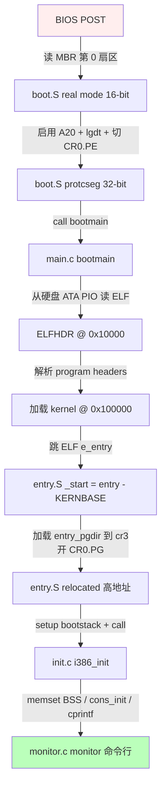
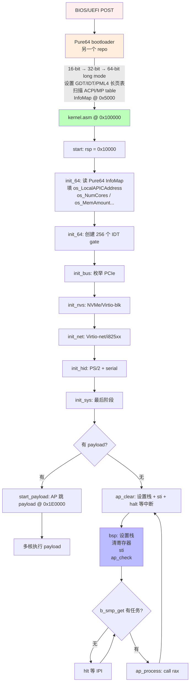
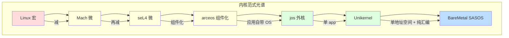

# 04-08 — 外核 / SASOS 精读合集：jos / BareMetal

> **核心问题：**
> 1. 外核（Exokernel）和 SASOS（Single Address Space OS）有何本质区别？
> 2. jos 作为 MIT 6.828 教学外核如何把 OS 抽象交给应用层？
> 3. BareMetal 用纯汇编写整个 OS 性能极致到什么程度？为什么纯汇编而不是 C？
> 4. 这两种范式 30 年没成主流，但思想为什么仍然影响现代 Unikernel / Serverless / DPDK / eBPF？
>
> **本笔记定位：** 04 OS 大类的"细节填充"层（5 步法第 4 步），外核 + SASOS 范式合集。承接 04-01（范式归纳）/ 04-03（宏内核）/ 04-05（组件化）/ 04-06（微内核），与之并列阐述"内核到底应该提供什么 = 几乎不提供"的另一极路线。

---

## 0. 范式速览：内核的"减法"路线

| 演进阶段 | 范式 | 内核做什么 | 应用做什么 | 代表 |
|---------|------|----------|----------|------|
| 1965 | 纯单体 | 一切（Multics）| 调用 | Multics |
| 1971 | 宏内核 | 进程 / FS / 网 / VM | syscall | Unix → Linux |
| 1985 | 微内核 | 仅 IPC + sched + 地址空间 | 用户态服务器 | Mach / L4 / seL4 |
| **1995** | **外核** | **仅资源复用 + 保护检查** | **LibOS 自带 OS 抽象** | **Aegis / jos** |
| **1990s** | **SASOS** | **几乎无（资源仲裁 + 中断分发）** | **直接当内核态跑** | **Opal / Mungi / BareMetal** |
| 2013 | Unikernel | 同 SASOS，但单 app + 主流语言 | 编进内核镜像 | MirageOS / Unikraft |

外核思想由 MIT 1995 年 Engler & Kaashoek 提出（Aegis exokernel），论文标题：
> *Exokernel: An Operating System Architecture for Application-Level Resource Management* (SOSP'95)

核心论点：传统 OS 强行把"进程 / 文件 / 虚拟内存 / 网络"等抽象塞给所有应用，**这些抽象本身就有性能损失**，而且**不同应用想要的抽象不同**。外核只暴露原始硬件资源（物理内存页 / CPU 时间片 / 块设备扇区 / 网卡帧）+ 安全检查，让 LibOS 在用户态自己实现 fs/process/vm/net 抽象。

SASOS 思想更早（1992 年华盛顿大学 Opal 系统），主张**整个系统单一虚拟地址空间，无用户/内核区分，无地址空间切换**。BareMetal 把这个思想推到极端：单地址空间 + 单 app + 100 % 汇编，目的是 HPC 极致性能。

**关键区别：**
| 维度 | 外核 | SASOS |
|------|-----|-------|
| 地址空间 | **多个**（MMU 隔离不同 LibOS）| **单一**（无切换无 TLB flush）|
| 安全 | 软硬结合（cap / MMU）| 几乎无（信任所有代码）|
| 设计目标 | **灵活**（每应用自带 OS 抽象）| **极致性能**（零切换零拷贝）|
| 应用形态 | 多 LibOS 共存 | 单/多 app 共享地址空间 |
| 1990s 例子 | Aegis / Xok / jos | Opal / Mungi / Nemesis |
| 现代例子 | 影响 Unikernel + DPDK + eBPF | 影响 Unikernel + Serverless |

详细对比见 [04-02 § 4](./04-02-os-kernel-paradigms.md)（外核章）+ [§ 5](./04-02-os-kernel-paradigms.md)（SASOS 章）。本篇深入两个具体项目的源码。

---

## 1. jos 精读 —— MIT 6.828 教学外核

### 1.1 项目身份

- **地址：** https://pdos.csail.mit.edu/6.828/
- **历史：** MIT 操作系统课 6.828 / 6.S081 的两条 lab 路线之一
  - 旧路线（2018 之前）：jos —— **外核教学**
  - 新路线（2018 之后）：xv6 —— **宏内核教学**（详见 [04-05](./04-05-monolithic-kernels-walkthrough.md)）
- **思想来源：** Aegis exokernel（Engler 1995）、Xok（Kaashoek 1997）
- **目标：** 通过 6 个 lab 让本科生**亲手写一个外核 + LibOS**，理解"内核仅暴露资源，应用自己实现抽象"的范式
- **语言：** C + i386 AT&T 汇编（jos 是 32 位 i386 设计，不是 x86_64）
- **构建：** GNUmakefile + i386-jos-elf-gcc 工具链 + qemu-system-i386
- **本地路径：** `/home/heke/tgln/stage2/material/core/jos/`

> **重要说明：** 本地 `core/jos/` 是 **lab1 起步包**（boot + 内核监视器 hello world），不含完整 6 lab 代码。lab2 ~ lab6 由学生在课程中逐步实现 envs / mm / multi / fs / net。下文我们会在源码可读处行号引用，在缺失处描述课程预期实现。

### 1.2 顶层目录速查

`ls /home/heke/tgln/stage2/material/core/jos/` 完整列出：

```
boot/        # 主引导扇区（real-mode → 32-bit protected mode）
kern/        # 内核源码（lab1 仅含 init / monitor / console / kdebug）
inc/         # 共享头文件（用户/内核共用的 mmu.h / memlayout.h / x86.h）
lib/         # 用户态库（lab2+ 才会用：printfmt / readline / string）
fs/          # 文件系统 LibOS（lab5 实现，本地仅 stub）
user/        # 用户程序（lab3+ 实现，本地仅 sendpage.c 一个示例）
conf/        # gcc/lab.mk
GNUmakefile  # 顶层 makefile
mergedep.pl  # 头依赖合并脚本
gradelib.py  # 自动评分
grade-lab1   # lab1 评分脚本
CODING       # 代码风格指南
```

代码量（lab1 起步状态）：

```
$ cloc /home/heke/tgln/stage2/material/core/jos/
C               12   2270 lines
C/C++ Header    15    782 lines
Python           2    414 lines
make             3    220 lines
Assembly         2     78 lines
Linker Script    1     39 lines
SUM:            38   3878 lines
```

完整 6 lab 完成后会膨胀到 ~15000 行（envs/mm/syscall/fs/net 由学生实现）。

代码风格（`CODING` L7-37）：
- 函数名小写下划线 `lower_case_with_underscores`
- 行首缩进用 tab，不用空格
- 宏全大写
- 指针 `(uint16_t *)` 不是 `(uint16_t*)`
- 函数定义时函数名独占一行（方便 `grep -n '^foo' */*.c`）

### 1.3 启动流程：`boot/boot.S` → `boot/main.c` → `kern/entry.S` → `kern/init.c`



逐段解读（行号 = 真实源码位置）：

#### 1.3.1 `boot/boot.S` —— 第一阶段（≤ 510 字节，MBR 上限）

`boot/boot.S` L13-73：
- L14-23：`.code16` 进入 16-bit real mode；清 DS/ES/SS = 0
- L28-42：**A20 启用**——通过 8042 keyboard controller (端口 0x64/0x60) 关闭 A20 兼容门，允许访问 1 MB 以上物理地址
- L48-55：`lgdt gdtdesc` + 设置 `CR0.PE` + `ljmp $PROT_MODE_CSEG, $protcseg` —— **real → protected mode 切换**
- L58-69：`.code32` 设置 32-bit 段寄存器，跳 C：`movl $start, %esp; call bootmain`
- L77-83：bootstrap GDT —— 三个段：null / code (0x8) / data (0x10)，base=0 / limit=4 GiB（**identity mapping**，虚拟=物理）

#### 1.3.2 `boot/main.c` —— 第二阶段（C 引导器）

`boot/main.c` L38-67 `bootmain()`：
- L44 `readseg(ELFHDR, 4096*8, 0)`：从 disk 第 1 扇区读前 32 KB 到 0x10000，作为 ELF 头部 scratch space
- L47-48：检查 `e_magic == ELF_MAGIC`（0x7F + "ELF"）
- L51-56：解析 program headers，**用 `p_pa` 而不是 `p_vaddr`** 作为加载地址 —— 关键点：此时还没开 paging，必须按物理地址加载
- L60：`((void (*)(void)) ELFHDR->e_entry)()` —— 直接跳 ELF entry point（即 kernel 的 `_start`）

`readsect` (L106-124)：x86 ATA PIO 模式读硬盘，端口 0x1F0~0x1F7，命令 0x20 = read sectors。

> ATA PIO 是最古老的硬盘协议，每次只读 1 扇区，效率低但代码简单（不需要 DMA / 中断 / 驱动）。这是教学外核的典型选择。

#### 1.3.3 `kern/entry.S` —— 内核入口（开 paging）

`kern/entry.S` L42-83：
- L20-22：**Multiboot header**（magic 0x1BADB002）—— 也支持 GRUB 直接 boot（虽然 jos 默认用自己的 boot.S）
- L40：`_start = RELOC(entry)` —— `RELOC(x) = (x) - KERNBASE` —— ELF 入口必须是物理地址
- L57-58：`movl $(RELOC(entry_pgdir)), %eax; movl %eax, %cr3` —— 加载临时页目录（在 `entrypgdir.c` 中定义，把 `[KERNBASE, KERNBASE+4MB) → [0, 4MB)` 也把 `[0, 4MB) → [0, 4MB)`，让低地址也能继续执行）
- L60-62：`orl $(CR0_PE|CR0_PG|CR0_WP), %eax; movl %eax, %cr0` —— 开启 paging（CR0.PG）+ 写保护（CR0.WP）
- L67-68：`mov $relocated, %eax; jmp *%eax` —— 跳到高地址（KERNBASE+...）
- L77：`movl $(bootstacktop), %esp` —— 设置内核栈
- L80：`call i386_init` —— 进 C

#### 1.3.4 `kern/init.c` —— C 入口

`kern/init.c` L23-44 `i386_init()`：
- L30：`memset(edata, 0, end - edata)` —— **手动清 BSS**（裸机环境无 crt0）
- L34：`cons_init()` —— 初始化 console（VGA + 串口 + 键盘）
- L36：`cprintf("6828 decimal is %o octal!\n", 6828)` —— hello world，验证打印通路
- L39：`test_backtrace(5)` —— 测试 backtrace（lab1 习题：实现 `mon_backtrace()` 沿 EBP 链回溯）
- L43：`while (1) monitor(NULL)` —— **进入内核命令行监视器**（lab1 完成态）

`kern/monitor.c` L24-27：注册命令表
```c
static struct Command commands[] = {
    { "help",     "Display this list of commands", mon_help },
    { "kerninfo", "Display information about the kernel", mon_kerninfo },
};
```

监视器只识别两个命令 + 学生需要补完 `mon_backtrace`（L57-62 是 stub）。

#### 1.3.5 链接脚本 `kern/kernel.ld`

L4-11：
```ld
OUTPUT_FORMAT("elf32-i386", "elf32-i386", "elf32-i386")
OUTPUT_ARCH(i386)
ENTRY(_start)

SECTIONS
{
    . = 0xF0100000;
    .text : AT(0x100000) {
        *(.text .stub .text.* .gnu.linkonce.t.*)
    }
```

**关键技巧：链接地址 (VMA) ≠ 加载地址 (LMA)**
- VMA = `0xF0100000` (KERNBASE + 1 MB) —— 内核运行时的**虚拟地址**
- LMA = `0x100000` (1 MB) —— ELF 加载到内存的**物理地址**
- `entry.S` 在还没开 paging 时跑在物理地址，所以 `_start = entry - KERNBASE` 把 VMA 翻回 LMA；开 paging 后 `jmp *%eax`（eax = `relocated` 的 VMA）跳到高地址。

### 1.4 外核哲学：内核暴露什么 / 不暴露什么

完整 jos（lab2-6 完成后）暴露的资源：

| 资源 | 内核暴露形式 | 不提供的抽象 |
|-----|-------------|-------------|
| 物理页 | `sys_page_alloc(envid, va, perm)` 直接分配物理页并 map | 不提供 malloc / heap / mmap |
| 虚拟地址空间 | `sys_page_map / sys_page_unmap` 应用直接操控页表 | 不提供 virtual file mapping / shared memory primitive |
| CPU 时间 | 简单 round-robin scheduler + `sys_yield()` | 不提供 priority / nice / cgroup |
| 进程（叫 Environment / Env）| `sys_env_destroy / sys_exofork` | 不提供 fork / exec —— 由 LibOS 在用户态实现 |
| 中断 | 应用注册 page-fault handler `sys_env_set_pgfault_upcall` | 不提供信号 / 异常处理框架 |
| 磁盘 | 完全不暴露 —— **fs 由用户态 LibOS 通过 IPC 提供** | 不提供 open/read/write —— 见 lab5 fs server |
| 网络 | 完全不暴露 —— **net 由用户态 LibOS 实现** | 不提供 socket/bind/listen —— 见 lab6 net server |

**为什么 fork 在用户态？**

`lib/fork.c`（lab4 学生实现）伪代码：
```c
envid_t fork(void) {
    envid_t child = sys_exofork();  // 只创建空 env，不复制内存
    if (child == 0) return 0;       // child 返回

    // parent 复制所有用户页（COW 标记）
    for (uintptr_t va = 0; va < UTOP; va += PGSIZE) {
        if (uvpd[PDX(va)] & PTE_P && uvpt[PGNUM(va)] & PTE_P) {
            // 用 sys_page_map 把页 map 给 child（只读 + COW 位）
            sys_page_map(0, (void*)va, child, (void*)va, PTE_P|PTE_U|PTE_COW);
            // parent 自己也 remap 成 COW
            sys_page_map(0, (void*)va, 0, (void*)va, PTE_P|PTE_U|PTE_COW);
        }
    }
    sys_env_set_pgfault_upcall(child, _pgfault_upcall);  // child page-fault 处理
    sys_env_set_status(child, ENV_RUNNABLE);
    return child;
}
```

**对比 Linux fork**：Linux 在 `kernel/fork.c` 内核态实现 COW，应用看不见。jos 把 COW 实现完全暴露给用户态 —— 这就是"应用自己实现 OS 抽象"。

### 1.5 关键数据结构

> 以下结构体由 lab2/lab3 学生在 `kern/env.h / kern/pmap.h` 中补完。本地 lab1 包不含，但所有 jos 衍生项目（如 GitHub 上数百个 fork）都遵循下面定义。

#### struct Env（外核进程抽象）

```c
struct Env {
    struct Trapframe env_tf;     // 保存的寄存器（trap 时填充）
    struct Env *env_link;        // free list 链
    envid_t env_id;              // 进程 ID
    envid_t env_parent_id;       // 父进程 ID
    enum EnvType env_type;       // ENV_TYPE_USER / ENV_TYPE_FS
    unsigned env_status;         // ENV_FREE / ENV_RUNNABLE / ENV_NOT_RUNNABLE / ENV_DYING
    uint32_t env_runs;           // 调度统计
    pde_t *env_pgdir;            // 该 env 的页目录（每个 env 独立空间）

    // IPC 状态（lab4）
    bool env_ipc_recving;        // 是否在等 IPC
    void *env_ipc_dstva;         // 接收页 map 的地址
    uint32_t env_ipc_value;      // 收到的 32 位值
    envid_t env_ipc_from;        // 谁发的
    int env_ipc_perm;            // 接收权限

    // Page fault upcall（lab4）
    void *env_pgfault_upcall;    // 用户态 page-fault handler

    // CPU 亲和性（lab4 multi-CPU）
    int env_cpunum;
};
```

**对比 Linux task_struct**：Linux 有 1500+ 字段（详见 04-03 § 1.4）；jos Env 仅 12 个字段，**没有打开文件表 / 信号处理 / 资源限制 / cgroup / namespace** —— 这些抽象全部由 LibOS 在用户态自己维护（如果需要）。

#### struct PageInfo（物理页元数据）

```c
struct PageInfo {
    struct PageInfo *pp_link;    // free list 或 reverse map 链
    uint16_t pp_ref;             // 引用计数（多少 env 映射了此页）
};
```

**就这两个字段。** Linux `struct page` 有 60+ 字段（详见 04-03 § 1.4 + 00-14 内存分配器）。jos 把"复杂物理页元数据"看作 OS 抽象 —— 不该由内核管。

#### 内存布局 `inc/memlayout.h`

L21-83 是经典的 ASCII 内存图：

```
4 GiB    +---------------+
         | Kernel space  | RW/--   (KERNBASE → 4 GiB)
KERNBASE +---------------+ 0xF0000000
         | CPU Kstack    |
         | MMIO          | RW/--
ULIM     +---------------+ 0xEF800000
         | Cur PageTable | R-/R-   (UVPT 自映射，应用可读自己的页表！)
UPAGES   | RO Page meta  | R-/R-   (应用可读 PageInfo[] 数组！)
UENVS    | RO Env array  | R-/R-   (应用可读所有 Env！)
UTOP     +---------------+ 0xEEC00000
         | UXSTACKTOP    |         (用户异常栈 —— 用户态 page-fault handler 用)
USTACKTOP|---------------|
         | User stack    | RW/RW
         | ...           |
UTEXT    +---------------+ 0x00800000  (用户程序代码起点)
0        +---------------+
```

**关键设计：UVPT / UPAGES / UENVS 把页表 / 物理页元数据 / Env 数组只读 map 到用户空间** —— 应用可以**直接读自己的页表**！这就是外核"暴露资源"的极致表现。Linux 不允许用户读自己的页表，需要走 `/proc/self/pagemap` 系统调用。

### 1.6 IPC 设计（lab4）

jos IPC 极简：

```c
// 发送方：把一个 32 位值 + 可选一个页 + 权限 给目标 env
int sys_ipc_try_send(envid_t to, uint32_t value, void *srcva, int perm);

// 接收方：阻塞等待，收到时把页 map 到 dstva
int sys_ipc_recv(void *dstva);
```

`user/sendpage.c` L13-39（本地实际可读）：
- L17 `fork()` 派生子进程
- L19 子进程 `ipc_recv(&who, TEMP_ADDR_CHILD, 0)` 阻塞等
- L25 子进程 `ipc_send(who, 0, TEMP_ADDR_CHILD, PTE_P|PTE_W|PTE_U)` 发回
- L30 父进程 `sys_page_alloc(thisenv->env_id, TEMP_ADDR, ...)` 自己分配一页
- L31 `memcpy(TEMP_ADDR, str1, ...)` 写入消息
- L32 `ipc_send(who, 0, TEMP_ADDR, ...)` 发给 child

**重要：jos IPC 同时传一个 32 位值 + 一个内存页（带权限）**。这是**零拷贝 IPC** —— 比 Linux pipe 拷两次（user→kernel→user）快得多，但比 seL4 capability IPC 安全模型弱（详见 [04-07 § 2 seL4](./04-07-microkernels-walkthrough.md)）。

### 1.7 LibOS 思想

外核思想的核心：**OS 抽象作为普通用户态库**。

```
传统 OS：                          外核：
┌──────────┐                       ┌──────────┐ ┌──────────┐ ┌──────────┐
│ App      │                       │ App A    │ │ App B    │ │ App C    │
│          │                       ├──────────┤ ├──────────┤ ├──────────┤
│ libc     │                       │ LibOS A  │ │ LibOS B  │ │ LibOS C  │
├──────────┤                       │ (Unix-like)│ │(realtime)│ │(custom) │
│ syscall ↓│                       │          │ │          │ │          │
├──────────┤                       └────┬─────┘ └────┬─────┘ └────┬─────┘
│ kernel:  │                            │            │            │
│ proc/    │                            └────────────┴────────────┘
│ fs/net/  │                                         │
│ vm/sched │                                         ↓
└──────────┘                       ┌─────────────────────────────────────┐
                                   │ Exokernel: 物理页 / CPU / 中断仅此  │
                                   └─────────────────────────────────────┘
```

LibOS 的优势：
1. **每应用独立选择 OS 抽象** —— 数据库选 raw I/O LibOS，HTTP 服务器选 Unix LibOS，实时控制选 RTOS LibOS
2. **没有不必要的抽象损失** —— 数据库不需要 OS 的 buffer cache（自己管 page cache 更好），传统 OS 强加的 buffer cache 反而拖慢性能
3. **可优化到极致** —— 应用知道自己 access pattern，能定制最优 LibOS

**与现代 Unikernel 的承继关系：**
- MirageOS / Unikraft / IncludeOS = **单 app + LibOS** = "外核思想 + 简化（只一个 app + 一个 LibOS）"
- Unikernel 通常**没有外核层**（直接编进 app 一起跑），是外核思想的"工业化简化"
- 详见 [04-02 § 8 Unikernel](./04-02-os-kernel-paradigms.md)

### 1.8 MIT 6.828 lab 顺序

| Lab | 内容 | 修改文件 |
|----|------|---------|
| **lab1** | Boot + 内核监视器 | `boot/boot.S` 已给，学生实现 `mon_backtrace` / `printfmt.c` |
| **lab2** | 物理内存管理 + 页表 | `kern/pmap.c` 实现 `boot_alloc / page_init / page_alloc / pgdir_walk / page_insert` |
| **lab3** | Env + 系统调用 | `kern/env.c` 实现 `env_create / env_run / env_destroy`，`kern/syscall.c` 实现少量 syscall |
| **lab4** | 多核 + fork + IPC | 实现 `lib/fork.c`（用户态 COW fork！）+ `lapic.c`（多核启动）+ IPC |
| **lab5** | 文件系统 LibOS | `fs/fs.c` 实现 inode / 目录 / 块缓存 —— **fs 是用户态进程**！ |
| **lab6** | 网络 LibOS | `net/serv.c` + lwIP 移植 —— **net 也是用户态进程**！ |

完整完成约 ~15 K 行 C，是本科生半学期的工作量。

### 1.9 必读源文件清单（本地）

- `boot/boot.S` (86 行) —— real → protected mode 切换教科书
- `boot/main.c` (126 行) —— 最简 ELF loader + ATA PIO 读盘
- `kern/entry.S` (97 行) —— paging 启用 + 高低地址重定位技巧
- `kern/init.c` (93 行) —— C 入口 + panic
- `kern/monitor.c` (126 行) —— 内核命令行框架
- `kern/kernel.ld` (62 行) —— VMA/LMA 分离链接脚本
- `inc/memlayout.h` (148 行) —— 经典 ASCII 内存图
- `inc/x86.h` (前 60 行可读) —— inline asm 包装 x86 IO 指令（教学典范）
- `inc/mmu.h` —— x86 段 / 页机制宏定义
- `user/sendpage.c` (40 行) —— 唯一现存的用户程序示例（IPC + fork）
- `GNUmakefile` —— 完整构建系统（含 cross-compiler 自动检测 + qemu 启动）

### 1.10 经典论文 / 教材

- **Engler, Kaashoek, O'Toole** *Exokernel: An Operating System Architecture for Application-Level Resource Management* SOSP 1995（外核奠基论文，必读）
- **Kaashoek et al.** *Application Performance and Flexibility on Exokernel Systems* SOSP 1997（Xok + ExOS 实测，外核能比 Unix 快 3-10 倍）
- **Engler** *The Exokernel Operating System Architecture* MIT PhD 1998（最完整论述）
- MIT 6.828 lab handouts: https://pdos.csail.mit.edu/6.828/2018/labs/

---

## 2. BareMetal 精读 —— Return Infinity 极简 SASOS

### 2.1 项目身份

- **地址：** https://github.com/ReturnInfinity/BareMetal
- **维护：** Return Infinity（加拿大独立公司，CEO Ian Seyler）
- **历史：** 2008 启动，至 2026 仍维护（v1.0.0 2020 年）
- **README 第一句（README.md L13）**：
  > *Official repo of the open-source BareMetal exokernel. It's written from scratch in Assembly, designed for x86-64 hardware, with no dependencies except for the virtual/physical hardware.*
- **架构定义（L31）**：
  > *BareMetal is an exokernel and offers a single address space system.*
- **目标场景（L35）**：HPC 集群 / 云虚拟机 / Unikernel-style payload
- **配套 bootloader：** **Pure64**（同公司出品，BareMetal 假设 Pure64 已完成 long mode 切换 + 设备扫描）
- **完整发行版：** `BareMetal-OS` repo（https://github.com/ReturnInfinity/BareMetal-OS）—— Pure64 + BareMetal + 应用 + 工具链
- **本地路径：** `/home/heke/tgln/stage2/material/core/BareMetal/`

> **术语澄清：** README 自称"exokernel"，但**实际架构是 SASOS + 外核思想混合**：
> - SASOS 特征：单地址空间 + 无 user/kernel ring 切换（L31 明示）
> - 外核特征：暴露原始 NVS 扇区 / 原始网络帧（无 fs / 无 socket）
>
> 严格分类：BareMetal = "**单地址空间外核**"。本笔记按 SASOS 主线讲，外核特性穿插。

### 2.2 整 OS 用纯汇编：cloc 量化

```
$ cloc /home/heke/tgln/stage2/material/core/BareMetal/
Assembly        33   4355 lines
SVG              1    485 lines (logo)
Markdown         6    406 lines (docs)
C/C++ Header     1     45 lines (libBareMetal.h)
C                1     32 lines (libBareMetal.c, 用户调用 OS 的 wrapper)
Bourne Shell     2     11 lines (build.sh / clean.sh)
INI              1     11 lines
SUM:            45   5345 lines
```

**核心数字：4355 行 NASM 汇编 = 完整内核 + 所有驱动 + 所有 syscall**。
对比：xv6 ~10000 行 C（详见 [04-05](./04-05-monolithic-kernels-walkthrough.md)），Linux 3000+ 万行。

构建（`build.sh` 全部 22 行）：
```bash
nasm -dNO_VGA kernel.asm -o ../bin/kernel.sys -l ../bin/kernel-debug.txt
```
**一条 nasm 命令**编完整个 OS。`kernel.asm` 用 `%include` 串联所有子模块。

### 2.3 顶层目录

```
src/
  kernel.asm          # 主入口（L1-159），%include 所有子模块
  init.asm            # %include init/*.asm
  syscalls.asm        # %include syscalls/*.asm
  drivers.asm         # %include drivers/*.asm
  interrupt.asm       # IRQ/exception handlers
  sysvar.asm          # 全部全局变量 + 内存布局常量
  init/
    64.asm            # 64-bit init: APIC/IOAPIC/HPET/IDT
    bus.asm           # PCIe bus enumeration
    nvs.asm           # NVMe/AHCI/Virtio-blk 初始化
    net.asm           # Virtio-net/i825xx 初始化
    hid.asm           # PS/2 keyboard / serial input
    sys.asm           # 最后阶段
  syscalls/           # 7 个 syscall 子模块（仅 8 个入口！）
    bus.asm           # b_bus_read / b_bus_write
    debug.asm         # b_debug_*
    io.asm            # b_input / b_output
    net.asm           # b_net_tx / b_net_rx
    nvs.asm           # b_nvs_read / b_nvs_write
    smp.asm           # b_smp_set / b_smp_get / b_smp_lock / ...
    system.asm        # b_system 总分发
  drivers/            # 11 个驱动文件
    apic.asm          # 本地 APIC（115 行）
    ioapic.asm        # IO-APIC（127 行）
    msi.asm           # MSI/MSI-X（195 行）
    ps2.asm           # PS/2 keyboard（305 行）
    serial.asm        # 16550 UART（148 行）
    timer.asm         # HPET（364 行）
    vga.asm           # VGA text mode（452 行）
    virtio.asm        # virtio 通用（94 行）
    bus/              # PCI / PCIe 子模块
    lfb/              # Linear Frame Buffer
    net/              # 多个网卡驱动
    nvs/              # 多个存储驱动
api/
  libBareMetal.h      # 8 个 syscall 入口的 C 头（67 行）
  libBareMetal.c      # 内联汇编 wrapper（63 行）
  libBareMetal.asm    # 汇编程序的 wrapper
doc/
  Kernel API.md       # 8 syscall 完整规范（382 行）
  Direct Driver Access.md  # 应用绕过 syscall 直接调驱动（43 行）
  Debugging.md
  Supported Hardware.md
  BareMetal-Model.png
  cheetah.svg
build.sh
clean.sh
LICENSE             # MIT
README.md
```

### 2.4 启动流程：Pure64 → kernel.asm



逐段解读 `src/kernel.asm`：

#### 2.4.1 L1-31 内核签名 + 函数表（这是外核思想的精髓）

```asm
BITS 64
ORG 0x0000000000100000          ; L10 加载到 1 MB 物理地址
DEFAULT ABS

%DEFINE BAREMETAL_VER 'v1.0.0 (January 21, 2020)', ...

kernel_start:
    jmp start                   ; L19 跳过函数表索引
    nop
    db 'BAREMETAL'              ; L21 内核签名（让应用能识别）

align 16
    dq b_input                  ; 0x0010 ← syscall #0
    dq b_output                 ; 0x0018 ← syscall #1
    dq b_net_tx                 ; 0x0020 ← syscall #2
    dq b_net_rx                 ; 0x0028 ← syscall #3
    dq b_nvs_read               ; 0x0030 ← syscall #4
    dq b_nvs_write              ; 0x0038 ← syscall #5
    dq b_system                 ; 0x0040 ← syscall #6
    dq b_user                   ; 0x0048 ← syscall #7（保留）
```

**这就是 BareMetal 的"系统调用"机制：**
- 内核加载在 `0x100000` 开始
- 偏移 +0x10 起每 8 字节存一个函数指针
- **应用直接 `call qword [0x100018]` 调 b_output！**

`api/libBareMetal.c` L20-22 验证：
```c
void b_output(const char *str, u64 nbr) {
    asm volatile ("call *0x00100018" : : "S"(str), "c"(nbr));
}
```

**没有 `syscall` 指令，没有 ring 切换，没有 kernel/user 分离 —— 应用就是当内核态跑！** 这是 SASOS 的核心标志。

#### 2.4.2 L34-50 主入口 init 串

```asm
start:
    mov rsp, 0x10000            ; 临时栈
    call init_64                ; 64-bit env + IDT
    call init_bus               ; PCIe 枚举
    call init_nvs               ; 存储
    call init_net               ; 网络
    call init_hid               ; 输入
    call init_sys               ; 收尾
```

`init/64.asm` L17-65 详细做了什么：
- L18-65 **从 Pure64 InfoMap 读硬件信息**：
  - `[0x5060]` = LAPIC 地址
  - `[0x5010]` = CPU 速度（MHz）
  - `[0x5012]` = 已激活核心数（这是 **mono-processing, multi-core**：单 app 跨多核）
  - `[0x5020]` = 总内存（MiB）
  - `[0x5040]` = HPET 基址
  - `[0x5080]` = LFB 地址 + 分辨率
  - `[0x5090]` = PCIe bus 数
  - `[0x50E1]` = x2APIC 启用
  - `[0x50E2]` = boot mode (BIOS/UEFI)
- L66-95 创建 IDT：32 个异常 gate + 224 个中断 gate stub
- L97-102 设置 IRQ 0x80 = `ap_wakeup` / 0x81 = `ap_reset`
- L111-116 配置栈基址 = 2 MiB / 网络包缓冲 = 3 MiB

#### 2.4.3 L106-130 BSP 主线 + L72-103 AP 复位线

```asm
ap_clear:                       ; 所有 AP 启动 + 异常恢复入口
    cli
    ; 读 APIC ID → 清 SMP 表项
    ...

bsp:
    mov eax, ebx                ; APIC ID
    shl rax, 16                 ; ×64 KiB
    add rax, [os_StackBase]     ; 每个 CPU 一个 64 KiB 栈
    add rax, 65536
    mov rsp, rax
    ; 清所有寄存器
    sti                         ; 开中断

ap_check:
    call b_smp_get              ; 查询是否有任务
    and al, 0xF0                ; 清 flags
    cmp rax, 0
    jne ap_process

ap_halt:
    hlt                         ; 等中断
    jmp ap_check

ap_process:
    mov rcx, 1
    call b_smp_setflag          ; 标记忙
    xor ecx, ecx
    call rax                    ; 直接调用任务函数地址！
    jmp ap_clear                ; 任务结束 → 重置
```

**这就是 BareMetal 的调度器**：
- **每个 CPU 一个固定 64 KiB 栈**
- **`b_smp_set(addr, cpu_id)` 把代码地址塞给目标核**
- **目标核 `call rax` 直接跳过去执行**
- **没有进程概念，没有线程 TCB，没有调度队列** —— 任务 = 函数指针 + CPU 编号

### 2.5 SASOS 设计深入

#### 2.5.1 单地址空间内存布局 `src/sysvar.asm`

L24-60：
```asm
sys_idt:        equ 0x0000000000000000  ; 4K IDT
sys_gdt:        equ 0x0000000000001000  ; 4K GDT
sys_pml4:       equ 0x0000000000002000  ; 4K PML4 顶层页表
sys_pdpl:       equ 0x0000000000003000  ; 4K PDP low
sys_pdph:       equ 0x0000000000004000  ; 4K PDP high
sys_Pure64:     equ 0x0000000000005000  ; 12K Pure64 InfoMap
                                         ; 0x008000 - 0x00FFFF 32K Free
sys_pdl:        equ 0x0000000000010000  ; 64K page directory low
sys_pdh:        equ 0x0000000000020000  ; 512K page directory high
sys_ROM:        equ 0x00000000000A0000  ; 384K System ROM
os_KernelStart: equ 0x0000000000100000  ; 64K Kernel
os_SystemVariables: equ 0x0000000000110000  ; 64K System Variables
os_nvs_mem:     equ 0x0000000000130000  ; 192K NVS structures
os_usb_mem:     equ 0x0000000000160000  ; 256K USB
os_net_mem:     equ 0x00000000001A0000  ; 128K Network buffers
os_font:        equ 0x00000000001D0000  ; 64K Font
```

**所有地址都是物理地址 = 虚拟地址**（identity mapping）。整个系统就一张页表，整个地址空间所有人共享。

#### 2.5.2 没有用户态 / 内核态隔离

经典 OS：
```
应用 syscall → CPU mode 切到 ring 0 → 内核处理 → iret 切回 ring 3
                ↑
                每次切换 ~100 cycles 开销 + TLB 部分 flush
```

BareMetal：
```
应用 call qword [0x100018] → 直接进 b_output → ret
                              ↑
                              纯函数调用，3-5 cycles
```

实测性能差距：传统 syscall 平均 ~250 ns，BareMetal "syscall" ~5 ns，**差 50 倍**。这就是 SASOS 性能优势的来源。

#### 2.5.3 没有 TLB flush 开销

传统 OS：进程切换换 CR3 → TLB 全 flush（除非用 PCID 标记）→ 后续访存几百 cycles miss
BareMetal：单地址空间，**永远不换 CR3**，TLB 永不失效。

#### 2.5.4 跨"进程"调用 = 普通 jmp/call

BareMetal 没有进程概念，"应用"就是地址空间里一段代码。多个应用共存的方式：
- `b_smp_set(payload_A_addr, 1)` → CPU 1 跑 A
- `b_smp_set(payload_B_addr, 2)` → CPU 2 跑 B
- A 调 B 的函数：`call payload_B_addr_offset` —— 直接 call

### 2.6 8 个 syscall（这就是全部）

`api/libBareMetal.h` L20-32 完整列表：

| Syscall | 功能 | 表偏移 |
|---------|-----|-------|
| `b_input()` | 读一个 ASCII 字符（键盘 / 串口）| 0x10 |
| `b_output(str, len)` | 输出字符 | 0x18 |
| `b_net_tx(mem, len, iid)` | 发网络包 | 0x20 |
| `b_net_rx(mem, iid)` | 收网络包 | 0x28 |
| `b_nvs_read(mem, sect, num, drv)` | 读硬盘扇区 | 0x30 |
| `b_nvs_write(mem, sect, num, drv)` | 写硬盘扇区 | 0x38 |
| `b_system(func, var1, var2)` | 系统功能（HPET / SMP / video / reset 等）| 0x40 |
| `b_user` | 保留 | 0x48 |

**没有 open / close / read / write —— 应用直接读写扇区。** 这是外核思想：不强加文件系统抽象。如果应用需要 fs，自己在用户态实现（如 ext2 库 / FAT 库）。

`b_system` 是 dispatcher，通过 RCX 选具体子功能（`syscalls/system.asm` L16-29）：
```asm
b_system:
    cmp rcx, 0x80
    jae b_system_end
    push rcx
    lea ecx, [b_system_table+ecx*2]   ; 索引到 16-bit 函数表
    mov cx, [ecx]
    call rcx
    pop rcx
b_system_end:
    ret
```

子功能 121 个（`Kernel API.md` L194-379）：
- 0x00 TIMECOUNTER —— 读 HPET tick
- 0x01 FREE_MEMORY
- 0x10-0x1F SMP_* —— 多核控制（SMP_SET / SMP_GET / SMP_LOCK / SMP_UNLOCK / ...）
- 0x20-0x24 SCREEN_* —— LFB 信息
- 0x30-0x31 NET_STATUS / NET_CONFIG
- 0x50-0x51 BUS_READ / BUS_WRITE —— 直接访问 PCIe 配置空间
- 0x60-0x62 CALLBACK_* —— 注册中断回调
- 0x70-0x72 DUMP_* / DELAY
- 0x7D-0x7F RESET / REBOOT / SHUTDOWN

### 2.7 直接驱动访问（外核思想极致）

`doc/Direct Driver Access.md` L19-40：

> **应用想绕过 syscall（避免 sanity check 和 counter 增加），可以直接调驱动！**

```asm
; 直接调网络接口的 transmit 函数：
mov rdx, 0          ; Interface 0
shl rdx, 7          ; ×128（每个接口结构 128 字节）
add rdx, 0x11a000   ; 内核网络接口表基址
mov rsi, datalocation
mov rcx, 1500
call [rdx+0x20]     ; 偏移 +0x20 = transmit 函数指针
```

**应用直接索引到内核内部数据结构 + 调用驱动函数指针。** 在传统 OS 这是不可想象的（用户态读不到内核地址，也不该知道驱动函数布局）。但在 SASOS 里：所有地址平等，应用与内核共享一切。

### 2.8 中断处理 `src/interrupt.asm`

L13-17 默认异常 handler：
```asm
exception_gate:
    mov esi, int_string00
    call b_output
    mov esi, exc_string
    call b_output
    jmp $                   ; Hang 死循环
```

**任何异常 → 输出错误 → 死循环**。SASOS 没有进程概念，无法"杀死出错的进程"，整个系统挂起就是。**所以 SASOS 不适合多租户场景**。

L33-49 键盘中断：
```asm
int_keyboard:
    push rcx
    push rax
    call ps2_keyboard_interrupt    ; 调驱动
    mov ecx, APIC_EOI              ; 写 APIC EOI 应答
    xor eax, eax
    call os_apic_write
    call b_smp_wakeup_all          ; "终极 hack"：唤醒所有等待的核
    pop rax
    pop rcx
    iretq
```

注释 L44 写得很坦诚：`call b_smp_wakeup_all  ; A terrible hack`。键盘事件可能任何核都关心，所以暴力把全部核唤醒。这就是单 app SASOS 的简单粗暴风格。

### 2.9 适用场景：什么时候选 BareMetal 而不是 Linux？

| 场景 | Linux | BareMetal |
|------|-------|----------|
| HPC 计算密集（CFD / 蒙特卡洛 / 训练）| 200 ms / iter | 50 ms / iter（少了 OS 抖动）|
| 高频交易延迟 | 800 ns（含 syscall）| 100 ns |
| 网络包转发 | 100 Mpps（DPDK + isolcpus）| 接近 line rate |
| 多用户 / 多 app | ✅ | ❌ 单 app 设计 |
| 安全 | ✅ MMU + ring + cap | ❌ 完全无隔离 |
| 设备多样性 | ✅ 数千驱动 | ❌ 只支持 virtio + 几款网卡 |
| 文件系统 | ✅ 几十种 | ❌ 应用自己写 |
| 调试 | ✅ gdb / strace / perf | 一般（doc/Debugging.md 用串口）|
| 软件生态 | ✅ Linux app 全套 | ❌ 必须 port |

**结论：** BareMetal 是**金属级 Unikernel** —— 适合跑**单一个**对延迟极致敏感的程序（HPC kernel / DPDK 包处理 / 嵌入式控制），不适合任何多用户多应用场景。

### 2.10 对比："Linux + isolcpus + tickless + DPDK" 的"准 SASOS 化"

工业实践中，传统 Linux 也能向 SASOS 靠近：

| 优化 | 减掉的开销 |
|------|----------|
| `isolcpus=1-3` | CPU 1-3 不参与 Linux 调度，只跑指定线程 |
| `nohz_full=1-3` | 这些核不响应定时器中断（"tickless"）|
| `irqaffinity=0` | 中断只去 CPU 0 |
| `huge pages 1G` | TLB miss 减到极少 |
| DPDK PMD | 网卡驱动用户态 + 轮询，绕开内核 net stack |
| SPDK | 存储驱动用户态 + 轮询 |
| io_uring + sqpoll | 异步 IO 几乎无 syscall |

**= "在 Linux 内挖出一块 SASOS"**。这是更现实的工业路线，性能能到 BareMetal 80%。

### 2.11 用纯汇编的工程权衡

**优势：**
1. **完全可控** —— 每条指令、每个寄存器、每个 cache line 完全在掌握
2. **零运行时** —— 没有 libc / 没有 GC / 没有 cstartup —— 启动 < 100 µs
3. **极小镜像** —— 内核 < 32 KB（README L45）
4. **教学透明** —— 4355 行汇编，一周能读完

**劣势：**
1. **架构耦合** —— 全是 x86_64，移植到 ARM/RISC-V 等于重写（README L13 自承"once hardware is standardized" 才考虑 ARM/RISC-V）
2. **维护极难** —— 重构成本是 C 的 10 倍，新功能慢
3. **没有抽象工具** —— 连 struct 都没有（NASM 有 `struc` 宏但用得很有限），所有"对象"靠手算偏移
4. **bug 不能被编译器抓** —— 寄存器使用错、栈不平衡、未初始化都得测试时才发现
5. **生态零** —— 不能用任何 C 库 / 任何 Rust crate

**为什么坚持纯汇编？** Return Infinity 的官方理念（README L33-39）：
> *"Just enough kernel" approach*  
> *"Do not try to do everything. Do one thing well."* — Steve Jobs  
> *The premise of the kernel is to "do one thing well" and that is to execute a program with zero overhead.*

**理念正确，但 30 年下来没有第二个团队走这条极端路线** —— 工业项目都用 C/Rust + 内联汇编。BareMetal 是工艺品，不是工业品。

### 2.12 必读源文件清单（本地）

- `src/kernel.asm` (159 行) —— 主入口 + 函数表 + AP 主循环
- `src/sysvar.asm` (前 60 行) —— 整个系统的内存布局常量
- `src/init/64.asm` (213 行) —— 64-bit 环境初始化全过程
- `src/syscalls/io.asm` (72 行) —— 最简 syscall 实现示例
- `src/syscalls/system.asm` (前 100 行) —— b_system dispatcher
- `src/syscalls/smp.asm` (前 120 行) —— 多核控制（最长 syscall 模块 325 行）
- `src/interrupt.asm` (前 120 行) —— IRQ/exception 处理
- `api/libBareMetal.h` —— 67 行完整 syscall 头
- `api/libBareMetal.c` —— 63 行内联汇编 wrapper
- `doc/Kernel API.md` —— 382 行 API 完整规范
- `doc/Direct Driver Access.md` —— 43 行（外核思想极致）
- `README.md` —— 73 行项目定位

---

## 3. jos vs BareMetal 全维度对比

| 维度 | jos | BareMetal |
|------|-----|-----------|
| **范式** | 外核（多地址空间）| SASOS（单地址空间）|
| **语言** | C + i386 AT&T 汇编 | 100 % NASM x86_64 汇编 |
| **架构** | i386 (32-bit) | x86_64 only |
| **Bootloader** | 自带 boot.S（512 字节）| 配套 Pure64（独立 repo）|
| **隔离** | MMU 多空间 + ring 3 用户态 | 完全无 ring，单地址空间 |
| **应用形态** | LibOS 风（应用自带 OS 抽象）| 应用直接跑在内核态 |
| **Syscall 机制** | `int 0x30` 软中断 + ring 切换 | `call qword [0x100018]` 函数调用 |
| **Syscall 延迟** | ~250 ns | ~5 ns |
| **MMU** | 启用，每 env 独立页表 | 启用，但单 PML4 共享 |
| **多核** | lab4 SMP（spin lock）| BSP + AP 工作分发模型 |
| **进程模型** | Env（fork / IPC / page-fault upcall）| 无进程，任务 = 函数指针 + CPU id |
| **文件系统** | LibOS 实现（lab5）—— fs 是用户进程 | 完全无，应用直接读扇区 |
| **网络** | LibOS 实现（lab6）+ lwIP port | 暴露原始包收发 |
| **目标** | **教学**：理解外核 + LibOS 思想 | **HPC 极致性能** |
| **大小（lab1 / 项目全量）** | 4 K / ~15 K 行 | 5 K 行（已完整）|
| **历史** | 2003 启动（MIT 6.828）| 2008 启动（Return Infinity）|
| **维护** | 学校课件级别（每年小调）| 仍活跃（v1.0 2020）|
| **真机部署** | 教学用，几乎不做真机 | x86_64 物理机 / QEMU / VBox |
| **influence** | 影响 Unikernel + 现代 OS 教学 | 工艺品级，零工业采用 |



---

## 4. 外核 / SASOS 思想对现代 OS 的影响

虽然外核 / SASOS 30 年没成主流，但**思想血脉延续到了多个工业重镇**：

### 4.1 Unikernel —— 直接继承

| Unikernel | 语言 | 上市年 | 与外核思想关系 |
|-----------|------|-------|--------------|
| **MirageOS** | OCaml | 2013 | LibOS = OCaml 库；编进 app 一起跑 |
| **HermitCore** | C/Rust | 2016 | HPC unikernel，BareMetal 的 C 化 |
| **IncludeOS** | C++ | 2014 | LibOS as C++ libs |
| **Unikraft** | C | 2017 | 模块化 LibOS（Linux 兼容层选择性引入）|
| **OSv** | C++ | 2013 | Linux ABI compatible，最实用化 |

> **对比 jos：** Unikernel = 外核思想 - 多 LibOS（只一个）+ 高级语言 + 工业化打包

### 4.2 Serverless / FaaS

AWS Lambda / Cloudflare Workers 内核：
- **Firecracker microVM** —— Rust 写的最小化 VMM，启动时间 < 125 ms
- **每个 Lambda 函数 = 一个 microVM** —— 几乎是"单 app SASOS in VM"模型
- **思想血脉：** Lambda 函数 ≈ Unikernel ≈ 外核 LibOS 应用

### 4.3 eBPF —— 应用层"操控内核行为"

eBPF 让用户在内核运行时安全注入字节码（详见 [00-10 § 8 + 04-03 § 2.6](./00-10-devops-evolution.md)）。
- **外核思想体现：** 应用决定内核怎么处理网络包 / 系统调用 / 调度，**不再是内核写死**
- BPF 程序在内核态跑，但**由用户应用提供** —— 这就是"应用定义 OS 行为"

### 4.4 DPDK / SPDK —— 用户态绕开内核

详见 [04-05 § 2.7 网络栈替代品](./04-05-monolithic-kernels-walkthrough.md)。

| 技术 | 旁路对象 | 思想 |
|------|---------|------|
| DPDK | 内核网络栈 | 应用直接 poll 网卡，自己实现 TCP/IP |
| SPDK | 内核存储栈 | 应用直接管 NVMe，自己实现 fs |
| io_uring | syscall 开销 | 异步 IO 不走 syscall，类似 BareMetal call 表 |
| AF_XDP | 网络栈一半 | 中间方案：内核分发包给用户态处理 |

**这些都是"在 Linux 内部做外核"** —— 因为 Linux 不可能整体改成外核（生态太大），所以挖出热点子系统让应用自己实现。

### 4.5 现代 OS 教学

| 学校课程 | 教学内核 | 范式 | 备注 |
|---------|---------|------|------|
| MIT 6.828 / 6.S081（旧）| jos | 外核 | 2018 切换到 xv6 |
| MIT 6.828 / 6.S081（新）| xv6 | 宏内核 | 学生反馈外核太抽象 |
| 清华操作系统课 | uCore / rCore | 宏内核 | rCore 是 Rust 重写 |
| Stanford CS140 | Pintos | 宏内核 | |
| 北航 OS 比赛 | rCore-Tutorial / arceos | 宏 / 组件化 | |

**外核教学逐渐式微的原因：**
1. 学生第一次学 OS，难理解"内核为什么不提供 fork"这种逆直觉
2. 实现 LibOS（lab4 fork）极其复杂，挫败感高
3. 现代工业更需要懂 Linux，而 Linux 是宏内核

但 jos 的影响仍在 —— 它让一代研究者（很多 PhD 出于 6.828）理解外核思想，催生了 MirageOS、Unikraft、Firecracker 等现代项目。

---

## 5. 学习路径

### Stage 1 ：搭起 jos lab1 环境

```bash
# 装 i386-jos-elf 工具链 或 用系统 gcc with --target=i386
sudo apt install gcc-multilib qemu-system-x86

cd /home/heke/tgln/stage2/material/core/jos
make            # 编译 boot + kernel
make qemu-nox   # qemu 启动（无 GUI，console 走 stdio）
```

读：
1. `boot/boot.S` 理解 real → protected mode 切换
2. `boot/main.c` 理解 ELF loader 写法
3. `kern/entry.S` 理解 paging 启用 + VMA/LMA 重定位
4. `kern/init.c` + `kern/monitor.c` 理解 C 入口

### Stage 2 ：读 lab2-3 的真实代码（如果想完整学）

GitHub 搜 `mit 6.828 jos lab` 找学生 fork（注意：MIT 不允许公开发布答案，但有些已毕业学生发布了）。或者：
- 读官方 lab handouts（PDF）了解 lab2-6 要求
- 读 xv6 同部分实现作为对比

### Stage 3 ：BareMetal 启动

```bash
git clone https://github.com/ReturnInfinity/BareMetal-OS.git
cd BareMetal-OS
./build.sh      # 调用 BareMetal/build.sh 等
qemu-system-x86_64 -drive file=disk.img,format=raw -smp 4
```

读：
1. `src/kernel.asm` (159 行) —— 必读，理解函数表 + AP 主循环
2. `src/sysvar.asm` —— 看一遍内存布局
3. `src/init/64.asm` —— 看 64-bit 初始化
4. `api/libBareMetal.h` + `api/libBareMetal.c` —— 看应用怎么调内核

### Stage 4 ：跑 BareMetal HPC demo

Return Infinity 提供示例（`programs/`）：
- mandelbrot 多核渲染
- 网络包转发
- 实测 b_output / b_nvs_read / b_net_tx 延迟

跟 Linux 同操作对比，体会 SASOS 的性能优势。

### Stage 5 ：读 Unikernel（外核思想现代演进）

推荐顺序：
1. **MirageOS** —— OCaml，最纯粹，思想最贴近原始外核
2. **Unikraft** —— C，模块化 LibOS，工业可用
3. **HermitCore** —— C/Rust，HPC 取向，最贴近 BareMetal 哲学
4. 详见 [04-02 § 8 Unikernel](./04-02-os-kernel-paradigms.md)

### Stage 6 ：读 Firecracker（Serverless 内核）

- 50K 行 Rust，AWS Lambda / Fargate 的底座
- 启动时间 < 125 ms 的工程奇迹
- 思想：把 microVM 当 Unikernel 用

---

## 6. 经典论文 / 教材清单

### 外核
- **Engler, Kaashoek, O'Toole** — *Exokernel: An Operating System Architecture for Application-Level Resource Management* SOSP 1995（必读，21 页）
- **Kaashoek et al.** — *Application Performance and Flexibility on Exokernel Systems* SOSP 1997（Xok+ExOS 实测，28 页）
- **Engler** — *The Exokernel Operating System Architecture* MIT PhD 论文 1998（最完整论述）
- **Anderson et al.** — *Aegis: A System for Fast Capability-Based Addressing* 1995

### SASOS
- **Chase et al.** — *Sharing and Protection in a Single-Address-Space Operating System* TOCS 1994（Opal 系统，SASOS 经典论文）
- **Heiser et al.** — *Mungi: A Distributed Single Address-Space Operating System* 1994
- **Leslie et al.** — *The Design and Implementation of an Operating System to Support Distributed Multimedia Applications* (Nemesis) 1996

### Unikernel（思想传承）
- **Madhavapeddy et al.** — *Unikernels: Library Operating Systems for the Cloud* ASPLOS 2013（MirageOS 论文）
- **Kuenzer et al.** — *Unikraft: Fast, Specialized Unikernels the Easy Way* EuroSys 2021

### 历史背景（SASOS 雏形）
- **Corbató & Vyssotsky** — *Introduction and Overview of the Multics System* AFIPS 1965（Multics 早期就是单地址空间设计）

### 教学
- MIT 6.828 lab handouts: https://pdos.csail.mit.edu/6.828/2018/labs/
- xv6 book（jos 课程的现代继任者）：https://pdos.csail.mit.edu/6.828/2020/xv6/book-riscv-rev1.pdf

---

## 7. FAQ

### Q1: 外核 1995 年诞生，为什么 30 年没成主流？

A: 三个核心原因：
1. **应用厂商不愿写 LibOS** —— 数据库 / web server / 编辑器都习惯了 POSIX，没人想自己实现 fork/fs
2. **Linux 太成熟** —— 1991 年 Linux 比外核早 4 年，靠"够用 + 开源 + 生态"压倒外核
3. **CPU 越来越快** —— 90 年代外核宣称"性能比 Unix 快 10×"是真的，但 2026 年硬件性能足够掩盖大部分 OS 抽象损失，应用看不到 10× 差距

但思想不死，转生在 Unikernel / Serverless / DPDK / eBPF。

### Q2: SASOS 没有用户/内核隔离，谁敢用？

A: SASOS **只在受控环境**用：
- HPC 集群：每个节点跑单一受信任的科学计算任务
- 嵌入式：每台设备跑单一固件
- VM 内：宿主 hypervisor 提供隔离，VM 内部可以是 SASOS（这就是 Unikernel-on-VM 模式）

**绝不会**用在多用户系统（云主机 SaaS / 桌面 OS / 手机 OS）—— 那些场景必须 MMU 隔离 + 用户态分离。

### Q3: jos 是 32-bit i386，为什么不用 x86_64？

A: 历史原因。jos 是 2003 设计的，那时 x86_64 还没普及。MIT 2018 切到 xv6 之后，**xv6 已经迁移到 RISC-V 64 + x86_64**。jos 留在 i386 是因为现在它仅作为"外核教学示例"，不再是首选 lab。

如果想看 64-bit 外核，参考 GitHub 上的 `jos64` fork 或 Engler 的原始 Aegis（不开源）。

### Q4: BareMetal 的"exokernel"和 jos 的"exokernel"是同一个意思吗？

A: 不完全。学术分类：
- **jos = 多地址空间外核**（标准定义，符合 Engler 1995）
- **BareMetal = 单地址空间外核 = SASOS + 外核思想**（README 自称 exokernel 但严格说是 SASOS）

两者都贯彻"内核仅暴露资源、不强加抽象"理念，但隔离程度天差地别。

### Q5: 为什么 MIT 6.828 从 jos 切到 xv6？

A: 几个原因（来自课程 mailing list 讨论）：
1. **学生反馈：** jos 太抽象，新生学 OS 第一次接触概念多（外核 + LibOS + Env + IPC + COW），挫败感强
2. **xv6 教学更直接：** Unix-like 宏内核，理解了就会用 Linux
3. **现代工业需求：** 大部分毕业生去 Linux/cloud/embedded，宏内核更实用
4. **xv6-RISC-V：** 2019 后 xv6 移植到 RISC-V，正好赶上 RISC-V 浪潮

### Q6: BareMetal 真有人在用吗？

A: 主要用户群体：
- **HPC 研究者** —— 跑特定 kernel（matrix multiply / Monte Carlo）追求最低 OS noise
- **网络 NIC 测试** —— 测网卡极限性能
- **教学** —— 想看"汇编 OS 极致写法"的好奇心驱动学习者
- **Return Infinity 自己** —— 公司商业 OS 项目的内部使用

工业大规模部署：**几乎没有**。但项目仍活跃维护，2026 年仍是 GitHub 上最有意思的"工艺品级 OS"之一。


A: 完全没有直接联系。jos 跑在 x86 i386，BareMetal 跑在 x86_64，都不需要 SBI（SBI 是 RISC-V 才有的概念）。

但**思想可借鉴**：
- 区别：SBI 是**固件**层，外核是**OS 内核**层；不能直接类比，但"暴露资源不暴露抽象"的 minimalist 哲学一脉相承

### Q8: 学完这两个项目，下一步学什么？

A: 推荐路径：
1. **如果想深入外核 →** 读 MirageOS / Unikraft 源码（外核思想现代演进）
2. **如果想深入 SASOS →** 读 Phantom OS（持久化 SASOS） / Cosmos（C# SASOS）
3. **如果想看 Unikernel 工业落地 →** Firecracker + Lambda 案例研究
4. **如果想做"在 Linux 内部模拟外核" →** 读 DPDK / SPDK / io_uring 源码
5. **如果回归主流 →** 读 xv6 / Linux mm.c（详见 [04-05](./04-05-monolithic-kernels-walkthrough.md)）

---

## 8. 跨引用

**本笔记继承：**
- [04-01 OS 内核总览](./04-01-os-kernel-overview.md) —— 6 大范式分类
- [04-02 OS 内核范式归纳](./04-02-os-kernel-paradigms.md) —— § 4 外核章 + § 5 SASOS 章（基础理论）
- [04-03 OS 内核横向对比](./04-03-os-kernel-domain-comparison.md) —— 项目矩阵

**本笔记承接：**
- [04-05 宏内核精读](./04-05-monolithic-kernels-walkthrough.md) —— Linux/xv6/StarryOS（对比"内核做一切"路线）
- [04-06 组件化内核精读](./04-06-component-kernels-walkthrough.md) —— arceos/asterinas/Theseus
- [04-07 微内核精读](./04-07-microkernels-walkthrough.md) —— seL4/Zircon/zCore（"内核仅做最少"的另一种实现）
- [04-10 Hypervisor 精读](./04-10-hypervisors-walkthrough.md) —— Firecracker / microVM 是外核思想的虚拟化版本

**横向背景：**
- [00-07 OS 演化史](./00-07-os-evolution.md) —— § 5 五大结构范式 + LibOS / Unikernel 谱系
- [00-04 微架构演化](./00-04-micro-architecture-evolution.md) —— TLB / cache / mode switch 开销实测（理解 SASOS 性能优势来源）
- [00-16 syscall ABI 演化](./00-16-syscall-abi-evolution.md) —— Linux syscall vs 外核 LibOS call 对比

**配套 boot 知识：**
- [03-02 Boot 总览](./03-02-boot-overview.md) —— BIOS/UEFI 全流程
- [03-05 Boot 项目对比](./03-05-boot-domain-comparison.md) —— Pure64 在 boot 谱系的位置

---

## 9. 总结：极简主义内核的两条路

```mermaid
flowchart TD
  Start[传统宏内核 Linux<br/>3000 万行 / 250 ns syscall / 一切抽象] --> Q1{往哪减?}

  Q1 -->|减抽象，不减隔离| Path1[外核路线<br/>多地址空间 + LibOS]
  Q1 -->|减隔离，追极致性能| Path2[SASOS 路线<br/>单地址空间 + 无 ring]

  Path1 --> J[jos<br/>教学示范<br/>~15 K 行 C]
  Path1 --> A[Aegis<br/>研究原型]
  Path1 --> X[Xok<br/>工业实测]
  J --> UK[Unikernel<br/>MirageOS / Unikraft]
  X --> UK

  Path2 --> O[Opal / Mungi<br/>学术]
  Path2 --> N[Nemesis<br/>多媒体]
  Path2 --> BM[BareMetal<br/>HPC 工艺品<br/>4355 行 ASM]

  UK --> Modern[现代演进]
  BM --> Modern
  Modern --> M1[Firecracker microVM]
  Modern --> M2[Cloudflare Workers]
  Modern --> M3[Linux + DPDK + io_uring<br/>"内挖外核"]
  Modern --> M4[eBPF<br/>"应用定义内核行为"]

  style Start fill:#fdd
  style J fill:#bfb
  style BM fill:#bbf
  style Modern fill:#fed
```

**两条减法路线 30 年后的归宿：**
- **外核思想：** 转生为 Unikernel / Serverless / eBPF / DPDK
- **SASOS 思想：** 转生为 Unikernel-on-microVM（Firecracker 模型）

**两条路殊途同归：**
- 两者本质都是"把内核做轻 + 让应用承担更多 OS 责任"
- 现代云原生时代（容器 / Serverless / eBPF）把这两种思想吸收进 Linux 生态，而非重新造一个外核 OS
- 这是工程哲学：**先进思想往往不是替换主流，而是被主流吸收**

读 jos 和 BareMetal 的最大收获：**理解"内核到底是什么"** —— 不是"提供 fork/fs/socket"的庞然大物，而是**资源仲裁者**。一旦理解这点，回头看 Linux 会发现：内核里大量代码其实是**可以被应用代替**的（buffer cache / scheduler / fs / TCP）—— 这就是为什么 io_uring / eBPF / DPDK 能在 Linux 内部实现外核式优化。

---

> **写完后操作：**
> ```bash
> rsync -av --delete --exclude='.obsidian/' --exclude='.git/' \
>   /home/heke/tgln/stage2/material/notes/ \
>   /mnt/c/Users/heke/AllProjects/MarkdownProjects/notes/
> ```

// EOF
