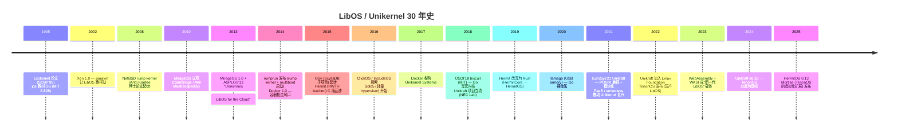
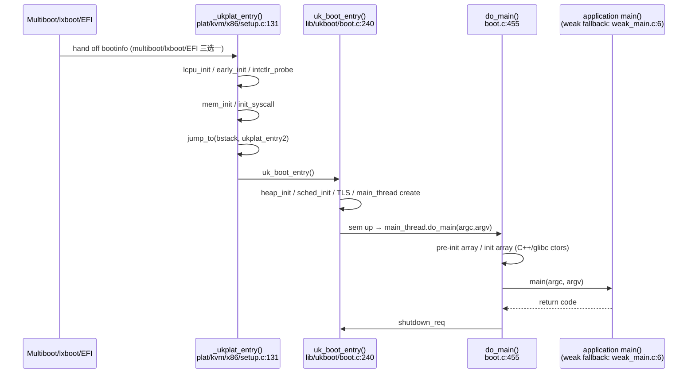
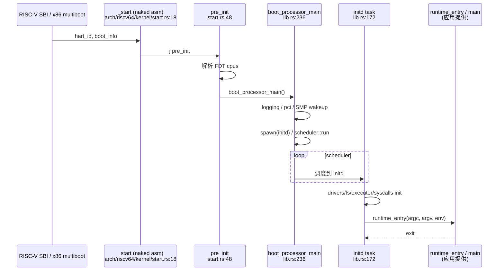
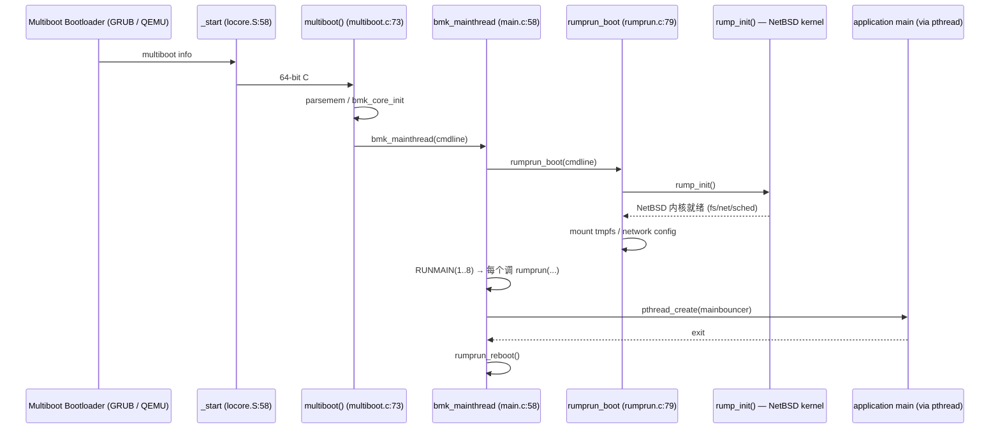

# 04-09 — Unikernel / LibOS 精读合集：unikraft / biscuit / tamago / HermitOS / MirageOS / TenonOS / rumprun

> **核心问题：**
> 1. Unikernel 与 LibOS 是同一物种还是两个概念？为什么"OS 抽象作为应用库"思想 1995 jos / Exokernel 提出后 20 年才在云原生火起来？
> 2. 7 个项目代码层面如何实现"单 binary OS+app"？编译时怎么裁剪 syscall？
> 3. Go / OCaml / Rust / C 各自语言写 Unikernel 的取舍？
> 4. biscuit 用 Go 把 GC 进内核，tamago 用 Go 直接裸金属，这两个思想价值在哪？
> 5. 国产 TenonOS 与 MirageOS / unikraft 工业有什么差异？
>
> **一句话答案：** Unikernel = LibOS 思想（1995 Engler/Kaashoek/O'Toole 的 Exokernel 论文 + jos 教材 OS）+ 单 app + 单地址空间 + 一份可启动 binary；2010 MirageOS 用 OCaml 把 LibOS 工业化，2014 容器把它压制 5 年，2020+ serverless / FaaS / WebAssembly 让它二度复兴。代码层面靠"编译期 type/feature/Kconfig 裁剪 + weak symbol main + 链接 OS 库到应用 ELF"实现单镜像。
>
> **本笔记定位：** 04 OS 大类**实现细节**层（前置 [04-01 OS 内核总览](04-01-os-kernel-overview.md) / [04-02 OS 范式](04-02-os-kernel-paradigms.md) / [04-03 项目横向对比](04-03-os-kernel-domain-comparison.md)）。本篇走读 7 个 Unikernel / LibOS 源码（biscuit 因本地工作树为空走"概念精读 + 论文导读"），挖出"为什么这样写"的设计权衡。
>
> 与 [00-07 OS 演化史](00-07-os-evolution.md) 分工：00-07 给 LibOS / Unikernel 30 年时间线；本篇给"代码尺度"的剖面图。

---

## 0. 范式速览：LibOS / Unikernel / Exokernel 三件套

### 0.1 1995 Exokernel 论文：起源

MIT PDOS 的 Engler / Kaashoek / O'Toole 在 SOSP'95 论文 *Exokernel: An Operating System Architecture for Application-Level Resource Management* 提出三个分离概念：

1. **Exokernel**：极小内核，只做"资源多路复用 + 安全检查"（who can access what physical page），**不提供任何抽象**（不提供 fd / process / vfs）
2. **LibOS**：把传统 OS 抽象（进程、文件系统、网络栈、虚拟内存）做成**用户态库**，与应用一起链接成 ELF
3. **应用**：链接所需 LibOS 即可，跳过不需要的子系统

教学版本就是 [jos](https://pdos.csail.mit.edu/6.828/2011/overview.html)（MIT 6.828 课程 OS）——这是后来 Cambridge MirageOS 的直接思想源头。

### 0.2 Unikernel = LibOS + 单 app + 单镜像 + 单地址空间

| 概念 | 定义 | 代表 |
|------|------|------|
| **LibOS** | OS 抽象作为可链接库，与应用同地址空间 | jos / 早期 Hermit / TenonOS（自称 LibOS）|
| **Unikernel** | LibOS + **单一应用** + **单地址空间** + **编一份完整可启动 binary**（含 bootloader / kernel / app）| MirageOS / unikraft / rumprun / HermitOS / tamago |
| **Exokernel** | 强调极小内核**仅做安全多路复用**，不提供抽象 | Aegis / Xok（学术原型）|

实务里 LibOS 和 Unikernel 经常混用——HermitOS 自称 "library operating system / libOS that compiles to a static library"（见 `src/lib.rs:1-5`），但产物是 Unikernel；TenonOS 自称 "基于 LibOS 架构"但定位也是 Unikernel。**本篇统一用"Unikernel"指代最终产物，"LibOS"指代设计思想**。

### 0.3 历史脉络（30 年）



### 0.4 7 项目对比速查（之后展开）

| 项目 | 出身 | 语言 | 规模 | 形态 | 当前活跃度 |
|------|------|------|------|------|-----------|
| **unikraft** | NEC Lab → Linux Foundation 孵化 | C | ~17 万行 C / 17 万 header / 0.5 万 Rust | Unikernel SDK（最完备）| ★★★★★（2025 仍活跃，v0.21 Ijiraq）|
| **biscuit** | MIT PDOS 研究（Cody Cutler 博士论文 + OSDI'18）| Go | ~3 万行 Go（论文称）| 宏内核形态但用 Go 写（含 GC/goroutine）| ★（论文证毕即停）|
| **tamago** | F-Secure / WithSecure (USB armory 项目) | Go | 数千行 Go（裸金属 runtime）| Unikernel 风（Go 直接跑 ARM/RISC-V MCU）| ★★★（小众但稳定）|
| **HermitOS** | RWTH Aachen / 后独立 | Rust | ~3.1 万行 Rust | LibOS / Unikernel | ★★★★（v0.13，2025 活跃）|
| **MirageOS** | Cambridge OCaml Labs | OCaml | ~1.3 万行 OCaml（mirage 工具）+ 大量上游 OCaml 库 | Unikernel（OCaml 鼻祖）| ★★★★（mirage 4.x，活跃）|
| **TenonOS** | 国产（华为 / openEuler 阵营，gitee）| C | ~13 万行（基线 unikraft 0.16 + 国产微库）| LibOS（嵌入式重点）| ★★★（v0.3，2024 持续更新）|
| **rumprun** | rumpkernel / Antti Kantee | C | ~5.7 万行 C/汇编 + 大量 NetBSD 上游 | Unikernel（复用 NetBSD 内核）| ★（2017 后维护停滞，仍可用）|

---

## 1. unikraft 精读（最完备的工业 Unikernel SDK）

### 1.1 项目身份

- **名称**：Unikraft
- **首发**：2017 年（NEC 欧洲实验室孵化），2022 年加入 Linux Foundation
- **当前版本**：v0.21.0 "Ijiraq"（README.md 第 11 行徽章）
- **License**：BSD-3-Clause（[unikraft-license](https://github.com/unikraft/unikraft/blob/staging/COPYING.md)）
- **代号约定**：每个版本一个外太阳系卫星名（Ijiraq 是土星的不规则卫星）
- **Linux Foundation + Xen Project Incubator** 双重血统（README.md:272）
- **官网**：https://unikraft.org / 文档 https://unikraft.org/docs

定位（README.md:22）：

> Unikraft powers the next-generation of cloud native, containerless applications by enabling you to radically customize and build custom OS/kernels; unlocking best-in-class performance, security primitives and efficiency savings.

注意"containerless"——它是把自己定位成"容器替代品"，而不是与 Linux 同级。

### 1.2 顶层目录（实测）

```
/home/heke/tgln/stage2/material/core/unikraft/
├── Makefile          (1261 行 — buildroot 风的根 Makefile)
├── Config.uk         (250 行 — Kconfig 入口)
├── Makefile.uk       (4763 字节 — 库构建宏)
├── README.md         (310 行)
├── version.mk        (主版本号)
├── arch/             ←── 架构相关（x86_64 / arm64 / arm / x86）
│   ├── Arch.uk
│   ├── Config.uk
│   ├── Makefile.rules
│   ├── arm/          (ctx.c 上下文切换 / Compiler.uk)
│   ├── arm64/        (仅 include/ — 头文件 only，主代码在 arm/arm64/)
│   ├── x86/
│   └── x86_64/       (仅 include/)
├── plat/             ←── 平台后端
│   ├── common/       (bootinfo.c / bootinfo_fdt.c / w_xor_x.c — 跨平台)
│   ├── kvm/          (KVM hypervisor + bare-metal — 主力)
│   ├── xen/          (Xen 半虚拟化)
│   └── native/       (linuxu — 跑在 Linux 进程内调试)
├── lib/              ←── 88 个微库（核心）
│   ├── ukboot/       (主 boot 流程)
│   ├── uksched/      (调度器接口)
│   ├── ukschedcoop/  (协作式调度器具体实现)
│   ├── uknetdev/     (网络设备抽象)
│   ├── ukblkdev/     (块设备抽象)
│   ├── ukfs/         (文件系统抽象)
│   ├── vfscore/      (VFS 核心)
│   ├── ukalloc*/     (5 种分配器：bbuddy / pool / region / stack / falloc)
│   ├── posix-*/      (16+ POSIX 兼容库 — process / socket / mmap / poll / time...)
│   ├── syscall_shim/ (Linux syscall ABI 兼容层 — 关键)
│   ├── ramfs / devfs / 9pfs / uk9p / fdt / nolibc
│   └── isrlib / ubsan / ukgcov / uktest
├── drivers/          (虚拟 / 硬件设备驱动 — 9 类)
├── include/uk/       (公共头文件)
└── support/          (构建脚本、Kconfig 工具)
```

**88 个微库**——这是 unikraft 与"传统教学 OS"最大的差别：每个功能（malloc / sched / vfs / netdev）都是独立 lib/，可单独选/不选。

### 1.3 KConfig + Make 构建（buildroot 风）

unikraft 不写自己的构建系统，直接复用 Linux/buildroot 的 **Kconfig + Make**。

- 顶层 `Makefile`（1261 行）只负责工具链选择 / 命令行解析 / 调度子 Makefile
- 每个 `lib/<libname>/Config.uk` 声明该库的 Kconfig 选项 + 依赖
- 每个 `lib/<libname>/Makefile.uk` 声明源文件 + 编译选项
- 生成的 `.config` 决定哪些库参与最终 binary

构建产物只有一个：`build/<image>_<arch>-<plat>` —— 一个完整 ELF/raw binary，含：
1. `_start` 引导代码（来自 `plat/<plat>/`）
2. 内核库（来自选中的 `lib/uk*` / `lib/posix-*`）
3. 应用 `main()`（用户提供，链接进来）

### 1.4 关键库速查

| 库 | 角色 | 关键文件 |
|----|------|---------|
| **ukboot** | 启动 + main 调度 | `boot.c:240` `uk_boot_entry()` / `boot.c:455` `do_main()` / `weak_main.c:6` 弱符号 main |
| **uksched** | 线程调度抽象 | `sched.c:357` `uk_sched_thread_add()` |
| **ukschedcoop** | 协作式调度（默认）| 无抢占，靠主动 yield |
| **uklcpu** | 逻辑 CPU 抽象 | 多核基础 |
| **ukalloc** | 内存分配器接口 | 4 种实现可选 |
| **ukbus** | 总线抽象 | PCI / virtio |
| **uknetdev** | 网络设备 | virtio-net / xen-netfront |
| **ukblkdev** | 块设备 | virtio-blk / 9pfs |
| **vfscore** | VFS 内核 | mount / open / read |
| **syscall_shim** | Linux syscall 兼容 | `tabs.c` `uk_syscall_*` / 大量 `*.awk` 脚本生成 syscall 表（见后文）|
| **posix-process** | fork / exec / wait | clone.c / execve.c |
| **posix-socket** | socket API | 兼容 BSD / Linux socket |
| **fdt** | DTB 解析 | qemu-virt / 树莓派 |

`lib/syscall_shim/` 是 unikraft 兼容 Linux 的关键。注意它有 **15 个 .awk 脚本**——`syscall_static.awk` / `syscall_gensyms.awk` / `uk_syscall6_do.awk` 等——这些是构建时生成 syscall 跳板表的代码生成器。它们读取 `UK_SYSCALL_DEFINE(...)` 宏，吐出 syscall 号到函数指针的映射表。

### 1.5 启动流程：从汇编 `_start` 到应用 `main()`

走读 KVM x86_64 路径（最常用）。

#### Step 1：bootloader 入口

`plat/kvm/Linker.uk:21`：
```
KVM_LDFLAGS-y += -Wl,--entry=_libkvmplat_entry
```

ELF 入口符号是 `_libkvmplat_entry`。它由 multiboot/lxboot/EFI 三种引导协议任选其一进入：

- `plat/kvm/x86/multiboot.c:23` — multiboot1 入口，最终调 `_ukplat_entry(bi)`（156 行）
- `plat/kvm/x86/lxboot.c:20` — Linux Boot Protocol 入口（rumprun 也用），152 行调 `_ukplat_entry(bi)`
- `plat/kvm/x86/efi_post.c:34` — UEFI 入口，89 行通过 `UK_LCPU_SENTRY_SYM` 跳到 `_ukplat_entry`

ARM 走 `plat/kvm/arm/entry64.S:50` 的 `_libkvmplat_entry`，143 行 `b _ukplat_entry`。

#### Step 2：`_ukplat_entry` ——平台层 C 主入口

`plat/kvm/x86/setup.c:131-181`：

```c
void _ukplat_entry(struct ukplat_bootinfo *bi)
{
    void *bstack;
    int rc;

    /* Initialize LCPU of bootstrap processor */
    rc = uk_lcpu_init(uk_pcpuvar_current_ptr_get(uk_lcpus));
    /* Execute early init */
    uk_boot_early_init(bi);                          /* line 142 */
    /* Initialize IRQ controller */
    rc = uk_intctlr_probe();                         /* line 145 */
    /* Allocate boot stack */
    bstack = ukplat_memregion_alloc(__STACK_SIZE, ...);
    /* Initialize memory */
    rc = ukplat_mem_init();
    _init_syscall();                                 /* line 171 */
    /* Switch away from the bootstrap stack */
    uk_arch_x86_64_jump_to((__u64)bstack, (__u64)ukplat_entry2);  /* 180 */
}
```

注意 line 180 的 `uk_arch_x86_64_jump_to` —— 这是切换栈后 `__noreturn` 跳到 `ukplat_entry2()`（115-126 行）。`ukplat_entry2` 仅做一件事：调 `uk_boot_entry()`，那是 ukboot 库的入口。

#### Step 3：`uk_boot_entry` ——内核库入口

`lib/ukboot/boot.c:240`：

```c
void uk_boot_entry(void)
{
    struct uk_init_ctx ictx = { 0 };
    struct uk_term_ctx tctx = {
        .exit_code = 0,
        .target = UK_PM_SHUTDOWN_OP_SYSCRASH,
    };
    /* ... */
    UK_ASSERT(boot_argc);  /* uk_boot_early_init 已 parse cmdline */

    /* 1. ctor table（早期构造函数）*/
    uk_ctortab_foreach(ctorfn, uk_ctortab_start, uk_ctortab_end) {
        (*ctorfn)();
    }

    /* 2. heap init —— ukallocbbuddy 等 */
    a = heap_init();
    ukplat_memallocator_set(a);
    /* 3. 创建主线程栈分配器 sa / 辅助栈 auxsa */
    /* 4. TLS 分配 + 激活 */
    ukarch_tls_area_init(tls);
    uk_lcpu_tlsp_set(uktlsp);

    /* 5. 调度器初始化 */
    s = uk_sched_default_init(a);
    /* 6. 创建 main_thread（如果 CONFIG_LIBUKBOOT_MAINTHREAD）*/
    /* 7. 释放主线程信号量 → main_thread 跑 do_main */
    uk_semaphore_up(&main_sema);
    /* 8. 进入 idle loop */
}
```

#### Step 4：`do_main` ——召唤应用 `main()`

`lib/ukboot/boot.c:455-516`：

```c
int do_main(int argc, char *argv[])
{
    /* Application
     *
     * We are calling the application constructors right before calling
     * the application's main(). All of our Unikraft systems, VFS,
     * networking stack are initialized at this point. ... */

    uk_ctortab_foreach(ctorfn, __preinit_array_start, __preinit_array_end) {
        (*ctorfn)();
    }
    uk_ctortab_foreach(ctorfn, __init_array_start, __init_array_end) {
        (*ctorfn)(argc, argv);
    }

    uk_pr_info("Calling main(%d, [", argc);
    /* ... print argv ... */
    ret = main(argc, argv);   /* line 513 — 真正进应用 */
    uk_pr_info("main returned %d\n", ret);
    return ret;
}
```

#### Step 5：weak `main` 兜底

`lib/ukboot/weak_main.c:6`：

```c
int __weak main(int argc __unused, char *argv[] __unused)
{
    printf("weak main() called. Symbol was not replaced!\n");
    return -EINVAL;
}
```

`__weak` 是 GCC 弱符号——应用如果定义了 `main`，链接器会用应用的；否则用这个兜底。Unikraft 用这一个技巧把 OS 镜像和应用 ELF 串联起来——**应用就是普通 C `int main()`，但被链接进的不是 glibc，而是 unikraft**。

整体调用链：



### 1.6 多平台支持

`plat/` 下有 4 个：

| 平台 | 用途 | 特征 |
|------|------|------|
| **kvm** | KVM hypervisor + bare-metal | x86_64 / arm64，主力 |
| **xen** | Xen paravirt | 历史最久（Mirage 也走这条路）|
| **native** (linuxu) | Linux 进程模式 | 调试 / unit test 用 |
| **common** | 跨平台共享代码 | bootinfo / fdt 解析 |

注意 `arch/` 不含 riscv64——Unikraft 对 RISC-V 支持仍在路上（截至 v0.21）。

### 1.7 与 MirageOS / OSv 对比（语言 / 工业级）

| 维度 | Unikraft | MirageOS | OSv（Cloudius） |
|------|----------|----------|-----------------|
| 语言 | C | OCaml | C++ |
| 应用语言 | C / C++ / Python / Rust（移植 musl）| 必须 OCaml | JVM / 任意 ELF |
| 模块化 | ★★★★★（88 lib）| ★★★★（functoria 类型驱动）| ★★（少数 component）|
| POSIX | 强（syscall_shim + posix-*）| 弱（Mirage 自己一套）| 强（Linux ABI）|
| 工业部署 | KraftCloud / Kubernetes | Robur / DNS / TLS | 已停（2022）|

### 1.8 必读文件清单

- `Makefile`（1261 行）— 整个构建驱动
- `Config.uk`（250 行）— 顶层 Kconfig
- `lib/ukboot/boot.c`（560 行）— 主 boot
- `lib/ukboot/early_init.c`（132 行）— 早期 init
- `plat/kvm/x86/setup.c` — x86 平台入口
- `plat/kvm/arm/entry64.S` — ARM 汇编入口
- `plat/common/bootinfo.c`（118 行）— 跨平台 bootinfo 协议
- `lib/syscall_shim/tabs.c` + 各种 `*.awk` — Linux syscall 兼容生成器

### 1.9 工业部署案例

- **KraftCloud**（Unikraft 官方商业产品）— 把 Unikraft 当成 serverless / FaaS 运行时
- **NEC Lab** 内部研究 — 5G UPF / RAN 数据平面
- **欧盟 H2020 项目** — UNICORE 等

---

## 2. biscuit 精读（Go 写宏内核 — MIT PDOS）

### 2.1 注：本地工作树状态

`/home/heke/tgln/stage2/material/core/biscuit/.git/` 存在但**对象库为空** —— `git log` 报 *"current branch 'master' does not have any commits yet"*。GitHub 远端 [mit-pdos/biscuit](https://github.com/mit-pdos/biscuit) 仍可访问；本地工作树也曾被 sync 但因仓库已存档（archived），`fetch` 不再拉新对象。

因此本节按 **概念精读 + OSDI'18 论文要点 + 公开 README** 重写，**不强造行号引用**。读者欲深入务必去 GitHub 拉源码。

### 2.2 项目身份

- **名称**：Biscuit
- **机构**：MIT PDOS（Frans Kaashoek 组，与 jos / xv6 同一师门）
- **主创**：Cody Cutler（博士论文 + OSDI'18 一作）
- **论文**：*The Benefits and Costs of Writing a POSIX Kernel in a High-Level Language*（OSDI'18）
- **形态**：与 xv6 类似的 **POSIX 宏内核**，但**全部用 Go 写**（含运行时 / GC / goroutine 调度器跑在 Ring 0）
- **License**：与 Go 一致（BSD-3）
- **现状**：论文证毕即停，2024 已被 GitHub 标 archived

### 2.3 设计争议（核心思想价值）

biscuit 不是"用 Go 写 Unikernel"，是真的 **macro-kernel** —— 有 fork/exec/file/socket/pipe，能跑 redis / NGINX。但争议点在：

| 设计点 | 传统观点 | biscuit 反驳 |
|--------|---------|-------------|
| **GC 进内核** | "GC 暂停不可控，内核不能允许停顿" | 实测加 SafePoints 后停顿 < 1ms，影响有限 |
| **goroutine 替代内核线程** | "M:N 调度需要 syscall 协助" | 自己实现 GMP 在内核态跑得通 |
| **类型系统、escape analysis** | "高级语言语义复杂" | 减少 50%+ unsafe / use-after-free / 数据竞争 bug |
| **代码量** | C 内核精简 | 5.8 万行 Go vs Linux 30M C / xv6 1 万 C |
| **性能损失** | 高级语言一定慢 | 实测 NGINX/Redis 比 Linux 慢 5%–15%（论文 §5）|

### 2.4 Go 进 Ring 0 的工程难点（从论文整理）

1. **运行时启动顺序**：Go runtime 自己需要 mmap / sched_yield / sysmon —— 在裸机这些都还没有。biscuit 重写了 runtime 入口（`runtime/proc.go` 派生版），让 GMP 在没有 OS 的情况下自举。
2. **GC 安全点（safepoint）**：内核中断 / 系统调用入口都要标记成可 GC 点；否则 GC stop-the-world 会卡住中断响应。
3. **goroutine 栈增长**：Go 默认 split-stack，内核态难以接受栈帧不连续。biscuit 让所有内核 goroutine 用固定大栈。
4. **interface dispatch 进内核** -- vtable 调用比直接 call 慢，但好处是 driver 可以全部 interface 化。
5. **CGO 处理**：biscuit 几乎不用 cgo，所有汇编（trap / context-switch）以 `.s` 文件直接 link。

### 2.5 论文要点（OSDI'18）

> "We discuss our experience in writing 5.8 K Go (called biscuit) for a POSIX-compliant monolithic kernel. ... Despite being written in Go, biscuit has performance comparable to a Linux baseline for several benchmarks."

关键数据（论文 §5）：

| Benchmark | Linux | biscuit | 损失 |
|-----------|-------|---------|------|
| NGINX (req/s) | 1.0× | 0.85× | 15% |
| Redis (set/s) | 1.0× | 0.93× | 7% |
| C-mailbench | 1.0× | 0.95× | 5% |
| GC pause | n/a | < 1ms | — |

结论：高级语言（含 GC + escape analysis）写宏内核**完全可行**，"大幅减少 bug 类别（UAF / 越界 / 数据竞争），代价 5–15% 性能"。

### 2.6 思想价值

biscuit 不是给"工业部署"准备的，是为以下问题写的存在证明：

1. **Go 这类自动内存管理语言能否进特权级？** — 能
2. **GC 是否真的与 OS 内核不兼容？** — 不是
3. **goroutine 替代内核线程？** — 可以
4. **未来内核语言的方向？** — 论文公开后，Rust async kernel（Theseus / Hubris / 后来的 Asterinas / TornadoOS）大量参考此论；embassy 在 MCU async 走得更远
5. **教学价值** — 让 Go 程序员能直接读懂"内核是怎样炼成的"

biscuit 与本节其他项目最大不同：**它不是 Unikernel**，是宏内核形态 — 但作为"语言 vs OS 设计"思想实验，归在 LibOS / Unikernel 范式合集里因为它和 tamago 一样探索了"高级语言进内核"。

---

## 3. tamago 精读（Go 裸金属 — F-Secure / WithSecure）

### 3.1 注：本地工作树状态

与 biscuit 类似，`/home/heke/tgln/stage2/material/core/tamago/.git/` 为空（无 objects）。GitHub 远端 [usbarmory/tamago](https://github.com/usbarmory/tamago) 持续维护中。本节按公开资料 + tamago wiki + USB armory 文档撰写。

### 3.2 项目身份

- **名称**：TamaGo
- **维护方**：USB armory project（最初 F-Secure，现 WithSecure 安全公司，意大利 Andrea Barisani 领衔）
- **License**：BSD-3
- **形态**：**让 Go 程序直接跑在裸金属 ARM / RISC-V MCU**，无任何 OS
- **思想**：把 Go runtime 改造成"自带 syscall 的 OS"，应用 = 整个系统

### 3.3 与 biscuit 的关键区别

| 维度 | biscuit | tamago |
|------|---------|--------|
| **范式** | 宏内核（fork/exec/syscall）| Unikernel（单 app + 单地址空间）|
| **目标硬件** | x86-64 PC | ARM Cortex-A7 / Cortex-M / RISC-V SiFive E31 |
| **POSIX？** | 是（POSIX 完全兼容是论文卖点）| 否（不需要 POSIX，应用直接调底层 driver）|
| **多用户/多进程？** | 是 | 否（仅一个 Go program / process）|
| **驱动数量** | 几个（标准 Linux driver port）| 几十（USB / Ethernet / Crypto / TRNG）|

### 3.4 USB armory 应用场景

USB armory 是一种 **形似 U 盘的 ARM 安全设备**（NXP i.MX6 ARM Cortex-A7，ARM TrustZone）。tamago 让用户用 Go 写整个固件，不依赖 Linux：

- 硬件 RNG (TRNG) 直接 access — Go 不再绕一层 `/dev/random`
- ARM TrustZone 安全世界 (Secure World) Go 可控
- USB device controller — Go 直接挂 mass storage / CDC ACM
- 加密硬件 (CAAM) — Go 调原生指令

### 3.5 tamago 的内部结构（按公开文档整理）

```
tamago/
├── arm/              ←── ARM Cortex-A7 / Cortex-M 支持
│   ├── exception/    (FIQ/IRQ/Abort/SVC handler — Go 写 trap handler 仍很罕见)
│   ├── mmu/          (MMU 设置)
│   ├── timer/
│   └── caam/         (NXP CAAM 加密)
├── riscv64/          ←── SiFive FE310/FU540 支持
├── runtime/          ←── 改造的 Go runtime
│   ├── alloc.go      (替换 mheap_alloc，因为没有 mmap)
│   ├── sys_*.s       (替换 trap / context-switch 汇编)
│   └── netpoll.go    (替换 epoll-based netpoll，自己写)
├── soc/imx6/         (i.MX6 平台)
└── board/usbarmory/  (USB armory 板级)
```

### 3.6 关键设计：Go runtime 改造

tamago 的核心工作是 **把 Go runtime 适配到没有 OS 的环境**：

1. **替换 syscall 层**：原 Go runtime `runtime/sys_linux_*.go` 全换成 `runtime/sys_tamago_*.go`，把"调 Linux syscall"改成"直接读写 MMIO 寄存器"
2. **memory allocator**：mheap 直接管理整段 RAM，不走 mmap
3. **goroutine 调度**：保留 GMP，但 sysmon 不再依赖 Linux 信号 → 用 ARM IRQ 手动驱动
4. **netpoll**：用 ENC28J60 / KSZ8081 等 PHY 直接收发包，bypass epoll

构建用法（公开文档）：

```sh
GOOS=tamago GOARCH=arm GOARM=7 go build -o tamago.elf
```

`GOOS=tamago` 是 tamago fork 的 Go 编译器自定义的目标三元组——理论上需要打 patch 后的 Go 工具链才能编。

### 3.7 适用场景

- **安全密钥管理设备**（HSM 替代品）
- **air-gapped crypto wallet**
- **embedded firmware where Go 类型系统优势 > 体积代价**

### 3.8 与 Unikernel 思潮的关系

tamago 是 **极端 Unikernel** —— 比 MirageOS / unikraft 都更"裸"，因为它甚至不需要 hypervisor，直接跑物理 MCU。代码量也最少（几千行 Go runtime patches + 数十驱动）。

值得学习的地方：

1. **如何把高级语言 runtime 移植到裸金属**（Rust 阵营做了 `core` + `alloc`，Go 需要更大改造）
2. **trap/exception handler 用高级语言写**（tamago 的 ARM exception 入口是 Go function，靠极少汇编 stub 转入）
3. **driver 直接 MMIO，不分层** — 没有 Linux DM 那种 framework，因为单 app 不需要复用

---

## 4. HermitOS 精读（Rust LibOS / Unikernel — RWTH Aachen）

### 4.1 项目身份

- **名称**：Hermit Kernel（项目伞名 hermit-os）
- **首发**：2015 RWTH Aachen 大学（Stefan Lankes 等），最初 C 写，称 HermitCore
- **改写**：2018-2020 全部改写为 Rust，更名 Hermit / HermitOS
- **当前版本**：v0.13.0（Cargo.toml:3）
- **License**：MIT OR Apache-2.0（双协议，Rust 生态默认）
- **代码量**（cloc 实测）：

| 语言 | 文件数 | 代码行 |
|------|-------|-------|
| Rust | 163 | 31370 |
| Assembly | 3 | 412 |
| TOML | 10 | 327 |
| YAML | 8 | 622 |
| **SUM** | **189** | **33032** |

### 4.2 README 自我定位

`README.md:11`：

> This is the kernel of the [Hermit](https://github.com/hermit-os) unikernel project.

`src/lib.rs:1-5`（核心定位）：

```rust
//! The Hermit kernel.
//!
//! This _library operating system_ (libOS) compiles to a static library
//! (libhermit.a) that applications can link against to create a _Unikernel_.
```

——HermitOS 自称 LibOS（产物 `libhermit.a`），但**产物形态是 Unikernel**（应用与 kernel 链接成一个 ELF）。

### 4.3 顶层目录

```
HermitOS/
├── Cargo.toml          (12 KB — 大量 features)
├── Cargo.lock          (67 KB — 大量依赖)
├── build.rs            (build script — 探测 target / generate built_info)
├── src/                ←── 主代码（163 个 .rs 文件）
│   ├── lib.rs          (318 行 — 内核入口)
│   ├── arch/
│   │   ├── x86_64/     (kernel/ + mm/)
│   │   ├── aarch64/
│   │   ├── riscv64/    ←── 完整 RISC-V 支持（与 unikraft 形成对比）
│   │   └── mod.rs
│   ├── syscalls/       (13 文件 — semaphore / spinlock / futex / mman / tasks ...)
│   ├── scheduler/      (mod.rs / task/ / timer_interrupts.rs)
│   ├── drivers/        (console / fs / mmio.rs / pci.rs / virtio / vsock / net)
│   ├── fs/             (mem.rs / mod.rs / uhyve.rs / virtio_fs.rs)
│   ├── mm/             (内存)
│   ├── executor/       (异步 executor — Hermit 用 async 写驱动)
│   ├── synch/          (同步原语)
│   ├── env/            (启动信息 / FDT)
│   ├── shell.rs        (CONFIG_FEATURE_SHELL 后才编)
│   └── lib.rs
├── hermit-builtins/    (依赖：编译器内建)
├── hermit-macro/       (proc-macro 扩展)
├── tests/              (集成测试)
└── xtask/              (cargo xtask 子命令实现)
```

### 4.4 关键 crate（feature）拆解

`Cargo.toml` 里的 `default = [...]` 包括：

```toml
default = [
    "acpi",       # ACPI parser
    "dhcpv4",     # DHCP 客户端
    "fsgsbase",   # x86 FSGSBASE 指令
    "kernel-stack",
    "pci-ids",
    "pci",
    "smp",
    "tcp",
    "virtio-fs",
    "virtio-net",
    "virtio-vsock",
]
```

可选 feature：

- **mman** — 启用 mmap 类系统调用 (`Cargo.toml` 注释)
- **newlib** — 支持 C/C++ 应用通过 Hermit 的 newlib port
- **common-os** — 多地址空间（实验中，Cargo.toml:55-59 注解 "this feature is not complete yet"）
- **shell** — 嵌入式 shell

### 4.5 启动流程：`_start` → `pre_init` → `boot_processor_main` → `initd` → app

走读 RISC-V 路径（最直观）。

#### Step 1：汇编 `_start`

`src/arch/riscv64/kernel/start.rs:18-46`：

```rust
#[unsafe(no_mangle)]
#[unsafe(naked)]
pub unsafe extern "C" fn _start(hart_id: usize, boot_info: Option<&'static RawBootInfo>) -> ! {
    // ... validate signatures ...

    naked_asm!(
        // Use stack pointer from `CURRENT_STACK_ADDRESS` if set
        "ld t0, {current_stack_pointer}",
        "beqz t0, 2f",
        "li t1, {top_offset}",
        "add t0, t0, t1",
        "mv sp, t0",
        "2:",

        "j {pre_init}",
        current_stack_pointer = sym CURRENT_STACK_ADDRESS,
        top_offset = const KERNEL_STACK_SIZE,
        pre_init = sym pre_init,
    )
}
```

注意：

- `#[unsafe(naked)]` 声明这是裸函数，编译器不会插入 prologue/epilogue
- 入参 `hart_id` 来自 RISC-V SBI，`boot_info` 由 hermit-entry 协议（`hermit-loader` 或 uhyve 提供）
- 栈指针策略：如果全局 `CURRENT_STACK_ADDRESS` 已被 BSP 设过（次级核），用之；否则用启动栈
- `j pre_init` 直接尾调

#### Step 2：`pre_init` ——保存 boot_info 后分支

`src/arch/riscv64/kernel/start.rs:48-84`：

```rust
unsafe extern "C" fn pre_init(hart_id: usize, boot_info: Option<&'static RawBootInfo>) -> ! {
    CURRENT_BOOT_ID.store(hart_id as u32, Ordering::Relaxed);

    if CPU_ONLINE.load(Ordering::Acquire) == 0 {  // 第一颗核
        crate::logging::KERNEL_LOGGER.set_time(true);
        env::set_boot_info(*boot_info.unwrap());
        let fdt = env::fdt().unwrap();

        // Parse cpus 节点构造 hart_mask
        let mut hart_mask = 0;
        for cpu in fdt.cpus() {
            let hart_id = cpu.property("reg").unwrap().as_usize().unwrap();
            let status = cpu.property("status").unwrap().as_str().unwrap();
            if status != "disabled\u{0}" {
                hart_mask |= 1 << hart_id;
            }
        }
        NUM_CPUS.store(fdt.cpus().count().try_into().unwrap(), Ordering::Relaxed);
        HART_MASK.store(hart_mask, Ordering::Relaxed);
        crate::boot_processor_main()              // 主核进入
    } else {
        // 次级核
        #[cfg(feature = "smp")]
        crate::application_processor_main();
    }
}
```

——FDT 解析直接在 Rust 里写！这是 RISC-V 与 ARM/x86 (ACPI) 的明显差异。

x86_64 路径（`src/arch/x86_64/kernel/mod.rs:186` 起）类似但通过 `cpu_id` 而非 `hart_id` 区分主从核（194 行）。

#### Step 3：`boot_processor_main` ——内核主循环建立

`src/lib.rs:236-291`：

```rust
fn boot_processor_main() -> ! {
    hermit_sync::Lazy::force(&console::CONSOLE);
    unsafe { logging::init(); }

    info!("Welcome to Hermit {}", env!("CARGO_PKG_VERSION"));
    /* 打印 git_version / opt_level / arch / features */

    if let Some(fdt) = env::fdt() {
        info!("FDT:\n{fdt:#?}");
    }

    boot_processor_init();                          /* arch/<arch>/kernel/mod.rs:86/98 */
    #[cfg(not(target_arch = "riscv64"))]
    scheduler::add_current_core();
    interrupts::enable();

    kernel::boot_next_processor();                  /* 唤醒下一颗核 */

    #[cfg(feature = "smp")]
    synch_all_cores();                              /* 等齐所有核 */

    #[cfg(feature = "pci")]
    drivers::pci::print_information();

    // Start the initd task.
    unsafe {
        PerCoreScheduler::spawn(initd, 0,
            scheduler::task::NORMAL_PRIO, 0,
            USER_STACK_SIZE)
    };

    // Run the scheduler loop.
    PerCoreScheduler::run();
}
```

#### Step 4：`initd` ——初始化驱动后调 `runtime_entry` / `main`

`src/lib.rs:172-220`：

```rust
extern "C" fn initd(_arg: usize) {
    unsafe extern "C" {
        #[cfg(all(not(test), not(any(feature = "nostd", feature = "common-os"))))]
        fn runtime_entry(argc: i32, argv: *const *const u8, env: *const *const u8) -> !;
        #[cfg(all(not(test), any(feature = "nostd", feature = "common-os")))]
        fn main(argc: i32, argv: *const *const u8, env: *const *const u8);
    }

    /* Initialize Drivers */
    drivers::init();
    fs::init();          /* 文件系统先于网络（要做包捕获）*/
    executor::init();    /* async executor */
    syscalls::init();
    #[cfg(feature = "shell")]
    shell::init();

    let (argc, argv, environ) = syscalls::get_application_parameters();

    info!("Jumping into application");
    unsafe {
        runtime_entry(argc, argv, environ);   /* Rust 应用走这条 */
        // 或 main(argc, argv, environ);     /* C/newlib 应用走这条 */
    }
}
```

`runtime_entry` / `main` 是**应用提供的**入口符号——和 unikraft 的 weak `main` 思想完全一致。

整体调用链：



### 4.6 与 arceos 区别（关键问答）

| 维度 | HermitOS | arceos |
|------|----------|--------|
| 形态 | 单一 Unikernel | 多形态（multi-personality）— monolithic / micro / unikernel / hypervisor |
| 应用 ABI | runtime_entry（Rust）/ newlib main（C）| Rust app（首选）/ apps + ulib_*  |
| RISC-V | 完整（FDT 解析、SBI 调用）| 完整（含 H extension） |
| 异步 | 内核内置 async executor | 用户空间 + futures |
| 工业部署 | 学术 / DEMO | 国内 OS Camp 教学 / 比赛核心 |

参见 [04-06 组件化内核精读](04-06-component-kernels-walkthrough.md) 中 arceos 章节。

### 4.7 syscall 表（13 个 module，覆盖 POSIX 子集）

`src/syscalls/`（实测）：

| 文件 | 行数 | 说明 |
|------|------|------|
| condvar.rs | 153 | 条件变量 |
| entropy.rs | 121 | /dev/random 兼容 |
| futex.rs | 54 | Linux futex |
| mman.rs | 168 | mmap / munmap / mprotect |
| mod.rs | 904 | syscall 表汇总 + dispatcher |
| processor.rs | 21 | CPU 信息 |
| recmutex.rs | 62 | 递归锁 |
| semaphore.rs | 137 | POSIX 信号量 |
| spinlock.rs | 147 | 自旋锁 |
| system.rs | 8 | 系统信息（最小）|
| table.rs | 88 | syscall 入口表 |
| tasks.rs | 270 | thread / task 创建 |
| timer.rs | 168 | 定时器 |
| socket | (subdir) | TCP / UDP socket |

**总 ~2300 行 Rust** 实现 POSIX 子集——比 unikraft 的 `lib/posix-*` 小一个数量级，但已能跑 Rust 标准库 demo。

### 4.8 必读源文件清单

- `Cargo.toml`（feature 文档极详尽，本身就是教学材料）
- `src/lib.rs`（318 行 — 内核主入口，run / initd / panic / boot_processor_main）
- `src/arch/riscv64/kernel/start.rs`（85 行 — RISC-V naked asm 入口）
- `src/arch/x86_64/kernel/mod.rs`（pre_init 部分）
- `src/syscalls/mod.rs`（904 行 — syscall dispatcher）
- `src/scheduler/mod.rs`（PerCoreScheduler 实现）

---

## 5. MirageOS 精读（OCaml Unikernel — Cambridge 鼻祖）

### 5.1 项目身份

- **名称**：MirageOS
- **机构**：Cambridge OCaml Labs（Anil Madhavapeddy 主导，与 Thomas Gazagnaire / Mindy Preston 等共建）
- **起步**：2010 年（论文 ASPLOS'13 *Unikernels: LibOS for the Cloud*）
- **Mirage 工具**：当前 v4.x（README 提到 4.0+，OCaml 4.13+）
- **License**：ISC-style（mirage.ml 第 6-15 行的免费软件条款）
- **代码量**（仅 mirage 仓库 cloc 实测）：

| 语言 | 文件数 | 代码行 |
|------|-------|-------|
| OCaml | 210 | 11311 |
| Markdown | 11 | 1733 |
| Bourne Shell | 3 | 72 |
| Make | 2 | 87 |
| **SUM** | **228** | **13218** |

注意：mirage 仓库本身只是**配置工具 + DSL**，真正的 LibOS（TCP/IP 栈 / DNS / 文件系统等）散布在 Cambridge `mirage/*` 几十个独立 OCaml 库中。

### 5.2 OCaml 强类型 + Unikernel

MirageOS 的卖点（README:33）：

> MirageOS is a library operating system that constructs unikernels for secure, high-performance network applications across various cloud computing and mobile platforms.

为什么是 OCaml？

| 优势 | 说明 |
|------|------|
| **强类型系统** | functor / 模块、参数化类型保证组件可替换 |
| **GC + 不可变数据** | 减少并发 bug |
| **OCaml-to-native** | OCaml 编译成原生码（不是字节码），性能接近 C |
| **functor 系统** | 可参数化网络栈（用 TCP4 还是 TCP6？UNIX 网络驱动还是 Xen？）|
| **dune build 工具链** | 整个 OCaml 生态用统一构建 |

### 5.3 配置驱动构建（mirage configure / mirage build）

MirageOS 有一套独特的工作流：

```sh
$ opam install mirage           # 安装 mirage 命令
$ cd unikernel-project
$ vim config.ml                 # 1. 描述 unikernel 组件
$ mirage configure -t hvt       # 2. 生成 dune-project + main.ml
$ make depends                  # 3. opam install 依赖
$ dune build                    # 4. 用 dune 编出 binary
```

`config.ml` 是**用 OCaml 写的"OS 配置"**——不像 unikraft 用 Kconfig，Mirage 是 **type-driven config**。

实例：`mirage-skeleton/tutorial/hello/config.ml`：

```ocaml
(* mirage >= 4.9.0 & < 4.11.0 *)
open Mirage

let main = main "Unikernel" job ~packages:[ package "duration" ]
let () = register "hello" [ main ]
```

`unikernel.ml`（应用本体）：

```ocaml
open Lwt.Infix

let start () =
  let rec loop = function
    | 0 -> Lwt.return_unit
    | n ->
        Logs.info (fun f -> f "hello");
        Mirage_sleep.ns (Duration.of_sec 1) >>= fun () -> loop (n - 1)
  in
  loop 4
```

——`start ()` 就是 main，`Lwt.t` 是 OCaml 的轻量级线程 monad。

### 5.4 `mirage` 命令的内部架构

`mirage/lib/mirage.ml`（429 行）+ `mirage.mli`（1109 行接口）+ `mirage/lib/devices/`（30+ 设备 OCaml 模块）+ `mirage/lib/functoria/`（DSL 引擎）。

`mirage/lib/devices/` 里每个 .ml/.mli 对应一种**抽象设备**：

| 文件 | 抽象 |
|------|------|
| `argv.ml` | 命令行参数 |
| `arp.ml` | ARP 协议 |
| `block.ml` | 块设备 |
| `conduit.ml` | 网络 conduit（TLS-aware socket 抽象）|
| `dns.ml` | DNS 客户端/服务端 |
| `ethernet.ml` | 以太网 |
| `git.ml` | Git over network |
| `happy_eyeballs.ml` | RFC 6555 happy eyeballs |
| `http.ml` | HTTP |
| `icmp.ml` | ICMP |
| `ip.ml` | IP 层 |
| `key.ml` | 配置 key（target / debug 等）|
| `kv.ml` | KV store（read-only / read-write） |
| `libvirt.ml` | libvirt XML 生成 |
| `mimic.ml` | 协议多路复用 |

每个文件用 functor 暴露**抽象接口**——具体实现在外部 opam package（mirage-tcpip、mirage-net-xen、mirage-block-unix...）。

### 5.5 target 多路（关键 — 与 unikraft 5 plat 对应）

`mirage/lib/devices/key.ml:30-34`：

```ocaml
type mode_unix = [ `Unix | `MacOSX ]
type mode_xen = [ `Xen | `Qubes ]
type mode_solo5 = [ `Hvt | `Spt | `Virtio | `Muen | `Genode ]
type mode_unikraft = [ `Firecracker | `QEMU ]
type mode = [ mode_unix | mode_xen | mode_solo5 | mode_unikraft ]
```

—— 11 个目标平台！每个都是不同的 backend：

- **Unix / MacOSX** — 跑在宿主进程里（开发调试）
- **Xen / Qubes** — 早期 Mirage 主力（QubesOS 用 Mirage 写 NetVM）
- **Hvt / Spt / Virtio / Muen / Genode** — Solo5 的 5 种轻量虚拟化后端（Solo5 是 IBM 写的小 hypervisor）
- **Firecracker / QEMU** — Unikraft 系（晚期支持）

`mirage/lib/mirage.ml:300`：

```ocaml
| #Key.mode_solo5 -> "Solo5_os"
```

——把 Solo5 系映射到 OCaml 模块名 `Solo5_os`。

### 5.6 子目录：mirage-skeleton 示例集合

`mirage-skeleton/`（克隆下来作为兄弟仓库）：

```
mirage-skeleton/
├── applications/       (生产级示例)
│   ├── crypto/         加密
│   ├── dhcp/           DHCP server
│   ├── dns/            DNS resolver/server
│   ├── docteur/        docteur — read-only file server
│   ├── git/            Git http server
│   ├── http/           HTTP server
│   └── static_website_tls/  TLS 静态站
├── tutorial/           (教学，6 个)
│   ├── app_info/
│   ├── hello/          (上面看过)
│   ├── hello-key/      使用 key 传入参数
│   ├── local-library/  本地库
│   ├── lwt/            Lwt 协程教程
│   └── noop/
└── device-usage/       (10+ 设备使用示例)
    ├── block/ / clock/ / conduit_server/ / disk-lottery/
    ├── http-fetch/ / kv_ro/ / littlefs/ / network/
    └── pgx/ / ping6/
```

读 `mirage-skeleton` 是 MirageOS 入门的最佳路径——逐个示例理解 functor 怎么组合。

### 5.7 工业部署案例

- **Robur cooperative**（瑞士非盈利）— 用 Mirage 写 DNS（resolver/authoritative）/ TLS / VPN
- **mirage-www**（Mirage 官网本身就是 Mirage Unikernel）
- **Bitcoin Pinata** — 历史上的 mirage 安全测试 unikernel
- **Tarides** — 商业化 OCaml/Mirage 服务（Irmin database / OPAM）

### 5.8 OCaml vs Rust 写 OS 的取舍

| 维度 | OCaml (Mirage) | Rust (HermitOS) |
|------|----------------|-----------------|
| 内存安全 | GC | borrow checker |
| 类型系统 | functor / GADT / first-class modules | trait / generics / lifetimes |
| 并发 | Lwt monad（cooperative）+ Eio（5.x 起）| async / Tokio / smol-rs |
| 学习曲线 | 陡（functor、ML 系语言）| 陡（lifetime、async）|
| 构建工具 | dune | cargo |
| 工业接受度 | 极小众（金融、Coq / Tezos）| 大热（Linux 6.x 起内核接受 Rust）|
| OS 生态 | Mirage / Solo5 | HermitOS / arceos / Theseus / Asterinas |

Mirage 优势：functor + GC 让"组合性"很自然；Rust 优势：borrow checker 给"零成本抽象 + 类型保证内存安全"。

### 5.9 必读源文件清单

- `mirage/lib/mirage.ml`（429 行）+ `mirage.mli`（1109 行）— 主 DSL
- `mirage/lib/devices/key.ml`（target / mode 枚举）
- `mirage/bin/main.ml`（mirage CLI 主入口）
- `mirage-skeleton/tutorial/hello/{config,unikernel}.ml`（最小例）
- `mirage-skeleton/applications/dns/`（生产示例）

---

## 6. TenonOS 精读（国产 LibOS — gitee/tenonos）

### 6.1 项目身份

- **名称**：TenonOS（中文榫卯 OS — 与 Mortise mortise 配套，体现"榫卯结构"工程理念）
- **机构**：国产开源（gitee/tenonos，可能与华为 / 国产 OS 联盟相关）
- **License**：Apache-2.0（部分继承 unikraft 的 BSD-3）
- **当前版本**：v0.3.0
- **基线**：fork 自 unikraft v0.16.0（README 第 22 行）
- **代码量**（cloc 实测整个 TenonOS 顶层）：

| 语言 | 行 |
|------|---|
| 总 SUM | 133278 |

——略小于 unikraft（173278）；裁剪部分 unikraft x86 代码并新增国产 ARM64 平台支持。

### 6.2 自我定位（README）

> TenonOS是一款基于LibOS架构的操作系统，旨在提升操作系统扩展、裁剪、移植效率，基于丰富的微库组件池，实现跨场景、跨行业、跨领域的快速能力复用。
>
> 与传统宏内核、微内核架构的操作系统不同，Tenon采用微库解耦架构，借鉴Unikraft的实现方式，将kernel、驱动、服务进一步拆分封装成接口解耦、功能独立的微库，使用Kconfig进行微库配置和依赖关系管理。

——直接承认借鉴 unikraft，目标是嵌入式（树莓派 / rk3568 / 芯驰 d9）。

### 6.3 子目录拆解

#### tenon/ —— LibOS 主体（兼容 unikraft 0.16）

```
tenon/
├── Makefile / Makefile.uk / Config.uk / version.mk
├── COPYING.md / COPYING_uk.md           (双 license — Apache + 继承的 BSD-3)
├── arch/                                 (与 unikraft 一致：arm / x86 + Arch.uk + Makefile.rules)
│   ├── arm/ + arm/arm64/
│   └── x86/ + x86_64/
├── plat/                                 (kvm / common / drivers + Config.uk)
├── lib/                                  ←── 微库池（与 unikraft 90% 重叠 + 新增 tn-* 前缀）
│   ├── ukboot / uksched / ukschedcoop ... (~30 个 uk-prefixed — 继承 unikraft)
│   ├── tnpaging                          (新增：分页改动)
│   ├── tnschedprio                       (新增：优先级调度器 — RTOS-like 实时)
│   ├── tnsystick                         (新增：系统 tick)
│   ├── tntimer                           (新增：定时器)
│   ├── tntrace                           (新增：trace)
│   └── posix-* + ramfs/devfs/9pfs/fdt    (与 unikraft 同)
├── drivers/
├── include/
├── support/                              (脚本)
└── defconfig/
    ├── config_ukmmap_schedcoop_syscall-shim
    └── config_ukvmem_schedprio_syscall-shim
```

`tn-*` 前缀的库是 TenonOS 的扩展点；`uk-*` 前缀直接继承自 unikraft 0.16，**保留原 BSD-3 license**（README 末尾承诺逐步替换）。

#### mortise/ —— 嵌入式 hypervisor（Bao 风）

```
mortise/                                  (基于 Bao v1.0 重构)
├── Makefile / Makefile.uk / version.mk / lib_depends.json
├── arch/arm64/                           (仅 arm64 — 嵌入式聚焦)
├── platform/                             (4 个：d9 / qemu-aarch64-virt / xlnx-versal / rk3568)
├── lib/                                  ←── Mortise 微库
│   ├── boot / config / cpu / mem / memprot
│   ├── interrupts / ipimsg
│   ├── hypercall                         (smccc hypercall 框架)
│   ├── tnshell                           (调试 shell)
│   ├── vm / vmm                          (虚机 / 虚机管理)
│   ├── bitmap / objpool                  (基础)
├── drivers/                              (Mortise 专用：仅 serial)
├── tnplat/                               (作为 TenonOS plat 接入)
├── tools/
└── examples/
```

Mortise 的设计语言（README）：**LibOS 架构的嵌入式 hypervisor** —— 用 TenonOS 的微库机制把 Bao hypervisor 的功能模块化重写。可与 TenonOS 组合形成"Mixed-criticality 系统"（典型：Linux + RTOS 共存）。

支持配置：

| 平台 | CPU | 状态 |
|------|-----|------|
| qemu-aarch64-virt | arm64 | ✅ |
| xlnx-versal-virt | arm64 (Xilinx Versal) | ✅ |
| rk3568 | arm64 (Rockchip) | ✅ |
| d9 | arm64 (芯驰 — 国产汽车级 SoC) | ✅ |

支持 Guest OS：TenonOS / Linux / 任意 RAW Binary。

#### board-support-package/ —— BSP 集合

```
board-support-package/
├── README.md / LICENSE / version-management
├── board_info.json
├── build.sh / pack.sh / util.sh
├── kvm/                                  (qemu-virt 模拟)
├── myd-jd9340/                          (芯驰 d9 开发板 — 国产)
├── ok3568/                              (Forlinx OK3568)
└── raspberry-pi-3b+/                    (树莓派)
```

BSP 含设备树 / bootloader 配置 / 镜像打包脚本。`build.sh + util.sh + pack.sh` 一键构建。

#### app-helloworld/ —— 示例 unikernel app（直接抄自 unikraft）

`app-helloworld/main.c` 与 unikraft 自带 `app-helloworld` 几乎完全一致：

```c
#include <stdio.h>
#ifdef __Unikraft__
#include <uk/config.h>
#endif

int main(int argc, char *argv[])
{
    printf("Hello world!\n");
    /* 可选 SPINNER 用 monkey3 ASCII 动画 */
    return 0;
}
```

`kraft.yaml` 描述目标矩阵（x86_64/arm64 × qemu/firecracker），与 unikraft 工具链兼容——这意味着 TenonOS 也复用了 KraftKit 命令行。

### 6.4 关键扩展（tn-* 系列）

这是 TenonOS 与 unikraft 的真正差异：

| 库 | 作用 |
|----|------|
| **tnschedprio** | 优先级调度（替代 ukschedcoop 协作式）— 适合实时系统 |
| **tnsystick** | 系统节拍管理 |
| **tntimer** | 定时器框架 |
| **tnpaging** | 分页扩展（包含 static / 静态页表）|
| **tntrace** | 轻量 trace |

前 3 个（schedprio / systick / timer）是 RTOS 的标准三件套——这印证 README 提到的"实时微库：支持抢占式调度"。

### 6.5 与 unikraft / MirageOS 对比

| 维度 | TenonOS | unikraft | MirageOS |
|------|---------|----------|----------|
| 来源 | gitee / 国产 | LF / 欧洲 | Cambridge |
| 上游 | fork unikraft 0.16 | 自研 | 自研 OCaml 生态 |
| 平台聚焦 | 嵌入式（树莓派 / rk3568 / 芯驰）| 通用 + cloud | 云端 + 嵌入式 |
| 实时性 | tnschedprio 抢占式 | ukschedcoop 协作 | Lwt 协作 |
| 配套 hypervisor | **Mortise** (LibOS hypervisor) | 无 | Solo5 |
| 应用语言 | C/C++（继承 unikraft）| C/C++/Rust/Python | OCaml only |
| 远期目标 | 混合关键性系统（Linux + RTOS 共存） | cloud / serverless | network unikernel |

### 6.6 国产化背景

- **芯驰 d9** — 国产汽车级 SoC，TenonOS 专门做适配
- **rk3568** — 瑞芯微 ARM64 SoC（国产嵌入式主力）
- **myd-jd9340** — 米尔基于芯驰 d9 的开发板
- **国产 BSP / 国产 hypervisor** — TenonOS + Mortise 组合定位"国产嵌入式混合关键性平台"

虽然 fork 自 unikraft，但 TenonOS 的目标已经偏离了云端 Unikernel——它更接近"国产 RTOS + LibOS 混合"。

### 6.7 关键源码 / 必读清单

- `tenon/README.md` —— 整体架构图 + 微库列表
- `mortise/README.md` —— 嵌入式 hypervisor 设计
- `tenon/defconfig/config_ukvmem_schedprio_syscall-shim` —— 默认配置示例
- `tenon/lib/tnschedprio/schedprio.c` —— 优先级调度实现
- `mortise/platform/qemu-aarch64-virt/desc.c` —— 平台描述（按 README 说法）

---

## 7. rumprun 精读（NetBSD rump 内核 Unikernel）

### 7.1 项目身份

- **名称**：Rumprun
- **机构**：rumpkernel.org（Antti Kantee 个人 + 社区）
- **思想源头**：rump kernel（Antti Kantee 博士论文 *Flexible operating system internals: The design and implementation of the anykernel and rump kernels*，2012）
- **License**：BSD（继承 NetBSD）
- **当前状态**：2017 后维护停滞，但仍可用（README 仍指向 wiki）
- **代码量**（cloc 实测）：

| 语言 | 文件数 | 行 |
|------|-------|---|
| Bourne Shell | 15 | 26117（含 buildrump.sh）|
| C | 95 | 14661 |
| m4 | 7 | 8774 |
| Assembly | 11 | 3486 |
| C/C++ Header | 80 | 3300 |
| make | 27 | 579 |
| **SUM** | **243** | **57254** |

注意 m4 / autoconf 量很大（NetBSD blood）— rump kernel 直接复用了 NetBSD 完整构建系统。

### 7.2 rump kernel 思想：anykernel 重用

Antti Kantee 的核心洞察（博士论文 + ACM Queue 2012 *The Rise and Fall of the Operating System*）：

> "NetBSD kernel 30 年的 driver / fs / network 代码，本来就是相对独立的——为什么不能把它们当成 **可单独使用的库**？"

rump kernel 给出的方案：

1. **anykernel 设计**：把 NetBSD kernel 重构成可分离组件（驱动 / VFS / TCP/IP / scheduler）
2. **rumpuser 接口**：一个 ~50 个函数的薄薄抽象层，让 NetBSD 内核组件能在任意上下文（hypervisor / userspace / 嵌入式 baremetal）跑
3. **rumprun**：把 rump kernel + 应用 binary 打包成 Unikernel

重点：**不是从零写 OS 库，而是复用 NetBSD 现成的 30 年驱动 / 文件系统 / 网络栈**。这是 rumprun 与 unikraft / MirageOS 最大区别——别人**白手起家**，rumprun **直接收割 NetBSD 全部生产代码**。

### 7.3 顶层目录

```
rumprun/
├── README.md / AUTHORS / LICENSE
├── build-rr.sh           (15094 字节 — 主构建脚本)
├── global.mk
├── buildrump.sh/         (子模块：把 NetBSD kernel 编成 rump library)
├── platform/             ←── 2 个 backend
│   ├── hw/               (bare-metal + KVM — multiboot 启动)
│   │   ├── arch/{amd64,i386,arm,x86}
│   │   │   └── locore.S  (汇编入口 _start)
│   │   ├── multiboot.c   (multiboot1 解析)
│   │   ├── kernel.c      (60 行 — splhigh / halt 之类的 mini abstractions)
│   │   ├── intr.c
│   │   ├── clock_subr.c
│   │   ├── pci/
│   │   └── tests/
│   ├── xen/              (Xen paravirt — 类似 Mirage 那条路)
│   ├── makepseudolinkstubs.sh
│   └── Makefile.inc
├── lib/                  ←── rumprun 的 LibOS 部分（11 个）
│   ├── libbmk_core/      (bare metal kernel core — sched.c 756 行 / printf / pgalloc)
│   ├── libbmk_rumpuser/  (rumpuser 接口实现 — 让 rump kernel 能跑)
│   ├── librumprun_base/  (POSIX 应用层兼容)
│   │   ├── main.c        (rumprun_main1..N + bmk_mainthread)
│   │   ├── rumprun.c     (rumprun_boot / rumprun / rumprun_reboot)
│   │   ├── pthread/      (POSIX threads on bmk_threads)
│   │   ├── signals.c
│   │   ├── syscall_misc.c / syscall_mman.c
│   │   └── sysproxy.c    (sysproxy 模式 — 远程调 NetBSD syscall)
│   ├── librumprun_tester/ (tests harness)
│   ├── librumpkern_bmktc/ + librumpkern_mman/
│   ├── librumprunfs_base/ + libcompiler_rt + libunwind
├── include/                (头文件)
├── src-netbsd/             (NetBSD 源代码裁剪)
├── app-tools/              (apps 工具 — rumprun 启动器)
├── doc/                    (设计文档)
├── tests/                  (集成测试)
└── gdbscripts/             (调试)
```

### 7.4 启动流程：从 multiboot 到 rump_init

#### Step 1：`_start` 汇编入口

`platform/hw/arch/amd64/locore.S:58` `ENTRY(_start)`，149 行 `END(_start)` ——多页汇编做：

- 从 16-bit real mode（如有）切到 32-bit
- 进入 64-bit long mode
- 跳到 `_start64`（line 184）

`_start64`（line 184-196）调入 C 世界 → `multiboot()`。

#### Step 2：`multiboot` ——解析启动信息

`platform/hw/multiboot.c:73-129`：

```c
char multiboot_cmdline[BMK_MULTIBOOT_CMDLINE_SIZE];

void
multiboot(struct multiboot_info *mbi)
{
    /* ... */
    bmk_core_init(BMK_THREAD_STACK_PAGE_ORDER);

    /* 1. multiboot module = config */
    if (mbi->flags & MULTIBOOT_INFO_MODS && mbi->mods_count >= 1) {
        mbm = (struct multiboot_mod_list *)(uintptr_t)mbi->mods_addr;
        cmdline = (char *)(uintptr_t)mbm[0].mod_start;
        cmdlinelen = mbm[0].mod_end - mbm[0].mod_start;
        bmk_memcpy(multiboot_cmdline, cmdline, cmdlinelen);
    }

    /* 2. parsemem（line 39-69）— 找到主内存区 */
    /* 3. 进入 bmk_mainthread —— 在 librumprun_base/main.c */
}
```

`bmk_*` 前缀 = "bare-metal kernel"（来自 libbmk_core），是 rumprun 与 NetBSD 之间的薄抽象。

#### Step 3：`bmk_mainthread` ——boot rumprun

`lib/librumprun_base/main.c:58-82`：

```c
void
bmk_mainthread(void *cmdline)
{
    struct rumprun_exec *rre;
    void *cookie;

    rumprun_boot(cmdline);                         /* line 64 */

    rre = TAILQ_FIRST(&rumprun_execs);
    do {
        RUNMAIN(1);                                /* 把 main1 / main2 ... 全跑一遍 */
        RUNMAIN(2);
        RUNMAIN(3);
        /* ... 直到 main8 */
    } while (/*CONSTCOND*/0);

    while ((cookie = rumprun_get_finished()))
        rumprun_wait(cookie);

    rumprun_reboot();                              /* line 81 */
}
```

注意 `RUNMAIN(N)` —— rumprun 支持把多个 binary"烤"成一个 Unikernel！每个对应一个 `rumprun_main<N>` 弱符号，链接时填充。

#### Step 4：`rumprun_boot` ——召唤 rump kernel

`lib/librumprun_base/rumprun.c:79-136`：

```c
void
rumprun_boot(char *cmdline)
{
    struct tmpfs_args ta = {
        .ta_version = TMPFS_ARGS_VERSION,
        .ta_size_max = 1*1024*1024,
        .ta_root_mode = 01777,
    };
    /* ... */

    rump_boot_setsigmodel(RUMP_SIGMODEL_IGNORE);
    rump_init();                                   /* line 92 — NetBSD 内核初始化！*/

    /* mount /tmp before we let any userspace bits run */
    rump_sys_mount(MOUNT_TMPFS, "/tmp", 0, &ta, sizeof(ta));

    rumprun_lwp_init();
    _netbsd_userlevel_init();                      /* userland libc 初始化 */

    /* 网络 / sysctl 配置 */
    rumprun_config(cmdline);

    /* 可选：sysproxy 远程模式 */
    sysproxy = getenv("RUMPRUN_SYSPROXY");
    if (sysproxy) {
        if ((rv = rump_init_server(sysproxy)) != 0)
            err(1, "failed to init sysproxy at %s", sysproxy);
    }
}
```

**`rump_init()`** 是关键——这一行就把 NetBSD 内核（含 fs/net/scheduler/...）初始化起来。

#### Step 5：`rumprun(...)` ——pthread spawn 应用 main

`lib/librumprun_base/rumprun.c:261`：

```c
int rumprun(int flags, int (*mainfun)(int, char *[]), int argc, char *argv[])
{
    /* ... */
    if (pthread_create(&rr->rr_mainthread, NULL, mainbouncer, rr) != 0) {
        /* ... */
    }
}
```

——应用 `main()` 在一个 pthread 里跑，pthread 又跑在 rump kernel 的内核线程之上。这是 rumprun 与 unikraft 的分歧：unikraft 直接把 main 当 main thread 跑（boot.c:520 `main_thread`），rumprun 通过 NetBSD pthread 包一层，因为它要支持多个并发 main。

整体调用链：



### 7.5 用例：复用 NetBSD 30 年驱动

**rumprun 的核心价值** —— 完整 NetBSD 内核可用：

| 类别 | 可用组件（来自 NetBSD）|
|------|---------------------|
| 文件系统 | FFS / FAT / tmpfs / NFS / cd9660 / msdosfs / ext2 / lfs / kernfs ... 60+ |
| 网络栈 | TCP/IP v4/v6（30 年成熟代码）/ IPSec / IPFilter / KAME |
| 协议 | SCTP / DCCP（NetBSD 特色）|
| 设备驱动 | virtio / 硬件以太网 / hdaudio (PCI HD audio) ... |
| 系统调用 | NetBSD 完整 syscall 表（POSIX 子集 + BSD 扩展）|

`rumprun-packages` 仓库里有现成 unikernel 镜像：LevelDB / Memcached / Nginx / Redis / Erlang / nodejs / python / java（OpenJDK）等。

### 7.6 与 unikraft 对比

| 维度 | rumprun | unikraft |
|------|---------|----------|
| **OS 库来源** | NetBSD 上游 | 自研 |
| **代码量** | 5.7 万行（rumprun 自己 + 大量 NetBSD 上游）| 17 万行（自研主体）|
| **POSIX 完整度** | 极高（NetBSD 一致）| 中（lib/posix-* 子集）|
| **可移植性** | 跟 NetBSD 平台一致（amd64 / arm / i386）| 极广（含 firecracker / xen）|
| **驱动质量** | 工业级（NetBSD 三十年迭代）| 中（少且新）|
| **构建复杂度** | 高（buildrump.sh + m4）| 中（Kconfig + Make）|
| **维护活跃** | 停滞（2017 后零更新）| 活跃 |

### 7.7 必读源文件

- `build-rr.sh`（15094 字节 — 整套构建脚本）
- `platform/hw/multiboot.c`（129 行 — bare-metal 启动）
- `platform/hw/kernel.c`（60 行 — bare-metal abstraction）
- `lib/librumprun_base/main.c`（87 行 — bmk_mainthread）
- `lib/librumprun_base/rumprun.c`（372 行 — rumprun_boot / rumprun / rumprun_reboot）
- `lib/libbmk_core/sched.c`（756 行 — bmk_core 调度器）

### 7.8 思想价值（为什么停滞了仍值得读）

rumprun 是**复用现成内核**的范本：

1. 给后来 Linux Kernel Library (LKL) 项目极大启发
2. 给 Unikernel + 工业驱动复用 提出方案（unikraft 的 driver 也常 port 自 BSD）
3. anykernel 论证："内核组件能否独立"——是
4. 作为博士论文产物，是 LibOS 学术界经典

---

## 8. 7 项目共性 + 差异

### 8.1 共性（Unikernel / LibOS 范式核心）

| 共性 | 体现 |
|------|------|
| **单地址空间** | 7 项目全部（kernel = app 同地址，无 user/kernel 切换）|
| **单 app（编译期绑定）** | unikraft weak main / Hermit runtime_entry / Mirage register / rumprun rumprun_main / TenonOS unikraft 继承 |
| **编译期裁剪** | Kconfig（unikraft / TenonOS）/ Cargo features（HermitOS）/ functor（Mirage）/ tags（tamago `GOOS=tamago`）|
| **链接 OS 库** | unikraft / TenonOS 链 lib/uk*.a；HermitOS 提供 libhermit.a；Mirage dune build；rumprun 链 librumpkern_*.a + libbmk_*.a |
| **极小镜像 + 快启动** | 几 MB / 数十 ms 级（vs Linux 几百 MB / 秒级）|
| **单 main 入口** | 应用提供 main / start / runtime_entry，OS 调用而非 OS 跑后台 |

### 8.2 差异（8 维度大表）

| 维度 | unikraft | biscuit | tamago | HermitOS | MirageOS | TenonOS | rumprun |
|------|----------|---------|--------|----------|----------|---------|---------|
| **语言** | C | Go | Go | Rust | OCaml | C | C |
| **形态** | Unikernel SDK | 宏内核（Go）| Unikernel | LibOS/Unikernel | Unikernel | Unikernel | Unikernel |
| **POSIX** | ★★★★（syscall_shim）| ★★★★★（POSIX 完整）| ☆（不是目标）| ★★★（Hermit 子集）| ☆（自创 API）| ★★★★（继承 unikraft）| ★★★★★（NetBSD 全套）|
| **架构支持** | x86_64 / arm64 / arm | x86_64 | ARM A7/M / RISC-V FE310 | x86_64 / aarch64 / **riscv64** | unix / xen / solo5 / firecracker | x86 / arm64 | amd64 / i386 / arm |
| **调度器** | 协作（默认）/ 抢占 | Go GMP | Go GMP | Rust 自实现 | Lwt cooperative / Eio | tnschedprio 抢占 | NetBSD scheduler |
| **构建** | Kconfig + Make | Go build | Go build (patched) | cargo / xtask | mirage configure + dune | Kconfig + Make | build-rr.sh + buildrump.sh |
| **多平台 backend** | 4 (kvm/xen/native/common) | 1 (x86 raw) | 多板（USB armory 等）| 多 (uhyve / qemu / firecracker) | 11 (mode_unix/xen/solo5/unikraft) | 4 (raspi/rk3568/kvm/d9) | 2 (hw/xen) |
| **工业活跃度** | ★★★★★ | ☆ archived | ★★★ | ★★★★ | ★★★★ | ★★★ | ★ stalled |

### 8.3 三类风格归纳

按"OS 库的来源"分类：

1. **从零写自己的库**：unikraft、HermitOS、MirageOS、TenonOS（继承 unikraft）
2. **复用现成内核库**：rumprun（NetBSD）、biscuit（Go runtime+ 自己写的 macro-kernel）
3. **改造高级语言运行时**：tamago（Go runtime 直接进裸金属）

按"OS 抽象级别"分类：

1. **类 POSIX 完整**：rumprun、unikraft、TenonOS（兼容 NetBSD/Linux 应用）
2. **类型驱动重写**：MirageOS、HermitOS（强调类型安全 / functor）
3. **直接裸金属**：tamago（应用 = 全部）、biscuit（自己一套 syscall）

按"目标场景"分类：

1. **云端**：unikraft、MirageOS、HermitOS、rumprun
2. **嵌入式**：TenonOS（+ Mortise）、tamago
3. **学术研究**：biscuit（论文证毕即停）

---

## 9. Unikernel / LibOS 思想现状（2026）

### 9.1 1995 → 2014：思想期 / 学术期

- 1995 Exokernel 论文 → 思想成型
- 2008 NetBSD rump → 复用旧内核
- 2010 MirageOS → OCaml 工业化
- 2013 ASPLOS Unikernel 论文 → 概念定型
- 2014 rumprun → 黄金期
- 2014 Docker 1.0 → 容器抢走风口

### 9.2 2014 → 2020：低谷期（容器压制）

容器（cgroup + namespace + Docker + Kubernetes）的"够用 + 生态丰富"暂时压倒 Unikernel：

- Unikernel 优势：体积小、启动快、攻击面小
- Unikernel 劣势：调试难、生态弱、ABI 不兼容
- 容器赢点：Linux ABI 一致性、`docker run nginx` 0 配置可用、生态丰富

Docker 2017 年还收购了 Unikernel Systems（Mirage 商业化母公司），但没继续投入。

### 9.3 2020 → 2026：复兴期

三股推力让 Unikernel 二次崛起：

1. **Serverless / FaaS** — AWS Lambda 冷启动 100ms，Unikernel 启动 < 50ms 是天然适配（KraftCloud 主打这个）
2. **WebAssembly + WASI** — Wasm 模块本质是新一代 LibOS（沙箱 + 单地址空间 + 编译期裁剪）；wasmtime / wasmer / WASI Preview 2 让 Wasm 可以独立运行
3. **嵌入式 IoT / 工业** — 资源约束让 Linux 太重；Unikernel + RTOS 组合（TenonOS + Mortise）是新选择
4. **学术继续推进** — biscuit 成为 Rust async kernel 的思想源泉；arceos / Theseus / Asterinas 大量参考；embassy MCU async 走得最远

### 9.4 当前格局

| 应用领域 | 当前主流 | Unikernel 角色 |
|---------|---------|---------------|
| 云原生大众 | 容器 (Docker / K8s) | 替代品（KraftCloud / IncludeOS）|
| Serverless | Lambda / Cloudflare Workers | KraftCloud 主战场 |
| 嵌入式工业 | RTOS (FreeRTOS / Zephyr) | LibOS 风（unikraft / TenonOS）|
| 高安全 / 隔离 | TEE (TrustZone / SGX) | tamago (USB armory)、Mirage (Robur DNS) |
| 沙箱执行 | WebAssembly / WASI | "新一代 LibOS"载体 |
| 教学 / 研究 | jos / xv6 | biscuit / 各种 rust unikernel |

### 9.5 与组件化内核 / async 内核的关系

Unikernel + 组件化 + async 三股趋势在 2025 后开始合流：

- **arceos** —— 多人格内核（mono / unikernel / hypervisor / micro），unikernel 是其形态之一
- **Theseus** —— "组件化 + 单地址空间 + safe language"接近 unikernel + microkernel 折衷
- **Asterinas** —— async kernel + framekernel + linux ABI，承载 biscuit 思路
- **embassy** —— async MCU runtime，几乎可视为"async unikernel"

参见 [04-06 组件化内核](04-06-component-kernels-walkthrough.md)。

---

## 10. 学习路径（自顶向下）

按"渐进掌握"排列：

### Stage 1 — 入门：理解工业 Unikernel 全貌

→ **unikraft**（README + lib/ukboot/boot.c + plat/kvm/x86/setup.c + 一个 helloworld）

跑通：

```sh
git clone https://github.com/unikraft/unikraft
git clone https://github.com/unikraft/app-helloworld
cd app-helloworld && make menuconfig && make
qemu-system-x86_64 -kernel build/helloworld_qemu-x86_64
```

观察 Kconfig → 编出来的 ELF 体积 → boot 日志（来自 boot.c:504-510）。

### Stage 2 — OCaml 优雅版本

→ **MirageOS**（mirage-skeleton/tutorial/hello → applications/dns）

理解：functor 怎么参数化网络栈，type-driven config 替代 Kconfig。

### Stage 3 — Rust 路线

→ **HermitOS**（src/lib.rs + src/arch/riscv64/kernel/start.rs + 一个 cargo xtask build）

理解：cargo features 替代 Kconfig，naked asm 进入 kernel 怎样用 Rust 写。

### Stage 4 — 复用现成内核思想

→ **rumprun**（platform/hw/multiboot.c + lib/librumprun_base/rumprun.c + run nginx）

理解：anykernel 思想，rump_init() 一行召唤整个 NetBSD。

### Stage 5 — 思想深度（高级语言进内核）

→ **biscuit 论文**（OSDI'18）+ **tamago 文档**（USB armory wiki）

理解：GC + goroutine 是否能进内核（biscuit 给出"可以"的存在证明）；裸金属高级语言可达边界（tamago 推到极致）。

### 选修 — 国产 + 嵌入式

→ **TenonOS + Mortise**（tenon/README + mortise/README + 树莓派 BSP）

理解：基于 unikraft 0.16 fork 怎么演化；嵌入式 hypervisor + LibOS 怎么协同。

### 选修 — 其他类似项目（本笔记不展开）

| 项目 | 语言 | 思想 |
|------|------|------|
| **OSv** | C++ | Cloudius 商业化云端 Unikernel（已停）|
| **IncludeOS** | C++ | 学术 / DEMO，C++ 风 |
| **ClickOS** | C | 网络功能虚拟化（NFV）专用 |
| **Solo5** | C | 不是完整 Unikernel，是 hypervisor abstraction layer |
| **Lupine** | C | "Linux as Unikernel" — 把 Linux 裁成 Unikernel |
| **Kerla** | Rust | Linux ABI 兼容的 Rust unikernel（学习友好）|
| **eunomia** | C++ / Wasm | eBPF + Wasm + Unikernel 三结合 |
| **NanoVMs OPS** | 工具 | 把现有 ELF 转 Unikernel 的封装层 |

---

## 11. 经典论文与教材

### 必读论文（按时间）

1. **Engler, Kaashoek, O'Toole 1995** — *Exokernel: An Operating System Architecture for Application-Level Resource Management* (SOSP'95)
   - LibOS 思想的鼻祖论文
2. **Madhavapeddy et al. 2013** — *Unikernels: Library Operating Systems for the Cloud* (ASPLOS'13)
   - 把 Unikernel 概念定型；MirageOS 立项里程碑
3. **Madhavapeddy & Scott 2014** — *Unikernels: The Rise of the Virtual Library Operating System* (ACM Queue 2014)
   - 商业 / 工业视角综述
4. **Kantee 2012** — *Flexible operating system internals: The design and implementation of the anykernel and rump kernels* (PhD thesis Aalto)
   - rumprun 思想源；anykernel 详解
5. **Kantee 2012** — *The Rise and Fall of the Operating System* (USENIX ;login:)
   - rump kernel 通俗版
6. **Cutler, Kim, Mao, Sun, Zeldovich, Kaashoek 2018** — *The Benefits and Costs of Writing a POSIX Kernel in a High-Level Language* (OSDI'18)
   - biscuit 论文
7. **Kuenzer et al. 2021** — *Unikraft: Fast, Specialized Unikernels the Easy Way* (EuroSys'21)
   - Unikraft 论文
8. **Manco et al. 2017** — *My VM is Lighter (and Safer) than your Container* (SOSP'17)
   - Unikernel vs 容器的实测对比
9. **Olivier et al. 2019** — *A Binary-Compatible Unikernel* (VEE'19)
   - HermitCore 思想（Linux ABI 兼容的 unikernel）

### 教材 / 课程

- **MIT 6.828**（jos）— Exokernel + LibOS 教学版
- **Cambridge OCaml lectures**（Anil Madhavapeddy）— Mirage 入门视频
- **rumpkernel.org wiki** — rumprun video tutorials
- **unikraft.org/docs** — 官方 tutorial（含 Linux app port 实验）

---

## 12. 跨引用 + FAQ + 进一步阅读

### 12.1 跨笔记引用

- [00-07 OS 演化史](00-07-os-evolution.md) — LibOS / Unikernel 30 年时间线（本篇 §0.3 是其细节版）
- [04-01 OS 内核总览](04-01-os-kernel-overview.md) — 五大范式总览
- [04-02 OS 范式](04-02-os-kernel-paradigms.md) — Unikernel / LibOS 范式定义
- [04-03 OS 项目横向对比](04-03-os-kernel-domain-comparison.md) — 与宏内核 / 微内核 / 组件化对比
- [04-05 宏内核精读](04-05-monolithic-kernels-walkthrough.md) — Linux / xv6 / DragonOS — 与本篇 biscuit "Go 写宏内核"形成对照
- [04-06 组件化内核精读](04-06-component-kernels-walkthrough.md) — arceos 多人格里有 unikernel personality；可对照 HermitOS
- [04-07 微内核精读](04-07-microkernels-walkthrough.md) — seL4 / Zircon / zCore — 与 Unikernel 同属"小内核"思路但出发点完全不同
- [02-04 SBI Reference](02-04-sbi-complete-reference.md) — HermitOS 的 RISC-V 启动用 SBI
- [03-02 Boot 概览](03-02-boot-overview.md) — Unikernel 多走 multiboot / EFI / Linux Boot Protocol，与 03 篇 boot 衔接

### 12.2 FAQ

**Q1：Unikernel 与 microVM (Firecracker) 是什么关系？**

A：Firecracker 是一种**轻量 hypervisor**（~50 ms 启动，几 MB 占用）；Unikernel 是**guest 形态**（单 app + LibOS）。两者**正交**：可在 Firecracker 跑 Unikernel（unikraft 直接支持，TenonOS app-helloworld 也支持），也可在 KVM/Xen 跑 Unikernel。组合后冷启动 < 50ms，是 serverless 主流方案之一。

**Q2：WebAssembly + WASI 是否就是新 Unikernel？**

A：思想接近——单二进制（.wasm）、单地址空间（线性内存）、编译期裁剪（WASI 接口选择性导入）、由 host runtime（wasmtime / wasmer）多路复用资源。但有差别：

- Wasm 字节码 → AOT/JIT，Unikernel 是 native ELF
- Wasm 跑在 host runtime 内（不是直接见硬件），更接近"应用沙箱"
- WASI 提供的是稳定 ABI（POSIX-style），Unikernel ABI 不稳定

可视为"语言级 LibOS / 进程内 Unikernel"。

**Q3：Unikernel 怎么做调试？**

A：四条路：

1. **跑在 native（unix backend）** — Mirage / unikraft 都支持把 Unikernel 编成 Linux 进程，用 gdb/strace 直接调
2. **uhyve / qemu -s** — 经过 hypervisor，gdb attach
3. **logs** — Unikernel 通常没 dmesg 命令，全靠串口 / virtio-console 输出
4. **kraft.cloud / 商业 IDE** — KraftCloud 提供 web 调试

但比 Linux 程序难很多——这是 Unikernel 工业化最大障碍之一。

**Q4：为什么 Unikernel 在云上没起飞？**

A：4 条原因：

1. **Linux ABI 兼容性** — 大量企业代码依赖 Linux 特定行为（namespace / cgroup / netlink）
2. **生态** — Unikernel 没有 `apt install`；rumprun-packages / unikraft catalog 只有几十个 app
3. **运维工具** — Prometheus / Datadog / SSH / kubectl 都假设 Linux
4. **容器够用** — Docker 启动 200ms、内存 50MB，对 90% 场景已够

---

**Q5：tamago 真的能让 Go 跑裸金属吗？编译器要 patch 吗？**

A：是的，**需要 patch 过的 Go 编译器**——tamago 维护一个 [tamago-go](https://github.com/usbarmory/tamago-go) fork，添加 `GOOS=tamago` target。打 patch 后 `go build -tags=usbarmory` 直接出 ARM ELF。然后用 NXP boot ROM / U-Boot 加载到 i.MX6 RAM 跑。

**Q6：MirageOS 的 functor 是 OCaml 特有概念吗？**

A：functor 是 OCaml 模块系统的"模块上的函数"——`module F = (M : SIG) -> ...` 形式。Rust 的 trait + generic / Haskell 的 type class 概念上接近，但 OCaml 的 functor 更"参数化"——可以传整个模块，包括其类型成员。这让 Mirage 可以无缝替换 TCP4 ↔ TCP6、Unix-socket ↔ Xen-netback。Rust 类似效果靠 trait + dyn / impl 完成，但语法更复杂。

**Q7：unikraft 的 syscall_shim 怎么实现 Linux ABI？**

A：3 步：

1. **代码生成器**（`lib/syscall_shim/*.awk` 共 15 个 awk 脚本）扫描所有 `UK_SYSCALL_DEFINE(read, ...)` 宏，吐出 syscall 号到 unikraft 函数的映射表
2. **架构入口**（`lib/syscall_shim/arch/<arch>/`）汇编 trampoline，在 syscall 号 → 调相应函数前后处理寄存器
3. **trace / event hook**（`tabs.c:11-22`）记录 enter/exit syscall

最终效果：Linux ELF（如 musl-libc 的 hello）能直接跑在 unikraft 上，因为 musl 看到的 syscall(0xN) 调用被 unikraft 的内部函数响应。

**Q8：rumprun 为什么停滞了？**

A：原因复合：

1. Antti Kantee 2017 年后转向其他工作（unikernel.io 创业）
2. NetBSD 内核进化，rumprun 跟进成本高
3. Unikernel 整体被容器压制
4. 维护者社区从未壮大（与 unikraft 形成对比）

但代码仍可用——配合 NetBSD 9 当年版本可以在 QEMU 里跑 redis / nginx。rump kernel 思想本身仍活跃在 Linux LKL（kernel as library）等项目。

**Q9：HermitOS 为啥要从 C 改写为 Rust？**

A：作者公开（Stefan Lankes 2018 talk）：

1. 原 HermitCore 从 RWTH Aachen 一个 HPC 项目起步，C 写起来 bug 多
2. Rust 的 ownership / borrow 让并发 bug 大幅减少
3. async / no_std 生态（核心 async-task / hashbrown / cordyceps）让"内核 + async"成现实
4. 学生学习曲线 Rust 比"裸 C + 自己写每个 lock"低

代价是：跨语言 FFI（newlib C 应用接入）麻烦，build.rs / xtask 复杂度高。

**Q10：TenonOS 与 unikraft 上游差异未来会变大吗？**

A：基线 unikraft 0.16（2022 年），最新 unikraft 已到 0.21。TenonOS README 表态"逐步移除对 uk 代码的依赖"——预计长期看 tn-* 库会越来越多，最终可能只共享构建系统（Kconfig + Make）骨架。当前 90% 代码仍是 unikraft 上游，其增量为：tnschedprio（实时）+ Mortise（hypervisor）+ 国产 BSP（芯驰 d9 / rk3568 / 米尔板）。

### 12.3 进一步阅读资源

- **官方文档**：unikraft.org / mirageos.org / hermit-os.github.io / rumpkernel.org / tenonos.gitee.io
- **博客**：Anil Madhavapeddy / Antti Kantee 个人博客
- **视频**：mirageos 在 ICFP/CUFP 系列 talks；KraftCloud demo videos
- **应用**：mirage-www / unikraft-catalog / rumprun-packages / hermit-rs

---

## 附录 A：重要源文件引用清单（按项目）

### unikraft（17 万行 C / 1294 文件）
- `Makefile`（1261 行 — 顶层构建）
- `Config.uk`（250 行 — 顶层 Kconfig）
- `README.md`（310 行）
- `lib/ukboot/boot.c`（560 行）— 主 boot；line 240 `uk_boot_entry()` / line 455 `do_main()` / line 513 `ret = main(argc, argv)`
- `lib/ukboot/early_init.c`（132 行）— line 108 `uk_boot_early_init()` / line 129+ earlytab entries
- `lib/ukboot/weak_main.c`（10 行）— line 6 weak fallback main
- `plat/common/bootinfo.c`（118 行）— line 22 `ukplat_bootinfo_get()` / line 47 `ukplat_bootinfo_print()`
- `plat/kvm/x86/setup.c`（180+ 行）— line 131 `_ukplat_entry()` / line 115 `ukplat_entry2()`
- `plat/kvm/arm/setup.c` — line 52 `_ukplat_entry`
- `plat/kvm/arm/entry64.S` — line 50 `_libkvmplat_entry` / line 143 `b _ukplat_entry`
- `plat/kvm/x86/multiboot.c` — line 23 / 156（multiboot1 → _ukplat_entry）
- `plat/kvm/x86/lxboot.c` — line 152
- `plat/kvm/x86/efi_post.c` — line 89 通过 sentry sym
- `plat/kvm/Linker.uk` — line 21 entry symbol
- `lib/syscall_shim/tabs.c` — line 11 `_uk_syscall_wrapper_do_entertab()`
- `lib/syscall_shim/uk_syscall_binary.c` — line 68 `ukplat_syscall_handler()`
- `lib/uksched/sched.c` — line 357 `uk_sched_thread_add()`

### biscuit
- 本地工作树为空。GitHub: [mit-pdos/biscuit](https://github.com/mit-pdos/biscuit)
- 论文：OSDI'18 *The Benefits and Costs of Writing a POSIX Kernel in a High-Level Language*

### tamago
- 本地工作树为空。GitHub: [usbarmory/tamago](https://github.com/usbarmory/tamago) + [usbarmory/tamago-go](https://github.com/usbarmory/tamago-go)（patched Go compiler）
- 关键目录（公开文档）：arm/、riscv64/、runtime/、soc/imx6/、board/usbarmory/

### HermitOS（3.3 万行 Rust / 189 文件）
- `Cargo.toml`（12 KB — feature 文档）— line 41-53 default features
- `README.md`（86 行）
- `src/lib.rs`（318 行）— line 1-5 项目自我定义 / line 147 `runtime_entry`（test）/ line 172 `initd` / line 236 `boot_processor_main` / line 295 `application_processor_main`
- `src/arch/riscv64/kernel/start.rs`（85 行）— line 18-46 `_start` naked asm / line 48-84 `pre_init` (FDT 解析)
- `src/arch/x86_64/kernel/mod.rs`（200+ 行）— line 86 `boot_processor_init` / line 186 `pre_init`
- `src/syscalls/mod.rs`（904 行）— syscall 主体
- `src/syscalls/{condvar,futex,mman,semaphore,spinlock,tasks,timer}.rs` — 7 个核心 syscall 模块

### MirageOS（mirage 仓库 1.3 万行 OCaml）
- `mirage/README.md`（102 行）
- `mirage/lib/mirage.ml`（429 行）— line 1-17 license / line 300 mode_solo5 字符串映射
- `mirage/lib/mirage.mli`（1109 行）
- `mirage/lib/devices/key.ml`（30+ 行声明部分）— line 30-34 mode 类型
- `mirage/lib/devices/`（30 文件）— argv / arp / block / conduit / dns / ethernet / git / happy_eyeballs / http / icmp / ip / key / kv / libvirt / mimic ...
- `mirage/lib/functoria/`（30+ 文件 — DSL 引擎）
- `mirage/bin/main.ml` — line 17 `Mirage.Tool.run ()`
- `mirage-skeleton/tutorial/hello/{config.ml,unikernel.ml}` — 最小例
- `mirage-skeleton/applications/{crypto,dhcp,dns,docteur,git,http,static_website_tls}/` — 生产示例

### TenonOS（13.3 万行 / 1070 文件）
- `tenon/README.md` — 完整自我介绍（中文）
- `tenon/Makefile` / `Config.uk` / `version.mk`
- `tenon/lib/tnschedprio/schedprio.c` — 抢占式优先级调度（独有）
- `tenon/lib/tnpaging/{static,include}/` — 分页扩展
- `tenon/lib/tnsystick/` / `tntimer/` / `tntrace/` — RTOS 三件套
- `tenon/defconfig/config_ukmmap_schedcoop_syscall-shim` — 默认配置（30+ 行示例）
- `tenon/defconfig/config_ukvmem_schedprio_syscall-shim`
- `mortise/README.md` — Bao-fork 嵌入式 hypervisor
- `mortise/lib/{vm,vmm,hypercall,interrupts,ipimsg,memprot}/` — hypervisor 微库
- `mortise/platform/{qemu-aarch64-virt,xlnx-versal,d9,rk3568}/` — 4 平台
- `mortise/tnplat/` — 接 TenonOS 的对接层
- `app-helloworld/main.c` — 直接抄自 unikraft hello
- `app-helloworld/kraft.yaml` — kraftkit 配置
- `board-support-package/{kvm,raspberry-pi-3b+,ok3568,myd-jd9340}/` — 4 BSP

### rumprun（5.7 万行 C+Sh+m4 / 243 文件）
- `README.md` — 自我介绍（hw / xen 平台）
- `build-rr.sh`（15094 字节）— 主构建
- `platform/hw/multiboot.c`（129 行）— line 73-129 `multiboot()` / line 39-69 `parsemem`
- `platform/hw/kernel.c`（60 行）— line 51 `bmk_platform_halt()` / spl 抽象
- `platform/hw/arch/amd64/locore.S` — line 58 `_start` / line 184 `_start64`
- `platform/hw/arch/{amd64,arm,i386,x86}/{intr.S,locore.S,kern.ldscript,machdep.c,pagetable.S}`
- `lib/librumprun_base/main.c`（87 行）— line 58-82 `bmk_mainthread`
- `lib/librumprun_base/rumprun.c`（372 行）— line 79-136 `rumprun_boot()` / line 261 `rumprun(...)` / line 348 `rumprun_daemon()` / line 365 `rumprun_reboot()`
- `lib/libbmk_core/sched.c`（756 行 — bmk 调度器）
- `lib/libbmk_rumpuser/`、`lib/librumprun_tester/`、`lib/librumpkern_*` 11 个 lib 子目录

---

## 附录 B：图表索引

- 图 1（§0.3）— LibOS / Unikernel 30 年史 timeline
- 图 2（§1.5）— unikraft `_start` → `main()` sequence diagram
- 图 3（§4.5）— HermitOS RISC-V `_start` → `runtime_entry` sequence diagram
- 图 4（§7.4）— rumprun multiboot → `rump_init` → app sequence diagram

---

## 附录 C：本笔记之后的扩展点（自主选择）

### 已覆盖
- ✅ 7 项目源码层面走读（biscuit/tamago 论文层面）
- ✅ 启动流程 3 个 sequence 图（unikraft / Hermit / rumprun）
- ✅ 8 维度对比大表
- ✅ Unikernel 范式定义、Exokernel 起源
- ✅ 与容器 / WebAssembly / serverless 关系

### 未来可独立深挖
- biscuit 论文逐章读笔记（Cutler 2018, OSDI'18）
- Solo5 hypervisor 深度走读（Mirage 主力 backend）
- KraftKit 工具链精读（Unikraft 用户态命令行）
- LKL (Linux Kernel Library) — 与 rumprun 思路一致但用 Linux
- Unikernel 与 eBPF / wasm-unikernel 融合

---

> **本笔记完成同步指令：**
>
> ```sh
> rsync -av --delete --exclude='.obsidian/' --exclude='.git/' \
>   /home/heke/tgln/stage2/material/notes/ \
>   /mnt/c/Users/heke/AllProjects/MarkdownProjects/notes/
> ```
