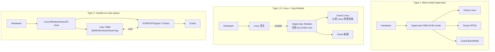
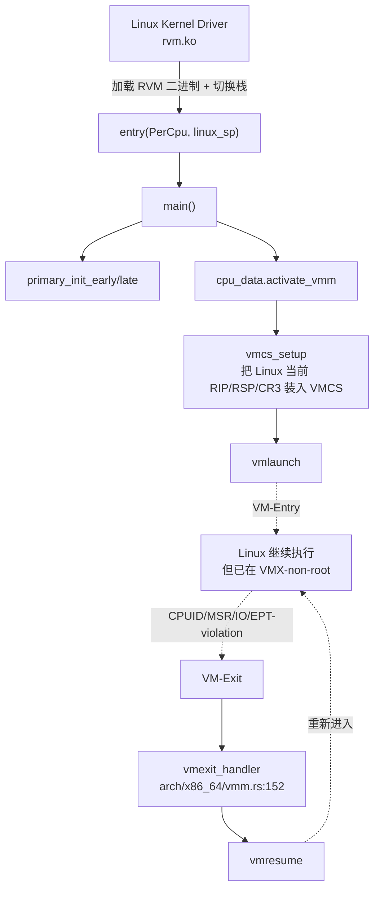
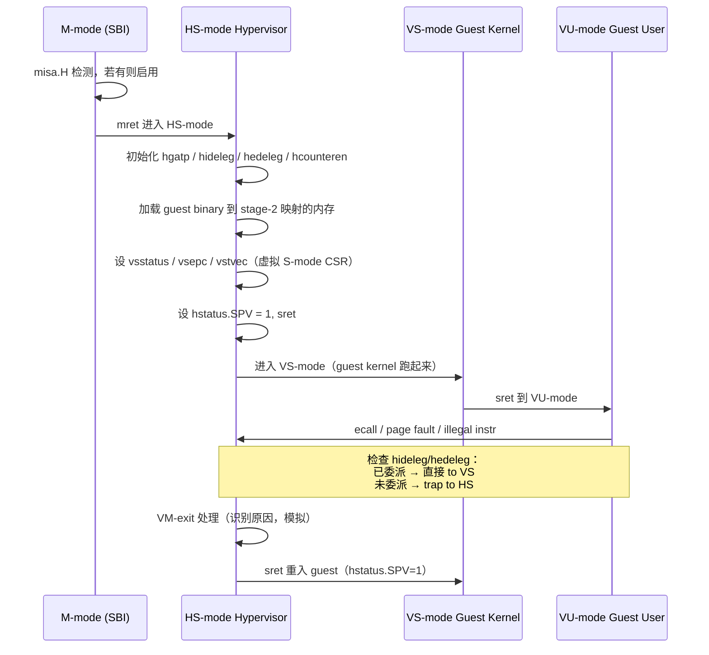
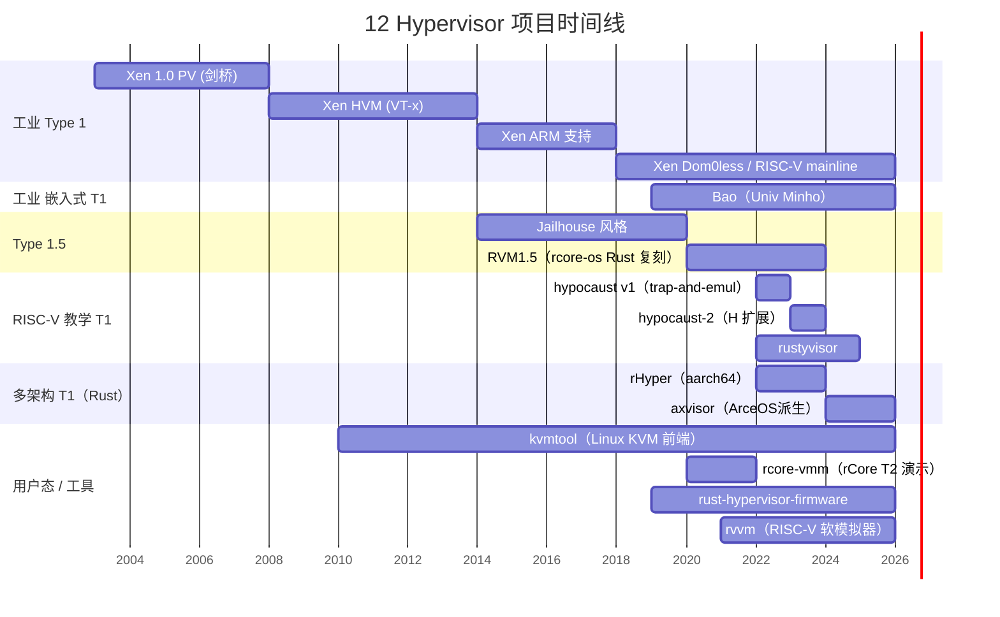

# 04-10 — Hypervisor 精读合集：xen / bao / hypocaust(-2) / axvisor / RVM1.5 / rHyper / rcore-vmm / rust-hypervisor-firmware / rustyvisor / kvmtool / rvvm

> **核心问题：** 12 个 Hypervisor / VMM / 模拟器项目代码组织 / VM 启动 / 关键子系统怎么实现？Type 1 / 1.5 / 2 在代码层有什么本质差异？RISC-V H 扩展怎么用？
>
> **本笔记定位：** 04 OS 大类的"细节填充"层 —— 把 04-04 / 04-01 § 7 提到的虚拟化范式落到 12 份真实源码上，对每个项目做"项目身份 → 顶层目录 → 关键入口 → 启动流程 → 子系统"五段式精读，外加 RISC-V H 扩展深度章节。
>
> **纯学习视角：** 不写"借鉴清单"，目的是读懂每个项目的设计动机与实现差异。

---

## 0. 虚拟化范式速览

### 0.1 Type 1 / 1.5 / 2 三段图



**关键差异表：**

| 维度 | Type 1 | Type 1.5 | Type 2 |
|------|--------|----------|--------|
| **谁占据最高特权级** | Hypervisor 直接占据 EL2/HS/VMX-root | Hypervisor 模块在 Linux 启动后"动态接管" | Host OS 一直占据，Hyp 是 OS 的子系统（驱动 + 用户态 VMM）|
| **Boot 顺序** | Boot loader → Hypervisor → Guests | Boot loader → Linux → 启用 Hyp → Linux 变成 Guest 之一 | Boot loader → Host OS → 用户启动 VMM 进程 |
| **TCB 大小** | 极小（几 KB-几 MB）| 中（含 Linux 子集）| 大（整个 Host OS） |
| **Driver 复用** | 必须自己写或来自 Linux | 直接复用 Linux | 复用 Host OS |
| **代表** | Xen / OKL4 / NOVA / Hyper-V Type 1 / Bao | Jailhouse / RVM1.5 | KVM+QEMU / VMware Workstation / VirtualBox / Parallels |
| **示例项目（本笔记）** | xen / bao / hypocaust(-2) / axvisor / rHyper / rustyvisor / rust-hypervisor-firmware（fw 形态）| RVM1.5 | rcore-vmm / kvmtool（依附 KVM）|

> **rvvm 例外：** 不是 hypervisor 而是软件模拟器 / userland emulator（类似 QEMU TCG 模式），但本地放在 `hyper/`，本笔记一并精读。

### 0.2 RISC-V H 扩展 vs ARM EL2 vs x86 VT-x/VMX

```
ARM:
  EL3 secure monitor (TF-A)
  EL2 hypervisor          ← KVM / Bao / rHyper / axvisor 跑这里
  EL1 OS kernel (Host or Guest)
  EL0 user

x86 (VMX):
  VMX-root mode           ← Hypervisor (Linux KVM / RVM1.5 / Xen / VMware)
  VMX-non-root mode       ← Guest OS
    Ring 0 (kernel)
    Ring 3 (user)

RISC-V (H 扩展):
  HS-mode (H+S)           ← Hypervisor (Xen RISC-V / Bao / axvisor / hypocaust-2)
  VS-mode (Virtualized S) ← Guest OS kernel
  VU-mode (Virtualized U) ← Guest userland
  S/U-mode（无虚拟化）    ← 直接运行普通 OS（hypocaust v1 此层做 trap-and-emulate）
```

**关键 CSR（H 扩展）：**

| CSR | 用途 |
|-----|------|
| `hgatp` | Hypervisor Guest Address Translation and Protection — stage-2 页表根，类似 ARM `vttbr` / x86 EPT pointer |
| `hstatus` | Hypervisor Status — 含 `SPV`(Supervisor Previous Virtualization)、`SPVP`、`VTSR`/`VTVM`/`VGEIN` 等 |
| `hideleg` | Interrupt delegation HS → VS（让 VS-mode 自己处理 timer/soft/external 中断）|
| `hedeleg` | Exception delegation HS → VS（page fault 等异常下放到 VS 处理）|
| `hcounteren` / `hgeie` / `hgeip` | counter enable / Guest External Interrupt Enable / Pending |
| `hvip` | HS-injected virtual interrupts to VS |
| `vsstatus` / `vsepc` / `vstvec` / `vsatp` / ... | VS-mode 的镜像 CSR（hypervisor 替 guest S-mode 管理这些）|

**进出 VS-mode：**
- **进入**：`sret` 且 `hstatus.SPV=1` → 返回到 VS-mode（而非 S-mode）
- **退出**：guest 触发 trap，HS-mode trap handler 看 `hstatus.SPV` 判断"是否来自 guest"

### 0.3 stage-2 翻译

```
Guest VA  --[guest stage-1, vsatp]--> Guest PA (= IPA)
Guest PA  --[stage-2, hgatp]--> Host PA
```

- **Sv39x4** — 39+2=41 位 IPA，一级表大 4 倍（16 KB 而非 4 KB），bao/hypocaust-2/axvisor 默认
- **Sv48x4** — 48+2=50 位 IPA
- **Sv57x4** — 57+2=59 位 IPA

### 0.4 12 项目分类对比表

| 项目 | 类型 | 主语言 | 主架构 | 体量 (cloc 代码行) | 教学/工业 | 备注 |
|------|------|--------|--------|--------------------|-----------|------|
| **xen** | T1 | C + ASM | x86 / ARM / RISC-V / PPC | **657 K** | 工业 | 22 年最重的工业 T1 hypervisor |
| **bao-hypervisor** | T1（静态分区）| C + ASM | ARM / RISC-V / RH850 / Tricore | 28 K | 工业（功能安全）| 嵌入式 mixed-criticality |
| **hypocaust** | T1（教学）| Rust | RISC-V S-mode trap-and-emulate | 3.5 K | 教学 | 不依赖 H 扩展，纯 trap |
| **hypocaust-2** | T1（H 扩展）| Rust | RISC-V HS-mode | 4 K | 教学 | hypocaust 的 H 扩展继任者 |
| **axvisor** | T1（unikernel 派生）| Rust | x86_64 / aarch64 / RISC-V | 13 K（kernel 仅）| 教学+科研 | 基于 ArceOS 组件化 |
| **RVM1.5** | T1.5 | Rust | x86_64 (Intel/AMD) | 6.5 K | 科研 | Jailhouse 风格，Linux 中启用 |
| **rHyper** | T1 | Rust | aarch64 | 3.6 K | 教学 | ARM EL2 hypervisor |
| **rcore-vmm** | T2（用户态）| C | x86_64 (RVM ioctl) | < 1 K（核心 vmm.c）| 教学 | rCore 上的 user-space VMM |
| **rust-hypervisor-firmware** | T1 firmware | Rust | x86_64 / aarch64 / RISC-V | 9.6 K | 工业 | Cloud Hypervisor 配套 fw |
| **rustyvisor** | T1（学习）| Rust | RISC-V | 3.4 K | 教学（WIP）| RustSBI 风格的 H-ext hyp |
| **kvmtool** | KVM frontend | C | x86 / ARM / MIPS / PPC / RISC-V | 36 K | 工业（学习友好）| Linux KVM 的 5 KLOC 简洁 VMM |
| **rvvm** | RISC-V 模拟器 | C | host-agnostic, 模拟 RV32/64 | 58 K | 工业 | TCG-like JIT 模拟器 |

> **本仓库路径前缀：** `/home/heke/tgln/stage2/material/hyper/<项目名>/`

---

## 1. xen 精读（200 万行级工业经典，最重）

### 1.1 项目身份

| 项 | 值 |
|----|---|
| **正式名** | Xen Project Hypervisor |
| **起源** | 2003，剑桥大学 Computer Lab Systems Research Group，XenoServers 项目衍生 |
| **协议** | GPLv2 |
| **代码量** | hypervisor `xen/` 子目录约 65 万行；含 `tools/` 总仓库 200 万+ 行 |
| **本仓库路径** | `/home/heke/tgln/stage2/material/hyper/xen/` |
| **官方** | https://www.xen.org / https://wiki.xenproject.org |
| **架构支持** | x86 / ARM / PPC / **RISC-V**（早期支持，2024+ 加速）|
| **维护方** | Xen Project（Linux Foundation 协作项目），原作 Ian Pratt |

### 1.2 顶层目录（xen 仓库根）

```
xen/                  ← 仓库根
  CHANGELOG.md
  CODING_STYLE
  CONTRIBUTING
  COPYING             ← GPLv2
  README              ← 安装速查
  Config.mk
  Makefile
  configure
  config.guess / config.sub / install.sh
  docs/               ← 文档源（man 页、guide）
  m4/                 ← autoconf 宏
  scripts/            ← 构建辅助脚本
  stubdom/            ← Stub Domain（minios + 第三方库小型化 build）
  tools/              ← 用户态：xl / xenstore / libxc / qemu-traditional 等
  xen/                ← 真正的 hypervisor 源码（核心）
  config/
  automation/
  misc/
```

**子目录核心解读：**

- **`xen/`（嵌套）** — Hypervisor 内核，类似 Linux 的 `linux/` 嵌套，启动后变成 M-mode/EL2/VMX-root 跑的二进制
- **`tools/`** — 用户态生态：`xl`（命令行）、`xenstore`（key-value 注册表）、`libxc`（C 库）、`9pfsd`（9P 文件服务）、`debugger`、`hotplug`、`firmware`、`libacpi`、`libfsimage` 等 23 个子目录
- **`stubdom/`** — Stub Domain，把驱动域跑在最小 OS（mini-os）里，提供 device emulation 而不污染 dom0

### 1.3 hypervisor 子目录（xen/xen/）

```
xen/xen/
  Kconfig / Kconfig.debug / Makefile / Rules.mk
  COPYING
  arch/                 ← 架构特化
    arm/                ← ARM (32+64) 支持
    x86/                ← x86 / x86_64（最成熟）
    ppc/                ← PowerPC
    riscv/              ← RISC-V 64（实验，渐进完善）
  common/               ← 跨架构核心
    domain.c            ← 2557 行，domain 生命周期
    sched/              ← 调度器（credit / credit2 / null / RTDS / arinc653）
    event_channel.c
    grant_table.c       ← Xen 标志性：grant table（domain 间共享内存）
    libfdt/ libelf/     ← 自带 FDT / ELF 解析库
    efi/                ← UEFI 启动支持
  crypto/               ← 加密原语
  drivers/              ← acpi / char / cpufreq / passthrough / pci / vpci / video
  include/              ← 公共 header
    public/             ← Hypercall ABI 公开 header（guest 可见）
    asm-generic/
    crypto/ efi/ xen/ xsm/
  lib/                  ← libc 子集
  scripts/              ← 构建脚本（xen_analysis 等）
  test/
  xsm/                  ← Xen Security Modules（XSM/Flask）
```

### 1.4 arch/x86/（最成熟）

部分关键文件：

```
arch/x86/
  Makefile / Kconfig / Kconfig.cpu / Kconfig.debug
  acpi/                ← ACPI 处理
  alternative.c        ← 运行时代码 patching
  apic.c               ← APIC 支持
  boot/                ← 启动入口
  bzimage.c            ← bzImage 解析
  cpu/                 ← CPU 检测、特性
  cpu-policy.c
  cpuid.c
  domain.c             ← x86 domain 特化
  dom0_build.c         ← dom0 构建
  e820.c               ← e820 内存图
  efi/                 ← UEFI 入口
  extable.c            ← exception table
  hvm/                 ← HVM (Hardware Virt) 完整实现
  pv/                  ← PV (Paravirt) 完整实现
  setup.c              ← 2361 行，主初始化
  ...
```

**两条虚拟化路径并存（x86 独有）：**
- **PV (Paravirtualization)** — guest 内核知道自己是 guest，主动 hypercall 处理特权操作（无需 VT-x）
- **HVM (Hardware-assisted)** — 用 Intel VT-x / AMD-V，guest 不修改

### 1.5 arch/arm/（工业第二成熟）

```
arch/arm/
  arm32/ arm64/
  acpi/ efi/ firmware/  ← 平台 abstraction
  decode.c              ← 指令解码（trap-and-emulate fallback）
  domain.c domain_build.c domctl.c
  dom0less-build.c      ← Dom0less：直接从 FDT 启动多 guest，无需 dom0
  dtb.S                 ← 把 DTB 编进二进制
  gic-v2.c gic-v3.c gic-v3-its.c gic-v3-lpi.c gic-vgic.c
                        ← GIC v2/v3 + ITS（中断翻译）+ LPI（locality-specific）+ vGIC
  setup.c               ← 536 行
  smpboot.c
  vpsci.c               ← 虚拟 PSCI（Power State Coordination Interface）
  ...
```

### 1.6 arch/riscv/（早期但完整启动流程）

```
arch/riscv/
  Kconfig Makefile Rules.mk
  configs/
    riscv64_defconfig    ← 默认配置
    tiny64_defconfig     ← 最小化
  riscv64/               ← arch 特化（asm 等）
  vsbi/                  ← 虚拟 SBI 实现（hypervisor 给 guest 提供 SBI）
    base-extension.c     ← BASE 扩展
    legacy-extension.c   ← 旧式扩展
    core.c               ← vsbi 核心 dispatch
  setup.c                ← 168 行（短）— start_xen 入口
  early_printk.c
  entry.S                ← trap entry
  smp.c smpboot.c
  cpufeature.c
  paging.c p2m.c pt.c    ← page table（含 stage-2）
  vmid.c                 ← VMID 分配
  vtimer.c               ← virtual timer
  intc.c imsic.c aplic.c ← APLIC + IMSIC（advanced PLIC + 内存映射 IPI）
  sbi.c                  ← 与 OpenSBI/RustSBI 通信
  traps.c                ← trap 处理（含 H 扩展处理）
  vm_event.c             ← VM event 通知
  shutdown.c
  xen.lds.S              ← 链接脚本
```

### 1.7 启动流程（RISC-V 为例，最简洁）

`xen/arch/riscv/setup.c:75` —— `start_xen` 入口：

```c
void __init noreturn start_xen(unsigned long bootcpu_id, paddr_t dtb_addr)
{
    remove_identity_mapping();         // 解除 boot 阶段身份映射
    smp_prepare_boot_cpu();            // SMP 子系统准备
    sort_exception_tables();           // 异常表排序
    set_cpuid_to_hartid(0, bootcpu_id);
    trap_init();                        // 设 stvec/htvec
    sbi_init();                         // 与底层 SBI 通信
    setup_fixmap_mappings();
    device_tree_flattened = early_fdt_map(dtb_addr);
    /* 把 Xen 自身二进制注册为第一个 boot module */
    add_boot_module(BOOTMOD_XEN, virt_to_maddr(_start), _end - _start, false);
    fdt_size = boot_fdt_info(device_tree_flattened, dtb_addr);
    cmdline = boot_fdt_cmdline(device_tree_flattened);
    cmdline_parse(cmdline);
    setup_mm();                         // 主内存管理
    vm_init();                          // VM 子系统初始化
    end_boot_allocator();
    check_vsbi_ext_ranges();            // 检查 vsbi 扩展是否就绪
    system_state = SYS_STATE_boot;
    init_constructors();
    /* ...继续走 dom0 构建路径，最终 do_idle / first_dom_run */
}
```

x86 / ARM 入口同名 `start_xen` 但代码长得多（x86 setup.c 2361 行 vs RISC-V 168 行）。

```mermaid
flowchart TB
    BL[Boot Loader<br/>U-Boot/EDK2/SBI] --> ENTRY[arch/&lt;arch&gt;/start.S<br/>清栈/MMU]
    ENTRY --> SETUP["start_xen()<br/>arch/&lt;arch&gt;/setup.c"]
    SETUP --> EARLY[early_printk + DTB 解析]
    SETUP --> MM[setup_mm + vm_init]
    SETUP --> ALLOC[end_boot_allocator]
    ALLOC --> DOM0[create_dom0<br/>从 boot module 加载]
    DOM0 --> SCHED[启动调度器 → 第一次 schedule()]
    SCHED --> RUN[Dom0 (Linux) 在 VS/non-root 模式跑起来]
    RUN -. user 启动 .-> XL[xl create domU.cfg → libxl → hypercall → 创建 DomU]
```

### 1.8 Domain 概念（dom0 / domU）

- **dom0** — Privileged domain（特权 domain）。第一个被 Xen 启动的 guest，拥有访问真实硬件的权限，托管 Linux + xenstore + qemu-dm 设备模型 + xl 工具
- **domU** — Unprivileged domain，普通 guest。运行未修改的 Linux/Windows/FreeBSD
- **Dom0less** — ARM/RISC-V 引入的"无 dom0"模式，直接从 FDT chosen 节点启动多个 domain，省去 dom0 中转。代码：`xen/arch/arm/dom0less-build.c`

### 1.9 PV vs HVM vs PVH

| 模型 | Guest 是否修改 | 性能（CPU）| 性能（IO）| 硬件需求 |
|------|---------------|----------|---------|---------|
| **PV** | **是**（替换敏感指令为 hypercall）| 高（无 VM exit）| 中（PV driver）| 无（早期 x86 无 VT-x 也跑）|
| **HVM** | 否（unmodified Windows / Linux）| 中（VM exit 多）| 低（QEMU 设备模型）| VT-x / SVM |
| **PVH** | 部分（无 BIOS / 无 IOAPIC，用 PV 启动 + HVM 执行）| 高 | 高（PV driver）| VT-x / SVM |

### 1.10 历史里程碑

| 年 | 版本 | 关键事件 |
|----|------|---------|
| 2003 | 1.0 | SOSP'03 paper *Xen and the Art of Virtualization* |
| 2005 | 3.0 | HVM 支持（Intel VT-x）|
| 2008 | 3.3 | x86_64 PV 完整支持 |
| 2011 | 4.1 | 移交 Linux Foundation，改名 Xen Project |
| 2013 | 4.3 | ARM 支持（Cortex-A15 KVM/Xen 之争开打）|
| 2016 | 4.7 | PVH 模型（PV + HVM 混合）|
| 2018 | 4.11 | dom0less（ARM 嵌入式无 dom0）|
| 2024+ | 4.19+ | RISC-V 支持开始 merge mainline |

### 1.11 工业部署

- **AWS EC2 (2006-2017)** — 全部基于 Xen，2017 后逐渐迁移到自研 Nitro（基于 KVM 改造）
- **Citrix XenServer / Hypervisor** — 商业版，企业虚拟化 |
- **Qubes OS** — 基于 Xen 的安全桌面 OS，每个 app 跑在独立 domain |
- **Oracle Linux Virtualization Manager** | NXP automotive | Renesas | EPAM 汽车虚拟化

---

## 2. bao-hypervisor 精读（静态分区 / 安全认证）

### 2.1 项目身份

| 项 | 值 |
|----|---|
| **正式名** | Bao Hypervisor（"bǎo hù 保护"）|
| **起源** | 葡萄牙 Univ. Minho，bao-project，2019+ |
| **协议** | Apache-2.0（部分 MIT）|
| **代码量** | ~28 K 行 C + ASM（核心 + 4 架构）|
| **本仓库路径** | `/home/heke/tgln/stage2/material/hyper/bao-hypervisor/` |
| **官方** | http://www.bao-project.org / https://github.com/bao-project |
| **架构** | ARMv7-A / ARMv8-A AArch32+64 / **ARMv8-R**（实时）/ RISC-V RV32+64 / Renesas RH850 / Infineon Tricore |
| **定位** | "Lightweight static partitioning hypervisor" — mixed-criticality 嵌入式 |

### 2.2 顶层目录

```
bao-hypervisor/
  CONTRIBUTORS LICENSE Makefile README.md
  ci/                 ← CI 脚本
  configs/            ← 各平台 + VM 配置示例
  scripts/
  src/
    arch/             ← 架构特化（4 个）
      armv8/  riscv/  rh850/  tricore/
    core/             ← 核心
    lib/              ← printk / string / bitmap
    platform/         ← 板级支持包
    linker.ld
```

### 2.3 静态分区设计哲学

**"静态分区"含义：** Boot 时根据 `config.c` 配置把 CPU、内存、IO 设备**一次性**分配给固定数量的 VM，运行期不重新分配 / 不调度。设计目的：

- **Real-time 行为可预测** — 没有调度抖动
- **Fault containment** — 一个 VM 崩溃不影响其他
- **TCB 极小** — 没有调度器、没有 IO 模拟器
- **认证友好** — ISO 26262 / IEC 61508 等功能安全标准要求确定性

**对比：动态分区（Xen / KVM）**：vCPU 调度到 pCPU、跨 VM 内存平衡、设备模拟。

### 2.4 src/core/（跨架构核心）

```
src/core/
  init.c          ← 41 行，入口 init() 函数（极简）
  cpu.c           ← 140 行，cpu_init / cpu_idle
  vm.c            ← 442 行，VM 数据结构 + 初始化
  vmm.c           ← 154 行，VM 分配 + 启动
  mem.c           ← 591 行，内存管理（核心）
  console.c
  cache.c
  interrupts.c
  ipc.c           ← Inter-VM Communication
  shmem.c         ← 共享内存
  config.c
  hypercall.c
  remio.c         ← Remote IO
  platform.c
  objpool.c       ← 对象池（避免动态分配）
  inc/
```

### 2.5 启动流程：bao-hypervisor/src/core/init.c

```c
// src/core/init.c:16
void init(cpuid_t cpu_id)
{
    cpu_init(cpu_id);            // 0. CPU 子系统
    mem_init();                  // 1. 内存子系统（双 stage 页表）

    platform_init();             // 2. 平台
    console_init();              // 3. 串口

    if (cpu_is_master()) {       // 4. 主 CPU 打 banner
        console_printk("Bao Hypervisor %s ...\n");
    }

    interrupts_init();           // 5. 中断（GIC / PLIC / APLIC）
    vmm_init();                  // 6. VMM 子系统 → 创建并启动所有 VM

    while (1) { }                // 不应到达
}
```

### 2.6 vmm_init（核心）

`src/core/vmm.c:127` —— `vmm_init`。每个 CPU 进入后做：

1. `vmm_assign_vcpu(...)` — 根据 cpu_affinity 把当前物理 CPU 分配给一个 VM 的某 vCPU
2. 主 CPU 调用 `vmm_alloc_vm` 申请 VM 实例（从 `objpool` 取出）
3. `vmm_install_vm` — 从静态 image 复制（直接 mmap 或 reloc）guest binary
4. 屏障同步等待所有 vCPU 就位
5. `vcpu_run` —— **进入 VM**

**关键点：** Bao 的 vCPU **1:1** 绑定 pCPU，不调度，不切换。所以没有 vcpu scheduler，没有 idle loop。

### 2.7 RISC-V H 扩展使用（src/arch/riscv/）

```
src/arch/riscv/
  Kconfig arch.mk objects.mk
  boot.S            ← 351 行，启动汇编
  exceptions.S      ← trap entry
  sync_exceptions.c ← 同步异常处理
  vmm.c             ← 45 行，vmm_arch_init
  vm.c              ← 94 行，vcpu hgatp/hstatus 配置
  cpu.c page_table.c mem.c
  iommu.c           ← RISC-V IOMMU（IOPMP + iohgatp）
  aclint.c          ← ACLINT（Advanced CLINT）
  irqc/             ← PLIC / APLIC + IMSIC 中断控制器抽象
  sbi.c             ← 调用底层 SBI
  inc/
  relocate.S
  root_pt.S
```

**vmm_arch_init（HS 寄存器配置）—— src/arch/riscv/vmm.c:21-22:**

```c
csrs_hideleg_write(HIDELEG_VSSI | HIDELEG_VSTI | HIDELEG_VSEI);
// 把 VS-mode software/timer/external 中断委派给 VS 自己处理
csrs_hedeleg_write(HEDELEG_ECU | HEDELEG_IPF | HEDELEG_LPF | HEDELEG_SPF);
// 把 user ecall / instruction page fault / load page fault / store page fault
// 委派给 VS 自己处理
```

**vCPU 进入 VS-mode（src/arch/riscv/vm.c:19）：**

```c
unsigned long hgatp = (root_pt_pa >> PAGE_SHIFT) | (HGATP_MODE_DFLT) |
                      ((vmid << HGATP_VMID_OFF) & HGATP_VMID_MASK);
csrs_hgatp_write(hgatp);                   // 装入 stage-2 页表
vcpu->regs.hstatus = HSTATUS_SPV |         // 表示 sret 后回 VS
                     (1ULL << HSTATUS_VGEIN_OFF);
if (rv64) vcpu->regs.hstatus |= HSTATUS_VSXL_64;
```

**RISC-V IOMMU（iohgatp）—— src/arch/riscv/iommu.c:361-366:**

```c
uint64_t iohgatp = 0;
iohgatp |= ((root_pt >> 12) & RV_IOMMU_DC_IOHGATP_PPN_MASK);
iohgatp |= ((((uint64_t)vm->id) << RV_IOMMU_DC_IOHGATP_GSCID_OFF) & ...);
iohgatp |= RV_IOMMU_IOHGATP_SV39X4;
rv_iommu.hw.ddt[dev_id].iohgatp = iohgatp;  // 写入 device-context 表
```

→ **DMA 也走 stage-2 翻译**，passthrough 设备 DMA 不能越界访问别的 VM 内存。

### 2.8 ARM 端实现（src/arch/armv8/vgic.c 1239 行最大）

- `vgicv2.c` / `vgicv3.c` — virtual GIC 拦截 distributor 寄存器
- `gicv2.c` / `gicv3.c` — 真实 GIC 驱动
- `psci.c` — PSCI 处理（vCPU 启动 / 关机命令）
- `vm.c` / `vmm.c` — VM 数据结构 + ARM 特化的 stage-2（VTTBR）

### 2.9 工业实践

Bao 主推汽车（automotive）/ 工业控制（industrial control）/ 医疗设备等 mixed-criticality 场景。已被 NXP（S32G3 telematics gateway）、Renesas（RH850 ECU）、Toradex Verdin iMX8M Plus 等真实硬件部署。

---

## 3. hypocaust 精读（RISC-V S-mode trap-and-emulate 教学）

### 3.1 项目身份

| 项 | 值 |
|----|---|
| **正式名** | Hypocaust |
| **作者** | KuangjuX（北邮 / 教学项目）|
| **协议** | LGPL |
| **代码量** | 3.5 K 行 Rust |
| **本仓库路径** | `/home/heke/tgln/stage2/material/hyper/hypocaust/` |
| **目标** | 在 **没有 H 扩展**的 RISC-V 上做 type-1 hypervisor —— 纯 trap-and-emulate |
| **运行平台** | QEMU virt 7.0.0，配 RustSBI |
| **能跑** | 自带 minikernel guest |

### 3.2 顶层目录

```
hypocaust/
  Cargo.toml Cargo.lock
  Makefile README.md
  bootloader/      ← RustSBI 镜像
  configs/
  docs/
  minikernel/      ← 自带 guest 内核（toy）
  src/
    boards/        ← 板级
    constants/     ← 配置常量
    debug/
    device_emu/    ← 设备模拟（IO trap）
    guest/         ← guest 抽象
    hypervisor/    ← hypervisor 核心
    page_table/
    mm/
    sync/
    main.rs
    console.rs sbi.rs timer.rs lang_items.rs linker.ld
```

### 3.3 关键设计：Shadow Page Table（影子页表）

**没有 H 扩展时**怎么做内存隔离？hypocaust 用经典 **Shadow Page Table** 技巧：

```
Guest VA ─[guest 自维护页表 GPT]─→ Guest PA
                                  ↓ Hypervisor 截获 Guest PA
         ─[Hypervisor 维护 SPT]──→ Host PA (实际 satp 装的就是 SPT)
```

- Guest 改 satp / 改自己的页表项 → 触发 trap
- Hypervisor 在 SPT 里同步映射，并把 Guest PA 翻译成 Host PA
- 这样 satp 装的实际是 SPT，guest 看不到真实 Host PA

### 3.4 启动流程

```rust
// src/main.rs:56
#[link_section = ".text.entry"]
#[export_name = "_start"]
#[naked]
pub unsafe extern "C" fn start() -> ! {
    core::arch::asm!(
        "la sp, {boot_stack}",
        "li t2, {boot_stack_size}",
        "addi t3, a0, 1",
        "mul t2, t2, t3",
        "add sp, sp, t2",
        "call hentry",
        boot_stack = sym BOOT_STACK,
        boot_stack_size = const BOOT_STACK_SIZE,
        options(noreturn)
    )
}

#[no_mangle]
pub fn hentry(hart_id: usize, device_tree_blob: usize) -> ! {
    if hart_id == 0 {
        clear_bss();
        let meta = hypervisor::fdt::MachineMeta::parse(device_tree_blob);
        hypervisor::hyp_alloc::heap_init();
        hypervisor::initialize_vmm(meta);
        // 创建 guest, 装载 kernel, 配置 SPT, 跳进 S-mode 当 guest
    }
    // ...
}
```

### 3.5 Memory Region 布局（README）

```
0x80000000-0x80200000  RustSBI
0x80200000-0x88000000  hypervisor 自身
0x88000000-0x90000000  Guest Kernel 1  (HPA = HVA)
0x90000000-0x98000000  Guest Kernel 2
0x98000000-0xA0000000  Guest Kernel 3
0x100000000-0x180000000 Guest Kernel 1 Shadow Page Table（独立大区）

特殊页（高地址）:
0xFFFF...FFFF000  Trampoline
0xFFFF...FFFE000  Trap Context
```

### 3.6 RoadMap（README 实现进度）

- [x] Load + run guest kernel
- [x] Trap-and-emulate of CSR + SFENCE.VMA
- [x] Shadow page tables + SPT/satp 同步
- [x] Forward exceptions + interrupts to guest
- [x] Timer
- [ ] Serial IO emulate / external interrupts / virtio passthrough / SMP / multi-guest

### 3.7 与 hypocaust-2 的关系

> 作者 README 自述："**Currently developing the hardware-assisted virtualization project hypocaust-2**" —— hypocaust 是 v1 trap-and-emulate 教学版，hypocaust-2 是 H 扩展加速版（见 § 4）。

---

## 4. hypocaust-2 精读（hypocaust 的 H 扩展继任版）

### 4.1 项目身份

| 项 | 值 |
|----|---|
| **正式名** | Hypocaust-2 |
| **作者** | KuangjuX（同上）|
| **协议** | MIT |
| **代码量** | 4 K 行 Rust |
| **本仓库路径** | `/home/heke/tgln/stage2/material/hyper/hypocaust-2/` |
| **目标** | 用 **H 扩展**做高性能 type-1 hypervisor，**vCPU 1:1 绑定 pCPU 不调度**，IO passthrough |
| **运行平台** | QEMU 7.1+（必须支持 H 扩展）+ RustSBI-QEMU 2023-02 |
| **可跑 guest** | rCore-Tutorial-v3 / RT-Thread / Linux v6.2 |

### 4.2 顶层目录

```
hypocaust-2/
  Cargo.toml Makefile README.md
  Dockerfile
  bootloader/
  guest/                 ← guest 镜像 + Linux patch
  scripts/               ← rCore-Tutorial-v3.sh / rt-thread.sh
  src/
    boards/ constants.rs detect.rs
    device_emu/   ← IO 设备模拟（PLIC 等）
    drivers/      ← hypervisor 自身用的硬件驱动
    error.rs
    guest/        ← guest 内核抽象
    hyp_alloc/    ← hypervisor 堆分配器
    hypervisor.rs
    main.rs
    mm/ page_table/
    sbi.rs        ← 调用底层 SBI
    sync/
    console.rs
    lang_items.rs
    linker-qemu.ld
```

### 4.3 启动流程（main.rs:60-130）

```rust
// src/main.rs:68
#[link_section = ".text.entry"]
#[export_name = "_start"]
#[naked]
pub unsafe extern "C" fn start() -> ! {
    core::arch::asm!(
        "la sp, {boot_stack}",
        "li t2, {boot_stack_size}",
        "addi t3, a0, 1",
        "mul t2, t2, t3",
        "add sp, sp, t2",
        "call hentry",
        boot_stack = sym BOOT_STACK,
        boot_stack_size = const BOOT_STACK_SIZE,
        options(noreturn)
    )
}

// src/main.rs:100
#[no_mangle]
unsafe fn hentry(hart_id: usize, dtb: usize) -> ! {
    if hart_id == 0 {
        clear_bss();
        // 检测 H 扩展是否启用
        if sbi_rt::probe_extension(sbi_rt::Hsm).is_unavailable() {
            panic!("no HSM extension exist on current SBI environment");
        }
        if !detect::detect_h_extension() {
            panic!("no RISC-V hypervisor H extension on current environment")
        }

        // 初始化堆
        hyp_alloc::heap_init();
        let machine = hypervisor::fdt::MachineMeta::parse(dtb);
        let guest_machine = hypervisor::fdt::MachineMeta::parse(GUEST_DTB.as_ptr() as usize);

        // 初始化 vmm（host 内存集合）
        let hpm = HostMemorySet::<PageTableSv39>::new_host_vmm(&machine);
        init_vmm(hpm, machine);
        // 创建 guest 内存集合
    }
}
```

### 4.4 H 扩展使用关键文件

```
src/detect.rs           ← detect_h_extension()
src/constants.rs        ← H 扩展相关常量
src/hypervisor.rs       ← VMM 主控
src/device_emu/plic.rs  ← virtual PLIC（拦截 guest 写 PLIC 寄存器）
src/guest/vmexit.rs     ← VM exit 处理（H 扩展进出）
src/guest/context.rs    ← vCPU 上下文（含 hstatus / vsstatus 等 CSR）
src/guest/sbi.rs        ← virtual SBI（hypervisor 给 guest 提供 SBI）
src/guest/trap.S        ← VS-mode trap 进出汇编
src/guest/guest.S       ← guest 装载相关
```

### 4.5 设计哲学（README 自述）

> "build a high-performance riscv64 hypervisor that **physically maps the cpu cores**, so there is **no need to schedule guests** in the hypervisor. In addition, the **passthrough method for IO devices** has achieved good performance."

→ vCPU 1:1 pCPU + IO passthrough = bao 风格但用 H 扩展实现。

---

## 5. axvisor 精读（ArceOS 派生 unified hypervisor）

### 5.1 项目身份

| 项 | 值 |
|----|---|
| **正式名** | AxVisor |
| **作者** | arceos-hypervisor 组织 |
| **协议** | Apache-2.0 |
| **代码量** | 13 K 行 Rust（仅 kernel；含依赖更多）|
| **本仓库路径** | `/home/heke/tgln/stage2/material/hyper/axvisor/` |
| **目标** | "**Unified modular Type I hypervisor**" — 一个代码库支持 x86_64 / aarch64 / RISC-V 三个架构 |
| **基础** | ArceOS（unikernel/组件化 OS） |
| **典型 Guest** | ArceOS / Starry-OS / NimbOS / Linux |

### 5.2 顶层目录

```
axvisor/
  Cargo.toml LICENSE README.md README_CN.md build.rs
  configs/
    board/         ← 平台配置（aarch64-qemu / aarch64-rk3588 / x86_64-qemu / riscv64-qemu …）
    vms/           ← 虚机配置（arceos-aarch64-qemu-smp1.toml / linux-aarch64-rk3588.toml …）
    defconfig.toml
  doc/             ← 文档
  scripts/
  rust-toolchain.toml
  xtask/           ← cargo xtask 构建管理
  src/
    main.rs        ← 55 行（极简）
    driver/
    hal/           ← AxVMHalImpl / AxVCpuHalImpl
    logo.rs
    shell/         ← 简单 console shell
    task.rs        ← task / vCPU 调度
    vmm/
      mod.rs       ← 155 行
      hvc.rs       ← Hypervisor Call dispatch
      ivc.rs       ← Inter-VM Comm
      config.rs
      images/
      timer.rs
      vcpus.rs
      vm_list.rs
      fdt/         ← aarch64 FDT support
```

### 5.3 main.rs（极简，借助 ArceOS 框架）

```rust
// src/main.rs:42
#[unsafe(no_mangle)]
fn main() {
    logo::print_logo();
    info!("Starting virtualization...");
    info!("Hardware support: {:?}", axvm::has_hardware_support());
    hal::enable_virtualization();
    vmm::init();
    vmm::start();
    info!("[OK] Default guest initialized");
    shell::console_init();
}
```

→ 由于 ArceOS 已经提供了 entry / heap / scheduler / console，axvisor 只需要"实现 hypervisor 部分"。

### 5.4 vmm/mod.rs

```rust
// src/vmm/mod.rs
pub type VM = axvm::AxVM<AxVMHalImpl, AxVCpuHalImpl>;
pub type VMRef = axvm::AxVMRef<AxVMHalImpl, AxVCpuHalImpl>;
pub type VCpuRef = axvm::AxVCpuRef<AxVCpuHalImpl>;

static VMM: AxWaitQueueHandle = AxWaitQueueHandle::new();
static RUNNING_VM_COUNT: AtomicUsize = AtomicUsize::new(0);

pub fn init() {
    info!("Initializing VMM...");
    config::init_guest_vms();   // 从 configs/vms/*.toml 解析
    // ... 创建 VM 结构 + 主 vCPU
}
```

### 5.5 关键依赖（Cargo.toml）—— ArceOS 组件复用

```
axaddrspace = "0.1.5"      ← stage-2 地址空间
axvcpu = "0.2.2"           ← vCPU 抽象
axvm = "0.2.1"             ← VM 抽象（核心）
axdevice = "0.2.1"         ← 设备
axdevice_base = "0.2.1"
axvmconfig = "0.2"         ← 配置解析
axplat_x86_qemu_q35        ← x86 平台（按 cfg）
axerrno
axstd                       ← ArceOS 标准库（替代 std）
axtask
```

→ axvisor **只是 axvm + axvcpu + axdevice 的"装配"**，跨架构由这些 crate 各自实现。这是 ArceOS 组件化哲学的 hypervisor 应用。

### 5.6 配置驱动：configs/board + configs/vms

`configs/board/<platform>.toml` —— 硬件平台
`configs/vms/<os>-<arch>-<board>-smpx.toml` —— 虚机定义（kernel 路径、内存、vCPU 数、设备列表）

构建时 `cargo xtask build --platform aarch64-qemu --vms linux-aarch64-qemu-smp4` → 生成对应镜像。

### 5.7 已验证硬件（README）

QEMU / Orange Pi 5 Plus (RK3588) / Phytium Pi (E2000Q) / ROC-RK3568-PC / EVM3588（企业级 RK3588）

---

### 5.8 x86_64 UEFI 客户机启动机制全谱（知识点）

> 本节抽自 AxVisor 方向一（x86_64 UEFI guest 支持）所需的知识储备，**不是 AxVisor 当前能力**，是"要让 hypervisor 跑标准 UEFI 客户机必须懂的全套 PC 平台骨架"。后续 D2-D7 笔记会逐项深化。

#### 5.8.1 两种 x86 客户机启动范式

```
范式 A：传统 BIOS / trampoline                范式 B：UEFI 标准启动
┌───────────────────────┐                    ┌──────────────────────────┐
│ vCPU 实模式启动        │                    │ vCPU unrestricted guest   │
│ pc = 0xFFFF0           │                    │ pc = 固件 reset vector    │
│ ↓                      │                    │ ↓                          │
│ 自制固件 (rvm-bios/    │                    │ OVMF.fd (UEFI 标准)       │
│ axvm-bios) 加在 0x8000 │                    │ ↓                          │
│ ↓                      │                    │ SEC → PEI → DXE → BDS     │
│ 跳到内核（fixed addr） │                    │ ↓                          │
│                        │                    │ 通过 ACPI/PCI 标准发现硬件 │
│                        │                    │ ↓                          │
│                        │                    │ Linux EFI stub / UEFI app  │
└───────────────────────┘                    └──────────────────────────┘

代表：rvm-bios.bin / axvm-bios.bin           代表：OVMF / EDK2
配置：entry_point + bios_load_addr 0x8000    配置：boot = "uefi" + ovmf_code + ovmf_vars
```

**实模式 vs unrestricted guest（Intel VMX 术语）：**
- **实模式（Real Mode）** = 16-bit + segment\*16+offset 寻址 + 1 MB 物理地址空间 —— 1981 IBM PC 兼容遗产；纯实模式 guest 早期 VMX 不直接支持，要靠 software emulation
- **Unrestricted Guest** = Intel Nehalem (2008) 加的 VMX 能力，允许 guest 在实模式 / paged 模式之间自由切换，硬件直接支持，无需 hypervisor 介入；UEFI guest 必备

#### 5.8.2 OVMF / EDK2 固件分工

```
OVMF.fd = OVMF_CODE.fd  +  OVMF_VARS.fd
          ┌──────────┐    ┌────────────┐
          │ 只读代码  │    │ 可写变量区  │
          │ (Flash)  │    │ (NVRAM)    │
          └──────────┘    └────────────┘
          UEFI 固件        UEFI 变量
          DXE / BDS / RT   Boot####, BootOrder
                           SecureBoot keys, etc.

QEMU 命令：
  -drive if=pflash,format=raw,readonly=on,file=OVMF_CODE.fd
  -drive if=pflash,format=raw,file=OVMF_VARS.fd
```

**pflash 设备：** QEMU 抽象的 NOR Flash，专门给 UEFI 固件用 —— 与普通磁盘的区别是固件能 byte-level 写、保持掉电存储；OVMF_VARS 借此持久化 UEFI 变量。

**与 BIOS 风格区别：** BIOS 用 ROM，固件 + 变量一体不可分；UEFI 把代码（只读 Flash）和变量（可写 Flash）分开成两块 pflash —— 升级固件不丢 boot entry / SecureBoot 配置。

#### 5.8.3 fw_cfg —— QEMU 风固件配置接口

```
guest 固件 (OVMF/SeaBIOS) ──┬── selector port  0x510 (写)
                            ├── data port      0x511 (读)
                            └── DMA port       0x514 (高效批量)
```

**作用：** 把 hypervisor 端的信息（VM 名 / vCPU 数 / RAM 大小 / 内核镜像 / initrd / cmdline / ACPI 表 / SMBIOS 表 / boot 顺序 / ramfb / e820 内存图 / NVMe namespace 数等）按"选择器 + 数据流"模型传给固件。

**机制：** guest 写 selector 选 file → 通过 data port 流式读 → 固件解析。

**关键 file**（QEMU 约定）：
| selector / name | 内容 |
|:--|:--|
| `signature` | "QEMU CFG" 标识 |
| `id` | 版本 / 能力位 |
| `etc/system-states` | S3/S4 等支持 |
| `etc/boot-menu-wait` | 启动菜单超时 |
| `etc/e820` | E820 内存映射表（传统） |
| `etc/acpi/tables` | 直接给 ACPI 表（OVMF 用） |
| `etc/acpi/rsdp` | ACPI RSDP 地址 |
| `etc/smbios/smbios-tables` | SMBIOS 表 |
| `etc/table-loader` | OVMF 加载器脚本（链接 + checksum + alloc） |
| `bootorder` | 启动顺序字符串 |
| `opt/<vendor>/<name>` | hypervisor 自定义 |

**为什么 hypervisor 必须实现 fw_cfg：** 不用 fw_cfg → 固件没法知道 VM 的拓扑 → 不会生成正确 ACPI 表 → guest OS 找不到 CPU/内存/PCI → 启动失败。

#### 5.8.4 ACPI 表全谱（PC 平台 OS 发现硬件的标准路径）

```
启动后 OS 探测硬件的入口：
  1. UEFI Configuration Table 找 RSDP（地址 GUID = EFI_ACPI_20_TABLE_GUID）
     传统 BIOS：扫 EBDA + 0xE0000-0xFFFFF
  2. RSDP → 指向 XSDT（或 RSDT，旧）
  3. XSDT 含一组 ACPI 表的物理地址数组
  4. OS 按签名（4 字节）查找需要的表
```

**核心表清单（UEFI guest 最少需要 5 个）：**

| 表 | 全名 | 必需性 | 内容 |
|:--|:--|:--|:--|
| **RSDP** | Root System Description Pointer | ⭐ 必须 | 入口指针，含 XSDT/RSDT 地址 + checksum + revision |
| **XSDT** | eXtended System Description Table | ⭐ 必须 | 64-bit 表指针数组（XSDT 取代 32-bit 的 RSDT）|
| **FADT** | Fixed ACPI Description Table | ⭐ 必须 | 电源管理寄存器（PM1a/PM1b/PM_TMR/GPE）+ 指向 DSDT/FACS + Reset Register + IA-PC Boot Flags |
| **MADT** | Multiple APIC Description Table | ⭐ 必须 | 中断控制器拓扑：LAPIC 表（每核一个）+ IOAPIC 表 + Interrupt Source Override + NMI Source（其它叫 APIC table）|
| **MCFG** | PCI Express Memory-mapped Config | ⭐ 必须 | ECAM 基地址（每 PCIe segment 一段，256 MB / segment）|

**其它常见表：**

| 表 | 内容 |
|:--|:--|
| **HPET** | High Precision Event Timer 基地址 + capabilities |
| **SPCR** | Serial Port Console Redirection（嵌入式 / server 必备）|
| **DSDT** | Differentiated System Description Table — AML 字节码（描述 ACPI 设备 hierarchy + power method）|
| **SSDT** | Secondary System Description Table — 补充 AML（动态加载、CPU hotplug 等）|
| **DBG2** | Debug Port Table 2（kdb / windbg）|
| **MCFG** | 已列上 |
| **SLIT/SRAT** | NUMA 拓扑（节点距离 + CPU/内存亲和性）|
| **TPM2** | TPM 2.0 设备地址 |
| **IORT** | I/O Remapping Table（ARM SMMU / 中断重映射）|
| **DMAR** | DMA Remapping (Intel VT-d)|
| **IVRS** | I/O Virtualization Reporting (AMD IOMMU)|

**AML（ACPI Machine Language）：** DSDT/SSDT 不是普通 C 数据，是 AML 字节码 —— OS 加载 ACPI 时用 ACPICA 解释器（Intel 维护，Linux/EDK2/FreeBSD 都用）执行，描述 `_PRT`（PCI 中断路由）、`_PRW`（电源唤醒）、`_HID`（硬件 ID）、`_CRS`（current resource settings）等。**hypervisor 提供 UEFI guest 时通常用 iasl 编译 ASL → AML**，再通过 fw_cfg 传给 OVMF。

#### 5.8.5 PCI 主桥 + 配置空间

```
PCI 设备发现路径：
  CPU → PCI 主桥（host bridge）→ PCI 总线 → 设备
                                              ↓
                                         配置空间（256 B 或 4 KB）
                                         BAR 0..5（指 MMIO/PIO 资源）
                                         Vendor ID / Device ID / Class / IRQ
```

**配置空间访问的两种机制：**

| 机制 | 来源 | 特征 |
|:--|:--|:--|
| **PIO**（传统） | PCI 2.x 起，x86 专有 | 写 `0xCF8`（地址）+ 读写 `0xCFC`（数据），只能访问 256 B/设备 |
| **ECAM**（现代） | PCIe，全平台 | 直接 MMIO 一片连续地址空间，每 PCIe segment 256 MB（256 bus × 32 device × 8 function × 4 KB）；4 KB/设备（扩展配置空间）|

**ECAM 基址怎么告诉 OS：** ACPI MCFG 表 / DT 的 `pci@<addr>` 节点（`reg = <0x0 0x30000000 0x0 0x10000000>`）。

**BAR（Base Address Register）：** 6 个 / 设备，每个声明一段 I/O 资源：
- bit 0: 1 = I/O port, 0 = MMIO
- bit 1-2: 类型（32-bit / 64-bit / prefetchable）
- 高位：实际地址
- 写全 1 再读 → 探测资源大小（low bits stuck at 0 = 块大小）

#### 5.8.6 virtio 设备模型（hypervisor 必备）

```
virtio 三种 transport：
  ┌────────────────────────────────────┐
  │ virtio-pci  — PC/server 主流        │ ← UEFI guest 用这个
  │   PCI 设备 (Vendor 0x1AF4)         │
  │   Device ID 0x1000-0x107F          │
  ├────────────────────────────────────┤
  │ virtio-mmio — 嵌入式/直接 MMIO       │
  │   QEMU virt 板 / 树莓派              │
  ├────────────────────────────────────┤
  │ virtio-channel — IBM s390           │
  └────────────────────────────────────┘

virtio 设备类型：
  block (磁盘) / net (网卡) / console (串口) / 9p (文件系统)
  rng (熵源) / balloon (内存气球) / gpu / input / sound / vsock / iommu / pmem ...
```

**virtio-pci 关键 PCI Capability：**
| Cap | 含义 |
|:--|:--|
| `VIRTIO_PCI_CAP_COMMON_CFG` | 设备通用配置（feature 协商 / queue 选择）|
| `VIRTIO_PCI_CAP_NOTIFY_CFG` | 通知（guest → host kick）|
| `VIRTIO_PCI_CAP_ISR_CFG` | 中断状态 |
| `VIRTIO_PCI_CAP_DEVICE_CFG` | 设备专属配置（block size / mac addr 等）|
| `VIRTIO_PCI_CAP_PCI_CFG` | 通过 PCI Capability 访问以上 |

**virtqueue 内存布局（split queue, virtio 1.0）：**
```
struct vring {
  desc[N];      ← 描述符数组（guest 物理地址 + len + flags + next）
  avail.idx;    ← guest 提供：head 指 desc[i]
  used.idx;     ← device 回填：完成的索引
}
```
guest kick port = MMIO 写 / PCI capability notify → host 检查 avail.idx → 处理 → 写 used.idx → 注入中断。

#### 5.8.7 x86 中断链路（虚拟化角度）

```
┌──────────┐    ┌──────────┐    ┌────────────┐    ┌──────┐
│ virtio   │ → │ vIOAPIC  │ → │ vLAPIC     │ → │ vCPU │
│ (PCI)    │    │ INTx     │    │ delivery   │    │      │
└──────────┘    └──────────┘    └────────────┘    └──────┘
              ↘            ↗
               MSI / MSI-X
               (绕过 IOAPIC，直接写 vLAPIC ICR)

设备 → 控制器 → CPU 的两条路：
  1. INTx wire：4 根（INTA/B/C/D）→ IOAPIC GSI redirection table → LAPIC
  2. MSI / MSI-X：设备直接写 0xFEE0xxxx 内存地址 → IOMMU/中断重映射 → LAPIC
```

**hypervisor 必须实现的中断模块：**
| 模块 | 角色 |
|:--|:--|
| **i8259 PIC（legacy）** | UEFI 启动早期会用，至少要 spoof 一下 |
| **vIOAPIC** | INTx wire → MSI delivery；24 个 redirection entry |
| **vLAPIC** | 每 vCPU 一个；含 IRR/ISR/TMR 三套位图 + LVT + ICR (IPI) + Timer + EOI 寄存器 |
| **MSI/MSI-X 路由** | 把 0xFEE 地址写转化为对应 vLAPIC 的 IRR set |
| **APICv（硬件加速）** | Intel APIC virtualization，让 guest 直接读写 vLAPIC 寄存器不 vmexit |
| **Posted Interrupts** | 设备 → 直接 post 到 vLAPIC IRR / 唤醒 vCPU（不 vmexit）|

**Linux EFI stub 启动路径：**
```
OVMF 加载 vmlinuz.efi (本质是 PE+/COFF 包装的 bzImage)
  ↓
EFI stub 调 UEFI Boot Services：
  - LocateProtocol 找文件系统读 initramfs
  - AllocatePages 给 setup_data / kernel image
  - GetMemoryMap 拿内存图
  - ExitBootServices（关键时刻，不再能调 BS）
  ↓
跳进真正的 Linux 内核入口（start_kernel）
  ↓
内核解析 ACPI 表 + 探测 PCI + 启动 SMP
```

#### 5.8.8 知识点串联：从 OVMF 到 busybox shell

```mermaid
flowchart TB
    PWR[vCPU reset] --> OVMF[OVMF 入口<br/>SEC → PEI → DXE]
    OVMF --> FWCFG[读 fw_cfg<br/>etc/acpi/tables<br/>etc/acpi/rsdp<br/>bootorder]
    FWCFG --> ACPI[安装 ACPI 表<br/>RSDP/XSDT/FADT/MADT/MCFG]
    ACPI --> PCI[扫 PCI ECAM<br/>找 virtio-block]
    PCI --> VPCI[virtio-pci 协议<br/>读 vmlinuz.efi]
    VPCI --> EFI[Linux EFI stub<br/>ExitBootServices]
    EFI --> LK[Linux 内核<br/>解析 ACPI + PCI]
    LK --> SH[/bin/sh on rootfs]
```

**从此图看 AxVisor 方向一缺什么：** 当前缺整条 OVMF → fw_cfg → ACPI → PCI → virtio-pci → EFI stub 链 —— 这是"一整套 PC 平台骨架"的真实含义。

#### 5.8.9 进一步阅读

| 主题 | 资源 |
|:--|:--|
| OVMF 内部 | [03-12 edk2 walkthrough](03-12-edk2-walkthrough.md) §OVMF + tianocore OvmfPkg/ |
| UEFI 演化 | [03-13 uefi evolution](03-13-uefi-evolution-case-study.md) |
| ACPI / AML | acpica/acpica + Intel ACPI spec 6.x（远期独立笔记 D3）|
| PCI / PCIe | PCISIG spec + Linux drivers/pci/ + 本仓 `fs/linux-fs` sparse（远期 D4）|
| virtio | virtio spec 1.x + Linux drivers/virtio/ + rust-vmm/vm-virtio（远期 D5）|
| x86 中断虚拟化 | Intel SDM Vol 3 ch 28-29 + [00-11 § 6 虚拟化中断](00-11-interrupt-evolution.md)（待加 / D6）|
| QEMU 平台 | i440FX vs Q35 + [04-10 § 5 axvisor](04-10-hypervisors-walkthrough.md) + qemu/hw/i386/ |

---

### 5.9 虚拟化设备 / 中断模型（跨架构知识点对照）

> 本节抽自 AxVisor 方向二（设备与中断框架重构）涉及的 hypervisor 通用架构知识。**这些是设计 hypervisor 设备模型时必须懂的横向对照**，不依赖具体实现。

#### 5.9.1 VM exit 设备访问 3 大类（跨架构通用模型）

任何 hypervisor 拦截 guest 访问设备的代码都落在以下 3 类之一：

| 类别 | 触发 | 架构特定 | 例子 |
|:--|:--|:--|:--|
| **MMIO** Memory-Mapped I/O | guest 访问被标为"hypervisor 拦截"的物理地址 → stage-2 fault 或 EPT violation | 所有架构 | 大部分现代设备 / virtio-mmio / IOAPIC |
| **Port I/O (PIO)** | x86 `in`/`out` 指令 vmexit | **仅 x86** | i8259 / CMOS / PCI 配置 PIO / serial 0x3F8 |
| **System Register (sysreg)** | 访问被标为 trap 的 system register | **仅 ARM / RISC-V CSR**（部分）| ARM `MIDR_EL1`/`CNTV_CTL_EL0` / RISC-V `time` CSR |

**为什么三类要分别建模：**
- 触发机制不同（fault type / exit reason / 拦截宽度）
- 地址 / 寄存器号编码方式不同
- 重新分发回设备的查找索引不同

#### 5.9.2 跨架构中断注入对比

```
设备 raise IRQ → hypervisor → guest CPU 看到中断
                      ↓
                  按架构不同走 4 条路：
```

| 架构 | 注入机制 | 关键寄存器 / 数据结构 |
|:--|:--|:--|
| **ARM (AArch64)** | 写 **List Register (LR)** | GICH_LR<n>（GIC v2）/ ICH_LR_EL2<n>（GIC v3+）—— 每核固定数量（典型 4-16）；hypervisor 把 vIRQ 写进 LR，hardware 自动按优先级 deliver 到 vCPU；LR 满时要靠 maintenance interrupt + 软队列降级 |
| **RISC-V** | 写 **`hvip` / `vsip` CSR** 设置 pending 位 / IMSIC vfile（AIA） | hvip = "HS 注入到 VS 的 virtual interrupt pending"；外部中断走 vPLIC `set_pending` 然后 claim/complete 配对；AIA 模型下 IMSIC 用 vfile 直接给 guest |
| **LoongArch** | 写 **`gintc` / `gcsr.estat` GCSR** | Guest CSR（GCSR）= S-mode CSR 的 guest 镜像；hypervisor 修改 GCSR.ESTAT 触发 guest 中断 |
| **x86** | 写 **vLAPIC IRR** 位（或 posted interrupt descriptor）| 每 vCPU 一个 vLAPIC（256 vector）；hypervisor 设 IRR[vec]=1；硬件 deliver 时 IRR → ISR；EOI 后 ISR 清 0 |

**关键认知：** 4 架构的中断注入语义都是"hypervisor 替 guest 设置 pending 位"，但**寄存器名 / 数据结构 / 优先级裁决 / EOI 反馈机制**完全不同 —— 这是为什么"统一 IRQ 路由抽象"对 hypervisor 工程价值巨大。

#### 5.9.3 vPLIC claim / complete 协议（RISC-V 特有）

```
设备 → vPLIC 内部 pending[irq] = 1
  ↓
vPLIC 看 enable[ctx][irq] && priority[irq] > threshold[ctx]
  ↓ 满足
向 ctx 对应的 vCPU 注入 external IRQ（hvip.VSEIP = 1）
  ↓ guest 进 trap
guest 读 vPLIC claim register
  ↓ vPLIC 返回最高优先级 pending IRQ 号 + 自动清 pending bit
guest 处理完
  ↓ 写 vPLIC complete register（与 claim 同地址）
  ↓ vPLIC EOI 完成，可以再 trigger
```

**hypervisor 的工作：** 拦截 vPLIC 整个 MMIO 区域（QEMU virt 默认 0x0C00_0000 ~ 0x0C40_0000），模拟 pending/enable/priority/threshold/claim/complete 6 类寄存器。

#### 5.9.4 ARM VGIC + LR + Maintenance IRQ 机制

```
设备 raise (intid)
  ↓ hypervisor
查 VGIC 软队列（pending 列表）
  ↓
有空 LR？
  ├─ 是 → 写 ICH_LR_EL2<idx> = (intid, prio, state=pending)
  │       硬件下次进 vCPU 自动 deliver
  └─ 否 → 把 intid 留软队列；
          打开 MAINT_IRQ（ICH_HCR_EL2.LRENPIE / NPIE）
          → 等 LR 有空位时硬件触发 EL2 maintenance IRQ
          → hypervisor 把软队列里的 intid 写进 LR
```

**LR 数量限制：** GIC v2 = 4 / GIC v3 = 16（实现可少）—— 这是为啥设备多了必须有软队列 + maintenance IRQ 配合。

#### 5.9.5 设备资源声明 5 维（统一设备模型 schema）

任何统一设备框架（KVM / crosvm / Firecracker / ACRN / 重构后的 AxVisor）都要让设备**显式声明**自己占用什么资源：

| 维度 | 声明内容 |
|:--|:--|
| **1. 内存区域** | MMIO 起止 + 总线类型（PCI BAR / 平台 MMIO） |
| **2. I/O 端口** | PIO 起止（x86 only） |
| **3. 系统寄存器** | sysreg 编码（ARM/RISC-V） |
| **4. 中断** | IRQ 线号 / MSI capability / MSI-X capability + max vector count |
| **5. DMA / PCI BAR / DMA-coherent / IOMMU group** | DMA 能力 + bus master + IOMMU 域 |
| **生命周期 hooks** | reset / suspend / resume / save-state / restore-state |

**冲突检查（注册时强制）：**
- 地址范围重叠
- 总线类型不匹配
- IRQ 线已被占
- 架构不支持该设备
- 直通设备 vs 仿真设备 范围重叠（防穿透漏洞）

#### 5.9.6 拼接式 vs 注册式设备容器（设计模式对比）

| 拼接式（当前 AxVisor）| 注册式（重构方向 / KVM 风）|
|:--|:--|
| `Vec<Box<dyn Device>>` 按 MMIO/SysReg/Port 分 3 类 | 索引化 `DeviceRegistry`（按地址范围 / 总线类型建查找树）|
| 访问时**线性查找** O(N) | **二分 / range tree** O(log N) |
| 加新设备改中心 `EmulatedDeviceType` 大枚举 + 各处 match | 设备**自注册**（工厂模式），无需改核心代码 |
| 未命中 → panic | 未命中 → 返结构化错误 |
| 错误处理：unwrap / expect / todo!()  | 错误处理：Result<BusResponse, DeviceError> |

#### 5.9.7 IRQ 路由抽象（"raise/lower/pulse/msi/eoi" 五原语）

```
设备代码（不关心架构）：
  let line = self.irq_sink;
  line.raise();           ← 抽象 API
  // 等设备完成 ...
  line.lower();           ← 抽象 API

IrqSink 内部实现按架构分发：
  ┌──────────────────────────────────────────┐
  │ trait IrqSink {                          │
  │   fn raise(&self);                       │
  │   fn lower(&self);                       │
  │   fn pulse(&self);  // = raise + lower   │
  │   fn msi(&self, addr: u64, data: u32);   │
  │   fn eoi(&self);                         │
  │ }                                        │
  └──────────────────────────────────────────┘
                    ↓
        ┌───────────┼───────────────┬─────────────┐
        ↓           ↓               ↓             ↓
    ARM VGIC   RISC-V vPLIC     LoongArch     x86 vLAPIC
    LR 注入    set_pending     CSR 写        IRR 设置
                + claim/complete
                AIA 走 IMSIC
```

**收益：** 设备代码跨架构可复用；改架构只改一个 `impl IrqSink for <ArchCtl>`；测试时可塞 mock IrqSink。

#### 5.9.8 工业级参考实现（横向研究对象）

| 项目 | 设计模式 | 看什么 |
|:--|:--|:--|
| **QEMU / KVM** | 中央设备模型 `qbus` + `qdev` + `Object` 类系统 | hw/pci/ + hw/virtio/ + hw/intc/ + kvm-all.c |
| **crosvm** (Google) | Rust trait `BusDevice` + `IrqChip` + vfio | src/devices/ + src/irqchip/ |
| **Firecracker** (AWS) | 极简 minimal device set + 共享 rust-vmm crates | src/devices/ + vm-virtio/ |
| **cloud-hypervisor** (Intel) | rust-vmm 全家桶 + 模块化设备 | devices/ + vmm/src/ |
| **ACRN** (Intel) | 嵌入式实时 hypervisor + 严格资源隔离 | devicemodel/ + hypervisor/include/ |

**对应本仓库：** `hyper/qemu/` / `hyper/crosvm/` / `hyper/firecracker/` / `hyper/cloud-hypervisor/` / `hyper/acrn-hypervisor/` 均已 clone（详见 [00-01 § 工业虚拟化栈](00-01-material-index.md)）。

#### 5.9.9 进一步阅读

| 主题 | 资源 |
|:--|:--|
| ARM GIC 虚拟化 | ARM Architecture Reference Manual G8 章 + bao-hypervisor src/arch/armv8/vgic.c |
| RISC-V AIA 虚拟化 | AIA spec ch 5（IMSIC vfile）+ OpenSBI AIA 支持 |
| x86 APIC 虚拟化 | Intel SDM Vol 3 ch 29 + KVM lapic.c |
| LoongArch 虚拟化 | LoongArch Reference Manual Vol 2 §15 GCSR |
| 设备框架对比 | KVM vs crosvm vs Firecracker 设备/中断设计（远期 E1）|

---

## 6. RVM1.5 精读（Type 1.5 + Linux 宿主）

### 6.1 项目身份

| 项 | 值 |
|----|---|
| **正式名** | RVM 1.5（Rust Virtual Machine 1.5）|
| **作者** | rcore-os |
| **协议** | MIT |
| **代码量** | 6.5 K 行 Rust |
| **本仓库路径** | `/home/heke/tgln/stage2/material/hyper/RVM1.5/` |
| **类型** | **Type 1.5** —— 跑在 Linux 之上、动态接管 |
| **架构** | x86_64（Intel VMX + AMD SVM）|
| **借鉴** | Siemens **Jailhouse** 的"内核驱动 disable interrupt → 切到 hypervisor → Linux 变 guest" 思路 |

### 6.2 顶层目录

```
RVM1.5/
  Cargo.toml LICENSE Makefile README.md build.rs
  rust-toolchain
  linker.lds
  x86_64.json     ← 自定义 target spec
  crates/         ← 子 crate
  demo/           ← 演示 gif
  scripts/
    host/         ← 主机端：build / qemu / scp
    guest/        ← guest 内 enable-rvm.sh / setup.sh
  src/
    main.rs       ← 155 行
    arch/
      x86_64/
        mod.rs
        cpu.rs
        cpuid.rs
        entry.rs
        exception.rs
        intel/    ← Intel VMX 实现（vcpu.rs 496 行）
          mod.rs
          vmcs.rs
          vcpu.rs
          vmexit.rs
        amd/      ← AMD SVM 实现
        page_table.rs
        percpu.rs
        segmentation.rs
        serial.rs
        tables.rs
        vmm.rs    ← 162 行
    cell.rs       ← Cell（受限 domain）
    config.rs
    consts.rs
    error.rs
    header.rs     ← Hypervisor binary header（被驱动加载时用）
    hypercall/
    lang.rs
    logging.rs
    memory/
    percpu.rs     ← 126 行
    stats.rs
```

### 6.3 启动流程（src/main.rs:114）

```rust
fn main(cpu_data: &mut PerCpu, linux_sp: usize) -> HvResult {
    let is_primary = cpu_data.id == 0;
    let online_cpus = HvHeader::get().online_cpus;
    wait_for(|| PerCpu::entered_cpus() < online_cpus)?;
    println!("{} CPU {} entered.", if is_primary { "Primary" } else { "Secondary" }, cpu_data.id);

    if is_primary {
        primary_init_early()?;        // logging + 解析 system config
    } else {
        wait_for_counter(&INIT_EARLY_OK, 1)?
    }

    cpu_data.init(linux_sp, cell::root_cell())?;   // 初始化 PerCpu + 装入 root cell
    INITED_CPUS.fetch_add(1, Ordering::SeqCst);
    wait_for_counter(&INITED_CPUS, online_cpus)?;

    if is_primary {
        primary_init_late();
    } else {
        wait_for_counter(&INIT_LATE_OK, 1)?
    }

    cpu_data.activate_vmm()           // ← 关键：当前 CPU 进入 VMX-root，
                                      //   把 Linux 当前状态作为 guest 跑起来
}

extern "sysv64" fn entry(cpu_data: &mut PerCpu, linux_sp: usize) -> i32 {
    // Linux driver 调用此 entry：参数是 PerCpu 数据 + Linux 当时的 sp
    if let Err(e) = main(cpu_data, linux_sp) { /* ... */ }
    /* ... */
}
```

### 6.4 Cell 概念（来自 Jailhouse）

- **Root Cell** = 接管前的 Linux —— 启用 RVM 后 Linux 变成"特权 guest"
- **其他 Cells** = 后续启动的 bare-metal partition
- 每个 Cell 静态绑定 CPU + 内存 + 设备，类似 Bao 的"静态分区"，但同时支持 Linux

### 6.5 VMX 进出（src/arch/x86_64/intel/vcpu.rs）

```rust
// vcpu.rs:111
ret.vmcs_setup(linux, cell)?;

// vcpu.rs:129 (汇编片段)
"vmlaunch",      ← 第一次进入 guest

// vcpu.rs:482-485
"call {1}",      ← call vmexit_handler
"vmresume",      ← 后续进入 guest（不是第一次）

// vcpu.rs:494
fn vmresume_failed() -> ! { /* ... */ }
```



### 6.6 演示流程（README）

1. host 端 `make image` + `make qemu` → 启动 ubuntu guest
2. `scp` 把 RVM 镜像和脚本复制到 guest
3. `./setup.sh`（guest 内）安装驱动
4. `./enable-rvm.sh`（guest 内）启动 RVM → 此时 ubuntu **就地变成 hypervisor 之上的 guest**
5. `./disable-rvm.sh` → 退出 hypervisor，恢复成普通 Linux

→ Type 1.5 的标志性"在线启停"。

---

## 7. rHyper 精读（aarch64 学习版）

### 7.1 项目身份

| 项 | 值 |
|----|---|
| **正式名** | rHyper |
| **协议** | （未声明，仓库内有 LICENSE 但格式独立）|
| **代码量** | 3.6 K 行 Rust |
| **本仓库路径** | `/home/heke/tgln/stage2/material/hyper/rHyper/` |
| **类型** | Type 1，AArch64 EL2 hypervisor |
| **进度（README）** | CPU 虚拟化 ✅ / Memory 虚拟化 ✅ / Device passthrough ✅ / basic vGIC ✅ / basic SMP ✅ / advanced vGIC ❌ / VirtIO ❌ / SMMU ❌ |

### 7.2 顶层目录

```
rHyper/
  Cargo.lock readme.md rust-toolchain.toml
  bin/             ← 各 ArceOS 预编译 guest 镜像（hello / httpserver / memtest / parallel / shell …）
  doc/             ← 设计文档
  dts/             ← Device Tree
  hypervisor/      ← hypervisor crate（主）
  rvm/             ← rvm crate（VM 抽象）
```

### 7.3 hypervisor/src

```
hypervisor/
  Cargo.toml
  aarch64.json         ← 自定义 target
  linker.ld
  src/
    main.rs            ← 154 行
    arch/              ← arch 特化
    config/
    device/            ← 设备
    hv/                ← hypervisor 核心
      gconfig          ← guest config（GUEST_DTB / GUEST_ENTRY / ...）
    mm/
    platform/
    timer/
    utils/
    logging.rs
    lang_items.rs
```

### 7.4 启动流程

```rust
// hypervisor/src/main.rs:77
fn rust_main(cpu_id: usize, dtb_addr: usize) {
    // 主 CPU 入口：clear bss, init logging, init platform, ...
    // 然后 start_secondary_cpus()
    // 加载 guest binary 到 GUEST_ENTRY
    // 进入 guest（通过 hvc 或 eret to EL1）
}

// hypervisor/src/main.rs:124
fn rust_main_secondary(cpu_id: usize) {
    // secondary CPU 入口
}
```

### 7.5 关键依赖（hypervisor/Cargo.toml）

```
log spin cfg-if lazy_static bitflags
tock-registers     ← MMIO 寄存器抽象
aarch64-cpu        ← AArch64 寄存器封装
buddy_system_allocator
bitmap-allocator
virtio-drivers     ← VirtIO frontend
rvm = { path = "../rvm" }   ← 同仓库 rvm crate
```

### 7.6 rvm/ 子 crate

跨 hypervisor 的"VM / vCPU / EPT 抽象"。同名于 RVM1.5，但内容更简（仅 ARM 适配）。

```
rvm/
  Cargo.toml
  src/
    arch/    ← AArch64 特化
    error.rs hal.rs lib.rs
    mm/
```

---

## 8. rcore-vmm 精读（Type 2 用户态 VMM）

### 8.1 项目身份

| 项 | 值 |
|----|---|
| **正式名** | rcore-vmm |
| **作者** | rcore-os |
| **协议** | （仓库未明示）|
| **代码量** | 核心 vmm.c 329 行 + ucore 实验代码（labcodes）|
| **本仓库路径** | `/home/heke/tgln/stage2/material/hyper/rcore-vmm/` |
| **类型** | **Type 2** —— 用户态 VMM，跑在 rCore（rust 教学 OS）之上，通过 ioctl 调用 RVM kernel module |
| **架构** | x86_64 |
| **能跑** | 未修改的 ucore 作为 guest |

### 8.2 顶层目录

```
rcore-vmm/
  Makefile README.md
  src/
    CMakeLists.txt
    vmm.c           ← 329 行，核心
    mem_set.c/h     ← 21 行，内存集合
    dev/            ← BIOS / IDE / SERIAL / VGA / IO_PORT / LPT / PS2 设备模型
    include/
  ucore/            ← 完整的 ucore 教学 OS（lab1-lab8 + 答案）
  ucore_bios/       ← 简易 BIOS for ucore
  demo/             ← run-ucore-in-rcore.gif
```

### 8.3 内存与设备初始化（src/vmm.c）

```c
const uint32_t GUEST_RAM_SZ = 16 * 1024 * 1024;  // 16 MiB
const uint32_t PAGE_SIZE = 4096;

struct virt_device IO_PORT, SERIAL, IDE, LPT, VGA, PS2, BIOS;

// vmm.c init_memory_seabios / init_memory_ucore_bios（直接 mmap BIOS image）
// vmm.c init_device(fd, vmid)：注册各 virt_device 到 RVM
//   ide_add_file_img(&IDE, ucore_img);              ← 装载 ucore 内核 image
//   ide_add_empty_img(&IDE, 1024 * 1024 * 128);     ← 空 swap
//   ide_add_file_img(&IDE, sfs_img);                ← sfs 文件系统 image
```

### 8.4 主循环（vmm.c:300+）

```c
struct rvm_vcpu_create_args vcpu_args = {vmid, entry};
int vcpu_id = ioctl(fd, RVM_VCPU_CREATE, &vcpu_args);

for (;;) {
    struct rvm_vcpu_resume_args args = {vcpu_id};
    int ret = ioctl(fd, RVM_VCPU_RESUME, &args);   // ← 进入 guest（VMX）
    if (ret < 0) break;

    ret = handle_exit(vcpu_id, &args.packet, &mem_set);  // ← VM-Exit 后用户态处理
    if (ret < 0) break;
}
close(fd);
```

→ 经典 KVM 风格：用户态 ioctl(KVM_RUN) → kernel 模块 vmlaunch → guest 触发 exit → ioctl 返回 → 用户态 demux exit reason 模拟设备 → ioctl(KVM_RUN) 重入。

### 8.5 RVM 接口

`<rvm.h>` 定义类似 `<linux/kvm.h>` 的 ioctl ABI：

```
RVM_VCPU_CREATE      ← 创建 vCPU
RVM_VCPU_RESUME      ← 进入 guest（vmlaunch / vmresume）
ioctl 返回时 args.packet 包含 exit reason + 寄存器
```

---

## 9. rust-hypervisor-firmware 精读（Cloud Hypervisor 配套 fw）

### 9.1 项目身份

| 项 | 值 |
|----|---|
| **正式名** | Rust Hypervisor Firmware（hypervisor-fw）|
| **作者** | Cloud Hypervisor 项目 |
| **协议** | Apache-2.0 |
| **代码量** | 9.6 K 行 Rust |
| **本仓库路径** | `/home/heke/tgln/stage2/material/hyper/rust-hypervisor-firmware/` |
| **类型** | **不是 hypervisor 本身**，而是 hypervisor 内**给 guest 跑的 firmware** —— 等价于 EDK2/SeaBIOS 但极简 |
| **架构** | x86_64 / aarch64 / RISC-V 64 |
| **运行环境** | Cloud Hypervisor 主开发，QEMU PVH 也支持 |

### 9.2 设计动机（README）

- Cloud Hypervisor 不想让 VMM 自己背 SeaBIOS / EDK2 这种 1 MB+ 复杂 firmware
- 也不想绕过 firmware 直接 Linux kernel 启动（这种方式只能启 Linux）
- 所以做一个**用 PVH (Para-Virtualized Hardware) 启动**的简易 fw，能从 disk 加载 BLS-spec 兼容 bootloader（如 systemd-boot、grub2）

### 9.3 顶层目录

```
rust-hypervisor-firmware/
  Cargo.toml LICENSE MAINTAINERS.md
  build.rs rust-toolchain.toml rustfmt.toml
  aarch64-unknown-none.json + aarch64-unknown-none.ld
  riscv64gcv-unknown-none-elf.json + .ld
  x86_64-unknown-none.json + x86_64-unknown-none.ld
  resources/
  scripts/
  src/
    main.rs          ← 287 行
    boot.rs          ← BLS / boot info
    bzimage.rs       ← Linux bzImage loader
    pe.rs            ← PE32+ loader（用于 EFI）
    bootinfo.rs
    coreboot.rs      ← coreboot 入口
    pvh.rs           ← PVH 入口
    block.rs         ← 块设备访问
    cmos.rs delay.rs serial.rs rtc.rs rtc_goldfish.rs rtc_pl031.rs
    fat.rs           ← FAT12/16/32 解析
    fdt.rs
    integration.rs
    layout.rs
    loader.rs        ← 加载器主控
    logger.rs
    mem.rs
    part.rs          ← GPT 分区
    pci.rs
    uart_mmio.rs uart_pl011.rs
    virtio.rs        ← virtio-blk
    efi/             ← 简易 EFI 兼容层
    arch/
      x86_64/        ← asm.rs gdt.rs layout.rs paging.rs ram32.s sse.rs
      aarch64/
      riscv64/       ← asm.rs layout.rs paging.rs ram64.s simd.rs translation.rs
      mod.rs
```

### 9.4 入口（按架构）

```rust
// src/main.rs:182  (x86_64 PVH 入口)
#[cfg(target_arch = "x86_64")]
pub extern "C" fn rust64_start(#[cfg(not(feature = "coreboot"))] pvh_info: &pvh::StartInfo) -> ! {
    // ...
    main(...)
}

// src/main.rs:200  (aarch64 入口)
pub extern "C" fn rust64_start(x0: *const u8) -> ! { /* ... */ }

// src/main.rs:225  (riscv64 入口)
pub extern "C" fn rust64_start(a0: u64, a1: *const u8) -> ! { /* ... */ }

// src/main.rs:261
fn main(info: &dyn bootinfo::Info) -> ! {
    // 1. log + serial 初始化
    // 2. 解析 boot info（PVH StartInfo / FDT）
    // 3. 扫描 GPT 找 EFI System Partition
    // 4. 解析 FAT 找 BLS spec 配置 / shim / GRUB2
    // 5. PE32+ loader 装入 bootloader
    // 6. 控制权交给 bootloader
}
```

### 9.5 特性

- **virtio-blk (PCI)** — guest 端 virtio 驱动直接 talk to virtio
- **GPT** — 找 EFI System Partition
- **FAT** — 在 ESP 中找 bootloader
- **bzImage loader** — 退化模式：直接装 Linux kernel
- **BLS** — Boot Loader Specification 解析
- **PE32+** — Windows-style PE，加载 GRUB2 / shim
- **Minimal EFI** — 仅够 shim + GRUB2 启动（如 Ubuntu 安装盘）

### 9.6 与 Cloud Hypervisor 的关系

```
cloud-hypervisor (VMM, 用户态)
  -> KVM (kernel)
     -> vCPU 在 PVH 模式下启动
        -> 跳到 fw_entry（PVH start info 中地址）
           -> rust-hypervisor-firmware（本项目）
              -> 装载 / 启动 bootloader → guest OS
```

---

## 10. rustyvisor 精读（学习版 H 扩展 hypervisor）

### 10.1 项目身份

| 项 | 值 |
|----|---|
| **正式名** | rustyvisor |
| **协议** | （README 未明示，含 LICENSE）|
| **代码量** | 3.4 K 行 Rust（hypervisor + guest）|
| **本仓库路径** | `/home/heke/tgln/stage2/material/hyper/rustyvisor/` |
| **类型** | Type 1，RISC-V H 扩展 |
| **状态** | WIP（README 自述）|

### 10.2 顶层

```
rustyvisor/
  Cargo.toml Makefile README.md
  gdb_init_commands
  hypervisor/        ← hypervisor crate
    Cargo.toml build.rs rust-toolchain.toml
    src/
      main.rs              ← 41 行
      hypervisor.rs        ← 326 行（核心）
      hypervisor.S
      boot.rs / boot.S     ← 启动汇编
      mkernel.rs / mkernel.S ← M-mode 部分（有趣！自己实现一小块 M-mode）
      m_mode_calls.rs
      guest.rs             ← 205 行
      paging.rs
      memlayout.rs
      clint.rs / plic.rs   ← 中断控制器
      timer.rs uart.rs sbi.rs virtio.rs
      riscv/  riscv.rs     ← 寄存器封装
        csr.rs csr/hgatp.rs csr/hstatus.rs ...
      util/  util.rs
      count_harts.rs debug.rs global_const.rs
  guest/             ← 配套 guest
    Cargo.toml src/
```

### 10.3 hypervisor.rs 入口

```rust
// hypervisor/src/hypervisor.rs:38
#[no_mangle]
pub fn rust_hypervisor_entrypoint() -> ! {
    log::info!("hypervisor started");
    if let Err(e) = riscv::interrupt::free(|_| init()) {
        panic!("Failed to init hypervisor. {:?}", e)
    }
    log::info!("succeeded in initializing hypervisor");

    let guest_name = "guest01";
    log::info!("a new guest instance: {}", guest_name);
    // ... 创建 Guest 结构
    // ... 调用 launch / resume
}
```

### 10.4 H 扩展使用

```rust
// hypervisor/src/hypervisor.rs:124-130
// hgatp: stage-2 页表
riscv::csr::hgatp::set(&target.hgatp);
assert_eq!(target.hgatp.to_usize(), riscv::csr::hgatp::read());
// hstatus: SPV change → sret 后切到 VS-mode
riscv::csr::hstatus::set_spv(riscv::csr::VirtualzationMode::Guest);
```

```rust
// hypervisor/src/guest.rs:8
pub struct Guest {
    pub name: &'static str,
    pub hgatp: riscv::csr::hgatp::Setting,   // ← 每个 Guest 一份 stage-2 页表
    pub sepc: usize
}

impl Guest {
    pub fn new(name: &'static str) -> Guest {
        let root_pt = prepare_gpat_pt().unwrap();
        let hgatp = riscv::csr::hgatp::Setting::new(
            riscv::csr::hgatp::Mode::Sv39x4,  // ← Sv39x4 stage-2
            0,                                  // ← VMID = 0
            root_pt.page.address().to_ppn(),
        );
        Guest { name, hgatp, sepc: memlayout::GUEST_DRAM_START }
    }
}
```

### 10.5 自带 M-mode（mkernel.rs）

`hypervisor/src/mkernel.rs` —— rustyvisor 不依赖外部 SBI（OpenSBI/RustSBI），自己实现一小块 M-mode 启动逻辑（设 mtvec / mscratch / 委派 → S-mode）。这在教学中很有价值：完整看到 M → HS → VS 三级。

### 10.6 RustSBI 复用

```rust
// hypervisor.rs:18
use rustsbi::{RustSBI, spec::binary::Error as SbiError};
```

→ rustyvisor 用 rustsbi crate 处理 guest 的 ecall（virtual SBI）。

### 10.7 Roadmap（README）

- [x] load ELF image into VM
- [x] jump to guest 同时启用 hgatp
- [x] run tiny kernel
- [ ] handle CSR read/write from guest
- [ ] handle SBI calls
- [ ] multiple VMs
- [ ] device virtualization

---

## 11. kvmtool 精读（KVM 用户态前端，"5 KLOC simple QEMU"）

### 11.1 项目身份

| 项 | 值 |
|----|---|
| **正式名** | Native Linux KVM tool / lkvm |
| **作者** | Pekka Enberg / Cyrill Gorcunov / Asias He / Sasha Levin / Prasad Joshi |
| **协议** | GPLv2 |
| **代码量** | 36 K 行 C（不只是 5 KLOC，5 KLOC 是早期；后来补了多架构）|
| **本仓库路径** | `/home/heke/tgln/stage2/material/hyper/kvmtool/` |
| **官方 git** | `git://git.kernel.org/pub/scm/linux/kernel/git/will/kvmtool.git` |
| **类型** | **KVM 用户态前端**（不是 hypervisor 本身）。等价于"极简 QEMU" |

### 11.2 设计目标（README 引用原始公告）

> "to provide a clean, from-scratch, lightweight KVM host tool implementation that can boot Linux guest images (just a hobby, won't be big and professional like QEMU) with no BIOS dependencies and with only the minimal amount of legacy device emulation."

→ 教学价值远大于工业用：让你**不被 QEMU 数百万行代码淹没**就能看清 KVM 用户态 VMM 的全貌。

### 11.3 顶层（关键文件）

```
kvmtool/
  COPYING CREDITS-Git INSTALL Makefile README
  main.c               ← 19 行入口
  builtin-run.c        ← 871 行，run 命令实现（核心）
  builtin-list.c builtin-pause.c builtin-resume.c builtin-stop.c
  builtin-balloon.c builtin-debug.c builtin-help.c builtin-version.c
  builtin-sandbox.c builtin-setup.c builtin-stat.c
  kvm.c kvm-cmd.c kvm-cpu.c kvm-ipc.c
  irq.c epoll.c
  pci.c mmio.c term.c framebuffer.c
  symbol.c guest_compat.c devices.c ioeventfd.c
  arm64/  arm/  mips/  powerpc/  riscv/  x86/   ← 6 架构
  config/ disk/ guest/ hw/ include/ net/ tests/ ui/ vfio/ virtio/ Documentation/
  code16gcc.h
```

### 11.4 main 入口

```c
// main.c:14
int main(int argc, char *argv[])
{
    kvm__set_dir("%s/%s", HOME_DIR, KVM_PID_FILE_PATH);
    return handle_kvm_command(argc - 1, &argv[1]);
}

// 各 builtin-XXX.c 实现：list / pause / resume / stop / run / setup / sandbox ...
```

→ Git 风格的 `lkvm <subcommand>` 入口。

### 11.5 核心 run 流程（builtin-run.c）

```c
// builtin-run.c 关键片段
// 1. 解析命令行 (--disk / --kernel / --network / ...)
// 2. kvm__init() —— 打开 /dev/kvm，KVM_CREATE_VM, KVM_SET_USER_MEMORY_REGION
// 3. kvm_cpu__init() —— per-vCPU KVM_CREATE_VCPU + KVM_SET_REGS
// 4. 加载 kernel + initrd + cmdline 到 guest 内存
// 5. 注册 virtio-blk / virtio-net / virtio-9p / virtio-balloon / virtio-console / virtio-rng / 8250 serial / vesa fb
// 6. for each vCPU: pthread_create(kvm_cpu__start)
//    每个 vCPU 线程内 ioctl(KVM_RUN) → 处理 exit → 再 KVM_RUN
// 7. 主线程进入 epoll 等待事件（IPC / signals）
```

```c
// builtin-run.c:293
if (kvm_cpu__start(current_kvm_cpu))
    /* normal exit */;

printf("KVM exit reason: %u (\"%s\")\n",
    current_kvm_cpu->kvm_run->exit_reason,
    kvm_exit_reasons[current_kvm_cpu->kvm_run->exit_reason]);

if (current_kvm_cpu->kvm_run->exit_reason == KVM_EXIT_UNKNOWN) {
    printf("KVM exit code: 0x%llu\n",
        (unsigned long long)current_kvm_cpu->kvm_run->hw.hardware_exit_reason);
}
kvm_cpu__set_debug_fd(STDOUT_FILENO);
kvm_cpu__show_registers(current_kvm_cpu);
kvm_cpu__show_code(current_kvm_cpu);
kvm_cpu__show_page_tables(current_kvm_cpu);
```

### 11.6 6 架构支持

| 目录 | 支持 | 备注 |
|------|------|------|
| `x86/` | bios / boot / cpuid / mptable / interrupt | 自带极简 BIOS（rom 在 x86/bios/）|
| `arm/` arm64/ | GIC, PSCI, FDT | ARM-specific virt setup |
| `mips/` | MIPS32/64 | 较旧 |
| `powerpc/` | book3s | IBM 服务器 |
| `riscv/` | sbi, plic, fdt | 较新 |

### 11.7 设备模型（hw/ + virtio/）

- 核心是 virtio：`virtio/blk.c` `virtio/net.c` `virtio/9p.c` `virtio/balloon.c` `virtio/console.c` `virtio/rng.c`
- 8250 串口在 `hw/serial.c`
- VFIO 直通在 `vfio/`
- 没有 IDE / SCSI / 真实 PCIe 模型 —— 极简

### 11.8 与 QEMU 对比

| 维度 | kvmtool | QEMU |
|------|---------|------|
| 行数 | 36 K | ~3 M |
| 设备模型 | 仅 virtio + 极少 legacy | 几百种设备 |
| Firmware | 自带 mini BIOS / 用 kernel 直启 | SeaBIOS / OVMF |
| 跨平台 | Linux only（依赖 KVM）| Linux/macOS/Windows + TCG 模拟 |
| TCG 软件模拟 | 无 | 有 |
| 用途 | 学习 / 简单跑 Linux guest | 工业生产 |

---

## 12. rvvm 精读（RISC-V 软件模拟器，非 hypervisor）

### 12.1 项目身份

| 项 | 值 |
|----|---|
| **正式名** | RVVM — The RISC-V Virtual Machine |
| **作者** | LekKit + cerg2010cerg2010 + Mr0maks + 0xCatPKG + X547 + iyzsong + nebulka1 |
| **协议** | librvvm: MPL-2.0；rvvm CLI / rvvm-user: GPL-3.0 |
| **代码量** | 58 K 行 C |
| **本仓库路径** | `/home/heke/tgln/stage2/material/hyper/rvvm/` |
| **类型** | **不是 hypervisor，是 RISC-V 软件模拟器**（QEMU TCG 同类）—— host 任意架构都能跑 |
| **特性** | 跑 Linux / Haiku / FreeBSD / OpenBSD guests，自带 framebuffer、HID、NVMe、网络、VFIO 直通 |

### 12.2 核心特性（README）

- **Tracing JIT 三后端**：x86_64 / ARM64 / RISC-V
- **完整 rv64imafdcb** + Zkr / Zicbom / Zicboz / Sstc 扩展
- **能跑 OpenSBI + U-Boot → Linux/FreeBSD/OpenBSD/Haiku**
- **设备**：framebuffer 显示、HID 鼠标键盘、UART、NVMe（多线程 IO）、VFIO PCIe passthrough（可直通 GPU！）
- **网络**：内置用户态 TCP/IP 栈
- **librvvm**：以库形式提供 emulator API
- **userland emulation**：WIP 的"foreign-arch 应用层模拟"（QEMU user 同类）

### 12.3 顶层

```
rvvm/
  CMakeLists.txt LICENSE-GPL LICENSE-MPL Makefile README.md project.mk
  include/
  src/
    main.c                ← 427 行，CLI 入口
    rvvm.c                ← 1317 行，VM 核心 API
    riscv_cpu.c/.h
    riscv_csr.c/.h
    riscv_hart.c/.h
    riscv_mmu.c/.h
    riscv_priv.c
    elf_load.c gdbstub.c blk_io.c networking.c
    fpu_lib.c rcu_lib.c ringbuf.c hashmap.c
    mem_ops.h atomics.c/.h compiler.h
    bindings/             ← Java JNI bindings
    cpu/
      riscv32_interpreter.c
      riscv64_interpreter.c
      riscv_atomics.h riscv_base.h riscv_common.h
      riscv_compressed.h riscv_fpu.c/.h riscv_jit.h
      riscv_vector.h riscv_interpreter.h
    devices/              ← 30+ 设备
      ata.c bochs-display.c chardev_term.c eth-oc.c framebuffer.c
      gpio-sifive.c hid-keyboard.c hid-mouse.c i2c-hid.c i2c-oc.c
      mtd-physmap.c ns16550a.c nvme.c pci-bus.c pci-vfio.c
      riscv-aclint.c riscv-aplic.c riscv-imsic.c riscv-plic.c
      rtc-goldfish.c rtl8169.c sound-hda.c syscon.c usb-xhci.c ...
    gui/                  ← X11 / Win / Haiku GUI 后端
```

### 12.4 主入口（main.c:414）

```c
// src/main.c:414
int main(int argc, char** argv)
{
    /* 平台特定 cmdline 解析（Windows/Linux 不同）*/
    return rvvm_cli_main(argc, argv);
}

// src/main.c:284
static int rvvm_cli_main(int argc, char** argv)
{
    /* 解析参数（mem / smp / drive / portfwd / res / fw_payload / ...）*/

    rvvm_machine_t* machine = rvvm_create_machine(mem, smp, isa);
    /* ↑ src/rvvm.c:517 */

    /* 加载 fw_payload + drive */
    /* 注册设备：NVMe / framebuffer / GUI / 网络 / portfwd */

    rvvm_run_eventloop();    /* src/rvvm.c:808 — 主事件循环 */
    return 0;
}
```

### 12.5 创建 machine（rvvm.c:517）

```c
PUBLIC rvvm_machine_t* rvvm_create_machine(size_t mem_size, size_t hart_count, const char* isa) {
    /* 分配内存 + 创建 hart_count 个 vCPU + 装 ISA 字符串解析特性 */
    rvvm_init_fdt(machine);   // ← 自动构造 FDT 给 guest
    /* ... */
}
```

### 12.6 运行 guest 命令示例（README）

```sh
rvvm fw_payload.bin -i drive.img -m 2G -smp 2 -res 1280x720 -portfwd tcp/127.0.0.1:2022=22
# fw_payload.bin = OpenSBI + U-Boot
# drive.img = NVMe disk image
# -m 2G = 2 GiB RAM
# -smp 2 = 2 cores
# -res 1280x720 = framebuffer
# -portfwd = TCP 端口转发（host:2022 → guest:22 SSH）
```

### 12.7 与 QEMU 对比（rvvm 自我定位）

- **更快**：tracing JIT 比 QEMU TCG 快
- **更轻**：单一聚焦 RISC-V，代码 58K 行（QEMU ~3M）
- **更便携**：纯 C99，host 可以是 x86 / ARM64 / RISC-V / Haiku 等
- **缺点**：仅 RISC-V，没有 KVM 加速能力（未来计划）

> rvvm 与本笔记其他项目的本质差异：**它不依赖 host CPU 提供的虚拟化扩展**（VT-x / EL2 / H 扩展），完全用软件解释 + JIT 翻译跑 guest。所以它能在 Mac M1（aarch64 host）上跑 RISC-V guest，而 KVM 无法做到（除非 KVM 加上 cross-arch）。

---

## 12.5 machina 精读（QEMU 的 Rust 重写，2026-05-11 加）

> **重要补充：** rvvm 是 C 写的 RISC-V 简易模拟器，**machina** 则是更工业化的 QEMU 替代品 —— 同样不是 hypervisor 而是**全系统模拟器（emulator）**，但在工程深度上接近真 QEMU。

### 12.5.1 项目身份

| 项 | 值 |
|----|-----|
| 仓库 | https://github.com/gevico/machina |
| 本地 | `hyper/machina/` |
| 语言 | Rust（边角 C glue）|
| 体量 | ~16 万行 .rs / 351 文件 / 663 commits |
| 范式 | AI-agent 协作开发样板（Claude / Codex） |
| 目标架构（guest）| RISC-V 64 + LoongArch64 |
| host | x86-64（JIT 后端）|
| License | MIT |

### 12.5.2 核心技术特征

- **JIT TCG（Tiny Code Generator）** —— 直接模仿 QEMU 概念：RISC-V/LoongArch → x86-64 JIT 翻译 + TB（Translation Block）缓存 + chaining + optimization
- **全系统模拟** —— RISC-V PLIC/ACLINT/Sv39/SBI + LoongArch64 IOCSR/IPI/EIOINTC/PCH-PIC + Linux 直接 boot
- **VirtIO block** —— mmap raw disk image
- **Monitor 控制台** —— QMP-compatible JSON protocol + HMP text command（同 QEMU）
- **Difftest** —— 指令级 vs QEMU 对比（通过 GDB RSP），用于验证正确性
- **GDB stub** —— 内置（gdbstub crate）

### 12.5.3 仓库结构（workspace = 20+ crates）

```
machina/
├── core/        — CPU/machine/address/wfi 核心抽象
├── accel/       — JIT TCG 引擎（IR + 寄存器分配 + x86-64 emitter + 优化）
│   └── x86_64/  — emitter / regalloc / liveness / optimize
├── guest/
│   ├── riscv/   — RISC-V translator（decode → IR）
│   └── loongarch/ — LoongArch64 translator
├── decode/      — 指令解码框架
├── disas/       — 反汇编
├── memory/      — 地址空间 / IOMMU / cache
├── hw/
│   ├── core/    — 设备抽象（含 macros）
│   ├── intc/    — PLIC / ACLINT / EIOINTC 等中断控制器
│   ├── char/    — UART / 终端
│   ├── riscv/   — RISC-V 参考机型（ref_machine.rs / sbi.rs / k230.rs）
│   ├── loongarch/ — LoongArch 参考机型
│   └── virtio/  — VirtIO 设备
├── monitor/     — QMP / HMP 控制台
├── gdbstub/     — GDB 远程调试
├── system/      — CPU 调度 / 多核 / VM 主循环
├── softfloat/   — 软浮点（IEEE 754）
└── tests/       — 单元测试（1139 个 passing）
```

### 12.5.4 ⭐ 首次跑通 Linux 的关键 commit `cc62b21`（2026-04-06）

**commit 标题：** "Machina RISC-V emulator can now successfully load and run OpenSBI + Linux kernel 6.12.51 all the way to a user-space shell."

**8 个关键 bug 修复（教学价值极高 —— 写模拟器跑 Linux 必踩的坑）：**

| # | bug | 文件 | 现象 / 根因 / 修复 |
|---|------|------|------------------|
| 1 | **Register Allocator bb_boundary** | `accel/src/regalloc.rs` | basic block 边界（label 位置）寄存器分配器未失效旧映射 → 跨 block 用过期值 → pc=0 崩溃。修：加 `bb_boundary` 函数在 label 处 flush 非固定临时映射 |
| 2 | **TB 大小计算错** | `system/src/cpus.rs` | `guest_size = num_insns * 4` 对 RVC 2-byte 压缩指令错。改为 `pc_next - pc_first` |
| 3 | **goto_tb 无限链** | `accel/src/x86_64/emitter.rs` + `guest/riscv/src/riscv/cpu.rs` | JIT 生成的 `goto_tb` 直接跳转可形成无限循环（不像 QEMU 有 `icount_decr` / `exit_request` 退出机制）。修：加 `AtomicI32 neg_align` flag，`emit_goto_tb` 跳前检查；ACLINT timer 中断时设为 -1 破链；`exec_loop` 每轮 reset |
| 4 | **FDT 缺 clock-frequency** | `hw/riscv/src/ref_machine.rs` | UART DT 节点缺 `clock-frequency` → `of_serial` driver probe 返 `-ENOENT` → kernel console 注册不上。加 `clock-frequency = 3686400` |
| 5 | **helper_sc NULL 指针** | `guest/riscv/src/riscv/trans/helpers.rs` | SC（store-conditional）helper TLB miss 时用 `guest_base` fallback → Sv39 用户态 VA 算出无效 host 地址。修：TLB miss 时 SC 返失败（spurious failure 是 spec 允许的）|
| 6 | **mip 中断位同步** | `system/src/cpus.rs` | 硬件控制的 mip 位（MTI/MSI/MEI/SEI）用 OR 同步 → bit sticky。改为从 shared_mip 精确镜像，软件控制位（STIP/SSIP）不动 |
| 7 | **ACLINT 4-byte split** | `hw/intc/src/aclint.rs` | read/write handler 忽略 size → 8-byte mtime/mtimecmp 的 4-byte 拆分访问失败 |
| 8 | **取指针 UB** | `guest/riscv/src/riscv/mod.rs` | `fetch_insn16/32` 用 `.add()` raw pointer 在地址空间环绕时 UB（kernel VA 常见）。改 `wrapping_add` |

**测试状态：** 全 1139 单元测试通过 / Linux 6.12.51 + initramfs 启动到 busybox shell（60 秒内）

### 12.5.5 跑通 Linux 命令示例

```bash
./target/release/machina \
    -M riscv64-ref \
    -m 256M \
    -nographic \
    -kernel /path/to/linux-6.12.51/arch/riscv/boot/Image \
    -initrd /path/to/rootfs.cpio.gz \
    -append "console=ttyS0 earlycon"
```

### 12.5.6 与本笔记其它项目对比

| 项 | rvvm | machina | QEMU |
|----|------|---------|------|
| 语言 | C | Rust | C |
| guest 架构 | RISC-V | RISC-V + LoongArch64 | 30+ |
| JIT | 无（解释器）| ⭐ TCG x86-64 | TCG（多 host）|
| Monitor | 无 | QMP + HMP | QMP + HMP |
| GDB stub | 有 | 有 | 有 |
| VirtIO | 部分 | 有（block）| 全 |
| 体量 | 6 万行 C | 16 万行 Rust | 1500 万行 C |
| 跑 Linux | ✅ | ✅（cc62b21 起）| ✅ |
| 工业用 | 少 | 教育/研究 | 大量 |


- **Rust 写 QEMU-like 全系统模拟器的样板** —— ~16 万行规模可读完
- **JIT TCG IR 设计参考** —— `accel/src/ir/` 是干净的 IR 实现
- **写模拟器跑 Linux 必踩 8 个坑**（commit cc62b21）—— 任何 RISC-V 模拟器作者必读
- **AI-agent 协作开发流程** —— Claude / Codex 参与了相当多 PR
- **教学样板** —— RISC-V Rust 虚拟化教学候选材料

---

## 13. 12 项目共性 + 差异

### 13.1 共性

| 共性 | 各项目体现 |
|------|-----------|
| **VM 数据结构** | `struct vm`（bao C）/ `struct AxVM`（axvisor）/ `Cell`（RVM1.5 from Jailhouse）/ `Guest`（rustyvisor / hypocaust）/ `domain`（Xen） |
| **vCPU 抽象** | 每个项目都有 vCPU 结构 + 寄存器上下文 |
| **stage-2 / EPT 翻译** | hgatp（RISC-V）/ vttbr（ARM）/ EPT pointer（Intel）/ NCR3（AMD）|
| **设备模拟（部分）** | virtio 通用 + 各自 PLIC/GIC/APIC 模拟 |
| **进入 / 退出 guest** | sret+SPV / eret-from-EL2 / vmlaunch+vmresume / KVM_RUN ioctl |
| **Hypercall** | 各自定义 ABI（Xen hypercall / KVM_HYPERCALL / Jailhouse hypercall / SBI for guest）|

### 13.2 差异

| 维度 | 静态分区（Bao / hypocaust-2 / RVM1.5）| 动态分区（Xen / KVM 系）|
|------|------|------|
| vCPU vs pCPU | 1:1 绑定，不调度 | M:N 调度 |
| 内存 | boot 时分配，运行期不变 | 可热插拔 |
| 设备 | passthrough only | 设备模型（QEMU/spice）+ passthrough |
| TCB | 极小 | 大（含调度器 / IO 模拟器）|
| 适用场景 | mixed-criticality / RT / 安全 | 数据中心 / 桌面 |

| 维度 | 教学项目 | 工业项目 |
|------|---------|---------|
| 代表 | hypocaust(-2) / rustyvisor / rcore-vmm / rHyper | Xen / Bao / kvmtool / RVM1.5（介于）|
| guest 数 | 1 个或固定少数 | 任意多 |
| smp | 单核或刚 boot 多核 | 完整 SMP + NUMA |
| 文档 | README + 几页 | 完整 wiki + man page |

| 架构覆盖 | 项目 |
|----------|------|
| **仅 RISC-V** | hypocaust / hypocaust-2 / rustyvisor / rvvm |
| **仅 ARM** | rHyper |
| **仅 x86** | RVM1.5 / rcore-vmm |
| **多架构** | xen (4) / bao (4) / axvisor (3) / rust-hypervisor-firmware (3) / kvmtool (6) |

---

## 14. RISC-V H 扩展深度（与具体项目结合）

### 14.1 H 扩展启用流程



### 14.2 关键 CSR 详解

| CSR | 全名 | 用途 |
|-----|------|------|
| `hstatus` | Hypervisor Status | `SPV`(1=sret到VS) / `SPVP`(VS的特权级) / `VTSR`(SRET陷阱) / `VTW`(WFI陷阱) / `VTVM`(SATP陷阱) / `VGEIN`(virtual interrupt source) / `VSXL`(VS XLEN) / `GVA` |
| `hgatp` | Guest Address Translation and Protection | `MODE`(Sv39x4/Sv48x4/Sv57x4/Bare) / `VMID` / `PPN`(stage-2 root) |
| `hideleg` | Interrupt Delegation | 把 VS-soft / VS-timer / VS-ext 委派给 VS（位置 2/6/10）|
| `hedeleg` | Exception Delegation | 委派 page fault / instr fault / U-mode ecall 等给 VS |
| `hcounteren` | Counter Enable | 允许 VS 读 cycle/time/instret |
| `hgeip` / `hgeie` | Guest External Interrupt Pending / Enable | IMSIC 的 virtual file 位图 |
| `hvip` | HS-injected Virtual Interrupt Pending | HS 注入到 VS 的虚拟中断（VSSIP/VSTIP/VSEIP）|
| `htval` / `htinst` | Trap Value / Instruction | guest stage-2 fault 信息（IPA + 指令）|
| `vsstatus` / `vsepc` / `vscause` / `vstval` / `vstvec` / `vsscratch` / `vsie` / `vsip` / `vsatp` | VS-mode 镜像 | HS 替 guest 管理这些（guest 看 sstatus 实际访问 vsstatus）|

### 14.3 各项目对 H 扩展的使用对比

| 操作 | bao（C）| hypocaust-2（Rust）| rustyvisor（Rust）| Xen RISC-V（C）|
|------|---------|--------------------|-------------------|----------------|
| 写 hgatp | `csrs_hgatp_write(hgatp)` (vm.c:22) | `riscv::csr::hgatp::write(...)` | `riscv::csr::hgatp::set(&target.hgatp)` (hypervisor.rs:125) | `csr_write(CSR_HGATP, x)` |
| 写 hideleg | `csrs_hideleg_write(VSSI\|VSTI\|VSEI)` (vmm.c:21) | constants.rs 定义 | csr/hideleg.rs | configure_p2m |
| 写 hstatus.SPV | `vcpu->regs.hstatus = HSTATUS_SPV \| VGEIN` (vm.c:41) | guest/context.rs | `hstatus::set_spv(VirtualzationMode::Guest)` | `cpu_regs->hstatus \|= HSTATUS_SPV` |
| 检测 H 扩展 | misa H bit | `detect::detect_h_extension()` (main.rs) | misa.H | 同 |
| stage-2 模式 | Sv39x4 | Sv39x4 | Sv39x4 | Sv39x4/Sv48x4 |

### 14.4 IMSIC + APLIC 中断虚拟化

**APLIC (Advanced PLIC)** + **IMSIC (Incoming MSI Controller)** 是 RISC-V 新中断架构（取代经典 PLIC）：

- **APLIC** — 中断信号路由器（domain 概念），每 CPU/hart 一个 IDC
- **IMSIC** — 接收 MSI（Message-Signaled Interrupts），有"interrupt files"，每个 hart 多个 file，用于 guest 直接接收中断

**在 hypervisor 里：**
- HS 给每个 guest 分配 IMSIC 的 1 个 virtual interrupt file
- `hgeip` / `hgeie` / `hstatus.VGEIN` 控制 virtual file 的 enable / pending / 选择
- guest 看自己的 sip / sie 寄存器，实际访问 vsip / vsie 镜像 + IMSIC virtual file → 中断从 IMSIC 直接到 guest，**不用 trap to HS**

**项目体现：**
- **Xen RISC-V** — `arch/riscv/imsic.c` + `aplic.c`
- **bao** — `arch/riscv/irqc/`（PLIC 与 APLIC + IMSIC 抽象）
- **rvvm** — 模拟器视角，`devices/riscv-aplic.c` / `devices/riscv-imsic.c`

### 14.5 stage-2 翻译细节

**Sv39x4**（多数项目默认）：
- IPA (Guest PA) 41 位
- 一级 root 表 16 KB（4 倍于 stage-1 4 KB）—— 因为高 2 位也在第一级解码
- VPN[2] 11 位 / VPN[1] 9 位 / VPN[0] 9 位 / page offset 12 位

**与 stage-1 联动：**
```
Guest VA → [vsatp.MODE/PPN, stage-1 PT] → Guest PA (IPA)
Guest PA → [hgatp.MODE/PPN, stage-2 PT] → Host PA
```

每次 guest 内存访问，硬件**走 2 级 page walk** —— 这就是 EPT/stage-2 比 shadow page table 快的核心原因（无需 trap+software-sync）。

---

## 15. 学习路径

### Stage 1 — 入门 RISC-V H 扩展教学

```
hypocaust（无 H 扩展，trap-and-emulate + SPT）
   ↓ 看明白 SPT 同步、satp trap、guest 装载
hypocaust-2（H 扩展加速版）
   ↓ 对比同一作者前后两版，理解 H 扩展带来的简化
rustyvisor（含 M-mode 自实现）
   ↓ 看到完整 M → HS → VS 三级
```

### Stage 2 — Rust 工业化设计

```
rHyper（aarch64 EL2 教学）
   ↓ 看 ARM EL2 的 vGIC / PSCI
axvisor（多架构 unikernel 派生）
   ↓ 看组件化 hypervisor 的拆分（axvm / axvcpu / axdevice）
```

### Stage 3 — Type 1.5 模型

```
RVM1.5（Linux 中启用 hypervisor）
   ↓ 看 Jailhouse 风格的"运行期接管"，VMCS setup / vmlaunch
```

### Stage 4 — 工业级 T1（最重）

```
Bao（静态分区认证）
   ↓ 嵌入式 mixed-criticality 经典
Xen（22 年标杆）—— 不需要全读，按子系统挑：
   ↓
   xen/common/sched/credit2.c     ← 调度器
   xen/common/grant_table.c       ← grant table（Xen 标志）
   xen/common/event_channel.c     ← 事件通道
   xen/arch/x86/hvm/              ← HVM 完整路径
   xen/arch/arm/dom0less-build.c  ← Dom0less
```

### Stage 5 — 配套与工具

```
kvmtool         ← KVM 用户态 VMM 极简版（不读 QEMU 时的替代）
rust-hypervisor-firmware  ← guest 内 firmware
rcore-vmm       ← T2 用户态视角（教学）
rvvm            ← 软件模拟器，与 hypervisor 对比看清"硬件加速"必要性
```

---

## 16. 经典论文与教材

### 16.1 论文

| 论文 | 年/会议 | 项目 |
|------|---------|------|
| *Xen and the Art of Virtualization* | 2003 SOSP | Xen |
| *Live Migration of Virtual Machines* | 2005 NSDI | Xen 迁移 |
| *kvm: the Linux Virtual Machine Monitor* | 2007 OLS | KVM |
| *Bao: A Lightweight Static Partitioning Hypervisor for Modern Multi-Core Embedded Systems* | 2020 OSPERT | Bao |
| *NOVA: A Microhypervisor-Based Secure Virtualization Architecture* | 2010 EuroSys | NOVA microhypervisor |
| *Jailhouse: A static partitioning hypervisor for Linux* | 2014 (paper) | Jailhouse (RVM1.5 思路源)|

### 16.2 规范 / 手册

- **RISC-V Privileged Spec v1.12+** — Hypervisor Extension（Chapter 8）
- **RISC-V AIA (Advanced Interrupt Architecture) Spec** — APLIC + IMSIC
- **ARMv8-A Architecture Reference Manual** — Chapter D.10 Virtualization (EL2)
- **Intel SDM Vol. 3** — Chapter 23-33 VMX
- **AMD APM Vol. 2** — Chapter 15 SVM
- **Hypervisor.framework** — Apple macOS 用户态 hypervisor API

### 16.3 教材 / 书

- *Hardware and Software Support for Virtualization*（Bugnion et al., Morgan & Claypool）
- *The Definitive Guide to the Xen Hypervisor*（David Chisnall）
- *Hypervisors and Virtualization*（Mendel Rosenblum 早期 paper 集）

---

## 17. 跨引用 + FAQ + 进一步阅读

### 17.1 跨引用

- 04-04 OS 内核概览 § "虚拟化" — 与本笔记 § 0 / § 13 互补
- 04-01 OS 五大范式 § 7 虚拟化范式 — 本笔记是它的"代码层落地"
- 04-02 OS 内核横向对比 — 本笔记是同样横向风格在 hypervisor 域的展开
- 02-01 boot chain & SBI — 解释为什么 RISC-V hypervisor 跑在 HS-mode（M-mode 留给 SBI）
- 02-04 SBI 完整参考 — guest 里跑的"virtual SBI" 是 hypervisor 实现给 guest 的
- 00-07 OS 演化史 § 虚拟化 — 时间线视角

### 17.2 FAQ

**Q1：为什么 RISC-V H 扩展放在 HS-mode 而不是 M-mode？**
M-mode 是 SBI / 固件 / monitor 的领地，必须保留极小 TCB 给 secure boot / power management / errata 等核心功能。Hypervisor 是大块代码，应当跑在 HS（hypervisor extended S-mode）。同时 M-mode 也能灵活拒绝 H 扩展或委派。

**Q2：Type 1 vs Type 1.5 实质区别？**
Type 1 一开机就在最高特权级；Type 1.5 是 Linux 启动后通过 kernel module **动态切换**到最高特权级，把 Linux 自己变成 guest。所以 Type 1.5 不需要重写 driver / scheduler，但代价是 boot 路径更复杂、TCB 包含一部分 Linux。

**Q3：为什么 hypocaust 没有 H 扩展也能做 type-1 hypervisor？**
经典 trap-and-emulate：guest 只能在 S-mode 跑（因为 hypervisor 也是 S-mode），但通过 **Shadow Page Table** 隔离内存，截获 satp / sret / sfence.vma / CSR 等敏感指令做模拟。代价：性能差（page table 同步开销大）+ 实现复杂。

**Q4：为什么 axvisor 这么短？**
因为它复用了 ArceOS 的 axvm / axvcpu / axdevice / axhal —— 这些 crate 已经做好了大部分跨架构 hypervisor 工作。axvisor 自身只是"装配"。

**Q5：rvvm 算 hypervisor 吗？**
不算。它是软件模拟器（software emulator），用 host 的 CPU 跑解释器 + JIT 翻译 RISC-V 指令。**它不依赖硬件虚拟化扩展**，所以能在 macOS M1 上跑 RISC-V Linux（KVM 不能）。

**Q6：kvmtool 与 QEMU 的关系？**
都是 KVM 的用户态 VMM。QEMU 巨大、设备多、跨平台 / 含 TCG；kvmtool 极简（5 KLOC 起）、只跑 Linux KVM。kvmtool 的价值是教学和精简部署。

**Q7：为什么 RVM1.5 的 vCPU 比 hypocaust-2 实现复杂？**
因为 x86 VMX 状态非常多（VMCS 几百字段），要正确装 host_state + guest_state + control fields；而 RISC-V H 扩展只是几个 CSR + 影子寄存器，简洁得多。这也是为什么 RISC-V 一开始就把虚拟化做得比 x86 早期更优雅。

**Q8：RISC-V 何时能做 Type 1.5？**
RVM1.5 当前只 x86，但理论上 RISC-V H 扩展也可做 1.5：让 Linux 跑在 S-mode，加载 hypervisor 模块切到 HS-mode，把 Linux "降级" 到 VS-mode。挑战：Linux RISC-V kernel 需修改以兼容 VS-mode 启动 / 处理 trap。已有 K1 等芯片支持 H 扩展，未来可期。

**Q9：rust-hypervisor-firmware 为什么不算 hypervisor？**
它是**guest 内**的 firmware，作用类似 BIOS / EDK2，被 hypervisor (Cloud Hypervisor) 加载到 guest 的"低地址 / 入口点"。它跑在 guest 的最高特权（VMX-non-root ring0），不接触虚拟化扩展。

**Q10：vGIC vs PLIC 虚拟化哪个更难？**
ARM vGIC 更复杂：vGIC 有 distributor + redistributor 多层模型 + ITS（Interrupt Translation Service），Bao `arch/armv8/vgic.c` 1239 行（最大文件之一）；RISC-V PLIC 模型简单，但 APLIC + IMSIC 等新架构正赶上 vGIC 复杂度。

### 17.3 进一步阅读 / 实操

- 跑 Cloud Hypervisor + rust-hypervisor-firmware：克隆官方仓库，按 README 跑通 Ubuntu cloud image
- 在 QEMU virt 上跑 hypocaust-2：已有 Docker 镜像，能跑 Linux v6.2 guest
- 读 Xen 不要从 setup.c 开始；从 `xen/common/domain.c` 看 domain 生命周期，再往 arch 走
- 读 Bao：先 README + paper（OSPERT 2020），再 src/core，最后 src/arch
- 在 rvvm 跑 Haiku（罕见 OS 体验）：README 给了 image 链接

---

## 附录 A：12 项目源码引用速查表

| 项目 | 核心入口 | 行号引用 |
|------|---------|----------|
| xen | `xen/arch/riscv/setup.c:75` | `start_xen()` |
| bao | `src/core/init.c:16` | `init(cpuid_t cpu_id)` |
| bao | `src/core/vmm.c:127` | `vmm_init()` |
| bao (RISC-V) | `src/arch/riscv/vmm.c:21-22` | hideleg/hedeleg 配置 |
| bao (RISC-V) | `src/arch/riscv/vm.c:19,41` | hgatp/hstatus 装载 |
| hypocaust | `src/main.rs:60,90` | `_start` / `hentry` |
| hypocaust-2 | `src/main.rs:68,100` | `_start` / `hentry` |
| axvisor | `src/main.rs:42` | `fn main()` |
| axvisor | `src/vmm/mod.rs` | `init()` / VM types |
| RVM1.5 | `src/main.rs:114` | `fn main(cpu_data, linux_sp)` |
| RVM1.5 | `src/arch/x86_64/intel/vcpu.rs:111-494` | vmcs_setup / vmlaunch / vmresume |
| rHyper | `hypervisor/src/main.rs:77,124` | `rust_main` / `rust_main_secondary` |
| rcore-vmm | `src/vmm.c:300+` | RVM_VCPU_RESUME 主循环 |
| rust-hypervisor-firmware | `src/main.rs:182,200,225,261` | rust64_start (per arch) + main |
| rustyvisor | `hypervisor/src/hypervisor.rs:38,124-130` | rust_hypervisor_entrypoint + hgatp/hstatus |
| rustyvisor | `hypervisor/src/guest.rs:8` | struct Guest |
| kvmtool | `main.c:14` | `int main()` |
| kvmtool | `builtin-run.c:293+` | KVM_RUN 主循环 |
| rvvm | `src/main.c:414,284` | `int main` / `rvvm_cli_main` |
| rvvm | `src/rvvm.c:517,808` | rvvm_create_machine / rvvm_run_eventloop |

## 附录 B：12 项目历史时间线（互文 00-07 OS 演化史）



## 附录 C：H 扩展源码集中速查（跨项目）

```c
/* === bao-hypervisor === */
/* src/arch/riscv/vmm.c:21-22 — HS-mode 委派 */
csrs_hideleg_write(HIDELEG_VSSI | HIDELEG_VSTI | HIDELEG_VSEI);
csrs_hedeleg_write(HEDELEG_ECU | HEDELEG_IPF | HEDELEG_LPF | HEDELEG_SPF);

/* src/arch/riscv/vm.c:19-22 — stage-2 装载 */
unsigned long hgatp = (root_pt_pa >> PAGE_SHIFT)
                    | HGATP_MODE_DFLT
                    | ((vmid << HGATP_VMID_OFF) & HGATP_VMID_MASK);
csrs_hgatp_write(hgatp);

/* src/arch/riscv/vm.c:41-44 — vCPU 起始 hstatus */
vcpu->regs.hstatus = HSTATUS_SPV | (1ULL << HSTATUS_VGEIN_OFF);
if (rv64) vcpu->regs.hstatus |= HSTATUS_VSXL_64;

/* src/arch/riscv/iommu.c:361-366 — IOMMU stage-2 */
iohgatp |= ((root_pt >> 12) & RV_IOMMU_DC_IOHGATP_PPN_MASK);
iohgatp |= ((((uint64_t)vm->id) << RV_IOMMU_DC_IOHGATP_GSCID_OFF) & ...);
iohgatp |= RV_IOMMU_IOHGATP_SV39X4;
rv_iommu.hw.ddt[dev_id].iohgatp = iohgatp;
```

```rust
// === rustyvisor ===
// hypervisor/src/hypervisor.rs:124-130
riscv::csr::hgatp::set(&target.hgatp);
assert_eq!(target.hgatp.to_usize(), riscv::csr::hgatp::read());
riscv::csr::hstatus::set_spv(riscv::csr::VirtualzationMode::Guest);

// hypervisor/src/guest.rs:8-32
pub struct Guest {
    pub name: &'static str,
    pub hgatp: riscv::csr::hgatp::Setting,  // ← 每 Guest 独立 stage-2
    pub sepc: usize,
}
impl Guest {
    pub fn new(name: &'static str) -> Guest {
        let root_pt = prepare_gpat_pt().unwrap();
        let hgatp = riscv::csr::hgatp::Setting::new(
            riscv::csr::hgatp::Mode::Sv39x4,
            0,
            root_pt.page.address().to_ppn(),
        );
        Guest { name, hgatp, sepc: memlayout::GUEST_DRAM_START }
    }
}

// hypervisor/src/riscv/csr/hstatus.rs:9-16
let hstatus = read();
write((hstatus & spv_mask) | ((mode as usize) << 7));  // 设 SPV
let hstatus = read();
if ((hstatus >> 7) & 0b1) == 0b0 { /* check SPV cleared */ }
```

```c
/* === Xen RISC-V === */
/* xen/arch/riscv/traps.c:142-203 (片段) */
X(hstatus, CSR_HSTATUS, " [%s%s%s%s%s%s ]\n", ...);  // 打印 hstatus
X(hgatp,   CSR_HGATP,   "\n");                       // 打印 hgatp
BUG_ON(!(cpu_regs->hstatus & HSTATUS_SPV));           // 必须来自 VS-mode
if ( cpu_regs->hstatus & HSTATUS_SPV )                // 来自 guest
    do_trap_guest(...);
```

## 附录 D：12 项目核心入口"一句话"汇总

| 项目 | 一句话核心 |
|------|-----------|
| xen | `start_xen` 经 `setup_mm` + `vm_init` + `create_dom0`，最后 `do_idle` 让调度器跑起来 |
| bao | `init(cpu_id)` 走 cpu→mem→platform→console→interrupt→`vmm_init`，`vmm_init` 再"按 cpu_affinity 1:1 分配 vCPU"+ enter guest |
| hypocaust | `hentry`：parse FDT → heap → SPT → trap-and-emulate 进入 guest（无 H）|
| hypocaust-2 | `hentry`：检测 H 扩展 → host VMM → guest VMM → hgatp+sret 进入 VS-mode |
| axvisor | `fn main`：`hal::enable_virtualization` → `vmm::init/start` → 复用 axvm/axvcpu/axdevice |
| RVM1.5 | `fn main(cpu_data, linux_sp)`：被 Linux 驱动 entry 调用，最终 `cpu_data.activate_vmm()` 让 Linux 自己变 guest |
| rHyper | `rust_main`：clear bss → init platform → start_secondary_cpus → 加载 guest binary → eret to EL1 |
| rcore-vmm | 用户态 `for(;;) ioctl(KVM_RUN); handle_exit;` —— 经典 KVM-loop |
| rust-hypervisor-firmware | per-arch `rust64_start` → `main(info)`：解析 boot info → GPT/FAT → 装 bootloader → 跳 |
| rustyvisor | `rust_hypervisor_entrypoint` → `init` → `Guest::new(name)` → 装 hgatp+SPV → sret 入 VS |
| kvmtool | `main` → git-style 分发到 `lkvm run` → KVM_CREATE_VM + KVM_CREATE_VCPU + 多线程 KVM_RUN |
| rvvm | `main` → `rvvm_create_machine` → 装 fw_payload + drive → `rvvm_run_eventloop`（解释器 + JIT）|

## 附录 E：cloc 统计汇总

```
项目                             代码行         主语言
xen                              657 209        C + ASM (含 tools)
kvmtool                           36 532        C
bao-hypervisor                    27 756        C + ASM
rvvm                              58 276        C
axvisor (kernel only)             13 144        Rust + Bourne Shell + TOML
rust-hypervisor-firmware           9 596        Rust
RVM1.5                             6 524        Rust
hypocaust-2                        4 039        Rust
rHyper                             3 586        Rust
hypocaust                          3 454        Rust
rustyvisor                         3 409        Rust
rcore-vmm (核心 src/)               < 400        C  （ucore 单独）
```
