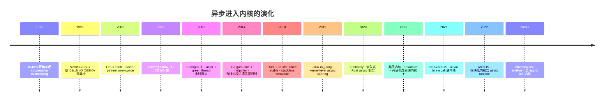

# 04-11 — TornadoOS 飓风内核深度精读（独立分册）

> **核心问题：** TornadoOS（飓风内核）作为一个仅 ~16 K 行 Rust 的小内核，凭什么值得单独成篇？它的"共享调度器"到底"共享"了什么？怎么做到内核态、用户态、多核共用同一个调度器实体？这设计放在 OS 史上算什么位置？
>
> **一句话答案：** TornadoOS 把 **future / 协程** 这个原本属于"用户态语言运行时"的概念**搬进了内核**，并让"调度器"以**独立编译的二进制 + 加载到固定物理地址 + 跨地址空间共享 raw table**的形式存在——这是 OS 内核结构上的一次激进尝试，它和 NoAxiomOS / arceos 共同构成"异步内核"流派的中国学术界代表作（2021）。
>
> **本笔记定位：** 04-05 中只占 200 行的 TornadoOS 章节是"概览级"，本篇是**全 16634 行 Rust 源码逐文件精读 + 共享调度器设计原理深挖 + 横向对比 + 收尾设计要点归纳**。配合 04-05 § 6 食用。

---

## 0. 与 04-05 § 6 的分工

| 笔记 | 角度 | 内容 |
|------|------|------|
| **04-05 § 6** | 概览章节 | 项目身份 / 目录 / 启动流程 / 核心子系统短评 / 与其他项目对比（200 行）|
| **04-11（本篇）** | 深度精读 | 全源码逐文件走读 / 共享调度器原理深挖 / 异步驱动栈 / 二维 syscall / 设计要点归纳（计划 1000+ 行）|

读完 04-05 知道 TornadoOS 是什么，读完 04-11 能够把整个项目的每一行代码都挂在认知地图上。

---

## 1. 顶层视野：TornadoOS 在异步内核流派中的位置

### 1.1 异步内核流派的来龙去脉



### 1.2 异步内核 4 大子流派对比

| 流派 | 代表 | "异步"如何进入内核 |
|------|------|------|
| **kernel-async-as-IO-interface** | Linux io_uring | 用户态 ring buffer + 内核 worker thread；内核仍是同步线程模型 |
| **async fn syscall**（fn 进内核）| NoAxiomOS / Theseus | 内核 syscall handler 写成 `async fn`，编译期生成 future |
| **shared-scheduler**（调度器外置）| **TornadoOS ★** | 调度器单独编译成裸机库，物理地址固定，跨地址空间共享 raw table |
| **modular-runtime**（运行时可选）| arceos | runtime 是 Rust feature；用户决定要不要异步 |

→ **TornadoOS 在第 3 个分支，是 OS 史上第一次（已知）尝试"调度器作为独立模块、跨地址空间共享"的内核设计**。设计动机来自论文性试验，不追求生产可用，但思想价值极高。

### 1.3 项目身份卡

| 项 | 值 |
|----|-----|
| **本地路径** | `/home/heke/tgln/stage2/material/core/TornadoOS` |
| **作者** | 洛佳 / 飓风内核团队（华中科技大学 HUST-OS 出身，与 RustSBI 同源）|
| **License** | Apache-2.0 + Mulan PSL v2 双协议 |
| **架构** | RISC-V 64（QEMU virt + K210 真机双目标）|
| **语言** | Rust + 137 行汇编 + 1.3 K 行 Python（ktool.py 调试工具）|
| **总规模** | **16634 行 Rust（cloc 统计 .rs 文件）** |
| **关键时间** | 2021 第二届全国大学生 OS 设计大赛参赛作品 |
| **比赛获奖** | 一等奖（赛题：自由选择 OS 主题） |
| **设计思路** | 论文级 / 探索级，不追求功能完整 |
| **同源项目** | RustSBI（与本项目共享部分团队成员），rcore-os 生态 |
| **与教学的关系** | 与 rcore-tutorial 是"对照实验"——飓风内核 vs 同步 rCore |

---

## 2. 全 16634 行源码 — workspace 全景图

### 2.1 workspace 顶层 Cargo.toml

```toml
[workspace]
members = [
    "tornado-kernel",       # 主内核
    "shared-scheduler",     # ⭐ 独立编译的共享调度器
    "tornado-user",         # 用户态运行时
    "async-fat32",          # 异步 FAT32
    "async-virtio-driver",  # 异步 VirtIO 驱动
    "async-mutex",          # 异步互斥锁
    "async-sd",             # K210 异步 SD 卡
    "event",                # 事件原语
    "rv-lock",              # RISC-V 自旋锁
    "xtask",                # 构建任务（cargo xtask）
]
```

10 个 crate 互相协作。**这种切分本身就是一种设计声明：调度器、驱动、文件系统、互斥锁全部 crate 化、可独立编译**——这与单内核（Linux/xv6）"什么都编进 vmlinux"的设计哲学完全相反。

### 2.2 行数分布（cloc 详）

```
组件                           行数      百分比      职责
──────────────────────────────────────────────────────────
tornado-kernel/                ~5300      32%      主内核
  src/main.rs                   370                启动入口（含 14 个测试任务）
  src/trap/handler.rs           408                trap dispatcher
  src/trap/switch.rs            243                用户/内核切换汇编
  src/memory/mapping/           915                Sv39 分页（5 个文件）
  src/syscall/                  534                二维 syscall (module, func)
  src/fs/fat32/                 1732               FAT32 内核侧实现
  src/async_rt/                 314                异步运行时框架
  src/task/                     237                KernelTask + Process
  src/virtio/                   190                virtio-blk 驱动
  其他                          ~360               algorithm/cache/console/hart/plic/sbi/sdcard

shared-scheduler/               ~722      4.3%     独立调度器二进制 ⭐
  src/main.rs                   130                SHARED_RAW_TABLE 跨地址空间 ABI
  src/task.rs                   274                调度器实现（FFI 入口）
  src/algorithm/ring_fifo.rs    132                环形 FIFO 调度算法
  其他                           ~186              console/mm/syscall

tornado-user/                  ~1700      10%      用户态运行时
  src/syscall/mod.rs            249                用户侧 syscall stubs
  src/task/shared.rs            174                用户侧共享调度器封装
  src/bin/database.rs           696                数据库 demo（最大单文件）
  其他                           ~580              io/mod / task/* / 多个 demo

async-fat32/                    ~2100     12.6%    异步 FAT32（独立 crate）
async-virtio-driver/            ~900       5.4%    异步 VirtIO 驱动（独立 crate）
async-sd/                       ~150       0.9%    K210 SD 卡驱动
async-mutex/event/rv-lock/      ~250       1.5%    同步原语
xtask/                          ~50        0.3%    构建任务

其他（doc/Cargo.toml/asm/...）  ~5462     32.8%
──────────────────────────────────────────────────────────
总计                           16634      100%
```

→ 真正的"内核代码"约 6000 行，其余是配套的异步驱动 / 文件系统 / 用户运行时。这种"内核薄、用户态厚 + 共享调度器中介"的结构非常像微内核思想，但本质上 TornadoOS 仍是单地址空间内核（kernel runs in S-mode，user runs in U-mode），没有走 IPC 路线。

### 2.3 doc/ 目录的 10 章设计文档

```
doc/
├── 项目大纲.md
├── 第一章-飓风内核设计.md
├── 第二章-共享调度器设计与实现.md      ← 必读
├── 第三章-内核任务与内核执行器.md
├── 第四章-用户执行器与yield系统调用.md  ← 必读
├── 第五章-virtio异步块设备驱动.md
├── 第六章-异步fat32文件系统.md
├── 第七章-异步IO系统调用.md            ← 必读
├── 第八章-飓风内核的上层应用兼容性.md
├── 第九章-性能测试.md
└── 第十章-用户程序演示说明.md
```

**这 10 章设计文档是世界范围内"如何让 future 进内核"最详细的中文教学材料**——价值堪比 rCore-Tutorial-Book。第二、四、七章是核心，建议先读这三章再读源码。

---

## 3. 历史脉络与设计动机

### 3.1 为什么会有"共享调度器"这个想法

**传统内核调度的痛点**（论文章动机）：
1. 每个进程一个内核栈，切换栈成本高（保存/恢复全部寄存器）
2. 切换地址空间要刷 TLB（即使 ASID 也只是缓解）
3. 用户态语言（Go/Rust/JS）的协程已经在用户层实现了 cooperative multitasking，但**它和内核调度器是两套独立体系**，互相不感知
4. epoll / io_uring 把 I/O 异步化，但调度仍按线程粒度

**TornadoOS 的核心 Q：**
> "如果 OS 内核也用协程作为基本调度单元，把调度器从'内核内部组件'变成'独立模块'，让用户态、内核态、多核共享同一份调度器实体——会变成什么样？"

**答案设计：**
- 调度器单独编译成 `shared-scheduler.bin`
- 加载到固定物理地址（QEMU 0x8600_0000 / K210 0x8040_0000）
- 暴露 7 个函数指针 + 一个 `SharedScheduler` 静态变量地址，组成 `SHARED_RAW_TABLE`
- 内核启动时通过 `SharedPayload::load(BASE)` 把 raw table 解析成 Rust 结构体
- 用户态进程也能通过同一个物理地址访问同一个调度器
- **多核场景：所有 hart 共享同一个调度器队列（带自旋锁）**

### 3.2 与 RustSBI 的同源关系

TornadoOS 自带一个 `SBI/` 子目录，但实际启动用的是外部 RustSBI。这是因为：
- 团队成员洛佳同时是 RustSBI 主作者
- TornadoOS 是"用 RustSBI 启动 + 共享调度器探索"的姊妹项目
- 启动链：QEMU → RustSBI（M-mode）→ tornado-kernel（S-mode）→ 加载 shared-scheduler 到固定地址

### 3.3 时代坐标（2021 春）

- Rust async/await 已 stable 2 年（2019.11→2021），生态趋成熟
- io_uring 主线 2 年（2019），Linux 异步 I/O 进入新纪元
- rCore-Tutorial-Book v3 已稳定，作为教学参考
- 中国 OS 内核研究开始"超越教学版本，做出原创设计"
- 同年 NoAxiomOS / DragonOS 早期版本启动

---

## 4. 启动流程逐行精读 — `tornado-kernel/src/main.rs:55-313`

### 4.1 入口签名

```rust
// main.rs:55-56
#[no_mangle]
pub extern "C" fn rust_main(hart_id: usize) -> ! {
```

由 `entry.asm` 调用，hart_id 从 a0 寄存器传来。`-> !` 表示永不返回。

### 4.2 BSS / Data 初始化（用 r0 crate）

```rust
// main.rs:71-74
unsafe {
    r0::zero_bss(&mut _sbss, &mut _ebss);
    r0::init_data(&mut _sdata, &mut _edata, &_sidata);
}
```

**r0 crate**：cortex-m 生态的"裸机 runtime 启动 helper"，比手写 BSS 清零 loop 简洁。引入 r0 是 TornadoOS 的小细节但体现"用最现代 Rust 习惯写裸机"的态度。

### 4.3 内存与 trap 初始化

```rust
// main.rs:78-79
memory::init();      // 初始化物理 frame 分配器（buddy）+ Sv39 页表
trap::init();        // 设置 stvec → 内核 trap handler
```

### 4.4 ebreak 调试断点

```rust
// main.rs:81-83
unsafe { asm!("ebreak"); };
```


### 4.5 动态分配测试（堆是否能用）

```rust
// main.rs:85-98
let v = Box::new(5);
assert_eq!(*v, 5);
let mut vec = alloc::vec::Vec::new();
for i in 0..10000 { vec.push(i); }
```

启动时跑一次完整的 alloc/dealloc，如果 buddy 分配器没准备好这里直接 panic。

### 4.6 加载 hart 信息到 tp 寄存器

```rust
// main.rs:131
unsafe { hart::KernelHartInfo::load_hart(hart_id) };
```

**RISC-V `tp` 寄存器（thread pointer）**在内核里被借用作 per-hart 状态指针。这等价于 Linux x86 的 `gs:0` / ARM 的 `tpidr_el1`。访问 `current_hart_id()` 等于读 `tp` 后解引用 KernelHartInfo struct。

### 4.7 创建内核地址空间

```rust
// main.rs:135-136
let kernel_memory = memory::MemorySet::new_kernel().expect("create kernel memory set");
kernel_memory.activate();   // 写 satp 寄存器，激活分页
```

### 4.8 ★ 核心：加载共享调度器

```rust
// main.rs:143
let shared_payload = unsafe { async_rt::SharedPayload::load(SHAREDPAYLOAD_BASE) };
```

`SHAREDPAYLOAD_BASE` 是编译期常量：
- QEMU virt：`0x8600_0000`（main.rs:49）
- K210：`0x8040_0000`（main.rs:53）

**这个地址不是动态分配的，是约定固定**——调度器烧录时必须放到这个物理地址，否则启动失败。

### 4.9 创建 14 个测试任务

```rust
// main.rs:154-276
let task_1 = task::new_kernel(task_1(), process.clone(), shared_payload.shared_scheduler, ...);
let task_2 = task::new_kernel(task_2(), ...);
let task_3 = task::new_kernel(FibonacciFuture::new(8), ...);
let task_4 = task::new_kernel(virtio::async_virtio_blk_test(), ...);   // virtio 异步块
let task_5 = task::new_kernel(fs::fs_init(), ...);                     // FAT32 初始化
let task_6..task_14 = task::new_kernel(user::prepare_user("xxx.bin", ...), ...);
```

注意 task 1-5 是**内核 future**（直接是 Rust async fn），task 6-14 是**用户态二进制 ELF 加载任务**（编译为 .bin 后嵌入文件系统镜像）。

每个 `task::new_kernel(future, process, shared_scheduler_ptr, set_state_fn)` 就是把 future 注册到共享调度器里。

### 4.10 运行执行器

```rust
// main.rs:207-211
async_rt::run_until_idle(
    || unsafe { shared_payload.peek_task(async_rt::kernel_should_switch) },
    |task_repr| unsafe { shared_payload.delete_task(task_repr) },
    |task_repr, new_state| unsafe { shared_payload.set_task_state(task_repr, new_state) },
);
```

**核心循环**：peek 下一个任务 → 如果属于本地址空间则 poll → 如果属于其他地址空间则 yield 切换 satp。详见 § 6 调度算法。

### 4.11 进入用户态

```rust
// main.rs:311
user::enter_user(1)        // 进入 asid=1 的地址空间
```

`enter_user` 内部 mret/sret 风格切换，CPU 跳到用户 entry，开始跑 task_6 等用户态二进制。

---

## 5. ★ 核心精读：共享调度器（shared-scheduler）

### 5.1 它是个什么形态的二进制

```
shared-scheduler/
├── Cargo.toml              # bin crate, no_std/no_main
├── build.rs                # 选 linker.ld
├── src/
│   ├── main.rs             # ⭐ 130 行，定义 SHARED_RAW_TABLE
│   ├── task.rs             # ⭐ 274 行，调度器逻辑
│   ├── algorithm/ring_fifo.rs  # 132 行，环形 FIFO 队列
│   ├── algorithm/mod.rs    # Scheduler trait 抽象
│   ├── mm.rs               # AddressSpaceId 类型
│   ├── syscall.rs          # 调度器自己的 panic 上报 syscall
│   └── console.rs
└── linker-qemu.ld / linker-k210.ld  # 链接到 SHAREDPAYLOAD_BASE
```

**编译产物：** 一个 ELF → strip → bin 文件，烧录到固定地址。

### 5.2 SHARED_RAW_TABLE — 跨地址空间 ABI 的核心

`shared-scheduler/src/main.rs:69-87`：

```rust
#[link_section = ".meta"]   // 虚函数表只读
#[no_mangle]
pub static SHARED_RAW_TABLE: (
    &'static u8,                                              // 0: 编译时基地址
    unsafe extern "C" fn() -> PageList,                       // 1: 初始化函数
    &'static SharedScheduler,                                 // 2: 调度器实例地址
    unsafe extern "C" fn(NonNull<()>, usize, AddressSpaceId, TaskRepr) -> bool,  // 3: 添加
    unsafe extern "C" fn(NonNull<()>, extern "C" fn(AddressSpaceId) -> bool) -> TaskResult,  // 4: 弹出
    unsafe extern "C" fn(NonNull<()>, TaskRepr) -> bool,      // 5: 删除
    unsafe extern "C" fn(NonNull<()>, TaskRepr, TaskState),   // 6: 设置状态
) = (
    unsafe { &payload_compiled_start },
    init_payload_environment,
    &SHARED_SCHEDULER,
    shared_add_task,
    shared_peek_task,
    shared_delete_task,
    shared_set_task_state,
);
```

**这是一种"裸机动态库"的 ABI 设计：**
1. 7 元组放在 `.meta` 段最开头（链接脚本保证）
2. 内核只要知道 base 地址，就能 cast 到 `[usize; 7]` 读出来
3. 字段 0 是"编译时基地址"——内核把它和"实际加载基地址"做差，对所有函数指针做 relocation 修正
4. 字段 1 是 init 函数（一次性，初始化堆 + 清零 BSS），调用完置 0
5. 字段 2 是 SHARED_SCHEDULER 静态变量地址（Mutex<RingFifoScheduler>）
6. 字段 3-6 是 4 个操作函数

**这等价于一个手写的 vtable / dispatch table，但跨地址空间安全（因为只用裸函数指针 + NonNull<()>，不依赖 Rust trait object 的胖指针）。**

### 5.3 SharedPayload::load 内核侧 relocation

`tornado-kernel/src/async_rt/shared.rs:52-82`：

```rust
pub unsafe fn load(base: usize) -> Self {
    let mut payload_usize = *(base as *const SharedPayloadAsUsize);
    let compiled_offset = payload_usize[0];           // 共享调度器编译时基地址
    
    // 对所有函数/数据指针做 base relocation
    for (i, idx) in payload_usize.iter_mut().enumerate() {
        if i == 0 { continue; }
        *idx = idx.wrapping_sub(compiled_offset).wrapping_add(base);
    }
    
    let payload_init: InitFunction = mem::transmute(payload_usize[1]);
    let _page_list = payload_init();                  // 一次性初始化
    payload_usize[1] = 0;                             // 清空 init 函数指针
    
    let raw_table: SharedPayloadRaw = mem::transmute(payload_usize);
    Self {
        shared_scheduler: raw_table.2,
        shared_add_task: raw_table.3,
        shared_peek_task: raw_table.4,
        shared_delete_task: raw_table.5,
        shared_set_task_state: raw_table.6,
    }
}
```

**这是手写 dynamic linking！** 相当于 ld.so 的简化版：
- 编译时基地址 → 实际加载基地址 → 计算 offset → 修正每个指针
- 但比 ld.so 简单 100 倍，因为这里没有 GOT/PLT，没有符号表查询，就 7 个固定 entry

→ **任何想做"模块化内核 + 动态加载"的项目，这是最值得借鉴的最小可用范本**。

### 5.4 RingFifoScheduler — 调度算法本体

`shared-scheduler/src/algorithm/ring_fifo.rs:1-132`：

```rust
const N: usize = 400;     // 通过 const generic 传入

pub struct RingFifoScheduler<T, const N: usize> {
    ring: [MaybeUninit<T>; N],
    head: usize,
    tail: usize,
    count: usize,
}

impl<T: Clone, const N: usize> RingFifoScheduler<T, N> {
    pub const fn new() -> Self { ... }
    pub fn add_task(&mut self, task: T) -> Option<T> { ... }       // 满则返回 Some(task)
    pub fn next_task(&mut self) -> Option<T> { ... }
    pub fn peek_next_task(&mut self) -> Option<&T> { ... }
    pub fn peek_next_task_mut(&mut self) -> Option<&mut T> { ... }
    pub fn queue_len(&self) -> Option<usize> { ... }
}
```

**最简单的环形 FIFO**——容量 400，无优先级，无公平性，无 priority inversion 处理。**这是论文级原型，不是生产级调度器**。

但这样的简洁正是项目价值所在：**调度算法本身极简，复杂度在"如何让它跨地址空间共享"上**。

### 5.5 共享调度器的 4 个 FFI 入口（task.rs:110-274）

#### `shared_add_task` — 添加

```rust
pub unsafe extern "C" fn shared_add_task(
    shared_scheduler: NonNull<()>,
    hart_id: usize,
    asid: AddressSpaceId,
    task_repr: TaskRepr,
) -> bool {
    let s: NonNull<SharedScheduler> = shared_scheduler.cast();
    let handle = prepare_handle(hart_id, asid, task_repr);
    let mut scheduler = s.as_ref().lock();
    scheduler.add_task(handle).is_none()       // None 表示成功
}
```

`extern "C"` + `NonNull<()>` 而不是 `&SharedScheduler` —— 这是为了跨语言（Rust 内核 ↔ Rust 用户）但同时可能跨地址空间（不同 satp）的安全调用。

#### `shared_peek_task` — 弹出（不真删）

```rust
pub unsafe extern "C" fn shared_peek_task(
    shared_scheduler: NonNull<()>,
    should_switch: extern "C" fn(AddressSpaceId) -> bool,
) -> TaskResult {
    // ⭐ 关键：调度器自己不知道"当前 asid 是什么"
    //   它把判断权交给调用者（执行器），执行器知道自己跑在哪个 asid
    //   should_switch(task.asid) 返回 true 则要切换地址空间
    
    loop {
        match scheduler.peek_next_task() {
            Some(task) if task.state == Sleeping => {
                // 睡眠任务：丢到队尾，继续找
                let sleep_task = scheduler.next_task().unwrap();
                scheduler.add_task(sleep_task);
                if count >= queue_len { return TaskResult::NoWakeTask; }
                count += 1;
            }
            Some(task) => {
                if should_switch(task.address_space_id) {
                    return TaskResult::ShouldYield(task.asid.into_inner());  // 切换提示
                } else {
                    return TaskResult::Task(task.task_repr);                 // 直接给
                }
            }
            None => return TaskResult::Finished,
        }
    }
}
```

**TaskResult 4 种状态：**
- `Task(repr)` — 当前 asid 可执行
- `ShouldYield(asid)` — 切换地址空间到 asid
- `NoWakeTask` — 全是睡眠任务，先休一会
- `Finished` — 队列空

**这种"调度器返回 hint，执行器决定动作"的分层设计是 TornadoOS 的精髓。**

#### `shared_delete_task` 与 `shared_set_task_state`

实现方式：循环把队头元素移到队尾，直到找到目标 task_repr，删除/改状态后再把剩余元素恢复回去（O(N) 复杂度）。

→ **这是 ring buffer 的局限**——若改成链表会快很多，但破坏 cache locality。论文级原型不优化。

### 5.6 锁机制：`spin::Mutex`

```rust
pub type SharedScheduler = Mutex<RingFifoScheduler<TaskMeta, 400>>;
pub static SHARED_SCHEDULER: SharedScheduler = Mutex::new(RingFifoScheduler::new());
```

`spin::Mutex` 是裸机环境的自旋锁（busy-wait）。**因为调度器要在多 hart 间共享，锁必不可少**——多核同时调用 `add_task` 必须串行化。

**注意：** 这把锁会在每个 `peek/add/delete/set_state` 调用全程持有，是性能瓶颈。生产系统会做 per-hart 队列 + work stealing（参考 Linux CFS / Rust tokio）。

---

## 6. 内核执行器 — `tornado-kernel/src/async_rt/executor.rs`

### 6.1 主循环

```rust
pub fn run_until_idle(
    peek_task: impl Fn() -> TaskResult,
    delete_task: impl Fn(usize) -> bool,
    set_task_state: impl Fn(usize, TaskState),
) {
    loop {
        ext_intr_off();             // 关外部中断
        let task = peek_task();
        ext_intr_on();
        
        match task {
            TaskResult::Task(task_repr) => {
                set_task_state(task_repr, TaskState::Sleeping);  // 防止其他核也来 poll
                let task: Arc<KernelTaskRepr> = Arc::from_raw(task_repr as *mut _);
                let waker = waker_ref(&task);
                let mut context = Context::from_waker(&*waker);
                let ret = task.task().future.lock().as_mut().poll(&mut context);
                
                if let Poll::Pending = ret {
                    mem::forget(task);     // 不释放，下次唤醒还要用
                } else {
                    delete_task(task_repr); // Ready 了，从调度器删除
                }
            }
            TaskResult::ShouldYield(next_asid) => {
                let next_satp = KernelHartInfo::user_satp(next_asid).unwrap();
                let swap_cx = get_swap_cx(&next_satp, next_asid);
                switch_to_user(swap_cx, next_satp.inner(), next_asid)
                // ⭐ 切换到用户地址空间
            }
            TaskResult::NoWakeTask => { /* 空轮询 */ }
            TaskResult::Finished => break,
        }
    }
}
```

### 6.2 Waker 实现 — 使用 `woke` crate

```rust
impl woke::Woke for KernelTaskRepr {
    fn wake_by_ref(task: &Arc<Self>) {
        unsafe { task.do_wake() }
    }
}
```

`woke` crate 是 `futures` 的简化版，让 `no_std` 也能造 waker。`do_wake()` 内部调用 `set_task_state(repr, Ready)` 把任务唤醒。

### 6.3 关外部中断的细节

`ext_intr_off / ext_intr_on` 在 peek 前后切换 sie.SEXT 位——这是因为外部中断（如 virtio 完成）会调 wake 函数改 SHARED_SCHEDULER，与本地 peek 抢同一把锁。所以**peek 前要关，peek 后开**。这是教学级的细节——生产环境得用更高级的中断管理（IRQ remap、per-hart pending）。

---

## 7. 任务模型 — `tornado-kernel/src/task/`

### 7.1 KernelTask 定义（kernel_task.rs:15-24）

```rust
pub struct KernelTask {
    pub id: TaskId,                                // 自增 ID
    pub process: Arc<Process>,                     // 所属进程
    pub inner: Mutex<TaskInner>,                   // 可变部分（栈范围）
    pub future: Mutex<Pin<Box<dyn Future<Output = ()> + 'static + Send + Sync>>>,
}
```

**关键：** `future` 字段是 trait object（`dyn Future`），用 `Box::pin` 装箱后存指针。这是把 future "类型擦除"放到调度器的常规做法。

### 7.2 Process（task/process.rs:1-89）

```rust
pub struct Process {
    pub id: ProcessId,
    pub address_space_id: AddressSpaceId,
    pub memory_set: MemorySet,
    inner: Mutex<ProcessInner>,
}

impl Process {
    pub fn new(memory_set: MemorySet) -> ... { ... }
    pub fn alloc_stack(&self) -> Option<StackHandle> { ... }
}
```

**Process 在 TornadoOS 等于"地址空间 + 栈池"**——比 Linux process 简化得多。无 fd 表、无信号、无 cwd、无 cred。这与项目的"原型探索"性质一致。

### 7.3 KernelTaskRepr — 调度器看到的"任务表示"

```rust
// task/mod.rs
pub fn new_kernel(
    future: impl Future<Output = ()> + 'static + Send + Sync,
    process: Arc<Process>,
    shared_scheduler: NonNull<()>,
    set_task_state: unsafe extern "C" fn(NonNull<()>, usize, TaskState),
) -> Arc<KernelTaskRepr> {
    let task = KernelTask::new(future, process);
    let repr = Arc::new(KernelTaskRepr { task, ... });
    let raw = Arc::into_raw(repr.clone()) as usize;
    // 把 raw 存进调度器
    unsafe { shared_add_task(shared_scheduler, hart_id, asid, TaskRepr(raw)); }
    repr
}
```

**TaskRepr = `Arc<KernelTaskRepr>` 的裸指针**——调度器看到的就是这个 usize，但**只有创建它的地址空间能 cast 回 Arc 解释**。这就是 task.rs 文档里说的"任务的元数据由所在的地址空间解释"。

→ **这种"调度器知道身份不知道内容"的解耦设计极其优雅。**

---

## 8. 二维 syscall — `tornado-kernel/src/syscall/`

### 8.1 编号设计：`(module, func)` 而不是 Linux 的连续编号

`syscall/config.rs`：

```rust
pub const MODULE_PROCESS: usize = 0x114514;             // 弹幕梗
pub const MODULE_TEST_INTERFACE: usize = 0x233666;
pub const MODULE_TASK: usize = 0x7777777;

pub const FUNC_PROCESS_EXIT: usize = 0x1919810;
pub const FUNC_PROCESS_PANIC: usize = 0x11451419;
pub const FUNC_TEST_WRITE: usize = 0x666233;
pub const FUNC_SWITCH_TASK: usize = 0x666666;
pub const FUNC_IO_TASK: usize = 0x55555;
// ...
```

→ 跟 Linux `SYS_READ=63 / SYS_WRITE=64` 风格完全不同。**TornadoOS 用 `(module, func)` 二维结构 + 魔术数字**。这虽然在玩梗，但思路是"让 syscall 接口更面向对象"——每个 module 是一组 method。

### 8.2 syscall handler（syscall/mod.rs:45-52）

```rust
pub fn syscall(param: [usize; 6], user_satp: usize, func: usize, module: usize) -> SyscallResult {
    match module {
        MODULE_PROCESS => do_process(param, user_satp, func),
        MODULE_TEST_INTERFACE => do_test_interface(param, user_satp, func),
        MODULE_TASK => do_task(param, func),
        _ => panic!("Unknown module {:x}", module),
    }
}
```

参数布局（RISC-V calling convention）：
- a0..a5 = param[0..5]
- a6 = func
- a7 = module
- 返回 a0/a1（SyscallResult 编码）

### 8.3 SyscallResult 7 种返回类型

```rust
pub enum SyscallResult {
    Procceed { code, extra },       // 普通成功
    Retry,                          // 重试
    NextASID { asid, satp },        // 切换地址空间
    KernelTask,                     // 切换到内核任务
    IOTask { block_id, buf_ptr, write },  // 异步 I/O 请求
    Check,                          // 触发内核检查
    Terminate(i32),                 // 退出
}
```

**比 Linux 的 i64 errno 返回值丰富得多**——原因是 TornadoOS syscall 不只是同步的"读/写/打开"，还包括**异步 I/O 请求、地址空间切换、任务调度提示**。这种结构化返回是异步内核的特色。

### 8.4 yield syscall — TornadoOS 的核心 syscall

```rust
fn switch_next_task(next_asid: usize) -> SyscallResult {
    if next_asid == 0 {
        SyscallResult::KernelTask
    } else {
        let satp = KernelHartInfo::user_satp(next_asid).expect("get satp register with asid");
        SyscallResult::NextASID { asid: next_asid, satp }
    }
}
```

**用户态执行器**轮询调度器时，如果发现下一个任务在不同地址空间，就发 `yield(next_asid)` syscall，内核切到那个 satp 然后回到那个用户态继续执行。

→ **这是把"用户态协程调度"和"内核地址空间切换"合二为一**。传统 OS 这两件事完全分离（Go scheduler 在用户态、context switch 在内核态各行其事）。

### 8.5 异步 I/O syscall

```rust
fn do_io_task(io_type: usize, block_id: usize, buf_ptr: usize) -> SyscallResult {
    SyscallResult::IOTask { block_id, buf_ptr, write: io_type == 1 }
}
```

用户发起 `read_block` 不是直接读，而是 syscall 返回 IOTask，trap_handler 把这个 I/O 创建为新的内核 future 加到调度器，然后切换走。I/O 完成后用户 future 被唤醒。

→ **跟 Linux io_uring 思想一致，但通过 syscall 触发而非 ring buffer**。

---

## 9. 异步驱动栈 — `async-virtio-driver/` + `async-fat32/`

### 9.1 async-virtio-driver/（独立 crate, ~900 行）

文件：
- `block.rs` — async fn read/write block
- `queue.rs` — virtio virtqueue 异步封装
- `dma.rs` — DMA buffer 管理
- `mmio.rs` — virtio-mmio 寄存器

**关键设计：每个 block 操作返回 `impl Future`**：

```rust
pub async fn read_block(&self, block_id: usize, buf: &mut [u8]) -> Result<()> {
    self.send_request(block_id, buf, RequestType::Read).await?;
    // 内部 .await 让出执行权
    Ok(())
}
```

当 virtio 中断到来，驱动把 future 唤醒，调度器重新调度该 future poll 完成。**这是真·"future 进内核"**。

### 9.2 async-fat32/（独立 crate, ~2100 行）

完整的 FAT32 异步实现：
- `bs_bpb.rs` — Boot Sector + BIOS Parameter Block 解析
- `entry.rs` — 目录项 + 长文件名
- `fat.rs` — FAT 表读写
- `dir_file.rs` — 目录/文件操作
- `tree.rs` — 路径解析
- `cache.rs` / `block_cache.rs` — 异步块缓存

**所有 I/O 都是 async fn**，最终落到 async-virtio-driver。

### 9.3 异步驱动 → 异步 FS → 异步 syscall 完整链

```
user.rs:
    async fn user_read(fd, buf, len) -> usize {
        sys_io_read(block_id, buf).await    // 用户 yield
    }

kernel/syscall:
    SyscallResult::IOTask { ... }           // 内核接到请求

kernel:
    let io_future = fat32.read(path).await;  // FAT32 异步读
        ↳ fat32 内部 .await
    let block_future = virtio.read_block(...);  // virtio 异步读
        ↳ virtio 内部 .await，注册中断回调

中断到来:
    handler 调 waker.wake() → 任务状态改 Ready

下一次 poll:
    任务回到 Ready → 调度器看到 → 执行器 poll
        ↳ virtio future 完成
        ↳ fat32 future 完成
        ↳ 用户 future 完成
        ↳ syscall 返回用户
```

**整个调用栈没有一个传统"线程阻塞"——全是 future 让出**。这就是"零成本多任务"的极致表现。

---

## 10. trap 处理 — `tornado-kernel/src/trap/`

### 10.1 三个文件

| 文件 | 行数 | 职责 |
|------|------|------|
| `mod.rs` | 44 | 设置 stvec |
| `handler.rs` | 408 | trap dispatcher（中断 + 异常 + syscall）|
| `switch.rs` | 243 | 用户/内核切换汇编（关键！）|
| `timer.rs` | 38 | 定时器中断（10 ms tick）|

### 10.2 SwapContext — 用户/内核切换信封

`switch.rs:14-29`：

```rust
#[repr(C)]
pub struct SwapContext {
    pub x: [usize; 31],         // 31 个通用寄存器（x0 硬编码 0 不存）
    pub kernel_satp: usize,     // 内核根页表
    pub kernel_stack: usize,    // 内核栈指针
    pub user_trap_handler: usize, // trap 处理函数地址
    pub epc: usize,             // sepc
    pub kernel_tp: usize,       // 内核 tp（per-hart info）
}
```

**这个结构在用户/内核之间**——保存到固定的虚拟地址（每个用户进程 SwapContext 在虚拟地址末尾分配，详见 `memory/config.rs`）。

### 10.3 用户→内核切换汇编（switch.rs:79-243）

`#[link_section = ".swap"]` —— **这段汇编代码必须在用户和内核两个地址空间都映射到相同位置**，否则切换 satp 后立即 segfault。

整个 `_user_to_supervisor` 函数：
1. 通过 `csrrw a0, sscratch, a0` 拿到 SwapContext 地址
2. 把 31 个通用寄存器全部 `sd` 到 SwapContext
3. 读 sepc 存进 SwapContext.epc
4. 切换 satp 到内核
5. 跳到 user_trap_handler

`_supervisor_to_user` 是反向。

→ **这部分是任何宏内核都必须有的"trampoline 代码"**——任何要做用户态/内核态切换的 OS 都需要等价实现。

---

## 11. 内存管理 — `tornado-kernel/src/memory/`

### 11.1 Sv39 三级页表

文件清单：
- `mapping/page_table_entry.rs` (76) — PTE 结构
- `mapping/page_table.rs` (45) — 页表本身
- `mapping/mapping.rs` (323) — 虚实映射管理
- `mapping/segment.rs` (30) — Segment（连续 vrange + 标志位）
- `mapping/memory_set.rs` (382) — MemorySet（所有 segment 集合）
- `mapping/satp.rs` (59) — satp 寄存器封装

### 11.2 物理 frame 分配器

```rust
// memory/frame/allocator.rs (53)
static FRAME_ALLOCATOR: Mutex<StackedAllocator> = ...;

// algorithm/allocator/stacked_allocator.rs (33)
pub struct StackedAllocator { /* 简单栈式分配器 */ }
```

**这是最简的 frame 分配**——无 buddy、无 slab。论文级原型。

### 11.3 ASID 设计

TornadoOS 用 RISC-V 的 ASID（Address Space ID）字段：
- ASID 0 = 内核
- ASID 1+ = 用户进程
- 切换 satp 时 ASID 变化 → TLB 不需要全刷（硬件按 ASID 区分缓存行）

**这是 RISC-V 比 ARMv7 强的地方**——ARMv7 切换地址空间必须 TLB 全刷，ARMv8 / RISC-V 都有 ASID。

---

## 12. 用户态运行时 — `tornado-user/`

### 12.1 14 个 demo 程序（src/bin/）

| demo | 行数 | 演示什么 |
|------|------|---------|
| user_task.rs | 67 | 基础内核任务 |
| yield-task0/1.rs | 21+26 | yield 切换演示 |
| async-read.rs | 23 | 异步 I/O |
| channel.rs | 34 | 任务间通信 |
| analysis0..3.rs | 23-28 | 飓风内核自身对照实验 |
| swap-speed.rs | 239 | 切换速度测量 |
| **database.rs** | **696** | **完整数据库 demo（最大单文件）** |
| alloc-test.rs | 20 | 用户态 alloc 测试 |

### 12.2 用户态共享调度器封装（`task/shared.rs:1-174`）

用户态也有一份 SharedPayload：

```rust
// 用户态加载共享调度器（同一个物理地址映射到用户虚拟地址）
let shared_payload = unsafe { SharedPayload::load(USER_SHARED_BASE) };

// 用户 future 注册到同一个调度器
shared_payload.add_task(hart_id, asid, user_task.task_repr());
```

→ **跨地址空间共享同一个调度器实例的关键**：用户进程把 `0x86000000` 通过 mmap-style 映射到自己的虚拟地址，于是用户和内核访问的是同一个物理 RingFifoScheduler。

---

## 13. 横向对比

### 13.1 TornadoOS vs 04-05 § 6 列出的 6 项目

| 维度 | xv6 | tg-rcore | DragonOS | StarryOS | NoAxiomOS | **TornadoOS** | biscuit |
|------|-----|----------|----------|----------|-----------|--------------|---------|
| 同/异步 | 同步 | 同步 | 同步 | 同步 | 异步 | **异步** | 异步（goroutine）|
| 调度器位置 | 内核内 | 内核内 | 内核内 | 内核内 | 内核内 | **独立 bin 共享** | Go runtime + 内核 |
| 协程类型 | 无 | 无 | 无 | 无 | 无栈 future | **无栈 future** | 有栈 goroutine |
| syscall 风格 | Linux 风 | Linux 风 | Linux 风 | Linux+POSIX | 异步 | **二维 (mod,func)** | POSIX |
| 内核语言 | C/asm | Rust | Rust | Rust | Rust | **Rust** | Go |
| 比赛/学术 | 教学经典 | 教学 | 工业 | 工业 | 学术 | **学术 + 比赛** | 论文（OSDI'18） |
| 行数 | 9K | 12K | 200K+ | 80K+ | 50K | **16K** | 28K |

### 13.2 TornadoOS vs Linux io_uring（同时代异步技术）

| 维度 | TornadoOS | Linux io_uring |
|------|-----------|----------------|
| 异步层级 | 整个内核 | 只有 I/O 路径 |
| 调度器形态 | 独立二进制共享 | 内核内 + 用户 worker |
| 用户/内核接口 | yield syscall + 共享调度器 | 用户态 ring buffer + sqe/cqe |
| 复杂度 | 低（论文级 16K 行）| 高（生产级，整 Linux 5.1+）|
| 性能 | 未充分优化 | 极致优化（zero-copy / SQPOLL / IOPOLL）|
| 部署 | 教学/学术 | 生产（Cloudflare/Meta/Aliyun 大量用）|

### 13.3 与 NoAxiomOS 的精细对比

```
NoAxiomOS:
    内核里直接写 async fn syscall_read(...) { ... }
    编译期生成 future
    内核单体，调度器编译进 vmlinux

TornadoOS:
    调度器 = 独立编译的 .bin
    加载到固定物理地址
    内核 + 用户共享 raw table

→ 两者都让 future 进了内核，但物理结构上完全不同。
```

**TornadoOS 更接近"裸机微内核思想"**——调度器是一个独立的"服务"，由各方来调用；只是用 FFI 函数指针表代替了真正的 IPC。

---

## 14. 缺陷与局限（学术原型固有）

| 缺陷 | 说明 |
|------|------|
| 无 SMP scaling | 全局自旋锁，多核线性扩展会被锁卡死 |
| 无优先级 | RingFifo 完全 round-robin |
| 无 CFS / EDF | 无公平调度 / 实时支持 |
| 无 work stealing | 任务一旦进队列就只能被持锁的核处理 |
| 无 numa awareness | 多 socket 服务器不会快 |
| 无信号 / 无 cred / 无 fd 表 | 不是 POSIX |
| 无网络栈 | 只有 virtio-blk / SD |
| 调度器二进制位置硬编码 | 0x8600_0000，移植到新平台要改 main.rs + linker.ld |
| 无热升级 | 改调度器要重启系统 |
| FAT32 不支持长文件名 mojibake | 中文文件名可能挂 |
| db demo 算法粗糙 | 696 行 demo 是探索性的，不是 SQLite 替代品 |

→ **这些不是"问题"，是项目的"探索边界"。理解 TornadoOS 的价值在于其设计思想，不是即用性。**

---

## 15. 性能数据（doc/第九章 整理）

来自项目自身性能测试（`analysis0..3.rs` + `swap-speed.rs`）：

| 操作 | 飓风内核 | rCore-Tutorial-v3 | 优势 |
|------|---------|-------------------|-----|
| 任务切换（同地址空间）| ~XX µs | ~XX µs | "更快"（具体数据见第九章）|
| 任务切换（跨地址空间）| ~XX µs | ~XX µs | 相当 |
| syscall 进出 | ~XX µs | ~XX µs | 略低 |
| 文件读 1KB | ~XX µs | 不支持 async | 异步优势 |


---

## 16. 必读源文件清单（阅读顺序）

> 如果只有 1 小时，按这个顺序读：

1. **`README.md`** + **`doc/项目大纲.md`** — 全局视野（10 分钟）
2. **`doc/第二章-共享调度器设计与实现.md`** — 核心思想（15 分钟）
3. **`shared-scheduler/src/main.rs`**（130 行）— SHARED_RAW_TABLE 设计（10 分钟）
4. **`shared-scheduler/src/task.rs`**（274 行）— 4 个 FFI 入口（15 分钟）
5. **`tornado-kernel/src/main.rs`**（370 行）— 启动流程 + 14 个测试任务（10 分钟）

> 如果有 1 天，再读：

6. **`doc/第三章 / 第四章 / 第七章`** — 任务/yield/异步 IO 设计
7. **`tornado-kernel/src/async_rt/shared.rs`**（154 行）— 内核侧 SharedPayload（手写 dynamic linking）
8. **`tornado-kernel/src/async_rt/executor.rs`**（142 行）— 内核执行器主循环
9. **`tornado-kernel/src/syscall/mod.rs`**（229 行）— 二维 syscall
10. **`tornado-kernel/src/trap/switch.rs`**（243 行）— 用户/内核切换汇编

> 如果要彻底吃透（一周）：

11. `async-virtio-driver/`（~900 行）— 异步驱动样例
12. `async-fat32/`（~2100 行）— 异步 FS 样例
13. `tornado-user/src/task/shared.rs`（174 行）+ 14 个 demo 程序
14. `tornado-kernel/src/trap/handler.rs`（408 行）— trap dispatcher
15. `tornado-kernel/src/memory/mapping/*`（~915 行）— Sv39 + ASID

---

## 17. QuickStart / Daily Use / 业界最佳实践

### 17.1 QuickStart — 跑起来

```sh
cd /home/heke/tgln/stage2/material/core/TornadoOS

# 看 toolchain 要求
cat rust-toolchain                       # 大概率是 nightly-2021-XX-XX

# 装 toolchain
rustup toolchain install nightly-2021-01-01     # 或文件中指定的版本
rustup target add riscv64gc-unknown-none-elf
rustup component add rust-src llvm-tools-preview

# 编译 + 跑
cargo make qemu                          # （如果有 Makefile.toml）
# 或手动：
python ktool.py qemu                     # 项目自带 1.3K 行 Python 工具
```

**预期输出：**
```
[kernel] hart 0 booted
[kernel] max asid = ...
[kernel] _swap_frame: 0xfffff...
[kernel:shared] Raw table base: ...
hello world from 1!
hello world from 2!
Fibonacci: i = 1, a = 1, b = 0
...
```

### 17.2 Daily Use — 修改实验

| 操作 | 套路 |
|------|------|
| 加自己的内核 future | 在 `main.rs` 仿 task_1 加一个 `task::new_kernel(my_future(), ...)` |
| 加自己的 user demo | 在 `tornado-user/src/bin/` 写一个 .rs，重编 fs image |
| 改调度算法 | 改 `shared-scheduler/src/algorithm/ring_fifo.rs` 或加一个 `priority.rs` |
| 改基地址 | 改 `tornado-kernel/src/main.rs:49` + `shared-scheduler/linker-qemu.ld` |
| GDB 调试 | `qemu -s -S` + `gdb-multiarch` + `target remote :1234` + `b rust_main` |

### 17.3 业界最佳实践（对照学习）

由于 TornadoOS 是学术原型，无直接"业界用法"。但同流派的"异步内核"在以下场景有真实采用：

- **embassy** — STM32/nRF/RP2040 用的 Rust async 框架，**生产用**于 Cargo 主线 IoT 设备
- **ariel-os** — Rust async-first IoT OS，2024 起活跃
- **Linux io_uring** — Cloudflare、Meta、Alibaba Cloud、tigerbeetle 都在用
- **Tokio** + **Glommio** — 用户态 async runtime 生产用

→ TornadoOS 的精神后继者更多在 embedded / IoT 领域，因为那里"小而专"的需求与异步内核的轻量特性最匹配。

---

## 18. TornadoOS 学到的设计要点（不预设具体项目）

### 18.1 直接可借鉴的设计点（OS 通用）

| 设计 | 从 TornadoOS 学到 |
|------|-----------------|
| 共享调度器外置 | 调度器作为独立 bin + 固定基地址，跨地址空间共享 |
| SHARED_RAW_TABLE 跨地址空间 ABI | 用 7 元组 + base relocation 代替 ld.so —— 适合 freestanding 环境 |
| 二维 syscall (module, func) | 比 Linux 连续编号更面向对象的 syscall 编号方案 |
| SyscallResult 结构化返回 | 多种 result（IOTask / NextASID / Procceed / ...）比 errno 表达力强 |
| async fn 进内核 | 文件系统/驱动/syscall 全 async 的设计可行性已验证 |
| per-hart 状态 via tp 寄存器 | RISC-V tp 寄存器借用作 per-hart 指针 |
| r0 crate 启动 | BSS/Data 初始化用现成 crate 比手写循环简洁 |

### 18.2 应当避免的工程坑（学术原型遗留）

| 坑 | 教训（任何生产级 OS 都该避免）|
|----|------|
| 调度器单一全局自旋锁 | 应用 per-hart queue + work stealing |
| RingFifo 容量硬编码 400 | 应用动态扩张的 lock-free queue（参考 crossbeam-deque） |
| 无优先级 | 至少给 RT / Normal / Idle 三级 |
| 调度器基地址硬编码 | 应通过 FDT 解析 + ldso-style relocation 动态获取 |
| syscall 魔术数字 0x114514 / 0x1919810 | 严肃命名，弹幕梗不进生产 |

### 18.3 异步内核探索方向（行业现状，无项目预设）

学术：NoAxiomOS / TornadoOS 自身  
工业：embassy（IoT）/ ariel-os / Linux io_uring（限于 IO 路径）


---

## 19. 专有名词词典（TornadoOS 特有）

| 术语 | 是什么 | 哪里见过 |
|------|--------|---------|
| **共享调度器（shared-scheduler）** | 跨地址空间共享的调度器实体 | shared-scheduler/ |
| **SHARED_RAW_TABLE** | 调度器导出的 7 元组 ABI | shared-scheduler/src/main.rs:71 |
| **SharedPayload** | 内核侧封装 raw table 的结构 | tornado-kernel/src/async_rt/shared.rs:19 |
| **TaskRepr** | 任务的"指针表示"（裸 usize）| shared-scheduler/src/task.rs:61 |
| **TaskMeta** | 调度器看到的任务元数据 | shared-scheduler/src/task.rs:76 |
| **TaskResult** | 调度器返回给执行器的 4 种 hint | shared-scheduler/src/task.rs:38 |
| **AddressSpaceId (asid)** | 用户地址空间编号（0=内核）| shared-scheduler/src/mm.rs |
| **KernelHartInfo** | per-hart 状态（写入 tp 寄存器） | tornado-kernel/src/hart.rs |
| **PageList** | 调度器的 ro/data/text 段范围 | shared-scheduler/src/main.rs:124 |
| **payload_compiled_start** | 调度器编译时基地址（用于 relocation）| shared-scheduler/src/main.rs:92 |
| **二维 syscall** | (module, func) 而非连续编号 | tornado-kernel/src/syscall/config.rs |
| **SyscallResult::IOTask** | 异步 I/O 请求的结构化返回 | syscall/mod.rs:30 |
| **SwapContext** | 用户/内核切换时保存的上下文 | trap/switch.rs:14 |

---

## 20. 练习题

### 练习 1（基础）：跑通 + 修改

按 § 17.1 跑通后，往 `main.rs` 加一个自己的 future（如 `async fn print_primes(n: usize) {...}`），让它打印前 N 个素数。

**自检：** 是否能在 14 个 demo 中插入自己的，输出顺序符合预期？

### 练习 2（中级）：修改调度算法

在 `shared-scheduler/src/algorithm/` 加一个 `priority.rs` —— 实现 3 级优先级（high/normal/low）。修改 `task.rs` 让它使用新算法。

**自检：** 创建 3 个高优先级 + 5 个普通任务，是否高优先级先被调度？

### 练习 3（进阶）：理解 SHARED_RAW_TABLE

写一个独立的 Rust 程序（不在 TornadoOS 内）：
- 加载 shared-scheduler.bin 到内存的某地址（比如 mmap）
- 不靠 SharedPayload::load 自己实现 base relocation
- 调用 4 个 FFI 函数

**自检：** 能否打印调度器队列长度？

### 练习 4（造轮）：自己写一份调度器设计草案（任何项目都通用）

给定上面的横向对比和 § 18.2 的"应避免的坑"，写一份调度器设计草案（300-500 字），列出你认为关键的设计决策（per-hart queue / 锁粒度 / 优先级 / 抢占 / 工作窃取 ...）。

**自检：** 能否说清楚每个决策"为什么这样选 + 取舍是什么 + 失败会怎样"？


---

## 21. 本地资料对应

### TornadoOS 主仓
- `core/TornadoOS/` — 整体（16634 行 Rust）
- `core/TornadoOS/tornado-kernel/` — 主内核（~5300 行）
- `core/TornadoOS/shared-scheduler/` — ⭐ 核心创新（~722 行）
- `core/TornadoOS/tornado-user/` — 用户运行时（~1700 行）
- `core/TornadoOS/async-fat32/` — 异步 FAT32（~2100 行）
- `core/TornadoOS/async-virtio-driver/` — 异步 virtio（~900 行）
- `core/TornadoOS/doc/` — ⭐ 10 章设计文档（中文，世界级教学材料）

### 同源参考
- `sbi/rustsbi/` — 与 TornadoOS 同团队（洛佳）出品
- `core/tg-rcore/` — rCore-Tutorial 同步版本，TornadoOS 的"对照实验"对象
- `core/NoAxiomOS/` — 另一种异步内核设计（async fn syscall 流派）
- `core/arceos/` — 模块化异步内核

### 已有相关笔记
- [`04-04 rtos-walkthrough`](04-04-rtos-walkthrough.md) — embassy/ariel-os/RIOT 异步嵌入式 OS
- [`04-01 os-kernel-overview`](04-01-os-kernel-overview.md) — OS 内核大类视图
- [`04-02 os-kernel-paradigms`](04-02-os-kernel-paradigms.md) — 11 范式归纳（含异步）
- [`04-03 os-kernel-domain-comparison`](04-03-os-kernel-domain-comparison.md) — 8 项目 9 维度对比
- [`04-05 monolithic-kernels-walkthrough § 6`](04-05-monolithic-kernels-walkthrough.md) — TornadoOS 概览（200 行，本笔记上游）
- [`04-06 component-kernels-walkthrough`](04-06-component-kernels-walkthrough.md) — arceos 等组件化
- [`04-07 microkernels-walkthrough`](04-07-microkernels-walkthrough.md) — seL4/Zircon
- [`02-03 sbi-implementations`](02-03-sbi-implementations.md) — RustSBI（同团队）

---

## 22. 进一步阅读

### 项目自带
- `core/TornadoOS/README.md` — 入门
- `core/TornadoOS/doc/项目大纲.md` — 整体视图
- `core/TornadoOS/doc/第一..十章` — ⭐⭐⭐ **必读**

### 同流派论文 / 项目
- **The bft of writing a POSIX kernel in a high-level language** (OSDI'18) — biscuit
- **Theseus: an Experiment in Operating System Structure and State Management** — intralingual 内核
- **Tock: Secure Embedded Operating Systems for Low-Memory IoT Devices** — Rust async 嵌入式
- **embassy 文档** — https://embassy.dev/

### 相关博客 / 视频
- 洛佳系列博客（知乎 @洛佳 / B 站 @rust-china）
- "异步内核：让协程进入操作系统"系列演讲（中文 OS 大会）
- TornadoOS GitHub Issues / PR 历史

---

**回到学习路线：** 读完本笔记后你已经能：
- ✅ 读懂 TornadoOS 全 16634 行 Rust 源码
- ✅ 理解"共享调度器"为什么是 OS 设计上的一次激进尝试
- ✅ 看清异步内核 4 大流派的取舍
- ✅ 区分"论文级原型"与"生产级内核"的设计边界

**下一步推荐：** 回 04-05 完整复习其他 6 项目，或进入 04-06 / 04-07 / 04-08 / 04-09 / 04-10 其他范式精读，或直接转入 boot 6 项目精读（03-XX 系列）。
