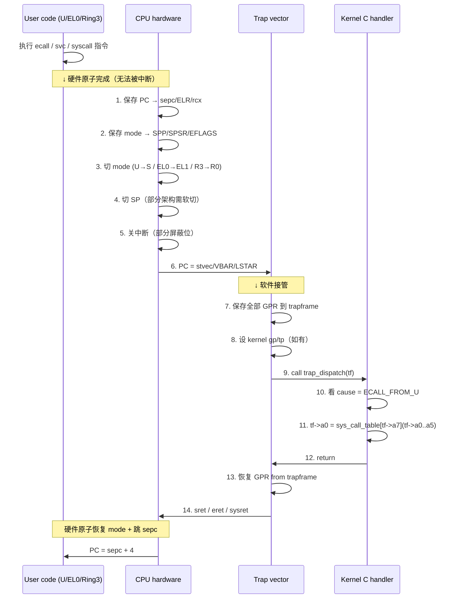

# 04-12 — Architecture syscall ABI：CPU 视角下的内核入口

> **核心问题：**
> 1. RISC-V 为啥把 syscall 号塞进 `a7`，而不是 `a0` 或者一个专用 CSR？
> 2. AArch64 为啥用 `svc #0` 而不是像 RISC-V 一样的 `ecall`？两者都是"软中断"啊？
> 3. x86_64 的 `syscall` 指令和 `sysenter` 区别是什么，为什么前者赢了？
> 4. vDSO 为什么能不切内核就拿到时间？
> 5. 为什么 ABI 一旦固定就**永不变**？换 syscall 号会怎样？
> 6. 内核 trap handler 第一行汇编在干什么？为什么要救 31 个寄存器而不是 16 个？
> 7. 用户栈和内核栈的切换在哪个时刻发生？谁切的？
>
> **一句话答案：** syscall 是一条**特殊指令**（不是函数调用），它让 CPU 自己切特权级、跳到固定向量、把返回地址藏到 CSR/MSR 里；剩下"哪个寄存器是 syscall 号、哪个是 arg0/arg1、谁负责保存"这些约定就是 ABI——一旦发布就永远冻结，因为亿万二进制里都烧死了寄存器编号。
>
> **本笔记定位：** 04 syscall 三件套的**第一篇**——CPU/ISA 视角。
> - **[04-12](04-12-syscall-arch-abi.md)（本篇）**：架构层 ABI（寄存器约定 / trap 路径 / 各架构对比 / vDSO）
> - **04-13**：Linux syscall 列表（具体 400+ 个 syscall，按子系统分组）
> - **04-14**：glibc / musl 包装层（C 函数怎么转成 raw syscall，errno 处理）
>
> 与 [00-16 syscall-abi-evolution](00-16-syscall-abi-evolution.md) 的关系：00-16 偏宏观演化史（INT 0x80 → syscall → io_uring 五十年线索），本笔记**只停在架构层**，把 musl 的 6 个 `syscall_arch.h` 当主数据源，逐字解剖寄存器约定和指令语义。

---

## 0. 阅读前置

| 必备 | 出处 |
|------|------|
| 特权级 / mode bit / S-mode vs U-mode | [02-01 § 1.3](02-01-boot-chain-and-sbi.md) |
| trap 与中断的区别 | [00-11](00-11-interrupt-evolution.md) |
| RISC-V CSR（mtvec/stvec/sscratch/sepc） | [02-01 § 2](02-01-boot-chain-and-sbi.md) |
| ABI 演化大背景 | [00-16](00-16-syscall-abi-evolution.md) |
| inline asm 基本语法 | [01-05 § 5](01-05-zig-freestanding.md) |
| ELF auxv（vDSO 入口靠它） | [00-16 § 5](00-16-syscall-abi-evolution.md) |

主数据源——musl 的 `arch/<arch>/syscall_arch.h` 系列（每个文件 70~90 行，是**最干净**的 ABI 教科书）：

```text
/home/heke/tgln/stage2/material/libc/musl/arch/riscv64/syscall_arch.h
/home/heke/tgln/stage2/material/libc/musl/arch/aarch64/syscall_arch.h
/home/heke/tgln/stage2/material/libc/musl/arch/x86_64/syscall_arch.h
/home/heke/tgln/stage2/material/libc/musl/arch/i386/syscall_arch.h
/home/heke/tgln/stage2/material/libc/musl/arch/loongarch64/syscall_arch.h
```

`musl/arch/` 下还有 `arm/ mips/ mips64/ powerpc/ powerpc64/ s390x/ riscv32/ x32/ sh/ m68k/ microblaze/ or1k/`——一共 19 个架构，每个都有自己的 `syscall_arch.h`，这是 Linux 全谱 ABI 的一手参考。

---

## 1. syscall 不是函数调用

普通 C 函数调用（`call foo` / `bl foo` / `jal foo`）做的是：

1. 把返回地址压栈或写到 link register；
2. 跳到 `foo` 的入口；
3. `foo` 在**同一个**地址空间、**同一个**特权级、**同一个**栈上跑。

syscall 全反过来：

| 维度 | 函数调用 | syscall |
|------|----------|---------|
| 特权级 | 不变（U 仍然 U） | **U → S**（RISC-V）/ EL0 → EL1（ARM）/ Ring3 → Ring0（x86） |
| 地址空间 | 同一个 page table | 内核可见所有物理内存（Sv39 的高半区 / kernel half） |
| 栈 | 用户 sp 不变 | **切到内核栈**（per-thread kstack） |
| 返回地址 | 压栈 / LR | **存到 CSR/MSR**（sepc / ELR_EL1 / RIP-shadow in rcx） |
| 寄存器保存 | caller-saved 由调用者，callee-saved 由被调者 | **全部** 31 个寄存器都要保存到 trapframe（内核不信用户态约定） |
| 调用者编号 | 函数地址（48-bit 指针） | **syscall 号**（一个 small int，例如 64） |
| 失败处理 | 返回值约定 / 抛异常 | 返回 `-errno`（小负数；libc 把它转成 `errno`） |

为什么必须用专用指令？

- 用户态**不能**直接写 SR/MSR、不能跳到 kernel 地址（page table 里那一页是 kernel-only），任何 plain `jr` 都会触发 page fault；
- CPU 设计者干脆给一个**门**指令：**它本身就是一条受信任的"陷阱"**，硬件原子地切 mode + 跳预设向量 + 关中断；
- 这条指令的实际跳转目标**不是 immediate 编码**，而是内核启动时写到 CSR/MSR（`stvec` / `VBAR_EL1` / `LSTAR`）——攻击者改不了。

**ABI vs API 区别（重要）：**

- **API**（Application **Programming** Interface）：源码层面的契约——`int open(const char *path, int flags, mode_t mode);` 是 API；
- **ABI**（Application **Binary** Interface）：二进制层面的契约——"`open` 的 syscall number 是 RISC-V 上 56 号，arg0 在 a0 寄存器是 const char* 路径"是 ABI。

你重编译 glibc，API 不变；但 ABI（寄存器、syscall 号、struct layout）一旦发布就**永不变**，否则旧二进制全炸。

---

## 2. 通用 trap 机制

不分架构，**所有** CPU 收到 trap（不管是 syscall / page fault / illegal instr / timer interrupt）都走同一条骨架路径：



关键设计点：

- **第 1~6 步是硬件做的，原子不可中断**——保证 trap entry 永远落到 `stvec` 指定的代码上，不会被攻击者抢入；
- **第 4 步"切 SP"在 ARM/RISC-V 上需要软件辅助**：硬件不会自动换栈，得靠 `sscratch` / `SP_EL0` 这些"备用槽"暂存内核栈指针，trap 第一句话用 `csrrw sp, sscratch, sp` 一发原子换栈；
- **第 7 步"保存 31 个寄存器"**——内核为什么不只救 callee-saved？因为内核执行**任意**逻辑（schedule、page fault 处理、IPI…），用户态约定的"caller-saved 可以脏"在内核眼里不成立，必须把现场原封不动救出来；
- **第 14 步"sret / eret / sysret"是反向门指令**：硬件原子地恢复 mode + 跳回 sepc，用户态自己跳不回去（普通 `jr` 跳到 sepc 还是 U-mode）。

---

## 3. RISC-V — `ecall` 指令深度解析

### 3.1 `ecall` 行为：trap to next-higher mode

`ecall` 不是"trap to S-mode"——它是**trap to next-higher mode**：

| 当前 mode | ecall 去哪 | mcause / scause |
|-----------|-----------|-----------------|
| U-mode | S-mode | `scause = 8`（Environment call from U-mode）|
| S-mode | M-mode | `mcause = 9`（Environment call from S-mode）|
| M-mode | M-mode（trap-to-self，一般不用）| `mcause = 11` |

所以**同一条指令** `ecall`：
- 应用 → 内核（OS syscall）：U → S；
- 内核 → SBI（[02-01 § 1.3](02-01-boot-chain-and-sbi.md) 讲过的 sbi_console_putchar / set_timer）：S → M。

这是 RISC-V 设计的优雅处——一条指令，两层用，编码 `0x00000073`（32-bit）。

### 3.2 寄存器约定：a7 = syscall_nr，a0–a5 = args，a0 = return

来自 musl `arch/riscv64/syscall_arch.h:1-71` 的最直接证据：

```c
static inline long __syscall6(long n, long a, long b, long c, long d, long e, long f)
{
    register long a7 __asm__("a7") = n;     // syscall number
    register long a0 __asm__("a0") = a;     // arg0
    register long a1 __asm__("a1") = b;     // arg1
    register long a2 __asm__("a2") = c;     // arg2
    register long a3 __asm__("a3") = d;     // arg3
    register long a4 __asm__("a4") = e;     // arg4
    register long a5 __asm__("a5") = f;     // arg5
    __asm_syscall("r"(a7), "0"(a0), "r"(a1), "r"(a2), "r"(a3), "r"(a4), "r"(a5))
}
```

为什么 `a7` 而不是 `a0` 或专用 CSR？

- **不能用 a0**：a0 已经是 arg0 + 返回值（少一个寄存器就少一个 arg）；
- **不能用专用 CSR**：CSR 写要权限指令 `csrw`，且每次 syscall 都得多一条指令成本；
- **a7 是普通函数调用约定里"用得最少的 arg 寄存器"**——RV64 GPR 调用约定里 a0–a7 都是 arg，syscall 顶多用 6 个 args，剩 a6/a7 空着，挑 a7 当 syscall 号最不冲突。

返回值约定：
- `a0` 寄存器单独承担 return（约束 `"=r"(a0)`，asm 的 output operand）；
- 成功 → 正/0/小正数；
- 失败 → **负 errno**（`-EINVAL = -22`，`-ENOENT = -2`…）；libc 包装层会判断负值后 `errno = -ret; ret = -1;`（详见 04-14）。

### 3.3 错误返回与 sscratch CSR 的配合

`sscratch` 是 S-mode 的"擦写寄存器"——内核启动时写一个东西进去（一般是当前 hart 的 trapframe 指针或者 kstack 顶部），trap entry 第一行用 `csrrw sp, sscratch, sp` 把当前用户 sp 和 sscratch 内容**原子交换**：

```asm
# RISC-V trap entry (S-mode), 简化伪代码
.align 4
trap_vector:
    # 1. 抢救用户 sp，把内核 sp 抓出来（原子）
    csrrw  sp, sscratch, sp        # sp ↔ sscratch
    # 现在 sp 指向内核栈，sscratch 里是用户 sp
    addi   sp, sp, -288            # 留 36*8 字节空间存 trapframe
    sd     ra, 0(sp)
    sd     gp, 16(sp)
    sd     tp, 24(sp)
    sd     t0, 32(sp)
    # ...省略 t1-t6, s0-s11, a0-a7...
    # 把存到 sscratch 的用户 sp 也写到 trapframe.sp
    csrr   t0, sscratch
    sd     t0, 8(sp)
    # 把用户 PC（sepc）也存进去
    csrr   t0, sepc
    sd     t0, 280(sp)
    # 把 sscratch 重置为 0（内核约定：内核态 sscratch == 0）
    csrw   sscratch, zero
    # 调 C handler
    mv     a0, sp                  # tf 指针
    call   trap_dispatch
    # ...返回路径反向...
```

`csrrw` 是这一切的灵魂：单条指令、原子交换、不需要先 spill 任何寄存器（你在 U-mode 一个寄存器都不能脏，内核栈指针又必须从某处取）——sscratch 就是这"某处"。

### 3.4 `__asm_syscall` 宏精读（musl）

`musl/arch/riscv64/syscall_arch.h:4-7` 一共四行，它是整个 musl RISC-V 端 syscall 的核心：

```c
#define __asm_syscall(...) \
    __asm__ __volatile__ ("ecall\n\t" \
    : "=r"(a0) : __VA_ARGS__ : "memory"); \
    return a0;
```

逐字段：

| GCC inline asm 字段 | 作用 |
|--------------------|------|
| `"ecall\n\t"` | 模板，发出一条 ecall 指令 |
| `: "=r"(a0)` | output：写 a0 寄存器（因为前面 `register long a0 __asm__("a0")`，编译器锁死） |
| `: __VA_ARGS__` | input：所有 a7/a0–a5（变参穿透）|
| `: "memory"` | clobber：告诉编译器内存可能被改（内核可能写用户态 buffer），别 cache 寄存器 |
| `__volatile__` | 不允许优化掉 / 不允许跨这条指令重排 |

注意没有 clobber 任何寄存器（除了 memory）——因为 RISC-V kernel 的 ABI 保证 syscall 后**所有 caller-saved 都被恢复**。这是和 x86_64 关键区别（x86_64 syscall 指令本身会废掉 rcx/r11）。

### 3.5 内核侧 trap entry 参考

xv6-riscv（RISC-V 教学内核，[03-05 § boot 项目对比](03-05-boot-domain-comparison.md) 提过）的 `trampoline.S` / `kernelvec.S` 是教科书级别参考。本仓库的 `core/xv6/trapasm.S` 是 **i386 版**（xv6 早期实现），可以拿来对比 i386 trap entry 的简洁——只有 32 行，因为 i386 用硬件 task gate / 软件 alltraps，比 RISC-V 还省事。

xv6-riscv 实际的 `trampoline.S` ≈ 100 行，干的事情和上面 § 3.3 完全一样：保 31 GPR + sepc + sstatus → 调 `usertrap()` → 恢复 → `sret`。

### 3.6 Sv39 用户态/内核态地址空间分离

RISC-V Sv39 提供 39-bit 虚拟地址（512GB），常见布局：

| 区段 | 范围 | 用途 |
|------|------|------|
| 低半区 | `0x0000_0000_0000_0000` ~ `0x0000_003F_FFFF_FFFF` | 用户态可见 |
| **gap**（不可用，因符号扩展） | | |
| 高半区 | `0xFFFF_FFC0_0000_0000` ~ `0xFFFF_FFFF_FFFF_FFFF` | 内核态可见 |

trap 时**不切 SATP**（页表寄存器）就能让 sp 直接指向内核栈——因为内核栈映射在高半区，本来就在当前页表里，只是 U-mode 没权限读。

但用户态 buffer 怎么办？syscall arg 经常是 `const char *path`——内核要读用户态 buffer。靠的不是切页表，而是 `SUM` bit（Supervisor User Memory access）：

- 内核启动时 `sstatus.SUM = 1` → S-mode 能读 U-page；
- syscall 处理 `read(fd, buf, len)` → 内核直接 `memcpy(kbuf, (char*)tf->a1, tf->a2)` 就行（buf 是 user vaddr，但当前 SATP 里有这一页）。

风险？`copy_from_user()` 必须**主动**检查地址范围（防止用户传内核地址骗读）——这是 Linux 的一整套 `__access_ok` / `unsafe_get_user` 机制。

---

## 4. AArch64 — `svc #0`

### 4.1 `svc #immediate` 行为

ARM 64-bit 的 syscall 指令叫 `svc`（Supervisor Call），后面带 16-bit immediate：

```asm
svc #0       // immediate = 0，约定俗成 Linux syscall
```

immediate 在内核里能从 `ESR_EL1` 寄存器读到（`ESR_EL1.ISS[15:0]`），但 Linux 不用，永远是 `#0`。其他 OS（如 macOS）历史上用过 `svc #0x80`。

行为和 RISC-V `ecall` 几乎一模一样：
1. PC → `ELR_EL1`（Exception Link Register）
2. PSTATE → `SPSR_EL1`（Saved Program Status Register）
3. `ESR_EL1.EC = 0b010101`（SVC from AArch64）
4. `ESR_EL1.ISS = #immediate`
5. mode → EL1
6. PC → `VBAR_EL1 + 0x400`（同步 EL0 → EL1 入口偏移）

### 4.2 寄存器：x8 = syscall_nr，x0–x5 = args，x0 = return

来自 musl `arch/aarch64/syscall_arch.h:62-72`：

```c
static inline long __syscall6(long n, long a, long b, long c, long d, long e, long f)
{
    register long x8 __asm__("x8") = n;     // syscall number
    register long x0 __asm__("x0") = a;     // arg0 + return
    register long x1 __asm__("x1") = b;
    register long x2 __asm__("x2") = c;
    register long x3 __asm__("x3") = d;
    register long x4 __asm__("x4") = e;
    register long x5 __asm__("x5") = f;
    __asm_syscall("r"(x8), "0"(x0), "r"(x1), "r"(x2), "r"(x3), "r"(x4), "r"(x5));
}
```

为什么 `x8`？AArch64 PCS（Procedure Call Standard）规定 x0–x7 是 args（共 8 个），x8 是 indirect-result-location-register（C struct 大返回值用），调用约定里 x8 不用作参数——挑它当 syscall 号最干净。

### 4.3 ESR_EL1 / ELR_EL1 / SPSR_EL1 解析

| CSR | 类比 RISC-V | 内容 |
|-----|-------------|------|
| `ELR_EL1` | sepc | 触发异常的 PC（svc 那条指令的地址；返回时 +4） |
| `SPSR_EL1` | sstatus | 触发异常时的 PSTATE 快照（包含上次 EL、中断屏蔽位） |
| `ESR_EL1` | scause + stval | EC（异常类）+ ISS（异常状态信息）|
| `FAR_EL1` | stval | page fault 时的故障地址 |
| `VBAR_EL1` | stvec | 向量基址（Linux 设为 `vectors` 表，16 个入口，每入口 0x80 字节）|

### 4.4 与 RISC-V 的对应关系

| RISC-V 概念 | AArch64 对应 |
|-------------|-------------|
| `ecall` 指令 | `svc #0` |
| sepc | ELR_EL1 |
| sstatus.SPP（上次 mode） | SPSR_EL1.M[3:0] |
| scause | ESR_EL1.EC |
| stval | ESR_EL1.ISS / FAR_EL1 |
| stvec | VBAR_EL1 |
| sscratch | SP_EL0（硬件直接给两个 SP！） |
| `csrrw sp, sscratch, sp` | 不需要——AArch64 有独立的 `SP_EL0` / `SP_EL1`，硬件自动用 SP_EL1 |
| sret | eret |
| a7 / a0–a5 | x8 / x0–x5 |

**关键差异**：AArch64 有**两套 SP**（每个 EL 一个），从 EL0 进 EL1 时 SP 自动从 `SP_EL0` 切到 `SP_EL1`，硬件自动的——不用 sscratch 那套软件交换魔术。这是 ARM 比 RISC-V 多花的硬件成本。

---

## 5. x86_64 — `syscall` 指令演化史

### 5.1 INT 0x80（i386 historical）

最古老，i386 的 Linux 用了二十年：

```asm
mov  $1, %eax        ; syscall number (write)
mov  $1, %ebx        ; arg0 (fd)
mov  $msg, %ecx      ; arg1 (buf)
mov  $13, %edx       ; arg2 (count)
int  $0x80           ; trap to vector 0x80
```

`int 0x80` 走 IDT（中断描述符表）第 128 项，跳到 `entry_INT80_compat` / `entry_INT80_32`。慢——因为 IDT 走完整中断流程（特权级检查、栈切换、压 SS:RSP/RFLAGS/CS:RIP/error code）。

x86_64 仍**保留**了 INT 0x80 兼容路径，但 musl x86_64 不用它（见 `arch/x86_64/syscall_arch.h:7` 用 `syscall` 指令）。i386 musl 用 `int $128`（musl `arch/i386/syscall_arch.h:7`）—— `SYSCALL_INSNS "int $128"` 是 SYSCALL_NO_TLS 的退路，正常情况走 `call *%%gs:16` 间接调用 vDSO 入口。

### 5.2 `syscall` / `sysret`（AMD 提出，主流）

AMD64 时代，AMD 加了一条**专用** syscall 指令，跳过 IDT：

```asm
mov  $1, %rax        ; syscall number (write)
mov  $1, %rdi        ; arg0
mov  $msg, %rsi      ; arg1
mov  $13, %rdx       ; arg2
syscall              ; → kernel
```

硬件干的事：
1. `RIP → RCX`（注意：返回地址藏到 RCX，不像 RISC-V 进 CSR）
2. `RFLAGS → R11`，`RFLAGS &= ~MSR_FMASK`（屏蔽位）
3. `CS = STAR[47:32]`，`SS = STAR[47:32] + 8`
4. `RIP = MSR_LSTAR`（内核入口）

**关键副作用：rcx 和 r11 被指令本身废掉**——这就是为什么 musl 的 `__syscall0` 里：

```c
__asm__ __volatile__ ("syscall" : "=a"(ret) : "a"(n) : "rcx", "r11", "memory");
//                                                      ^^^^^^^^^^^^^
//                                                      告诉编译器：syscall 后 rcx/r11 内容已脏
```

### 5.3 `sysenter` / `sysexit`（Intel 同时期，已废弃）

Intel 在 Pentium II 也搞了 `sysenter`，语义和 AMD 的 `syscall` 差不多但寄存器约定不同。

- Linux 32-bit 短期用过 `sysenter`（vDSO `__kernel_vsyscall` 用它）；
- 64-bit 完全没采用 Intel 方案——AMD64 的 `syscall` 赢了；
- Intel 后来也实现了 AMD 的 `syscall` 指令（在 64-bit 模式下）。

历史教训：**Intel 输了 64-bit ISA**——AMD64 成了事实标准，Intel 自己的 IA-64 安腾死掉。

### 5.4 寄存器：rax = syscall_nr，rdi/rsi/rdx/r10/r8/r9 = args，rax = return

来自 musl `arch/x86_64/syscall_arch.h:53-62`：

```c
static __inline long __syscall6(long n, long a1, long a2, long a3,
                                long a4, long a5, long a6)
{
    unsigned long ret;
    register long r10 __asm__("r10") = a4;
    register long r8  __asm__("r8")  = a5;
    register long r9  __asm__("r9")  = a6;
    __asm__ __volatile__ ("syscall"
        : "=a"(ret)
        : "a"(n), "D"(a1), "S"(a2), "d"(a3), "r"(r10), "r"(r8), "r"(r9)
        : "rcx", "r11", "memory");
    return ret;
}
```

这里有个**著名陷阱**：System V x86_64 函数调用 ABI 里 arg4 是 **rcx**，但 syscall 时 arg4 必须是 **r10**——为什么？

### 5.5 r10 而不是 rcx 的原因

因为 `syscall` 指令本身把 RIP 写进 RCX！如果 arg4 还在 rcx，被覆盖。所以 Linux 在 syscall 路径上**单独**约定 arg4 用 r10。

这导致 glibc / musl 的包装层在调 syscall 前要做一步 "rcx → r10" 的搬运（看上面 `register long r10 __asm__("r10") = a4;` 这行）。

| arg index | 函数调用 ABI | syscall ABI |
|-----------|--------------|-------------|
| arg0 | rdi | rdi |
| arg1 | rsi | rsi |
| arg2 | rdx | rdx |
| arg3 | rcx | **r10** ← 区别 |
| arg4 | r8 | r8 |
| arg5 | r9 | r9 |

### 5.6 LSTAR / STAR / FMASK MSR

x86_64 的内核入口由三个 Model Specific Register 决定，内核启动时一次性写好：

| MSR | 内容 | 类比 |
|-----|------|------|
| `MSR_STAR` (0xC0000081) | 高 32 bit = 内核 CS:SS（commonly 0x10:0x18），低 32 bit = 用户 CS:SS（用户态 sysret 用） | 没直接对应物 |
| `MSR_LSTAR` (0xC0000082) | 64-bit 内核 syscall 入口地址 | RISC-V stvec |
| `MSR_CSTAR` (0xC0000083) | 32-bit compat 模式 syscall 入口 | -- |
| `MSR_FMASK` (0xC0000084) | syscall 时要清掉的 RFLAGS bit（一般包含 IF=屏蔽中断、TF=单步、DF=方向标志） | RISC-V 自动清 SIE |

Linux 在 `arch/x86/kernel/cpu/common.c::syscall_init()` 写这几个 MSR，把 LSTAR 指向 `entry_SYSCALL_64`（汇编符号）。

注意：**x86_64 不自动切栈**——`syscall` 指令只切 mode 不切 SP，第一条内核指令必须立即用 `swapgs` + per-CPU 数据找到 kernel stack。这点和 ARM 的"硬件自动切 SP_EL1"形成对比，是 x86_64 syscall 路径的额外软件成本。

---

## 6. 跨架构 ABI 对比表

| 维度 | RV64 | AArch64 | x86_64 | i386 | LoongArch64 | MIPS64 | PowerPC64 |
|------|------|---------|--------|------|-------------|--------|-----------|
| 指令 | `ecall` | `svc #0` | `syscall` | `int $128` (musl) / `int $0x80` | `syscall 0` | `syscall` | `sc` |
| syscall 号 | a7 | x8 | rax | eax | $a7 | $v0 | r0 |
| arg0 | a0 | x0 | rdi | ebx | $a0 | $a0 | r3 |
| arg1 | a1 | x1 | rsi | ecx | $a1 | $a1 | r4 |
| arg2 | a2 | x2 | rdx | edx | $a2 | $a2 | r5 |
| arg3 | a3 | x3 | **r10** | esi | $a3 | $a3 | r6 |
| arg4 | a4 | x4 | r8 | edi | $a4 | $a4 | r7 |
| arg5 | a5 | x5 | r9 | ebp | $a5 | $a5 | r8 |
| arg6 | (无)| (无) | (无) | (无) | $a6 (LA 多一个) | (栈) | r9 |
| return | a0 | x0 | rax | eax | $a0 | $v0 / $a3 | r3 / cr0.SO |
| 错误约定 | 负 errno | 负 errno | 负 errno | 负 errno | 负 errno | $a3 ≠ 0 标志 | cr0.SO 标志 |
| 指令副作用 clobber | (无) | (无) | rcx, r11 | (无，但需保 ebx) | t0–t8 | t* | (多) |
| 切 mode | U→S | EL0→EL1 | R3→R0 | R3→R0 | PLV3→PLV0 | U→K | PR=1→0 |
| 自动切 SP | ✗（需 sscratch） | ✓（SP_EL0/EL1） | ✗（需 swapgs） | ✗（IDT 自动切） | ✗（需 CSR） | ✗ | ✓ |
| 入口寄存器 | stvec | VBAR_EL1 | LSTAR MSR | IDT[0x80] | EENTRY CSR | EBASE | SRR0/SRR1 |
| return 指令 | `sret` | `eret` | `sysret` | `iret` | `ertn` | `eret` | `rfid` |

**模式总结：**

1. **RISC family**（RV/ARM/LoongArch/MIPS）syscall 号都不在 a0——为了不挤掉 arg0；
2. **CISC**（x86/x86_64）习惯用 ax 寄存器同时承担 syscall 号和 return（短指令编码偏好）；
3. **MIPS / PowerPC** 用单独错误标志位（$a3 / cr0.SO）而不是负 errno——历史原因，但 Linux 内核仍**给 libc 屏蔽了**，对 userspace 看起来都是负 errno；
4. **arg 数量**：MIPS o32 ABI 只有 4 个 arg 寄存器（其余压栈），是历史遗留最严重的 ABI 之一；其他架构都至少 6 个。

---

## 7. vDSO — 不切内核的"syscall"

### 7.1 vDSO 是什么

vDSO（virtual Dynamic Shared Object）是内核映射进**每个**用户进程地址空间的一段 `.so` 代码——**纯用户态执行**，不切特权级。

为什么需要？高频调用如 `gettimeofday()` / `clock_gettime()` / `getcpu()` / `time()` 不需要"权限操作"——只需要读一个共享时间页就行。如果走 syscall：用户态 → 内核态切换约 100~300 ns（context save + dispatch + restore），高频调用直接吃光性能。

vDSO 解决：把"读时间页"的代码以 PIC 形式编译成一个小 ELF .so，内核 mmap 进每个进程的固定虚地址，libc 调用时**直接 jmp 进去**，没有 trap。

### 7.2 musl 怎么调 vDSO

`musl/src/internal/vdso.c:61-115` 实现了 `__vdsosym(vername, name)`：

```c
void *__vdsosym(const char *vername, const char *name)
{
    size_t i;
    for (i = 0; libc.auxv[i] != AT_SYSINFO_EHDR; i += 2)   // 1. 在 ELF auxv 找 vDSO base
        if (!libc.auxv[i]) return 0;
    if (!libc.auxv[i+1]) return 0;
    Ehdr *eh = (void *)libc.auxv[i+1];                     // 2. 当作 ELF header 解析
    Phdr *ph = (void *)((char *)eh + eh->e_phoff);
    /* ...扫 dynamic 段、找符号表、版本表... */
    for (i = 0; i < nsym; i++) {
        if (strcmp(name, strings + syms[i].st_name)) continue;
        if (versym && !checkver(verdef, versym[i], vername, strings))
            continue;
        return (void *)(base + syms[i].st_value);          // 3. 返回 vDSO 函数地址
    }
    return 0;
}
```

调用方（如 `clock_gettime`）：

```c
// musl 风格伪代码
static int (*cgt)(clockid_t, struct timespec *);

int clock_gettime(clockid_t id, struct timespec *ts) {
    if (!cgt) cgt = __vdsosym(VDSO_CGT_VER, VDSO_CGT_SYM);  // 一次性解析
    if (cgt) return cgt(id, ts);                            // 直接 call，不 syscall！
    return __syscall(SYS_clock_gettime, id, ts);            // fallback
}
```

每个架构的 vDSO 符号名不同，从 `syscall_arch.h` 末尾抓：

| 架构 | VDSO_CGT_SYM | VDSO_CGT_VER |
|------|--------------|--------------|
| riscv64 | `__vdso_clock_gettime` | LINUX_4.15 |
| aarch64 | `__kernel_clock_gettime` | LINUX_2.6.39 |
| x86_64 | `__vdso_clock_gettime` | LINUX_2.6 |
| i386 | `__vdso_clock_gettime64` | LINUX_2.6 |
| loongarch64 | `__vdso_clock_gettime` | LINUX_5.10 |

### 7.3 内核怎么 export vDSO

kernel `arch/<arch>/vdso/` 目录下：
- `vdso.lds.S` 链接脚本（控制段布局、版本表）；
- `vdso.S` / `vgettimeofday.c`（实际函数实现，编译成独立 .so）；
- `vdso2c.c` / `vdsoimg.S` 把 .so 嵌入 vmlinux；
- 启动时 `arch_setup_additional_pages()` 把 vDSO mmap 到用户进程。

时间数据通过共享页（`vvar`）传递——内核每 tick 更新这个页的 `tv_sec / tv_nsec` 字段，vDSO 直接读。

### 7.4 vDSO 也救了 syscall instruction discovery

i386 的 vDSO 还提供 `__kernel_vsyscall`——它探测 CPU 支持 `sysenter` 还是 `int 0x80`，给 libc 一个统一入口：

```c
// 来自 musl/arch/i386/syscall_arch.h:7-9
#if SYSCALL_NO_TLS
#define SYSCALL_INSNS "int $128"
#else
#define SYSCALL_INSNS "call *%%gs:16"   // GDT %gs:16 是 vDSO 注入的 __kernel_vsyscall 指针
#endif
```

`%gs:16` 这个绝对值（offset 16）是 musl/glibc 在 TLS 里布置的、内核启动时通过 `AT_SYSINFO` auxv 传过来的 `__kernel_vsyscall` 地址。CPU 支持 sysenter 就走 sysenter，否则降级到 int 0x80——一行 indirect call 兼容所有 i386 CPU。这是 vDSO 第二个用途（指令探测），第一个是 gettimeofday 之类的 zero-trap 快速路径。

---

## 8. ABI 稳定性保证

> "We do not break userspace." — Linus Torvalds, 2012

### 8.1 syscall number 永不重用

哪怕一个 syscall 被废弃（比如 `sys_create_module` 在 2.6 删了），它的号**永远空着**——因为可能有上世纪编译的二进制还在用。

例外：废弃后强制返回 `-ENOSYS` 的"墓碑"实现还在；号码本身不重发。

### 8.2 寄存器约定永不变

a7 永远是 syscall 号，rdi 永远是 arg0。即使新架构（riscv64 → riscv128）出现，Linux 也会保留这一约定（除非废弃整个端口）。

### 8.3 数据结构永不"减字段" / 只 "加字段在末尾"

例如 `struct stat`：

- v1 只有几个字段（mode, size, mtime…）；
- v2 添加 nanosec 时间戳——只能放**末尾**，旧二进制读到的字段位置不变；
- 极端情况（Y2038）必须扩 32-bit 时间到 64-bit → **新建一个 syscall**：`stat → stat64 → statx`（号码全新，结构全新，旧 syscall 保留）。

### 8.4 错误码 errno 列表只追加

`<errno.h>` 里的 `EINVAL=22 / EAGAIN=11 / ENOSYS=38`——号码全冻结。新错误（如 `ENOTRECOVERABLE=131`）只能往后加。

### 8.5 怎么"破"约定？答：换个 syscall 号

想改 ABI，唯一合法手段：

- 老 syscall 保留并继续工作（参数语义不动）；
- 新建一个号码 + 新名字（`open → openat`，`stat → fstatat → statx`，`select → pselect → ppoll`）；
- 新名字一般加后缀 `at`（带 dirfd）/ `64`（64-bit 时间）/ `2`（v2）/ `x`（扩展）。

Linux 的 syscall 表里因此有一堆"看着很像"的兄弟函数——这不是冗余，是**ABI 进化的化石层**。

---


- [ ] **架构选定**：先做 RV64 syscall 入口，AArch64 / x86_64 后续；
- [ ] **trap entry 汇编**（`arch/riscv/trap.S`）：保存 31 个 GPR + sepc + sstatus 到 trapframe，至少 32×8 = 256 字节；
- [ ] **trapframe 结构体**：和汇编 offset 对齐，用 Zig comptime 验证大小（`comptime { assert(@sizeOf(TrapFrame) == 288); }`）；
- [ ] **dispatch 表**：syscall_nr 索引函数指针表，未实现的位置塞 `sys_ni_syscall`（返回 -ENOSYS）；
- [ ] **参数传递规则**：从 trapframe 的 a0–a5 取，不让 C 函数直接读寄存器（保持纯函数）；
- [ ] **errno 返回规则**：内核函数返回 `KError!isize`，dispatch 层把 `error.InvalidArgument` 翻译成 `-EINVAL`；
- [ ] **多线程上下文**：每线程一个 trapframe（在 kstack 顶部），trap entry 用 sscratch 抓 kstack 顶；
- [ ] **`SUM` bit 管理**：内核启动设 `sstatus.SUM = 1`；写 `copy_from_user` / `copy_to_user` 抽象，处理 page fault 时 `nofault` 返回错误而不是 panic；
- [ ] **vDSO**：v0.1 不实现（直接 syscall 即可），v0.5 加 clock_gettime 的 vDSO 路径，对标 Linux；
- [ ] **strace 工具**：内核 trace_event hook 抓 enter/exit syscall 用于调试；
- [ ] **ptrace（远期）**：让 gdb 能停在 syscall enter 边界；
- [ ] **seccomp（远期）**：syscall 过滤白名单（容器隔离需要）；
- [ ] **跨 ISA 抽象**：`arch/<arch>/trap.S` + 共享 `kernel/syscall_dispatch.zig`，仿 Linux `arch/` + `kernel/` 分层；

---

## 10. 跨引用 + FAQ + 进一步阅读

### 10.1 跨引用

- 演化史宏观：[00-16 syscall-abi-evolution](00-16-syscall-abi-evolution.md)
- 中断/异常硬件背景：[00-11 interrupt-evolution](00-11-interrupt-evolution.md)
- 微架构 / 流水线如何被 trap 打断：[00-04 micro-architecture-evolution](00-04-micro-architecture-evolution.md)
- 内存模型与 syscall 屏障：[00-15 concurrency-sync-evolution](00-15-concurrency-sync-evolution.md)
- RISC-V boot 与 ecall（S→M 方向）：[02-01 § 1.3](02-01-boot-chain-and-sbi.md)
- SBI 也是用 ecall（同一指令两种用途）：[02-04 sbi-complete-reference](02-04-sbi-complete-reference.md)
- 后续 syscall 三件套：04-13（Linux syscall 列表）/ 04-14（glibc/musl 包装）

### 10.2 FAQ

**Q1：为什么 RV64 用 ecall 而不是叫 syscall？**
RV ISA 设计哲学是"通用 trap"——`ecall` 不是 OS 概念而是 ISA 概念，它能从任意 mode 触发。OpenSBI 用它，Linux 用它，KVM hypervisor 也用它（HS-mode → M-mode）。一条指令多用，编码省。

**Q2：AArch64 的 SVE 寄存器（Z0–Z31）syscall 时怎么办？**
syscall 不动 FP / SIMD / SVE 寄存器（caller-saved）。但内核如果做了上下文切换（schedule 切到别的进程），那次切换会保存/恢复完整 FP 状态。

**Q3：x86_64 的 swapgs 是干嘛的？**
进入 syscall 时，gs 指向**用户**的 TLS（thread-local storage），内核需要自己的 per-CPU 数据。`swapgs` 一发原子交换 gs base 和 KERNEL_GS_BASE MSR。这是 x86 历史包袱（GDT/segment 残留）；RV/ARM 都没这个问题。

**Q4：为什么 syscall 不能在中断处理上下文里调？**
可以——但很危险：syscall 的 caller 期望"调到内核会被调度"，中断 handler 不可阻塞。Linux 实际上用 `in_atomic()` / `might_sleep()` 检测，违反规则会 BUG_ON。

**Q5：ABI 真的 100% 不破？**
Linux 历史上破过几次（hash randomization 改了 readdir 顺序、fcntl 行为微调），每次 Linus 怒喷+回滚。**实际上**保持得相当好——你 1995 年的二进制现在还能跑（如果连得上 a.out 装载器）。

**Q6：用户态能写入 sscratch 吗？**
不能。sscratch 是 S-mode CSR（编码 0x140），M/S-mode 才能 csrw，U-mode 一写就是 illegal instruction trap。

**Q7：为什么不让用户态自己读 stvec 看内核入口？**
stvec 也是 S-mode CSR，U-mode 读不到。即使读到了也无用——攻击者改不了它（写需要 S-mode）。整套 CSR 权限机制是 RISC-V 的安全基础。

**Q8：Zig/Rust 写 raw syscall 怎么写？**

```zig
// Zig 风格 RV64 raw syscall (write)
pub inline fn syscall3(nr: usize, a0: usize, a1: usize, a2: usize) usize {
    return asm volatile ("ecall"
        : [ret] "={a0}" (-> usize),
        : [nr] "{a7}" (nr),
          [a0] "{a0}" (a0),
          [a1] "{a1}" (a1),
          [a2] "{a2}" (a2),
        : "memory"
    );
}
// 调用：_ = syscall3(64, 1, @intFromPtr(&msg), msg.len);  // SYS_write
```

```rust
// Rust 风格 RV64 raw syscall
unsafe fn syscall3(nr: usize, a0: usize, a1: usize, a2: usize) -> usize {
    let ret: usize;
    core::arch::asm!(
        "ecall",
        in("a7") nr,
        inlateout("a0") a0 => ret,
        in("a1") a1,
        in("a2") a2,
        options(nostack),
    );
    ret
}
```

### 10.3 进一步阅读

| 主题 | 资源 |
|------|------|
| RISC-V Privileged Spec v1.12 | riscv.org，§ 3 (M-mode) / § 4 (S-mode) trap 章节 |
| ARMv8-A AArch64 ARM (DDI0487) | arm.com，§ D1 (Exception model) |
| Intel SDM Vol 3A | § 5.8 (Calling System Procedures) / § 6 (IDT) |
| AMD APM Vol 2 | § 6 (System Instructions) |
| Linux kernel `arch/<arch>/entry/` | 实际 trap entry 实现 |
| musl `arch/<arch>/syscall_arch.h` | 本笔记主数据源（本机已克隆）|
| xv6-riscv `kernel/trampoline.S` | 教学级 RISC-V trap entry |
| FreeBSD `sys/<arch>/<arch>/exception.S` | 另一种风格的对比 |
| Wikipedia "System call" / "vDSO" | 概念入口 |
| LWN "User-space ABI testing" 系列 | ABI 稳定性的工程实践 |

---

**笔记结束。**
本笔记**只**讲架构层 ABI（寄存器约定 + 切换路径 + 跨架构对比 + vDSO）；具体哪个号码对应哪个 syscall（read=63? write=64?）见 04-13；libc 怎么从 `int open(...)` 变成 `__syscall3(SYS_open, path, flags, mode)` 见 04-14。
