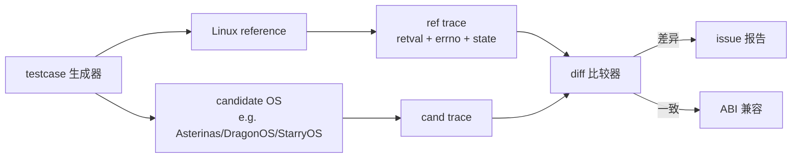

# 04-13 — Linux ABI 常用 syscall 大全（按功能分组 + 三架构编号 + 测例标注）

> **本笔记定位：** 04 syscall 三件套的第二篇。架构 ABI 见 [04-12](04-12-syscall-arch-abi.md)（寄存器约定 / `ecall` `svc` `syscall` 三指令对比 / errno 返回方式），glibc 包装见 [04-14](04-14-syscall-glibc-abi.md)（vDSO / SYS_xxx 宏 / `syscall(2)` 通用入口）。

---

## 0. 数据源 + 标注约定

### 0.1 编号来源（musl 头文件路径）

本笔记三个架构的 `__NR_xxx` 编号均来自本地已克隆的 musl 源码，以下文件**就是事实源**：

| 架构 | 头文件路径 | 备注 |
|------|------------|------|
| RV64 | `/home/heke/tgln/stage2/material/libc/musl/arch/riscv64/bits/syscall.h.in` | 与 Linux `include/uapi/asm-generic/unistd.h` 同步 |
| ARM64 | `/home/heke/tgln/stage2/material/libc/musl/arch/aarch64/bits/syscall.h.in` | 与 Linux `include/uapi/asm-generic/unistd.h` 同步（aarch64 也用 generic） |
| LA64 | `/home/heke/tgln/stage2/material/libc/musl/arch/loongarch64/bits/syscall.h.in` | 与 Linux `include/uapi/asm-generic/unistd.h` 同步（LoongArch64 也用 generic） |
| x86_64 | `/home/heke/tgln/stage2/material/libc/musl/arch/x86_64/bits/syscall.h.in` | 与 Linux `arch/x86/entry/syscalls/syscall_64.tbl` 同步 |
| i386（备） | `/home/heke/tgln/stage2/material/libc/musl/arch/i386/bits/syscall.h.in` | 历史遗产，本笔记暂不展开 |


### 0.2 表格格式

每个分组用一张表，固定 8 列：

| RV64 | ARM64 | LA64 | x86_64 | 名字 | 描述 | man | 测例 |
|------|-------|------|--------|------|------|-----|------|

**注：** RV64 / ARM64 / LA64 三列总是相同编号（asm-generic/unistd.h 共享）；保留三列分开列出仅为查询便利，避免读者怀疑某架构是否有此 syscall。

- **RV64 / ARM64 / LA64 / x86_64：** 十进制 syscall 号；`N/A` 表示该架构没有此 syscall。
- **名字：** 内核 `__NR_xxx` 名字（去掉 `__NR_` 前缀）。
- **描述：** 一句话功能。
- **man：** `man 2 <name>` 或 `man 3 <name>`（库函数）；`-` 表示无独立 man 页（一般是被合并到其他页）。

### 0.3 "已有测例"约定

- `☐` —— 占位，未确认。
- `[~]` —— 测例部分覆盖（如 `clock_gettime` 只测了 `CLOCK_REALTIME`）。


---

## 1. 基本 IO（read / write / lseek / close）

| RV64 | ARM64 | LA64 | x86_64 | 名字 | 描述 | man | 测例 |
|------|-------|------|--------|------|------|-----|------|
| 63 | 63 | 63 | 0 | read | 从 fd 读取 buf | man 2 read | ☐ |
| 64 | 64 | 64 | 1 | write | 向 fd 写入 buf | man 2 write | ☐ |
| 62 | 62 | 62 | 8 | lseek | 移动 fd 偏移指针 | man 2 lseek | ☐ |
| 57 | 57 | 57 | 3 | close | 关闭 fd | man 2 close | ☐ |


---

## 2. open 路径入口（open / openat）

| RV64 | ARM64 | LA64 | x86_64 | 名字 | 描述 | man | 测例 |
|------|-------|------|--------|------|------|-----|------|
| N/A | N/A | N/A | 2 | open | 打开文件（绝对路径或 cwd 相对） | man 2 open | ☐ |
| 56 | 56 | 56 | 257 | openat | 打开文件（相对 dirfd 或绝对） | man 2 openat | ☐ |
| 437 | 437 | 437 | 437 | openat2 | openat 增强版（带 `open_how` 结构） | man 2 openat2 | ☐ |

**设计意图：** RV64 / ARM64 有意删除 `open` —— 强制用户态使用 `openat(AT_FDCWD, path, flags)`。理由：

1. `open(path)` 隐式依赖**当前工作目录**（`cwd`），多线程下不安全（一个线程 `chdir` 影响所有线程的 `open`）。
2. `openat(dirfd, path)` 把目录显式作为参数，支持 `O_PATH` fd 链解析，杜绝 TOCTOU（time-of-check-to-time-of-use）攻击。
3. glibc/musl 的 `open(path, flags)` 在新架构上自动展开为 `openat(AT_FDCWD, path, flags)`。


---

## 3. 文件元数据

| RV64 | ARM64 | LA64 | x86_64 | 名字 | 描述 | man | 测例 |
|------|-------|------|--------|------|------|-----|------|
| N/A | N/A | N/A | 4 | stat | 取路径文件元数据 | man 2 stat | ☐ |
| N/A | N/A | N/A | 6 | lstat | 取路径元数据（不跟随符号链接） | man 2 lstat | ☐ |
| 80 | 80 | 80 | 5 | fstat | 取 fd 元数据 | man 2 fstat | ☐ |
| 79 | 79 | 79 | 262 | newfstatat (fstatat) | 通用 fd+path 元数据（含 `AT_SYMLINK_NOFOLLOW`） | man 2 fstatat | ☐ |
| 291 | 291 | 291 | 332 | statx | stat 增强版（生成时间 / mount-id / DAX flag 等） | man 2 statx | ☐ |
| 43 | 43 | 43 | 137 | statfs | 取 fs 整体元数据（路径） | man 2 statfs | ☐ |
| 44 | 44 | 44 | 138 | fstatfs | 取 fs 整体元数据（fd） | man 2 fstatfs | ☐ |

**设计意图：** RV64 / ARM64 也删除了 `stat / lstat`，仅保留 `fstat` 和 `newfstatat`（即 `fstatat`）。新代码统一走 `statx` —— 它返回 `struct statx`（128 字节，固定 layout，跨架构 ABI 稳定，含 `STATX_BTIME` 出生时间）。


---

## 4. 核心内存映射

| RV64 | ARM64 | LA64 | x86_64 | 名字 | 描述 | man | 测例 |
|------|-------|------|--------|------|------|-----|------|
| 222 | 222 | 222 | 9 | mmap | 映射文件 / 匿名页到地址空间 | man 2 mmap | ☐ |
| 215 | 215 | 215 | 11 | munmap | 解除映射 | man 2 munmap | ☐ |
| 226 | 226 | 226 | 10 | mprotect | 修改区段权限（R/W/X） | man 2 mprotect | ☐ |


---

## 5. 进程生命周期

| RV64 | ARM64 | LA64 | x86_64 | 名字 | 描述 | man | 测例 |
|------|-------|------|--------|------|------|-----|------|
| N/A | N/A | N/A | 57 | fork | 复制当前进程（CoW） | man 2 fork | ☐ |
| 220 | 220 | 220 | 56 | clone | 创建线程 / 进程，可选共享 mm/fs/files/sighand | man 2 clone | ☐ |
| 435 | 435 | 435 | 435 | clone3 | clone 增强版（结构体参数，CLONE_INTO_CGROUP 等） | man 2 clone3 | ☐ |
| 221 | 221 | 221 | 59 | execve | 加载并执行新映像，替换当前进程映像 | man 2 execve | ☐ |
| 281 | 281 | 281 | 322 | execveat | execve 的 fd-relative 版（防 TOCTOU） | man 2 execveat | ☐ |
| 260 | 260 | 260 | 61 | wait4 | 等待子进程结束（含 rusage） | man 2 wait4 | ☐ |
| 95 | 95 | 95 | 247 | waitid | 等待子进程（更精细：siginfo_t） | man 2 waitid | ☐ |
| 93 | 93 | 93 | 60 | exit | 当前线程退出 | man 2 _exit | ☐ |
| 94 | 94 | 94 | 231 | exit_group | 当前进程所有线程退出 | man 2 exit_group | ☐ |
| 172 | 172 | 172 | 39 | getpid | 取当前进程 pid | man 2 getpid | ☐ |
| 173 | 173 | 173 | 110 | getppid | 取父进程 pid | man 2 getppid | ☐ |
| 178 | 178 | 178 | 186 | gettid | 取当前线程 tid（注意：glibc 直到 2.30 才包装） | man 2 gettid | ☐ |
| 96 | 96 | 96 | 218 | set_tid_address | 设置 child tid 清零地址（NPTL 同步用） | man 2 set_tid_address | ☐ |

**设计意图：** RV64 / ARM64 删除 `fork / vfork`，强制用 `clone(SIGCHLD, ...)` 模拟。`clone3` 用结构体参数（`struct clone_args`），更容易扩展新 flag。


---

## 6. 核心信号

| RV64 | ARM64 | LA64 | x86_64 | 名字 | 描述 | man | 测例 |
|------|-------|------|--------|------|------|-----|------|
| 134 | 134 | 134 | 13 | rt_sigaction | 注册信号处理 handler | man 2 rt_sigaction | ☐ |
| 135 | 135 | 135 | 14 | rt_sigprocmask | 修改信号屏蔽集 | man 2 rt_sigprocmask | ☐ |
| 136 | 136 | 136 | 127 | rt_sigpending | 查询挂起信号 | man 2 rt_sigpending | ☐ |
| 129 | 129 | 129 | 62 | kill | 给进程（组）发信号 | man 2 kill | ☐ |
| 130 | 130 | 130 | 200 | tkill | 给线程发信号（已弃用，用 tgkill） | man 2 tkill | ☐ |
| 131 | 131 | 131 | 234 | tgkill | 给指定 tgid 内的线程发信号 | man 2 tgkill | ☐ |

**设计意图：** `rt_*` 前缀表示 "real-time signal"。POSIX.1b 引入了 32 个实时信号（SIGRTMIN..SIGRTMAX），它们：(1) 不丢失（队列化）；(2) 可携带 siginfo 数据。`rt_sigaction` 取代了老 `signal/sigaction`，并扩展了 `sa_flags`。


---

## 7. 时间与睡眠

| RV64 | ARM64 | LA64 | x86_64 | 名字 | 描述 | man | 测例 |
|------|-------|------|--------|------|------|-----|------|
| 113 | 113 | 113 | 228 | clock_gettime | 取时钟值（CLOCK_REALTIME/MONOTONIC/PROCESS_CPUTIME_ID 等） | man 2 clock_gettime | ☐ |
| 169 | 169 | 169 | 96 | gettimeofday | 取墙上时间（秒+微秒，已建议改用 clock_gettime） | man 2 gettimeofday | ☐ |
| 101 | 101 | 101 | 35 | nanosleep | 睡眠 timespec（CLOCK_REALTIME） | man 2 nanosleep | ☐ |
| 115 | 115 | 115 | 230 | clock_nanosleep | 按指定时钟睡眠（绝对/相对） | man 2 clock_nanosleep | ☐ |
| 114 | 114 | 114 | 229 | clock_getres | 取时钟分辨率 | man 2 clock_getres | ☐ |


---

## 8. fd 管理

| RV64 | ARM64 | LA64 | x86_64 | 名字 | 描述 | man | 测例 |
|------|-------|------|--------|------|------|-----|------|
| 23 | 23 | 23 | 32 | dup | 复制 fd，新 fd 取最小可用 | man 2 dup | ☐ |
| N/A | N/A | N/A | 33 | dup2 | 复制 fd 到指定 newfd | man 2 dup2 | ☐ |
| 24 | 24 | 24 | 292 | dup3 | dup2 + flags（O_CLOEXEC） | man 2 dup3 | ☐ |
| 25 | 25 | 25 | 72 | fcntl | fd 控制（F_DUPFD / F_GETFL / F_SETFL / F_GETFD / F_SETFD / F_SETLK ...） | man 2 fcntl | ☐ |
| 32 | 32 | 32 | 73 | flock | BSD 风格文件咨询锁（共享/排他） | man 2 flock | ☐ |
| 29 | 29 | 29 | 16 | ioctl | 设备 / fs 特殊控制（万能后门） | man 2 ioctl | ☐ |
| 436 | 436 | 436 | 436 | close_range | 批量关闭 [first, last] fd 范围 | man 2 close_range | ☐ |


---

## 9. 管道

| RV64 | ARM64 | LA64 | x86_64 | 名字 | 描述 | man | 测例 |
|------|-------|------|--------|------|------|-----|------|
| N/A | N/A | N/A | 22 | pipe | 创建匿名管道（返回 [r, w] 两个 fd） | man 2 pipe | ☐ |
| 59 | 59 | 59 | 293 | pipe2 | pipe + flags（O_CLOEXEC / O_NONBLOCK / O_DIRECT） | man 2 pipe2 | ☐ |

**设计意图：** RV64 / ARM64 删除 `pipe`，因为 `pipe2(fds, 0)` 完全等价。

---

## 10. 路径与目录

| RV64 | ARM64 | LA64 | x86_64 | 名字 | 描述 | man | 测例 |
|------|-------|------|--------|------|------|-----|------|
| 34 | 34 | 34 | 258 | mkdirat | 创建目录（dirfd 相对） | man 2 mkdirat | ☐ |
| 17 | 17 | 17 | 79 | getcwd | 取当前工作目录 | man 2 getcwd | ☐ |
| 49 | 49 | 49 | 80 | chdir | 改 cwd（路径） | man 2 chdir | ☐ |
| 50 | 50 | 50 | 81 | fchdir | 改 cwd（fd） | man 2 fchdir | ☐ |
| 35 | 35 | 35 | 263 | unlinkat | 删除文件 / 目录（含 AT_REMOVEDIR） | man 2 unlinkat | ☐ |
| N/A | 38 | 38 | 264 | renameat | 重命名（dirfd 相对） | man 2 renameat | ☐ |
| 276 | 276 | 276 | 316 | renameat2 | renameat + flags（RENAME_NOREPLACE / RENAME_EXCHANGE / RENAME_WHITEOUT） | man 2 renameat2 | ☐ |
| N/A | N/A | N/A | 82 | rename | 重命名（旧 ABI） | man 2 rename | ☐ |
| 37 | 37 | 37 | 265 | linkat | 创建硬链接 | man 2 linkat | ☐ |
| 36 | 36 | 36 | 266 | symlinkat | 创建符号链接 | man 2 symlinkat | ☐ |
| 61 | 61 | 61 | 217 | getdents64 | 读目录条目（64-bit inode） | man 2 getdents64 | ☐ |
| 51 | 51 | 51 | 161 | chroot | 改根目录 | man 2 chroot | ☐ |
| 78 | 78 | 78 | 267 | readlinkat | 读符号链接目标 | man 2 readlinkat | ☐ |
| 33 | 33 | 33 | 259 | mknodat | 创建特殊文件（设备节点 / FIFO） | man 2 mknodat | ☐ |

**设计意图：** 同 stat/open，RV64 / ARM64 全部走 `*at` 形式（dirfd + 相对路径），删除 mkdir/rename/unlink/symlink/link/readlink/mknod 老 syscall。RV64 甚至把 `renameat` 也删了，只保留 `renameat2`（老 libc 用 `renameat2(..., 0)` 模拟）。


---

## 11. 网络连接核心

| RV64 | ARM64 | LA64 | x86_64 | 名字 | 描述 | man | 测例 |
|------|-------|------|--------|------|------|-----|------|
| 198 | 198 | 198 | 41 | socket | 创建 socket fd | man 2 socket | ☐ |
| 200 | 200 | 200 | 49 | bind | 绑定本地地址 | man 2 bind | ☐ |
| 201 | 201 | 201 | 50 | listen | 进入监听状态 | man 2 listen | ☐ |
| 202 | 202 | 202 | 43 | accept | 接受 incoming（被动） | man 2 accept | ☐ |
| 242 | 242 | 242 | 288 | accept4 | accept + flags（SOCK_CLOEXEC / SOCK_NONBLOCK） | man 2 accept4 | ☐ |
| 203 | 203 | 203 | 42 | connect | 主动连接远端 | man 2 connect | ☐ |

**设计意图：** Linux 早期 i386 用 `socketcall(call, args[])` 一个 syscall 多路复用，现代架构（含 RV64/ARM64/x86_64）每个 socket 操作都是独立 syscall。

---

## 12. 堆扩展

| RV64 | ARM64 | LA64 | x86_64 | 名字 | 描述 | man | 测例 |
|------|-------|------|--------|------|------|-----|------|
| 214 | 214 | 214 | 12 | brk | 修改 program break（堆顶） | man 2 brk | ☐ |
| - | - | - | - | sbrk | 库函数：相对调整 brk | man 3 sbrk | - |

**注意：** `sbrk` **不是 syscall**，只是 glibc 包装函数。它内部调用 `brk(0)` 取当前 break，再调用 `brk(new)` 设置。`brk` 是早期 malloc 的实现基础（现代 malloc 大块用 `mmap(MAP_ANONYMOUS)`，小块用 `brk` 扩展堆）。

---

## 13. 用户态同步

| RV64 | ARM64 | LA64 | x86_64 | 名字 | 描述 | man | 测例 |
|------|-------|------|--------|------|------|-----|------|
| 98 | 98 | 98 | 202 | futex | 用户态快速互斥锁内核辅助（FUTEX_WAIT / FUTEX_WAKE / FUTEX_REQUEUE / PI / ROBUST） | man 2 futex | ☐ |
| 100 | 100 | 100 | 274 | get_robust_list | 取健壮 futex 链表（线程退出时自动释放锁） | man 2 get_robust_list | ☐ |
| 99 | 99 | 99 | 273 | set_robust_list | 设健壮 futex 链表 | man 2 set_robust_list | ☐ |
| 449 | 449 | 449 | 449 | futex_waitv | 一次等多个 futex（5.16+） | man 2 futex_waitv | ☐ |


---

## 14. 进程控制与资源

| RV64 | ARM64 | LA64 | x86_64 | 名字 | 描述 | man | 测例 |
|------|-------|------|--------|------|------|-----|------|
| 167 | 167 | 167 | 157 | prctl | 进程属性总入口（PR_SET_NAME / PR_SET_DUMPABLE / PR_SET_NO_NEW_PRIVS / PR_SET_SECCOMP ...） | man 2 prctl | ☐ |
| 261 | 261 | 261 | 302 | prlimit64 | 取/设置进程资源限制（RLIMIT_*） | man 2 prlimit | ☐ |
| 90 | 90 | 90 | 125 | capget | 取 capabilities | man 2 capget | ☐ |
| 91 | 91 | 91 | 126 | capset | 设 capabilities | man 2 capset | ☐ |
| 165 | 165 | 165 | 98 | getrusage | 取资源使用统计（CPU / mem / IO） | man 2 getrusage | ☐ |
| 277 | 277 | 277 | 317 | seccomp | 设置 seccomp 过滤器（BPF） | man 2 seccomp | ☐ |
| N/A | N/A | N/A | 158 | arch_prctl | x86_64 专属：FS/GS base 寄存器读写 | man 2 arch_prctl | ☐ |
| 259 (244+15) | N/A | N/A | N/A | riscv_flush_icache | RISC-V 专属：刷 I-cache（自修改代码后必调） | man 2 riscv_flush_icache | ☐ |
| 258 (244+14) | N/A | N/A | N/A | riscv_hwprobe | RISC-V 专属：探测 hwcap（V/Zbb/Zicboz 等） | man 2 riscv_hwprobe | ☐ |

**架构特殊 syscall：**

- **arch_prctl（x86_64）：** TLS 通过 `arch_prctl(ARCH_SET_FS, ptr)` 设置 FS base，glibc/musl 的 `pthread_self()` 即读 FS。其他架构 TLS 走 TP 寄存器（RV64 用 `tp / x4`，ARM64 用 `tpidr_el0`）。
- **riscv_flush_icache（RV64）：** RISC-V 内存模型规定 I-cache 不与 D-cache 一致，自修改代码（JIT、execve）后必须调用此 syscall（或在用户态用 `fence.i`）。`__NR_arch_specific_syscall = 244`，所以编号是 `244+15 = 259`。
- **riscv_hwprobe（RV64）：** Linux 6.4+ 引入，替代 `/proc/cpuinfo` 解析。用法：传入 `[(key, 0), ...]` 数组，内核填充 value（如 `RISCV_HWPROBE_KEY_IMA_EXT_0` 的 V bit）。编号 `244+14 = 258`。

---

## 15. 事件复用（epoll）

| RV64 | ARM64 | LA64 | x86_64 | 名字 | 描述 | man | 测例 |
|------|-------|------|--------|------|------|-----|------|
| 20 | 20 | 20 | 291 | epoll_create1 | 创建 epoll fd（带 flags：EPOLL_CLOEXEC） | man 2 epoll_create1 | ☐ |
| 21 | 21 | 21 | 233 | epoll_ctl | 增删改 watch fd | man 2 epoll_ctl | ☐ |
| 22 | 22 | 22 | 281 | epoll_pwait | 等待事件（带信号屏蔽） | man 2 epoll_pwait | ☐ |
| 441 | 441 | 441 | 441 | epoll_pwait2 | epoll_pwait + 纳秒超时（timespec） | man 2 epoll_pwait2 | ☐ |


---

## 16. 凭证与身份

| RV64 | ARM64 | LA64 | x86_64 | 名字 | 描述 | man | 测例 |
|------|-------|------|--------|------|------|-----|------|
| 174 | 174 | 174 | 102 | getuid | 取实际 uid | man 2 getuid | ☐ |
| 175 | 175 | 175 | 107 | geteuid | 取有效 uid | man 2 geteuid | ☐ |
| 176 | 176 | 176 | 104 | getgid | 取实际 gid | man 2 getgid | ☐ |
| 177 | 177 | 177 | 108 | getegid | 取有效 gid | man 2 getegid | ☐ |
| 146 | 146 | 146 | 105 | setuid | 设 uid（可清 saved set-uid） | man 2 setuid | ☐ |
| 144 | 144 | 144 | 106 | setgid | 设 gid | man 2 setgid | ☐ |
| 147 | 147 | 147 | 117 | setresuid | 一次设 real/effective/saved uid | man 2 setresuid | ☐ |
| 149 | 149 | 149 | 119 | setresgid | 一次设 real/effective/saved gid | man 2 setresgid | ☐ |
| 158 | 158 | 158 | 115 | getgroups | 取附属 group 列表 | man 2 getgroups | ☐ |
| 159 | 159 | 159 | 116 | setgroups | 设附属 group 列表 | man 2 setgroups | ☐ |
| 148 | 148 | 148 | 118 | getresuid | 取 r/e/s uid | man 2 getresuid | ☐ |
| 150 | 150 | 150 | 120 | getresgid | 取 r/e/s gid | man 2 getresgid | ☐ |
| 145 | 145 | 145 | 113 | setreuid | 设 real/effective uid（不动 saved） | man 2 setreuid | ☐ |
| 143 | 143 | 143 | 114 | setregid | 设 real/effective gid | man 2 setregid | ☐ |


---

## 17. 传统复用（select / poll）

| RV64 | ARM64 | LA64 | x86_64 | 名字 | 描述 | man | 测例 |
|------|-------|------|--------|------|------|-----|------|
| N/A | N/A | N/A | 23 | select | 等待多个 fd（fd_set 位图） | man 2 select | ☐ |
| 72 | 72 | 72 | 270 | pselect6 | select + 信号屏蔽 + 纳秒超时 | man 2 pselect | ☐ |
| N/A | N/A | N/A | 7 | poll | 等待多个 fd（pollfd 数组） | man 2 poll | ☐ |
| 73 | 73 | 73 | 271 | ppoll | poll + 信号屏蔽 + 纳秒超时 | man 2 ppoll | ☐ |

**设计意图：** RV64 / ARM64 删除老 `select / poll`，只保留 `pselect6 / ppoll`（带信号屏蔽，避免"if (signaled) wait();" 之间的竞态）。

---

## 18. 文件权限

| RV64 | ARM64 | LA64 | x86_64 | 名字 | 描述 | man | 测例 |
|------|-------|------|--------|------|------|-----|------|
| N/A | N/A | N/A | 90 | chmod | 改路径权限 | man 2 chmod | ☐ |
| 52 | 52 | 52 | 91 | fchmod | 改 fd 权限 | man 2 fchmod | ☐ |
| 53 | 53 | 53 | 268 | fchmodat | 改 dirfd+path 权限 | man 2 fchmodat | ☐ |
| 452 | 452 | 452 | 452 | fchmodat2 | fchmodat + flags（AT_SYMLINK_NOFOLLOW） | man 2 fchmodat2 | ☐ |
| N/A | N/A | N/A | 92 | chown | 改 owner（路径） | man 2 chown | ☐ |
| 55 | 55 | 55 | 93 | fchown | 改 owner（fd） | man 2 fchown | ☐ |
| 54 | 54 | 54 | 260 | fchownat | 改 owner（dirfd+path） | man 2 fchownat | ☐ |
| 48 | 48 | 48 | 269 | faccessat | 检查 access（dirfd+path） | man 2 faccessat | ☐ |
| 439 | 439 | 439 | 439 | faccessat2 | faccessat + flags（AT_EACCESS / AT_EMPTY_PATH） | man 2 faccessat2 | ☐ |
| 166 | 166 | 166 | 95 | umask | 设 file mode mask | man 2 umask | ☐ |

---

## 19. socket 数据面

| RV64 | ARM64 | LA64 | x86_64 | 名字 | 描述 | man | 测例 |
|------|-------|------|--------|------|------|-----|------|
| 206 | 206 | 206 | 44 | sendto | 发送 datagram（UDP）/ stream | man 2 sendto | ☐ |
| 207 | 207 | 207 | 45 | recvfrom | 接收 datagram / stream | man 2 recvfrom | ☐ |
| 211 | 211 | 211 | 46 | sendmsg | 发送 msghdr（含辅助数据：fd 传递 SCM_RIGHTS） | man 2 sendmsg | ☐ |
| 212 | 212 | 212 | 47 | recvmsg | 接收 msghdr | man 2 recvmsg | ☐ |
| 269 | 269 | 269 | 307 | sendmmsg | 批量 sendmsg | man 2 sendmmsg | ☐ |
| 243 | 243 | 243 | 299 | recvmmsg | 批量 recvmsg | man 2 recvmmsg | ☐ |


---

## 20. 随机数

| RV64 | ARM64 | LA64 | x86_64 | 名字 | 描述 | man | 测例 |
|------|-------|------|--------|------|------|-----|------|
| 278 | 278 | 278 | 318 | getrandom | 取加密强随机字节（不阻塞默认） | man 2 getrandom | ☐ |


---

## 21. 文件同步

| RV64 | ARM64 | LA64 | x86_64 | 名字 | 描述 | man | 测例 |
|------|-------|------|--------|------|------|-----|------|
| 82 | 82 | 82 | 74 | fsync | 同步 fd 数据+元数据到磁盘 | man 2 fsync | ☐ |
| 83 | 83 | 83 | 75 | fdatasync | 仅同步数据（元数据除非影响读取） | man 2 fdatasync | ☐ |
| 84 | 84 | 84 | 277 | sync_file_range | 范围同步（避开 inode metadata） | man 2 sync_file_range | ☐ |
| 81 | 81 | 81 | 162 | sync | 全局同步所有 dirty page（异步触发，不等完成） | man 2 sync | ☐ |
| 267 | 267 | 267 | 306 | syncfs | 同步指定 fs（fd 所属 mount） | man 2 syncfs | ☐ |

---

## 22. 调度与亲和性

| RV64 | ARM64 | LA64 | x86_64 | 名字 | 描述 | man | 测例 |
|------|-------|------|--------|------|------|-----|------|
| 122 | 122 | 122 | 203 | sched_setaffinity | 设线程 CPU 亲和位图 | man 2 sched_setaffinity | ☐ |
| 123 | 123 | 123 | 204 | sched_getaffinity | 取线程 CPU 亲和位图 | man 2 sched_getaffinity | ☐ |
| 124 | 124 | 124 | 24 | sched_yield | 主动让出 CPU | man 2 sched_yield | ☐ |
| 120 | 120 | 120 | 145 | sched_getscheduler | 取调度策略（SCHED_NORMAL / FIFO / RR / BATCH / IDLE / DEADLINE） | man 2 sched_getscheduler | ☐ |
| 119 | 119 | 119 | 144 | sched_setscheduler | 设调度策略 + 优先级 | man 2 sched_setscheduler | ☐ |
| 121 | 121 | 121 | 143 | sched_getparam | 取调度参数（priority） | man 2 sched_getparam | ☐ |
| 141 | 141 | 141 | 140 | getpriority | 取 nice 值（PRIO_PROCESS / PGRP / USER） | man 2 getpriority | ☐ |
| 140 | 140 | 140 | 141 | setpriority | 设 nice 值 | man 2 setpriority | ☐ |

---

## 23. socket 辅助语义

| RV64 | ARM64 | LA64 | x86_64 | 名字 | 描述 | man | 测例 |
|------|-------|------|--------|------|------|-----|------|
| 204 | 204 | 204 | 51 | getsockname | 取本地绑定地址 | man 2 getsockname | ☐ |
| 205 | 205 | 205 | 52 | getpeername | 取远端连接地址 | man 2 getpeername | ☐ |
| 209 | 209 | 209 | 55 | getsockopt | 取 socket 选项（SO_REUSEADDR / SO_RCVBUF / TCP_NODELAY ...） | man 2 getsockopt | ☐ |
| 208 | 208 | 208 | 54 | setsockopt | 设 socket 选项 | man 2 setsockopt | ☐ |
| 210 | 210 | 210 | 48 | shutdown | 关闭 socket 半连接（SHUT_RD / SHUT_WR / SHUT_RDWR） | man 2 shutdown | ☐ |

---

## 24. 向量 IO

| RV64 | ARM64 | LA64 | x86_64 | 名字 | 描述 | man | 测例 |
|------|-------|------|--------|------|------|-----|------|
| 65 | 65 | 65 | 19 | readv | 读到 iovec 数组（scatter） | man 2 readv | ☐ |
| 66 | 66 | 66 | 20 | writev | 写自 iovec 数组（gather） | man 2 writev | ☐ |
| 67 | 67 | 67 | 17 | pread64 | read + 偏移（不动 fd 指针） | man 2 pread | ☐ |
| 68 | 68 | 68 | 18 | pwrite64 | write + 偏移 | man 2 pwrite | ☐ |
| 69 | 69 | 69 | 295 | preadv | readv + 偏移 | man 2 preadv | ☐ |
| 70 | 70 | 70 | 296 | pwritev | writev + 偏移 | man 2 pwritev | ☐ |
| 286 | 286 | 286 | 327 | preadv2 | preadv + flags（RWF_HIPRI / RWF_DSYNC / RWF_SYNC / RWF_NOWAIT） | man 2 preadv2 | ☐ |
| 287 | 287 | 287 | 328 | pwritev2 | pwritev + flags | man 2 pwritev2 | ☐ |


---

## 25. 信号扩展

| RV64 | ARM64 | LA64 | x86_64 | 名字 | 描述 | man | 测例 |
|------|-------|------|--------|------|------|-----|------|
| 132 | 132 | 132 | 131 | sigaltstack | 设替代信号栈（防主栈耗尽） | man 2 sigaltstack | ☐ |
| 137 | 137 | 137 | 128 | rt_sigtimedwait | 同步等信号（带超时） | man 2 sigtimedwait | ☐ |
| 133 | 133 | 133 | 130 | rt_sigsuspend | 用临时屏蔽集挂起等信号 | man 2 sigsuspend | ☐ |
| 138 | 138 | 138 | 129 | rt_sigqueueinfo | 给进程发带 siginfo 数据的信号 | man 2 sigqueue | ☐ |
| 240 | 240 | 240 | 297 | rt_tgsigqueueinfo | 给指定线程发带 siginfo 数据的信号 | man 2 rt_tgsigqueueinfo | ☐ |
| 139 | 139 | 139 | 15 | rt_sigreturn | 信号 handler 返回（用户态不直接调） | man 2 sigreturn | ☐ |


---

## 26. 系统信息

| RV64 | ARM64 | LA64 | x86_64 | 名字 | 描述 | man | 测例 |
|------|-------|------|--------|------|------|-----|------|
| 160 | 160 | 160 | 63 | uname | 取内核版本 / hostname / machine 字符串 | man 2 uname | ☐ |
| 179 | 179 | 179 | 99 | sysinfo | 取系统统计（uptime / load / mem） | man 2 sysinfo | ☐ |
| 116 | 116 | 116 | 103 | syslog | 内核日志缓冲区操作（dmesg / klogd） | man 2 syslog | ☐ |

---

## 27. 高级零拷贝 IO

| RV64 | ARM64 | LA64 | x86_64 | 名字 | 描述 | man | 测例 |
|------|-------|------|--------|------|------|-----|------|
| 71 | 71 | 71 | 40 | sendfile | fd 到 fd 零拷贝传输（in 必须 mmap-able） | man 2 sendfile | ☐ |
| 285 | 285 | 285 | 326 | copy_file_range | fd 到 fd 文件区间拷贝（同 fs 可硬链接 reflink） | man 2 copy_file_range | ☐ |
| 76 | 76 | 76 | 275 | splice | fd 到 fd 通过 pipe buffer 零拷贝 | man 2 splice | ☐ |


---

## 28. 共享内存（System V）

| RV64 | ARM64 | LA64 | x86_64 | 名字 | 描述 | man | 测例 |
|------|-------|------|--------|------|------|-----|------|
| 194 | 194 | 194 | 29 | shmget | 创建 / 取 SysV shm segment | man 2 shmget | ☐ |
| 196 | 196 | 196 | 30 | shmat | attach segment 到地址空间 | man 2 shmat | ☐ |
| 195 | 195 | 195 | 31 | shmctl | 控制 segment（IPC_RMID / STAT） | man 2 shmctl | ☐ |
| 197 | 197 | 197 | 67 | shmdt | detach segment | man 2 shmdt | ☐ |


---

## 29. 定时器

| RV64 | ARM64 | LA64 | x86_64 | 名字 | 描述 | man | 测例 |
|------|-------|------|--------|------|------|-----|------|
| 102 | 102 | 102 | 36 | getitimer | 取 ITIMER_REAL/VIRTUAL/PROF 当前值 | man 2 getitimer | ☐ |
| 103 | 103 | 103 | 38 | setitimer | 设 ITIMER（每进程 3 个，定时发 SIGALRM/SIGVTALRM/SIGPROF） | man 2 setitimer | ☐ |
| 107 | 107 | 107 | 222 | timer_create | 创建 POSIX 定时器（多个，关联 sigevent） | man 2 timer_create | ☐ |
| 110 | 110 | 110 | 223 | timer_settime | 武装 / 解除定时器 | man 2 timer_settime | ☐ |
| 108 | 108 | 108 | 224 | timer_gettime | 取定时器剩余时间 | man 2 timer_gettime | ☐ |

---

## 30. mmap 扩展

| RV64 | ARM64 | LA64 | x86_64 | 名字 | 描述 | man | 测例 |
|------|-------|------|--------|------|------|-----|------|
| 216 | 216 | 216 | 25 | mremap | 调整映射大小 / 位置（malloc realloc 大块） | man 2 mremap | ☐ |
| 232 | 232 | 232 | 27 | mincore | 查询页是否驻留 | man 2 mincore | ☐ |
| 233 | 233 | 233 | 28 | madvise | 给内核提示访问模式（MADV_SEQUENTIAL/RANDOM/DONTNEED/HUGEPAGE/COLD） | man 2 madvise | ☐ |
| 227 | 227 | 227 | 26 | msync | 把脏页同步回文件 | man 2 msync | ☐ |
| 228 | 228 | 228 | 149 | mlock | 锁页防换出 | man 2 mlock | ☐ |
| 199 | 199 | 199 | 53 | socketpair | 创建一对相连 socket（Unix domain） | man 2 socketpair | ☐ |
| 284 | 284 | 284 | 325 | mlock2 | mlock + flags（MLOCK_ONFAULT） | man 2 mlock2 | ☐ |
| 236 | 236 | 236 | 239 | get_mempolicy | 取 NUMA 内存策略 | man 2 get_mempolicy | ☐ |


---

## 31. 进程时间统计

| RV64 | ARM64 | LA64 | x86_64 | 名字 | 描述 | man | 测例 |
|------|-------|------|--------|------|------|-----|------|
| 153 | 153 | 153 | 100 | times | 取进程 user/system/cuser/csystem 时间（tick 单位） | man 2 times | ☐ |
| 114 | 114 | 114 | 229 | clock_getres | 取时钟分辨率（重复列表，便利索引） | man 2 clock_getres | ☐ |

---

## 32. 会话与进程组

| RV64 | ARM64 | LA64 | x86_64 | 名字 | 描述 | man | 测例 |
|------|-------|------|--------|------|------|-----|------|
| 157 | 157 | 157 | 112 | setsid | 创建新会话，当前进程成为 session leader（脱离控制终端） | man 2 setsid | ☐ |
| 156 | 156 | 156 | 124 | getsid | 取 session ID | man 2 getsid | ☐ |
| 154 | 154 | 154 | 109 | setpgid | 设进程组 ID（job control） | man 2 setpgid | ☐ |
| 155 | 155 | 155 | 121 | getpgid | 取进程组 ID | man 2 getpgid | ☐ |

---

## 33. 文件空间管理

| RV64 | ARM64 | LA64 | x86_64 | 名字 | 描述 | man | 测例 |
|------|-------|------|--------|------|------|-----|------|
| 47 | 47 | 47 | 285 | fallocate | 预分配 fd 区间（FALLOC_FL_KEEP_SIZE / PUNCH_HOLE / ZERO_RANGE / COLLAPSE_RANGE） | man 2 fallocate | ☐ |
| 223 | 223 | 223 | 221 | fadvise64 | 给 fd 访问模式提示（POSIX_FADV_SEQUENTIAL / DONTNEED / WILLNEED） | man 2 posix_fadvise | ☐ |
| 45 | 45 | 45 | 76 | truncate | 截断 / 扩展文件（路径） | man 2 truncate | ☐ |
| 46 | 46 | 46 | 77 | ftruncate | 截断 / 扩展文件（fd） | man 2 ftruncate | ☐ |

---

## 34. 资源限制

| RV64 | ARM64 | LA64 | x86_64 | 名字 | 描述 | man | 测例 |
|------|-------|------|--------|------|------|-----|------|
| 163 | 163 | 163 | 97 | getrlimit | 取 RLIMIT_*（已建议改用 prlimit64） | man 2 getrlimit | ☐ |
| 164 | 164 | 164 | 160 | setrlimit | 设 RLIMIT_* | man 2 setrlimit | ☐ |

---

## 35. 消息队列（System V）

| RV64 | ARM64 | LA64 | x86_64 | 名字 | 描述 | man | 测例 |
|------|-------|------|--------|------|------|-----|------|
| 186 | 186 | 186 | 68 | msgget | 创建 / 取 SysV 消息队列 | man 2 msgget | ☐ |
| 189 | 189 | 189 | 69 | msgsnd | 发送消息 | man 2 msgsnd | ☐ |
| 188 | 188 | 188 | 70 | msgrcv | 接收消息 | man 2 msgrcv | ☐ |
| 187 | 187 | 187 | 71 | msgctl | 控制队列（IPC_RMID / STAT） | man 2 msgctl | ☐ |


---

## 36. 现代 fd

| RV64 | ARM64 | LA64 | x86_64 | 名字 | 描述 | man | 测例 |
|------|-------|------|--------|------|------|-----|------|
| 279 | 279 | 279 | 319 | memfd_create | 创建匿名内存 fd（可 ftruncate + mmap，可在进程间通过 SCM_RIGHTS 传） | man 2 memfd_create | ☐ |
| 434 | 434 | 434 | 434 | pidfd_open | 创建对进程的稳定 fd（避免 pid 复用 race） | man 2 pidfd_open | ☐ |
| 438 | 438 | 438 | 438 | pidfd_getfd | 从 pidfd 取目标进程的某个 fd | man 2 pidfd_getfd | ☐ |
| 424 | 424 | 424 | 424 | pidfd_send_signal | 通过 pidfd 发信号（原子，无 pid race） | man 2 pidfd_send_signal | ☐ |


---

## 37. 特殊 fd（eventfd / signalfd）

| RV64 | ARM64 | LA64 | x86_64 | 名字 | 描述 | man | 测例 |
|------|-------|------|--------|------|------|-----|------|
| 19 | 19 | 19 | 290 | eventfd2 | 创建事件计数 fd（线程间唤醒、event loop integration） | man 2 eventfd | ☐ |
| 74 | 74 | 74 | 289 | signalfd4 | 把信号转换成 fd 上可读事件（与 epoll 整合） | man 2 signalfd | ☐ |

---

## 38. 文件系统挂载

| RV64 | ARM64 | LA64 | x86_64 | 名字 | 描述 | man | 测例 |
|------|-------|------|--------|------|------|-----|------|
| 40 | 40 | 40 | 165 | mount | 挂载 fs（老 ABI，path + fstype + options 字符串） | man 2 mount | ☐ |
| 39 | 39 | 39 | 166 | umount2 | 卸载（带 flags：MNT_FORCE / MNT_DETACH / UMOUNT_NOFOLLOW） | man 2 umount2 | ☐ |
| 430 | 430 | 430 | 430 | fsopen | 现代 mount API：打开 fs 配置 fd | man 2 fsopen | ☐ |
| 431 | 431 | 431 | 431 | fsconfig | 配置 fs（key=value 形式，比 mount string 更结构化） | man 2 fsconfig | ☐ |
| 432 | 432 | 432 | 432 | fsmount | 把配置好的 fs context 转成 mount fd | man 2 fsmount | ☐ |
| 429 | 429 | 429 | 429 | move_mount | 移动 mount 到目标 dirfd+path | man 2 move_mount | ☐ |
| 433 | 433 | 433 | 433 | fspick | 取已存在 mount 的 fs 配置 fd | man 2 fspick | ☐ |
| 428 | 428 | 428 | 428 | open_tree | 取 mount 子树的 fd（可 OPEN_TREE_CLONE） | man 2 open_tree | ☐ |


---

## 39. 文件时间戳

| RV64 | ARM64 | LA64 | x86_64 | 名字 | 描述 | man | 测例 |
|------|-------|------|--------|------|------|-----|------|
| 88 | 88 | 88 | 280 | utimensat | 设文件 atime / mtime（dirfd + path，纳秒精度） | man 2 utimensat | ☐ |

---

## 40. 同步扩展（rseq / membarrier）

| RV64 | ARM64 | LA64 | x86_64 | 名字 | 描述 | man | 测例 |
|------|-------|------|--------|------|------|-----|------|
| 293 | 293 | 293 | 334 | rseq | Restartable Sequences：用户态 critical section 被抢占时回滚 | man 2 rseq | ☐ |
| 283 | 283 | 283 | 324 | membarrier | 跨核执行内存屏障（替代 IPI 全局 fence） | man 2 membarrier | ☐ |


---

## 41. netlink / IPv6 / 其他补充

> 注：`netlink` 不是独立 syscall，是 socket family（`AF_NETLINK`）+ 协议（`NETLINK_ROUTE` 等）。通过 `socket(AF_NETLINK, SOCK_RAW, NETLINK_ROUTE)` + `bind/sendmsg/recvmsg` 与内核通信。Linux 网络配置（`ip` 命令、systemd-networkd、NetworkManager）全部走 netlink。

> 注：`IPv6` 也不是独立 syscall，而是 socket family（`AF_INET6`）+ 协议族选项（`IPPROTO_IPV6`）。通过现有 socket syscall 选 family 即可。

| RV64 | ARM64 | LA64 | x86_64 | 名字 | 描述 | man | 测例 |
|------|-------|------|--------|------|------|-----|------|
| 270 | 270 | 270 | 310 | process_vm_readv | 跨进程读内存（gdb / strace -i 用） | man 2 process_vm_readv | ☐ |
| 271 | 271 | 271 | 311 | process_vm_writev | 跨进程写内存 | man 2 process_vm_writev | ☐ |
| 425 | 425 | 425 | 425 | io_uring_setup | 创建 io_uring 实例（提交 / 完成环形队列） | man 2 io_uring_setup | ☐ |
| 426 | 426 | 426 | 426 | io_uring_enter | 提交并 / 或等待 io_uring 事件 | man 2 io_uring_enter | ☐ |
| 427 | 427 | 427 | 427 | io_uring_register | 注册资源（fd/buffer）减少每次 sqe 拷贝 | man 2 io_uring_register | ☐ |
| 117 | 117 | 117 | 101 | ptrace | 调试器 attach / 单步 / 读寄存器 | man 2 ptrace | ☐ |
| 168 | 168 | 168 | 309 | getcpu | 取当前 CPU id + NUMA node | man 2 getcpu | ☐ |
| 280 | 280 | 280 | 321 | bpf | 加载 / 控制 BPF 程序 | man 2 bpf | ☐ |
| 282 | 282 | 282 | 323 | userfaultfd | 用户态缺页处理（CRIU / VM live migration） | man 2 userfaultfd | ☐ |

---

## 42. 测例对照（rcore-os/linux-compatible-testsuit）

仓库地址：https://github.com/rcore-os/linux-compatible-testsuit.git

**性质：** rCore / DragonOS / StarryOS 等 Rust OS 共用的 Linux ABI 兼容性测试套件。每个 syscall 对应一个测例（典型路径 `cases/<group>/<syscall>.c` 或 `.rs`），里面：
1. 构造测试输入（合法 + 非法边界）。
2. 调用 syscall。
3. 检查返回值 / errno / 副作用。
4. 输出 PASS / FAIL。

1. 把这份笔记每个表的"测例"列默认 `☐` 都过一遍。
2. 在 testsuit repo 中确认存在的，把 `☐` 改为 `==[v]==`（Obsidian 黄色高亮 + 标记）。

**未来扩展：**
- POSIX Test Suite：Open POSIX Test Suite（NPTL 兼容性）。

---

## 42.X syscall 测试方法论全谱（知识点：fuzzing + 差分 + 覆盖率）

> **加入背景：** rcore-os/linux-compatible-testsuit + SysABI（华科开放原子，github.com/hust-open-atom-club/SysABI）+ Syzkaller 等工业 fuzzer 涉及的 syscall ABI 测试方法学。**这些是任何 Rust OS / 教学 OS 走向"Linux 兼容验证"必须懂的方法论。**

### 42.X.1 测试范式三大类

```
┌──────────────────────────────────────────────────────────────────┐
│ 1. 单元/兼容性测试 (compatibility test)                            │
│    每个 syscall 写一个 C/Rust 程序 → 调用 → assert 返回值          │
│    优点：明确定位失败点                                            │
│    缺点：覆盖输入空间窄；漏掉边界组合                              │
│    代表：rcore-os/linux-compatible-testsuit, LTP                  │
├──────────────────────────────────────────────────────────────────┤
│ 2. 差分测试 (differential testing)                                 │
│    同一 testcase 在 Linux + candidate OS 各跑一次 → 比较 trace     │
│    Linux 视为 "spec 实现"，candidate 行为差异 = 疑似 bug           │
│    代表：SysABI                                                    │
├──────────────────────────────────────────────────────────────────┤
│ 3. 模糊测试 (fuzzing)                                              │
│    自动生成大量 syscall 序列 → 监控 crash / 异常路径               │
│    coverage-guided: KCOV 反馈"新覆盖路径"指导突变                   │
│    代表：Syzkaller (Google), Trinity, KAFL                         │
└──────────────────────────────────────────────────────────────────┘
```

### 42.X.2 差分测试（differential testing）核心机制



**核心思路：** Linux 是事实标准；任何 candidate OS 的目标是"行为等价于 Linux"。同一程序两边跑，diff 出 retval / errno / FD 状态 / 内存状态 / 信号顺序的差异。

**采集 trace 的方式：**
- **strace** — 用户态 ptrace 拦截 syscall，最直接（Linux 原生 / candidate 端要实现 ptrace）
- **eBPF / kprobe** — 内核 hook，性能好
- **自制 trace** — candidate OS 加 syscall 入口/出口 hook，写 log

### 42.X.3 ENOSYS 误报与 syscall table 静态分析

**问题：** Candidate OS 未实现的 syscall 会返回 `ENOSYS`，但**这不一定是 bug** —— 可能是"功能尚缺"。如果直接报为差异，会淹没真正的语义 bug。

**解决：** 在差分前**静态分析 candidate 的 syscall table** —— 标注每个 syscall：
| 状态 | 含义 | 差分处理 |
|:--|:--|:--|
| **Implemented** | 完整实现 | 严格 diff |
| **Stub** | 仅占位（如直接 `return -ENOSYS`）| 跳过 diff，标注 TODO |
| **Partial** | 部分参数路径实现 | 仅 diff 已覆盖参数路径 |
| **Unimplemented** | 完全没有 | 跳过 + 报 missing |

实现：扫 candidate 源码的 syscall dispatch `match` 表 / 函数表 → 解析每个 arm 的实现路径长度 / 是否 panic / 是否 `unimplemented!()`。

### 42.X.4 Syzkaller —— Linux 内核 fuzzer 工业标准

**结构：**
```
syz-manager (主控)
    ↓ 分发任务到 fuzzer instance
syz-fuzzer (in VM)
    ↓ 生成 syscall 序列
syz-executor (in VM, exec 实际 syscall)
    ↓ KCOV 反馈覆盖率
反馈给 fuzzer → 突变下一轮
```

**关键贡献：** 用 **coverage-guided** 思路指导 syscall 序列突变（受 AFL 启发），过去 10 年发现 Linux 内核 5000+ bug。

**3 大组件：**
| 组件 | 作用 |
|:--|:--|
| **syz-manager** | 协调多个 VM；持久化 corpus + crash |
| **syz-fuzzer** | 单 VM 内 fuzzer 循环（生成→变异→评估覆盖率）|
| **syz-executor** | 实际跑 syscall 的执行器（直接调用 / 嵌入 BPF）|

### 42.X.5 Syzlang —— syscall 描述 DSL

Syzkaller 不能凭空生成"合法 syscall 序列" —— 需要知道每个 syscall 的**参数类型 / 取值范围 / 依赖关系**。这通过 **Syzlang** 描述。

**示例：**
```
open(file ptr[in, filename], flags flags[open_flags], mode flags[open_mode]) fd
read(fd fd, buf buffer[out], count len[buf])
close(fd fd)

open_flags = O_RDONLY, O_WRONLY, O_RDWR, O_CREAT, O_TRUNC
filename = ptr[in, string]
```

**关键能力：**
- **类型系统** — int / ptr / string / array / struct / union / fd / filename ...
- **资源依赖** — `open` 返回 `fd`，后续 `read/write/close` 用该 fd（Syzkaller 自动跟踪 resource lifetime）
- **flags 集合** — 每个 flag 字段有取值集，fuzzer 在集合内随机
- **constraint** — len[buf] 自动保证 buf 长度参数 ≥ buffer 大小

**Syzlang 文件位置：** `sys/linux/*.txt` （Linux），`sys/openbsd/*.txt` 等 OS 一份。

### 42.X.6 KCOV —— Linux 覆盖率采集机制

```
内核启动加 -fsanitize-coverage=trace-pc 编译选项
  ↓ 每函数 prologue 插入 __sanitizer_cov_trace_pc()
用户态 open /sys/kernel/debug/kcov + ioctl 启用
  ↓ 内核执行内核代码时写"PC 值"到 mmap buffer
用户态读 buffer → 知道这次 syscall 走过哪些内核 PC
```

**bit set 计数：** 把 PC 哈希到 bitmap → 若有新 bit 被设 → "新覆盖"。

**意义：** fuzzer 由"盲猜输入"升级为"探索内核未走过路径" —— 大幅提升发现深路径 bug 概率。

### 42.X.7 Rust OS 覆盖率导向 fuzzing 的困境（与破解）

```
Linux: gcc/clang -fsanitize-coverage  → KCOV mmap → fuzzer 反馈
                                ✅
Rust OS（历史困境）: rustc -Cinstrument-coverage 生成 .profraw
        ↓ grcov / llvm-cov-rs 要 std + 文件系统 + libc
        ❌ no_std 内核里无 KCOV 等价物 → 难直接接入 Syzkaller

Rust OS（2026 破解）: x-cov（OpenKylin x-kernel，crates.io / Apache-2.0）
        ✅ Pure Rust no_std；只依赖 portable-atomic；自带 CoverageWriter trait
        ✅ LLVM 兼容 .profraw 输出 → 复用 grcov / llvm-cov 后处理
        ✅ 同时支持 PGO（profile-guided optimization）
```

**Rust OS 三条路径（截至 2026-05）：**
- **黑盒 fuzzing** — 无反馈，效率低（最简单兜底）
- **差分测试**（SysABI 路线）—— 不需覆盖率，靠 Linux 作 oracle（首选兼容性验证）
- **覆盖率引导**（x-cov 新路径）—— Rust no_std 内核也能 KCOV-like 闭环；可接 Syzkaller fork
- **异常引导**（RusyFuzz 路线）—— Rust panic / unwrap 作反馈信号（无需重编内核）

x-cov 出现前，多数 Rust OS（DragonOS / StarryOS / Asterinas / Theseus）只能走差分 + 异常引导；x-cov 把 coverage-guided 这条"原 Linux 主线专属"路径**首次开放给 Rust no_std 内核**。

### 42.X.7a x-cov —— Pure Rust no_std 覆盖率 / PGO 引擎（OpenKylin x-kernel）

**项目：**
- crate：[crates.io/crates/x-cov](https://crates.io/crates/x-cov) v0.1.0（2026-05-12 首发）
- 仓库：[gitee.com/openkylin/x-kernel](https://gitee.com/openkylin/x-kernel)（母项目，OpenKylin 麒麟操作系统社区维护，作者 luodeb）
- 许可：Apache-2.0；唯一依赖：`portable-atomic`

**一句话：** 把 LLVM `-fprofile-instr-generate / -fcoverage-mapping` 在 no_std + 裸机上能用的 Rust 端运行时支持给造齐了 —— 此前这条路径在 std 之外是断的。

**核心 API（按职责分组）：**

| 分组 | API | 作用 |
|:--|:--|:--|
| 数据采集 | `capture_coverage()` | 把当前 counters 导出 |
| 数据合并 | `merge_coverage()` | 多次/多核采集结果合并 |
| 计数重置 | `reset_coverage()` | 新一轮采集前清零 |
| 值剖析 | `__llvm_profile_instrument_target()` | 间接调用（虚函数 / fn ptr）剖析 |
| 值剖析 | `__llvm_profile_instrument_memop()` | memcpy / memset 大小分布剖析 |
| 兼容检查 | （compat 函数族）| 与 LLVM profraw 版本对齐 |
| 自定义后端 | `CoverageWriter` trait | 任意"写出口"（串口 / 共享内存 / mmio / 网络 / DMA buffer 均可）|

**为何在 no_std 内核里关键 ——** 传统 grcov 假设：
1. 有 std → x-cov 用 portable-atomic 替掉
2. 有 stdio / fs → x-cov 用 `CoverageWriter` trait 让你自己决定写哪
3. 有 dynamic linker → x-cov 编译期静态嵌入

**输出格式：** LLVM `.profraw` 二进制兼容 → 直接喂 `llvm-profdata merge` → `.profdata` → `llvm-cov show` / `grcov` 出 HTML / lcov 报告，**所有 LLVM 生态后处理工具复用**。

**PGO（Profile-Guided Optimization）副产品：** x-cov 同样能采"hot path / branch weight"数据，喂 `rustc -Cprofile-use` 重编 → 内核热路径自动优化。这是其它 Rust OS 测试工具不具备的"测试 → 性能优化"二合一价值。


**与 SysABI / RusyFuzz 关系：** 三者互补不替代 ——
- SysABI = 差分测试（兼容性兜底）
- RusyFuzz = 异常引导（panic 即 bug）
- x-cov + Syzkaller = 覆盖率引导（探索深路径）

**特别地 —— x-cov 正是 [SysABI Next Step #6](#42x9-sysabi华科开放原子--差分测试范例)（"RustOS 没法进行覆盖率导向的测试"）的官方解药：** SysABI 团队飞书云文档 2026-05 列出的"RustOS 缺 KCOV 等价物"困境，与 OpenKylin x-kernel 团队 2026-05-12 发布的 x-cov 形成完美对接。两个独立团队、几乎同月、互不知情地从两端给出解 —— 这是 Rust OS 生态成熟度跨过一道门槛的标志。

**当前阶段（v0.1.0）注意：**
- 文档覆盖率 48.28%（API 名 OK，README 待补）
- crates.io 下载只 11（2026-05-12 新发布，OpenKylin 社区刚开门）
- 母仓库 `x-kernel` 是 OpenKylin 在 Gitee 上的项目（不在 GitHub，国内访问优势）

### 42.X.8 RusyFuzz —— 异常引导的 Rust OS fuzzer

**论文标题：** "RusyFuzz: Unhandled Exception Guided Fuzzing for Rust OS Kernel"

**核心思路：** Rust 内核里 `panic!()` / `unwrap()` 触发的 unhandled exception 是潜在 bug —— 用异常路径作为 fuzzer 反馈信号（替代 KCOV）。

**优点：** 不要 KCOV / 不要重编内核；用 Rust 自带 panic backtrace 即可。

**适用：** 任何 Rust 写的 OS（DragonOS / StarryOS / Asterinas / Theseus 等）。

### 42.X.9 SysABI（华科开放原子）—— 差分测试范例

**项目：** github.com/hust-open-atom-club/SysABI（PR：asterinas/asterinas#3117）

**核心机制：**
1. testcase = 用户态 C 程序，调用一系列 syscall
2. 在 Linux reference 跑一遍 → 采集 trace（retval / errno / state）
3. 在 candidate OS（如 Asterinas）跑一遍 → 采集 trace
4. diff 两个 trace → 报告差异
5. （未来）AI 自动分析差异 + candidate 源码 → 生成 issue 报告

**Next Step（华科开放原子 SysABI 团队 2026-05 飞书云文档原文 6 条）：**

1. **ENOSYS 误报，静态分析 syscall table 以减少误报。** 当前候选 OS 可能尚未实现部分 Linux syscall，因此在差分测试中返回 `ENOSYS` 并不一定代表真实 bug，而可能只是功能缺失。后续可以通过静态分析候选 OS 的 syscall table，提前识别已实现、未实现和 stub 实现的 syscall，并将这些信息纳入测试用例筛选。具体可参考 *RusyFuzz: Unhandled Exception Guided Fuzzing for Rust OS Kernel*。

2. **生成更多样化的测试用例，并持续测试，以发现 BUG 而不只是测试兼容性。** 当前 SysABI 主要用于验证候选 OS 与 Linux reference 在 syscall ABI 行为上的一致性，但测试效果仍然依赖输入 program 的多样性。后续可以扩展测试用例生成策略，覆盖更多 syscall 组合、资源生命周期、边界参数、错误路径和复杂状态依赖，并将测试流程接入 CI。这样 SysABI 不仅可以用于兼容性验证，也可以在 OS 持续演进过程中发现 regression 和隐藏 bug。

3. **AI 自动化分析 OS 源代码并生成 issue 报告。** SysABI 目前能够发现 reference 与 candidate 的行为差异，但从差异报告到源码定位仍需要人工分析。后续可以让 AI Agent 结合 testcase 日志和 candidate OS 源代码，自动定位相关 syscall 实现路径，分析可能的根因，并生成结构化 issue 报告。报告可以包括复现步骤、Linux 行为、candidate 行为、差异位置、相关源码文件、初步原因和修复建议，从而降低开发者处理测试结果的成本。

4. **优化 workflow 的性能。** 随着测试用例规模扩大，构建、启动候选 OS、双端执行、trace 采集和结果分析都会成为主要开销。后续可以通过构建缓存、批量执行、候选系统运行环境复用、快照恢复、并发调度和更轻量的 trace 处理来提升吞吐量。这样可以减少单个 testcase 的执行成本，使 SysABI 更适合长期、持续、大规模运行。

5. **接入更多 OS，例如 DragonOS。**


### 42.X.10 方法论选型决策表

| 你的 OS | 推荐方法 | 工具栈 |
|:--|:--|:--|
| Linux 主线（C）| coverage-guided fuzzing | Syzkaller + KCOV + Syzlang |
| Rust OS（2026+） | coverage-guided（首推） | **x-cov + Syzkaller fork**（[42.X.7a](#42x7a-x-cov-pure-rust-no_std-覆盖率-pgo-引擎openkylin-x-kernel)） |
| Rust OS（无 x-cov 集成） | exception-guided / differential | RusyFuzz / SysABI |
| 教学 OS / 早期阶段 | unit test + compatibility | rcore-os testsuit + LTP 子集 + libc-test src/functional |
| 工业 Linux 兼容性兜底 | 全套 + 配 CI | LTP + Open POSIX TS + xfstests + libc-test + Syzkaller + SysABI 差分（详见 [§42.X.13](#42x13-工业标准测试工具栈对照kuos-学习清单)）|

### 42.X.11 测试结果到 bug fix 的距离

```
test 报"行为差异"  ←─ 容易
  ↓ 1. 定位 candidate 中哪个 syscall 实现路径出错  ←─ 仍需人工
  ↓ 2. 追内核源码找 root cause                    ←─ 极费时
  ↓ 3. 写 fix + 回归测例                          ←─ 真正的工作
```

**AI 辅助方向（SysABI Next Step #3 思路）：** AI agent 拿到 testcase log + candidate 源码 → 自动定位实现路径 → 分析可能根因 → 生成结构化 issue 报告（复现步骤 / Linux 行为 / candidate 行为 / 差异点 / 相关文件 / 修复建议）。

### 42.X.12 进一步阅读

| 主题 | 资源 |
|:--|:--|
| Syzkaller | github.com/google/syzkaller + `docs/internals.md` + `docs/syscall_descriptions.md`（Syzlang）|
| Trinity | github.com/kernelslacker/trinity（早期 syscall 模糊测试器，参数随机化为主，无 coverage 反馈；Syzkaller 之前的事实标准）|
| KCOV | `Documentation/dev-tools/kcov.rst` |
| LTP | github.com/linux-test-project/ltp + `runtest/` 目录 + `testcases/kernel/syscalls/<syscall>/<syscall>NN.c` |
| Open POSIX Test Suite | sourceforge.net/projects/posixtest + 现合入 LTP `testcases/open_posix_testsuite/`（POSIX.1-2001 / SUSv3 一致性 1700+ 用例）|
| xfstests | git.kernel.org/pub/scm/fs/xfs/xfstests-dev.git（now github.com/kdave/xfstests）+ `tests/<fs>/NNN`（fs-agnostic / generic / xfs / btrfs / ext4 / ceph 子目录）|
| musl libc-test | git.musl-libc.org/cgit/libc-test + `src/{api,functional,regression}/`（musl 自家：API 头文件检查 + 标准库行为 + regression）|
| SysABI | github.com/hust-open-atom-club/SysABI + asterinas/asterinas#3117 |
| RusyFuzz | (RusyFuzz: Unhandled Exception Guided Fuzzing for Rust OS Kernel) |
| AFL → Syzkaller 谱系 | lcamtuf/afl-fuzz + 经典论文"Coverage-Guided Fuzzing: From Theory to Practice" |


>

|:--|:--|:--|:--|


```
阶段 1（musl-init 跑通）→ libc-test src/functional/ + LTP open/read/mmap/fork/signal 子集
       ↓ 同时启用 SysABI 差分（兜底兼容性）
阶段 3（网络）→ + LTP networking/ + 部分 socket fuzz
阶段 4-5（多线程 + 长尾）→ + Open POSIX TS（规范挂牌）+ Syzkaller fork（配 x-cov）+ Trinity（烟雾）
```

**反模式（不该做）：**
- ❌ 用 Trinity / Syzkaller 当兼容性测试 —— 它们找 panic，不会告诉你"你的 `read()` 返回值错了"
- ❌ 跳过 Open POSIX TS —— 即使只跟 Linux 兼容也建议挂牌（POSIX 锚点能帮判断"这个 quirk 是 Linux-only 还是规范要求"）
- ❌ xfstests 直接全跑 —— 先 `generic/` 子集，专 backend `tests/<fs>/` 等 backend 稳定再说

**与三栈的关系：**

| 工具 / 栈 | 范式 | 数据来源 | 输出 |
|:--|:--|:--|:--|
| LTP / POSIX TS / xfstests / libc-test | **compatibility test**（§42.X.1 第 1 类）| **人写的**几千测例 | 已知行为偏差 |
| SysABI | **differential**（§42.X.1 第 2 类 + §42.X.9）| Linux 跑同 program 作 oracle | 未知行为偏差 |
| x-cov + Syzkaller fork | **coverage-guided fuzz**（§42.X.1 第 3 类 + §42.X.7a）| 自动生成 + 覆盖率反馈 | 深路径 panic / oops |
| RusyFuzz | **exception-guided fuzz**（§42.X.8）| Rust panic 反馈 | unwrap / `panic!()` 触发点 |
| Trinity | **black-box fuzz**（§42.X.1 第 3 类无反馈版）| 参数随机 | 浅路径 panic / oops（兜底）|


---


### 阶段 1：跑 init 进程到死循环（10 个 syscall）

| 编号 | 名字 | 用途 |
|------|------|------|
| 172 | getpid | musl/libc 启动时调用 |
| 64 | write | console 输出 hello |
| 214 | brk | malloc 初始化 |
| 222 | mmap | malloc 大块 + libc 加载 |
| 226 | mprotect | RELRO 保护、JIT |
| 215 | munmap | malloc free |
| 96 | set_tid_address | NPTL 启动 |
| 167 | prctl | musl `prctl(PR_SET_NAME)` |
| 99 | set_robust_list | NPTL 启动 |
| 94 | exit_group | 进程退出 |

**目标二进制：** 静态链接 hello world（`zig cc -static -target riscv64-linux-musl hello.c`）。

### 阶段 2：跑 busybox shell（再加 ~20 个）

加：openat / close / read / lseek / fstat / newfstatat / statx / getcwd / chdir / getdents64 / readlinkat / faccessat / clone（CLONE_VM/FS/FILES/SIGHAND/THREAD/SYSVSEM/SETTLS/PARENT_SETTID/CHILD_CLEARTID）/ execve / wait4 / pipe2 / dup3 / fcntl / ioctl（最少 TIOCGWINSZ / TCGETS）/ uname / clock_gettime / nanosleep / rt_sigaction / rt_sigprocmask / kill / tgkill / futex / getrandom

**目标二进制：** busybox `sh`，能运行 `ls / pwd / echo / cat / cd`。

### 阶段 3：跑网络程序（再加 socket 集合 ~15 个）

加：socket / bind / listen / accept4 / connect / sendto / recvfrom / sendmsg / recvmsg / shutdown / setsockopt / getsockopt / getsockname / getpeername / epoll_create1 / epoll_ctl / epoll_pwait

**目标二进制：** busybox `httpd`，能 serve 静态文件。

### 阶段 4：跑用户态多线程 + 信号 (~10 个)

加：sigaltstack / rt_sigreturn / rt_sigtimedwait / rt_sigsuspend / signalfd4 / eventfd2 / sched_yield / sched_setaffinity / sched_getaffinity / membarrier / rseq

**目标二进制：** Lua / Python 多线程程序。

### 阶段 5：长尾兼容 (~所有剩下的)

按 testsuit 完成度逐个补全，重点是 SysV IPC、消息队列、定时器、mlock、capabilities、seccomp。

### 43.X 跨架构兼容启示


---

## 44. 跨引用 + FAQ + 进一步阅读

### 跨引用

- **04-12**：syscall 架构 ABI（寄存器约定 / `ecall` `svc` `syscall` 三指令对比）
- **04-14**：glibc 包装层（vDSO / `syscall(2)` 通用入口 / `errno` 设置）
- **00-16**：syscall/ABI 演化史（x86 INT 0x80 → syscall ; ARM SVC ; RISC-V ecall ; POSIX vs Linux）
- **00-15**：并发同步演化（futex / rseq / membarrier 出现的背景）
- **00-11**：中断/异常（ecall 走的也是异常路径，与中断共享 trap entry）

### FAQ

**Q1：x86_64 上 RV64/ARM64 共享的"现代"syscall 编号为什么不连续（如 `clone3 = 435`）？**
A：generic syscall 表预留了 `__NR_arch_specific_syscall = 244` 之后的范围给架构定制（如 RV64 的 `riscv_flush_icache = 259` / `riscv_hwprobe = 258`）。从 `__NR_wait4 = 260` 起重新接续通用编号，再到 295（`io_pgetevents`）后跳到 424（`pidfd_send_signal`）—— 中间 296-423 全部预留。x86_64 因为历史负担，在 337（`uprobe`）后也直接跳到 424，与 generic 表对齐。

**Q2：为什么 RV64 / ARM64 删了 fork / open / stat 等"祖传" syscall？**
A：Linux 内核维护者在 generic 表设计阶段（2014）做出了**断舍离决定**：所有路径相关 syscall 必须 `*at` 形式（dirfd 显式），所有进程创建用 clone（fork = clone(SIGCHLD)），所有 stat 用 newfstatat / statx。**历史包袱不再带到新架构。** glibc/musl 在新架构上自动用 `*at(AT_FDCWD, ...)` 模拟老接口。

**Q3：为什么 riscv_flush_icache 编号是 259 而不是 244？**
A：musl 头里：
```c
#define __NR_arch_specific_syscall 244
#define __NR_riscv_flush_icache (__NR_arch_specific_syscall + 15)
```
即 `244 + 15 = 259`。Linux 内核给 RV64 预留了 244-258 共 15 个槽给架构特定 syscall，从 259 开始才是 `riscv_flush_icache`，258 是 `riscv_hwprobe`（offset 14）。

**Q4：sbrk 不是 syscall，那 sysconf / strerror 等 libc 接口呢？**
A：很多看起来像系统调用的 C 接口其实只是 libc 函数：
- `sbrk` → 包装 `brk`
- `system / popen` → 包装 `fork + execve + wait4`
- `sysconf / pathconf` → 读 `/proc/sys/...` 或硬编码常量
- `strerror / perror` → 纯字符串表查询
- `printf` 系列 → 包装 `write` 或 stdio buffer + `writev`
- `malloc / calloc / realloc / free` → 纯用户态 + `mmap / brk` 后端
- `pthread_*` → 包装 `clone / futex / set_tid_address`
- `socket` API 中的 `getaddrinfo / gethostbyname` → 通过 `read /etc/resolv.conf + socket(AF_INET, SOCK_DGRAM)` DNS 查询
- `dlopen / dlsym` → `mmap` + 自己实现 ELF 重定位

**Q5：vDSO 加速哪些 syscall？**
A：vDSO 是内核映射到每个用户进程地址空间的"共享库"。它把几个高频纯只读 syscall 改成纯用户态执行（不进 kernel mode）：
- `clock_gettime`（CLOCK_REALTIME / MONOTONIC / RAW / COARSE）
- `clock_getres`
- `gettimeofday`
- `time`
- `getcpu`
- RV64 vDSO 还提供 `__vdso_flush_icache` 和 `__vdso_riscv_hwprobe`

实现方式：内核在共享内存页里维护当前 timer 偏移，用户态从 `tp` 寄存器拿 thread-local data，一条 `rdtime` + 几条算术指令就完成。比 ecall 走 trap 快 50-100×。

**Q6：systemd 启动需要哪些 syscall？**
A：systemd 是 syscall 兼容性的"压力测试"：
- pidfd_open / pidfd_send_signal / pidfd_getfd
- mount API（fsopen 系列，但也支持老 mount）
- cgroupv2（通过 openat / write 操作 `/sys/fs/cgroup/...`）
- io_uring（systemd-journald）
- bpf（systemd-networkd 可选）
- seccomp（每个 service 有 SystemCallFilter=）
- inotify_add_watch / inotify_init1（监视 unit 文件变化）
- timerfd（DBus event loop）
- signalfd（DBus event loop）
- eventfd
- splice（journald 日志写）


### 进一步阅读

1. **Linux man pages 在线：** https://man7.org/linux/man-pages/dir_section_2.html
2. **Linux syscall table（多架构对比）：** https://syscalls.mebeim.net/
3. **strace 源码：** `strace/src/syscallent.h` —— 每个 syscall 的参数名 + 类型，做参数解码用
4. **musl 实现：** `musl/src/internal/syscall.h` —— 看 `__syscall` 宏在每个架构上展开成什么内联汇编
5. **glibc 实现：** `glibc/sysdeps/unix/sysv/linux/<arch>/syscall.S` —— 各架构 syscall trampoline
6. **Linux kernel 源：** `Documentation/userspace-api/syscalls.rst` + `arch/riscv/include/asm/unistd.h` + `include/uapi/asm-generic/unistd.h`
7. **rCore syscall 实现：** `rCore-Tutorial-Book-v3` 第 6-8 章 + `os/src/syscall/*.rs`
8. **Linux 系统编程经典：** Kerrisk《The Linux Programming Interface》（"TLPI"） —— 1500 页，本笔记 33 个分组的源出处
9. **The Definitive Guide to Linux System Calls：** https://blog.packagecloud.io/the-definitive-guide-to-linux-system-calls/

---

## 笔记同步

写完此笔记后立即同步到 Windows（CLAUDE.md Rule 4）：

```sh
rsync -av --delete --exclude='.obsidian/' --exclude='.git/' \
  /home/heke/tgln/stage2/material/notes/ \
  /mnt/c/Users/heke/AllProjects/MarkdownProjects/notes/
```
