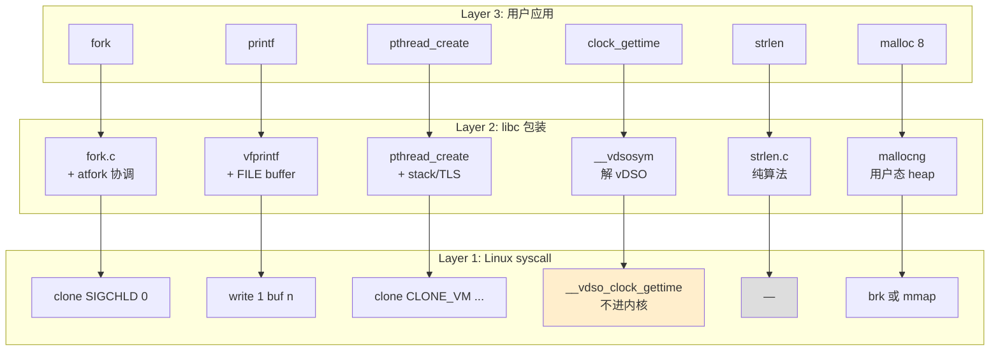
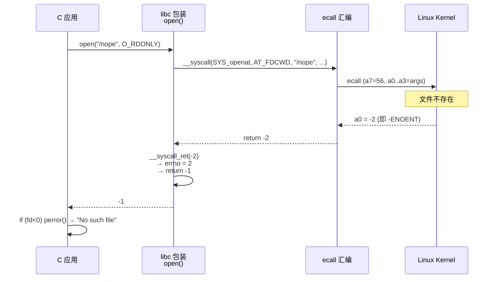
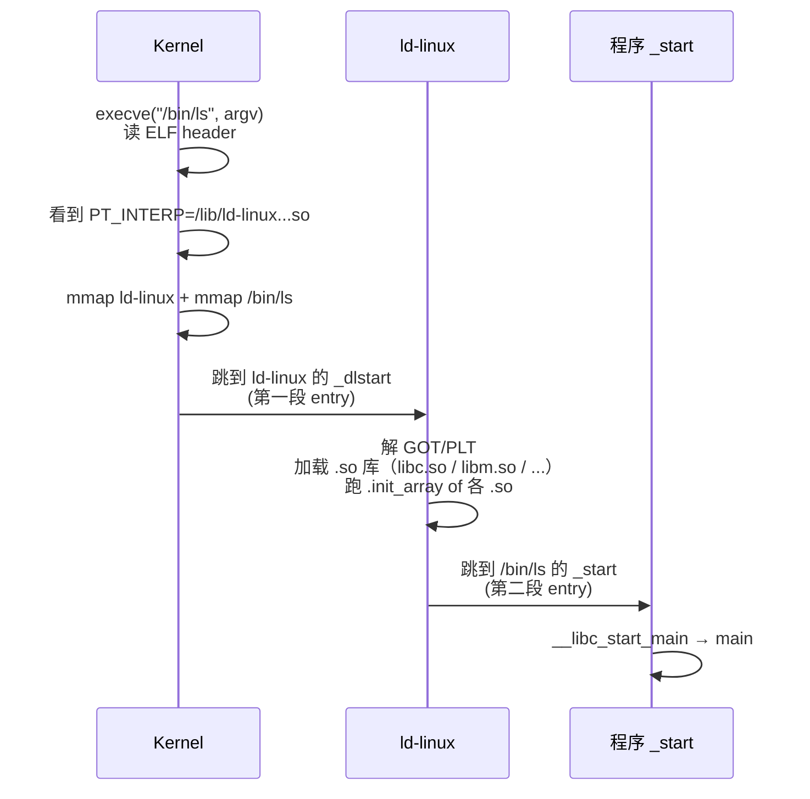

# 04-14 — GNU glibc / libc syscall ABI：从 C 函数到内核

> **核心问题：**
> 1. `fork()` 是 syscall 吗？为什么 musl 里它内部调 `clone(SIGCHLD, 0)`？
> 2. 内核明明返回 `-22`（负数），用户态看到的 `errno = EINVAL` 是怎么来的？
> 3. 为什么 `strlen()`、`qsort()` 不需要 syscall 而 `printf()` 需要？
> 4. vDSO 到底"省"了什么？为什么 `clock_gettime` 调一次只要 ~10 ns 而 `read` 要 ~100 ns？
> 5. ELF 入口是 `_start` 不是 `main`，那 `_start` 之前还有谁？动态链接的"二段式"是哪两段？
> 6. 静态链接 musl 的二进制为什么和动态链接 glibc 的差不多大却没 `ld-linux` 依赖？
> 7. `pthread_create` 怎么就一个 `clone(CLONE_VM | CLONE_THREAD | ...)` 解决了？
>
> **一句话答案：** **libc = POSIX 函数语义 ↔ Linux syscall ABI 的桥**——它做错误码翻译（−errno → errno+−1）、状态管理（FILE\* / TLS / atfork）、初始化（`_start` → `__libc_start_main` → `main`）、性能加速（buffered I/O / vDSO）、动态链接协调（ld-linux 解 GOT/PLT）。raw syscall 只是裸 ABI，**libc 才是 C 程序员实际看到的 ABI**。
>
> **本笔记定位：** 04 syscall 三件套 **第 3 篇**。
> - [04-12](04-12-syscall-arch-abi.md) 讲架构层 ABI（寄存器约定 / `ecall`/`syscall`/`svc`）。
> - [04-13](04-13-syscall-linux-list.md) 讲 Linux 提供的 ~440 条 syscall 列表。
> - **本篇** 讲"用户态最后一公里"——C 程序员写的 `fork()`/`printf()`/`pthread_create()` 怎么变成那条 `ecall`。
>
> 与 [00-16](00-16-syscall-abi-evolution.md) 关系：00-16 横向枚举 17 种 libc 实现 + io_uring 演化史；本篇纵向钻"包装层是什么形状"。**不重复 17 实现的列表**。

---

## 0. 阅读前置 + 关键问题

**前置：** 必须先读 [04-12](04-12-syscall-arch-abi.md)（不然不懂 a7=号 / a0..a5=参 / a0=ret 这套寄存器约定为什么这么排）和 [04-13](04-13-syscall-linux-list.md)（不然每条函数表都在引用陌生的 syscall 号）。

**用 musl 而非 glibc 当主要例子的原因：**
- glibc 3 M+ 行，宏嵌套 4 层，gen 层多到读源码读不动；
- musl 80 K 行，所有 syscall 包装平均 5–30 行 C，**直接看就懂**；

源码引用都给绝对路径 + 行号，方便对照。

---

## 1. libc 是什么 / 为什么需要

### 1.1 raw syscall 已经够用，为什么还要一层 libc？

理论上你可以这样直接 syscall 写 hello world（RV64，无 libc）：

```c
// no_libc_hello.c — 用 ecall 直接进内核
#include <sys/syscall.h>
#include <unistd.h>
int main(void) {
    register long a7 __asm__("a7") = SYS_write;       // 64
    register long a0 __asm__("a0") = 1;               // fd=stdout
    register long a1 __asm__("a1") = (long)"Hello\n";
    register long a2 __asm__("a2") = 6;
    __asm__ volatile ("ecall" : "=r"(a0) : "r"(a7), "0"(a0), "r"(a1), "r"(a2) : "memory");
    a7 = SYS_exit_group; a0 = 0;
    __asm__ volatile ("ecall" : : "r"(a7), "r"(a0));
    __builtin_unreachable();
}
```

能跑。但马上撞墙：

| 想做的事 | raw syscall 缺什么 |
|---------|-------------------|
| `if (write(fd,p,n) < 0) perror(...)` | 没有 `errno`（内核回 `−22`，你得自己翻译 `EINVAL`） |
| `printf("%d", x)` | 没有 buffered I/O（每个字符 1 次 syscall = 慢 10×） |
| 多线程时各自 `errno` | 没有 TLS（thread-local errno） |
| `malloc(8)` | 没有 heap 管理（你只有 `brk`/`mmap`） |
| `fopen`/`fclose` | 没有 `FILE *` 状态机 |
| 跨内核版本 | 没有"老 syscall 缺失时降级"的兜底（glibc/musl 大量做） |
| 跨架构 | 没有架构无关 API（每个架构 syscall 号 + ABI 都不同） |
| `pthread_create` | 没有 stack 分配 / TLS 初始化 / TID 管理 |
| 启动 / 退出 | 没有 `_start` / `atexit` / TLS 初始化 |
| POSIX 兼容 | `system()` / `popen()` 这种"组合 syscall"的高层函数 |
| 性能（无 trap） | 没有 vDSO 加速（`clock_gettime`、`getcpu`） |

libc 的存在就是把上面这一栏全部填上。

### 1.2 libc 提供的"五件套"

```mermaid
flowchart LR
    APP[C 程序<br/>fork printf malloc<br/>pthread_create]:::app
    LIBC[libc 包装层]:::libc
    KERN[Linux Kernel<br/>SYS_clone SYS_write<br/>SYS_brk SYS_mmap]:::kern

    APP -->|POSIX/ISO C API| LIBC
    LIBC -->|ecall a7=N a0..a5| KERN
    KERN -->|a0=ret -errno| LIBC
    LIBC -->|errno+rval| APP

    LIBC -. 五件套 .- F1[1. errno 翻译]
    LIBC -. .- F2[2. 状态管理<br/>FILE* / TLS / atfork]
    LIBC -. .- F3[3. 启动 / 终止<br/>_start atexit]
    LIBC -. .- F4[4. 性能加速<br/>buffer / vDSO]
    LIBC -. .- F5[5. POSIX 桥<br/>fork=clone wait=wait4]

    classDef app fill:#fef,stroke:#666
    classDef libc fill:#fec,stroke:#666
    classDef kern fill:#cef,stroke:#666
```

---

## 2. 三层映射：C 函数 → libc 包装 → syscall

下面 7 个例子，覆盖"几乎所有 libc 包装策略"。

### 2.1 `fork()` → `clone(SIGCHLD, 0)` —— 1:1 名字不同

`fork()` 不是 syscall（**至少在 RV64 不是**）。RV64 内核压根没有 `__NR_fork`，只有 `__NR_clone (220)` 和 `__NR_clone3 (435)`。

`/home/heke/tgln/stage2/material/libc/musl/src/process/_Fork.c:29-43`

```c
pid_t _Fork(void)
{
    pid_t ret;
    sigset_t set;
    __block_all_sigs(&set);
    LOCK(__abort_lock);
#ifdef SYS_fork
    ret = __syscall(SYS_fork);          // x86 / 旧架构
#else
    ret = __syscall(SYS_clone, SIGCHLD, 0);  // RV64 / aarch64 走这里
#endif
    __post_Fork(ret);
    __restore_sigs(&set);
    return __syscall_ret(ret);
}
```

`fork()` 还套了一层（`/home/heke/tgln/stage2/material/libc/musl/src/process/fork.c:47-90`），先跑 `__fork_handler(-1)`、上 atfork 锁、屏蔽信号，然后才调 `_Fork()`。**这就是为什么 raw syscall 写不出 POSIX 语义的 `fork`** —— pthread_atfork 注册的回调、stdio 锁、malloc 锁，全要 libc 协调。

### 2.2 `exit(n)` → `exit_group(n)`

`/home/heke/tgln/stage2/material/libc/musl/src/exit/_Exit.c:4-8`

```c
_Noreturn void _Exit(int ec)
{
    __syscall(SYS_exit_group, ec);   // 退所有线程
    for (;;) __syscall(SYS_exit, ec);// 兜底（理论永远到不了）
}
```

`exit()`（`/home/heke/tgln/stage2/material/libc/musl/src/exit/exit.c:30-47`）则在 `_Exit` 之前依次跑 `__funcs_on_exit()`（atexit handlers）、`__libc_exit_fini()`（fini_array / `_fini`）、`__stdio_exit()`（flush stdout）。**`exit_group` 退进程所有线程，`exit` 只退当前线程**——POSIX `exit()` 语义是"退进程"，所以包装到 `exit_group`。

### 2.3 `printf("...")` → buffered → `write(1, ...)`

`printf` 走 `vfprintf` → 写到 `stdout` 的 `FILE *` buffer。当 buffer 满 / 遇到 `\n`（行缓冲）/ `fflush` 时，才一次性 `__syscall(SYS_write, 1, buf, n)` flush 出去。**1 次 syscall 打 4 KB，比 4096 次 syscall 打 1 byte 快 ~100×。** 这是 libc 缓冲的核心收益。

### 2.4 `malloc(8)` → `brk` 或 `mmap`

malloc 实现一个用户态 heap。第一次 `malloc(8)` 内核里没有 heap，libc 调 `__syscall(SYS_brk, 0)` 拿当前 program break，再 `brk(brk + N)` 扩 heap。后续小 malloc **不进内核**，从 heap 直接切；大 malloc（>128 KB）走 `mmap(MAP_ANONYMOUS)` 单独映射，free 时 `munmap`。

> **关键观察：** `malloc(8)` 在 99% 情况下是**纯用户态操作**，只有 heap 不够时才进内核。这是为什么 malloc 比 syscall 快几个数量级。

### 2.5 `pthread_create()` → `clone(CLONE_VM | ...)`

`/home/heke/tgln/stage2/material/libc/musl/src/thread/pthread_create.c:243-355`

```c
unsigned flags = CLONE_VM | CLONE_FS | CLONE_FILES | CLONE_SIGHAND
    | CLONE_THREAD | CLONE_SYSVSEM | CLONE_SETTLS
    | CLONE_PARENT_SETTID | CLONE_CHILD_CLEARTID | CLONE_DETACHED;
...
ret = __clone((c11 ? start_c11 : start), stack, flags, args,
              &new->tid, TP_ADJ(new), &__thread_list_lock);
```

`fork` 与 `pthread_create` **共用同一条 syscall（`clone`）**，差别只在 flags：
- `fork`: `SIGCHLD`（共享 0 件事，子退出发 SIGCHLD）；
- `pthread_create`: `CLONE_VM | CLONE_FS | CLONE_FILES | CLONE_SIGHAND | CLONE_THREAD`（地址空间 / 文件 / 信号都共享）。

libc 还要分配 stack（`mmap`）、初始化 TLS、设置 cancel 状态、注册到线程链表——syscall 只占代码 1%。

### 2.6 `gettimeofday()` / `clock_gettime()` → vDSO（不进内核！）

vDSO 把内核里的几行代码 export 到用户态的一个内存页，libc 直接 call function pointer。**没有 `ecall`，没有特权切换。**
（详见第 7 章。）

### 2.7 `strlen()` / `qsort()` / `memcpy()` → 纯 libc 无 syscall

字符串、排序、内存拷贝是**纯算法**，全在用户态完成，**完全不进内核**。这就是为什么这些函数能 inline / 用 SIMD 优化，跟 syscall 完全是两个性能级别。

### 2.8 三层映射小结图



---

## 3. errno 机制深度解析

### 3.1 内核约定：a0/x0/rax 返回 −errno

Linux 内核 syscall 的返回值约定：
- `[-4096, -1]` 范围内的值 = 错误码（取负），`-22 = -EINVAL`
- 其他值 = 成功结果（fd、count、addr、pid…）

为什么是 `-4096`？因为 errno 值最大 ~133（参见 `/usr/include/asm-generic/errno.h`），留 4096 当 sentinel 既能容纳所有 errno 又给"超大返回值"留足空间（mmap 地址可以是 `0x7f...`，远大于 4096）。

### 3.2 `__syscall_ret`：把 −errno 转成 `errno + return -1`

`/home/heke/tgln/stage2/material/libc/musl/src/internal/syscall_ret.c:4-11`（**整个 musl 项目最重要的 11 行之一**）

```c
long __syscall_ret(unsigned long r)
{
    if (r > -4096UL) {       // 即 r 落在 [-4095, -1]，等价 (long)r < 0 && (long)r >= -4095
        errno = -r;
        return -1;
    }
    return r;
}
```

**注意：** `r > -4096UL` 是 unsigned 比较，把负数当超大正数看。`-1UL = 0xFFFFFFFFFFFFFFFF`，`-4096UL = 0xFFFFFFFFFFFFF000`，所以 `r > 0xFFFFFFFFFFFFF000` 等价于 `r ∈ [0xFFFFFFFFFFFFF001 .. 0xFFFFFFFFFFFFFFFF]` 等价于 `r ∈ [-4095, -1]`（signed）。

### 3.3 `__syscall(...)` 宏链

`/home/heke/tgln/stage2/material/libc/musl/src/internal/syscall.h:38-45`

```c
#define __SYSCALL_NARGS_X(a,b,c,d,e,f,g,h,n,...) n
#define __SYSCALL_NARGS(...) __SYSCALL_NARGS_X(__VA_ARGS__,7,6,5,4,3,2,1,0,)
#define __SYSCALL_DISP(b,...) __SYSCALL_CONCAT(b,__SYSCALL_NARGS(__VA_ARGS__))(__VA_ARGS__)
#define __syscall(...) __SYSCALL_DISP(__syscall,__VA_ARGS__)
#define syscall(...) __syscall_ret(__syscall(__VA_ARGS__))
```

`__syscall(N, a, b)` 通过参数计数宏 → `__syscall2(N, a, b)` → `__asm__ ("ecall")`。
`syscall(...)`（小写）多套了一层 `__syscall_ret`，所以**返回值已经是 POSIX 语义**（−1+errno）。

### 3.4 RV64 ecall 内联：`syscall_arch.h`

`/home/heke/tgln/stage2/material/libc/musl/arch/riscv64/syscall_arch.h:1-13`

```c
#define __asm_syscall(...) \
    __asm__ __volatile__ ("ecall\n\t" \
    : "=r"(a0) : __VA_ARGS__ : "memory"); \
    return a0;

static inline long __syscall0(long n)
{
    register long a7 __asm__("a7") = n;
    register long a0 __asm__("a0");
    __asm_syscall("r"(a7))
}
```

`register long X __asm__("aN") = ...` 是 GCC 扩展，把 C 变量绑定到具体寄存器。一行 `"ecall\n\t"` + `"memory"` clobber——告诉编译器"这里发生了不知道修改了什么内存的事"，触发寄存器 spill / reload，避免 stale 值。

### 3.5 多线程 errno：thread-local

errno **不是全局变量**，而是 TLS（thread-local storage）变量。否则 thread A 调 syscall 失败后，thread B 可能正好读 errno 拿到 A 的错。

musl 的 errno 实现（`/home/heke/tgln/stage2/material/libc/musl/src/errno/__errno_location.c`）：

```c
int *__errno_location(void)
{
    return &__pthread_self()->errno_val;   // TLS：从线程描述符里取
}
#define errno (*__errno_location())   // <errno.h> 里的宏
```

每个 pthread 的 `struct pthread`（musl 内部）都有一个 `errno_val` 字段，访问 `errno` 实际是 `(*__errno_location())`，跳到当前线程的 TLS slot。

### 3.6 errno 流（关键 takeaway）



**关键：** errno **不是 syscall 返回的**，而是 **libc 在 __syscall_ret 里设置的**。内核根本不知道 errno 的存在。

---

## 4. POSIX vs Linux：函数 ≠ syscall

POSIX 是**接口标准**（IEEE 1003.1），Linux 是**实现**。glibc/musl 让 Linux syscall 看起来像 POSIX 函数。一些"看起来很简单"的 POSIX 函数实际是组合多个 syscall：

| POSIX 函数 | Linux syscall | 关系 | 备注 |
|----------|---------------|------|------|
| `pthread_create` | `clone(CLONE_VM\|CLONE_THREAD\|...)` | 1:1 名不同 + 大量配套 | mmap stack / TLS init |
| `sleep(s)` | `nanosleep` | 1:1 | POSIX 兼容名 |
| `popen` | `pipe + fork + exec + dup2 + close` | 1:N | 6+ syscall |
| `system` | `fork + execve + waitpid` | 1:3 | 还要屏蔽 SIGCHLD/SIGINT |
| `fopen` | `openat + (fstat) + 内部 FILE 状态` | 1:1+ | mode 翻译 + alloc FILE\* |
| `fclose` | `close` | 1:1+ | flush + free FILE\* |
| `tmpfile` | `openat(O_TMPFILE) 或 unlink 后 open` | 1:1 或 1:2 | 旧 kernel 兜底 |
| `getline` | `read` | 1:N | 反复 read 直到 \n |
| `dirent / readdir` | `getdents64` | 缓冲 | libc 缓存批量目录项 |
| `glob` | `openat + getdents + ...` | 1:N | 纯通配匹配 |
| `localtime_r` | `read /etc/localtime`（启动一次） | 缓存 | tz 数据库解析 |
| `strncpy` | — | **纯 libc** | 无 syscall |
| `qsort` | — | **纯 libc** | 无 syscall |
| `printf` | `write` | 1:N | 缓冲累积 |

> **观察：** POSIX 函数 ≠ syscall 1:1 —— 这是 libc 存在的核心理由。

---

## 5. 启动代码：`_start` → `__libc_start_main` → `main`

很多人以为 ELF 程序从 `main` 开始。**错。** `main` 只是 libc 调用的一个普通函数。真正的 entry 是 `_start`。

### 5.1 RV64 `_start` 汇编（musl）

`/home/heke/tgln/stage2/material/libc/musl/arch/riscv64/crt_arch.h:1-19`

```asm
_start:
    .option push
    .option norelax
    lla gp, __global_pointer$    // 设置 RV64 GP 寄存器（小 data 优化用）
    .option pop
    mv a0, sp                    // a0 = sp，传给 _start_c（指向 [argc, argv..., NULL, envp..., NULL, auxv]）
    lla a1, _DYNAMIC             // a1 = _DYNAMIC（动态链接用，静态时 weak/0）
    andi sp, sp, -16             // 16-byte 对齐栈
    tail _start_c                // 尾调用 C 函数
```

注意：**没保存任何寄存器**（kernel 把 sp 设好，其余寄存器初值随便）。

### 5.2 `_start_c` —— 解 stack 拿 argc/argv

`/home/heke/tgln/stage2/material/libc/musl/crt/crt1.c:14-19`

```c
hidden void _start_c(long *p)
{
    int argc = p[0];
    char **argv = (void *)(p+1);
    __libc_start_main(main, argc, argv, _init, _fini, 0);
}
```

stack 布局（execve 设置）：

```
[ argc        ] ← sp (=p)
[ argv[0]     ]
[ argv[1]     ]
[ ...         ]
[ argv[argc] ] = NULL
[ envp[0]     ]
[ envp[1]     ]
[ ...         ]
[ envp[N]    ] = NULL
[ auxv: AT_PHDR / AT_PAGESZ / AT_RANDOM / AT_SYSINFO_EHDR / ...]
[ AT_NULL     ]
```

`argc` 在最底，往上是 argv 指针数组、envp 指针数组、**auxv（辅助向量）**。auxv 关键条目：
- `AT_PHDR` — 程序头表地址（动态链接器用）
- `AT_PAGESZ` — 页大小
- `AT_RANDOM` — 16 字节随机（stack canary 用）
- `AT_SYSINFO_EHDR` — **vDSO 在内存的地址**（第 7 章详述）
- `AT_HWCAP` — CPU 特性 bitmap
- `AT_EXECFN` — 可执行文件名

### 5.3 `__libc_start_main` —— 6 件大事

`/home/heke/tgln/stage2/material/libc/musl/src/env/__libc_start_main.c:23-87`

```c
void __init_libc(char **envp, char *pn)
{
    // 1. 解析 auxv → 拿 page_size / hwcap / vDSO base / TLS info / canary 种子
    libc.auxv = auxv = (void *)(envp+i+1);
    for (i=0; auxv[i]; i+=2) if (auxv[i]<AUX_CNT) aux[auxv[i]] = auxv[i+1];
    __hwcap = aux[AT_HWCAP];
    libc.page_size = aux[AT_PAGESZ];

    // 2. 初始化 TLS（pthread / errno / canary 用）
    __init_tls(aux);
    __init_ssp((void *)aux[AT_RANDOM]);

    // 3. setuid 安全检查（防 fd 0/1/2 被关闭后劫持）
    ...
}

int __libc_start_main(...)
{
    __init_libc(envp, argv[0]);
    return libc_start_main_stage2(main, argc, argv);
}

static int libc_start_main_stage2(...)
{
    __libc_start_init();          // 4. 跑 _init / .init_array / 全局构造（C++）
    exit(main(argc, argv, envp)); // 5. 调 main，main 返回后 6. exit(rc)
    return 0;
}
```

**6 件事：**
1. 解 auxv → 拿系统信息（vDSO 地址、TLS 模板、CPU 特性）
2. 初始化 TLS（每线程的 errno、pthread descriptor）
3. SSP 初始化（stack canary 防溢出）
4. 跑 `.init_array`（C 全局构造、C++ 静态对象）
5. 调用 `main`
6. main 返回后调 `exit(ret)` → flush stdio → atexit → `.fini_array` → `_Exit` → `SYS_exit_group`

### 5.4 PIE / Scrt1.c 区别

`/home/heke/tgln/stage2/material/libc/musl/crt/Scrt1.c:1` 整个文件就一行 `#include "crt1.c"`。**为什么有两套？** 

- `crt1.o` 用于静态/非-PIE 可执行文件（绝对地址 OK）。
- `Scrt1.o` 用于 PIE（位置无关可执行）—— 编译时多加 `-fPIE`，使 `lla a1, _DYNAMIC` 等符号引用走 GOT。

链接时编译器根据 `-pie`/`-no-pie` 选哪个。

---

## 6. 动态链接器 ld-linux

### 6.1 ELF interp 字段

`readelf -l /bin/ls | grep interp`：

```
[Requesting program interpreter: /lib/ld-linux-riscv64-lp64d.so.1]
```

ELF `PT_INTERP` 段告诉内核"先跑这个解释器，让它去加载我"。

### 6.2 二段式 entry：先跑 ld-linux，它再跑 _start



**静态链接** 没这一段：内核直接跳 `_start`，`PT_INTERP` 字段不存在。这就是为什么静态二进制不依赖 `/lib/ld-linux`。

### 6.3 `_dlstart` 走读

`/home/heke/tgln/stage2/material/libc/musl/ldso/dlstart.c:21-60`

```c
hidden void _dlstart_c(size_t *sp, size_t *dynv)
{
    // 1. 解析 stack：拿 argc/argv/auxv
    int argc = *sp;
    char **argv = (void *)(sp+1);
    ...
    size_t *auxv = ...;

    // 2. 自重定位（ld-linux 自己也是 PIE，需要把自己的 .rela.dyn 处理一遍）
    base = aux[AT_BASE];
    ...
    // 3. 跳到 dynlink.c::__dls2 → __dls3 → 加载主程序的依赖 → 跳 _start
}
```

`dynlink.c` 整 2439 行就在做这件事——加载 `.so`、解 GOT/PLT 槽位、处理 `__attribute__((constructor))`、`dlopen`/`dlsym` 也都在这。

### 6.4 GOT / PLT —— 延迟绑定原理

未 lazy 绑定时（`LD_BIND_NOW=1`），所有外部符号链接时就解。

lazy 绑定（默认）：
- 第 1 次调用 `printf`：跳 PLT 槽 → PLT 槽跳 ld-linux 解析器 → 解析后填回 GOT 槽 → 调真正 printf；
- 第 2+ 次调用：直接跳 PLT 槽 → 看 GOT 槽已填好 → 直接调 printf。

收益：启动时不解所有符号（一个大型 GUI 程序可能 10000+ 外部符号）。代价：第一次调用慢一点 + GOT 槽是 RW（可被攻击者改写——所以现代 hardening 用 RELRO + BIND_NOW）。

### 6.5 `LD_PRELOAD` / `LD_LIBRARY_PATH`

- `LD_LIBRARY_PATH=/x/y` — 改 ld-linux 找 `.so` 的搜索路径（在 `/lib`/`/usr/lib` 之前）。
- `LD_PRELOAD=/x/foo.so` — 在所有其他 `.so` 之前 dlopen 这个，**符号优先匹配它**。可用来 hook `malloc`、`open` 做调试 / sandbox。

setuid 程序里 ld-linux 会忽略这两个变量（防提权）。

### 6.6 静态链接 vs 动态链接

| | 静态 | 动态 |
|---|------|------|
| `_start` 之前 | 无 | 跑 ld-linux |
| 单二进制大小 | 大（包含所有依赖） | 小 |
| 内存共享 | 无（每进程一份代码） | `.so` 全局共享 RX 段 |
| 升级 libc | 重新编译 | 替换 `.so` 即可 |
| 启动速度 | 快（无 ld 启动开销） | 慢一点 |

> **musl 故意小：** 静态链接 musl 二进制 + busybox 一套整体 ~500 KB。这是 Alpine Linux 整个 distro 5 MB 起步的关键。

---

## 7. vDSO —— "不进内核的 syscall"

### 7.1 vDSO 是什么

vDSO = **virtual Dynamic Shared Object**。内核启动时构造一个小 ELF（几 KB），里面塞了几条 hot-path syscall 的纯用户态实现。每个进程 fork 时这个 ELF 被映射到地址空间（`AT_SYSINFO_EHDR` 指向它）。

`cat /proc/self/maps | grep vdso`：

```
ffffffff7fffe000-ffffffff7ffff000 r-xp 00000000 00:00 0   [vdso]
```

### 7.2 哪些 syscall 走 vDSO

RV64 (Linux 6.x) vDSO 提供：
- `__vdso_clock_gettime` / `__vdso_clock_gettime64` —— 读时钟（最热）
- `__vdso_gettimeofday`
- `__vdso_clock_getres`
- `__vdso_getcpu`
- `__vdso_rt_sigreturn`（信号处理 trampoline，不算性能优化）
- `__vdso_flush_icache`（RISC-V 特有，刷 I-cache）

x86_64 多一个 `__vdso_time`。aarch64 类似。

### 7.3 musl 怎么找 vDSO

`/home/heke/tgln/stage2/material/libc/musl/src/internal/vdso.c:61-115`

```c
void *__vdsosym(const char *vername, const char *name)
{
    // 1. 从 auxv 找 AT_SYSINFO_EHDR（vDSO ELF base）
    for (i=0; libc.auxv[i] != AT_SYSINFO_EHDR; i+=2)
        if (!libc.auxv[i]) return 0;
    Ehdr *eh = (void *)libc.auxv[i+1];

    // 2. 解 program header → 拿 PT_DYNAMIC
    Phdr *ph = (void *)((char *)eh + eh->e_phoff);
    for (i=0; i<eh->e_phnum; i++, ph=...) {
        if (ph->p_type == PT_LOAD) base = (size_t)eh + ph->p_offset - ph->p_vaddr;
        else if (ph->p_type == PT_DYNAMIC) dynv = ...;
    }

    // 3. 解 dynamic section → 拿 strtab / symtab / hash
    for (i=0; dynv[i]; i+=2) {
        switch(dynv[i]) {
        case DT_STRTAB: strings = p; break;
        case DT_SYMTAB: syms = p; break;
        ...
        }
    }

    // 4. 在 symtab 里查 name + 验 version → 返回函数地址
    for (i=0; i<nsym; i++) {
        if (strcmp(name, strings+syms[i].st_name)) continue;
        if (versym && !checkver(verdef, versym[i], vername, strings)) continue;
        return (void *)(base + syms[i].st_value);
    }
    return 0;
}
```

`clock_gettime` 调用方（`/home/heke/tgln/stage2/material/libc/musl/src/time/clock_gettime.c:34-53`）：

```c
static int cgt_init(clockid_t clk, struct timespec *ts)
{
    void *p = __vdsosym(VDSO_CGT_VER, VDSO_CGT_SYM);  // "LINUX_4.15", "__vdso_clock_gettime"
    ...
    a_cas_p(&vdso_func, (void *)cgt_init, p);
    return f ? f(clk, ts) : -ENOSYS;
}
```

**首次调用** 跑 `cgt_init` 解析 vDSO 符号，**通过 atomic CAS** 把 `vdso_func` 替换成真函数指针。**之后所有调用** 直接 call function pointer，**0 syscall**。

### 7.4 性能对比

| 方式 | 一次 `clock_gettime(CLOCK_MONOTONIC)` 开销 | 原因 |
|------|--------|------|
| Raw `ecall` syscall | ~80–200 ns | 特权切换 + trap frame 保存 / 恢复 |
| **vDSO** | **~10–30 ns** | 纯函数调用 + 读 vDSO 共享数据页 |

vDSO 数据页结构（内核每 tick 更新）：
- `tk_read_base.cycle_last` — 上一次 tsc/timer 值
- `mult` / `shift` — cycle → ns 的换算系数
- `mask` / `cs_mode` — clocksource 类型

vDSO 函数读数据页 → 读硬件计数器（RV64 `csrr` 读 `time` CSR）→ 用 mult/shift 算出 ns → 加上 boot 时间偏移 → 写 `*ts`。

### 7.5 为什么不是所有 syscall 走 vDSO

vDSO 只能放：
- 纯读取硬件状态（时钟、CPU 号）
- 不修改内核数据结构
- 不需要内核特权

`open` / `write` / `mmap` / `clone` 都需要内核改全局表（fd table、page tables、task list），不可能在 vDSO 实现。

> **未来：** io_uring / sigset 等新机制把"批量 syscall 提交 + 共享 ringbuffer 通知"做成另一种 vDSO-like 优化（参 [00-16](00-16-syscall-abi-evolution.md)）。

---

## 8. glibc / musl / uclibc-ng / picolibc / baselibc / relibc 包装策略对比

不重复 [00-16](00-16-syscall-abi-evolution.md) 的"17 实现谱系"，**focus 在"包装 syscall 时怎么做"**。

### 8.1 对比表

| libc | 总规模 (lines) | POSIX 完整度 | 启动复杂度 | 线程模型 | errno 实现 | vDSO | 静态首选场景 |
|------|---------|------------|------|---------|--------|------|---------|
| **glibc** | ~3 M（含 locale/iconv） | 100% + GNU ext | 重（NPTL 绑死） | NPTL | TLS（`__errno_location`） | 是 | 桌面 Linux distro |
| **uclibc-ng** | ~150 K | ~85%（裁剪） | 轻 | NPTL or LinuxThreads | TLS or per-process | 部分 | OpenWrt / Buildroot |
| **picolibc** | ~250 K (newlib fork) | 子集（无线程 / 无 dlopen） | 极轻 | 无（单线程） | 全局 | 否 | MCU / 裸机 / Zephyr |
| **baselibc** | **2 K** | 极小子集（printf/string/atoi） | 无 `_start` | 无 | 无 errno | 否 | SBI / U-Boot / 引导器 |
| **relibc** | ~50 K Rust | ~70%（在做） | 中 | Rust thread | TLS | 否 | Redox / Rust-native OS |

> **size 注：** `wc -l` 数字是粗略，glibc 的源码里大量 generated 代码 + locale 数据让总量虚高；按"实际 syscall 包装代码"算 glibc 也就 ~30 万行。

### 8.2 包装策略差异（重要）

- **glibc** "everything is a feature"：每 syscall 多版本（cancel 点 / `_l` locale）、IFUNC / LD_AUDIT、locale/iconv/NSS/resolver 启动重。
- **uclibc-ng** "configurable"：Kconfig 裁剪（wide char / IPv6 / dlopen），老代码现代化滞后。
- **picolibc** "no syscall, just stub"：提供函数签名，syscall 由用户实现（Zephyr/FreeRTOS 把 stub 实现成 RTOS API）。

### 8.3 同一个函数三家对比：`fork()`

| libc | 实现位置 | 行数 | 实质 |
|------|--------|------|------|
| musl | `src/process/_Fork.c` | 14 | `__syscall(SYS_clone, SIGCHLD, 0)` |
| glibc | `nptl/fork.c` + `sysdeps/unix/sysv/linux/arch-fork.h` 三层 | ~200 | 加 atfork / locale / thread cleanup |
| uclibc-ng | `libc/sysdeps/linux/common/fork.c` | ~30 | 简化 atfork |
| picolibc | 不实现 | 0 | freestanding 没有 fork 概念 |

> **学习路径：** 先读 musl，理解清楚再去看 glibc 加了哪些"装饰"。直接读 glibc 会被宏嵌套淹没。

---

## 9. 常用 libc 函数 → syscall 映射表（40 条速查）

类型列说明：
- **1:1** = 函数名近似 syscall，单次 syscall
- **1:N** = 一次函数调多个 syscall
- **buf** = 用户态缓冲，syscall 出现频率 < 调用频率
- **vDSO** = 不进内核
- **纯libc** = 完全用户态，无 syscall

| C 函数 | 对应 Linux syscall（RV64） | 类型 | 备注 |
|--------|------|------|------|
| `fork()` | `clone(SIGCHLD, 0)` | 1:1 | RV64 无 SYS_fork |
| `vfork()` | `clone(CLONE_VM\|CLONE_VFORK\|SIGCHLD)` | 1:1 | |
| `pthread_create()` | `clone(CLONE_VM\|CLONE_THREAD\|...)` + mmap stack + TLS init | 1:N | 见 §2.5 |
| `exit(0)` | `exit_group(0)` (前置 atexit/fini/flush) | 1:N | 见 §2.2 |
| `_Exit(0)` | `exit_group(0)` | 1:1 | 不跑 atexit |
| `pthread_exit()` | `exit(...)` 单线程退 | 1:1 | + cancel cleanup |
| `getpid()` / `getppid()` | 同名 | 1:1 | musl ≥1.2 缓存 pid |
| `wait` / `waitpid` | `wait4` | 1:1 | |
| `system("ls")` | `fork + execve + waitpid` | 1:N | 见 §4 |
| `popen` | `pipe2 + fork + dup2 + execve` | 1:N | 6+ syscall |
| `kill` | `kill` | 1:1 | |
| `signal` / `sigaction` | `rt_sigaction` | 1:1 | musl 一律转 rt_ 版本 |
| `pause` | `rt_sigsuspend` | 1:1 | RV64 无 SYS_pause |
| `alarm` | `setitimer(ITIMER_REAL, ...)` | 1:1 | |
| `sleep` / `nanosleep` | `nanosleep` 或 `clock_nanosleep` | 1:1 | |
| `clock_gettime(MONOTONIC)` | **vDSO** `__vdso_clock_gettime` | vDSO | 见 §7 |
| `gettimeofday` / `time` | 内部转 `clock_gettime` | 1:1 | |
| `localtime_r` | 启动 `read /etc/localtime` 一次缓存 | 缓存+ | 大部分调用 0 syscall |
| `open` / `stat` | `openat(AT_FDCWD,...)` / `newfstatat` | 1:1 | RV64 无 SYS_open/stat |
| `close` / `read` / `write` / `lseek` | 同名 | 1:1 | |
| `fopen` / `fclose` | `openat + alloc FILE*` / `flush + close` | 1:1+ | |
| `fread` / `fwrite` | `read` / `write` 走 buffer | buf | 4KB buf 一次 syscall |
| `fflush` | `write` flush buffer | 1:1 | 没数据时 0 syscall |
| `printf` / `puts` | `write(1, ...)` (buffered) | buf | 见 §2.3 |
| `mmap` | `mmap` | 1:1 | |
| `malloc(N)` small / heap hit | — | 0 syscall | 99% 命中 |
| `malloc(N)` large | `mmap(MAP_ANONYMOUS)` | 1:1 | >阈值 |
| `malloc` heap grow | `brk` | 1:1 | 偶发 |
| `free` | — | 0 syscall | |
| `socket` / `connect` / `accept` | 同名（accept→accept4） | 1:1 | |
| `pthread_mutex_lock` uncontended | (atomic CAS) | 0 syscall | |
| `pthread_mutex_lock` contended | `futex(..., FUTEX_WAIT, ...)` | 1:1 | 阻塞才进内核 |
| `pthread_cond_wait` | `futex(...)` | 1:1 | |
| `dlopen("x.so")` | `openat + mmap + ...` | 1:N | ld-linux 内 |
| `strlen` / `strcmp` / `memcpy` | — | 纯libc | SIMD opt |
| `qsort` / `bsearch` / `printf %d itoa` | — | 纯libc | |
| `getcpu()` | **vDSO** `__vdso_getcpu` | vDSO | |

### 9.1 看完表的三个观察

1. **大部分 libc 函数 1:1 包装到 syscall**——核心就是 errno + 名字桥接。
2. **几个高频函数走 buffer 或 vDSO**——这是 libc 性能优化的主战场。
3. **算法函数（str/qsort/itoa）完全无 syscall**——这是 libc 体积大头但 syscall 占 0%。

---


按"先静态、再动态、最后 vDSO"渐进路线。

### 10.1 阶段 P0 —— 仅静态链接，跑 hello world

- [ ] 实现 `_start`（RV64 汇编：set GP + tail _start_c）
- [ ] 实现 `_start_c` → 调 `__libc_start_main`
- [ ] 实现 `__libc_start_main`：解 auxv → init TLS → 调 main
- [ ] 实现 `exit_group` / `write` / `read` / `openat` / `close` / `mmap` / `brk` syscall
- [ ] 在 libc 提供 `__syscall_ret`（11 行抄 musl）
- [ ] errno 初版可以**只支持单线程**（全局变量）
- [ ] 提供 `printf` / `malloc` / `strcmp` / `memcpy`（直接抄 musl）

> **目标：** 静态链接的 hello world 跑起来。**不需要 ld-linux**。

### 10.2 阶段 P1 —— 多线程

- [ ] 实现 `clone3` syscall + `set_tid_address` / `set_robust_list`
- [ ] errno 改 TLS：`__errno_location()` 返回 `__pthread_self()->errno_val`
- [ ] 实现 `pthread_create` / `_join` / `_mutex_lock` / `_cond_wait`
- [ ] 实现 `futex` syscall（mutex/cond 阻塞核心）
- [ ] atfork 机制（fork 时锁链）

### 10.3 阶段 P2 —— 动态链接

- [ ] 实现 `mmap MAP_FIXED`（ld-linux 加载 .so 用）
- [ ] 写 ld-linux（参 `musl/ldso/dynlink.c` 简化版）：解 GOT/PLT、`dlopen`/`dlsym`
- [ ] ELF 加载器解 `PT_INTERP`，跳 ld-linux 而非 `_start`
- [ ] 标准 `.so` search path（`/lib`, `LD_LIBRARY_PATH`）

### 10.4 阶段 P3 —— vDSO 加速

- [ ] 内核构造 vDSO ELF（4 KB 内存页）
- [ ] export `__vdso_clock_gettime` / `__vdso_getcpu`
- [ ] 在 auxv 加 `AT_SYSINFO_EHDR`
- [ ] vDSO 数据页（每 tick 由内核更新 `mult/shift/cycle_last`）
- [ ] libc 实现 `__vdsosym`（抄 musl 117 行）

### 10.5 阶段 P4 —— glibc 二进制兼容（远期，可选）

如果要跑 Linux distribution 的 `apt`/`bash`/`coreutils` 二进制：
- [ ] 完整 NPTL ABI（pthread descriptor 精确字段对齐）
- [ ] glibc symbol versioning（GLIBC_2.17 etc.）
- [ ] NSS 模块支持（user/group 解析）
- [ ] locale / iconv 数据

### 10.6 关键决策点

- libc 选 **musl 风格** 实现（轻、可读、易移植）
- 工具链 prefix `riscv64-kunik-musl`（gcc/clang 都支持 musl target）
- vDSO 推迟（先把 syscall 跑通）

**应避免：**
- 直接照搬 glibc（3 M 行你读不动）
- 自己手撸 libc（太容易出 ABI 兼容问题）
- 一开始就追求 dlopen（OS 没稳定前没意义）

---

## 11. 跨引用 + FAQ + 进一步阅读

### 11.1 跨引用

- [00-16 syscall + ABI 演化](00-16-syscall-abi-evolution.md) — libc 17 实现谱系 / io_uring / FDPIC
- [00-15 并发同步演化](00-15-concurrency-sync-evolution.md) — futex / pthread mutex 内部
- [00-14 内存分配器演化](00-14-memory-allocator-evolution.md) — malloc 实现（mallocng / jemalloc）
- [04-12 syscall 架构 ABI](04-12-syscall-arch-abi.md) — 寄存器约定 / ecall / svc
- [04-13 Linux syscall 列表](04-13-syscall-linux-list.md) — 440+ syscall 速查

### 11.2 FAQ

- **Q1 fork() 不直接是 syscall？** RV64/aarch64 Linux 没 SYS_fork，clone 是超集，fork 只是 clone(SIGCHLD) 特化 + libc 跑 atfork。
- **Q2 errno thread-safe？** 是。`errno` 宏展开 `(*__errno_location())`，每线程独立 TLS slot。但每次 syscall 失败必须立即处理（会被覆盖）。
- **Q3 vDSO 失败怎么办？** `clock_gettime.c:69-110` 三层兜底：vDSO → `clock_gettime64` syscall → `gettimeofday`。
- **Q4 `_Fork` vs `fork`？** `_Fork` 是 POSIX 2024 async-signal-safe（只 syscall 不跑 atfork），普通 `fork` 跑 atfork。信号处理函数里只能调 `_Fork`。
- **Q5 静态 musl 能用 vDSO 吗？** 能。vDSO 由内核映射，与链接方式无关；`__vdsosym` 通过 auxv 定位。
- **Q6 glibc 二进制能换 musl 吗？** 不能。pthread descriptor 布局不同、TLS 模型不同、symbol versioning 不同。
- **Q7 Wine 怎么跑 Windows.exe？** Wine 实现"Windows libc"（kernel32.dll / msvcrt.dll），把 Win API 翻译到 Linux syscall。WSL1 反向。

### 11.3 进一步阅读

- musl 源码 `/home/heke/tgln/stage2/material/libc/musl`（**总数 80K 行，建议全读一遍**）
- LWN: ["Anatomy of a system call"](https://lwn.net/Articles/604287/)（David Drysdale 两部曲）
- glibc 入口源码：`elf/rtld.c`（动态链接器）+ `csu/libc-start.c`
- Linux Kernel `arch/riscv/kernel/syscall.c`（内核侧 syscall dispatch）
- vDSO 实现：内核 `arch/riscv/kernel/vdso/`（看 `vgettimeofday.c` 几十行）
- Drepper "How To Write Shared Libraries"（PIE / GOT / PLT 圣经）
- musl wiki: https://wiki.musl-libc.org/ —— 设计哲学、与 glibc 差异

---

## 附录 A: hello world 完整调用链

```c
// hello.c
#include <stdio.h>
int main(void) { printf("Hello, %s!\n", "world"); return 0; }
// $ riscv64-musl-gcc -static hello.c -o hello
```

实际发生的事：

1. 内核 `execve("./hello")` → mmap ELF → 跳 `_start`
2. `_start` 设 GP / sp → tail `_start_c`
3. `_start_c(sp)` 解 argc/argv → 调 `__libc_start_main`
4. `__libc_start_main` 解 auxv / init TLS / 跑 `.init_array` / 调 `main`
5. `main` 调 `printf` → `vfprintf` → FILE buffer → `\n` flush → `ecall a7=64 (write)`
6. `main` 返回 → `exit(0)` → `__funcs_on_exit` → `__stdio_exit` → `_Exit(0)` → `ecall a7=94 (exit_group)`

**整个过程：** ~2 次 syscall（write/exit_group），但 libc 帮你封装了上百个细节。

---

## 附录 B: 课后自检清单

- [ ] 默写 `__syscall_ret` 11 行 + 解释为什么 unsigned 比较
- [ ] 说清 `_start` → `__libc_start_main` → `main` 各段任务
- [ ] 说出 `fork` / `pthread_create` 共用哪条 syscall
- [ ] 描述 vDSO 加速 `clock_gettime` 原理（auxv → ELF → 函数指针）
- [ ] 列 3 个"纯 libc 无 syscall"函数
- [ ] 解释静态链接为什么不需要 ld-linux
- [ ] 说出 errno 多线程实现

---


*Last updated: 2026-05-07*
