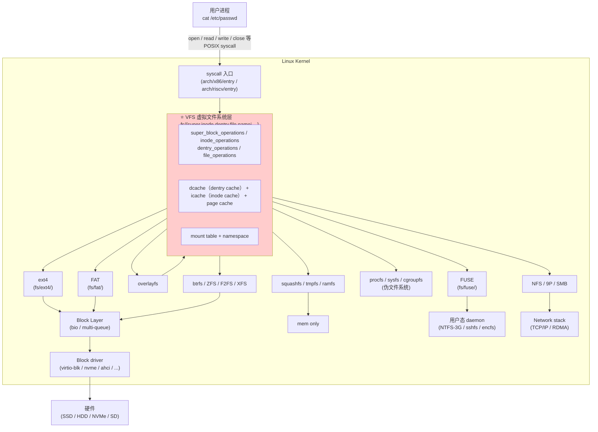
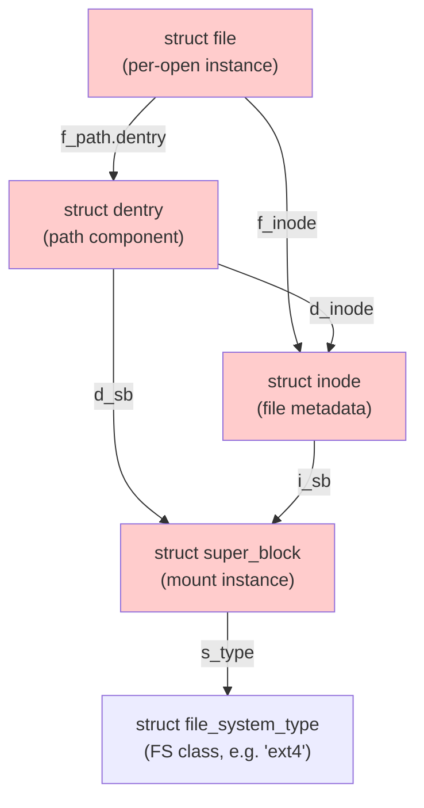

# 05-01 — VFS（Virtual File System）虚拟文件系统层全谱精读

> **核心问题：** 一个 `cat /etc/passwd` 命令，从用户输入到磁盘扇区被读出，这中间穿过的"文件系统抽象层"长什么样？为什么 Linux 能让 ext4 / FAT / 9P / NFS / FUSE / sysfs / procfs 共用一套 `open/read/write` 接口？这种抽象的来龙去脉是什么？
>
> **一句话答案：** **VFS（虚拟文件系统）是 OS 内核中位于"系统调用"和"具体文件系统"之间的抽象层**——它定义统一的"文件抽象"（super_block / inode / dentry / file 4 大对象），让千奇百怪的具体 FS（块设备 FS / 网络 FS / 内存 FS / 伪 FS）都能挂到同一棵树上、被同一组 syscall 操作。**1986 年 Sun Microsystems 为 NFS 发明，1991 Linus 为 Linux minix-fs 移植，1995 起成为 Linux 多 FS 共存的关键基础设施**。
>
> **本笔记定位：** 05 大类（fs / 存储）首篇 —— 跨语言、跨实现、跨时代横向铺开，配本仓库 fs/ 全部本地资料对照学习。

---

## 0. 为什么 VFS 单独成篇

文件系统这个领域有两个角度：
1. **具体 FS**（ext2/4 / FAT / NTFS / btrfs / ZFS / 9P / NFS / sysfs / procfs / overlayfs / FUSE 全谱）—— 见 [`00-18-storage-evolution.md`](00-18-storage-evolution.md)（已写）
2. **VFS 抽象层**（让上面这些 FS 能被统一访问的中间层）—— **本篇**

把 VFS 单独写一篇是因为它是**所有具体 FS 设计/移植/调试的根基**。读完本篇再读 ext4 / btrfs / FUSE 任何具体 FS 实现都有"骨架"。

---

## 1. 顶层视野：VFS 在全栈中的位置

### 1.1 一图看穿（从用户到扇区）



→ **VFS 是"文件操作"的"瓶颈层"**——所有路径都经过它。也就是说**改 VFS 就改了全部文件系统的行为**。

### 1.2 VFS 解决什么问题

**没有 VFS 的世界（1980s 早期 UNIX）：**
- 每个 FS 各自实现一套 syscall 入口
- 应用要自己分辨"这是 FAT 还是 ext"
- 加新 FS 要改 syscall 表，每个 FS 加自己的 read 函数

**有 VFS 后（1986 起）：**
- 应用只用统一的 `open/read/write/lseek/close`
- 内核统一管理路径解析、权限检查、缓存
- 加新 FS 只需实现 VFS 接口（trait/struct of fn pointers）
- **多 FS 可以挂在同一棵目录树**（mount system）

→ **VFS 是 OS 中"开放-封闭原则"（OCP）的最佳工程例证之一**：对扩展开放（加新 FS 不动 VFS）、对修改封闭（VFS 接口稳定 30+ 年）。

### 1.3 VFS 的两个不可替代职责

1. **统一抽象** —— 把"文件"概念从具体存储介质分离
2. **跨 FS 命名空间** —— `/dev`（devtmpfs）、`/proc`（procfs）、`/sys`（sysfs）、`/home`（ext4）、`/mnt/usb`（FAT）共存于一棵树

---

## 2. 历史与版本演化（详细到不跳过任何节点）

### 2.1 时间线

```mermaid
timeline
    title VFS 演化全史（按里程碑）
    1971 : UNIX V1 - "everything is a file" 哲学诞生（一切设备都是文件）
    1973 : UNIX V4 - 引入 inode 概念
    1979 : UNIX V7 - inode + 路径解析趋成熟，但只支持单一 fs
    1984 : Sun 推 SunOS 1.0，遇到"多机共享文件"需求
    1986 : Sun 设计 NFS v2 - 同时发明 VFS 抽象层（论文 The Sun Network File System: Design, Implementation and Experience）
    1986 : VFS = vnode interface 进入 SunOS 2.0
    1988 : System V Release 4 (SVR4) - 借鉴 Sun VFS，普及到 AT&T 商业 UNIX
    1991 : Linus 写 Linux 0.01 - 仅支持 minix fs（无 VFS）
    1992 : Linux 0.96 - 加入 VFS（参考 SVR4 vnode），首批支持 minix/ext/xiafs
    1993 : Linux 0.99.10 - ext2 文件系统加入
    1995 : Linux 1.2 - VFS 稳定，支持 NFS / FAT / NTFS-readonly / iso9660 / ufs / sysv 等
    1995 : FreeBSD 2.0 - 基于 4.4BSD VFS（仍源自 Sun vnode）
    1996 : Linux 2.0 - VFS 多线程化（SMP）；引入 dentry cache（dcache）
    1998 : Linux 2.2 - dcache 完整化；引入 super_block / file_system_type
    2001 : Linux 2.4 - VFS 进一步优化；ext3 加入；FUSE 雏形
    2003 : Linux 2.6.0 - VFS 大幅重构，引入 inotify
    2005 : Linux 2.6.14 - FUSE 主线（用户态 fs framework）
    2006 : Linux 2.6.18 - 引入 inotify
    2007 : Linux 2.6.20 - 引入 mount namespace（容器基础）
    2008 : Linux 2.6.27 - ext4 主线
    2008 : Linux 2.6.28 - btrfs 主线（COW + 快照）
    2010 : Linux 2.6.36 - VFS 路径名查询无锁化（RCU dcache walk）
    2014 : Linux 3.18 - overlayfs 主线（容器层叠 fs）
    2016 : Linux 4.5 - nameidata 重构 + RENAME_EXCHANGE
    2017 : Linux 4.13 - 'fsmount/fsopen/fsconfig' 新挂载 API
    2019 : Linux 5.2 - copy_file_range 跨 fs 拷贝
    2021 : Linux 5.13 - landlock LSM（基于 fs 的沙盒）
    2022 : Linux 5.18 - idmapped mount（容器 uid 映射）
    2024 : Linux 6.7 - bcachefs 主线（新一代 COW fs）
    2026 : 现状 - VFS 6 版本以来基本稳定，新增主要在挂载/命名空间/安全方向
```



### 2.2 1986 NFS 与 VFS 共生诞生（关键起源）

> 这一节是 VFS 历史的"创世纪"，必须讲清楚。

**背景：** 1980s 中期，Sun Microsystems 卖工作站。客户痛点："我家里 10 台 Sun 电脑，文件不能共享"——必须让"网络上的远程文件"能像"本地文件"一样被 open/read。

**Sun 的工程师 Steve Kleiman、Bill Joy、David Hitz 等设计 NFS：**
- 客户端必须能让 `open("/mnt/server/foo.txt")` 透明读到远程文件
- 要做到这点，**必须先有"FS 抽象层"**——让"远程 NFS 客户端"和"本地 ufs"共用一套接口
- 这就是 **vnode interface**（vnode = virtual node，对应今天的 VFS inode）

**1986 论文：** *The Sun Network File System: Design, Implementation and Experience*（Bill Joy / Steven McCanne / Bob Lyon 等署名）—— 同时发布 NFS 协议 v1/v2 + vnode interface。

**vnode interface 关键贡献：**
- 把 inode 抽象出来：`vnode` 是接口，每个具体 FS 实现具体 vnode
- 操作以函数指针向量（vnodeops）暴露
- 路径解析与具体 FS 解耦

→ **VFS 不是为了多 FS 共存而设计，是为了 NFS 而设计的——多 FS 共存是顺带获得的能力**。

### 2.3 1992 Linus 移植 VFS 进 Linux

**Linux 0.01-0.95 只支持 minix 文件系统**（Linus 在芬兰大学用 Minix，习惯了它的 fs）。

Linux 0.96（1992 春）想加 ext fs，Linus 临时实现了"伪 VFS"——一个 `read` syscall，根据某个全局变量判断是 minix 还是 ext。**这是反 VFS 设计**。

后来 Theodore Ts'o（ext2 作者）和 Stephen Tweedie 强力推动 Linus 引入真正的 VFS。Linux 0.96.5（1992 末）正式有了 vnode 风格的 VFS 层。

**Linux VFS 与 Sun vnode 的差异：**
| 维度 | Sun vnode | Linux VFS |
|------|-----------|-----------|
| 名字 | vnode | inode（混淆——Linux inode 既是 VFS 抽象也是磁盘 inode）|
| dentry | 无独立对象 | 独立 dentry 对象 + 全局 dcache（1996 加入）|
| file 对象 | file_t | struct file |
| super | vfs_t | struct super_block |
| 操作向量 | vnodeops | inode_operations / file_operations 等多套 |

**Linux 在 1996-2003 期间持续优化 VFS**：
- dcache（dentry 缓存）大幅加速路径查找
- icache（inode 缓存）减少磁盘读
- page cache 与 VFS 集成（写文件 = 写 page cache → writeback 到磁盘）
- SMP 多核优化
- RCU 路径查询（2010）—— 多核同时查 path 不需互斥锁

### 2.4 各家 UNIX VFS 的演化分支

```
1986 Sun vnode (SunOS 2.0)
    │
    ├─→ AT&T System V R4 (SVR4)        (1988)
    │       └─→ Solaris VFS             (1992 起，至今)
    │       └─→ AIX, HP-UX 各自变体
    │
    ├─→ 4.3-Reno BSD                    (1990)
    │       └─→ FreeBSD VFS              (1993 起)
    │       └─→ NetBSD / OpenBSD         (1995 起)
    │       └─→ macOS XNU vnode (来自 FreeBSD VFS + Mach 改造)
    │
    └─→ Linux VFS                        (1992 移植，独立演化)
            └─→ Android / WSL / 嵌入式 Linux

并行流派：
    Plan 9 9P (1992) - 与 VFS 不同的设计：所有操作都是消息
    Microsoft Windows IFS (Installable File System, 1993 NT 起)
```

### 2.5 三大 OS VFS 横向对比

| 维度 | Linux VFS | FreeBSD VFS | Windows IFS |
|------|-----------|-------------|-------------|
| 起源 | Linux 0.96 (1992) | 4.3-Reno (1990) | NT 3.1 (1993) |
| 抽象单元 | super_block / inode / dentry / file 4 个 | mount / vnode / file 3 个 | DEVICE_OBJECT / FILE_OBJECT |
| 接口风格 | C struct + 函数指针 | C struct + 函数指针 | IRP（I/O Request Packet）异步 |
| 同步模型 | sleep lock + RCU | sleepable mutex | IRP 异步 |
| 命名空间 | mount namespace（per-process）| jail | DOS 设备名 + 重解析点 |
| 主流挂载语法 | `mount -t ext4 /dev/sda /mnt` | `mount -t ufs /dev/ad0 /mnt` | drive letter `D:\` 或 mountpoint |
| FUSE 等价物 | FUSE | FUSE / Projfs | Filter Driver / IFS Kit |

---

## 3. VFS 4 大核心抽象（精读）

> 这是 VFS 的"四大金刚"——理解它们就理解了 90% 的 VFS。

### 3.1 super_block — "整个挂载点的元信息"

**是什么：** 一个 `super_block` 对应**一个挂载实例**。如 `mount /dev/sda1 /home` 创建一个 super_block，描述这块 ext4 在 /home 的状态。

**关键字段（精简版，参考 `linux-fs/fs/super.c`）：**

```c
struct super_block {
    struct list_head    s_list;             // 全局链表
    dev_t               s_dev;              // 设备号
    unsigned long       s_blocksize;        // 块大小
    loff_t              s_maxbytes;         // 最大文件
    struct file_system_type *s_type;        // ext4? FAT?
    const struct super_operations *s_op;    // 操作向量
    struct dentry      *s_root;             // 根 dentry（挂载点）
    struct list_head    s_inodes;           // 所有 inode 链表
    void               *s_fs_info;          // 具体 FS 私有数据
    // ... 几十个字段
};
```

**super_operations（关键操作）：**

```c
struct super_operations {
    struct inode *(*alloc_inode)(struct super_block *sb);
    void (*destroy_inode)(struct inode *);
    void (*write_inode)(struct inode *, struct writeback_control *wbc);
    void (*evict_inode)(struct inode *);
    void (*put_super)(struct super_block *);          // umount
    int (*sync_fs)(struct super_block *sb, int wait);
    int (*statfs)(struct dentry *, struct kstatfs *);
    int (*remount_fs)(struct super_block *, int *, char *);
    void (*umount_begin)(struct super_block *);
    // ...
};
```

→ **"具体 FS 想被 VFS 接受，必须实现 super_operations"**——这是接入 VFS 的"协议"。

### 3.2 inode — "文件的元数据 + 索引"

**是什么：** 每个文件、目录、设备节点、命名管道、socket 在 VFS 看来都是一个 `inode`。**inode = index node**，里面有"文件元数据 + 数据块索引"。

**关键字段（`linux-fs/fs/inode.c` 维护）：**

```c
struct inode {
    umode_t             i_mode;             // 类型 + 权限（drwxrwxrwx）
    kuid_t              i_uid;
    kgid_t              i_gid;
    unsigned long       i_ino;              // inode 编号
    loff_t              i_size;             // 文件大小
    struct timespec64   i_atime;            // 访问时间
    struct timespec64   i_mtime;            // 修改时间
    struct timespec64   i_ctime;            // change time（属性变更）
    blkcnt_t            i_blocks;           // 占用块数
    const struct inode_operations *i_op;
    const struct file_operations  *i_fop;
    struct super_block *i_sb;               // 反向指向 super_block
    struct address_space *i_mapping;        // page cache（重要）
    void               *i_private;          // 具体 FS 私有
    // ... 几十个字段
};
```

**inode_operations（路径/属性操作）：**

```c
struct inode_operations {
    struct dentry *(*lookup)(struct inode *, struct dentry *, unsigned int);
    int (*create)(struct mnt_idmap *, struct inode *, struct dentry *, umode_t, bool);
    int (*link)(struct dentry *, struct inode *, struct dentry *);
    int (*unlink)(struct inode *, struct dentry *);
    int (*symlink)(struct mnt_idmap *, struct inode *, struct dentry *, const char *);
    int (*mkdir)(struct mnt_idmap *, struct inode *, struct dentry *, umode_t);
    int (*rmdir)(struct inode *, struct dentry *);
    int (*rename)(struct mnt_idmap *, struct inode *, struct dentry *,
                   struct inode *, struct dentry *, unsigned int);
    int (*getattr)(...);
    int (*setattr)(...);
    // ...
};
```

→ **inode 关心"这个文件是什么，元数据怎么改"**。

### 3.3 dentry — "路径树节点 + 缓存条目"

**是什么：** dentry = directory entry，**路径上某一段名字到 inode 的映射缓存**。例如 `/home/heke/foo.txt` 对应 4 个 dentry：`/`、`home`、`heke`、`foo.txt`。每个 dentry 持有指向 inode 的指针。

**为什么需要 dentry（不直接用 inode）？**
- 路径查询每次都从 inode 走太慢
- **dcache（dentry 缓存）** 是一棵树，全局 hash 表查询 O(1)
- 同一个 inode 可能有多个 dentry（硬链接），dentry 是"路径视图"

**关键字段（`linux-fs/fs/dcache.c`）：**

```c
struct dentry {
    unsigned int        d_flags;
    seqcount_spinlock_t d_seq;
    struct hlist_bl_node d_hash;            // hash 表节点
    struct dentry      *d_parent;
    struct qstr         d_name;             // 名字（带 hash）
    struct inode       *d_inode;            // 指向 inode
    unsigned char       d_iname[36];        // 短名字内联
    const struct dentry_operations *d_op;
    struct super_block *d_sb;
    void               *d_fsdata;
    struct list_head    d_subdirs;          // 子 dentry
    // ...
};
```

**dentry 状态机：**
- **in-use** —— 至少一个 file 在引用（不能被回收）
- **unused** —— 没有 file 引用但 inode 还在内存（可回收，但有缓存价值）
- **negative** —— `d_inode == NULL`（缓存"这个名字不存在"）—— **重要的优化**

### 3.4 file — "进程打开文件的句柄"

**是什么：** 每次 `open(path, ...)` 创建一个 `struct file`，代表"这个进程打开的这个文件"。多个进程打开同一个文件会有多个 file 实例。

**关键字段：**

```c
struct file {
    struct path         f_path;             // dentry + mount
    struct inode       *f_inode;
    const struct file_operations *f_op;
    spinlock_t          f_lock;
    fmode_t             f_mode;             // O_RDONLY / O_WRONLY / O_RDWR
    loff_t              f_pos;              // 当前读写位置（lseek 用）
    void               *private_data;
    struct address_space *f_mapping;
    // ...
};
```

**file_operations（IO 操作）：**

```c
struct file_operations {
    loff_t (*llseek)(struct file *, loff_t, int);
    ssize_t (*read)(struct file *, char __user *, size_t, loff_t *);
    ssize_t (*write)(struct file *, const char __user *, size_t, loff_t *);
    ssize_t (*read_iter)(struct kiocb *, struct iov_iter *);
    ssize_t (*write_iter)(struct kiocb *, struct iov_iter *);
    int (*iterate_shared)(struct file *, struct dir_context *);   // readdir
    __poll_t (*poll)(struct file *, struct poll_table_struct *);
    long (*unlocked_ioctl)(struct file *, unsigned int, unsigned long);
    int (*mmap)(struct file *, struct vm_area_struct *);
    int (*open)(struct inode *, struct file *);
    int (*release)(struct inode *, struct file *);
    int (*fsync)(struct file *, loff_t, loff_t, int datasync);
    int (*fasync)(int, struct file *, int);
    long (*fallocate)(struct file *, int, loff_t, loff_t);
    int (*flock)(struct file *, int, struct file_lock *);
    // ...
};
```

→ **file 关心"这个打开的实例如何读写"**——位置 / 模式 / 缓冲。

### 3.5 4 大对象的相互关系



**对应关系小结：**
| 概念 | 是什么 | 数量级 |
|------|--------|------|
| `file_system_type` | FS 类型（"ext4" 这个类）| 几十个（注册的 FS 数量）|
| `super_block` | 一次挂载实例 | 几个（挂载点数）|
| `inode` | 一个文件 | 几万~几百万（in-cache）|
| `dentry` | 一个路径名 | 几十万~几百万（dcache）|
| `file` | 一个 open 句柄 | 几千~几十万（per-process fd）|

---

## 4. linux-fs/fs/ 源码全景（本地 sparse checkout）

本地路径：`/home/heke/tgln/stage2/material/fs/linux-fs/fs/` —— 共 82 个文件 + 各 FS 子目录。这是**最权威的 VFS 实现参考**。

### 4.1 核心 VFS 文件分组

| 文件 | 行数级 | 职责 |
|------|--------|------|
| **super.c** | ~2K | super_block 管理（挂载/卸载/重挂载）|
| **inode.c** | ~2K | inode 缓存（icache）+ alloc/destroy |
| **dcache.c** | ~3K | dentry 缓存（dcache）+ hash + LRU |
| **file_table.c** | ~500 | file 对象池 |
| **file.c** | ~1K | fd 表管理（per-process）|
| **namei.c** | ~5K | ⭐ **路径解析核心**（`path_lookup` 等）|
| **namespace.c** | ~5K | mount namespace + 挂载逻辑 |
| **mount.h** | ~200 | 挂载内部结构 |
| **fs_context.c** | ~1K | 新挂载 API（fsopen/fsmount，2017+）|
| **fs_parser.c** | ~1K | 挂载参数解析 |
| **filesystems.c** | ~300 | file_system_type 注册 |
| **open.c** | ~1.5K | open/close/openat 实现 |
| **read_write.c** | ~2K | read/write/pread/pwrite |
| **readdir.c** | ~600 | getdents 实现 |
| **stat.c** | ~700 | stat/fstat/lstat |
| **statfs.c** | ~300 | statfs/fstatfs（FS 容量信息）|
| **xattr.c** | ~1K | 扩展属性（setxattr/getxattr）|
| **posix_acl.c** | ~1K | POSIX ACL（细粒度权限）|
| **fcntl.c** | ~1K | fcntl（文件锁、flags 等）|
| **attr.c** | ~600 | chmod/chown/utime 通用部分 |
| **buffer.c** | ~2K | 块缓冲（buffer_head，老式）|
| **direct-io.c** | ~1.5K | O_DIRECT 直接 IO |
| **dax.c** | ~1.5K | DAX（直接访问 PMEM，绕过 page cache）|
| **eventpoll.c** | ~2.5K | epoll 实现 |
| **inotify_*.c** | ~1K | inotify（fs 事件通知）|
| **fsnotify*.c** | ~2K | fsnotify（fs 事件总框架）|
| **splice.c** | ~1.5K | splice / sendfile（零拷贝）|
| **aio.c** | ~2K | POSIX AIO |
| **pipe.c / pipefs** | ~1.5K | 管道（也是 VFS file！）|

### 4.2 binfmt 子系统（执行格式）

| 文件 | 职责 |
|------|------|
| binfmt_elf.c | ELF 加载（mmap + 启动用户进程）|
| binfmt_elf_fdpic.c | FDPIC ELF（无 MMU 嵌入式）|
| binfmt_flat.c | flat binary（ucLinux）|
| binfmt_misc.c | 配置型 binfmt（用户态注册）|
| binfmt_script.c | shebang #! 脚本 |

→ **execve 也是 VFS 的客户**——加载二进制要 open + read（mmap）。

### 4.3 各具体 FS 子目录（fs/ext4/, fs/ext2/, fs/fat/）

本地 sparse checkout 仅包含：
- **fs/ext2/** —— 老 ext2（教学/Live USB 还在用）
- **fs/ext4/** —— 主流 ext4（含 jbd2 日志层）
- **fs/fat/** —— FAT12/16/32 + vfat 长名

主线还有几十个其他 FS（btrfs / xfs / 9p / nfs / fuse / overlayfs / ...）—— 本地未 checkout，需要时联网拉。

### 4.4 推荐阅读顺序（先后递进）

```
读 VFS 源码顺序（每文件估时）：

1. fs/file.c           (1h)  fd 表，最简，先读暖身
2. fs/file_table.c     (1h)  file 对象池
3. fs/inode.c          (3h)  inode 生命周期
4. fs/dcache.c         (5h)  ⭐ dentry 缓存（hash + LRU + RCU 路径查询）
5. fs/namei.c          (5h)  ⭐ 路径解析（lookup 全过程）
6. fs/super.c          (2h)  super_block + mount kthread
7. fs/namespace.c      (3h)  ⭐ mount/umount + namespace 隔离
8. fs/open.c           (2h)  open 系统调用全貌
9. fs/read_write.c     (2h)  read/write 系统调用
10. fs/eventpoll.c     (3h)  epoll 实现（看 fs 如何被监听）
11. fs/binfmt_elf.c    (2h)  execve → ELF 加载，"关闭一个循环"
12. fs/buffer.c        (2h)  老式 buffer cache（理解历史）
13. fs/direct-io.c     (1h)  O_DIRECT 路径
14. fs/splice.c        (1h)  零拷贝
15. fs/ext2/, fs/ext4/ (10h+) 具体 FS（看完 VFS 再读，有骨架）
```

---

## 5. 路径解析详解（namei.c）

> 这是 VFS 最复杂、最值得吃透的部分——**所有 syscall 都从路径解析开始**。

### 5.1 path_lookup 总体流程

```
open("/home/heke/foo.txt", O_RDONLY)
    │
    └─→ filp_open
        └─→ path_openat
            └─→ path_init       (从 nameidata 拿起点：/ 或当前目录)
                │
                └─→ link_path_walk
                    │  循环每个分量："home" → "heke" → "foo.txt"
                    └─→ walk_component
                        ├─→ lookup_fast (RCU)         ← 先查 dcache（无锁）
                        │   └─→ lookup_dcache
                        │       └─→ d_hash 查表
                        ├─→ lookup_slow (取锁)         ← dcache miss 时
                        │   └─→ inode->i_op->lookup() ← 调具体 FS lookup
                        ├─→ 如果是 symlink → 递归处理
                        ├─→ 如果是 mount point → 切换 super_block
                        └─→ 如果是 ".." → 处理 mount 边界
```

### 5.2 dcache lookup 的高速路径（RCU walk）

**Linux 2.6.36 (2010) 引入"RCU 路径查询"** —— 多 CPU 并发查同一路径不需互斥锁：

```
1. 进入 RCU read-side critical section
2. 用 sequence lock + d_seq 实现 lock-free dentry 比较
3. 一路向下走，全程不取互斥锁
4. 走到底（或 RCU walk 失败）后取锁验证
5. 用 d_lookup_done() 离开 RCU
```

→ **这是 Linux VFS 性能甩开其他 OS 的关键武器**。读路径走 RCU 时，多核并发性能近乎线性 scale。

### 5.3 mount 点处理

当 `walk_component` 走到一个 mount 点（如 `/proc`），要：
1. 从 `mount` 哈希表查到对应的子 super_block
2. 切换到子 super_block 的 root dentry
3. 继续往下走

→ **这就是为什么 `/proc/cpuinfo` 能透明读到内核动态生成的内容**——VFS 在 `/proc` 处切到 procfs，procfs 的 read 实现是动态生成。

### 5.4 namei 的关键函数（行号参考最新主线）

| 函数 | 职责 |
|------|------|
| `path_init` | 初始化 nameidata（确定起点）|
| `link_path_walk` | 主循环，逐分量走 |
| `walk_component` | 走一个分量 |
| `lookup_fast` | RCU 快速路径 |
| `lookup_slow` | dcache miss 慢速路径 |
| `step_into` | 进入下一层（含 mount/symlink 处理）|
| `complete_walk` | 收尾验证 |
| `nd_jump_link` | 处理 symlink 跳转 |

---

## 6. 挂载系统（namespace.c）

### 6.1 概念

| 术语 | 含义 |
|------|------|
| **mount** | 把一个 FS 实例（super_block）挂到目录树某个点 |
| **bind mount** | 把目录 A 也挂到 B（同一 FS 出现多个挂载点）|
| **shared/private/slave/unbindable** | 挂载传播策略（容器隔离用）|
| **mount namespace** | 进程私有的挂载视图（Docker 基础）|
| **mount propagation** | 挂载在不同 namespace 间传播规则 |

### 6.2 mount syscall 演化

| 年代 | API | 特点 |
|------|-----|------|
| 1971 UNIX V1 | `mount(spec, dir, flags)` | 远古单一接口 |
| Linux 1.0+ | `mount(source, target, fstype, mountflags, data)` | 单一 syscall，data 由具体 FS 解析 |
| 2017+ Linux 5.2 | `fsopen` / `fsconfig` / `fsmount` / `move_mount` / `open_tree` | 新 API，分阶段挂载，更好的容错 |

**新 API 5 步：**
```c
int fd = fsopen("ext4", 0);             // 1. 创建 fs context
fsconfig(fd, FSCONFIG_SET_STRING, "source", "/dev/sda1", 0);  // 2. 配参数
fsconfig(fd, FSCONFIG_CMD_CREATE, NULL, NULL, 0);              // 3. 实际打开
int mfd = fsmount(fd, 0, MS_NOSUID);     // 4. 创建挂载
move_mount(mfd, "", AT_FDCWD, "/mnt", MOVE_MOUNT_F_EMPTY_PATH); // 5. 移动到目标
close(fd);
```

→ 老 API 的痛点是"挂载失败之前已经污染了 mount table"；新 API 在第 4 步前可以反复试参，失败了直接 close fd 没副作用。

### 6.3 mount namespace（容器基础）

```c
unshare(CLONE_NEWNS);   // 创建新 mount namespace
mount("none", "/", NULL, MS_PRIVATE | MS_REC, NULL);  // 私有传播
// 现在 /proc /sys 是当前 ns 私有的
```

→ Docker / Podman / systemd-nspawn 都基于此。详见 [`MEMORY.md` UCI 与 OpenWrt 关系](feedback_no_skip.md) 那段对话中提到的 namespace 历史。

---

## 7. FUSE — 用户态文件系统框架

### 7.1 是什么

**FUSE = Filesystem in USErspace** —— 让用户态程序实现文件系统。

```
用户进程            FUSE daemon (用户态)        VFS
   │                      │                     │
open("/mnt/myfs/foo")     │                     │
   │  syscall             │                     │
   ├─────────────────────────────→ VFS lookup
   │                      │           │
   │                      │ ← FUSE ←─ │ /dev/fuse 通信
   │                      │           │
   │                      │ daemon 处理（Python/Rust/C）
   │                      │           │
   │                      │  → /dev/fuse 回 ──→ │
   │  ← 数据 ──────────────────────────────────│
```

### 7.2 本地资料

- **`fs/libfuse/`** —— 用户态 FUSE 库 C 实现（libfuse3）
- **`fs/fuse-ext2/`** —— FUSE 客户端：用户态读写 ext2

### 7.3 工业级 FUSE 项目

| 项目 | 用途 |
|------|------|
| **NTFS-3G** | Linux 读写 NTFS（macOS/Linux 的 NTFS 唯一选项 30 年）|
| **sshfs** | 通过 SSH 挂远程目录 |
| **encfs / gocryptfs** | 加密文件系统 |
| **s3fs / goofys** | 把 S3 桶挂为目录 |
| **rclone mount** | 30+ 云存储挂载 |
| **bindfs** | 用户态 bind mount + uid 翻译 |
| **mergerfs** | 多目录合并 |
| **ZFS-FUSE**（已弃）| ZFS 早期 Linux 移植 |
| **Glusterfs** | 分布式文件系统客户端 |

### 7.4 FUSE 性能权衡

| 优势 | 劣势 |
|------|------|
| 在用户态写 fs 安全（崩溃不宕机）| 用户/内核切换开销大（每次 read 经 /dev/fuse）|
| 任何语言可写（Python/Go/Rust/Node）| 大文件吞吐受限 |
| 易测试、易调试 | 元数据操作慢 |
| 不需要 root 即可挂载（unprivileged FUSE）| 不适合数据库 / DBMS |
| 跨平台（Linux / macOS / FreeBSD / Windows WinFsp）| |

### 7.5 FUSE Rust 生态

- **fuser** —— Rust 同步 FUSE 绑定（最流行）
- **fuse3** —— Rust async FUSE 绑定（含 tokio 集成）
- **polyfuse** —— 另一个 Rust async 选择
- 本仓库 `core/TornadoOS/async-fat32/` 也带 FUSE 接口（用 `fuse_interface/` 子目录）

---

## 8. 现代特性（不可跳过）

### 8.1 overlayfs — 容器分层文件系统

**Linux 3.18 (2014) 主线** —— Docker 镜像分层的核心。

```
overlay 把"上层"和"下层"目录合并：
    lowerdir=/old1:/old2     ← 只读基础层（多层）
    upperdir=/new            ← 可写层
    workdir=/work            ← overlay 工作目录
    merged=/merged           ← 看到的合并视图
```

**写时复制（COW）：** 写 /merged/foo.txt 时，自动从 lower 复制到 upper 改动。

**Docker 镜像 = 多层 lower + 一层 upper**——所以 layer 概念底层就是 overlayfs。

### 8.2 namespace + cgroup（容器基础）

- mount namespace（2007）—— 私有挂载表
- pid namespace —— 私有 PID 1
- net namespace —— 私有网卡 / 路由
- user namespace —— uid/gid 隔离
- cgroup —— 资源限额（详见 [04-02 § 1.4.2](04-02-os-kernel-paradigms.md)）

→ 这些与 VFS 紧密耦合（mount/uid 都通过 vfs 路径解析生效）。

### 8.3 io_uring — 全异步 IO

**Linux 5.1 (2019) 引入** —— 用户态 ring buffer 提交 IO，内核异步处理。

```c
io_uring_setup(...);                     // 创建 ring
io_uring_submit_read(fd, buf, len);       // 提交（不阻塞）
// 别的事...
io_uring_wait_completion();              // 取结果
```

→ **比 epoll + AIO 快 10×**，已被 Cloudflare / Meta / Aliyun / TigerBeetle 大规模采用。详见 [00-21](00-21-network-stack-evolution.md) / [04-04 RTOS](04-04-rtos-walkthrough.md)。

### 8.4 LSM hooks —— 安全审计层

VFS 的每个关键操作都有 LSM hook：
- `security_inode_create`
- `security_path_mkdir`
- `security_file_open`
- ...

→ SELinux / AppArmor / Smack / Tomoyo / **Landlock**（2021）/ BPF-LSM（2020）都是 LSM 用户。

### 8.5 idmapped mount —— 容器 UID 映射

**Linux 5.12 (2021)** —— 在挂载层做 uid/gid 翻译，让"容器外 UID 1000"在容器内看起来是 UID 0（无需 user namespace 即可隔离）。

### 8.6 fscrypt / fsverity —— 加密 + 完整性

- **fscrypt** —— ext4/F2FS 文件级加密
- **fsverity** —— Merkle 树验证文件完整性（Android Verified Boot 等）

### 8.7 sysfs / procfs / cgroupfs / bpffs —— 伪文件系统大爆发

VFS 的"另一面"：不存任何数据，**用文件接口暴露内核状态/控制**。

| 伪 FS | 用途 |
|-------|------|
| `/proc` | procfs：进程信息 + 内核 sysctl |
| `/sys` | sysfs：设备 / 总线 / 驱动模型 |
| `/sys/fs/cgroup` | cgroupfs：资源控制 |
| `/sys/fs/bpf` | bpffs：eBPF map/program 持久化 |
| `/sys/kernel/tracing` | tracefs：ftrace 控制 |
| `/sys/kernel/debug` | debugfs |
| `/sys/kernel/config` | configfs（运行时配置）|
| `/sys/kernel/security` | securityfs |
| `/dev` | devtmpfs：自动设备节点 |
| `/run` | tmpfs |

→ **Linux 用 VFS 把"内核接口"全部"文件化"**——这是 UNIX "everything is a file" 哲学的极致演化。

---

## 9. xv6 minimal VFS（极简对照）

> xv6（MIT 6.S081 教学）的 fs 层是**理解 VFS 概念的最佳起点**——只有 ~1500 行 C，没有 dcache、没有 namespace、没有 LSM。

本地：`core/xv6/kernel/fs.c` + `kernel/file.c` + `kernel/sysfile.c`

**xv6 的"VFS"特点：**
- 只支持一种 FS（自家的 inode-based fs）
- 没有 file_system_type 抽象（不需要多 FS）
- inode 直接对应磁盘 inode 结构
- file 对象只有 3 字段：type / ip / off
- 路径解析只 100 行：`namei.c::namex` 函数

→ **学 Linux VFS 之前先看 xv6 fs 实现**，把概念吃透再读 Linux 5K 行的 namei.c。

---

## 10. arceos VFS module 对照（Rust 现代设计）

本地：`core/arceos/modules/axfs/`

**arceos axfs 模块结构：**

```
modules/axfs/
├── src/
│   ├── lib.rs            # 入口 + ROOT_DIR
│   ├── api/              # 用户面 API（File/Dir/metadata）
│   │   ├── mod.rs
│   │   ├── file.rs
│   │   └── dir.rs
│   ├── fops.rs           # 文件操作（open/read/write）
│   ├── fs/               # 具体 FS 适配
│   │   ├── mod.rs
│   │   ├── fatfs.rs      # FAT 适配
│   │   └── myfs.rs       # 自定义 FS 适配
│   ├── root.rs           # 根 FS 管理
│   ├── mounts.rs         # 挂载点
│   └── dev.rs            # 块设备
└── tests/
```

**Rust 风设计要点：**
- 用 `trait VfsOps` / `trait VfsNodeOps` 替代 C 函数指针向量
- 用 Rust ownership 管理生命周期（无 ref count manual 管理）
- async fn 路径（与 TornadoOS / NoAxiomOS 同流派）
- cargo features 选择具体 FS（`features = ["fatfs"]`）

→ **arceos VFS 是"用 Rust 重设计 VFS"的现代范例**——任何 Rust 写的现代 OS 项目都值得参考。

---

## 11. 横向对比 — 各 OS / 项目 VFS 设计

| 项目 | 语言 | 行数 | 抽象 | 是否多 FS | 特色 |
|------|------|------|------|----------|------|
| **Linux VFS** | C | ~30K（fs/ 核心）| super/inode/dentry/file | ✅ 数十种 FS | RCU dcache / mount namespace |
| **FreeBSD VFS** | C | ~20K | mount/vnode/file | ✅ | bgwriter / softupdates |
| **macOS XNU vnode** | C+C++ | 闭源 | vnode（来自 BSD）| ✅ | Mach 风 + IOKit 集成 |
| **Windows IFS** | C++ | 闭源 | DEVICE_OBJECT/FILE_OBJECT/IRP | ✅ NTFS/FAT/ReFS/exFAT | IRP 异步模型 |
| **xv6** | C | ~1.5K | 单一 inode + file | ❌ 单 FS | 教学最简 |
| **rCore-Tutorial** | Rust | ~2K | inode trait | ❌ 单 FS（easy-fs）| 教学 Rust |
| **arceos axfs** | Rust | ~3K | VfsOps + VfsNodeOps trait | ✅ FAT + 自定义 | 模块化 + async |
| **TornadoOS** | Rust | ~3K（fs/）| 自家 + async-fat32 | 仅 FAT32 | 异步 FS |
| **DragonOS** | Rust | ~5K | Linux-like VFS | ✅ ext2 / FAT / VirtFS | 兼容 Linux fs ABI |
| **StarryOS** | Rust | ~3K（基于 axfs）| arceos VFS | 同 arceos | 宏内核人格 |
| **seL4** | C | 极小 | 无内核 fs（用户态服务）| - | 微内核风格 |
| **FUSE** | C | ~5K（libfuse）| user-space callbacks | 任意 | 用户态 FS 框架 |
| **9P / Plan 9** | C | ~2K | 全消息驱动（Twalk/Tread/...）| ✅ | 网络透明 |
| **Multics fs**（1965-2000）| PL/I | - | hierarchical | - | UNIX 祖先 |
| **CP/M fs**（1974）| ASM | 很小 | 无目录、平面 | ❌ | 嵌入式祖先 |

---

## 12. 各家具体 FS 在本地的对应（fs/ 目录精读路线）

### 12.1 教学型（先读）

- **`fs/easyfs/`** —— rCore 教学最简 FS（~1K 行 Rust）
  - `bitmap.rs`, `block_cache.rs`, `block_dev.rs`, `efs.rs`, `layout.rs`, `vfs.rs`
  - **第一手"自己写 FS"教学**——VFS 抽象只有 1 个 trait

### 12.2 工业型（精读）

- **`fs/ext2-rs/`** —— Rust ext2 实现（学习 ext2 经典布局）
- **`fs/ext4_rs/`** —— Rust ext4 实现（生产级，含 ext4_defs / ext4_impls / fuse_interface）
- **`fs/lwext4_rust/`** —— lwext4 的 Rust 绑定（嵌入式 ext4）
- **`fs/fatfs/`** —— C FAT 实现（参考实现，看 FAT12/16/32 兼容）
- **`fs/littlefs/`** —— 嵌入式掉电安全 FS（NOR Flash 友好）

### 12.3 用户态 FS

- **`fs/libfuse/`** —— FUSE 用户态库
- **`fs/fuse-ext2/`** —— FUSE 客户端读写 ext2

### 12.4 内核 VFS

- **`fs/linux-fs/fs/`** —— ⭐ **本笔记主参考**

### 12.5 阅读路线建议

```
新手（1 周）：
    1. 读 xv6 fs.c + file.c       (3 天)
    2. 读 easyfs vfs.rs            (2 天)
    3. 写一个内存 FS（10 行 trait） (2 天)

中级（1 月）：
    4. 读 arceos axfs/             (1 周)
    5. 读 linux-fs fs/super.c, inode.c, dcache.c (1 周)
    6. 读 linux-fs fs/namei.c       (1 周)
    7. 实现 FUSE 'hello' 文件系统  (1 周)

高级（1 季度）：
    8. 读 linux-fs fs/ext4/         (2 周)
    9. 读 linux-fs fs/btrfs/（联网拉）(2 周)
    10. 读 linux-fs fs/overlay/     (1 周)
    11. 自己写一个最小可用 FS 实现（参考 easyfs/arceos 风格）   (1 月+)
```

---


---

## 14. QuickStart / Daily Use / 业界最佳实践

### 14.1 QuickStart（看 fs 在跑什么）

```sh
# 看当前所有挂载点
mount

# 看可用 fs 类型
cat /proc/filesystems

# 看 dcache 命中率
cat /proc/sys/fs/dentry-state
# 输出: nr_dentry  nr_unused  age_limit  ...

# 看 inode 缓存
cat /proc/sys/fs/inode-state

# 看 fd 上限
ulimit -n
cat /proc/sys/fs/file-max
cat /proc/sys/fs/nr_open

# 看一个进程的 fd
ls -la /proc/$$/fd/

# trace 一次 open
strace -e openat cat /etc/passwd

# 看 fs 事件
inotifywait -m /tmp
```

### 14.2 Daily Use（调试技巧）

| 场景 | 套路 |
|------|------|
| 找慢的 syscall | `perf trace -e openat,read,write` |
| 看哪个进程占文件 | `lsof /path/to/file` |
| 看 dcache LRU 状态 | `slabtop` 找 dentry / inode_cache |
| 强制 flush | `sync && echo 3 > /proc/sys/vm/drop_caches` |
| 文件挖洞 | `fallocate --punch-hole --offset N --length M file` |
| O_DIRECT 测吞吐 | `dd if=/dev/sda of=/dev/null iflag=direct bs=1M` |
| 比较 fs 性能 | `fio --name=test --rw=randread --bs=4k --iodepth=32` |
| 看 LSM hook | `cat /sys/kernel/security/lsm` |
| trace VFS | `bpftrace -e 'kprobe:vfs_read { @[comm] = count(); }'` |

### 14.3 业界最佳实践

| 场景 | 实践 |
|------|------|
| **数据库存储** | XFS（PostgreSQL 推荐）/ ext4（MySQL 默认）/ ZFS（PostgreSQL on FreeBSD）|
| **容器镜像** | overlayfs（Docker / containerd）/ btrfs / ZFS（rare）|
| **嵌入式设备** | ext4 / F2FS（Android 4.0+）/ littlefs（NOR Flash）/ JFFS2（NOR）/ UBIFS（NAND）|
| **桌面 Linux** | ext4（Ubuntu/Debian 默认）/ btrfs（Fedora/openSUSE）/ ZFS（Ubuntu 可选）|
| **macOS** | APFS（2017+）/ HFS+（旧）|
| **Windows** | NTFS（系统盘）/ ReFS（服务器/数据盘）/ exFAT（U 盘）|
| **NAS** | ZFS / btrfs / Snapshots / RAID-Z |
| **HPC / 集群** | Lustre / GPFS / CephFS / GlusterFS |
| **云对象存储** | S3FS / Goofys（元数据慢）/ Mountpoint for S3（AWS 官方 FUSE）|
| **加密** | LUKS（块层）+ ext4 / fscrypt（fs 层）/ encfs（FUSE）|

### 14.4 业界采纳调查（粗略）

| Linux fs | 桌面占比 | 服务器占比 |
|----------|---------|-----------|
| ext4 | ~80% | ~70% |
| XFS | ~5% | ~20%（RHEL/CentOS 默认）|
| btrfs | ~10% | ~5% |
| ZFS-on-Linux | <5% | <5% |
| F2FS | ~0% | ~0%（手机里多）|
| bcachefs | <1% | <1%（2024 主线）|

---

## 15. 专有名词词典（VFS 体系）

| 术语 | 是什么 | 何时见过 |
|------|--------|----------|
| **VFS** | Virtual File System | 本笔记 |
| **vnode** | Sun/BSD/macOS 的 VFS 节点抽象 | FreeBSD man |
| **inode** | Linux/UNIX 的 VFS 节点 | `ls -i` |
| **dentry** | 路径名缓存条目 | `/proc/sys/fs/dentry-state` |
| **dcache** | dentry cache | slabtop |
| **icache** | inode cache | slabtop |
| **page cache** | 文件数据缓存 | `free -h` 中的 buff/cache |
| **buffer cache** | 块设备缓存（老式）| 已与 page cache 合并 |
| **address_space** | 把"文件"映射到"page cache 页集合"的对象 | inode->i_mapping |
| **super_block** | 一次 mount 的元信息 | mount 表 |
| **file_system_type** | FS 类（"ext4" 等）| `cat /proc/filesystems` |
| **bdev** | 块设备 | `/dev/sda` |
| **mount namespace** | per-process 挂载视图 | unshare(CLONE_NEWNS) |
| **bind mount** | 同 FS 多挂载点 | `mount --bind A B` |
| **chroot** | 改变 / 视为另一个目录 | `chroot /newroot` |
| **pivot_root** | 切换根挂载（chroot 升级版）| Docker / initrd |
| **overlayfs** | 上下层合并 | Docker layer |
| **FUSE** | 用户态 fs 框架 | NTFS-3G / sshfs |
| **9P** | Plan 9 fs 协议 | virtio-9p / WSL |
| **NFS** | 网络 fs 协议（Sun 1986）| `nfs-server` |
| **SMB / CIFS** | Windows 网络 fs | samba |
| **xattr** | 扩展属性 | `getfattr /path` |
| **ACL** | 访问控制列表 | `getfacl /path` |
| **direct IO** | 绕过 page cache 直接 IO | `O_DIRECT` |
| **DAX** | Direct Access（PMEM 直接映射）| `mount -o dax` |
| **aio** | POSIX 异步 IO | `io_submit` |
| **io_uring** | 现代异步 IO | Linux 5.1+ |
| **inotify** | fs 事件通知 | `inotifywait` |
| **fanotify** | fs 通知 + access control | AV 软件 |
| **fsnotify** | 内核 fs 通知总框架 | LSM 用 |
| **landlock** | unprivileged sandbox | `landlock_create_ruleset` |
| **fscrypt** | 文件级加密 | ext4 -O encrypt |
| **fsverity** | Merkle 完整性 | Android Verified Boot |
| **idmapped mount** | uid/gid 翻译挂载 | container UID 映射 |
| **autofs** | 按需自动挂载 | `/net` 挂远程 |
| **autoMount** | systemd unit `*.automount` | `systemctl status` |

---

## 16. 练习题

### 练习 1（基础）：手写一个 FUSE hello 文件系统

用 Python `fusepy` 库写：
- 挂载点 `/tmp/hello`
- `ls /tmp/hello` 看到一个文件 `hello.txt`
- `cat /tmp/hello/hello.txt` 输出 "Hello FUSE"

**自检：** 用 `strace cat /tmp/hello/hello.txt` 能看到 openat → read → close？

### 练习 2（中级）：读懂 dcache LRU

读 `linux-fs/fs/dcache.c::shrink_dcache_*` 系列函数，回答：
- dcache 满了之后哪些 dentry 优先被释放？
- LRU 链表怎么维护？
- 为什么不用红黑树而用 hash 表？

**自检：** 能否在 5 分钟内向初学者解释清楚？

### 练习 3（进阶）：自己写一个 RAM-FS

用 Rust 实现 `arceos modules/axfs` 风格的 trait：
```rust
trait VfsOps { fn root_dir(&self) -> Arc<dyn VfsNodeOps>; ... }
trait VfsNodeOps { fn read_at(...); fn write_at(...); fn lookup(...); ... }
```

实现一个内存树结构，挂到 axfs 的 root，能 ls/cat/echo 写入。

**自检：** axfs `tests/test_ramfs.rs` 跑过？

### 练习 4（造轮）：自己写一个最小可用 VFS 设计草案

写一份 500-1000 字 VFS 设计草案，覆盖：
- VFS trait 设计（参考 arceos VfsOps / VfsNodeOps）
- mount 机制
- 路径解析策略（dcache or 不要 dcache？）
- 与 OS 调度器的关系（async or sync？）
- 与 boot 阶段的协同（rootfs 怎么传？initramfs 还是 FIT？）

**自检：** 能说清楚每个决策的取舍吗？


---

## 17. 本地资料对应

### 主资料（VFS 本身）
- **`fs/linux-fs/fs/`** ⭐ —— Linux VFS 全部源码（82 文件 + 3 个具体 FS 子目录）
  - 核心：super.c / inode.c / dcache.c / namei.c / namespace.c / file.c / file_table.c / open.c / read_write.c / readdir.c
  - 进阶：eventpoll.c / fsnotify*.c / splice.c / aio.c / direct-io.c / dax.c / xattr.c / posix_acl.c / fcntl.c
  - binfmt：binfmt_elf.c / binfmt_*.c
  - 子 FS：fs/ext2/ / fs/ext4/ / fs/fat/

### 教学型（先读）
- `fs/easyfs/` —— rCore 教学最简 FS（Rust，~1K 行）
- `core/xv6/kernel/fs.c` + `kernel/file.c` + `kernel/sysfile.c` —— xv6 minimal VFS（C，~1.5K 行）

### 工业型（精读）
- `fs/ext2-rs/` —— Rust ext2 实现
- `fs/ext4_rs/` —— Rust ext4 完整实现
- `fs/lwext4_rust/` —— 嵌入式 ext4 Rust 绑定
- `fs/fatfs/` —— C FAT 参考
- `fs/littlefs/` —— 嵌入式掉电安全 FS

### 用户态 FS
- `fs/libfuse/` —— FUSE 用户态 C 库
- `fs/fuse-ext2/` —— FUSE 客户端读写 ext2

### 现代 OS VFS 实现
- `core/arceos/modules/axfs/` —— arceos VFS 模块（Rust 现代设计）
- `core/StarryOS/` —— 基于 arceos 的宏内核 fs 适配
- `core/DragonOS/kernel/src/filesystem/` —— Linux 兼容 VFS（Rust）
- `core/TornadoOS/tornado-kernel/src/fs/` + `core/TornadoOS/async-fat32/` —— 异步 FS（详见 [04-11](04-11-tornadoos-deep-walkthrough.md)）

### 已有相关笔记
- [`00-18-storage-evolution.md`](00-18-storage-evolution.md) — 文件系统演化全谱（具体 FS 视角）
- [`00-16-syscall-abi-evolution.md`](00-16-syscall-abi-evolution.md) — POSIX file syscall（user 视角）
- [`00-20-firmware-ota-evolution.md`](00-20-firmware-ota-evolution.md) — A/B 双分区 / OSTree（fs 在 OTA 中）
- [`04-04-rtos-walkthrough.md`](04-04-rtos-walkthrough.md) — RTOS 中的 FS（FreeRTOS+ FAT 等）
- [`04-05-monolithic-kernels-walkthrough.md`](04-05-monolithic-kernels-walkthrough.md) — xv6 fs 章节
- [`04-06-component-kernels-walkthrough.md`](04-06-component-kernels-walkthrough.md) — arceos axfs 章节
- [`04-09-unikernel-libos-walkthrough.md`](04-09-unikernel-libos-walkthrough.md) — Unikernel 中的 fs
- [`04-11-tornadoos-deep-walkthrough.md`](04-11-tornadoos-deep-walkthrough.md) — TornadoOS async-fat32 详解

### 跨语言/项目对照
- **Linux 文档**：`linux-fs/Documentation/filesystems/`（联网拉）
- **The Linux Kernel Module Programming Guide**（书）
- **Robert Love《Linux Kernel Development》3rd ed** —— ch.13 VFS（最经典中文译本：陈莉君译）
- **Bovet & Cesati《Understanding the Linux Kernel》3rd ed** —— ch.12 VFS

---

## 18. 进一步阅读

### 经典论文
- **Sun's *The Sun Network File System: Design, Implementation and Experience* (1986)** —— VFS 起源
- **S. Kleiman *Vnodes: An Architecture for Multiple File System Types in Sun UNIX* (USENIX 1986)** —— vnode 经典论文
- **The Design and Implementation of the 4.4BSD Operating System** ch.8 —— BSD VFS
- **Linus Torvalds *The Linux edge* (2008)** —— Linux VFS 设计回顾

### 社区文档
- **[lwn.net](https://lwn.net/) "VFS" 主题** —— Linux VFS 演化跟踪（必读）
- **kernel.org/doc/html/latest/filesystems/** —— 官方 fs 文档
- **[Documentation/filesystems/vfs.rst](https://docs.kernel.org/filesystems/vfs.html)** —— 内核 VFS 设计原文档

### Rust 现代探索
- **arceos/asterinas/StarryOS** 的 fs 模块源码
- **fuser** Rust crate 文档
- **rfs** "Rewrite FS in Rust"博客系列

### 接下来的笔记预告（05-XX 大类后续）
- **05-02** (TODO) — ext2/ext4 深读 + jbd2 日志
- **05-03** (TODO) — FAT 完整解析（FAT12/16/32/exFAT + LFN）
- **05-04** (TODO) — btrfs / ZFS COW 双雄对比
- **05-05** (TODO) — 嵌入式 fs（littlefs/JFFS2/UBIFS/F2FS）
- **05-06** (TODO) — overlayfs + 容器分层
- **05-07** (TODO) — FUSE 实战（写一个 sshfs 简版）
- **05-08** (TODO) — 9P + NFS + SMB 网络 fs
- **05-09** (TODO) — 伪 fs 大全（procfs/sysfs/cgroupfs/bpffs）
- **05-10** (TODO，等用户学完全栈后由用户自定) — FS 设计专题

---

**回到学习路线：** 读完本笔记后你已经能：
- ✅ 解释 VFS 4 大抽象的关系和职责
- ✅ 看懂 Linux fs/ 80 多个文件的分组归属
- ✅ 跑一遍路径解析（namei.c）的全过程
- ✅ 理解 mount / namespace / overlayfs 在容器中的作用
- ✅ 用 FUSE / arceos VFS / xv6 fs 写自己的最小 FS
- ✅ 区分"VFS 抽象层"与"具体 FS 实现"——这是 fs 学习一切的根基

