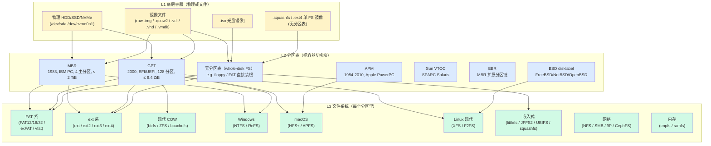
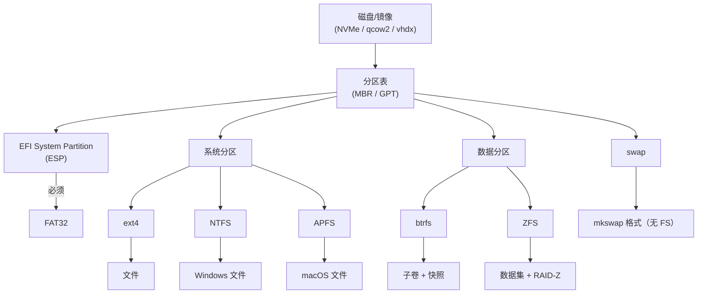

# 05-02 — 磁盘镜像 / 分区表 / 文件系统 全格式参考

> **核心问题：** "一块硬盘"到底是什么？为什么能在 Windows 看到 NTFS、Linux 看到 ext4、macOS 看到 APFS、U 盘看到 exFAT、虚拟机看到 qcow2、Live USB 看到 squashfs？这些"格式"互相是什么层级关系？什么时候用哪个？
>
> **一句话答案：** 一块磁盘有 **三层抽象**：①**底层容器**（物理 HDD/SSD/NVMe，或镜像文件 raw/qcow2/vdi/vhd/vmdk）→ ②**分区表**（MBR/GPT/APM/BSD-label，把容器切成多块）→ ③**文件系统**（FAT/ext4/btrfs/NTFS/...，决定每块分区里怎么组织文件）。三者各自独立演化，组合数极多。
>
> **本笔记定位：** 05 大类（fs / 存储）第 2 篇 —— 完整覆盖 30+ 种 FS / 10 种分区表 / 10 种镜像格式 + 横向对比 + 协同关系 + 工具链 + 业界最佳实践。
>
> **与已有笔记分工：**
> - [`05-01-vfs-virtual-filesystem.md`](05-01-vfs-virtual-filesystem.md) — VFS 抽象层（内核侧"如何统一抽象"）
> - [`00-18-storage-evolution.md`](00-18-storage-evolution.md) — 存储介质 + DRAM + NAND/NOR + FS 演化（介质视角）
> - [`00-19-image-and-bootflow-quickstart.md`](00-19-image-and-bootflow-quickstart.md) — 镜像制作 + 启动全流程实操（实操视角）
> - **本篇** — 各种格式本身（"什么是什么 / 何时用 / 谁支持"参考手册）

---

## 1. 三层抽象总览

### 1.1 一图看穿



### 1.2 三层互相独立演化

| 层 | 演化驱动 | 示例 |
|---|---------|------|
| L1 容器 | 介质创新 + 虚拟化 | HDD→SSD→NVMe；raw→qcow2→VHDX |
| L2 分区表 | 容量增长 + 多 OS 共存 | MBR (2 TiB 上限) → GPT (9.4 ZiB) |
| L3 文件系统 | 性能 + 数据完整性 + 特性 | FAT→NTFS→ReFS；ext→ext2→ext3→ext4→btrfs |

→ **任何"磁盘问题"都要先确定"我说的是哪一层"**：分区表损坏 ≠ 文件系统损坏 ≠ 镜像格式不识别。

---

## 2. 历史脉络（不跳过）

```mermaid
timeline
    title 磁盘镜像 / 分区 / FS 演化全史
    1956 : IBM 350 RAMAC - 第一块商用硬盘 (5 MB, 50 个 24" 盘片)
    1971 : IBM 8" 软盘
    1977 : Apple II - 5.25" 软盘 + Apple DOS 文件系统
    1980 : Microsoft 写 SCP MS-DOS 1.0 + FAT12（Marc McDonald）
    1983 : IBM PC AT - MBR 分区表（最多 4 主分区）
    1983 : Microsoft FAT16（DOS 3.0）
    1984 : Apple HFS（Hierarchical File System，Macintosh System 1.x 起）
    1984 : Apple Partition Map (APM) - PowerPC Mac
    1989 : OS/2 HPFS（IBM/Microsoft 联合，Microsoft 后来基于此发明 NFS→NTFS）
    1992 : Linux 0.96 - ext FS（Rémy Card）
    1993 : Linux 0.99 - ext2 FS
    1993 : Microsoft NTFS 1.0（Windows NT 3.1）
    1994 : SGI XFS（IRIX）
    1996 : Microsoft FAT32（Windows 95 OSR2）
    1996 : Apple HFS+
    1997 : VMware 创立 - 开始 VMDK 镜像格式
    2000 : Intel EFI 1.0 - GPT 分区表诞生（取代 MBR 容量上限）
    2001 : Linux 2.4 - ext3（journaling on top of ext2）
    2001 : Sun ZFS 设计开始（Jeff Bonwick）
    2003 : VirtualBox 起源（Innotek）VDI 格式
    2004 : Microsoft VHD 格式（Connectix → Microsoft）
    2005 : Sun ZFS 发布（Solaris 10）
    2006 : Linux 2.6.19 - ext4 加入主线
    2006 : Microsoft exFAT（Vista，专为大容量 SD 卡）
    2008 : Linux 2.6.28 - ext4 stable
    2008 : Linux 2.6.28 - btrfs 加入主线（Chris Mason / Oracle）
    2008 : qcow2 v2（Fabrice Bellard / QEMU）
    2009 : Microsoft VHDX（Server 2012）
    2012 : Microsoft ReFS（Resilient FS，Windows Server 2012）
    2012 : Linux F2FS（Samsung，Flash 优化）
    2014 : Linux overlayfs 主线
    2017 : Apple APFS 发布（macOS High Sierra / iOS 10.3）
    2017 : Linux 4.13 - 'fsmount/fsopen/fsconfig' 新挂载 API
    2024 : Linux 6.7 - bcachefs 主线（新一代 COW + tier）
    2026 : 现状 - GPT 全面替代 MBR；ext4/XFS/btrfs 服务器三足；APFS macOS 100%；NTFS Windows 100%
```



---

## 3. L1 镜像 / 容器格式详解

### 3.1 物理设备

| 名 | 介质 | 接口 | 块大小 | 寻址 |
|---|------|------|--------|------|
| **HDD** | 旋转磁盘 | SATA / SAS | 512B（老）/ 4 KB（4Kn）| LBA 48-bit (256 PiB) |
| **SSD（SATA）** | NAND Flash | SATA III | 4 KB / 8 KB | LBA |
| **NVMe SSD** | NAND Flash | PCIe | 4 KB（512B 模拟）| LBA + Namespace |
| **NVMe ZNS** | NAND Flash | PCIe | Zone 写入 | Zone-based（顺序约束）|
| **eMMC** | NAND Flash | MMC | 512B / 4 KB | LBA |
| **SD / microSD** | NAND Flash | SD bus | 512B | LBA + RPMB |
| **NOR Flash** | NOR | SPI / QSPI / Memory-mapped | 任意（可字节寻址）| 直接地址 |
| **NAND Flash 裸片** | NAND | ONFI | Page (2 KB-16 KB) + Block (128 KB-4 MB) | Page + Block + LUN |
| **PMEM** | Optane / NVDIMM | DDR4 | Cache line (64 B) | 字节直访 |
| **磁带 LTO** | 磁带 | SAS / FC | 64 KB | Linear |

### 3.2 镜像文件格式

| 格式 | 后缀 | 起源 | 厂商 | 特点 | 主用 |
|------|------|------|------|------|------|
| **raw / dd 镜像** | `.img` `.bin` `.raw` | 1970s+ | UNIX 通用 | 1:1 字节复制；无元数据 | dd / qemu / 嵌入式 |
| **ISO 9660** | `.iso` | 1988 | ISO 标准 | 只读光盘镜像；FS 即包装 | CD/DVD/Live USB |
| **qcow2** | `.qcow2` | 2008 | QEMU/Fabrice Bellard | Sparse + COW + 压缩 + 加密 + 快照 | KVM/QEMU |
| **qed** | `.qed` | 2010 | QEMU | qcow2 简化版（已弃，回归 qcow2）| 历史 |
| **VMDK** | `.vmdk` | 1999 | VMware | 多种子格式（monolithic/sparse/twoGbMaxExtent...）| VMware Workstation/ESXi |
| **VDI** | `.vdi` | 2003 | Innotek/Oracle VirtualBox | 动态扩张 | VirtualBox |
| **VHD** | `.vhd` | 2004 | Connectix→Microsoft | 固定 / 动态 / 差分；最大 2 TB | Hyper-V 旧版 / Virtual PC |
| **VHDX** | `.vhdx` | 2012 | Microsoft | 64 TB / 4 KB 对齐 / 损坏恢复 | Hyper-V 现代 / Windows Server |
| **OVA / OVF** | `.ova` `.ovf` | 2008 | DMTF 标准 | 虚拟机打包格式（含元数据 + vmdk）| 跨虚拟机平台 |
| **squashfs** | `.squashfs` `.sfs` | 2002 | Phillip Lougher | 只读 + 压缩 | Live USB / Docker layer / OpenWrt |
| **cpio** | `.cpio` | 1977 AT&T UNIX | UNIX | 流式归档 | initramfs / Linux kernel boot |
| **tar** | `.tar` `.tar.gz` `.tar.xz` | 1979 | UNIX | 流式归档（无随机访问）| 软件分发 / 备份 |
| **OCI image** | tar.gz layers + JSON manifest | 2015 | OCI Foundation | Docker / Podman 容器镜像 | 容器 |
| **EROFS** | `.erofs` | 2018 | Huawei | 只读压缩，性能优于 squashfs | Android 11+ / openEuler |
| **WIM** | `.wim` | 2007 | Microsoft | Windows 镜像（带 instance dedupe）| Windows 安装盘 |
| **DMG** | `.dmg` | 1999 | Apple | macOS 应用分发 | macOS .app 安装 |
| **CHD** | `.chd` | 1996 | MAME | 压缩游戏 ROM | 模拟器 |

### 3.3 qcow2 详解（最重要的镜像格式）

```
qcow2 文件结构：
  Header (64+ bytes)
    magic: "QFI\xfb"
    version: 2 / 3
    backing_file_offset / size  ← 链式快照基础
    cluster_bits (=16, 即 64 KB)
    size (虚拟磁盘大小)
    crypt_method (AES / LUKS)
    L1 table offset / size
    refcount table offset / size
    snapshots count
  L1 table (每项指向一个 L2 table)
  L2 tables (每项指向一个数据 cluster)
  Data clusters (实际数据，按需分配)
  Snapshots
  Refcount table (每个 cluster 引用计数)
```

**特性：**
- **Sparse**：未写过的区域不占空间（10 GB 虚拟盘可能只用 100 MB）
- **COW**：写时复制，可秒级快照
- **Compression**：内置 zlib/zstd 压缩
- **Encryption**：AES / LUKS 加密
- **Backing file**：增量盘叠加在基础盘上（VM 模板 + 实例化）

**典型操作：**

```sh
# 创建
qemu-img create -f qcow2 disk.qcow2 10G

# 转换
qemu-img convert -O qcow2 disk.raw disk.qcow2
qemu-img convert -O raw disk.qcow2 disk.raw      # 反向，"压平"

# 查看
qemu-img info disk.qcow2

# 快照
qemu-img snapshot -c snap1 disk.qcow2
qemu-img snapshot -l disk.qcow2

# 增量盘
qemu-img create -f qcow2 -F qcow2 -b base.qcow2 child.qcow2

# 在线扩容
qemu-img resize disk.qcow2 +5G

# 转 VHDX
qemu-img convert -O vhdx disk.qcow2 disk.vhdx
```

### 3.4 镜像格式横向对比

| 格式 | 稀疏 | 压缩 | 快照 | 加密 | 增量 | 跨 OS | 主要用 |
|------|------|------|------|------|------|-------|--------|
| raw | ✅(fs 支持时)| ❌ | ❌ | ❌ | ❌ | ✅ | dd / 嵌入式 |
| qcow2 | ✅ | ✅ | ✅ | ✅ | ✅ | ✅ | QEMU/KVM 主流 |
| VMDK | ✅ | 部分 | ✅ | ✅ | ✅ | 部分 | VMware |
| VDI | ✅ | ❌ | ✅ | ✅ | ✅ | 仅 VBox | VirtualBox |
| VHD | ✅(动态)| ❌ | ❌ | ❌ | ✅ | ✅ | Hyper-V 旧 |
| VHDX | ✅ | ❌ | ❌ | ❌ | ✅ | Hyper-V | Hyper-V 新 |
| ISO | ❌ | ❌ | ❌ | ❌ | ❌ | ✅ | 光盘 |
| squashfs | ❌ | ✅ | ❌ | ❌ | overlay | Linux | Live USB / Docker |
| EROFS | ❌ | ✅ | ❌ | ❌ | overlay | Linux | Android 11+ |
| OVA | — | — | — | — | — | ✅ | 跨 hypervisor 部署 |

---

## 4. L2 分区表格式详解

### 4.1 MBR (Master Boot Record)

**起源：** IBM PC AT 1983；硬盘第一个扇区 (LBA 0)。

**结构（512 字节扇区）：**

```
Offset  Size  Field
0x000   446   Bootstrap code (MBR boot loader 代码)
0x1BE   16    Partition entry 1
0x1CE   16    Partition entry 2
0x1DE   16    Partition entry 3
0x1EE   16    Partition entry 4
0x1FE   2     Boot signature (0x55 0xAA)
```

**Partition entry 16 字节：**
```
0     1   Status (0x80 = bootable, 0x00 = not)
1     3   CHS first sector (废弃)
4     1   Partition type (0x83 = Linux, 0x07 = NTFS, 0x0C = FAT32 LBA)
5     3   CHS last sector (废弃)
8     4   LBA first sector (起始扇区)
12    4   Number of sectors (大小)
```

**限制：**
- 最多 **4 主分区**（要更多用扩展分区 EBR 链表）
- LBA 用 32-bit → **最大 2 TiB**（在 4 KB 扇区下能到 16 TiB，但被现代标准弃用）
- 启动代码只有 446 字节（极简）

**Partition type 常见值（速查）：**
| Type ID | 含义 |
|---------|------|
| 0x00 | Empty |
| 0x01 | FAT12 |
| 0x04 | FAT16 (≤ 32 MB) |
| 0x05 | Extended (CHS) |
| 0x06 | FAT16 (> 32 MB) |
| 0x07 | NTFS / exFAT / HPFS |
| 0x0B | FAT32 (CHS) |
| 0x0C | FAT32 (LBA) |
| 0x0E | FAT16 (LBA) |
| 0x0F | Extended (LBA) |
| 0x82 | Linux swap |
| 0x83 | Linux native |
| 0x8E | Linux LVM |
| 0xA5 | FreeBSD |
| 0xA6 | OpenBSD |
| 0xA9 | NetBSD |
| 0xEE | GPT protective (MBR 兼容性占位) |
| 0xEF | EFI System Partition (ESP) |
| 0xFD | Linux RAID |

### 4.2 GPT (GUID Partition Table)

**起源：** Intel EFI 1.0 (2000)；UEFI 标准的一部分。**取代 MBR 容量与分区数限制**。

**结构：**

```
LBA 0:        Protective MBR (兼容性，让老 MBR 工具不破坏 GPT)
LBA 1:        GPT Header (主)
LBA 2-33:     Partition Entries (128 entries × 128 bytes = 16 KB)
LBA 34-...:   实际分区数据
末尾 LBA-33:  备份 Partition Entries
末尾 LBA-1:   Backup GPT Header
```

**GPT Header 字段：**
- magic = "EFI PART"
- 自身的 LBA + 备份 LBA
- 第一个可用 LBA / 最后可用 LBA
- Disk GUID（唯一识别）
- Partition entry array 起始 LBA + 数量 + 大小
- CRC32 校验

**Partition Entry 128 字节字段：**
- Partition Type GUID（如 EFI System = `C12A7328-F81F-11D2-BA4B-00A0C93EC93B`）
- Unique Partition GUID
- First LBA / Last LBA
- Attributes flags
- Partition Name (UTF-16LE，最多 36 字符)

**优势：**
- **最多 128 分区**（标准；可扩）
- **64-bit LBA → 9.4 ZiB**（远超任何现实需求）
- **CRC32 校验** + **备份头**（损坏可恢复）
- **GUID 标识**（不再依赖 1-byte type）
- **UTF-16 分区名**（中文 OK）

**常见 Partition Type GUID（速查）：**
| GUID | 含义 |
|------|------|
| `C12A7328-F81F-11D2-BA4B-00A0C93EC93B` | EFI System Partition (ESP) |
| `E3C9E316-0B5C-4DB8-817D-F92DF00215AE` | Microsoft Reserved (MSR) |
| `EBD0A0A2-B9E5-4433-87C0-68B6B72699C7` | Microsoft Basic Data (NTFS / exFAT / FAT32) |
| `0FC63DAF-8483-4772-8E79-3D69D8477DE4` | Linux Filesystem Data |
| `0657FD6D-A4AB-43C4-84E5-0933C84B4F4F` | Linux Swap |
| `E6D6D379-F507-44C2-A23C-238F2A3DF928` | Linux LVM |
| `A19D880F-05FC-4D3B-A006-743F0F84911E` | Linux RAID |
| `48465300-0000-11AA-AA11-00306543ECAC` | Apple HFS+ |
| `7C3457EF-0000-11AA-AA11-00306543ECAC` | Apple APFS |
| `516E7CB4-6ECF-11D6-8FF8-00022D09712B` | FreeBSD UFS |

### 4.3 APM (Apple Partition Map)

- 1984 PowerPC Mac 起
- 2010+ APM 被 Intel Mac 上的 GPT 替代
- 内部结构：每分区一个 partition entry（不限主/扩展）
- macOS / iPodOS 早期用
- 现在仅在老 Mac 老硬盘见到

### 4.4 BSD disklabel

- 1980s BSD UNIX
- FreeBSD / NetBSD / OpenBSD 用
- 通常作为"slice"（用 MBR 主分区当 BSD slice，里面再分 BSD partitions）
- 字段：每分区起始 sector / 大小 / fstype / fsize / bsize / cpg
- 最多 8-16 个 partitions（a-h 字母编号；'c' 通常代表整盘）

### 4.5 Sun VTOC

- 1980s SunOS / Solaris
- SPARC 平台
- 现在仅 legacy

### 4.6 Extended Boot Record (EBR)

- MBR 4 主分区不够时的扩展机制
- 一个主分区类型设为 "Extended"（type 0x05/0x0F），里面是链表
- 每个 EBR 描述一个逻辑分区 + 指向下一个 EBR
- 现代被 GPT 替代

### 4.7 无分区表（whole-disk FS）

- 整盘直接是 FS（无 MBR/GPT）
- 软盘时代常见（FAT12 直接放整盘）
- 现代场景：
  - Docker layer (squashfs)
  - Live USB 的 squashfs.img
  - 简化嵌入式（直接 mkfs.ext4 /dev/sda）

### 4.8 分区表横向对比

| 维度 | MBR | GPT | APM | BSD label |
|------|-----|-----|-----|-----------|
| 起源 | 1983 IBM PC | 2000 Intel EFI | 1984 Apple | 1980s BSD |
| 最大容量 | 2 TiB (512B 扇区) | 9.4 ZiB | TB 级 | TB 级 |
| 最大分区数 | 4 主 + 扩展 | 128 | 不限 | 8-16 |
| 启动代码 | 446 B | 通过 ESP | 苹果 ROM | BSD bootblock |
| 备份 | ❌ | ✅ 主+备份头 | ❌ | ❌ |
| 校验 | ❌ | ✅ CRC32 | ❌ | ❌ |
| 分区名 | ❌（仅 type）| ✅ UTF-16 | ✅ | ✅ |
| 工业现状 | 老 BIOS / U 盘 | **当代主流** | 已弃 | BSD 自留 |

→ **2026 年新部署应一律用 GPT**，MBR 只在兼容老 BIOS 或 ≤ 2 TB 设备时考虑。

---

## 5. L3 文件系统详解（按家族）

### 5.1 FAT 家族（Microsoft / 通用）

| FS | 起源 | 簇大小 | 文件名 | 最大文件 | 最大卷 | 现状 |
|----|------|--------|--------|----------|--------|------|
| **FAT12** | 1980 | 0.5-4 KB | 8.3 | 32 MB | 32 MB | 软盘 |
| **FAT16** | 1984 | 2-64 KB | 8.3 (LFN 选)| 2 GB | 2 GB（4 GB w/ LBA）| 老设备 |
| **FAT32** | 1996 | 4-32 KB | 8.3 (LFN 选)| **4 GB** | **2 TiB** | U 盘 / SD / EFI ESP **必须** |
| **exFAT** | 2006 | 任意（默认 128 KB）| 长名 UTF-16 | 16 EiB | 128 PiB | SDXC / 大 U 盘 |
| **vfat** | Linux 内核驱动名 | — | FAT 系列 LFN 支持 | — | — | Linux 挂 FAT 时用 |

**特点：**
- ✅ 所有 OS 都能读写（U 盘最佳兼容）
- ✅ 极简（无日志 / 无元数据 / 无权限 / 无符号链接）
- ❌ FAT32 单文件 4 GB 限制（4K/8K 视频常踩雷）
- ❌ 无日志（断电易损坏）
- ❌ 无权限（不适合多用户）

**EFI System Partition (ESP) 必须 FAT32**（UEFI 规范要求）。

### 5.2 ext 家族（Linux 主流 30 年）

| FS | 起源 | 日志 | 最大文件 | 最大卷 | 关键特性 |
|----|------|------|----------|--------|----------|
| **ext** | 1992 (Linux 0.96) | ❌ | 2 GB | 2 GB | 第一代 Linux FS（已弃）|
| **ext2** | 1993 | ❌ | 16 GB-2 TB | 2-32 TB | 快但断电易损 |
| **ext3** | 2001 | ✅（writeback / ordered / journal）| 16 GB-2 TB | 2-32 TB | ext2 + journaling |
| **ext4** ⭐ | 2008 主线 | ✅ | **16 TB** | **1 EiB** | extent / 延迟分配 / 大目录 hash / inode checksum |

**ext4 关键特性：**
- **Extents** —— 用范围记法（start + length）替代 ext3 的 block pointer 链表，极大降低元数据开销
- **延迟分配（delayed allocation）** —— 写入先在内存合并，落盘时一次分配大块（提升性能）
- **大文件 / 大目录** —— 单文件 16 TB / 单目录 64K 子项 → 用 HTree（B+ 树变种）哈希
- **journaling 三模式：**
  - `journal`（最安全）—— 数据 + 元数据都写日志
  - `ordered`（默认）—— 数据先落盘，再写元数据日志
  - `writeback`（最快）—— 仅元数据写日志
- **inline data** —— 小文件直接放 inode 内（< 60 字节）

**业界采用：** Ubuntu / Debian / RHEL（部分）/ Android（旧）/ 嵌入式 / 服务器主流。

### 5.3 现代 COW（Copy-on-Write）家族

#### btrfs

| 项 | 值 |
|---|---|
| **起源** | 2007 Chris Mason (Oracle) |
| **主线** | Linux 2.6.28 (2008) |
| **最大文件** | 16 EiB |
| **最大卷** | 16 EiB |
| **特性** | COW / 快照 / 子卷 / 在线 fsck / RAID0/1/5/6/10 / 透明压缩（zstd/lzo/zlib）/ 数据校验和（crc32c/xxhash/sha256/blake2b）|
| **业界** | Fedora 33+ 默认 / openSUSE 默认 / Synology DSM / Facebook 自家 |

#### ZFS（Sun，已被 Oracle 收购，OpenZFS fork）

| 项 | 值 |
|---|---|
| **起源** | 2001 设计 / 2005 发布 (Sun Solaris 10) |
| **OpenZFS** | 2013 fork（许可冲突，Linux 用 OpenZFS）|
| **最大文件** | 16 EiB |
| **最大卷** | 256 ZiB（超过任何现实容量）|
| **特性** | COW / 快照 / 克隆 / RAID-Z 1/2/3 / 透明压缩 / 端到端校验和 / Deduplication / L2ARC SSD 缓存 / ZIL 写日志 |
| **业界** | FreeNAS/TrueNAS / Solaris / iXsystems / Ubuntu 19.10+ 可选 / 企业 NAS 主流 |

#### bcachefs

| 项 | 值 |
|---|---|
| **起源** | 2011 Kent Overstreet（基于 bcache 演进）|
| **主线** | **Linux 6.7 (2024)** |
| **特性** | COW + 多设备 tier（HDD/SSD/NVMe 自动迁移）+ 加密 + 压缩 + 快照 + 校验 + 联机 fsck |
| **业界** | 新兴，正在评估 |

### 5.4 Linux 现代非 COW

#### XFS

| 项 | 值 |
|---|---|
| **起源** | 1994 SGI IRIX |
| **Linux 移植** | 2001 |
| **特性** | 高性能并发 IO / extent-based / B+ 树 / 在线碎片整理 / 不能在线缩小 |
| **最大文件** | 8 EiB |
| **最大卷** | 8 EiB |
| **业界** | RHEL/CentOS 默认 / 大文件场景（视频/数据库/ HPC）|

#### F2FS (Flash-Friendly File System)

| 项 | 值 |
|---|---|
| **起源** | 2012 Samsung |
| **主线** | Linux 3.8 |
| **特性** | 专为 NAND Flash 设计（log-structured / wear-leveling 友好 / TRIM 优化）|
| **业界** | Android 4.0+ 默认（手机内置存储 / SD 卡）|

### 5.5 Windows 文件系统

#### NTFS (New Technology File System)

| 项 | 值 |
|---|---|
| **起源** | 1993 Windows NT 3.1（基于 OS/2 HPFS）|
| **当代版本** | NTFS 3.1（Windows XP+）|
| **特性** | journaling / ACL（访问控制列表）/ EFS 加密 / 透明压缩 / 硬链接 / 软链接 / 稀疏文件 / quota / VSS 快照 / Reparse Point |
| **最大文件** | 16 EiB |
| **最大卷** | 16 EiB（实际 256 TB 受 MBR/GPT 限）|
| **Linux 支持** | 内核 ntfs3（写）+ NTFS-3G（FUSE，已弃）|
| **业界** | Windows 10/11 系统盘默认 / 数据盘可选 |

#### ReFS (Resilient File System)

| 项 | 值 |
|---|---|
| **起源** | 2012 Windows Server 2012 |
| **特性** | COW / 完整性校验 / 快速修复 / 大数据卷优化 / 反 bit-rot |
| **限制** | 不支持启动 / 不支持 NTFS 高级特性子集（compression / encryption / quota / hard link 等）|
| **业界** | Windows Server 数据卷 / Hyper-V 存储 |

### 5.6 macOS / Apple 文件系统

#### HFS+ (Mac OS Extended)

| 项 | 值 |
|---|---|
| **起源** | 1996 (替代 HFS) |
| **特性** | journaling（HFSJ，2002）/ Unicode 文件名 / hard link 支持 / 区分大小写可选 |
| **最大文件** | 8 EiB |
| **现状** | 2017 起被 APFS 取代 |

#### APFS (Apple File System)

| 项 | 值 |
|---|---|
| **起源** | 2017 macOS High Sierra / iOS 10.3 |
| **特性** | COW / snapshots / clones（无空间复制文件）/ 加密内嵌 / 强 metadata 完整性 / 容器（container）+ 卷（volume）双层 |
| **限制** | 仅 Apple 生态 / Linux 仅有 read-only 实现 |
| **业界** | Apple 全系（macOS / iOS / iPadOS / tvOS / watchOS / visionOS）默认 |

### 5.7 嵌入式文件系统

#### squashfs

| 项 | 值 |
|---|---|
| **起源** | 2002 Phillip Lougher |
| **主线** | Linux 2.6.29 |
| **特性** | **只读** + 强压缩（zstd / xz / lzma / gzip / lz4）+ 块大小 4-1024 KB |
| **业界** | OpenWrt rootfs / Live CD / Docker layer / Android system.img（4.4+）|

#### littlefs

| 项 | 值 |
|---|---|
| **起源** | 2017 ARM mbed 团队 |
| **特性** | **掉电安全**（power-cut resistant）+ wear-leveling + 极小（< 50 KB ROM）|
| **业界** | NOR Flash / MCU（Cortex-M）/ ESP-IDF 默认 |

#### JFFS2 (Journaling Flash File System v2)

| 项 | 值 |
|---|---|
| **起源** | 2001 Red Hat（David Woodhouse）|
| **特性** | log-structured / 启动慢（要扫整个 flash）|
| **业界** | NOR Flash 嵌入式（已老，被 littlefs / UBIFS 替代）|

#### UBIFS (Unsorted Block Image File System)

| 项 | 值 |
|---|---|
| **起源** | 2008 Nokia |
| **特性** | 跑在 UBI 层（NAND 抽象）+ 比 JFFS2 快 + journaling |
| **业界** | NAND Flash 嵌入式（路由器 / 摄像头 / 工控）|

#### EROFS (Enhanced Read-Only File System)

| 项 | 值 |
|---|---|
| **起源** | 2018 Huawei |
| **主线** | Linux 4.19 |
| **特性** | 只读 + 压缩（lz4 优化）+ 比 squashfs 性能优 |
| **业界** | Android 11+ system 分区默认 / openEuler |

### 5.8 网络文件系统

| FS | 起源 | 协议 | 用途 |
|----|------|------|------|
| **NFS v3 / v4** | Sun 1986 | RPC over TCP/UDP | UNIX 集群共享 |
| **SMB / CIFS** | 1980s IBM, Microsoft 推 | TCP 445 | Windows 共享 / Samba |
| **9P** | 1992 Plan 9 | 9P2000 | virtio-9p / WSL 共享文件 |
| **CephFS** | 2010 RedHat | RADOS | 分布式 |
| **GlusterFS** | 2005 | Gluster | 分布式 |
| **Lustre** | 1999 Sun | Lustre | HPC 集群 |
| **AFS / OpenAFS** | 1983 CMU | RX RPC | 校园网 / 企业 |
| **DFS (Microsoft)** | 1996 | SMB + DFSR | Windows AD |
| **BeeGFS** | 2008 | 自家 | HPC |
| **SeaweedFS** | 2014 | gRPC | 海量小文件 |

### 5.9 内存文件系统

| FS | 描述 |
|----|------|
| **tmpfs** | 跑在内存（用 swap 时也可换出）；`/tmp` `/run` 默认 |
| **ramfs** | 纯内存（不能换出，老式）|
| **hugetlbfs** | huge page 后端 fs |

### 5.10 伪文件系统（VFS 扩展，详见 [05-01](05-01-vfs-virtual-filesystem.md)）

| FS | 用途 |
|----|------|
| **procfs** (/proc) | 进程信息 + sysctl |
| **sysfs** (/sys) | 设备 / 总线 / 驱动 |
| **cgroupfs** (/sys/fs/cgroup) | 资源控制 |
| **bpffs** (/sys/fs/bpf) | eBPF map/program |
| **tracefs** (/sys/kernel/tracing) | ftrace |
| **debugfs** (/sys/kernel/debug) | 调试 |
| **configfs** (/sys/kernel/config) | 运行时配置 |
| **devtmpfs** (/dev) | 自动设备节点 |
| **pipefs** | 管道（不挂载）|
| **anon_inodes** | epoll/eventfd/timerfd/signalfd（不挂载）|

---

## 6. 横向大对比表（核心 FS）

| FS | 类型 | 日志 | COW | 最大文件 | 最大卷 | 校验 | 加密 | 压缩 | 多 OS | 当代主用 |
|----|------|------|-----|----------|--------|------|------|------|-------|---------|
| **FAT32** | 卷 | ❌ | ❌ | 4 GB | 2 TiB | ❌ | ❌ | ❌ | ✅ 全 OS | U 盘 / EFI ESP |
| **exFAT** | 卷 | ❌ | ❌ | 16 EiB | 128 PiB | ❌ | ❌ | ❌ | ✅ 全 OS | SDXC |
| **NTFS** | 卷 | ✅ | ❌ | 16 EiB | 16 EiB | metadata | ✅ EFS | ✅ | Linux RW | Windows |
| **ReFS** | 卷 | ✅ | ✅ | 16 EiB | 1 YiB | ✅ | ❌ | ❌ | Win Server | Win Server 数据 |
| **HFS+** | 卷 | ✅(HFSJ)| ❌ | 8 EiB | 8 EiB | ❌ | ✅ | ❌ | macOS | 老 Mac |
| **APFS** | 容器+卷 | ✅ | ✅ | 8 EiB | 8 EiB | ✅ | ✅ 内嵌 | ❌ | macOS only | Apple 全系 |
| **ext4** ⭐ | 卷 | ✅ | ❌ | 16 TB | 1 EiB | metadata | ❌ | ❌ | Linux | Linux 桌面/服务器主流 |
| **XFS** | 卷 | ✅ | ❌ | 8 EiB | 8 EiB | metadata | ❌ | ❌ | Linux | RHEL 默认/大文件 |
| **btrfs** | 卷+子卷 | metadata | ✅ | 16 EiB | 16 EiB | ✅ | ❌ | ✅ | Linux | Fedora/openSUSE |
| **ZFS** | 池+数据集 | metadata | ✅ | 16 EiB | 256 ZiB | ✅ | ✅ | ✅ | Solaris/BSD/Linux | NAS/企业 |
| **bcachefs** | 卷+多设备 | metadata | ✅ | 16 EiB | — | ✅ | ✅ | ✅ | Linux 6.7+ | 新兴 |
| **F2FS** | 卷 | ✅ | log-struct | 16 TB | 16 TB | ✅ | ✅ | ✅ | Linux | Android 内置 |
| **squashfs** | 卷 | — | ❌ | 1 TB | 1 TB | ❌ | ❌ | ✅ | Linux | Live USB / Docker |
| **EROFS** | 卷 | — | ❌ | 16 EiB | 16 EiB | ✅ | ✅ | ✅ | Linux | Android 11+/openEuler |
| **littlefs** | 卷 | ✅ | ❌ | 2 GB | 2 GB | ✅ | ❌ | ❌ | RTOS+Linux | NOR Flash MCU |
| **UBIFS** | 卷 | ✅ | ❌ | — | — | ✅ | ✅ | ✅ | Linux | NAND 嵌入式 |
| **JFFS2** | 卷 | log-struct | ❌ | — | — | ❌ | ❌ | ✅ | Linux | NOR (老) |

---

## 7. 镜像 + 分区 + FS 协同关系

### 7.1 典型组合

| 场景 | 镜像 | 分区 | FS |
|------|------|------|----|
| **U 盘装系统** | raw .iso | 无 / 转 GPT | exFAT / FAT32 / squashfs |
| **服务器 SSD** | 物理 NVMe | GPT | ext4 / XFS / btrfs |
| **桌面 Linux** | 物理 SSD | GPT | ext4 (root) + FAT32 (ESP) + swap |
| **Windows 安装盘** | .iso (UDF) | GPT | NTFS + FAT32 (ESP) |
| **macOS 系统盘** | 物理 SSD | GPT | APFS container（多卷）|
| **KVM 虚拟机** | qcow2 | GPT | ext4 / btrfs |
| **VMware VM** | vmdk | GPT | ext4 / NTFS |
| **VirtualBox VM** | vdi | GPT | ext4 / NTFS |
| **Hyper-V VM** | vhdx | GPT | NTFS / ReFS |
| **Docker 容器镜像** | tar.gz layer | 无 | overlay (底层 ext4) |
| **OpenWrt 路由** | .img | 简化 / 无 | squashfs (root) + jffs2/overlay (数据)|
| **Android 手机** | .img | GPT-like | EROFS (system) + F2FS (userdata) |
| **Raspberry Pi** | .img | MBR | FAT32 (boot) + ext4 (root) |
| **Buildroot 嵌入式** | .img | MBR / 无 | ext4 / squashfs / cramfs |
| **NAS** | 多盘 | GPT | ZFS pool / btrfs RAID |

### 7.2 协同示意图



---

## 8. QuickStart / Daily Use / 业界最佳实践

### 8.1 QuickStart：制作一个完整可启动镜像

```sh
# 1. 创建 10 GB 空镜像
qemu-img create -f raw disk.img 10G   # 或 qcow2

# 2. loop 关联
sudo losetup -fP --show disk.img      # → /dev/loop0

# 3. 创建 GPT 分区表 + 2 分区
sudo parted /dev/loop0 mklabel gpt
sudo parted /dev/loop0 mkpart "ESP" fat32 1MiB 513MiB
sudo parted /dev/loop0 mkpart "root" ext4 513MiB 100%
sudo parted /dev/loop0 set 1 esp on

# 4. 创建文件系统
sudo mkfs.fat -F32 /dev/loop0p1
sudo mkfs.ext4 /dev/loop0p2

# 5. 挂载 + 写文件
sudo mkdir -p /mnt/{esp,root}
sudo mount /dev/loop0p1 /mnt/esp
sudo mount /dev/loop0p2 /mnt/root
sudo cp -r /path/to/rootfs/* /mnt/root/
sudo cp /path/to/grub.efi /mnt/esp/EFI/BOOT/BOOTX64.EFI

# 6. 卸载 + 释放
sudo umount /mnt/{esp,root}
sudo losetup -d /dev/loop0

# 7. 跑 QEMU 验证
qemu-system-x86_64 -bios /usr/share/edk2/ovmf/OVMF.fd \
    -drive format=raw,file=disk.img -nographic
```

### 8.2 Daily Use（运维常用）

| 场景 | 命令 |
|------|------|
| 看分区表 | `parted /dev/sda print` / `gdisk -l /dev/sda` / `fdisk -l` |
| 看 FS | `lsblk -f` / `blkid` |
| 看磁盘容量 | `df -h` / `du -sh *` |
| 看 inode | `df -i` |
| 调整大小 | `resize2fs /dev/sda1`（ext）/ `xfs_growfs /mnt`（XFS） |
| 转 ext4 → btrfs | `btrfs-convert /dev/sdaX` |
| 修 FS | `fsck.ext4 /dev/sdaX` / `xfs_repair` / `btrfs check` |
| 在线 trim | `fstrim -av` |
| 备份 FS | `dd if=/dev/sda of=disk.img bs=4M` / `qemu-img convert` |
| 加密 | `cryptsetup luksFormat /dev/sdaX` |
| 看 GPT GUID | `gdisk -l /dev/sda` 看 Code/GUID |
| 改 GPT 分区名 | `gdisk /dev/sda` → `c` 命令 |
| 重建分区表 | `parted ... mklabel gpt`（**会清空所有分区**）|
| 转 MBR ↔ GPT | `gdisk /dev/sda` → `r` recovery 菜单 |
| 看 qcow2 占用 | `qemu-img info disk.qcow2` 看 actual size |
| 压缩 qcow2 | `qemu-img convert -c -O qcow2 src dst` |
| 挂 qcow2 | `qemu-nbd -c /dev/nbd0 disk.qcow2` 后 `mount /dev/nbd0p1 /mnt` |
| 挂 vmdk | `qemu-nbd -c /dev/nbd0 disk.vmdk` |
| 挂 vhd/vhdx | `qemu-nbd -c /dev/nbd0 disk.vhdx` |

### 8.3 业界最佳实践

| 场景 | 推荐 |
|------|------|
| **新装 Linux 桌面** | GPT + ext4 (root) + FAT32 (ESP, 512 MB-1 GB) + swap (= RAM 大小或更小) |
| **新装 Linux 服务器** | GPT + XFS (root, 大文件多) 或 ext4 (通用) + FAT32 (ESP) |
| **NAS / 数据存储** | ZFS pool 或 btrfs RAID（带快照 + 校验）|
| **Live USB** | ISO 9660 + squashfs (rootfs) |
| **K8s 持久化卷** | XFS / ext4（avoid btrfs/ZFS in K8s OK 较新）|
| **数据库存储** | XFS（PostgreSQL 推荐）/ ext4 (MySQL 默认) |
| **手机 / Android** | F2FS (用户数据) + EROFS (系统分区) |
| **嵌入式 NOR Flash** | littlefs |
| **嵌入式 NAND Flash** | UBIFS |
| **路由器 OpenWrt** | squashfs (root, 只读) + jffs2/overlay (可写)|
| **桌面虚拟机** | qcow2 (KVM) / vmdk (VMware) / vhdx (Hyper-V) |
| **跨虚拟机平台分发** | OVA |
| **容器层** | overlayfs over ext4 |
| **加密敏感** | LUKS + ext4 / btrfs / XFS |

### 8.4 常见坑

| 坑 | 原因 / 解 |
|----|----------|
| FAT32 复制 > 4 GB 文件失败 | 单文件 4 GB 限 → 改用 exFAT / NTFS / ext4 |
| Windows 看不到 ext4 分区 | Win 不内置 ext4；装 [Ext2Fsd](http://www.ext2fsd.com) 或用 WSL |
| Linux 看不到 NTFS 写入 | 老系统装 ntfs-3g；新内核（5.15+）已带 ntfs3 内核驱动 |
| GPT 分区在老 BIOS 不能启动 | 用 UEFI BIOS 或保留一段 BIOS Boot Partition |
| qcow2 越用越大 | `qemu-img convert -O qcow2`（紧缩）或 `discard=unmap`（trim）|
| dd 时 sync 失败 | 加 `oflag=sync` 强制同步 |
| btrfs RAID5/6 风险 | 主线警告"unstable for write hole"；生产用 RAID1/10 替代 |
| ZFS Linux 许可冲突 | OpenZFS 用 CDDL，Linux GPL 不兼容；Ubuntu 用 DKMS 编译 |

---

## 9. 工具链速查

### 9.1 分区工具

| 工具 | 平台 | 特点 |
|------|------|------|
| `fdisk` | Linux/BSD | 老牌，新版支持 GPT |
| `parted` | Linux | 强大，脚本友好 |
| `gdisk` (sgdisk) | Linux | GPT 专用 |
| `cgdisk` | Linux | curses 界面 |
| `cfdisk` | Linux | curses 界面 |
| `diskpart` | Windows | 命令行 |
| `Disk Management` | Windows GUI | 图形 |
| `diskutil` | macOS | 命令行 |
| `Disk Utility` | macOS GUI | 图形 |
| `gnome-disks` / `KDE Partition Manager` | Linux GUI | 图形 |
| `gparted` | Linux GUI | 图形（含 Live ISO）|

### 9.2 FS 工具

```sh
mkfs.ext4 / mkfs.ext3 / mkfs.ext2 /
mkfs.xfs / mkfs.btrfs / mkfs.f2fs /
mkfs.fat -F32 / mkfs.exfat / mkfs.ntfs /
zpool create / zfs create
mkfs.jffs2 / mkfs.ubifs /
mksquashfs / mkfs.erofs /
mkswap

# 检查 / 修复
fsck.ext4 / xfs_repair / btrfs check /
chkdsk (Windows) / fsck_apfs (macOS)

# 调整大小
resize2fs / xfs_growfs / btrfs filesystem resize /
ntfsresize
```

### 9.3 镜像工具

| 工具 | 用途 |
|------|------|
| `dd` | 通用 raw 复制 |
| `qemu-img` | 多种格式互转 + 创建 + 查看 |
| `qemu-nbd` | 把任何 QEMU 支持的镜像导出为 NBD 块设备（可挂载）|
| `vbox-img` (VBoxManage) | VirtualBox 镜像 |
| `vmware-vdiskmanager` | VMware vmdk |
| `Hyper-V cmdlets` (PowerShell) | VHD/VHDX |
| `losetup` | Linux loop device |
| `kpartx` | 把镜像内分区暴露为 /dev/mapper/loop0p1 |
| `mkisofs` / `genisoimage` / `xorriso` | ISO 制作 |
| `mksquashfs` / `unsquashfs` | squashfs |
| `tar` / `cpio` / `pax` | 归档 |
| `rauc` / `mender` | 嵌入式 OTA 更新（详见 [00-20 OTA](00-20-firmware-ota-evolution.md)）|

---

## 10. 设计要点归纳（不预设具体项目）


学到的工程要点（任何想做存储栈的项目都可借鉴）：

1. **三层抽象不要混淆** —— 镜像格式 / 分区表 / 文件系统是独立的，分别演化
2. **现代默认 GPT** —— MBR 仅在兼容老 BIOS 或 ≤ 2 TiB 设备
3. **EFI ESP 必须 FAT32** —— UEFI 规范硬要求
4. **服务器选 ext4 / XFS / btrfs / ZFS** —— 看场景：通用 ext4，大文件 XFS，快照 btrfs，企业 NAS ZFS
5. **嵌入式选 littlefs / UBIFS / squashfs** —— NOR Flash 优先 littlefs，NAND 优先 UBIFS，只读 squashfs
6. **加密选 LUKS** —— 块层加密，与具体 FS 解耦
7. **快照能力来自 COW** —— btrfs / ZFS / APFS 内置；ext4 / XFS 用 LVM thin pool 实现
8. **跨平台共享用 exFAT** —— FAT32 4 GB 限太小
9. **容器镜像分层用 overlayfs** —— 上下层合并
10. **新硬件考虑 ZNS / KV-SSD** —— 新存储接口可能改变 FS 设计

---

## 11. 专有名词词典

| 术语 | 是什么 |
|------|--------|
| **LBA** | Logical Block Address，扇区线性编号 |
| **CHS** | Cylinder-Head-Sector，老硬盘几何寻址 |
| **PT** | Partition Table |
| **MBR** | Master Boot Record，1983 |
| **GPT** | GUID Partition Table，2000 |
| **APM** | Apple Partition Map |
| **EBR** | Extended Boot Record |
| **ESP** | EFI System Partition |
| **MSR** | Microsoft Reserved Partition |
| **BIOS Boot Partition** | GPT 上预留给老 BIOS 的 1MB 分区 |
| **VBR** | Volume Boot Record（分区内的引导扇区）|
| **inode** | 文件元数据节点 |
| **superblock** | FS 元信息（详见 [05-01](05-01-vfs-virtual-filesystem.md)） |
| **journal** | 日志（保证一致性）|
| **COW** | Copy-on-Write |
| **WAL** | Write-Ahead Log |
| **extent** | 连续块范围（替代 block pointer 链）|
| **inline data** | 小文件存 inode 内 |
| **HTree** | ext4 大目录的 hash 树 |
| **B+ tree** | XFS / NTFS 用的 B+ 树 |
| **CRC32 / xxhash** | 数据校验和 |
| **dedup** | 数据去重（ZFS 特性）|
| **L2ARC** | ZFS 二级缓存（SSD）|
| **ZIL** | ZFS Intent Log（写日志）|
| **subvolume** | btrfs / ZFS 的"子文件系统" |
| **snapshot** | 时间点快照 |
| **clone** | 写时分裂的快照分支 |
| **Trim / Discard** | 通知 SSD 哪些块不用了（提性能 + 寿命）|
| **wear-leveling** | NAND 写均衡 |
| **bad block management** | NAND 坏块管理 |
| **MTD** | Memory Technology Device（Linux NAND/NOR 抽象）|
| **UBI** | Unsorted Block Image（NAND 抽象层）|
| **LUKS** | Linux Unified Key Setup（加密标准）|
| **FUSE** | 用户态 FS 框架（详见 [05-01](05-01-vfs-virtual-filesystem.md)） |
| **NBD** | Network Block Device |
| **iSCSI** | IP SAN 协议 |
| **SAN** | Storage Area Network |
| **NAS** | Network Attached Storage |
| **DAS** | Direct Attached Storage |

---

## 12. 练习题

### 练习 1（基础）：手工造一个完整的可启动镜像

按 § 8.1 步骤造出一个 10 GB GPT 镜像，2 分区（ESP + ext4 root）。用 QEMU 启动验证。

**自检：** `parted /dev/loop0 print` 显示正确分区表？`mount` 看到 ext4？UEFI 找到 ESP 引导？

### 练习 2（中级）：把 raw 转 qcow2 + 创建快照

```sh
qemu-img convert -O qcow2 disk.raw disk.qcow2
qemu-img snapshot -c snap1 disk.qcow2
# 修改文件后
qemu-img snapshot -a snap1 disk.qcow2   # 回滚
```

**自检：** 是否能成功回滚？快照前后文件状态恢复？

### 练习 3（进阶）：对比 ext4 vs btrfs vs ZFS

在 3 个 8 GB 分区分别创建 ext4 / btrfs / ZFS，跑 `fio` 测试：
- 4K 随机读写 IOPS
- 顺序读写带宽
- 元数据操作（创建 100K 小文件）

**自检：** 哪个 FS 在哪个场景胜出？为什么？

### 练习 4（造轮）：自己写一个 minimal FS 设计草案

写一份 500-1000 字的极简 FS 设计草案：
- inode 结构
- 块分配策略（bitmap / extent / B+ tree）
- 目录组织（线性 / hash / B+ tree）
- 是否带 journal
- 是否 COW
- 哪个场景目标（嵌入式 / 桌面 / 服务器）


---

## 13. 本地资料对应

### 已克隆的 FS 项目（fs/）
- `fs/easyfs/` — rCore 教学最简 FS
- `fs/ext2-rs/` — Rust ext2
- `fs/ext4_rs/` — Rust ext4
- `fs/lwext4_rust/` — lwext4 嵌入式 ext4 Rust 绑定
- `fs/fatfs/` — C FAT
- `fs/littlefs/` — 嵌入式掉电安全
- `fs/libfuse/` — FUSE 用户态库
- `fs/fuse-ext2/` — FUSE 客户端 ext2
- `fs/linux-fs/fs/` — Linux 内核 fs/ 完整源码（含 fs/ext2 / fs/ext4 / fs/fat 子目录）

### 工具链（系统自带或需 apt install）
- parted / gdisk / fdisk
- mkfs.ext4 / mkfs.xfs / mkfs.btrfs / mkfs.fat / mkfs.exfat
- qemu-img / qemu-nbd
- dd / losetup / kpartx
- mkisofs / xorriso / mksquashfs

### 已有相关笔记
- [`05-01-vfs-virtual-filesystem.md`](05-01-vfs-virtual-filesystem.md) — VFS 抽象层 + 4 大对象 + linux-fs/fs/ 全文件分组
- [`00-18-storage-evolution.md`](00-18-storage-evolution.md) — 存储介质 + DRAM 控制器 + NAND/NOR + FS 演化（介质视角）
- [`00-36-security-evolution.md`](00-36-security-evolution.md) — LUKS / fscrypt / fsverity（加密视角）
- [`00-20-firmware-ota-evolution.md`](00-20-firmware-ota-evolution.md) — A/B 双分区 OTA / Mender / RAUC / OSTree
- [`00-19-image-and-bootflow-quickstart.md`](00-19-image-and-bootflow-quickstart.md) — dd/parted/mkfs/loop/mount 实操工作流 + 14 distro 启动矩阵
- [`03-04-dts-dtb-fdt-syntax-reference.md`](03-04-dts-dtb-fdt-syntax-reference.md) — FIT 镜像格式（启动用）
- [`04-05-monolithic-kernels-walkthrough.md`](04-05-monolithic-kernels-walkthrough.md) — TornadoOS async-fat32

---

## 14. 进一步阅读

### 经典论文
- McKusick, *A Fast File System for UNIX* (1984) — UFS 经典
- *The Design and Implementation of the FreeBSD Operating System* ch.10
- Bonwick, *ZFS: The Last Word in Filesystems* (2004)
- Mason, *Btrfs: The Linux B-tree Filesystem* (2007)

### 标准 / 规范
- **UEFI Specification 2.10** — GPT 部分
- **DMTF DSP0244** — VHDX format
- **Microsoft VHD spec** v1.0
- **VMware VMDK spec** (VMDK Format Specification)
- **QEMU qcow2 spec** — `qemu/docs/interop/qcow2.txt`
- **ECMA-167** — UDF (Universal Disk Format，DVD/Blu-ray)
- **ISO 9660** — CD 光盘 FS

### 教学资源
- *Operating Systems: Three Easy Pieces* (OSTEP) — File Systems 部分
- Linux kernel `Documentation/filesystems/`

### 接下来的笔记预告（05-XX 后续）
- **05-03** (TODO) — ext2/ext4 + jbd2 日志深读
- **05-04** (TODO) — FAT 完整解析（FAT12/16/32/exFAT + LFN）
- **05-05** (TODO) — btrfs / ZFS COW 双雄对比深读
- **05-06** (TODO) — 嵌入式 fs（littlefs/JFFS2/UBIFS/F2FS）
- **05-07** (TODO) — overlayfs + 容器分层
- **05-08** (TODO) — FUSE 实战
- **05-09** (TODO) — 9P / NFS / SMB 网络 fs
- **05-10** (TODO，等用户学完后由用户自定) — FS 相关设计专题

---

**回到学习路线：** 读完本笔记后你已经能：
- ✅ 区分镜像 / 分区表 / 文件系统三层抽象
- ✅ 看懂任意磁盘组成（fdisk / parted / lsblk -f）
- ✅ 选择正确 FS（按场景：服务器 / 桌面 / 嵌入式 / NAS / 容器）
- ✅ 使用主流工具（mkfs.* / qemu-img / parted / gdisk）
- ✅ 转换镜像格式（raw ↔ qcow2 ↔ vmdk ↔ vhdx）
- ✅ 解决常见坑（FAT32 4GB / GPT 老 BIOS / Windows-Linux FS 互访）

**下一步推荐：** 继续 fs/ 大类深读（ext4 / btrfs / squashfs 任选），或回到 boot 6 项目精读 review，或处理其他用户主题。
