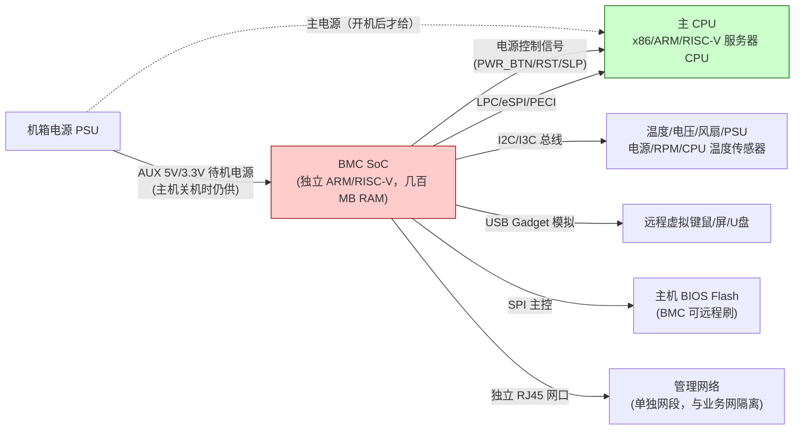
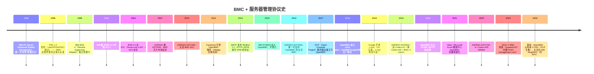
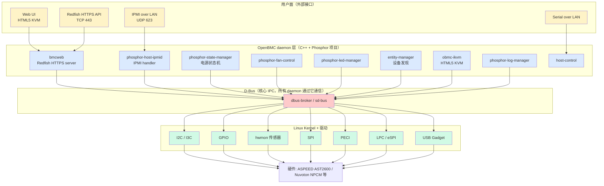
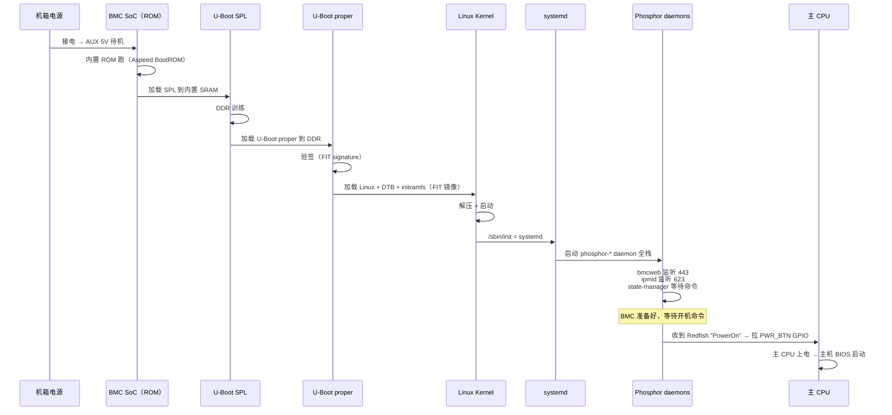

# 12-01 — BMC 全谱 + OpenBMC / u-bmc 精读（服务器管理固件）

> **核心问题：** 服务器主板上焊死的"另一颗 ARM 芯片"是干嘛的？为什么 HPE iLO / Dell iDRAC / Lenovo XCC 是同一类东西？OpenBMC 凭什么能把这块独立硬件用一个 Linux 发行版跑起来？整个子系统怎么组织？
>
> **一句话答案：** **BMC（Baseboard Management Controller）** 是服务器主板上的**独立 SoC**（典型 Aspeed AST2600 双 Cortex-A7），与主 CPU 完全分离、由待机电源（PSU AUX 5V）供电，**主 CPU 关机时仍在跑**。它的职责是远程开关机 / 监控温度风扇 / 接管虚拟键鼠屏 / 重刷主机 BIOS。**OpenBMC** 是 Linux Foundation 主推的开源 BMC 操作系统（Linux + Yocto + Phosphor C++ daemon 集 + D-Bus + Redfish），与 Google 推的 **u-bmc**（Go 实现）共同构成 BMC 开源界的双雄。
>

---

## 1. 顶层视野：BMC 在服务器中的物理与逻辑位置

### 1.1 一图看懂



**关键性质：**
- BMC = **always-on**（机房接电就活，不依赖主 CPU）
- BMC = **out-of-band 管理**（独立网卡 / 独立网段 / 独立 IP）
- BMC = **特权**（能开关机 / 重刷 BIOS / 接管屏幕键盘）

**重要程度：** 数据中心运维 100% 依赖 BMC ——没有 BMC 就要派人到机房按电源键。

### 1.2 BMC 在 boot 链中的位置（与 03-XX 联动）

```
机房接电
    ↓
PSU 输出 AUX 5V（待机电源）
    ↓
BMC SoC 上电（独立小 boot 链）
    ↓ ROM → SPL → U-Boot proper → Linux + Phosphor daemons
    ↓
BMC 跑起来后等待开机命令
    ↓ （Redfish/IPMI/物理按钮）
BMC 控制主板 PSU 主电源 ON
    ↓
主 CPU 上电 → 主机 BIOS/UEFI（详见 03-12 EDK2）
    ↓
主机 OS 启动
    ↓
BMC 在后台持续监控（温度/风扇/电源/CPU 错误）
```

→ **BMC 是 BIOS 之前的层**——比 SBI 还早。

### 1.3 商业 BMC 产品代称（同物异名）

| 厂商 | BMC 产品名 |
|------|-----------|
| HPE | **iLO**（Integrated Lights-Out）|
| Dell | **iDRAC**（integrated Dell Remote Access Controller）|
| Lenovo | **XCC**（XClarity Controller）|
| IBM Power | **FSP**（Flexible Service Processor）/ **OpenBMC** |
| Supermicro | **IPMI**（实际是协议名当产品名）|
| AMI（卖固件给 ODM）| **MegaRAC SP-X** |
| 浪潮 | **Inspur BMC** |
| 华为 | **iBMA / iBMC** |
| 新华三 | **HDM** |
| 戴尔 EMC 存储 | **iDRAC + EMC SLIC** |
| Tesla（汽车数据中心）| 自家定制 OpenBMC |

→ **OpenBMC 是这些闭源 BMC 固件的开源替代品**，让企业能审计 / 定制 / 自主安全更新。

---

## 2. 历史脉络（不跳过）

### 2.1 BMC + IPMI 整体演化时间线



### 2.2 关键转折点

#### (a) 1998 IPMI 诞生

Intel + HP + Dell + NEC 联合发布 **Intelligent Platform Management Interface 1.0**——把"远程管理硬件"标准化。当时痛点：
- 每家服务器各有专有管理协议
- 数据中心运维要装一堆专有软件
- 协议互不兼容

IPMI 解决：统一规定**消息格式（IPMI message）+ 通信通道（IPMB / KCS / LAN）+ 命令集**。

**问题：** IPMI 设计于 1990s，安全考虑薄弱（明文传输 / 弱认证 / RAKP 密码 hash 泄漏漏洞），2010s 起被列为"陈旧不安全"。

#### (b) 2014 Redfish 诞生

DMTF 推 **Redfish 1.0** ——基于 HTTPS + RESTful + JSON 的现代管理 API：
- 替代 IPMI 二进制协议
- 标准 schema（DMTF 维护）
- HTTP 友好（curl 即可调）
- 强加密（TLS）

**今天的 BMC 必须同时支持 IPMI（兼容老）+ Redfish（现代）。**

#### (c) 2014 OpenBMC 起源（Facebook Wedge）

**Facebook 当时的痛点：** 自家数据中心几十万台服务器，BMC 固件来自不同 ODM，**漏洞修复极慢 / 安全审计困难**。Facebook 工程师决定自己写。

**起步项目 Wedge 交换机** —— 用 OpenBMC 雏形管理 ToR 交换机。

后来 **IBM POWER 加入**（2015）—— IBM 主机时代沉淀的 BMC 经验全部贡献到 OpenBMC，整个项目质量大幅提升。

#### (d) 2018 Linux Foundation 接管

**五厂联合**（Intel + Microsoft + Google + IBM + Meta）正式把 OpenBMC 移交 LF 托管。意味着：
- 项目治理中立
- 各家工程师协同
- 跨厂商兼容性保证

#### (e) 2018 u-bmc 诞生

**Google 觉得 OpenBMC 的 Yocto + C++ 路线太老派**，推出 **u-bmc**（u-root 项目衍生）：
- **全 Go 实现**
- Linux 内核 + Go user space（用 u-root 的 init）
- 设计现代化（无 D-Bus，直接 Go channel）
- 内存安全 + 单二进制

→ 与 OpenBMC 竞争但市场份额小。

---

## 3. BMC 硬件芯片市场

| 厂商 | 芯片 | 内核 | 工艺 | OpenBMC 支持 | 主要客户 |
|------|------|------|------|--------------|---------|
| **ASPEED** | AST2300/2400 | ARM926EJ-S | 旧 | 历史支持 | 早期服务器 |
| **ASPEED** | **AST2500** | 单 Cortex-A9 | 28nm | ✅ 主流 | 主流 OCP / 浪潮 / 富士康 |
| **ASPEED** | **AST2600** ⭐ | 双 Cortex-A7 + Cortex-M3 + RISC-V coproc | 28nm | ✅ **当前主流** | OCP 主流 / Meta / Microsoft |
| **ASPEED** | **AST2700** | 4× Cortex-A35 ARM64 | 12nm | ✅ 新一代 | 2024+ 旗舰 |
| **Nuvoton** | NPCM730/750 | Cortex-A9 双核 | — | ✅ | Quanta / Inventec |
| **Nuvoton** | NPCM845（Arbel）| Cortex-A35 4 核 | — | ✅ | Hyperscaler 备选 |
| **Microchip** | PIC32MZ-EF / Lassen | MIPS | — | 部分 | 小众 |
| **Marvell** | ARMADA | 多核 ARM | — | 实验 | 小众 |
| **国产** | 兆芯 / 华芯通 / 飞腾 BMC 项目 | 自家 ARM | — | 部分自家 OpenBMC 移植 | 信创服务器 |
| **国产 RISC-V** | 沁恒 / 兆易 BMC 探索 | RV64 | — | 实验 | 远期 |

→ **ASPEED 是 BMC 芯片市场绝对主导（70%+）**，其次 Nuvoton。

**典型 BMC 配置（AST2600）：**
- CPU：双 Cortex-A7 @ 1.2 GHz + 单 Cortex-M3（辅助管理）+ 内置 RISC-V 协处理器
- RAM：1 GB DDR4
- Flash：64-128 MB SPI NOR
- 接口：USB 2.0 host/device / 网口 ×2 / I²C ×16 / I³C ×4 / SPI ×6 / GPIO 几百根 / PWM / Tach / VGA 输出
- 协处理器：Video capture（捕获主机 VGA）/ KVM 加速

---

## 4. OpenBMC 整体架构

### 4.1 软件栈分层



### 4.2 关键架构选择

| 维度 | OpenBMC 选择 | 原因 |
|------|-------------|------|
| 内核 | **Linux**（不是 RTOS）| BMC 已经够强（Cortex-A7+ 几百 MB RAM）|
| 构建系统 | **Yocto poky**（与 OpenEmbedded 同源）| 跨多厂多板灵活配置 |
| init | **systemd** | 与现代 Linux 一致 |
| IPC | **D-Bus**（核心）| 所有 daemon 之间标准通信 |
| 主语言 | **C++**（少量 Python / Shell）| 性能 + 资源约束 + 生态 |
| Web 框架 | **bmcweb**（自家 C++）| 资源约束（不用 nginx）|
| rootfs | **squashfs 只读 + overlayfs 可写** | 防变砖 + A/B 升级 |
| 启动 | **U-Boot SPL → U-Boot proper → Linux** | 同 Linux 嵌入式标配 |

详细 rootfs / Yocto 知识见 [`00-35-distro-evolution.md`](00-35-distro-evolution.md) Yocto 章节。

---

## 5. 核心子系统逐个看

### 5.1 通信协议层

| 子系统 | 全称 | 标准化 | 职责 |
|--------|------|--------|------|
| **IPMI** | Intelligent Platform Management Interface | Intel/HP/Dell/NEC 1998 | 老协议；over LAN（UDP 623）/ over Serial / KCS（主机内）|
| **Redfish** | DMTF Redfish | DMTF DSP0266 (2014+) | **替代 IPMI**；HTTP+JSON RESTful |
| **MCTP** | Management Component Transport Protocol | DMTF DSP0236 | BMC ↔ NIC/NVMe/GPU 内置管理芯片通信，跑在 I²C/PCIe/SMBus 上 |
| **PLDM** | Platform Level Data Model | DMTF DSP0240 | 跑在 MCTP 之上的应用层（监控 / 固件升级 / BIOS 配置）|
| **NVMe-MI** | NVMe Management Interface | NVMe org | BMC 管理 NVMe SSD（健康度 / 温度 / 错误率）|
| **NC-SI** | Network Controller Sideband Interface | DMTF | BMC 通过共享主机网卡通信（节省管理网口）|
| **SPDM** | Security Protocol and Data Model | DMTF | 设备身份认证 + attestation |
| **DCMI** | Data Center Manageability Interface | Intel | 数据中心特化的 IPMI 子集（电源帽限制等）|

### 5.2 Phosphor daemon 谱（OpenBMC 自家组件，C++）

> 所有 OpenBMC 自家 daemon 都用 `phosphor-` 前缀（取自 IBM 内部代号）。完整列表 100+ 个，下面列最常见的：

#### 5.2.1 Web / 协议入口

| Daemon | 职责 |
|--------|------|
| `bmcweb` | Redfish HTTPS server + Web UI 后端（C++，主入口）|
| `phosphor-host-ipmid` | IPMI 命令路由（host 侧 KCS）|
| `phosphor-net-ipmid` | IPMI over LAN |
| `obmc-console` | Serial-over-LAN 实现 |

#### 5.2.2 状态机

| Daemon | 职责 |
|--------|------|
| `phosphor-state-manager` | 主机电源状态机（off/on/reset/diagnostic_mode）|
| `phosphor-bmc-state-manager` | BMC 自身状态（ready/quiesced）|
| `phosphor-chassis-state-manager` | 机箱状态（Power Good 等）|

#### 5.2.3 监控与日志

| Daemon | 职责 |
|--------|------|
| `phosphor-log-manager` | 系统日志（含 SEL = System Event Log）|
| `phosphor-debug-collector` | dump 收集（dump-on-crash）|
| `phosphor-host-postd` | POST code 监听（BIOS 启动诊断码 0x80 端口）|
| `phosphor-host-error-monitor` | 主机硬件错误（CPU MCE / DIMM ECC）|

#### 5.2.4 传感器与硬件

| Daemon | 职责 |
|--------|------|
| `dbus-sensors` | 把传感器统一暴露到 D-Bus（hwmon → D-Bus 桥）|
| `phosphor-hwmon` | 硬件监控（温度/电压传感器读数）|
| `phosphor-virtual-sensor` | 虚拟传感器（如"前后入风口温差"等计算量）|
| `phosphor-fan-presence` | 风扇插入检测 |
| `phosphor-fan-control` | 风扇转速控制 |
| `phosphor-pid-control` | PID 风扇控温算法（PID 闭环）|

#### 5.2.5 电源与 PSU

| Daemon | 职责 |
|--------|------|
| `phosphor-power-monitor` | PSU 监控（in/out 电压电流）|
| `phosphor-power-control` | PSU 开关 |
| `power-supply` | 单 PSU 详细监控 |

#### 5.2.6 LED 与机箱

| Daemon | 职责 |
|--------|------|
| `phosphor-led-manager` | 主板 LED 控制（标识灯/故障灯/活动灯）|
| `phosphor-led-sysfs` | LED sysfs 桥 |

#### 5.2.7 时间 / 用户 / 证书 / 网络

| Daemon | 职责 |
|--------|------|
| `phosphor-time-manager` | NTP / RTC 时间管理 |
| `phosphor-user-manager` | 用户/权限管理 |
| `phosphor-certificate-manager` | TLS 证书管理 |
| `phosphor-snmp` | SNMP trap 发送 |
| `phosphor-networkd` | 网络配置（封装 systemd-networkd）|
| `phosphor-dhcp-monitor` | DHCP 监控 |

#### 5.2.8 远程接管（KVM）

| Daemon | 职责 |
|--------|------|
| `obmc-ikvm` | 把主机 VGA 输出捕获 + 通过 HTTPS 推到浏览器（HTML5 KVM）|
| `usb-gadget` | BMC 模拟成 USB 键鼠/U盘 |
| `phosphor-virtual-media` | 远程挂载 ISO 当虚拟光驱 |

#### 5.2.9 固件管理

| Daemon | 职责 |
|--------|------|
| `phosphor-bmc-code-mgmt` | BMC 自身固件升级（A/B 双分区）|
| `phosphor-host-bios-firmware` | 通过 SPI 直读/重刷主机 BIOS Flash |
| `phosphor-pldm` | 走 PLDM 协议升级网卡/NVMe/CPLD 等"组件固件" |

### 5.3 设备发现（entity-manager）

| 子系统 | 职责 |
|--------|------|
| **entity-manager** | 用 JSON 配置 + I2C 探测自动发现 PSU / DIMM / NVMe / Fan 等硬件 |
| **EM JSON** | 每块板有一个 JSON 描述哪些 i2c 地址挂了什么芯片 |

→ 类似 Linux 的 device tree（详见 [`05-01 § 1.4`](03-04-dts-dtb-fdt-syntax-reference.md)），但**运行时探测 + JSON 描述**，更适合 BMC 多板复用一份固件的场景。

**示例 EM JSON 片段：**

```json
{
  "Exposes": [
    {
      "Address": "0x50",
      "Bus": 7,
      "Name": "DIMM_A0",
      "Type": "EEPROM"
    },
    {
      "Address": "0x4C",
      "Bus": 7,
      "Name": "CPU0_TEMP",
      "Type": "TMP75"
    }
  ],
  "Name": "Motherboard XYZ",
  "Probe": "xyz.openbmc_project.FruDevice({'PRODUCT_PRODUCT_NAME': 'XYZ Server'})",
  "Type": "Board"
}
```

### 5.4 安全与启动

| 子系统 | 作用 |
|--------|------|
| **U-Boot SPL → U-Boot proper → Linux** | OpenBMC 启动链（详见 [`03-10`](03-10-u-boot-spl-source-walkthrough.md) [`03-11`](03-11-u-boot-proper-source-walkthrough.md))|
| **Verified Boot** | U-Boot FIT 签名验证（详见 [`03-04 § 9.5`](03-04-dts-dtb-fdt-syntax-reference.md)）|
| **Read-only rootfs + overlayfs** | OpenBMC root 是只读 squashfs，可写部分 overlayfs |
| **TPM 2.0 集成** | Measured boot |
| **mTLS** | Redfish 客户端证书认证 |
| **Role-based Access Control** | Admin / Operator / ReadOnly |
| **OpenSSF Scorecard** | 项目安全评分自动化 |

---

## 6. u-bmc 对照（Go 实现的现代设计）

### 6.1 基本信息

- **作者：** Google（Ron Minnich 等）
- **License：** Apache 2.0
- **语言：** **全 Go**（少量必要的 C 内核驱动）
- **上游：** [github.com/u-root/u-bmc](https://github.com/u-root/u-bmc)
- **首发：** 2018

### 6.2 与 OpenBMC 关键差异

| 维度 | OpenBMC | u-bmc |
|------|---------|-------|
| 用户空间语言 | C++ | **Go** |
| init | systemd | **u-root**（Go 写的 BusyBox 替代品）|
| IPC | D-Bus | **Go channel + gRPC** |
| 构建 | Yocto | **Bazel + Go modules** |
| Web 框架 | bmcweb（自家 C++）| Go stdlib net/http |
| 协议 | IPMI + Redfish | **Redfish only**（无 IPMI 包袱）|
| 单 binary | 否 | **是**（Go 静态链接）|
| 二进制大小 | 几 MB | 几十 MB |
| 设计哲学 | 兼容性 + 历史包袱 | 现代 + 内存安全 |

### 6.3 u-bmc 优势

- **内存安全** —— Go GC 让缓冲区溢出 / use-after-free 几乎不可能
- **设计现代** —— 无 D-Bus / 无 systemd / 无 Yocto，开发体验好
- **单 binary** —— 部署 / 升级简单
- **测试友好** —— Go test 生态成熟

### 6.4 u-bmc 劣势

- **生态薄弱** —— 主要 Google 在用，社区小
- **协议覆盖少** —— 不支持 IPMI（与老服务器不兼容）
- **硬件支持少** —— 仅 ASPEED AST2400/2500 / 部分 Nuvoton
- **二进制大** —— Go runtime overhead

→ **OpenBMC vs u-bmc 是 BMC 开源界的"双雄"**：OpenBMC = 兼容性 + 工业生态；u-bmc = 设计现代 + Go 内存安全。

---

## 7. 与商业 BMC 横向对比

| 项目 | OpenBMC | u-bmc | AMI MegaRAC SP-X | HPE iLO 6 | Dell iDRAC 9 | Lenovo XCC |
|------|---------|-------|------------------|-----------|--------------|------------|
| 协议 | Redfish + IPMI + PLDM | Redfish only | IPMI + Redfish | iLO REST + Redfish | Redfish + IPMI | Redfish + IPMI |
| 内核 | Linux | Linux | Linux（自家裁剪）| 自家 RTOS | Linux | Linux |
| 用户空间 | C++ | Go | C/C++ | 闭源 | 闭源 | 闭源 |
| 开源 | ✅ Apache 2.0 | ✅ Apache 2.0 | ❌ 闭源 | ❌ 闭源 | ❌ 闭源 | ❌ 闭源 |
| 主硬件 | AST2500/2600/2700 | AST2400/2500 | 多家 | HPE 专属 ASIC | AST 系列 | AST 系列 |
| 工业占有率 | ~5-10%（OCP） | <1% | **~50%**（ODM 主流） | HPE 100% | Dell 100% | Lenovo 100% |
| 主要部署方 | Meta / Microsoft / Google / IBM / 浪潮（部分） | Google 实验 | Supermicro / 浪潮 / Inspur | HPE 服务器全系 | Dell 服务器全系 | Lenovo 服务器全系 |
| 安全审计 | ✅ 可（开源） | ✅ 可（开源） | ❌ 黑盒 | ❌ 黑盒 | ❌ 黑盒 | ❌ 黑盒 |
| 可定制 | ✅ 高 | ✅ 高 | ❌ 低 | ❌ 仅 OEM | ❌ 仅 OEM | ❌ 仅 OEM |

**关键观察：** 
- 开源 BMC（OpenBMC + u-bmc）合计占比约 5-15%
- AMI MegaRAC 一家占 50%（卖给 ODM）
- 三大 OEM（HPE/Dell/Lenovo）各自有自家闭源 BMC，垄断各自服务器线
- **趋势：** Hyperscaler（Meta / MS / Google）逼着 ODM 用 OpenBMC，比例缓慢上升

---

## 8. BMC 启动链精读

### 8.1 BMC 自身的 boot 全流程



### 8.2 BMC 主板布局示例（AST2600）

```
                    ┌──────────────────────┐
                    │   AST2600 BMC SoC    │
                    │  双 Cortex-A7 @1.2G  │
                    │   1GB DDR4 内置接口  │
                    └─────┬──────────┬─────┘
                          │          │
              ┌───────────┘          └─────────┐
              │                                │
        ┌─────▼─────┐                    ┌─────▼─────┐
        │  64M SPI  │                    │ 1GB DDR4  │
        │  NOR Flash│                    │ (BMC 自用)│
        └───────────┘                    └───────────┘
              │
              └─→ 存：U-Boot SPL + U-Boot proper + Linux + initramfs + rootfs
                    （A/B 双分区，每个 ~32MB）

        I2C bus 0-15 → 各种传感器 / EEPROM / PSU / DIMM
        GPIO ×几百   → 控制信号 / LED / 按钮
        eSPI/LPC    → 主 CPU 连接（POST code / KCS）
        独立 RJ45    → 管理网络
        VGA 抓取     → KVM 用
        USB Gadget   → 模拟键鼠/U盘给主机
```

---

## 9. QuickStart / Daily Use / 业界最佳实践

### 9.1 QuickStart（QEMU 跑 OpenBMC）

```sh
# 拉 OpenBMC 主仓
git clone https://github.com/openbmc/openbmc.git
cd openbmc

# 选 Romulus 板（OpenPOWER 教学板，支持 QEMU）
. setup romulus

# 编译（耗时几小时 + 需要 ~50GB 磁盘）
bitbake obmc-phosphor-image

# 跑 QEMU
qemu-system-arm -M romulus-bmc \
    -kernel build/romulus/tmp/deploy/images/romulus/fitImage-${KERNEL} \
    -nographic -net nic \
    -net user,hostfwd=:127.0.0.1:2222-:22,hostfwd=:127.0.0.1:2443-:443

# 登录 BMC
ssh -p 2222 root@127.0.0.1   # 默认密码 0penBmc

# 用 curl 调 Redfish
curl -k -u root:0penBmc https://127.0.0.1:2443/redfish/v1/
```

### 9.2 Daily Use（运维常用命令）

```sh
# Redfish 查 BMC 信息
curl -k -u admin:admin https://<BMC_IP>/redfish/v1/Managers/bmc

# Redfish 开机
curl -k -u admin:admin -X POST -d '{"ResetType": "On"}' \
    https://<BMC_IP>/redfish/v1/Systems/system/Actions/ComputerSystem.Reset

# Redfish 查温度
curl -k -u admin:admin https://<BMC_IP>/redfish/v1/Chassis/chassis/Thermal

# IPMI 兼容（用 ipmitool）
ipmitool -I lanplus -H <BMC_IP> -U admin -P admin power status
ipmitool -I lanplus -H <BMC_IP> -U admin -P admin sdr list
ipmitool -I lanplus -H <BMC_IP> -U admin -P admin sel list

# SOL 接管串口
ipmitool -I lanplus -H <BMC_IP> -U admin -P admin sol activate

# 远程 KVM（浏览器打开）
firefox https://<BMC_IP>/
```

### 9.3 业界最佳实践

| 场景 | 实践 |
|------|------|
| **数据中心部署** | 管理网必须**与业务网物理隔离**（独立 VLAN / 独立交换机）|
| **登录认证** | 改默认密码 + LDAP/AD 集成；启 mTLS 证书 |
| **监控集成** | Redfish → Prometheus exporter → Grafana 仪表盘 |
| **审计日志** | 所有 BMC 操作记 SEL + 同步到 SIEM |
| **固件升级** | A/B 双分区；先升级 5% 服务器 → 观察 → 推全量 |
| **安全加固** | 关 IPMI（仅留 Redfish）；禁默认账号；开 firewall |
| **批量管理** | Ansible/Puppet/SaltStack 通过 Redfish 批量配置 |
| **故障运维** | BMC POST code 看主机启动卡在哪一步 |
| **远程刷 BIOS** | Redfish UpdateService → 推 BIOS 固件包 |

---

## 10. 设计要点归纳（OS 通用，不预设具体项目）


学到的设计要点（任何想做 BMC 等价物的项目都可借鉴）：

1. **BMC 必须 always-on** —— 任何架构选择都要兼顾"待机电源 + 低功耗"
2. **out-of-band 管理** —— 独立网卡 / 独立网段 / 独立 IP
3. **Linux + Yocto / 单 binary Go** 是两大可行路线
4. **D-Bus / channel** 是子系统解耦的关键
5. **协议双栈** —— IPMI（兼容老）+ Redfish（现代），缺一不可
6. **A/B 双分区** —— 升级失败可回滚
7. **只读 rootfs + overlayfs** —— 防止意外写坏
8. **远程 KVM 是核心卖点** —— USB Gadget + VGA capture 不能缺
9. **PLDM/MCTP** 是与组件设备通信的现代基础
10. **TPM + mTLS + RBAC** 是安全基线


---

## 11. 专有名词词典

| 术语 | 是什么 | 哪里见过 |
|------|--------|---------|
| **BMC** | Baseboard Management Controller | 服务器主板上独立 SoC |
| **iLO** | HPE 自家 BMC 产品名 | HPE 服务器 |
| **iDRAC** | Dell 自家 BMC 产品名 | Dell 服务器 |
| **XCC** | Lenovo 自家 BMC 产品名 | Lenovo 服务器 |
| **MegaRAC** | AMI 卖给 ODM 的 BMC 固件 | Supermicro 等 |
| **OpenBMC** | Linux Foundation 开源 BMC OS | 主流开源选项 ⭐ |
| **u-bmc** | Google 推 Go 实现 BMC | 替代选项 |
| **OCP** | Open Compute Project | Meta 主导服务器开源标准 |
| **IPMI** | Intelligent Platform Management Interface | 老协议，1998 |
| **Redfish** | DMTF DSP0266 | 现代 HTTP+JSON 替代 IPMI |
| **MCTP** | Management Component Transport Protocol | DSP0236，组件通信 |
| **PLDM** | Platform Level Data Model | DSP0240，跑在 MCTP 上 |
| **NVMe-MI** | NVMe Management Interface | BMC 管 NVMe SSD |
| **NC-SI** | Network Controller Sideband Interface | BMC 共享主机网卡 |
| **SPDM** | Security Protocol and Data Model | 设备认证 |
| **DCMI** | Data Center Manageability Interface | 数据中心 IPMI 子集 |
| **SEL** | System Event Log | IPMI 标准日志格式 |
| **SOL** | Serial-over-LAN | 串口转 IP |
| **KCS** | Keyboard Controller Style | BMC ↔ 主机内通信通道 |
| **PECI** | Platform Environment Control Interface | Intel CPU 单线管理 |
| **LPC** | Low Pin Count bus | 老的低速总线（BMC ↔ 主机）|
| **eSPI** | Enhanced Serial Peripheral Interface | LPC 替代品 |
| **POST code** | Power-On Self-Test 诊断码 | BIOS 启动时往 0x80 端口写 |
| **PSU** | Power Supply Unit | 电源 |
| **ASPEED** | 主流 BMC 芯片厂商 | AST2400/2500/2600/2700 |
| **Nuvoton** | 第二大 BMC 芯片厂 | NPCM7xx/8xx |
| **Phosphor** | OpenBMC 自家 daemon 项目代号 | phosphor-* |
| **bmcweb** | OpenBMC C++ Redfish HTTPS server | 用户主入口 |
| **entity-manager** | OpenBMC 设备发现 daemon | JSON 描述硬件 |
| **D-Bus** | Linux 桌面/系统 IPC 总线 | OpenBMC 核心 IPC |
| **Yocto** | 嵌入式 Linux 构建系统 | OpenBMC 用它构建 |
| **u-root** | Go 写的 BusyBox 替代 + init | u-bmc 基础 |
| **LiteOS-M / LiteOS-A** | 华为 LiteOS（与 BMC 无关，避免混淆）| HarmonyOS IoT 内核 |

---

## 12. 练习题

### 练习 1（基础）：跑一个 OpenBMC（QEMU）

按 § 9.1 跑通 Romulus QEMU OpenBMC，登录 SSH + Redfish curl 拿到 BMC 信息。

**自检：** Redfish `/redfish/v1/` 返回 `200 OK`？SSH `systemctl status bmcweb` 显示 `active (running)`？

### 练习 2（中级）：读懂一个 phosphor-* daemon

选一个最小的 daemon（如 `phosphor-time-manager` 或 `phosphor-led-manager`），git clone + 读完。

**自检：** 能否说清楚它如何通过 D-Bus 暴露接口？接收什么请求？调什么 sysfs/ioctl？

### 练习 3（进阶）：写一个 Redfish exporter

用 Python 写一个 Prometheus exporter：
- 调 BMC Redfish API 拿温度 / 风扇 / 电源
- 转成 Prometheus 格式
- 用 grafana 画仪表盘

**自检：** 能否实时看到机房温度趋势图？

### 练习 4（造轮）：自己写一个 BMC 等价物的设计草案

写一份 500-1000 字的"自己造一个 BMC 操作系统"的设计草案：
- 选什么 SoC（ASPEED / Nuvoton / RISC-V）
- 用什么内核（Linux / RTOS / Unikernel）
- 用什么语言（C++ / Rust / Go / Zig）
- 用什么 IPC（D-Bus / channel / capability）
- 协议支持（仅 Redfish 还是双栈）
- A/B 升级 / 只读 rootfs / 远程 KVM 等如何实现


---

## 13. 本地资料对应


需要时拉：
```sh
mkdir -p /home/heke/tgln/stage2/material/bmc
cd /home/heke/tgln/stage2/material/bmc
git clone https://github.com/openbmc/openbmc.git              # 主仓（Yocto layer 元仓）
git clone https://github.com/openbmc/bmcweb.git               # Redfish HTTPS server
git clone https://github.com/openbmc/phosphor-host-ipmid.git  # IPMI handler
git clone https://github.com/openbmc/entity-manager.git       # 设备发现
git clone https://github.com/openbmc/docs.git                 # 设计文档
git clone https://github.com/u-root/u-bmc.git                 # u-bmc Go 实现
```

子项目散落多个 repo（每个 phosphor-* 一个仓）：[github.com/openbmc](https://github.com/openbmc) 共 100+ 个仓库。

### 已有相关笔记

- [`00-01-material-index.md`](00-01-material-index.md) — 全栈材料索引（BMC 在 L1）
- [`00-02-fullstack-vertical.md`](00-02-fullstack-vertical.md) — BMC 在全栈中的 L1 位置
- [`00-07-os-evolution.md`](00-07-os-evolution.md) — OS 演化（嵌入式 Linux 段）
- [`00-35-distro-evolution.md`](00-35-distro-evolution.md) — Yocto / Buildroot 详解（OpenBMC 用 Yocto 构建）
- [`00-20-firmware-ota-evolution.md`](00-20-firmware-ota-evolution.md) — A/B 双分区 OTA
- [`03-02-boot-overview.md`](03-02-boot-overview.md) — § 9.6 BMC 类（独立子系统）
- [`03-06-u-boot-overview.md`](03-06-u-boot-overview.md) — U-Boot 启动 OpenBMC
- [`03-10-u-boot-spl-source-walkthrough.md`](03-10-u-boot-spl-source-walkthrough.md) — SPL 加载 BMC Linux
- [`03-11-u-boot-proper-source-walkthrough.md`](03-11-u-boot-proper-source-walkthrough.md) — proper 加载 BMC kernel
- [`03-04-dts-dtb-fdt-syntax-reference.md`](03-04-dts-dtb-fdt-syntax-reference.md) — FIT 镜像格式（BMC 升级用）

### 跨平台对照

- **OpenBMC 官方文档：** [github.com/openbmc/docs](https://github.com/openbmc/docs)
- **DMTF Redfish spec：** [dmtf.org/standards/redfish](https://www.dmtf.org/standards/redfish)
- **DMTF MCTP/PLDM/SPDM specs：** [dmtf.org/standards/pmci](https://www.dmtf.org/standards/pmci)
- **Intel IPMI 2.0 spec：** [intel.com/content/www/us/en/products/docs/servers/ipmi/ipmi-second-gen-interface-spec-v2-rev1-1.html](https://www.intel.com/content/www/us/en/products/docs/servers/ipmi/ipmi-second-gen-interface-spec-v2-rev1-1.html)
- **OCP（Open Compute Project）：** [opencompute.org](https://www.opencompute.org)

---

## 14. 进一步阅读

### 经典论文 / 文档
- *OpenBMC Architecture* —— [github.com/openbmc/docs/blob/master/architecture/openbmc-systemd.md](https://github.com/openbmc/docs/blob/master/architecture/openbmc-systemd.md)
- DMTF Redfish v1.18 specification (2024)
- *Hardware Management with PLDM* (DMTF white paper)
- Meta Engineering blog: "Open Compute Project + OpenBMC" 系列

### 视频
- OpenBMC Workshop（每年 OCP Summit）
- DMTF Redfish Tutorials YouTube
- Meta Engineering "Wedge" 系列演讲

### 接下来的笔记预告（12-XX 大类后续）
- **12-02** (TODO) — IPMI / Redfish / PLDM / MCTP 协议深读
- **12-03** (TODO) — ASPEED AST2600 SoC 详读 + Linux 驱动
- **12-04** (TODO) — bmcweb 源码精读（C++ HTTPS + Redfish）
- **12-05** (TODO) — u-bmc Go 源码精读
- **12-06** (TODO) — entity-manager + EM JSON 详细
- **12-07** (TODO) — KVM / 虚拟媒体 / USB Gadget 实现细节
- **12-08** (TODO) — A/B 升级 / 安全启动 / TPM 集成
- **12-09** (TODO) — 工业部署最佳实践（Meta / Microsoft / Google 案例）
- **12-10** (TODO，等用户学完后由用户自定) — BMC 相关设计专题

---

**回到学习路线：** 读完本笔记后你已经能：
- ✅ 解释 BMC 是什么 + 为什么独立 SoC
- ✅ 区分 OpenBMC vs u-bmc vs 商业 BMC（iLO/iDRAC/XCC/MegaRAC）
- ✅ 看懂 OpenBMC 整体架构（4 层：用户面 / Phosphor daemon / D-Bus / Linux）
- ✅ 列出主流子系统及其职责（IPMI/Redfish/PLDM/MCTP/Phosphor 全谱）
- ✅ 跑一个 QEMU OpenBMC 验证理解
- ✅ 调 Redfish API 操作 BMC
- ✅ 区分商用 BMC 各家产品代称
- ✅ 知道 BMC 在 boot 链中的"BIOS 之前"位置

