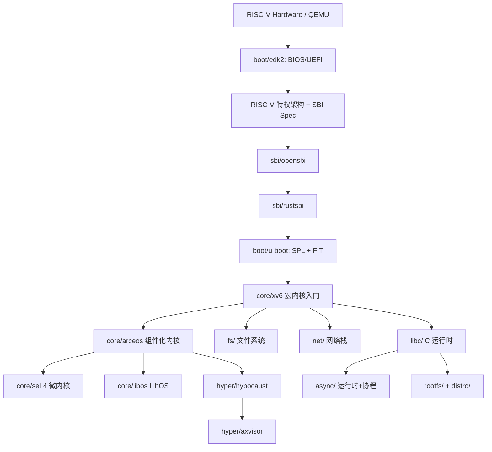

# RISC-V 全栈学习材料索引（material/）

> 本目录以 **submodule** 形式收录覆盖 RISC-V 全栈的真实系统源码——从硬件上电到用户态应用，
> 供操作系统/虚拟化/编译运行时学习时对照工业与学术实现。
>
> 纵向主线：**硬件 → BMC/BIOS → Bootloader/SPL → SBI → OS 内核 → Hypervisor → HAL → FS/Net/libc → rootfs/distro → async runtime**

## 纵向层次总览

```
┌──────────────────────────────────────────────────────┐
│  GUI / 图形栈  (gui/)                                  │
│  ├─ Toolkit (lvgl / slint / sdl)                      │
│  ├─ X11 (xserver / libx11 / libxcb)                   │
│  ├─ Wayland (wayland / wlroots / sway / hyprland)     │
│  └─ Userspace driver (mesa / libdrm)                  │
├──────────────────────────────────────────────────────┤
│  User Applications  (user/ , libc/ , async/)          │
├──────────────────────────────────────────────────────┤
│  Linux API 兼容层（epoll / io_uring / mmap / signal） │
├──────────────────────────────────────────────────────┤
│  Container / cgroup  (others/runc, containerd, lxc)   │
├──────────────────────────────────────────────────────┤
│  OS Kernel  (core/: 宏 / 微 / 外核 / LibOS / Unikernel)│
├──────────────────────────────────────────────────────┤
│  Hypervisor  (hyper/: axvisor / xen + qemu / crosvm)  │
├──────────────────────────────────────────────────────┤
│  Bootloader / SPL  (boot/u-boot, coreboot)            │
├──────────────────────────────────────────────────────┤
│  SBI Firmware  (sbi/)            ← RISC-V 起点         │
├──────────────────────────────────────────────────────┤
│  BIOS / UEFI / ACPI  (boot/edk2, grub2, acpica)       │
├──────────────────────────────────────────────────────┤
│  BMC / TEE  (boot/optee_os)                           │
├──────────────────────────────────────────────────────┤
│  RISC-V Hardware / QEMU / Spike                       │
└──────────────────────────────────────────────────────┘
```

> 这些子模块以「轻量引用」方式挂载（`.gitmodules` + commit 指针，不在本仓库内联内容）。
> 取用某个：`git submodule update --init material/<类别>/<项目>`。

---

## sbi/ — SBI 固件层

| 项目 | 语言 | Git | 说明 |
|---|---|---|---|
| opensbi | C | github.com/riscv-software-src/opensbi | RISC-V 官方参考实现，工业标准 |
| rustsbi | Rust | github.com/rustsbi/rustsbi | Rust 实现，含 Prototyper 动态固件 |
| riscv-pk | C | github.com/riscv-software-src/riscv-pk | 极简 M-mode 环境（BBL），含 pk 用户态模拟 |

**学习顺序：** opensbi（C，最规范）→ rustsbi（Rust 现代实现）→ riscv-pk（最简 SBI）。

## boot/ — 引导加载层

| 项目 | 语言 | 说明 |
|---|---|---|
| u-boot | C | 工业级 Universal Bootloader，SPL + FIT/ITB |
| barebox | C | 嵌入式 bootloader，API 类 U-Boot，代码更现代 |
| grub2 | C | GNU GRUB 2，桌面 Linux 主流引导器，多 FS/协议 |
| edk2 | C | UEFI 参考实现（TianoCore），工业 UEFI 基础 |
| optee_os | C | ARM TrustZone TEE（可信执行环境），安全固件层 |
| rboot | Rust | Rust UEFI 引导器 |
| coreboot | C | 极简 BIOS 替代品；编译期 device tree + chip ops |
| acpica | C | ACPI Component Architecture 参考实现（含 iasl AML 编译器）|

**学习顺序：** u-boot → barebox → grub2 → edk2 → optee_os → coreboot → acpica。

## rtos/ — 实时操作系统 / 嵌入式

| 项目 | 语言 | 说明 |
|---|---|---|
| FreeRTOS | C | 最广泛使用的嵌入式 RTOS |
| rt-thread | C | 国产工业 RTOS，生态完整 |
| uC-OS2 / uC-OS3 | C | 经典教学 RTOS 及其继任 |
| embassy | Rust | async Rust 嵌入式运行时，无 RTOS 抽象 |
| ariel-os | Rust | 安全/低功耗 IoT OS（Cortex-M / RISC-V / Xtensa）|
| RIOT-OS | C | 成熟 IoT OS，多架构 |

**Rust 嵌入式 HAL 抽象：** embedded-hal（GPIO/I2C/SPI/UART 通用 trait，v1.0 稳定）、cortex-m、svd2rust、riscv（嵌入式底层）。

## core/ — 操作系统内核

### 宏内核 / 教学内核
| 项目 | 语言 | 说明 |
|---|---|---|
| xv6 | C | MIT 教学内核，极简宏内核 |
| DragonOS | Rust+C | 社区驱动 Rust 宏内核，兼容 Linux ABI，多架构 |
| StarryOS | Rust | ArceOS 衍生的宏内核人格（组件组装出 Linux ABI）|
| NoAxiomOS | Rust | 实验性宏内核 |
| TornadoOS | Rust | 异步内核探索 |

### 组件化 / 模块化内核
| 项目 | 语言 | 说明 |
|---|---|---|
| **arceos** | Rust | 组件化 Unikernel，可组装成宏内核（本课主角）|
| asterinas | Rust | framekernel（框内核）：微内核式隔离 + 宏内核性能折中，特权代码收敛进最小 TCB |
| Theseus | Rust | 组件内存安全内核，学术研究 |

### 微内核
| 项目 | 语言 | 说明 |
|---|---|---|
| seL4 | C+Haskell | 形式化验证微内核 |
| Zircon / zCore | C++ / Rust | Google Fuchsia 微内核 / 其 Rust 重实现 |
| fuchsia | C++/Rust | Fuchsia 完整源码（DFv2 驱动框架 + Zircon + FIDL）|

### 外核 / SASOS / Unikernel / LibOS
| 项目 | 语言 | 范式 | 说明 |
|---|---|---|---|
| jos | C | 外核 | MIT 6.828 教学外核经典 |
| BareMetal | x86_64 asm | SASOS | 单地址空间 + 外核思想，HPC 场景 |
| unikraft | C | Unikernel | 工业级 Unikernel 构建框架 |
| biscuit | Go | Unikernel | Go 写宏内核（GC+goroutine 进内核空间）|
| tamago | Go | Unikernel | Go 裸金属框架，直接跑在 MCU |
| HermitOS | Rust | LibOS | Rust LibOS，运行在 Unikernel 上 |
| MirageOS | OCaml | LibOS | OCaml Unikernel 框架 |
| rumprun | C | LibOS | NetBSD rump 内核 Unikernel 化 |

> **外核 vs SASOS vs Unikernel：** 外核（jos）内核只暴露硬件资源、多地址空间；SASOS（BareMetal）单地址空间无进程隔离；Unikernel = SASOS + 单应用 + 主流语言。

### 其它 OS 内核（驱动系统设计 / 兼容路径横向参考）
freebsd（LinuxKPI source-level 兼容）、netbsd（rump kernel）、illumos（DDI/DKI + SPL）、reactos（NT .sys ABI 兼容）、haiku（BeOS C++ kit）、rust-for-linux（Linux 主线 Rust 驱动 binding）、android-kernel（GKI / KABI 稳定）。

## hyper/ — 虚拟化层

| 项目 | 类型 | 说明 |
|---|---|---|
| axvisor | Type-1, Rust | ArceOS 基础的 Hypervisor |
| bao-hypervisor | Type-1, C | 静态分区 Hypervisor，安全关键 |
| hypocaust / hypocaust-2 | Type-1, Rust | RISC-V H 扩展教学 Hypervisor |
| RVM1.5 | Type-1.5, Rust | Linux 宿主上的 Type-1.5 |
| rHyper / rcore-vmm | Rust | rCore 系列 Hypervisor / 用户态 VMM |
| xen | Type-1, C | 经典工业 Type-1（arm/ppc/riscv/x86 四架构）|
| machina | 模拟器(JIT TCG), Rust | QEMU 的 Rust 重写（RISC-V + LoongArch64 全系统模拟）|

**工业虚拟化栈（rust-vmm 系）：** qemu、crosvm、firecracker、cloud-hypervisor、acrn-hypervisor，以及 vm-memory / vm-virtio / kvm-bindings / kvm-ioctls / vhost 等 crate；kvmtool / rvvm / kvm-unit-tests。

> **学习顺序：** 概念入门 → Type-1 教学（hypocaust/rustyvisor）→ Type-1.5（RVM1.5）→ 工业 Type-1（xen/bao）→ 组件化（axvisor）→ 云原生固件 → 工具与模拟器。

## hal/ — 硬件抽象层
polyhal（多架构 HAL，供上层内核统一调用）。

## fs/ — 文件系统

- **VFS 抽象**：super_block / inode / dentry / file 四大对象（落实在内核源码，见 linux-fs sparse checkout）。
- **教学型**：easyfs（rCore 教学简易 FS，~1K 行 Rust）。
- **工业块设备 FS**：ext2-rs、ext4_rs、lwext4_rust、fatfs、littlefs。
- **用户态 FS 框架**：libfuse、fuse-ext2、spdk（用户态 NVMe）。
- **现代内核 VFS**：arceos axfs（trait 风现代 VFS）、TornadoOS async-fat32、DragonOS filesystem、xv6 fs。

## net/ — 网络栈
lwip（嵌入式 TCP/IP）、smoltcp（Rust 无 alloc）、rustls（Rust TLS）、dpdk（用户态网络驱动框架）。

## gui/ — 图形界面 / 图形栈

- **X.Org 系**：xserver、libx11、libxcb。
- **Wayland 系**：wayland、wayland-protocols、wlroots、sway、hyprland。
- **GPU userspace driver**：mesa（OpenGL/Vulkan）、libdrm。
- **嵌入式/跨平台 GUI**：lvgl、slint、sdl。

> 图形栈 7 层：应用 → toolkit → 协议 → server/compositor → mesa/Vulkan loader → libdrm → DRM/KMS。

## libc/ — C 运行时库
musl、relibc（Rust C 库）、uclibc-ng、picolibc、baselibc、newlib、compiler-rt、utf8proc、libcxx。

## rootfs/ — 根文件系统构建
buildroot、busybox、tgoskits、linux-compat-tests。

## distro/ — Linux 发行版构建
YoctoPoky、openwrt、openRuyi、ruyi-tutorials（LFS 风教程）。

## async/ — 异步运行时与协程库

- **Rust 异步运行时**：tokio（工作窃取）、monoio（io_uring 单线程）、async-std、smol（~1500 行最小执行器）。
- **Rust 协程库**：corosensei（有栈）、may（M:N goroutine 风）、genawaiter（Generator）、futures-rs（无栈，Future/Stream trait）。
- **Zig 协程库**：zigcoro、zap、libxev。
- **AsyncOS 家族**（异步内核研究合集）：AsyncOS-site、rCore-N（vDSO 调度器+用户态中断）、rel4_kernel（seL4 Rust 重写）、embassy_preempt、taic / uintr（用户态中断硬件+ISA）、osblog、os-checker。

## user/ — 用户态运行时垫片
compiler-builtins（memcpy/memset 等底层内置）、relibc。

## others/ — GPGPU / 容器 / 可观测性 / 内核测试 / unwinding

- **GPGPU / OpenCL**：vortex（RISC-V 开源 GPGPU）、pocl-upstream、pocl-vortex。
- **容器 + OCI**：runtime-spec / image-spec / distribution-spec、runc、containerd、lxc、podman、cri-o。
- **可观测性 / eBPF**：bpftrace、bcc、libbpf、aya。
- **backtrace / unwinding**：libunwind（DWARF / .eh_frame 栈展开）。
- **内核测试基础设施**：ltp（业界标准 syscall 测试）、Open POSIX Test Suite、xfstests、musl libc-test、syzkaller、trinity、x-cov、SysABI。

---

## 推荐学习路径



> 各项目均为公开开源仓库，以 submodule 引用其上游；目录层次与名称同本地材料库一致。
